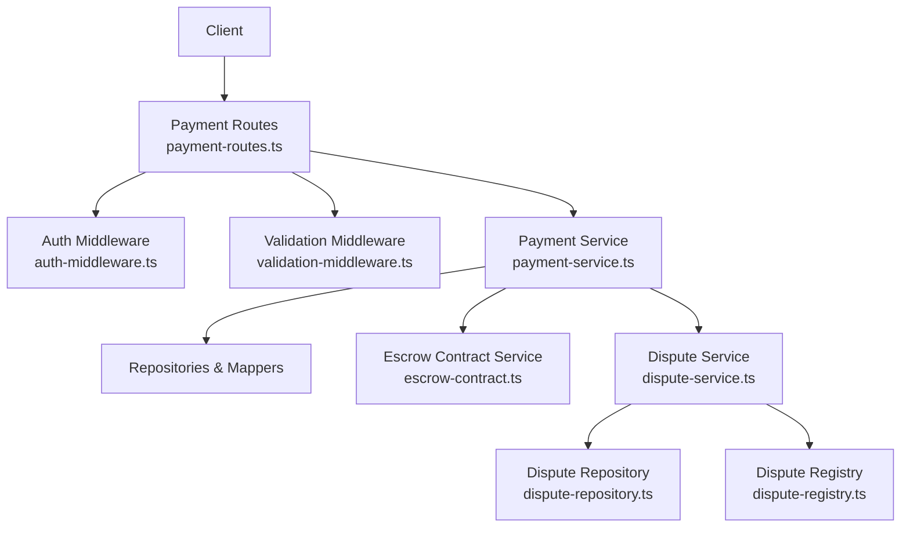
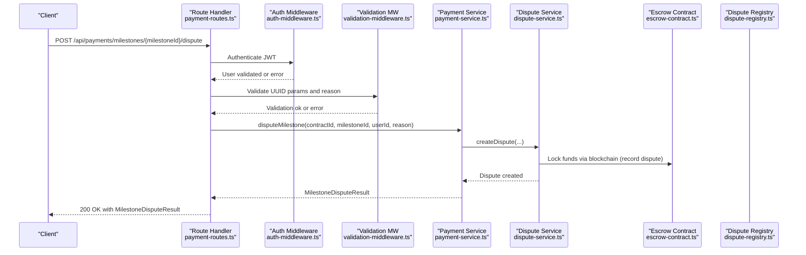
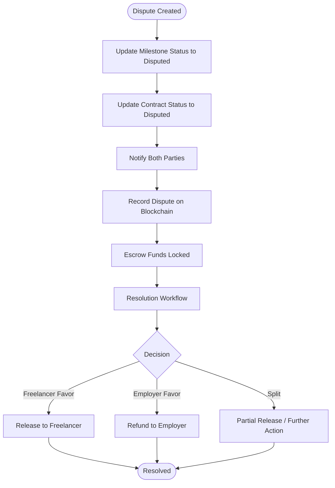
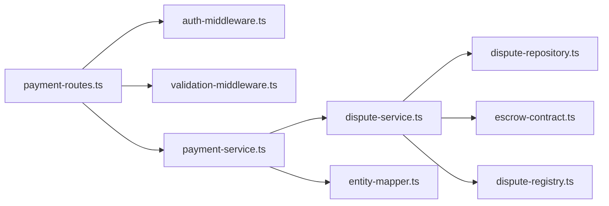

# Milestone Dispute

<cite>
**Referenced Files in This Document**
- [payment-routes.ts](file://src/routes/payment-routes.ts)
- [payment-service.ts](file://src/services/payment-service.ts)
- [auth-middleware.ts](file://src/middleware/auth-middleware.ts)
- [validation-middleware.ts](file://src/middleware/validation-middleware.ts)
- [dispute-service.ts](file://src/services/dispute-service.ts)
- [dispute-repository.ts](file://src/repositories/dispute-repository.ts)
- [escrow-contract.ts](file://src/services/escrow-contract.ts)
- [dispute-registry.ts](file://src/services/dispute-registry.ts)
- [entity-mapper.ts](file://src/utils/entity-mapper.ts)
</cite>

## Table of Contents
1. [Introduction](#introduction)
2. [Project Structure](#project-structure)
3. [Core Components](#core-components)
4. [Architecture Overview](#architecture-overview)
5. [Detailed Component Analysis](#detailed-component-analysis)
6. [Dependency Analysis](#dependency-analysis)
7. [Performance Considerations](#performance-considerations)
8. [Troubleshooting Guide](#troubleshooting-guide)
9. [Conclusion](#conclusion)
10. [Appendices](#appendices)

## Introduction
This document describes the POST /api/payments/milestones/{milestoneId}/dispute endpoint for the FreelanceXchain system. It covers the HTTP method, URL pattern, path parameter, required query parameter, and request body. It explains that either party (freelancer or employer) can dispute a milestone, which locks the funds and creates a dispute record for resolution. Authentication uses JWT with UUID validation. The request flow includes user authentication, contractId validation, reason validation, service invocation via disputeMilestone, and response handling. The 200 success response schema (MilestoneDisputeResult) is documented, along with error responses for 400, 401, 403, and 404. A practical example demonstrates a freelancer disputing a milestone due to unsatisfactory requirements. Finally, it explains how this endpoint integrates with the dispute resolution system and locks associated escrow funds.

## Project Structure
The milestone dispute endpoint is implemented in the payment routes and payment service, with support from authentication and validation middleware. Disputes are persisted and integrated with blockchain registries and escrow contracts.

**Diagram sources**
- [payment-routes.ts](file://src/routes/payment-routes.ts#L308-L359)
- [auth-middleware.ts](file://src/middleware/auth-middleware.ts#L25-L70)
- [validation-middleware.ts](file://src/middleware/validation-middleware.ts#L782-L815)
- [payment-service.ts](file://src/services/payment-service.ts#L355-L480)
- [dispute-service.ts](file://src/services/dispute-service.ts#L63-L206)
- [dispute-repository.ts](file://src/repositories/dispute-repository.ts#L1-L136)
- [escrow-contract.ts](file://src/services/escrow-contract.ts#L1-L200)
- [dispute-registry.ts](file://src/services/dispute-registry.ts#L90-L137)

**Section sources**
- [payment-routes.ts](file://src/routes/payment-routes.ts#L264-L359)
- [auth-middleware.ts](file://src/middleware/auth-middleware.ts#L25-L70)
- [validation-middleware.ts](file://src/middleware/validation-middleware.ts#L782-L815)

## Core Components
- Endpoint definition and Swagger schema for the dispute route.
- Route handler that enforces JWT authentication, validates UUID parameters, checks for required contractId query parameter, validates reason in request body, and invokes disputeMilestone.
- Payment service disputeMilestone function that validates contract and milestone ownership, checks milestone status, creates a dispute record, updates milestone and contract statuses, and sends notifications.
- Dispute service that persists disputes, records on blockchain, updates milestone and contract statuses, and integrates with escrow for resolution outcomes.
- Validation middleware that ensures UUID format for path parameters and provides standardized error responses.

**Section sources**
- [payment-routes.ts](file://src/routes/payment-routes.ts#L264-L359)
- [payment-service.ts](file://src/services/payment-service.ts#L355-L480)
- [dispute-service.ts](file://src/services/dispute-service.ts#L63-L206)
- [validation-middleware.ts](file://src/middleware/validation-middleware.ts#L782-L815)

## Architecture Overview
The endpoint follows a layered architecture:
- HTTP layer: route handler validates inputs and delegates to service layer.
- Service layer: orchestrates repository and external integrations (notifications, blockchain, escrow).
- Persistence: dispute repository stores dispute records.
- External systems: blockchain dispute registry and escrow contract service.

**Diagram sources**
- [payment-routes.ts](file://src/routes/payment-routes.ts#L308-L359)
- [auth-middleware.ts](file://src/middleware/auth-middleware.ts#L25-L70)
- [validation-middleware.ts](file://src/middleware/validation-middleware.ts#L782-L815)
- [payment-service.ts](file://src/services/payment-service.ts#L355-L480)
- [dispute-service.ts](file://src/services/dispute-service.ts#L63-L206)
- [escrow-contract.ts](file://src/services/escrow-contract.ts#L1-L200)
- [dispute-registry.ts](file://src/services/dispute-registry.ts#L90-L137)

## Detailed Component Analysis

### Endpoint Definition and Request Flow
- Method: POST
- URL pattern: /api/payments/milestones/{milestoneId}/dispute
- Path parameter:
  - milestoneId (UUID)
- Required query parameter:
  - contractId (UUID)
- Request body:
  - reason (string, required)
- Authentication:
  - Bearer JWT token in Authorization header
- Validation:
  - UUID validation for milestoneId
  - Presence and type validation for reason
  - Presence of contractId query parameter

The route handler performs:
- JWT authentication via authMiddleware
- UUID validation for milestoneId via validateUUID
- ContractId presence check
- Reason presence/type check
- Invocation of disputeMilestone
- Error mapping to 400/401/403/404 based on service error codes
- Success response with MilestoneDisputeResult

**Section sources**
- [payment-routes.ts](file://src/routes/payment-routes.ts#L264-L359)
- [auth-middleware.ts](file://src/middleware/auth-middleware.ts#L25-L70)
- [validation-middleware.ts](file://src/middleware/validation-middleware.ts#L782-L815)

### Payment Service: disputeMilestone
Responsibilities:
- Validate contract existence and that the initiator is a party to the contract.
- Validate project and milestone existence and status (not approved, not already disputed).
- Create a dispute record (in-memory store in simulation).
- Update milestone status to disputed and contract status to disputed.
- Notify both parties.
- Return MilestoneDisputeResult with milestoneId, status=disputed, disputeId, and disputeCreated=true.

Integration points:
- Repository access for contract and project data.
- Notification service for dispute created notifications.
- Blockchain integration via dispute-registry and escrow-contract services (see Dispute Service for blockchain actions).

**Section sources**
- [payment-service.ts](file://src/services/payment-service.ts#L355-L480)

### Dispute Service: createDispute and Blockchain Integration
Responsibilities:
- Validate contract and project existence.
- Verify initiator is a party to the contract.
- Validate milestone exists and is not already disputed or approved.
- Create dispute entity with status=open.
- Persist dispute via disputeRepository.
- Record dispute on blockchain registry with wallets and amount.
- Update milestone status to disputed and contract status to disputed.
- Notify both parties.
- Return created dispute.

Blockchain and Escrow Integration:
- Dispute registry records dispute metadata and tracks user stats.
- Agreement contract is marked as disputed.
- Escrow contract status reflects dispute lifecycle during resolution.

**Section sources**
- [dispute-service.ts](file://src/services/dispute-service.ts#L63-L206)
- [dispute-repository.ts](file://src/repositories/dispute-repository.ts#L1-L136)
- [dispute-registry.ts](file://src/services/dispute-registry.ts#L90-L137)
- [escrow-contract.ts](file://src/services/escrow-contract.ts#L1-L200)

### Response Schema: MilestoneDisputeResult
- milestoneId: string (UUID)
- status: "disputed"
- disputeId: string (UUID)
- disputeCreated: boolean

This schema is defined in the route’s Swagger documentation and returned by the service upon successful dispute creation.

**Section sources**
- [payment-routes.ts](file://src/routes/payment-routes.ts#L47-L59)

### Error Responses
- 400 Bad Request:
  - Missing or invalid reason in request body.
  - Missing or invalid contractId query parameter.
  - Invalid UUID format for milestoneId.
- 401 Unauthorized:
  - Missing or invalid Authorization header.
  - Invalid/expired JWT token.
- 403 Forbidden:
  - Only contract parties (freelancer or employer) can dispute a milestone.
- 404 Not Found:
  - Contract or milestone not found.

The route handler maps service error codes to appropriate HTTP status codes.

**Section sources**
- [payment-routes.ts](file://src/routes/payment-routes.ts#L308-L359)
- [auth-middleware.ts](file://src/middleware/auth-middleware.ts#L25-L70)
- [validation-middleware.ts](file://src/middleware/validation-middleware.ts#L782-L815)
- [payment-service.ts](file://src/services/payment-service.ts#L355-L480)
- [dispute-service.ts](file://src/services/dispute-service.ts#L63-L206)

### Practical Example: Freelancer Disputes a Milestone
Scenario:
- A freelancer initiates a dispute for milestoneId X due to unsatisfactory requirements.
- The freelancer calls POST /api/payments/milestones/X/dispute with:
  - Authorization: Bearer <JWT>
  - Query: contractId=Y (UUID)
  - Body: { reason: "Requirements were not met as specified" }
- The system validates JWT, UUIDs, reason, and contract/milestone existence/status.
- It creates a dispute record, sets milestone and contract status to disputed, and notifies both parties.
- The response returns MilestoneDisputeResult indicating status=disputed and disputeCreated=true.

Outcome:
- Funds remain locked in the escrow until the dispute is resolved.
- The dispute enters the resolution workflow managed by the dispute service.

**Section sources**
- [payment-routes.ts](file://src/routes/payment-routes.ts#L264-L359)
- [payment-service.ts](file://src/services/payment-service.ts#L355-L480)
- [dispute-service.ts](file://src/services/dispute-service.ts#L63-L206)

### Integration with Dispute Resolution and Escrow Lock
- Dispute Creation:
  - Payment service creates a dispute record and updates statuses.
  - Dispute service persists the record and records the dispute on the blockchain registry.
- Escrow Lock:
  - The blockchain registry tracks dispute records and user statistics.
  - During resolution, depending on the decision, funds are released to the freelancer, refunded to the employer, or handled according to split decisions.
- Contract Status:
  - Contract status transitions to disputed while any milestone is under dispute and reverts to active when all disputes are resolved.

**Diagram sources**
- [payment-service.ts](file://src/services/payment-service.ts#L436-L449)
- [dispute-service.ts](file://src/services/dispute-service.ts#L175-L206)
- [dispute-registry.ts](file://src/services/dispute-registry.ts#L90-L137)
- [escrow-contract.ts](file://src/services/escrow-contract.ts#L138-L199)

## Dependency Analysis
Key dependencies and relationships:
- Route depends on auth-middleware and validation-middleware for security and input validation.
- Route delegates to payment-service.disputeMilestone.
- Payment service coordinates with repositories and notification services.
- Dispute service manages persistence and blockchain interactions.
- Escrow contract service participates in fund locking and resolution outcomes.

**Diagram sources**
- [payment-routes.ts](file://src/routes/payment-routes.ts#L308-L359)
- [auth-middleware.ts](file://src/middleware/auth-middleware.ts#L25-L70)
- [validation-middleware.ts](file://src/middleware/validation-middleware.ts#L782-L815)
- [payment-service.ts](file://src/services/payment-service.ts#L355-L480)
- [dispute-service.ts](file://src/services/dispute-service.ts#L63-L206)
- [dispute-repository.ts](file://src/repositories/dispute-repository.ts#L1-L136)
- [escrow-contract.ts](file://src/services/escrow-contract.ts#L1-L200)
- [dispute-registry.ts](file://src/services/dispute-registry.ts#L90-L137)
- [entity-mapper.ts](file://src/utils/entity-mapper.ts#L198-L200)

**Section sources**
- [payment-routes.ts](file://src/routes/payment-routes.ts#L308-L359)
- [payment-service.ts](file://src/services/payment-service.ts#L355-L480)
- [dispute-service.ts](file://src/services/dispute-service.ts#L63-L206)

## Performance Considerations
- Input validation occurs before heavy operations, reducing unnecessary service calls.
- Dispute creation is lightweight; blockchain recording is asynchronous and logged for failures.
- Notifications are sent after status updates to ensure clients receive accurate state.
- Consider caching frequently accessed contract and project data if scalability becomes a concern.

[No sources needed since this section provides general guidance]

## Troubleshooting Guide
Common issues and resolutions:
- 401 Unauthorized:
  - Ensure Authorization header is present and formatted as Bearer <token>.
  - Verify the token is valid and not expired.
- 400 Bad Request:
  - Missing reason in request body or invalid type.
  - Missing contractId query parameter.
  - Invalid UUID format for milestoneId.
- 403 Forbidden:
  - Only the freelancer or employer associated with the contract can dispute a milestone.
- 404 Not Found:
  - Contract or milestone not found; verify contractId and milestoneId.
- Duplicate or Invalid Status:
  - Cannot dispute an approved milestone or a milestone already under dispute.

**Section sources**
- [auth-middleware.ts](file://src/middleware/auth-middleware.ts#L25-L70)
- [validation-middleware.ts](file://src/middleware/validation-middleware.ts#L782-L815)
- [payment-service.ts](file://src/services/payment-service.ts#L355-L480)
- [dispute-service.ts](file://src/services/dispute-service.ts#L63-L206)

## Conclusion
The POST /api/payments/milestones/{milestoneId}/dispute endpoint enables either party to initiate a dispute, which locks funds and creates a dispute record. The implementation enforces JWT authentication, validates UUIDs and request parameters, and integrates with the dispute resolution system and escrow contracts. The response schema provides clear confirmation of the dispute creation and current status.

[No sources needed since this section summarizes without analyzing specific files]

## Appendices

### API Definition Summary
- Method: POST
- URL: /api/payments/milestones/{milestoneId}/dispute
- Path parameters:
  - milestoneId (UUID)
- Query parameters:
  - contractId (UUID, required)
- Request body:
  - reason (string, required)
- Authentication:
  - Bearer JWT
- Success response:
  - 200 OK with MilestoneDisputeResult
- Error responses:
  - 400 Bad Request (validation errors)
  - 401 Unauthorized (missing/invalid token)
  - 403 Forbidden (unauthorized party)
  - 404 Not Found (contract or milestone not found)

**Section sources**
- [payment-routes.ts](file://src/routes/payment-routes.ts#L264-L359)
- [payment-service.ts](file://src/services/payment-service.ts#L355-L480)