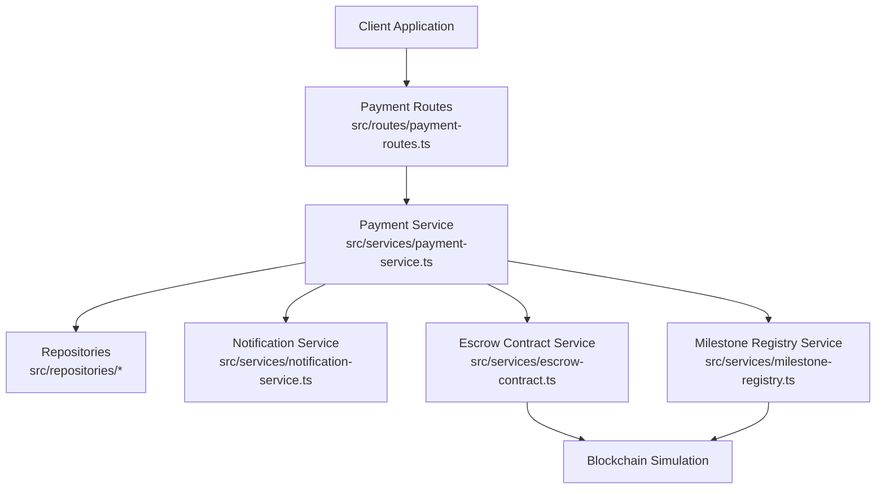
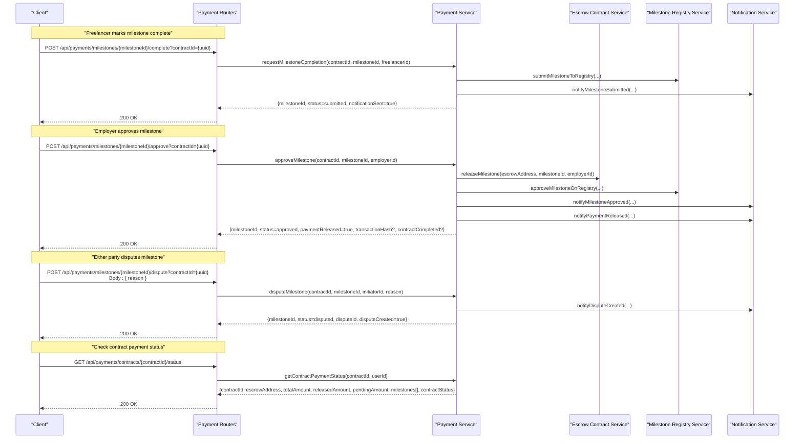
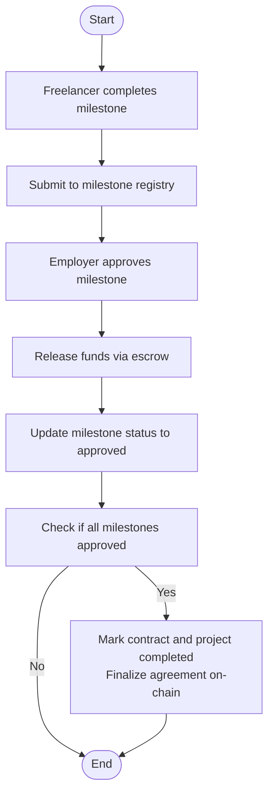
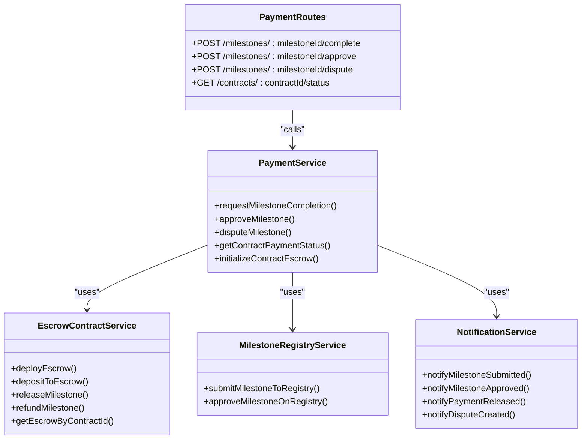

# Payment API

<cite>
**Referenced Files in This Document**
- [payment-routes.ts](file://src/routes/payment-routes.ts)
- [payment-service.ts](file://src/services/payment-service.ts)
- [escrow-contract.ts](file://src/services/escrow-contract.ts)
- [milestone-registry.ts](file://src/services/milestone-registry.ts)
- [notification-service.ts](file://src/services/notification-service.ts)
- [auth-middleware.ts](file://src/middleware/auth-middleware.ts)
- [validation-middleware.ts](file://src/middleware/validation-middleware.ts)
- [payment-repository.ts](file://src/repositories/payment-repository.ts)
- [API-DOCUMENTATION.md](file://docs/API-DOCUMENTATION.md)
</cite>

## Table of Contents
1. [Introduction](#introduction)
2. [Project Structure](#project-structure)
3. [Core Components](#core-components)
4. [Architecture Overview](#architecture-overview)
5. [Detailed Component Analysis](#detailed-component-analysis)
6. [Dependency Analysis](#dependency-analysis)
7. [Performance Considerations](#performance-considerations)
8. [Troubleshooting Guide](#troubleshooting-guide)
9. [Conclusion](#conclusion)
10. [Appendices](#appendices)

## Introduction
This document provides comprehensive API documentation for payment processing endpoints in the FreelanceXchain system. It covers milestone completion, approval, dispute creation, and contract payment status retrieval. It explains authentication requirements (JWT Bearer), request/response schemas, query parameters, and the end-to-end payment flow from milestone completion to approval and potential dispute resolution. It also outlines how the API integrates with blockchain transactions for payment release and milestone registry updates.

## Project Structure
The payment API is implemented as Express routes backed by a service layer that orchestrates database updates, notifications, and blockchain interactions. The key files are:
- Route handlers define endpoints, authentication, and parameter validation.
- Service layer enforces business rules, updates domain models, and triggers blockchain operations.
- Blockchain service simulates transactions and maintains in-memory state for escrow and milestone registry.
- Notification service emits system notifications upon state changes.
- Validation and authentication middleware enforce JWT and parameter correctness.

**Diagram sources**
- [payment-routes.ts](file://src/routes/payment-routes.ts#L1-L426)
- [payment-service.ts](file://src/services/payment-service.ts#L1-L643)
- [escrow-contract.ts](file://src/services/escrow-contract.ts#L1-L327)
- [milestone-registry.ts](file://src/services/milestone-registry.ts#L1-L276)
- [notification-service.ts](file://src/services/notification-service.ts#L1-L316)

**Section sources**
- [payment-routes.ts](file://src/routes/payment-routes.ts#L1-L426)
- [payment-service.ts](file://src/services/payment-service.ts#L1-L643)

## Core Components
- Payment Routes: Expose endpoints for completing milestones, approving milestones, disputing milestones, and retrieving contract payment status. All endpoints require JWT Bearer authentication.
- Payment Service: Implements business logic for milestone lifecycle, contract completion checks, and blockchain integration points.
- Escrow Contract Service: Simulates deployment, funding, milestone release, and refund operations with blockchain receipts.
- Milestone Registry Service: Records milestone submissions and approvals on-chain for verifiable work history.
- Notification Service: Sends notifications to parties upon milestone submission, approval, payment release, and dispute creation.
- Validation and Auth Middleware: Enforce JWT Bearer format, UUID parameter validation, and user authorization.

**Section sources**
- [payment-routes.ts](file://src/routes/payment-routes.ts#L1-L426)
- [payment-service.ts](file://src/services/payment-service.ts#L1-L643)
- [escrow-contract.ts](file://src/services/escrow-contract.ts#L1-L327)
- [milestone-registry.ts](file://src/services/milestone-registry.ts#L1-L276)
- [notification-service.ts](file://src/services/notification-service.ts#L1-L316)
- [auth-middleware.ts](file://src/middleware/auth-middleware.ts#L1-L101)
- [validation-middleware.ts](file://src/middleware/validation-middleware.ts#L782-L815)

## Architecture Overview
The payment flow integrates REST endpoints with internal services and blockchain simulation:
- Freelancer completes a milestone via a POST endpoint; the service updates the project’s milestone status, submits to the milestone registry, and notifies the employer.
- Employer approves the milestone via another POST endpoint; the service releases funds via the escrow contract, updates statuses, and notifies the freelancer. If all milestones are approved, the contract and project are marked completed and the agreement is finalized on-chain.
- Either party can dispute a milestone via a POST endpoint; the service creates a dispute record, updates statuses, and notifies both parties.
- Contract payment status is retrieved via a GET endpoint that computes totals and milestone statuses.

**Diagram sources**
- [payment-routes.ts](file://src/routes/payment-routes.ts#L100-L423)
- [payment-service.ts](file://src/services/payment-service.ts#L86-L543)
- [escrow-contract.ts](file://src/services/escrow-contract.ts#L138-L199)
- [milestone-registry.ts](file://src/services/milestone-registry.ts#L63-L186)
- [notification-service.ts](file://src/services/notification-service.ts#L212-L301)

## Detailed Component Analysis

### Endpoint Definitions and Schemas

#### Authentication
- All protected endpoints require a Bearer token in the Authorization header.
- Token validation is performed by the authentication middleware.

**Section sources**
- [API-DOCUMENTATION.md](file://docs/API-DOCUMENTATION.md#L7-L14)
- [auth-middleware.ts](file://src/middleware/auth-middleware.ts#L1-L101)

#### POST /api/payments/milestones/{milestoneId}/complete
- Purpose: Freelancer marks a milestone as complete.
- Path parameters:
  - milestoneId: UUID (required)
- Query parameters:
  - contractId: UUID (required)
- Authentication: Bearer JWT
- Request body: None
- Responses:
  - 200: MilestoneCompletionResult
  - 400: Validation error (invalid UUID or missing contractId)
  - 401: Unauthorized
  - 404: Contract or milestone not found

Response schema (MilestoneCompletionResult):
- milestoneId: string
- status: "submitted"
- notificationSent: boolean

Notes:
- Validates UUID in path and presence of contractId query parameter.
- Only the freelancer associated with the contract can request completion.
- Updates project milestone status to submitted and notifies the employer.

**Section sources**
- [payment-routes.ts](file://src/routes/payment-routes.ts#L100-L178)
- [payment-service.ts](file://src/services/payment-service.ts#L86-L193)
- [validation-middleware.ts](file://src/middleware/validation-middleware.ts#L782-L815)

#### POST /api/payments/milestones/{milestoneId}/approve
- Purpose: Employer approves milestone completion and releases payment.
- Path parameters:
  - milestoneId: UUID (required)
- Query parameters:
  - contractId: UUID (required)
- Authentication: Bearer JWT
- Request body: None
- Responses:
  - 200: MilestoneApprovalResult
  - 400: Validation error
  - 401: Unauthorized
  - 404: Contract or milestone not found

Response schema (MilestoneApprovalResult):
- milestoneId: string
- status: "approved"
- paymentReleased: boolean
- transactionHash: string (optional)
- contractCompleted: boolean

Notes:
- Only the employer associated with the contract can approve.
- Releases funds via the escrow contract and updates milestone status.
- If all milestones are approved, marks the contract and project as completed and finalizes the agreement on-chain.

**Section sources**
- [payment-routes.ts](file://src/routes/payment-routes.ts#L183-L261)
- [payment-service.ts](file://src/services/payment-service.ts#L201-L352)
- [escrow-contract.ts](file://src/services/escrow-contract.ts#L138-L199)

#### POST /api/payments/milestones/{milestoneId}/dispute
- Purpose: Either party disputes a milestone, locking funds and creating a dispute record.
- Path parameters:
  - milestoneId: UUID (required)
- Query parameters:
  - contractId: UUID (required)
- Authentication: Bearer JWT
- Request body:
  - reason: string (required)
- Responses:
  - 200: MilestoneDisputeResult
  - 400: Validation error (missing reason or invalid UUID)
  - 401: Unauthorized
  - 404: Contract or milestone not found

Response schema (MilestoneDisputeResult):
- milestoneId: string
- status: "disputed"
- disputeId: string
- disputeCreated: boolean

Notes:
- Initiator must be a party to the contract.
- Creates an in-memory dispute record and updates statuses.
- Marks the contract as disputed and notifies both parties.

**Section sources**
- [payment-routes.ts](file://src/routes/payment-routes.ts#L266-L359)
- [payment-service.ts](file://src/services/payment-service.ts#L355-L480)
- [validation-middleware.ts](file://src/middleware/validation-middleware.ts#L782-L815)

#### GET /api/payments/contracts/{contractId}/status
- Purpose: Retrieve detailed payment status for a contract including milestone statuses.
- Path parameters:
  - contractId: UUID (required)
- Authentication: Bearer JWT
- Request body: None
- Responses:
  - 200: ContractPaymentStatus
  - 400: Validation error
  - 401: Unauthorized
  - 404: Contract not found

Response schema (ContractPaymentStatus):
- contractId: string
- escrowAddress: string
- totalAmount: number
- releasedAmount: number
- pendingAmount: number
- milestones: array of:
  - id: string
  - title: string
  - amount: number
  - status: enum("pending","in_progress","submitted","approved","disputed")
- contractStatus: string

Notes:
- Only parties to the contract can view the status.
- Computes totals from project milestone statuses.

**Section sources**
- [payment-routes.ts](file://src/routes/payment-routes.ts#L364-L423)
- [payment-service.ts](file://src/services/payment-service.ts#L483-L543)

### Payment Flow and Conditions

#### From Completion to Approval
- Freelancer completes a milestone; the system updates the milestone status to submitted and records the event on-chain via the milestone registry.
- Employer approves the milestone; the system releases funds via the escrow contract, updates statuses, and notifies both parties. If all milestones are approved, the contract and project are marked completed and the agreement is finalized on-chain.

**Diagram sources**
- [payment-service.ts](file://src/services/payment-service.ts#L201-L352)
- [escrow-contract.ts](file://src/services/escrow-contract.ts#L138-L199)
- [milestone-registry.ts](file://src/services/milestone-registry.ts#L138-L186)

#### Dispute Conditions
- A milestone cannot be disputed if it is already approved or already under dispute.
- Only parties to the contract (freelancer or employer) can initiate a dispute.
- On dispute, the system creates a dispute record, updates milestone and contract statuses, and notifies both parties.

**Section sources**
- [payment-service.ts](file://src/services/payment-service.ts#L355-L480)

### Blockchain Integration Details
- Escrow deployment and funding:
  - The service deploys an escrow contract and funds it with the project budget.
  - The escrow stores balances and milestone statuses.
- Milestone release:
  - Only the employer can release a milestone; the service submits a transaction and confirms it, updating the escrow state.
- Milestone registry:
  - Submissions and approvals are recorded on-chain with hashes derived from milestone and contract identifiers.
- Notifications:
  - The system sends notifications for milestone submission, approval, payment release, and dispute creation.

**Section sources**
- [payment-service.ts](file://src/services/payment-service.ts#L591-L642)
- [escrow-contract.ts](file://src/services/escrow-contract.ts#L38-L199)
- [milestone-registry.ts](file://src/services/milestone-registry.ts#L63-L186)
- [notification-service.ts](file://src/services/notification-service.ts#L212-L301)

### Client Implementation Examples

#### Example: Complete a Milestone
- Endpoint: POST /api/payments/milestones/{milestoneId}/complete?contractId={uuid}
- Headers: Authorization: Bearer <access_token>
- Body: empty
- Expected response: 200 with MilestoneCompletionResult

**Section sources**
- [payment-routes.ts](file://src/routes/payment-routes.ts#L100-L178)

#### Example: Check Contract Payment Status
- Endpoint: GET /api/payments/contracts/{contractId}/status
- Headers: Authorization: Bearer <access_token>
- Query: contractId (UUID)
- Expected response: 200 with ContractPaymentStatus

**Section sources**
- [payment-routes.ts](file://src/routes/payment-routes.ts#L364-L423)

## Dependency Analysis

**Diagram sources**
- [payment-routes.ts](file://src/routes/payment-routes.ts#L1-L426)
- [payment-service.ts](file://src/services/payment-service.ts#L1-L643)
- [escrow-contract.ts](file://src/services/escrow-contract.ts#L1-L327)
- [milestone-registry.ts](file://src/services/milestone-registry.ts#L1-L276)
- [notification-service.ts](file://src/services/notification-service.ts#L1-L316)

**Section sources**
- [payment-routes.ts](file://src/routes/payment-routes.ts#L1-L426)
- [payment-service.ts](file://src/services/payment-service.ts#L1-L643)

## Performance Considerations
- Transaction simulation: The blockchain interactions are simulated in-memory. In production, replace with real RPC calls and handle asynchronous confirmation.
- Notification throughput: Batch notifications if many users are notified concurrently.
- Escrow state caching: Cache frequently accessed escrow states to reduce repeated computation.
- Pagination: The payment repository supports paginated queries for payment history; use it for efficient retrieval.

[No sources needed since this section provides general guidance]

## Troubleshooting Guide
Common issues and resolutions:
- Missing or invalid Authorization header: Ensure Bearer token is present and valid.
- Invalid UUID format: Verify milestoneId and contractId are valid UUIDs.
- Unauthorized actions: Only the freelancer (for completion) or employer (for approval/dispute) can perform respective actions.
- Not found resources: Ensure the contract and milestone exist and belong to the requesting user.
- Dispute preconditions: Cannot dispute an already approved or already disputed milestone.

**Section sources**
- [auth-middleware.ts](file://src/middleware/auth-middleware.ts#L1-L101)
- [validation-middleware.ts](file://src/middleware/validation-middleware.ts#L782-L815)
- [payment-service.ts](file://src/services/payment-service.ts#L86-L193)
- [payment-service.ts](file://src/services/payment-service.ts#L201-L352)
- [payment-service.ts](file://src/services/payment-service.ts#L355-L480)

## Conclusion
The FreelanceXchain payment API provides a clear, secure, and auditable flow for milestone completion, approval, and dispute resolution. It integrates with blockchain simulations for fund management and milestone registry, while maintaining robust authentication, validation, and notification mechanisms. Clients should follow the documented endpoints, parameter requirements, and response schemas to implement reliable payment workflows.

[No sources needed since this section summarizes without analyzing specific files]

## Appendices

### API Reference Summary
- Base URL: http://localhost:3000/api
- Interactive docs: http://localhost:3000/api-docs
- Authentication: Bearer JWT in Authorization header

Endpoints:
- POST /api/payments/milestones/{milestoneId}/complete?contractId={uuid}
- POST /api/payments/milestones/{milestoneId}/approve?contractId={uuid}
- POST /api/payments/milestones/{milestoneId}/dispute?contractId={uuid}
- GET /api/payments/contracts/{contractId}/status

**Section sources**
- [API-DOCUMENTATION.md](file://docs/API-DOCUMENTATION.md#L1-L14)
- [payment-routes.ts](file://src/routes/payment-routes.ts#L100-L423)