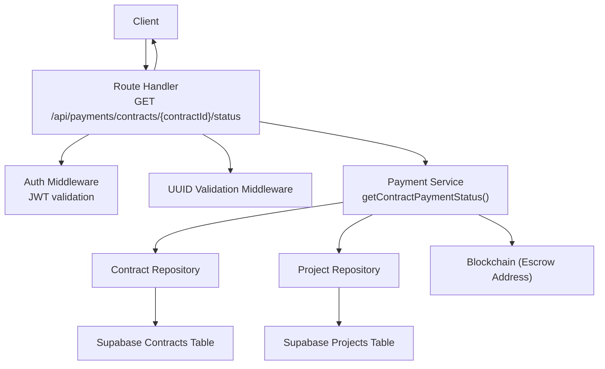
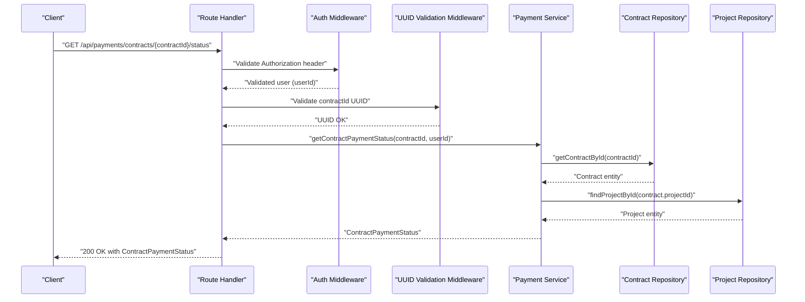
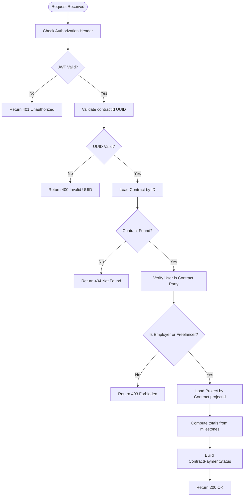
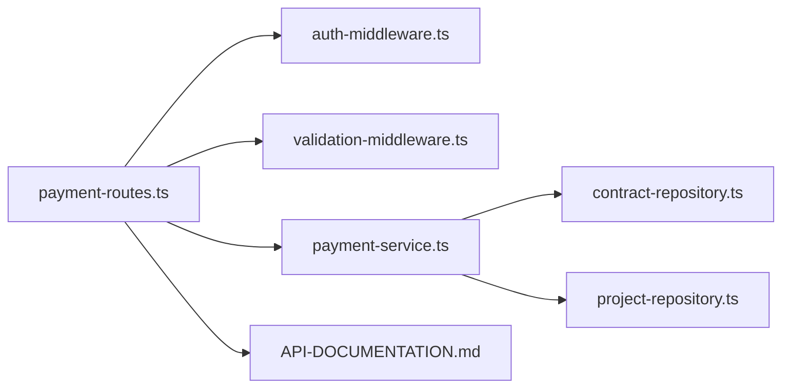

# Payment Status

<cite>
**Referenced Files in This Document**
- [payment-routes.ts](file://src/routes/payment-routes.ts)
- [payment-service.ts](file://src/services/payment-service.ts)
- [auth-middleware.ts](file://src/middleware/auth-middleware.ts)
- [validation-middleware.ts](file://src/middleware/validation-middleware.ts)
- [contract-repository.ts](file://src/repositories/contract-repository.ts)
- [project-repository.ts](file://src/repositories/project-repository.ts)
- [API-DOCUMENTATION.md](file://docs/API-DOCUMENTATION.md)
- [entity-mapper.ts](file://src/utils/entity-mapper.ts)
</cite>

## Table of Contents
1. [Introduction](#introduction)
2. [Project Structure](#project-structure)
3. [Core Components](#core-components)
4. [Architecture Overview](#architecture-overview)
5. [Detailed Component Analysis](#detailed-component-analysis)
6. [Dependency Analysis](#dependency-analysis)
7. [Performance Considerations](#performance-considerations)
8. [Troubleshooting Guide](#troubleshooting-guide)
9. [Conclusion](#conclusion)
10. [Appendices](#appendices)

## Introduction
This document describes the GET /api/payments/contracts/{contractId}/status endpoint in the FreelanceXchain system. It explains the endpoint’s purpose, authentication and validation requirements, request flow, response schema, and error handling. It also clarifies how the endpoint aggregates data from on-chain and off-chain sources to present a comprehensive payment overview for a given contract.

## Project Structure
The endpoint is implemented as part of the Payments module:
- Route handler: defines the HTTP method, URL pattern, path parameter, middleware, and response handling
- Service: computes the payment status by combining off-chain data (project and contract entities) and on-chain data (escrow address)
- Middleware: enforces JWT authentication and validates UUID parameters
- Repositories: provide access to contract and project entities
- Swagger/OpenAPI: documents the endpoint and response schema

**Diagram sources**
- [payment-routes.ts](file://src/routes/payment-routes.ts#L362-L423)
- [auth-middleware.ts](file://src/middleware/auth-middleware.ts#L25-L70)
- [validation-middleware.ts](file://src/middleware/validation-middleware.ts#L782-L800)
- [payment-service.ts](file://src/services/payment-service.ts#L483-L543)
- [contract-repository.ts](file://src/repositories/contract-repository.ts#L24-L34)
- [project-repository.ts](file://src/repositories/project-repository.ts#L39-L54)

**Section sources**
- [payment-routes.ts](file://src/routes/payment-routes.ts#L362-L423)
- [API-DOCUMENTATION.md](file://docs/API-DOCUMENTATION.md#L347-L392)

## Core Components
- Endpoint definition and request flow:
  - HTTP method: GET
  - URL pattern: /api/payments/contracts/{contractId}/status
  - Path parameter: contractId (UUID)
  - Authentication: Bearer JWT token required
  - Validation: contractId must be a valid UUID
- Service function:
  - getContractPaymentStatus(contractId, userId) returns ContractPaymentStatus
  - Enforces that only a party to the contract (employer or freelancer) can access the status
  - Aggregates off-chain data (project budget, milestones, statuses) and on-chain data (escrow address)
- Response schema:
  - ContractPaymentStatus includes contractId, escrowAddress, totalAmount, releasedAmount, pendingAmount, milestones array, and contractStatus

**Section sources**
- [payment-routes.ts](file://src/routes/payment-routes.ts#L362-L423)
- [payment-service.ts](file://src/services/payment-service.ts#L483-L543)
- [validation-middleware.ts](file://src/middleware/validation-middleware.ts#L782-L800)
- [auth-middleware.ts](file://src/middleware/auth-middleware.ts#L25-L70)

## Architecture Overview
The endpoint follows a layered architecture:
- Presentation layer: Express route handler
- Application layer: Payment service orchestrating repositories and blockchain data
- Data layer: Supabase repositories for contracts and projects
- Security layer: JWT auth middleware and UUID validation middleware

**Diagram sources**
- [payment-routes.ts](file://src/routes/payment-routes.ts#L393-L422)
- [auth-middleware.ts](file://src/middleware/auth-middleware.ts#L25-L70)
- [validation-middleware.ts](file://src/middleware/validation-middleware.ts#L782-L800)
- [payment-service.ts](file://src/services/payment-service.ts#L483-L543)
- [contract-repository.ts](file://src/repositories/contract-repository.ts#L24-L34)
- [project-repository.ts](file://src/repositories/project-repository.ts#L39-L54)

## Detailed Component Analysis

### Endpoint Definition and Behavior
- Purpose: Retrieve detailed payment status for a contract, including escrow details, total/pending/released amounts, and individual milestone statuses.
- Authentication: Requires a Bearer token; unauthorized responses are returned if missing or invalid.
- Validation: Validates that contractId is a UUID; invalid UUID returns a 400 error.
- Access control: Only the contract employer or freelancer can access the status; otherwise returns 403.

**Section sources**
- [payment-routes.ts](file://src/routes/payment-routes.ts#L362-L423)
- [auth-middleware.ts](file://src/middleware/auth-middleware.ts#L25-L70)
- [validation-middleware.ts](file://src/middleware/validation-middleware.ts#L782-L800)

### Request Flow
- Route handler:
  - Extracts userId from validated JWT and contractId from path
  - Calls getContractPaymentStatus(contractId, userId)
  - Maps service result to HTTP status and JSON payload
- Service function:
  - Loads contract and project entities
  - Verifies the requesting user is a party to the contract
  - Computes totals from project milestones
  - Returns ContractPaymentStatus with aggregated data

**Diagram sources**
- [payment-routes.ts](file://src/routes/payment-routes.ts#L393-L422)
- [payment-service.ts](file://src/services/payment-service.ts#L483-L543)

**Section sources**
- [payment-routes.ts](file://src/routes/payment-routes.ts#L393-L422)
- [payment-service.ts](file://src/services/payment-service.ts#L483-L543)

### Response Schema: ContractPaymentStatus
The endpoint returns a structured JSON object containing:
- contractId: string (UUID)
- escrowAddress: string (on-chain escrow address)
- totalAmount: number (project budget)
- releasedAmount: number (sum of approved milestone amounts)
- pendingAmount: number (totalAmount - releasedAmount)
- milestones: array of objects with:
  - id: string (UUID)
  - title: string
  - amount: number
  - status: string (one of pending, in_progress, submitted, approved, disputed)
- contractStatus: string (active, completed, disputed, cancelled)

Swagger/OpenAPI documentation for this schema is embedded in the route file.

**Section sources**
- [payment-routes.ts](file://src/routes/payment-routes.ts#L48-L87)
- [payment-service.ts](file://src/services/payment-service.ts#L62-L75)
- [project-repository.ts](file://src/repositories/project-repository.ts#L7-L15)
- [contract-repository.ts](file://src/repositories/contract-repository.ts#L1-L18)

### Authentication and UUID Validation
- JWT authentication:
  - Route handler applies authMiddleware
  - authMiddleware validates Authorization header format and token validity
  - On failure, returns 401 with standardized error structure
- UUID validation:
  - Route handler applies validateUUID(['contractId'])
  - validateUUID checks path parameter format and returns 400 on mismatch

**Section sources**
- [auth-middleware.ts](file://src/middleware/auth-middleware.ts#L25-L70)
- [validation-middleware.ts](file://src/middleware/validation-middleware.ts#L782-L800)
- [payment-routes.ts](file://src/routes/payment-routes.ts#L393-L422)

### Error Responses
- 400 Bad Request:
  - Invalid UUID format for contractId
- 401 Unauthorized:
  - Missing or invalid Authorization header/token
- 403 Forbidden:
  - User is not a party to the contract
- 404 Not Found:
  - Contract or project not found

These mappings are handled in the route handler by inspecting the service result code and returning the appropriate HTTP status.

**Section sources**
- [payment-routes.ts](file://src/routes/payment-routes.ts#L409-L418)
- [payment-service.ts](file://src/services/payment-service.ts#L491-L507)

### Practical Example: Checking Contract Payment Progress
- Scenario: A freelancer wants to check the payment progress of a contract they are working on.
- Steps:
  1. Obtain a valid JWT access token from the authentication flow.
  2. Call GET /api/payments/contracts/{contractId}/status with the Authorization: Bearer <token> header.
  3. The server validates the token and UUID, loads the contract and project, computes totals, and returns the ContractPaymentStatus object.
- Outcome:
  - The response shows totalAmount, releasedAmount, pendingAmount, and a list of milestones with their current status, enabling the user to track progress.

**Section sources**
- [API-DOCUMENTATION.md](file://docs/API-DOCUMENTATION.md#L347-L392)
- [payment-routes.ts](file://src/routes/payment-routes.ts#L362-L423)

### Aggregation of On-chain and Off-chain Data
- Off-chain data:
  - Contract entity (including escrowAddress and contract status)
  - Project entity (including budget and milestone list with amounts and statuses)
- On-chain data:
  - Escrow address is included in the response; while the route itself does not query blockchain balances, the service returns the escrow address for transparency and potential future integration.
- The service computes releasedAmount by summing approved milestone amounts and pendingAmount as the difference between totalAmount and releasedAmount.

**Section sources**
- [payment-service.ts](file://src/services/payment-service.ts#L483-L543)
- [contract-repository.ts](file://src/repositories/contract-repository.ts#L1-L18)
- [project-repository.ts](file://src/repositories/project-repository.ts#L16-L28)

## Dependency Analysis
The endpoint depends on:
- Route handler for routing and middleware application
- Auth middleware for JWT validation
- UUID validation middleware for parameter validation
- Payment service for business logic and aggregation
- Repositories for data access
- Swagger/OpenAPI for documentation

**Diagram sources**
- [payment-routes.ts](file://src/routes/payment-routes.ts#L362-L423)
- [auth-middleware.ts](file://src/middleware/auth-middleware.ts#L25-L70)
- [validation-middleware.ts](file://src/middleware/validation-middleware.ts#L782-L800)
- [payment-service.ts](file://src/services/payment-service.ts#L483-L543)
- [contract-repository.ts](file://src/repositories/contract-repository.ts#L24-L34)
- [project-repository.ts](file://src/repositories/project-repository.ts#L39-L54)
- [API-DOCUMENTATION.md](file://docs/API-DOCUMENTATION.md#L347-L392)

**Section sources**
- [payment-routes.ts](file://src/routes/payment-routes.ts#L362-L423)
- [payment-service.ts](file://src/services/payment-service.ts#L483-L543)
- [contract-repository.ts](file://src/repositories/contract-repository.ts#L24-L34)
- [project-repository.ts](file://src/repositories/project-repository.ts#L39-L54)
- [API-DOCUMENTATION.md](file://docs/API-DOCUMENTATION.md#L347-L392)

## Performance Considerations
- The endpoint performs two database reads (contract and project) and a constant-time aggregation over milestones. Complexity is O(n) in the number of milestones.
- No blockchain queries are executed in the route handler; the escrow address is returned from the contract entity.
- Recommendations:
  - Ensure indexes on contract and project tables for efficient lookups by ID.
  - Keep milestone arrays reasonably sized to minimize aggregation overhead.
  - Consider caching frequently accessed contract/project data if latency becomes a concern.

[No sources needed since this section provides general guidance]

## Troubleshooting Guide
Common issues and resolutions:
- 401 Unauthorized:
  - Cause: Missing or invalid Authorization header
  - Resolution: Include a valid Bearer token in the Authorization header
- 400 Bad Request (UUID):
  - Cause: contractId is not a valid UUID
  - Resolution: Ensure contractId follows UUID v4 format
- 403 Forbidden:
  - Cause: User is not the employer or freelancer associated with the contract
  - Resolution: Authenticate as a valid contract party
- 404 Not Found:
  - Cause: Contract or project not found
  - Resolution: Verify contractId and ensure the contract links to a valid project

**Section sources**
- [auth-middleware.ts](file://src/middleware/auth-middleware.ts#L25-L70)
- [validation-middleware.ts](file://src/middleware/validation-middleware.ts#L782-L800)
- [payment-routes.ts](file://src/routes/payment-routes.ts#L409-L418)
- [payment-service.ts](file://src/services/payment-service.ts#L491-L507)

## Conclusion
The GET /api/payments/contracts/{contractId}/status endpoint provides a comprehensive view of a contract’s payment status by combining off-chain data (project budget and milestone statuses) with on-chain metadata (escrow address). It enforces strict authentication and validation, returns a well-defined response schema, and maps service errors to appropriate HTTP statuses for predictable client handling.

[No sources needed since this section summarizes without analyzing specific files]

## Appendices

### Endpoint Reference
- Method: GET
- URL: /api/payments/contracts/{contractId}/status
- Path parameters:
  - contractId: string (UUID)
- Query parameters: None
- Headers:
  - Authorization: Bearer <token>
- Success response: 200 OK with ContractPaymentStatus
- Error responses: 400 (invalid UUID), 401 (unauthenticated), 403 (unauthorized), 404 (not found)

**Section sources**
- [payment-routes.ts](file://src/routes/payment-routes.ts#L362-L423)
- [API-DOCUMENTATION.md](file://docs/API-DOCUMENTATION.md#L347-L392)

### Response Schema Details
- contractId: string (UUID)
- escrowAddress: string
- totalAmount: number
- releasedAmount: number
- pendingAmount: number
- milestones: array of objects with id, title, amount, status
- contractStatus: string

**Section sources**
- [payment-routes.ts](file://src/routes/payment-routes.ts#L48-L87)
- [payment-service.ts](file://src/services/payment-service.ts#L62-L75)