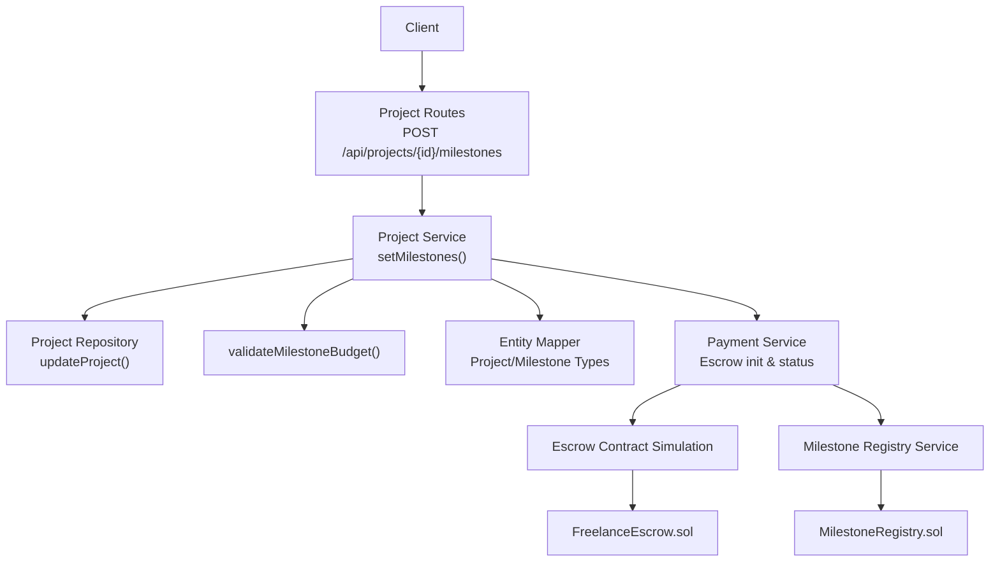
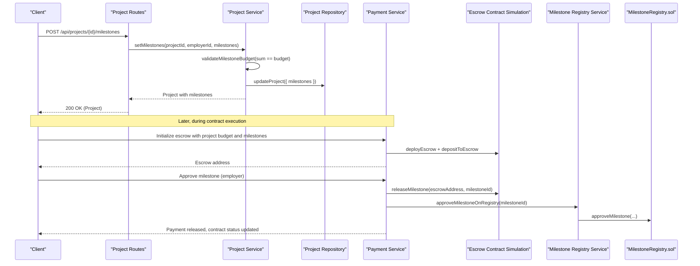
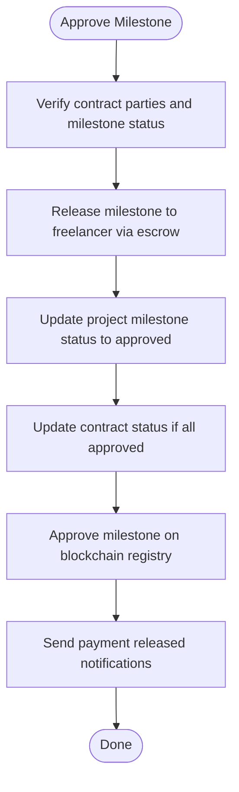
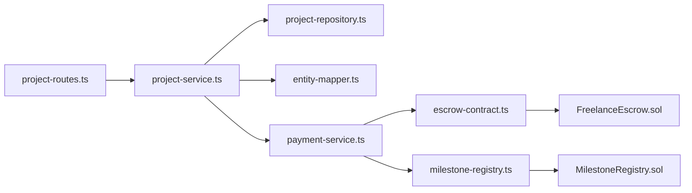

# Milestone Management

<cite>
**Referenced Files in This Document**
- [project-routes.ts](file://src/routes/project-routes.ts)
- [project-service.ts](file://src/services/project-service.ts)
- [entity-mapper.ts](file://src/utils/entity-mapper.ts)
- [project-repository.ts](file://src/repositories/project-repository.ts)
- [payment-service.ts](file://src/services/payment-service.ts)
- [escrow-contract.ts](file://src/services/escrow-contract.ts)
- [FreelanceEscrow.sol](file://contracts/FreelanceEscrow.sol)
- [MilestoneRegistry.sol](file://contracts/MilestoneRegistry.sol)
- [milestone-registry.ts](file://src/services/milestone-registry.ts)
- [API-DOCUMENTATION.md](file://docs/API-DOCUMENTATION.md)
</cite>

## Table of Contents
1. [Introduction](#introduction)
2. [Project Structure](#project-structure)
3. [Core Components](#core-components)
4. [Architecture Overview](#architecture-overview)
5. [Detailed Component Analysis](#detailed-component-analysis)
6. [Dependency Analysis](#dependency-analysis)
7. [Performance Considerations](#performance-considerations)
8. [Troubleshooting Guide](#troubleshooting-guide)
9. [Conclusion](#conclusion)

## Introduction
This document provides API documentation for milestone management in the FreelanceXchain system with a focus on the POST /api/projects/{id}/milestones endpoint. It explains how employers define project milestones, the required fields for each milestone, the critical business rule that the sum of milestone amounts equals the project budget, and the 400 Bad Request response for validation errors or budget mismatch. It also demonstrates how milestones are embedded in the Project response object and outlines their role in the escrow payment release process.

## Project Structure
The milestone management feature spans routing, service, repository, and model layers, plus blockchain integrations for milestone registry and escrow contracts.

**Diagram sources**
- [project-routes.ts](file://src/routes/project-routes.ts#L450-L573)
- [project-service.ts](file://src/services/project-service.ts#L253-L300)
- [project-repository.ts](file://src/repositories/project-repository.ts#L1-L50)
- [entity-mapper.ts](file://src/utils/entity-mapper.ts#L198-L250)
- [payment-service.ts](file://src/services/payment-service.ts#L590-L642)
- [escrow-contract.ts](file://src/services/escrow-contract.ts#L38-L199)
- [FreelanceEscrow.sol](file://contracts/FreelanceEscrow.sol#L1-L264)
- [MilestoneRegistry.sol](file://contracts/MilestoneRegistry.sol#L1-L145)
- [milestone-registry.ts](file://src/services/milestone-registry.ts#L1-L135)

**Section sources**
- [project-routes.ts](file://src/routes/project-routes.ts#L450-L573)
- [project-service.ts](file://src/services/project-service.ts#L253-L300)
- [entity-mapper.ts](file://src/utils/entity-mapper.ts#L198-L250)
- [project-repository.ts](file://src/repositories/project-repository.ts#L1-L50)
- [payment-service.ts](file://src/services/payment-service.ts#L590-L642)
- [escrow-contract.ts](file://src/services/escrow-contract.ts#L38-L199)
- [FreelanceEscrow.sol](file://contracts/FreelanceEscrow.sol#L1-L264)
- [MilestoneRegistry.sol](file://contracts/MilestoneRegistry.sol#L1-L145)
- [milestone-registry.ts](file://src/services/milestone-registry.ts#L1-L135)

## Core Components
- Endpoint: POST /api/projects/{id}/milestones
  - Purpose: Employers define milestones for a project. The request body requires an array named milestones, each containing title, description, amount, and dueDate.
  - Authentication: Requires a Bearer token and role employer.
  - Validation: Input validation ensures each milestone has required fields and types; a project lock check prevents modification if proposals have been accepted.
  - Business Rule: The sum of milestone amounts must equal the project’s budget; otherwise a 400 error is returned.
  - Response: On success, returns the updated Project object with milestones embedded.

- Project Service
  - setMilestones(): Validates milestones, checks project lock, computes milestone sum vs budget, and persists milestones to the project.
  - validateMilestoneBudget(): Computes sum and compares to project budget.

- Project Repository
  - updateProject(): Persists milestone updates to the database.

- Entity Mapper
  - Defines Project and Milestone types and maps between database entities and API models.

- Payment Service and Escrow
  - Initializes escrow with milestones and budget.
  - Provides contract payment status including milestone statuses and pending amounts.
  - Releases milestone payments to the freelancer upon employer approval.

- Blockchain Integrations
  - Milestone Registry: Submits and approves milestone records on-chain for verifiable history.
  - FreelanceEscrow.sol: Smart contract that holds funds and releases them upon milestone approval.

**Section sources**
- [project-routes.ts](file://src/routes/project-routes.ts#L450-L573)
- [project-service.ts](file://src/services/project-service.ts#L253-L300)
- [project-repository.ts](file://src/repositories/project-repository.ts#L35-L50)
- [entity-mapper.ts](file://src/utils/entity-mapper.ts#L198-L250)
- [payment-service.ts](file://src/services/payment-service.ts#L590-L642)
- [escrow-contract.ts](file://src/services/escrow-contract.ts#L38-L199)
- [FreelanceEscrow.sol](file://contracts/FreelanceEscrow.sol#L1-L264)
- [MilestoneRegistry.sol](file://contracts/MilestoneRegistry.sol#L1-L145)
- [milestone-registry.ts](file://src/services/milestone-registry.ts#L1-L135)

## Architecture Overview
The milestone lifecycle integrates REST endpoints, service-layer validation, persistence, and blockchain services.

**Diagram sources**
- [project-routes.ts](file://src/routes/project-routes.ts#L450-L573)
- [project-service.ts](file://src/services/project-service.ts#L253-L300)
- [project-repository.ts](file://src/repositories/project-repository.ts#L35-L50)
- [payment-service.ts](file://src/services/payment-service.ts#L590-L642)
- [escrow-contract.ts](file://src/services/escrow-contract.ts#L38-L199)
- [milestone-registry.ts](file://src/services/milestone-registry.ts#L137-L186)
- [MilestoneRegistry.sol](file://contracts/MilestoneRegistry.sol#L83-L111)

## Detailed Component Analysis

### POST /api/projects/{id}/milestones
- Purpose: Employers define milestones for a project.
- Path: /api/projects/{id}/milestones
- Method: POST
- Security: Bearer token required; role employer.
- Request body:
  - milestones: array of milestone objects
    - Each milestone requires:
      - title: string
      - description: string
      - amount: number (positive)
      - dueDate: ISO date-time string
- Validation:
  - At least one milestone required.
  - Each milestone must include title, description, amount, and dueDate.
  - Amount must be a positive number.
  - UUID path parameter validated.
  - Project ownership verified; project must not have accepted proposals.
- Business Rule:
  - Sum of milestone amounts must equal project budget; otherwise returns 400 with error code MILESTONE_SUM_MISMATCH.
- Responses:
  - 200 OK: Project with milestones embedded.
  - 400 Bad Request: Validation errors or budget mismatch.
  - 401 Unauthorized: Not authenticated.
  - 404 Not Found: Project not found.
  - 409 Conflict: Project locked (has accepted proposals).

Embedded in Project response:
- Project.milestones: array of Milestone objects with id, title, description, amount, dueDate, status.

**Section sources**
- [project-routes.ts](file://src/routes/project-routes.ts#L450-L573)
- [project-service.ts](file://src/services/project-service.ts#L253-L300)
- [entity-mapper.ts](file://src/utils/entity-mapper.ts#L198-L250)
- [project-repository.ts](file://src/repositories/project-repository.ts#L1-L50)

### Example: Three Milestones for a $3000 Project
- Request body (JSON):
  - milestones:
    - [{ title: "...", description: "...", amount: 1000, dueDate: "YYYY-MM-DDT00:00:00Z" }, 
       { title: "...", description: "...", amount: 1200, dueDate: "YYYY-MM-DDT00:00:00Z" }, 
       { title: "...", description: "...", amount: 800, dueDate: "YYYY-MM-DDT00:00:00Z" }]
- Total: 1000 + 1200 + 800 = 3000 (equals project budget)
- Response: 200 OK with Project including milestones array.

**Section sources**
- [project-routes.ts](file://src/routes/project-routes.ts#L450-L573)
- [project-service.ts](file://src/services/project-service.ts#L253-L300)

### Escrow Payment Release Process
- Initialization:
  - Payment service initializes escrow with project budget and milestones.
  - Escrow contract deployed and funds deposited.
- Completion and Approval:
  - Freelancer requests milestone completion; project milestone status transitions to submitted.
  - Employer approves milestone; escrow releases payment to freelancer; milestone status becomes approved.
  - Payment service updates project and contract statuses accordingly.
- Blockchain Registry:
  - Milestone submission and approval recorded on-chain via Milestone Registry service and contract.

**Diagram sources**
- [payment-service.ts](file://src/services/payment-service.ts#L196-L352)
- [escrow-contract.ts](file://src/services/escrow-contract.ts#L134-L199)
- [milestone-registry.ts](file://src/services/milestone-registry.ts#L137-L186)
- [FreelanceEscrow.sol](file://contracts/FreelanceEscrow.sol#L136-L161)

**Section sources**
- [payment-service.ts](file://src/services/payment-service.ts#L196-L352)
- [escrow-contract.ts](file://src/services/escrow-contract.ts#L134-L199)
- [milestone-registry.ts](file://src/services/milestone-registry.ts#L137-L186)
- [FreelanceEscrow.sol](file://contracts/FreelanceEscrow.sol#L136-L161)

## Dependency Analysis
- Route depends on Project Service for business logic.
- Project Service depends on Project Repository for persistence and on Entity Mapper for types.
- Payment Service depends on Escrow Contract Simulation and Milestone Registry Service.
- Blockchain contracts (FreelanceEscrow.sol, MilestoneRegistry.sol) integrate with services via transactions and confirmations.

**Diagram sources**
- [project-routes.ts](file://src/routes/project-routes.ts#L450-L573)
- [project-service.ts](file://src/services/project-service.ts#L253-L300)
- [project-repository.ts](file://src/repositories/project-repository.ts#L1-L50)
- [entity-mapper.ts](file://src/utils/entity-mapper.ts#L198-L250)
- [payment-service.ts](file://src/services/payment-service.ts#L590-L642)
- [escrow-contract.ts](file://src/services/escrow-contract.ts#L38-L199)
- [milestone-registry.ts](file://src/services/milestone-registry.ts#L1-L135)
- [MilestoneRegistry.sol](file://contracts/MilestoneRegistry.sol#L1-L145)
- [FreelanceEscrow.sol](file://contracts/FreelanceEscrow.sol#L1-L264)

**Section sources**
- [project-routes.ts](file://src/routes/project-routes.ts#L450-L573)
- [project-service.ts](file://src/services/project-service.ts#L253-L300)
- [project-repository.ts](file://src/repositories/project-repository.ts#L1-L50)
- [entity-mapper.ts](file://src/utils/entity-mapper.ts#L198-L250)
- [payment-service.ts](file://src/services/payment-service.ts#L590-L642)
- [escrow-contract.ts](file://src/services/escrow-contract.ts#L38-L199)
- [milestone-registry.ts](file://src/services/milestone-registry.ts#L1-L135)
- [MilestoneRegistry.sol](file://contracts/MilestoneRegistry.sol#L1-L145)
- [FreelanceEscrow.sol](file://contracts/FreelanceEscrow.sol#L1-L264)

## Performance Considerations
- Validation occurs before persistence; keep milestone arrays reasonably sized to minimize compute overhead.
- Escrow operations simulate blockchain transactions; in production, network latency and gas fees impact performance.
- Notifications are best-effort in simulation; ensure they do not block primary flows.

[No sources needed since this section provides general guidance]

## Troubleshooting Guide
Common issues and resolutions:
- 400 Bad Request with VALIDATION_ERROR:
  - Ensure each milestone includes title, description, amount, and dueDate.
  - Verify amount is a positive number.
- 400 Bad Request with MILESTONE_SUM_MISMATCH:
  - Adjust milestone amounts so their sum equals the project budget.
- 409 Conflict (PROJECT_LOCKED):
  - Cannot modify milestones if the project has accepted proposals; remove accepted proposals or create a new project.
- 404 Not Found:
  - Verify the project ID exists and is accessible to the authenticated employer.
- Escrow release failures:
  - Confirm the escrow address and milestone status; ensure sufficient balance and correct approver identity.

**Section sources**
- [project-routes.ts](file://src/routes/project-routes.ts#L450-L573)
- [project-service.ts](file://src/services/project-service.ts#L253-L300)
- [escrow-contract.ts](file://src/services/escrow-contract.ts#L134-L199)

## Conclusion
The POST /api/projects/{id}/milestones endpoint enables employers to define project milestones with strict validation and a critical budget alignment rule. Milestones are embedded in the Project response and drive the escrow payment release process, integrating with blockchain registries for verifiable milestone completion. Adhering to the validation rules and budget constraint ensures smooth execution of milestone approvals and fund releases.