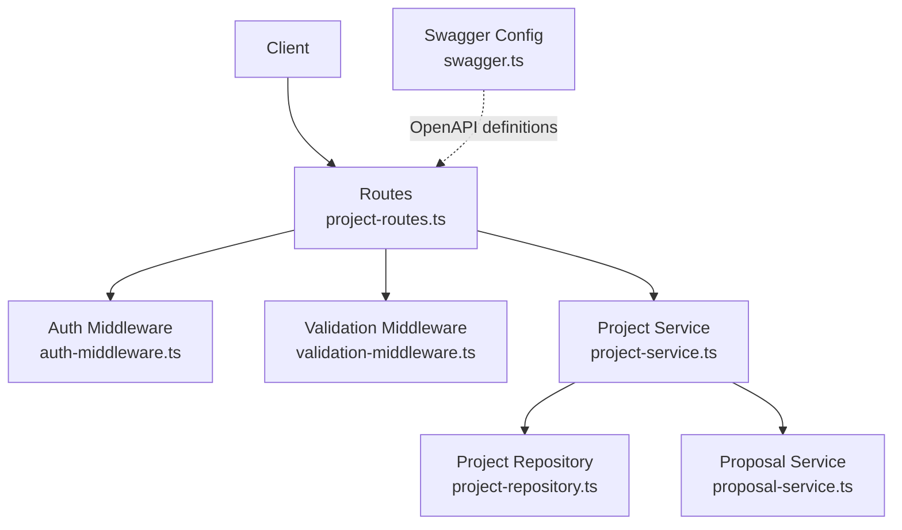
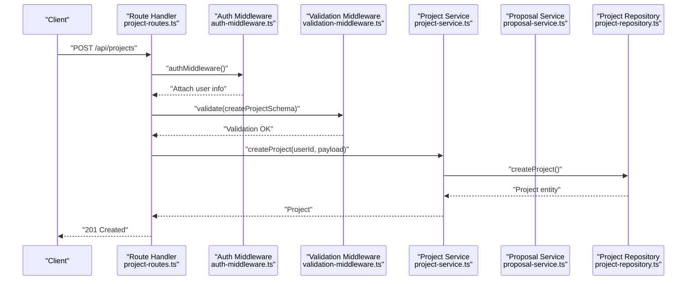
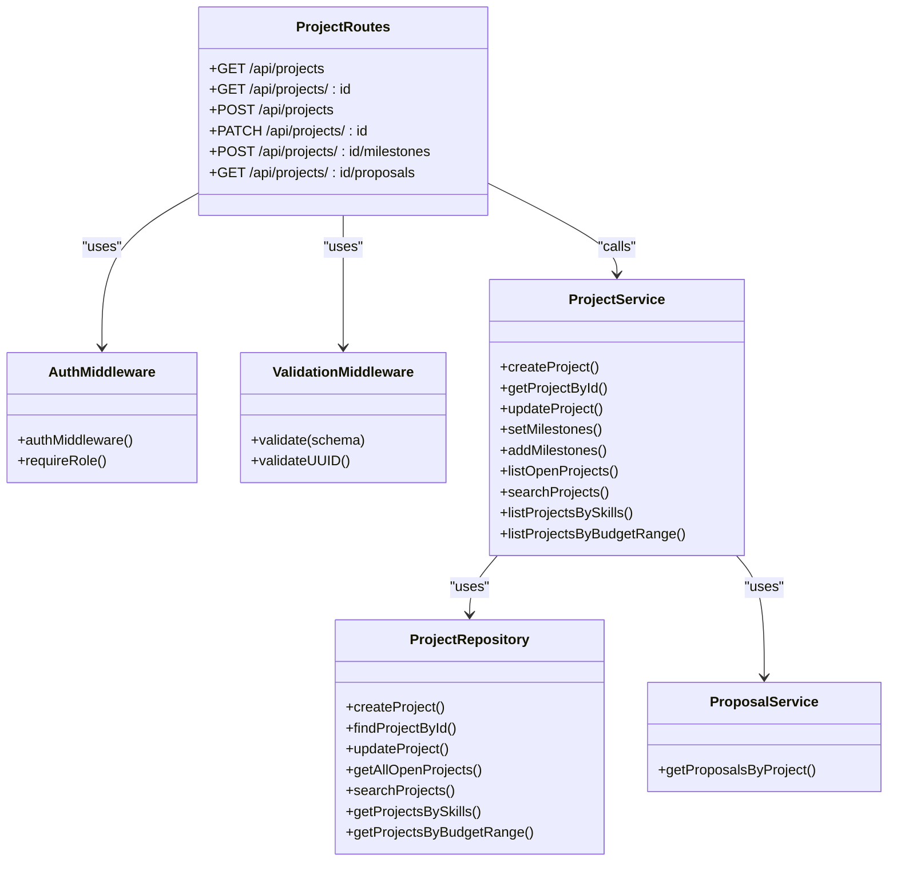

# Project API

<cite>
**Referenced Files in This Document**
- [project-routes.ts](file://src/routes/project-routes.ts)
- [project-service.ts](file://src/services/project-service.ts)
- [project-repository.ts](file://src/repositories/project-repository.ts)
- [auth-middleware.ts](file://src/middleware/auth-middleware.ts)
- [validation-middleware.ts](file://src/middleware/validation-middleware.ts)
- [swagger.ts](file://src/config/swagger.ts)
- [proposal-service.ts](file://src/services/proposal-service.ts)
- [entity-mapper.ts](file://src/utils/entity-mapper.ts)
- [API-DOCUMENTATION.md](file://docs/API-DOCUMENTATION.md)
</cite>

## Table of Contents
1. [Introduction](#introduction)
2. [Project Structure](#project-structure)
3. [Core Components](#core-components)
4. [Architecture Overview](#architecture-overview)
5. [Detailed Component Analysis](#detailed-component-analysis)
6. [Dependency Analysis](#dependency-analysis)
7. [Performance Considerations](#performance-considerations)
8. [Troubleshooting Guide](#troubleshooting-guide)
9. [Conclusion](#conclusion)
10. [Appendices](#appendices)

## Introduction
This document provides comprehensive API documentation for project management endpoints in the FreelanceXchain system. It covers HTTP methods, URL patterns, request/response schemas, authentication requirements (JWT Bearer), and validation rules. It also explains the project status lifecycle, modification constraints after proposal acceptance, and includes practical examples for creating projects with milestones and retrieving project proposals.

## Project Structure
The project management API is implemented as Express routes backed by service-layer logic and repository abstractions. Authentication is enforced via a JWT Bearer middleware, and request validation is performed using JSON schema-based middleware. Swagger/OpenAPI definitions are centrally configured and reused across route definitions.

**Diagram sources**
- [project-routes.ts](file://src/routes/project-routes.ts#L1-L684)
- [auth-middleware.ts](file://src/middleware/auth-middleware.ts#L1-L101)
- [validation-middleware.ts](file://src/middleware/validation-middleware.ts#L1-L800)
- [project-service.ts](file://src/services/project-service.ts#L1-L388)
- [project-repository.ts](file://src/repositories/project-repository.ts#L1-L191)
- [proposal-service.ts](file://src/services/proposal-service.ts#L1-L414)
- [swagger.ts](file://src/config/swagger.ts#L1-L233)

**Section sources**
- [project-routes.ts](file://src/routes/project-routes.ts#L1-L684)
- [swagger.ts](file://src/config/swagger.ts#L1-L233)

## Core Components
- Authentication: All protected endpoints require a Bearer token in the Authorization header. The middleware validates presence, format, and token validity, and attaches user metadata to the request.
- Validation: JSON schema-based validation enforces field types, lengths, formats, enums, and required properties for request bodies and parameters.
- Project Service: Orchestrates project creation, updates, milestone setting/addition, and search/filtering. Enforces business rules such as skill validation, milestone budget alignment, and project lock after proposal acceptance.
- Project Repository: Implements database queries for listing, filtering, and paginated retrieval of projects.
- Proposal Service: Interacts with proposals to enforce lifecycle transitions and project status changes upon proposal acceptance.

**Section sources**
- [auth-middleware.ts](file://src/middleware/auth-middleware.ts#L1-L101)
- [validation-middleware.ts](file://src/middleware/validation-middleware.ts#L1-L800)
- [project-service.ts](file://src/services/project-service.ts#L1-L388)
- [project-repository.ts](file://src/repositories/project-repository.ts#L1-L191)
- [proposal-service.ts](file://src/services/proposal-service.ts#L1-L414)

## Architecture Overview
The Project API follows a layered architecture:
- Route handlers define endpoints and apply middleware.
- Services encapsulate business logic and enforce constraints.
- Repositories abstract persistence and expose typed operations.
- Swagger defines reusable schemas for request/response documentation.

**Diagram sources**
- [project-routes.ts](file://src/routes/project-routes.ts#L219-L332)
- [auth-middleware.ts](file://src/middleware/auth-middleware.ts#L1-L101)
- [validation-middleware.ts](file://src/middleware/validation-middleware.ts#L520-L588)
- [project-service.ts](file://src/services/project-service.ts#L85-L119)
- [project-repository.ts](file://src/repositories/project-repository.ts#L35-L45)

## Detailed Component Analysis

### Authentication and Authorization
- JWT requirement: All protected endpoints require Authorization: Bearer <token>.
- Role enforcement: Employer-only endpoints are guarded by a role-check middleware.
- UUID validation: Path parameters are validated to be UUIDs.

**Section sources**
- [auth-middleware.ts](file://src/middleware/auth-middleware.ts#L1-L101)
- [project-routes.ts](file://src/routes/project-routes.ts#L271-L332)

### Project Endpoints

#### GET /api/projects
- Purpose: List projects with optional filters.
- Query parameters:
  - keyword: string; search in title/description.
  - skills: string; comma-separated skill IDs.
  - minBudget: number; minimum budget filter.
  - maxBudget: number; maximum budget filter.
  - limit: integer; default 20; max 100.
  - continuationToken: string; pagination token.
- Behavior:
  - If keyword present: search by keyword.
  - Else if skills present: filter by required skills.
  - Else if minBudget and maxBudget present: filter by budget range.
  - Otherwise: list open projects.
- Response: Paginated list of projects with items, hasMore, continuationToken.

**Section sources**
- [project-routes.ts](file://src/routes/project-routes.ts#L75-L168)
- [project-repository.ts](file://src/repositories/project-repository.ts#L118-L188)
- [validation-middleware.ts](file://src/middleware/validation-middleware.ts#L690-L702)

#### GET /api/projects/{id}
- Purpose: Retrieve a specific project by ID.
- Path parameter: id (UUID).
- Response: Project object.

**Section sources**
- [project-routes.ts](file://src/routes/project-routes.ts#L171-L215)
- [project-service.ts](file://src/services/project-service.ts#L121-L129)

#### POST /api/projects
- Purpose: Create a new project (employer only).
- Request body schema (validation):
  - title: string, min length 5.
  - description: string, min length 20.
  - requiredSkills: array; each item requires skillId (UUID).
  - budget: number, minimum 100.
  - deadline: string, date-time.
- Response: 201 Created with Project object.
- Errors: 400 Validation error, 401 Unauthorized.

**Section sources**
- [project-routes.ts](file://src/routes/project-routes.ts#L219-L332)
- [validation-middleware.ts](file://src/middleware/validation-middleware.ts#L520-L541)
- [project-service.ts](file://src/services/project-service.ts#L85-L119)

#### PATCH /api/projects/{id}
- Purpose: Update an existing project (employer only).
- Constraints:
  - Cannot update if project has accepted proposals (locked).
  - Title and description min lengths apply when provided.
  - Budget minimum applies when provided.
- Request body schema (validation):
  - title: string, min length 5.
  - description: string, min length 20.
  - requiredSkills: array; each item requires skillId (UUID).
  - budget: number, minimum 100.
  - deadline: string, date-time.
  - status: enum draft, open, in_progress, completed, cancelled.
- Response: Updated Project object.
- Errors: 400 Validation error, 401 Unauthorized, 404 Not found, 409 Locked.

**Section sources**
- [project-routes.ts](file://src/routes/project-routes.ts#L335-L447)
- [validation-middleware.ts](file://src/middleware/validation-middleware.ts#L544-L565)
- [project-service.ts](file://src/services/project-service.ts#L132-L199)

#### POST /api/projects/{id}/milestones
- Purpose: Set milestones for a project (employer only).
- Constraints:
  - Cannot modify milestones if project has accepted proposals (locked).
  - Sum of milestone amounts must equal project budget.
- Request body schema (validation):
  - milestones: array; each item requires:
    - title: string, min length 1.
    - description: string, min length 1.
    - amount: number, minimum 1.
    - dueDate: string, date-time.
- Response: Updated Project object.
- Errors: 400 Validation error, 401 Unauthorized, 404 Not found, 409 Locked.

**Section sources**
- [project-routes.ts](file://src/routes/project-routes.ts#L450-L573)
- [validation-middleware.ts](file://src/middleware/validation-middleware.ts#L567-L588)
- [project-service.ts](file://src/services/project-service.ts#L202-L299)

#### GET /api/projects/{id}/proposals
- Purpose: List proposals for a specific project (employer only).
- Path parameter: id (UUID).
- Query parameters:
  - limit: integer; default 20; max 100.
  - continuationToken: string; pagination token.
- Response: Paginated list of proposals with items, hasMore, continuationToken.
- Errors: 400 Invalid UUID, 401 Unauthorized, 404 Not found.

**Section sources**
- [project-routes.ts](file://src/routes/project-routes.ts#L575-L681)
- [proposal-service.ts](file://src/services/proposal-service.ts#L142-L163)

### Request/Response Schemas
- Project schema (OpenAPI):
  - id, employerId, title, description, requiredSkills, budget, deadline, status, milestones, createdAt, updatedAt.
  - Status enum: draft, open, in_progress, completed, cancelled.
  - Milestone schema: id, title, description, amount, dueDate, status enum pending, in_progress, submitted, approved, disputed.
- Error response schema (OpenAPI):
  - error: code, message, details (optional).
  - timestamp, requestId.

**Section sources**
- [swagger.ts](file://src/config/swagger.ts#L106-L138)
- [swagger.ts](file://src/config/swagger.ts#L1-L53)
- [entity-mapper.ts](file://src/utils/entity-mapper.ts#L199-L250)

### Validation Rules Summary
- Title: minimum length 5.
- Description: minimum length 20.
- requiredSkills: non-empty array; each skillId must be a valid UUID.
- Budget: minimum 100.
- Deadline: required date-time.
- Milestones: each item requires title, description, amount (>0), dueDate (date-time).
- Status: enum draft, open, in_progress, completed, cancelled.

**Section sources**
- [validation-middleware.ts](file://src/middleware/validation-middleware.ts#L520-L588)
- [project-service.ts](file://src/services/project-service.ts#L47-L56)

### Project Status Lifecycle and Constraints
- Status values: draft, open, in_progress, completed, cancelled.
- Lifecycle:
  - Creation: status defaults to open.
  - Proposal acceptance: project status transitions to in_progress.
  - Completion: project status can be set to completed (via update).
- Modification constraints:
  - After a proposal is accepted, the project becomes locked:
    - Updates are rejected with 409 Conflict.
    - Milestones cannot be added/modified with 409 Conflict.
  - Skill validation ensures required skills exist and are active.

**Section sources**
- [project-service.ts](file://src/services/project-service.ts#L132-L199)
- [project-service.ts](file://src/services/project-service.ts#L202-L299)
- [proposal-service.ts](file://src/services/proposal-service.ts#L174-L295)

### Client Implementation Examples

#### Example: Create a Project with Milestones
- Steps:
  1) Authenticate with JWT Bearer token.
  2) POST /api/projects with:
     - title, description, requiredSkills (array of skillId), budget, deadline.
  3) Optionally POST /api/projects/{id}/milestones with:
     - milestones array (title, description, amount, dueDate).
- Notes:
  - Ensure milestone amounts sum equals budget.
  - Employers can only create/update projects and manage milestones.

**Section sources**
- [project-routes.ts](file://src/routes/project-routes.ts#L219-L332)
- [project-routes.ts](file://src/routes/project-routes.ts#L450-L573)

#### Example: Retrieve Project Proposals
- Steps:
  1) Authenticate with JWT Bearer token.
  2) GET /api/projects/{id}/proposals with:
     - limit (optional), continuationToken (optional).
- Notes:
  - Employers can only view proposals for their own projects.

**Section sources**
- [project-routes.ts](file://src/routes/project-routes.ts#L575-L681)
- [proposal-service.ts](file://src/services/proposal-service.ts#L142-L163)

### Filtering and Search
- Keyword search: GET /api/projects with keyword query parameter.
- Skills filter: GET /api/projects with skills query parameter (comma-separated).
- Budget range filter: GET /api/projects with minBudget and maxBudget query parameters.
- Pagination: limit and continuationToken supported across endpoints.

**Section sources**
- [project-routes.ts](file://src/routes/project-routes.ts#L75-L168)
- [project-repository.ts](file://src/repositories/project-repository.ts#L118-L188)
- [validation-middleware.ts](file://src/middleware/validation-middleware.ts#L690-L702)

## Dependency Analysis

**Diagram sources**
- [project-routes.ts](file://src/routes/project-routes.ts#L1-L684)
- [auth-middleware.ts](file://src/middleware/auth-middleware.ts#L1-L101)
- [validation-middleware.ts](file://src/middleware/validation-middleware.ts#L1-L800)
- [project-service.ts](file://src/services/project-service.ts#L1-L388)
- [project-repository.ts](file://src/repositories/project-repository.ts#L1-L191)
- [proposal-service.ts](file://src/services/proposal-service.ts#L1-L414)

**Section sources**
- [project-routes.ts](file://src/routes/project-routes.ts#L1-L684)
- [project-service.ts](file://src/services/project-service.ts#L1-L388)
- [project-repository.ts](file://src/repositories/project-repository.ts#L1-L191)
- [proposal-service.ts](file://src/services/proposal-service.ts#L1-L414)

## Performance Considerations
- Pagination: All list/search endpoints support limit and continuationToken to control payload size.
- Filtering: Repository methods implement server-side filtering and ordering to reduce client-side processing.
- Validation: Early exit on invalid request bodies reduces unnecessary downstream calls.

[No sources needed since this section provides general guidance]

## Troubleshooting Guide
Common errors and resolutions:
- 400 Validation error:
  - Ensure required fields are present and formatted correctly (UUIDs, date-time, enums).
  - Check min lengths and numeric bounds.
- 401 Unauthorized:
  - Verify Authorization header format: Bearer <token>.
  - Confirm token is valid and not expired.
- 403 Forbidden:
  - Ensure user role is employer for employer-only endpoints.
- 404 Not found:
  - Confirm resource ID exists and belongs to the authenticated user (for owner-only checks).
- 409 Locked:
  - Cannot update or modify milestones after a proposal is accepted; cancel or withdraw the proposal first if applicable.

**Section sources**
- [auth-middleware.ts](file://src/middleware/auth-middleware.ts#L1-L101)
- [project-service.ts](file://src/services/project-service.ts#L132-L199)
- [project-service.ts](file://src/services/project-service.ts#L202-L299)

## Conclusion
The Project API provides robust endpoints for creating, updating, and retrieving projects with strong validation and clear lifecycle constraints. Employers can manage projects and milestones, while proposal acceptance triggers status transitions and locks modifications to protect ongoing work. Swagger definitions and middleware ensure consistent request/response handling and error reporting.

[No sources needed since this section summarizes without analyzing specific files]

## Appendices

### Endpoint Reference

- GET /api/projects
  - Filters: keyword, skills, minBudget, maxBudget, limit, continuationToken
  - Response: Paginated projects

- GET /api/projects/{id}
  - Response: Project

- POST /api/projects
  - Request: title, description, requiredSkills, budget, deadline
  - Response: 201 Project

- PATCH /api/projects/{id}
  - Request: title, description, requiredSkills, budget, deadline, status
  - Response: Updated Project

- POST /api/projects/{id}/milestones
  - Request: milestones array (title, description, amount, dueDate)
  - Response: Updated Project

- GET /api/projects/{id}/proposals
  - Query: limit, continuationToken
  - Response: Paginated proposals

**Section sources**
- [project-routes.ts](file://src/routes/project-routes.ts#L75-L681)
- [swagger.ts](file://src/config/swagger.ts#L106-L138)

### Additional Notes
- Swagger/OpenAPI definitions centralize schemas for consistent documentation and client generation.
- The interactive documentation is available at the base URL’s api-docs path.

**Section sources**
- [swagger.ts](file://src/config/swagger.ts#L1-L233)
- [API-DOCUMENTATION.md](file://docs/API-DOCUMENTATION.md#L1-L20)