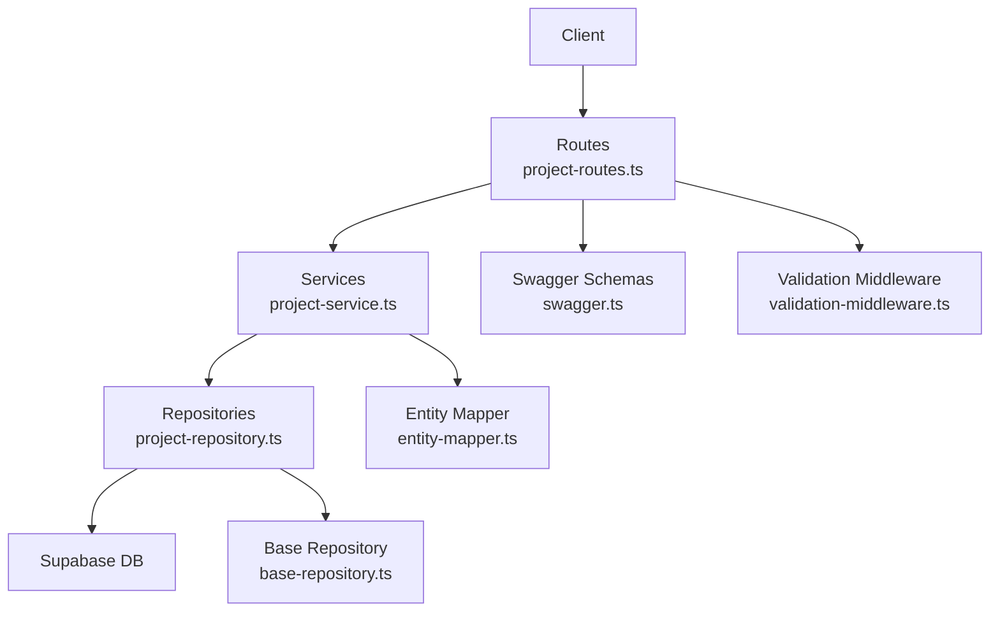
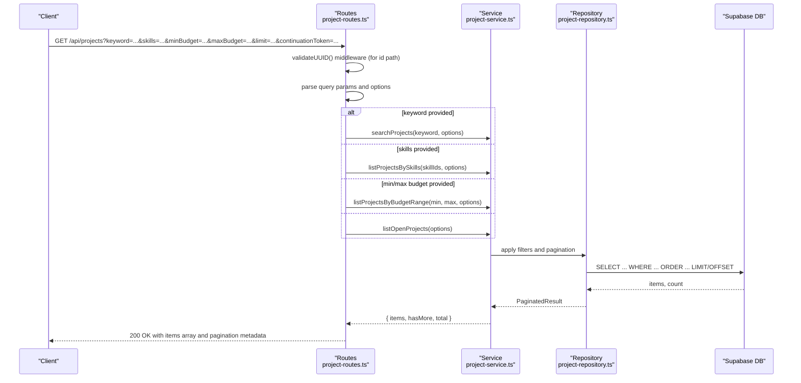
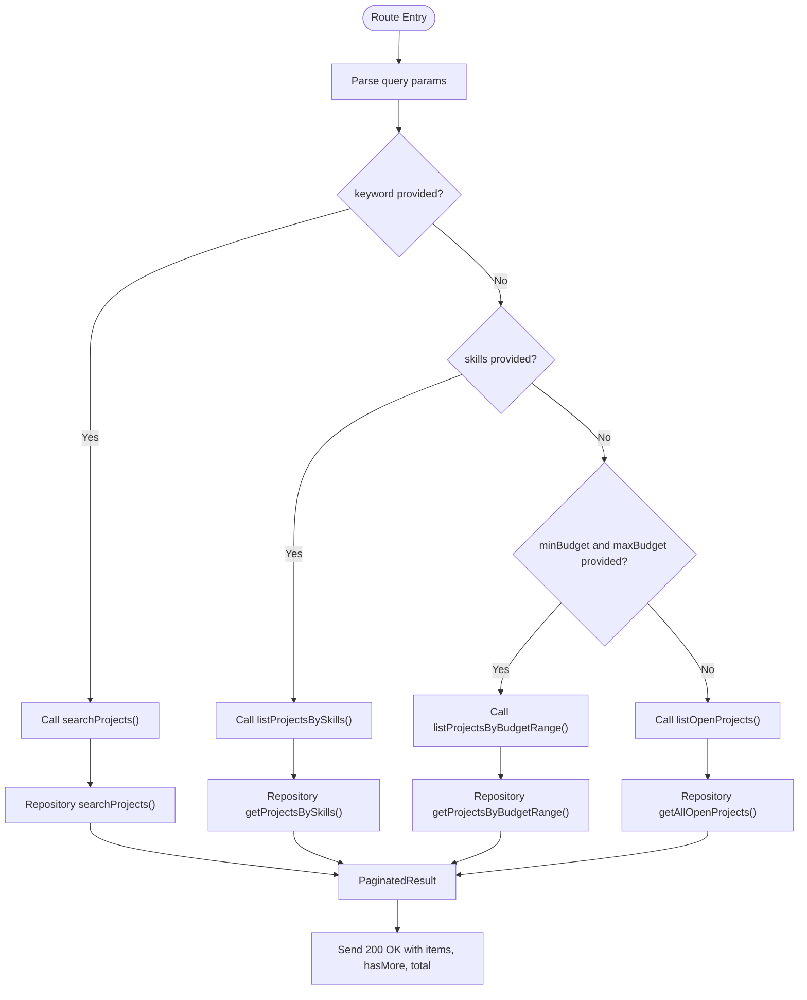
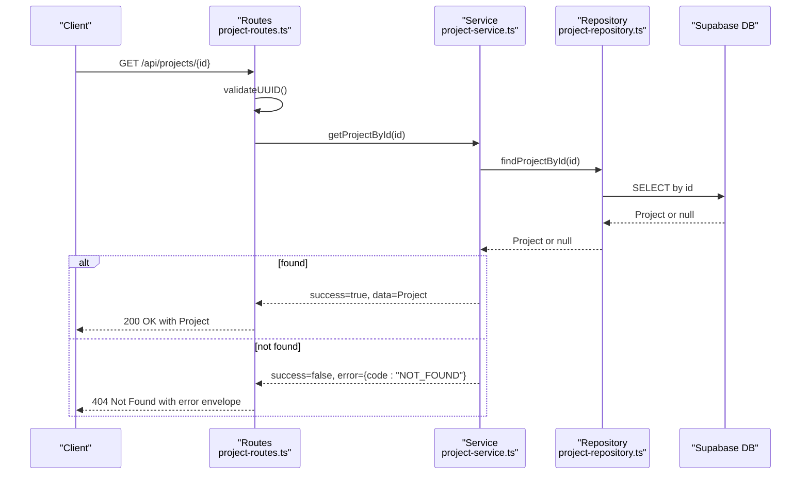
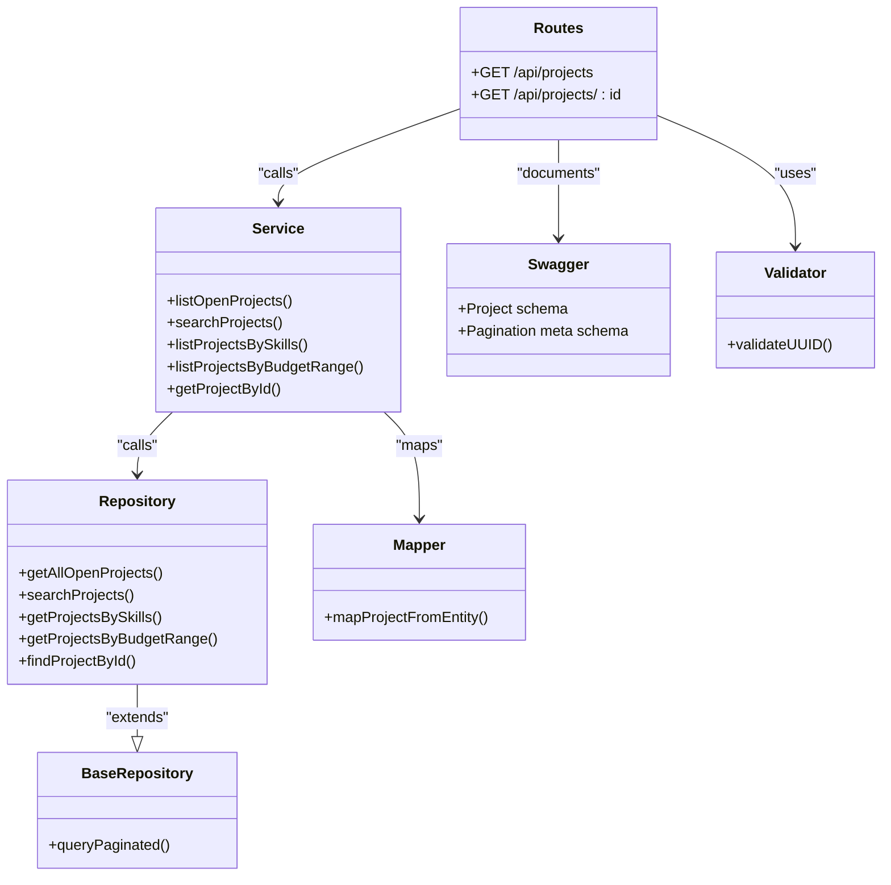

# Project Retrieval

<cite>
**Referenced Files in This Document**
- [project-routes.ts](file://src/routes/project-routes.ts)
- [project-service.ts](file://src/services/project-service.ts)
- [project-repository.ts](file://src/repositories/project-repository.ts)
- [validation-middleware.ts](file://src/middleware/validation-middleware.ts)
- [swagger.ts](file://src/config/swagger.ts)
- [entity-mapper.ts](file://src/utils/entity-mapper.ts)
- [base-repository.ts](file://src/repositories/base-repository.ts)
- [API-DOCUMENTATION.md](file://docs/API-DOCUMENTATION.md)
</cite>

## Table of Contents
1. [Introduction](#introduction)
2. [Project Structure](#project-structure)
3. [Core Components](#core-components)
4. [Architecture Overview](#architecture-overview)
5. [Detailed Component Analysis](#detailed-component-analysis)
6. [Dependency Analysis](#dependency-analysis)
7. [Performance Considerations](#performance-considerations)
8. [Troubleshooting Guide](#troubleshooting-guide)
9. [Conclusion](#conclusion)

## Introduction
This document provides API documentation for project retrieval endpoints in the FreelanceXchain system. It covers:
- Listing open projects with filtering and pagination
- Retrieving a specific project by UUID
- Query parameters for filtering (keyword, skills, minBudget, maxBudget)
- Pagination using limit and continuationToken
- Response structure for paginated lists
- Single-project retrieval response and error handling

## Project Structure
The project retrieval functionality spans routing, service, repository, and model layers, with Swagger schemas and validation middleware.

**Diagram sources**
- [project-routes.ts](file://src/routes/project-routes.ts#L1-L215)
- [project-service.ts](file://src/services/project-service.ts#L1-L388)
- [project-repository.ts](file://src/repositories/project-repository.ts#L1-L191)
- [swagger.ts](file://src/config/swagger.ts#L1-L233)
- [validation-middleware.ts](file://src/middleware/validation-middleware.ts#L1-L815)
- [entity-mapper.ts](file://src/utils/entity-mapper.ts#L1-L412)
- [base-repository.ts](file://src/repositories/base-repository.ts#L1-L149)

**Section sources**
- [project-routes.ts](file://src/routes/project-routes.ts#L1-L215)
- [swagger.ts](file://src/config/swagger.ts#L1-L233)

## Core Components
- Route handlers for GET /api/projects and GET /api/projects/{id}
- Service functions orchestrating filtering and pagination
- Repository methods querying Supabase with filters and pagination
- Validation middleware for UUID and query parameters
- Swagger schemas for Project and pagination metadata
- Entity mapper for consistent API model shape

Key responsibilities:
- GET /api/projects: applies keyword, skills, or budget filters; returns paginated items with hasMore and continuationToken
- GET /api/projects/{id}: retrieves a single project by UUID; returns 404 if not found

**Section sources**
- [project-routes.ts](file://src/routes/project-routes.ts#L75-L215)
- [project-service.ts](file://src/services/project-service.ts#L325-L363)
- [project-repository.ts](file://src/repositories/project-repository.ts#L76-L188)
- [validation-middleware.ts](file://src/middleware/validation-middleware.ts#L758-L815)
- [swagger.ts](file://src/config/swagger.ts#L106-L138)

## Architecture Overview
The retrieval flow follows a layered architecture: routes -> services -> repositories -> database, with validation and schema enforcement.

**Diagram sources**
- [project-routes.ts](file://src/routes/project-routes.ts#L132-L168)
- [project-service.ts](file://src/services/project-service.ts#L340-L363)
- [project-repository.ts](file://src/repositories/project-repository.ts#L167-L188)

## Detailed Component Analysis

### Endpoint: GET /api/projects
- Purpose: List open projects with optional filters and pagination
- Query parameters:
  - keyword: string; full-text search across title and description
  - skills: string; comma-separated skill IDs
  - minBudget: number; minimum budget filter
  - maxBudget: number; maximum budget filter
  - limit: integer; page size (default applied)
  - continuationToken: string; pagination token
- Behavior:
  - If keyword is present: searchProjects
  - Else if skills provided: listProjectsBySkills
  - Else if both minBudget and maxBudget provided: listProjectsByBudgetRange
  - Else: listOpenProjects
- Response:
  - 200 OK with object containing:
    - items: array of Project
    - hasMore: boolean indicating if more pages exist
    - continuationToken: string for next page (when applicable)
- Pagination:
  - Uses QueryOptions with limit and continuationToken
  - Repositories compute hasMore and total counts

**Diagram sources**
- [project-routes.ts](file://src/routes/project-routes.ts#L132-L168)
- [project-service.ts](file://src/services/project-service.ts#L340-L363)
- [project-repository.ts](file://src/repositories/project-repository.ts#L167-L188)

**Section sources**
- [project-routes.ts](file://src/routes/project-routes.ts#L75-L168)
- [project-service.ts](file://src/services/project-service.ts#L325-L363)
- [project-repository.ts](file://src/repositories/project-repository.ts#L76-L188)
- [base-repository.ts](file://src/repositories/base-repository.ts#L1-L149)

### Endpoint: GET /api/projects/{id}
- Purpose: Retrieve a specific project by UUID
- Path parameter:
  - id: string; UUID of the project
- Validation:
  - validateUUID middleware ensures UUID format
- Responses:
  - 200 OK with Project schema
  - 404 Not Found when project does not exist
- Error handling:
  - Service returns NOT_FOUND; route responds with 404 and standardized error envelope

**Diagram sources**
- [project-routes.ts](file://src/routes/project-routes.ts#L171-L215)
- [project-service.ts](file://src/services/project-service.ts#L121-L129)
- [project-repository.ts](file://src/repositories/project-repository.ts#L47-L53)

**Section sources**
- [project-routes.ts](file://src/routes/project-routes.ts#L171-L215)
- [project-service.ts](file://src/services/project-service.ts#L121-L129)
- [validation-middleware.ts](file://src/middleware/validation-middleware.ts#L758-L815)

### Response Schemas and Examples

- Project schema (Swagger):
  - Fields include id, employerId, title, description, requiredSkills, budget, deadline, status, milestones, createdAt, updatedAt
- Pagination metadata (Swagger):
  - totalCount, pageSize, hasMore, continuationToken

Examples:
- Search for projects by JavaScript skill:
  - GET /api/projects?skills=skill-a,skill-b,skill-c&limit=20
  - Use comma-separated skill IDs
- Search for projects with $500–$1000 budget range:
  - GET /api/projects?minBudget=500&maxBudget=1000&limit=20

Notes:
- The repository applies filters and pagination; hasMore indicates whether more items are available
- continuationToken is used for pagination; the exact token format is handled by the repository layer

**Section sources**
- [swagger.ts](file://src/config/swagger.ts#L106-L138)
- [project-routes.ts](file://src/routes/project-routes.ts#L75-L168)
- [project-repository.ts](file://src/repositories/project-repository.ts#L118-L188)
- [API-DOCUMENTATION.md](file://docs/API-DOCUMENTATION.md#L613-L642)

## Dependency Analysis

**Diagram sources**
- [project-routes.ts](file://src/routes/project-routes.ts#L1-L215)
- [project-service.ts](file://src/services/project-service.ts#L1-L388)
- [project-repository.ts](file://src/repositories/project-repository.ts#L1-L191)
- [base-repository.ts](file://src/repositories/base-repository.ts#L1-L149)
- [swagger.ts](file://src/config/swagger.ts#L1-L233)
- [validation-middleware.ts](file://src/middleware/validation-middleware.ts#L758-L815)
- [entity-mapper.ts](file://src/utils/entity-mapper.ts#L198-L250)

**Section sources**
- [project-routes.ts](file://src/routes/project-routes.ts#L1-L215)
- [project-service.ts](file://src/services/project-service.ts#L1-L388)
- [project-repository.ts](file://src/repositories/project-repository.ts#L1-L191)
- [base-repository.ts](file://src/repositories/base-repository.ts#L1-L149)
- [swagger.ts](file://src/config/swagger.ts#L1-L233)
- [validation-middleware.ts](file://src/middleware/validation-middleware.ts#L758-L815)
- [entity-mapper.ts](file://src/utils/entity-mapper.ts#L198-L250)

## Performance Considerations
- Filtering and pagination:
  - Repository methods use LIMIT and OFFSET with explicit ordering and count for hasMore computation
  - Budget range filtering is applied server-side; ensure indexes on status and budget for optimal performance
- In-memory filtering:
  - Skills filtering is performed in-memory after fetching open projects; consider moving to database-level filtering if scale grows
- Query conversion:
  - Validation middleware converts query strings to typed values (numbers, booleans, arrays) before service invocation

[No sources needed since this section provides general guidance]

## Troubleshooting Guide
Common issues and resolutions:
- 400 Bad Request for invalid UUID:
  - Occurs when path parameter id is not a valid UUID; ensure UUID format
- 404 Not Found:
  - Project not found by ID; verify project exists and UUID is correct
- 400 Bad Request for query validation:
  - Ensure numeric parameters (minBudget, maxBudget, limit) are valid and within allowed ranges
- Pagination:
  - Use continuationToken for subsequent pages; ensure limit is within supported bounds

Standardized error envelope:
- All errors include error.code, error.message, optional details, timestamp, and requestId

**Section sources**
- [validation-middleware.ts](file://src/middleware/validation-middleware.ts#L758-L815)
- [project-routes.ts](file://src/routes/project-routes.ts#L199-L215)
- [API-DOCUMENTATION.md](file://docs/API-DOCUMENTATION.md#L613-L642)

## Conclusion
The project retrieval endpoints provide flexible filtering (keyword, skills, budget range) and robust pagination. The route handlers delegate to services, which orchestrate repository queries to Supabase. Swagger schemas define the Project model and pagination metadata, while validation middleware ensures parameter correctness. Use the documented query parameters and response structure to integrate project listing and single-project retrieval seamlessly.