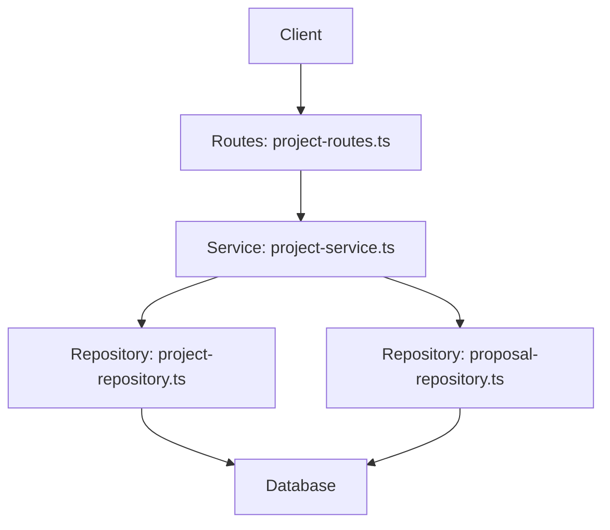
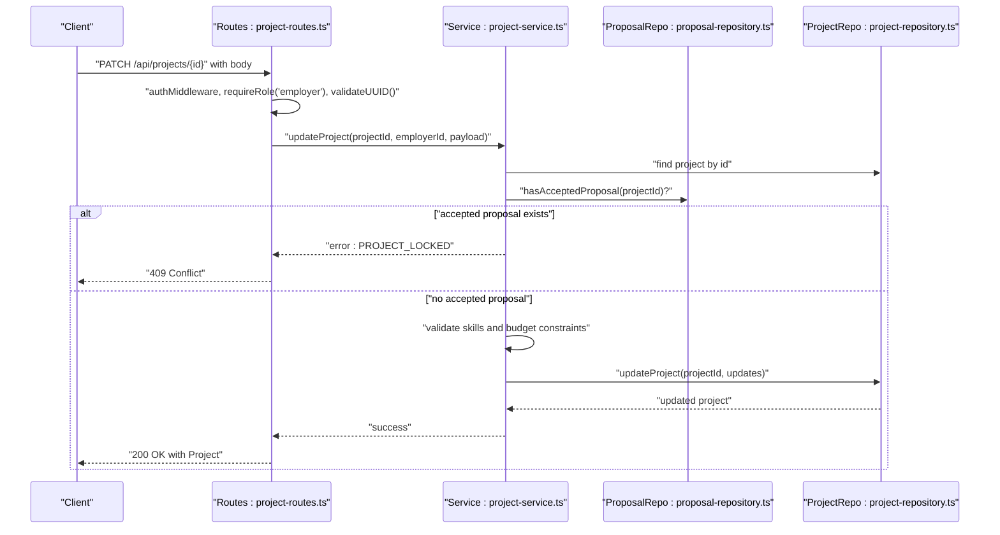
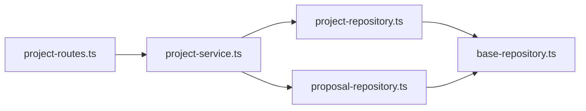

# Project Update

<cite>
**Referenced Files in This Document**
- [project-routes.ts](file://src/routes/project-routes.ts)
- [project-service.ts](file://src/services/project-service.ts)
- [project-repository.ts](file://src/repositories/project-repository.ts)
- [proposal-repository.ts](file://src/repositories/proposal-repository.ts)
- [swagger.ts](file://src/config/swagger.ts)
- [API-DOCUMENTATION.md](file://docs/API-DOCUMENTATION.md)
</cite>

## Table of Contents
1. [Introduction](#introduction)
2. [Project Structure](#project-structure)
3. [Core Components](#core-components)
4. [Architecture Overview](#architecture-overview)
5. [Detailed Component Analysis](#detailed-component-analysis)
6. [Dependency Analysis](#dependency-analysis)
7. [Performance Considerations](#performance-considerations)
8. [Troubleshooting Guide](#troubleshooting-guide)
9. [Conclusion](#conclusion)

## Introduction
This document describes the PATCH /api/projects/{id} endpoint for updating a project in the FreelanceXchain system. It explains who can update a project, which fields are updatable, validation rules mirroring creation constraints, and the 409 Conflict response when a project has accepted proposals. It also details the response format returning the updated Project object.

## Project Structure
The project update flow spans route handlers, service logic, and repositories:
- Route handler validates authentication and role, applies lightweight input validation, and delegates to the service.
- Service enforces ownership, checks for accepted proposals (locking), validates skills and budget constraints, and persists updates.
- Repository performs the database update operation.

**Diagram sources**
- [project-routes.ts](file://src/routes/project-routes.ts#L335-L447)
- [project-service.ts](file://src/services/project-service.ts#L132-L200)
- [project-repository.ts](file://src/repositories/project-repository.ts#L39-L45)
- [proposal-repository.ts](file://src/repositories/proposal-repository.ts#L72-L82)

**Section sources**
- [project-routes.ts](file://src/routes/project-routes.ts#L335-L447)
- [project-service.ts](file://src/services/project-service.ts#L132-L200)
- [project-repository.ts](file://src/repositories/project-repository.ts#L39-L45)
- [proposal-repository.ts](file://src/repositories/proposal-repository.ts#L72-L82)

## Core Components
- Endpoint: PATCH /api/projects/{id}
- Authentication: Bearer token required
- Authorization: Only the project owner (employer) can update
- Locking rule: Cannot update a project that has accepted proposals (409 Conflict)
- Updatable fields: title, description, requiredSkills, budget, deadline, status
- Validation: Mirrors creation constraints (minimum lengths, budget minimum, skill IDs)
- Response: Updated Project object

**Section sources**
- [project-routes.ts](file://src/routes/project-routes.ts#L335-L447)
- [project-service.ts](file://src/services/project-service.ts#L132-L200)
- [swagger.ts](file://src/config/swagger.ts#L106-L127)

## Architecture Overview
The update request follows this sequence:

**Diagram sources**
- [project-routes.ts](file://src/routes/project-routes.ts#L395-L447)
- [project-service.ts](file://src/services/project-service.ts#L132-L200)
- [proposal-repository.ts](file://src/repositories/proposal-repository.ts#L72-L82)
- [project-repository.ts](file://src/repositories/project-repository.ts#L39-L45)

## Detailed Component Analysis

### Endpoint Definition and Behavior
- Path: /api/projects/{id}
- Method: PATCH
- Security: bearerAuth
- Role: employer
- Path parameter: id (UUID)
- Request body fields:
  - title (string, min length 5)
  - description (string, min length 20)
  - requiredSkills (array of objects with skillId)
  - budget (number, minimum 100)
  - deadline (date-time)
  - status (enum draft, open, in_progress, completed, cancelled)
- Responses:
  - 200: Project updated successfully
  - 400: Validation error or invalid UUID
  - 401: Unauthorized
  - 404: Not found
  - 409: Project locked (has accepted proposals)

Notes:
- Only the project owner (employer) can update.
- If the project has any accepted proposals, updates are rejected with 409 Conflict.
- Validation mirrors creation constraints for title, description, budget, and skill IDs.

**Section sources**
- [project-routes.ts](file://src/routes/project-routes.ts#L335-L447)
- [swagger.ts](file://src/config/swagger.ts#L106-L127)

### Route Handler Logic
Key behaviors:
- Authentication and role enforcement occur before any business logic.
- UUID validation is performed on the path parameter.
- Lightweight validation is applied to fields present in the request body.
- Delegates to service layer for ownership, locking, and persistence.
- Maps service error codes to appropriate HTTP status codes (including 409 for PROJECT_LOCKED).

**Section sources**
- [project-routes.ts](file://src/routes/project-routes.ts#L395-L447)

### Service Layer Validation and Business Rules
Key behaviors:
- Ownership check: project must belong to the authenticated employer.
- Locking check: if any proposal has status accepted, reject with PROJECT_LOCKED.
- Skill validation: requiredSkills skillId values must correspond to active skills.
- Budget constraint: when updating budget or milestones, ensure milestone amounts sum to the new budget.
- Partial updates: only provided fields are updated; others remain unchanged.
- Persistence: repository update returns the updated project entity.

**Section sources**
- [project-service.ts](file://src/services/project-service.ts#L132-L200)

### Repository Operations
- ProjectRepository.updateProject(id, updates) persists changes to the project record.
- ProposalRepository.hasAcceptedProposal(projectId) determines whether any proposal is accepted, enforcing the lock.

**Section sources**
- [project-repository.ts](file://src/repositories/project-repository.ts#L39-L45)
- [proposal-repository.ts](file://src/repositories/proposal-repository.ts#L72-L82)

### Validation Rules (Mirroring Creation Constraints)
- title: if provided, must be at least 5 characters
- description: if provided, must be at least 20 characters
- budget: if provided, must be at least 100
- requiredSkills: if provided, each skillId must be a valid UUID and correspond to an active skill
- deadline: if provided, must be a valid date-time string
- status: must be one of draft, open, in_progress, completed, cancelled

These rules are enforced during update and ensure consistency with creation constraints.

**Section sources**
- [project-routes.ts](file://src/routes/project-routes.ts#L410-L429)
- [project-service.ts](file://src/services/project-service.ts#L132-L200)

### Example Request: Update Budget and Add a New Required Skill
- Purpose: Demonstrate updating budget and adding a new required skill to a project.
- Steps:
  - Send a PATCH request to /api/projects/{id}
  - Include budget and requiredSkills in the body
  - requiredSkills should include the new skillId
- Notes:
  - Ensure the project has no accepted proposals before sending
  - The service validates that the new skillId corresponds to an active skill

[No sources needed since this section provides a usage example without quoting specific code]

### Response Format
- On success (200 OK): Returns the updated Project object with all fields.
- Error responses (400/401/404/409): Return a standardized error envelope with code, message, and optional details.

Swagger schema for Project:
- id: string (uuid)
- employerId: string (uuid)
- title: string
- description: string
- requiredSkills: array of SkillReference
- budget: number
- deadline: string (date-time)
- status: enum draft, open, in_progress, completed, cancelled
- milestones: array of Milestone
- createdAt: string (date-time)
- updatedAt: string (date-time)

**Section sources**
- [swagger.ts](file://src/config/swagger.ts#L106-L127)
- [API-DOCUMENTATION.md](file://docs/API-DOCUMENTATION.md#L227-L290)

## Dependency Analysis
The update flow depends on:
- Route handler depends on auth middleware, role middleware, and UUID validator.
- Service depends on project repository and proposal repository.
- Repositories depend on shared base repository and Supabase client.

**Diagram sources**
- [project-routes.ts](file://src/routes/project-routes.ts#L395-L447)
- [project-service.ts](file://src/services/project-service.ts#L132-L200)
- [project-repository.ts](file://src/repositories/project-repository.ts#L39-L45)
- [proposal-repository.ts](file://src/repositories/proposal-repository.ts#L72-L82)

**Section sources**
- [project-routes.ts](file://src/routes/project-routes.ts#L395-L447)
- [project-service.ts](file://src/services/project-service.ts#L132-L200)
- [project-repository.ts](file://src/repositories/project-repository.ts#L39-L45)
- [proposal-repository.ts](file://src/repositories/proposal-repository.ts#L72-L82)

## Performance Considerations
- The update is a single write operation to the project table.
- Skill validation iterates over provided skillIds; keep requiredSkills minimal to reduce overhead.
- Budget validation checks milestone sums when milestones exist; avoid frequent partial updates to minimize repeated checks.

[No sources needed since this section provides general guidance]

## Troubleshooting Guide
Common issues and resolutions:
- 401 Unauthorized: Ensure a valid Bearer token is included in the Authorization header.
- 403 Forbidden: Only the project owner (employer) can update; verify the authenticated user owns the project.
- 404 Not Found: The project ID may be invalid or the project does not exist.
- 409 Conflict (PROJECT_LOCKED): The project has at least one accepted proposal. Withdraw or cancel the proposal before updating, or accept the business risk if applicable.
- 400 Validation Error: 
  - title must be at least 5 characters
  - description must be at least 20 characters
  - budget must be at least 100
  - requiredSkills skillId must be valid and correspond to an active skill
  - deadline must be a valid date-time string
  - status must be one of draft, open, in_progress, completed, cancelled

**Section sources**
- [project-routes.ts](file://src/routes/project-routes.ts#L395-L447)
- [project-service.ts](file://src/services/project-service.ts#L132-L200)

## Conclusion
The PATCH /api/projects/{id} endpoint enables employers to update project details while maintaining strong safeguards. Ownership verification and the accepted-proposal lock prevent modifications when a project is actively engaged. Validation rules mirror creation constraints to preserve data quality. The response returns the updated Project object, ensuring clients have the latest state.