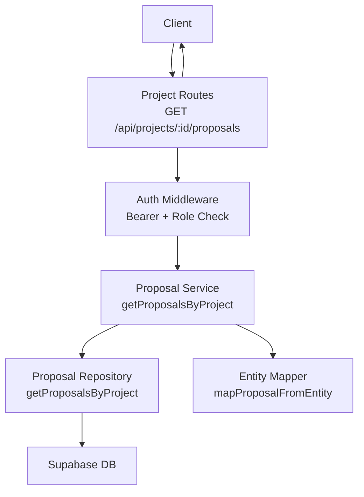
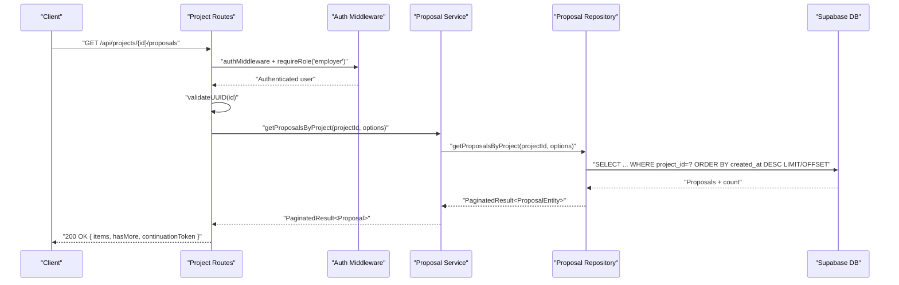
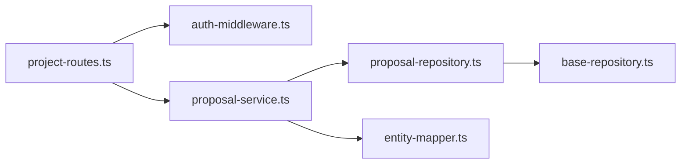

# Proposal Listing

<cite>
**Referenced Files in This Document**
- [project-routes.ts](file://src/routes/project-routes.ts)
- [proposal-service.ts](file://src/services/proposal-service.ts)
- [proposal-repository.ts](file://src/repositories/proposal-repository.ts)
- [base-repository.ts](file://src/repositories/base-repository.ts)
- [entity-mapper.ts](file://src/utils/entity-mapper.ts)
- [auth-middleware.ts](file://src/middleware/auth-middleware.ts)
- [swagger.ts](file://src/config/swagger.ts)
- [API-DOCUMENTATION.md](file://docs/API-DOCUMENTATION.md)
</cite>

## Table of Contents
1. [Introduction](#introduction)
2. [Project Structure](#project-structure)
3. [Core Components](#core-components)
4. [Architecture Overview](#architecture-overview)
5. [Detailed Component Analysis](#detailed-component-analysis)
6. [Dependency Analysis](#dependency-analysis)
7. [Performance Considerations](#performance-considerations)
8. [Troubleshooting Guide](#troubleshooting-guide)
9. [Conclusion](#conclusion)

## Introduction
This document describes the GET /api/projects/{id}/proposals endpoint used to retrieve all proposals submitted for a given project. It explains the authentication and authorization requirements, pagination behavior, and the response structure. It also documents the 403 Forbidden response when a user attempts to access proposals for a project they do not own.

## Project Structure
The endpoint is implemented in the projects route module and orchestrated by the proposal service and repository layers. The Swagger/OpenAPI specification defines the endpoint’s parameters and response schema.

**Diagram sources**
- [project-routes.ts](file://src/routes/project-routes.ts#L575-L683)
- [auth-middleware.ts](file://src/middleware/auth-middleware.ts#L1-L101)
- [proposal-service.ts](file://src/services/proposal-service.ts#L141-L163)
- [proposal-repository.ts](file://src/repositories/proposal-repository.ts#L39-L58)
- [entity-mapper.ts](file://src/utils/entity-mapper.ts#L252-L279)

**Section sources**
- [project-routes.ts](file://src/routes/project-routes.ts#L575-L683)
- [swagger.ts](file://src/config/swagger.ts#L139-L152)

## Core Components
- Endpoint: GET /api/projects/{id}/proposals
- Authentication: Requires a valid Bearer token
- Authorization: Employer role required; caller must own the project
- Pagination: limit and continuationToken query parameters
- Response: items array of proposals, hasMore flag, and continuationToken

Key implementation references:
- Route handler and validation: [project-routes.ts](file://src/routes/project-routes.ts#L575-L683)
- Service method: [proposal-service.ts](file://src/services/proposal-service.ts#L141-L163)
- Repository method: [proposal-repository.ts](file://src/repositories/proposal-repository.ts#L39-L58)
- Pagination model: [base-repository.ts](file://src/repositories/base-repository.ts#L1-L17)
- Proposal model: [entity-mapper.ts](file://src/utils/entity-mapper.ts#L252-L279)

**Section sources**
- [project-routes.ts](file://src/routes/project-routes.ts#L575-L683)
- [proposal-service.ts](file://src/services/proposal-service.ts#L141-L163)
- [proposal-repository.ts](file://src/repositories/proposal-repository.ts#L39-L58)
- [base-repository.ts](file://src/repositories/base-repository.ts#L1-L17)
- [entity-mapper.ts](file://src/utils/entity-mapper.ts#L252-L279)

## Architecture Overview
The request flow for retrieving proposals for a project:

**Diagram sources**
- [project-routes.ts](file://src/routes/project-routes.ts#L575-L683)
- [proposal-service.ts](file://src/services/proposal-service.ts#L141-L163)
- [proposal-repository.ts](file://src/repositories/proposal-repository.ts#L39-L58)
- [base-repository.ts](file://src/repositories/base-repository.ts#L129-L147)

## Detailed Component Analysis

### Endpoint Definition and Behavior
- Path: /api/projects/{id}/proposals
- Method: GET
- Authentication: Bearer token required
- Authorization: Employer role required; endpoint verifies the requesting employer owns the project
- Parameters:
  - Path: id (UUID)
  - Query: limit (integer, default depends on route), continuationToken (string)
- Response body:
  - items: array of Proposal objects
  - hasMore: boolean indicating if more pages exist
  - continuationToken: string for subsequent pages (Swagger schema defines PaginationMeta with totalCount, pageSize, hasMore, continuationToken)

Implementation references:
- Route and validation: [project-routes.ts](file://src/routes/project-routes.ts#L575-L683)
- Swagger schema for Proposal: [swagger.ts](file://src/config/swagger.ts#L139-L152)
- Swagger PaginationMeta: [swagger.ts](file://src/config/swagger.ts#L215-L223)

**Section sources**
- [project-routes.ts](file://src/routes/project-routes.ts#L575-L683)
- [swagger.ts](file://src/config/swagger.ts#L139-L152)
- [swagger.ts](file://src/config/swagger.ts#L215-L223)

### Authentication and Authorization
- Bearer token validation occurs via authMiddleware
- Role enforcement ensures only employers can access this endpoint
- Ownership verification checks that the logged-in employer is the project owner

References:
- Auth middleware: [auth-middleware.ts](file://src/middleware/auth-middleware.ts#L1-L101)
- Employer role enforcement: [project-routes.ts](file://src/routes/project-routes.ts#L628-L683)

**Section sources**
- [auth-middleware.ts](file://src/middleware/auth-middleware.ts#L1-L101)
- [project-routes.ts](file://src/routes/project-routes.ts#L628-L683)

### Pagination
- Query parameters:
  - limit: number of items per page (defaults to 20 in route)
  - continuationToken: token for fetching the next page
- Repository-level pagination uses limit/offset under the hood
- Response includes hasMore and continuationToken for client-side pagination

References:
- Route pagination handling: [project-routes.ts](file://src/routes/project-routes.ts#L628-L683)
- Base repository pagination model: [base-repository.ts](file://src/repositories/base-repository.ts#L1-L17)
- Repository query with limit/offset: [proposal-repository.ts](file://src/repositories/proposal-repository.ts#L39-L58)

**Section sources**
- [project-routes.ts](file://src/routes/project-routes.ts#L628-L683)
- [base-repository.ts](file://src/repositories/base-repository.ts#L1-L17)
- [proposal-repository.ts](file://src/repositories/proposal-repository.ts#L39-L58)

### Response Structure
- items: array of Proposal objects
- hasMore: boolean
- continuationToken: string

Proposal model fields:
- id, projectId, freelancerId, coverLetter, proposedRate, estimatedDuration, status, createdAt, updatedAt

References:
- Proposal schema: [swagger.ts](file://src/config/swagger.ts#L139-L152)
- Proposal entity mapping: [entity-mapper.ts](file://src/utils/entity-mapper.ts#L252-L279)

**Section sources**
- [swagger.ts](file://src/config/swagger.ts#L139-L152)
- [entity-mapper.ts](file://src/utils/entity-mapper.ts#L252-L279)

### Example Response
The endpoint returns an object with:
- items: array of Proposal entries
- hasMore: boolean
- continuationToken: string

Note: The repository returns total count; the route returns items, hasMore, and continuationToken. The Swagger PaginationMeta schema documents totalCount, pageSize, hasMore, continuationToken.

References:
- Route returns paginated result: [project-routes.ts](file://src/routes/project-routes.ts#L668-L681)
- Service maps to Proposal: [proposal-service.ts](file://src/services/proposal-service.ts#L141-L163)
- Proposal schema: [swagger.ts](file://src/config/swagger.ts#L139-L152)

**Section sources**
- [project-routes.ts](file://src/routes/project-routes.ts#L668-L681)
- [proposal-service.ts](file://src/services/proposal-service.ts#L141-L163)
- [swagger.ts](file://src/config/swagger.ts#L139-L152)

### Error Handling
- 401 Unauthorized: Missing or invalid Bearer token
- 403 Forbidden: Attempting to access proposals for a project owned by another employer
- 404 Not Found: Project not found or proposals not found
- 400 Bad Request: Invalid UUID format (validated by middleware)

References:
- Auth middleware errors: [auth-middleware.ts](file://src/middleware/auth-middleware.ts#L1-L101)
- Ownership check and 403: [project-routes.ts](file://src/routes/project-routes.ts#L644-L662)
- Project not found: [project-routes.ts](file://src/routes/project-routes.ts#L645-L653)
- Service-level not found: [proposal-service.ts](file://src/services/proposal-service.ts#L141-L163)

**Section sources**
- [auth-middleware.ts](file://src/middleware/auth-middleware.ts#L1-L101)
- [project-routes.ts](file://src/routes/project-routes.ts#L644-L662)
- [proposal-service.ts](file://src/services/proposal-service.ts#L141-L163)

## Dependency Analysis

**Diagram sources**
- [project-routes.ts](file://src/routes/project-routes.ts#L575-L683)
- [auth-middleware.ts](file://src/middleware/auth-middleware.ts#L1-L101)
- [proposal-service.ts](file://src/services/proposal-service.ts#L141-L163)
- [proposal-repository.ts](file://src/repositories/proposal-repository.ts#L39-L58)
- [base-repository.ts](file://src/repositories/base-repository.ts#L1-L17)
- [entity-mapper.ts](file://src/utils/entity-mapper.ts#L252-L279)

**Section sources**
- [project-routes.ts](file://src/routes/project-routes.ts#L575-L683)
- [auth-middleware.ts](file://src/middleware/auth-middleware.ts#L1-L101)
- [proposal-service.ts](file://src/services/proposal-service.ts#L141-L163)
- [proposal-repository.ts](file://src/repositories/proposal-repository.ts#L39-L58)
- [base-repository.ts](file://src/repositories/base-repository.ts#L1-L17)
- [entity-mapper.ts](file://src/utils/entity-mapper.ts#L252-L279)

## Performance Considerations
- Pagination defaults to 20 items per page; adjust limit as needed to balance responsiveness and payload size.
- The repository uses OFFSET/LIMIT for pagination; consider indexing on project_id and created_at for optimal query performance.
- The endpoint sorts by created_at descending; ensure appropriate indexes exist for efficient ordering.

[No sources needed since this section provides general guidance]

## Troubleshooting Guide
Common issues and resolutions:
- 401 Unauthorized: Ensure Authorization header includes a valid Bearer token.
- 403 Forbidden: Only the employer who owns the project can list its proposals.
- 404 Not Found: Project ID may be invalid or the project does not exist.
- Invalid UUID: Confirm the id path parameter is a valid UUID.

References:
- Auth middleware behavior: [auth-middleware.ts](file://src/middleware/auth-middleware.ts#L1-L101)
- Ownership verification: [project-routes.ts](file://src/routes/project-routes.ts#L644-L662)
- Project not found: [project-routes.ts](file://src/routes/project-routes.ts#L645-L653)

**Section sources**
- [auth-middleware.ts](file://src/middleware/auth-middleware.ts#L1-L101)
- [project-routes.ts](file://src/routes/project-routes.ts#L644-L662)
- [project-routes.ts](file://src/routes/project-routes.ts#L645-L653)

## Conclusion
The GET /api/projects/{id}/proposals endpoint securely lists all proposals for a project with robust authentication, role-based authorization, and pagination. Employers can retrieve proposals for their own projects, and clients can paginate using limit and continuationToken. The response structure aligns with the Swagger schema for proposals and pagination metadata.