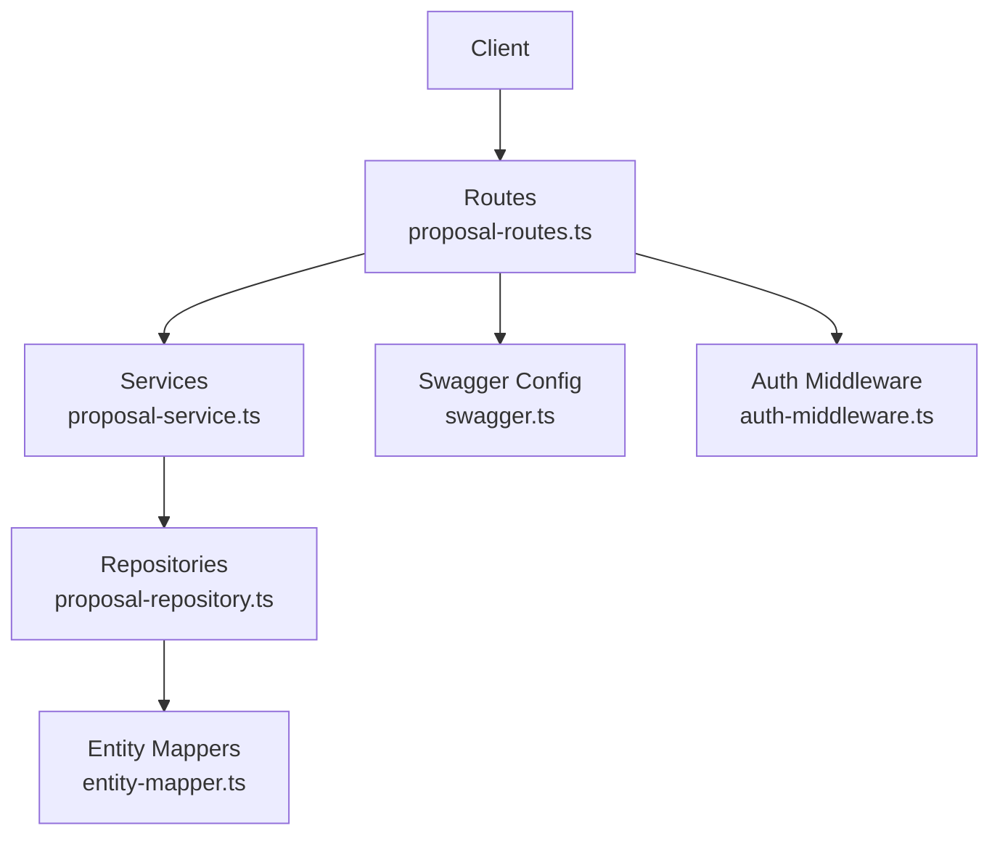
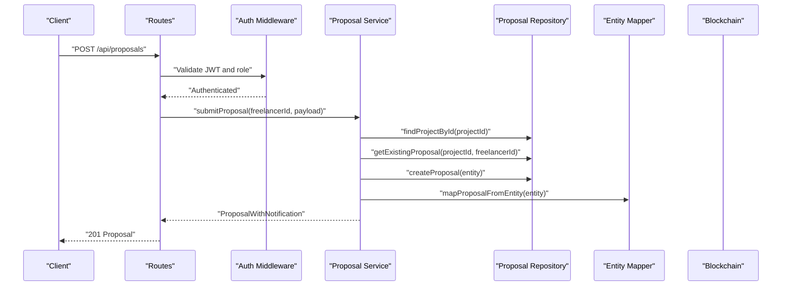
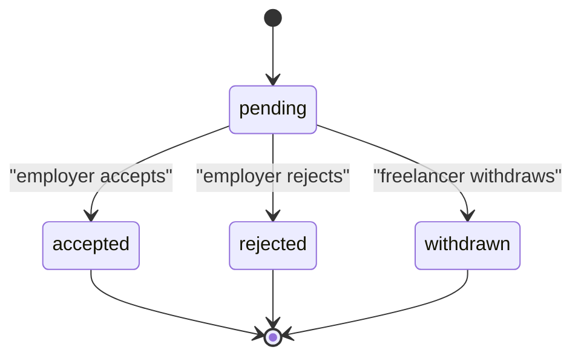
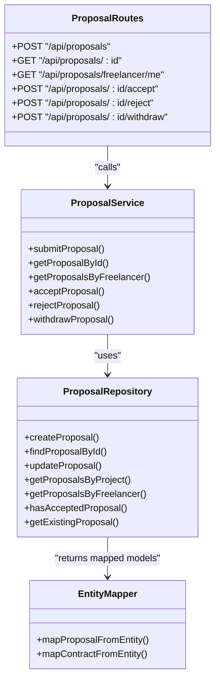

# Proposal API

<cite>
**Referenced Files in This Document**
- [proposal-routes.ts](file://src/routes/proposal-routes.ts)
- [proposal-service.ts](file://src/services/proposal-service.ts)
- [proposal-repository.ts](file://src/repositories/proposal-repository.ts)
- [entity-mapper.ts](file://src/utils/entity-mapper.ts)
- [swagger.ts](file://src/config/swagger.ts)
- [auth-middleware.ts](file://src/middleware/auth-middleware.ts)
- [API-DOCUMENTATION.md](file://docs/API-DOCUMENTATION.md)
</cite>

## Table of Contents
1. [Introduction](#introduction)
2. [Project Structure](#project-structure)
3. [Core Components](#core-components)
4. [Architecture Overview](#architecture-overview)
5. [Detailed Component Analysis](#detailed-component-analysis)
6. [Dependency Analysis](#dependency-analysis)
7. [Performance Considerations](#performance-considerations)
8. [Troubleshooting Guide](#troubleshooting-guide)
9. [Conclusion](#conclusion)
10. [Appendices](#appendices)

## Introduction
This document provides comprehensive API documentation for the proposal system in the FreelanceXchain platform. It covers all endpoints for submitting, retrieving, and managing proposals, including acceptance and withdrawal workflows. It also documents authentication requirements (JWT), role-based access controls, validation rules, and the proposal status lifecycle (pending, accepted, rejected, withdrawn). Client implementation examples are included to show how to submit a proposal and handle the contract creation response when a proposal is accepted.

## Project Structure
The proposal system spans routing, service, repository, and mapping layers, plus Swagger definitions and authentication middleware.

**Diagram sources**
- [proposal-routes.ts](file://src/routes/proposal-routes.ts#L1-L458)
- [proposal-service.ts](file://src/services/proposal-service.ts#L1-L414)
- [proposal-repository.ts](file://src/repositories/proposal-repository.ts#L1-L113)
- [entity-mapper.ts](file://src/utils/entity-mapper.ts#L252-L310)
- [swagger.ts](file://src/config/swagger.ts#L1-L233)
- [auth-middleware.ts](file://src/middleware/auth-middleware.ts#L1-L101)

**Section sources**
- [proposal-routes.ts](file://src/routes/proposal-routes.ts#L1-L458)
- [proposal-service.ts](file://src/services/proposal-service.ts#L1-L414)
- [proposal-repository.ts](file://src/repositories/proposal-repository.ts#L1-L113)
- [entity-mapper.ts](file://src/utils/entity-mapper.ts#L252-L310)
- [swagger.ts](file://src/config/swagger.ts#L1-L233)
- [auth-middleware.ts](file://src/middleware/auth-middleware.ts#L1-L101)

## Core Components
- Routes define HTTP endpoints, request/response schemas, and apply authentication and role checks.
- Services encapsulate business logic, enforce status rules, and orchestrate repository operations and blockchain interactions.
- Repositories abstract persistence and expose typed CRUD operations.
- Entity mappers convert between database entities and API models.
- Swagger defines OpenAPI schemas for Proposal and Contract types.
- Auth middleware validates JWT and enforces role-based access.

**Section sources**
- [proposal-routes.ts](file://src/routes/proposal-routes.ts#L1-L458)
- [proposal-service.ts](file://src/services/proposal-service.ts#L1-L414)
- [proposal-repository.ts](file://src/repositories/proposal-repository.ts#L1-L113)
- [entity-mapper.ts](file://src/utils/entity-mapper.ts#L252-L310)
- [swagger.ts](file://src/config/swagger.ts#L139-L167)
- [auth-middleware.ts](file://src/middleware/auth-middleware.ts#L1-L101)

## Architecture Overview
The proposal API follows a layered architecture:
- HTTP layer: Express routes
- Application layer: Service functions
- Persistence layer: Supabase repository
- Mapping layer: Entity mappers
- Security layer: JWT auth and role checks

**Diagram sources**
- [proposal-routes.ts](file://src/routes/proposal-routes.ts#L97-L153)
- [proposal-service.ts](file://src/services/proposal-service.ts#L64-L126)
- [proposal-repository.ts](file://src/repositories/proposal-repository.ts#L23-L33)
- [entity-mapper.ts](file://src/utils/entity-mapper.ts#L267-L279)
- [auth-middleware.ts](file://src/middleware/auth-middleware.ts#L25-L70)

## Detailed Component Analysis

### Authentication and Authorization
- All protected endpoints require a Bearer token in the Authorization header.
- The auth middleware validates the token format and decodes user identity and role.
- Role checks restrict endpoints to freelancers or employers as indicated below.

Key behaviors:
- Missing or malformed Authorization header yields 401.
- Invalid/expired token yields 401 with specific error code.
- Missing role yields 403.

**Section sources**
- [API-DOCUMENTATION.md](file://docs/API-DOCUMENTATION.md#L7-L14)
- [auth-middleware.ts](file://src/middleware/auth-middleware.ts#L25-L70)
- [auth-middleware.ts](file://src/middleware/auth-middleware.ts#L72-L100)

### Proposal Model and Schemas
Proposal schema includes:
- id, projectId, freelancerId
- coverLetter, proposedRate, estimatedDuration
- status: pending, accepted, rejected, withdrawn
- createdAt, updatedAt

Contract schema includes:
- id, projectId, proposalId, freelancerId, employerId
- escrowAddress, totalAmount
- status: active, completed, disputed, cancelled
- createdAt, updatedAt

These schemas are defined in Swagger and used across responses.

**Section sources**
- [swagger.ts](file://src/config/swagger.ts#L139-L167)
- [entity-mapper.ts](file://src/utils/entity-mapper.ts#L252-L310)

### Endpoints

#### Submit Proposal
- Method: POST
- URL: /api/proposals
- Authentication: JWT required; role: freelancer
- Request body:
  - projectId (string, UUID)
  - coverLetter (string, min length 10)
  - proposedRate (number, >= 1)
  - estimatedDuration (number, >= 1)
- Responses:
  - 201: Proposal created
  - 400: Validation error
  - 401: Unauthorized
  - 404: Project not found
  - 409: Duplicate proposal

Validation rules enforced:
- projectId must be a valid UUID
- coverLetter must be at least 10 characters
- proposedRate must be at least 1
- estimatedDuration must be at least 1 day
- Project must be open
- No duplicate proposal from the same freelancer for the same project

Success response includes the created Proposal.

**Section sources**
- [proposal-routes.ts](file://src/routes/proposal-routes.ts#L97-L153)
- [proposal-service.ts](file://src/services/proposal-service.ts#L64-L126)
- [proposal-repository.ts](file://src/repositories/proposal-repository.ts#L95-L109)

#### Get Proposal by ID
- Method: GET
- URL: /api/proposals/{id}
- Authentication: JWT required
- Path parameter: id (UUID)
- Responses:
  - 200: Proposal
  - 400: Invalid UUID format
  - 401: Unauthorized
  - 404: Proposal not found

**Section sources**
- [proposal-routes.ts](file://src/routes/proposal-routes.ts#L188-L204)
- [proposal-service.ts](file://src/services/proposal-service.ts#L129-L139)
- [proposal-repository.ts](file://src/repositories/proposal-repository.ts#L35-L37)

#### Get My Proposals (Freelancer)
- Method: GET
- URL: /api/proposals/freelancer/me
- Authentication: JWT required; role: freelancer
- Responses:
  - 200: Array of Proposal
  - 401: Unauthorized

**Section sources**
- [proposal-routes.ts](file://src/routes/proposal-routes.ts#L228-L253)
- [proposal-service.ts](file://src/services/proposal-service.ts#L166-L171)
- [proposal-repository.ts](file://src/repositories/proposal-repository.ts#L60-L69)

#### Accept Proposal
- Method: POST
- URL: /api/proposals/{id}/accept
- Authentication: JWT required; role: employer
- Path parameter: id (UUID)
- Responses:
  - 200: { proposal: Proposal, contract: Contract }
  - 400: Invalid proposal status or UUID format
  - 401: Unauthorized
  - 403: Unauthenticated or unauthorized
  - 404: Proposal not found

Behavior:
- Validates proposal is pending
- Verifies employer owns the associated project
- Updates proposal status to accepted
- Creates a Contract entity linked to the proposal and project
- Attempts to create and sign a blockchain agreement (best-effort)
- Updates project status to in_progress
- Sends notification to freelancer

**Section sources**
- [proposal-routes.ts](file://src/routes/proposal-routes.ts#L293-L326)
- [proposal-service.ts](file://src/services/proposal-service.ts#L174-L296)
- [proposal-repository.ts](file://src/repositories/proposal-repository.ts#L31-L33)
- [proposal-repository.ts](file://src/repositories/proposal-repository.ts#L23-L33)

#### Reject Proposal
- Method: POST
- URL: /api/proposals/{id}/reject
- Authentication: JWT required; role: employer
- Path parameter: id (UUID)
- Responses:
  - 200: Proposal (status: rejected)
  - 400: Invalid proposal status or UUID format
  - 401: Unauthorized
  - 403: Unauthenticated or unauthorized
  - 404: Proposal not found

Behavior:
- Validates proposal is pending
- Verifies employer owns the associated project
- Updates proposal status to rejected
- Sends notification to freelancer

**Section sources**
- [proposal-routes.ts](file://src/routes/proposal-routes.ts#L360-L389)
- [proposal-service.ts](file://src/services/proposal-service.ts#L299-L370)
- [proposal-repository.ts](file://src/repositories/proposal-repository.ts#L31-L33)

#### Withdraw Proposal
- Method: POST
- URL: /api/proposals/{id}/withdraw
- Authentication: JWT required; role: freelancer
- Path parameter: id (UUID)
- Responses:
  - 200: Proposal (status: withdrawn)
  - 400: Invalid proposal status or UUID format
  - 401: Unauthorized
  - 403: Unauthenticated or unauthorized
  - 404: Proposal not found

Behavior:
- Validates proposal is pending
- Ensures freelancer owns the proposal
- Updates proposal status to withdrawn

**Section sources**
- [proposal-routes.ts](file://src/routes/proposal-routes.ts#L425-L455)
- [proposal-service.ts](file://src/services/proposal-service.ts#L372-L414)
- [proposal-repository.ts](file://src/repositories/proposal-repository.ts#L31-L33)

### Proposal Status Lifecycle
- pending: Initial state after submission
- accepted: Employer accepted the proposal; contract created
- rejected: Employer rejected the proposal
- withdrawn: Freelancer withdrew a pending proposal

**Diagram sources**
- [proposal-service.ts](file://src/services/proposal-service.ts#L174-L296)
- [proposal-service.ts](file://src/services/proposal-service.ts#L299-L370)
- [proposal-service.ts](file://src/services/proposal-service.ts#L372-L414)

### Role-Based Access Controls
- Submit Proposal: freelancer only
- Accept/Reject Proposal: employer only
- Withdraw Proposal: freelancer only
- Get Proposal Details: authenticated user
- Get My Proposals: freelancer only

**Section sources**
- [proposal-routes.ts](file://src/routes/proposal-routes.ts#L97-L153)
- [proposal-routes.ts](file://src/routes/proposal-routes.ts#L228-L253)
- [proposal-routes.ts](file://src/routes/proposal-routes.ts#L293-L326)
- [proposal-routes.ts](file://src/routes/proposal-routes.ts#L360-L389)
- [proposal-routes.ts](file://src/routes/proposal-routes.ts#L425-L455)
- [auth-middleware.ts](file://src/middleware/auth-middleware.ts#L72-L100)

### Validation Rules
- projectId: required, valid UUID
- coverLetter: required, min length 10
- proposedRate: required, numeric, >= 1
- estimatedDuration: required, numeric, >= 1 day
- Project must be open for submissions
- Duplicate proposal per freelancer per project is not allowed

**Section sources**
- [proposal-routes.ts](file://src/routes/proposal-routes.ts#L111-L126)
- [proposal-service.ts](file://src/services/proposal-service.ts#L64-L93)
- [proposal-repository.ts](file://src/repositories/proposal-repository.ts#L95-L109)

### Client Implementation Examples

#### Example: Submit a Proposal
- Endpoint: POST /api/proposals
- Headers: Authorization: Bearer <JWT>, Content-Type: application/json
- Request body:
  - projectId: UUID
  - coverLetter: string (>= 10 chars)
  - proposedRate: number (>= 1)
  - estimatedDuration: number (>= 1)
- Expected responses:
  - 201: Created Proposal
  - 400: Validation error
  - 401: Unauthorized
  - 404: Project not found
  - 409: Duplicate proposal

**Section sources**
- [proposal-routes.ts](file://src/routes/proposal-routes.ts#L97-L153)
- [proposal-service.ts](file://src/services/proposal-service.ts#L64-L126)

#### Example: Handle Contract Creation on Accept
- Endpoint: POST /api/proposals/{id}/accept
- Expected response:
  - proposal: Proposal (status: accepted)
  - contract: Contract (with contract details)
- Client should:
  - Store the returned contract metadata
  - Track contract status transitions
  - Proceed with milestone workflows as per contract terms

**Section sources**
- [proposal-routes.ts](file://src/routes/proposal-routes.ts#L293-L326)
- [proposal-service.ts](file://src/services/proposal-service.ts#L174-L296)

## Dependency Analysis

**Diagram sources**
- [proposal-routes.ts](file://src/routes/proposal-routes.ts#L1-L458)
- [proposal-service.ts](file://src/services/proposal-service.ts#L1-L414)
- [proposal-repository.ts](file://src/repositories/proposal-repository.ts#L1-L113)
- [entity-mapper.ts](file://src/utils/entity-mapper.ts#L252-L310)

**Section sources**
- [proposal-routes.ts](file://src/routes/proposal-routes.ts#L1-L458)
- [proposal-service.ts](file://src/services/proposal-service.ts#L1-L414)
- [proposal-repository.ts](file://src/repositories/proposal-repository.ts#L1-L113)
- [entity-mapper.ts](file://src/utils/entity-mapper.ts#L252-L310)

## Performance Considerations
- Pagination is supported for listing proposals by project via repository methods; consider using limit/offset for large datasets.
- Accept/Reject/Withdraw operations perform a small number of database writes and a blockchain operation (best-effort); network latency may impact response time.
- Ensure clients cache frequently accessed Proposal and Contract details to reduce repeated requests.

[No sources needed since this section provides general guidance]

## Troubleshooting Guide
Common issues and resolutions:
- 400 Validation Error: Review request body fields (UUID format, lengths, numeric bounds).
- 401 Unauthorized: Ensure Authorization header is present and contains a valid Bearer token.
- 403 Forbidden: Confirm the user’s role matches the endpoint requirement.
- 404 Not Found: Verify resource IDs exist (project, proposal).
- 409 Conflict (Duplicate Proposal): A proposal already exists for the same freelancer and project.

**Section sources**
- [proposal-routes.ts](file://src/routes/proposal-routes.ts#L128-L150)
- [proposal-routes.ts](file://src/routes/proposal-routes.ts#L194-L201)
- [proposal-routes.ts](file://src/routes/proposal-routes.ts#L243-L250)
- [proposal-routes.ts](file://src/routes/proposal-routes.ts#L310-L319)
- [proposal-routes.ts](file://src/routes/proposal-routes.ts#L376-L387)
- [proposal-routes.ts](file://src/routes/proposal-routes.ts#L441-L452)

## Conclusion
The proposal system provides a robust, role-aware API for freelancers to submit proposals and for employers to manage them. It enforces strong validation, maintains clear status transitions, and integrates with contract and blockchain workflows upon acceptance. Clients should implement proper JWT handling, adhere to validation rules, and expect contract creation on successful acceptance.

[No sources needed since this section summarizes without analyzing specific files]

## Appendices

### API Definitions

- Base URL: http://localhost:3000/api
- Interactive docs: http://localhost:3000/api-docs
- Authentication: Bearer token in Authorization header

**Section sources**
- [API-DOCUMENTATION.md](file://docs/API-DOCUMENTATION.md#L1-L14)
- [swagger.ts](file://src/config/swagger.ts#L15-L20)

### Proposal Schema
- Fields: id, projectId, freelancerId, coverLetter, proposedRate, estimatedDuration, status, createdAt, updatedAt

**Section sources**
- [swagger.ts](file://src/config/swagger.ts#L139-L151)
- [entity-mapper.ts](file://src/utils/entity-mapper.ts#L252-L279)

### Contract Schema
- Fields: id, projectId, proposalId, freelancerId, employerId, escrowAddress, totalAmount, status, createdAt, updatedAt

**Section sources**
- [swagger.ts](file://src/config/swagger.ts#L153-L167)
- [entity-mapper.ts](file://src/utils/entity-mapper.ts#L282-L309)