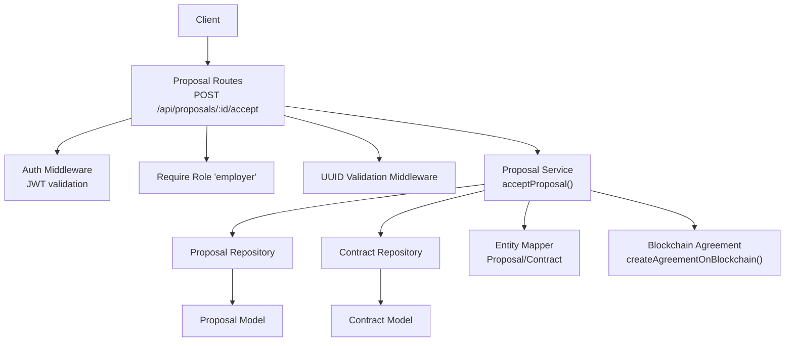
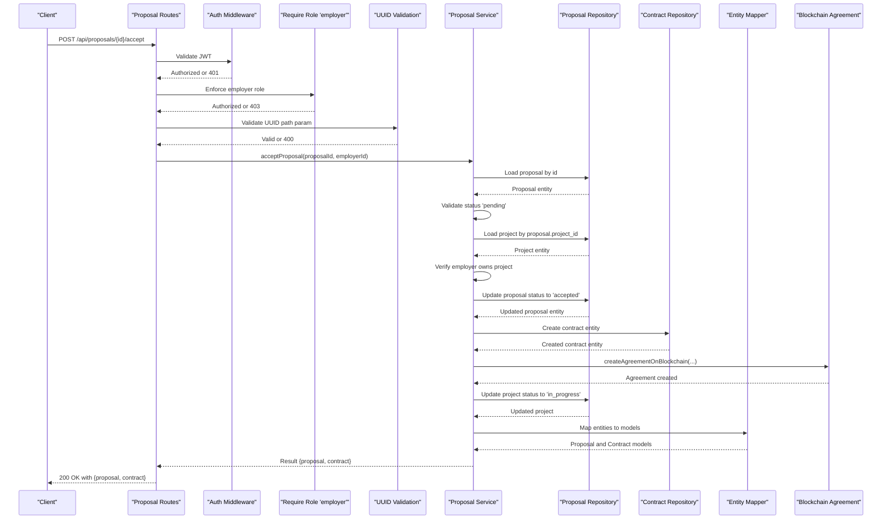
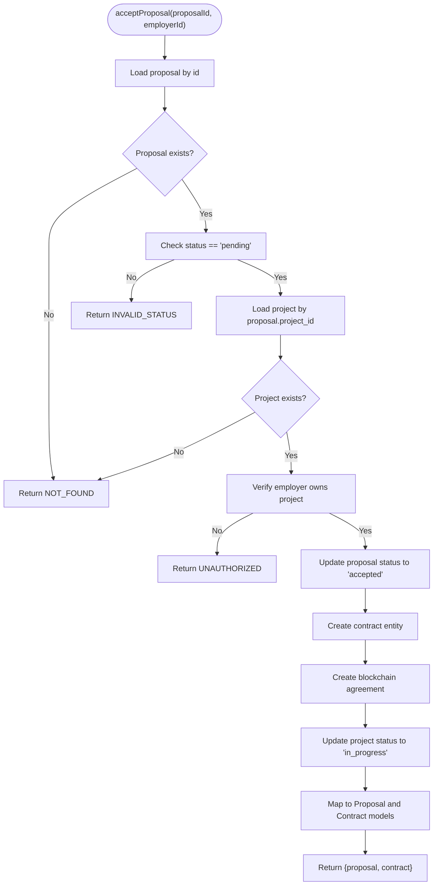
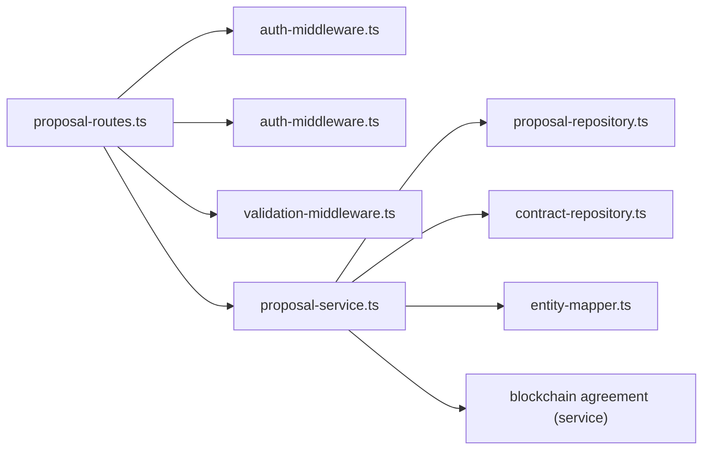

# Proposal Acceptance

<cite>
**Referenced Files in This Document**
- [proposal-routes.ts](file://src/routes/proposal-routes.ts)
- [proposal-service.ts](file://src/services/proposal-service.ts)
- [auth-middleware.ts](file://src/middleware/auth-middleware.ts)
- [validation-middleware.ts](file://src/middleware/validation-middleware.ts)
- [entity-mapper.ts](file://src/utils/entity-mapper.ts)
- [proposal-repository.ts](file://src/repositories/proposal-repository.ts)
- [contract-repository.ts](file://src/repositories/contract-repository.ts)
- [contract-service.ts](file://src/services/contract-service.ts)
- [API-DOCUMENTATION.md](file://docs/API-DOCUMENTATION.md)
- [README.md](file://README.md)
</cite>

## Table of Contents
1. [Introduction](#introduction)
2. [Project Structure](#project-structure)
3. [Core Components](#core-components)
4. [Architecture Overview](#architecture-overview)
5. [Detailed Component Analysis](#detailed-component-analysis)
6. [Dependency Analysis](#dependency-analysis)
7. [Performance Considerations](#performance-considerations)
8. [Troubleshooting Guide](#troubleshooting-guide)
9. [Conclusion](#conclusion)

## Introduction
This document provides API documentation for the proposal acceptance endpoint in the FreelanceXchain system. It covers the POST /api/proposals/{id}/accept endpoint that enables employers to accept a freelancer’s proposal. Upon acceptance, the system updates the proposal status to accepted and automatically creates a new contract via the contract service, initiating the escrow process. The response includes both the updated Proposal object and the newly created Contract object. The document outlines authentication via JWT, role-based restrictions, validation rules, and error handling behavior.

## Project Structure
The proposal acceptance flow spans routing, middleware, service, repository, and model layers, plus blockchain integration for escrow creation.

**Diagram sources**
- [proposal-routes.ts](file://src/routes/proposal-routes.ts#L256-L326)
- [auth-middleware.ts](file://src/middleware/auth-middleware.ts#L25-L101)
- [validation-middleware.ts](file://src/middleware/validation-middleware.ts#L778-L800)
- [proposal-service.ts](file://src/services/proposal-service.ts#L174-L296)
- [proposal-repository.ts](file://src/repositories/proposal-repository.ts#L1-L113)
- [contract-repository.ts](file://src/repositories/contract-repository.ts#L1-L139)
- [entity-mapper.ts](file://src/utils/entity-mapper.ts#L252-L310)

**Section sources**
- [proposal-routes.ts](file://src/routes/proposal-routes.ts#L256-L326)
- [README.md](file://README.md#L153-L178)

## Core Components
- Route handler enforces JWT authentication, employer role, and UUID path parameter validation.
- Service orchestrates proposal acceptance, status update, contract creation, blockchain agreement, and project status update.
- Repositories persist proposal and contract entities.
- Entity mapper converts database entities to API models.
- Blockchain integration creates and signs an agreement on-chain.

Key behaviors:
- Acceptance requires proposal status to be pending.
- Only the project owner (employer) can accept a proposal.
- On success, returns both the updated proposal and the newly created contract.

**Section sources**
- [proposal-routes.ts](file://src/routes/proposal-routes.ts#L256-L326)
- [proposal-service.ts](file://src/services/proposal-service.ts#L174-L296)
- [entity-mapper.ts](file://src/utils/entity-mapper.ts#L252-L310)

## Architecture Overview
The endpoint follows a layered architecture:
- HTTP layer: Express route with middleware.
- Application layer: Proposal service encapsulates business logic.
- Persistence layer: Repositories for proposal and contract.
- Mapping layer: Entity mapper for DTO conversion.
- Integration layer: Blockchain agreement creation.

**Diagram sources**
- [proposal-routes.ts](file://src/routes/proposal-routes.ts#L256-L326)
- [proposal-service.ts](file://src/services/proposal-service.ts#L174-L296)
- [proposal-repository.ts](file://src/repositories/proposal-repository.ts#L1-L113)
- [contract-repository.ts](file://src/repositories/contract-repository.ts#L1-L139)
- [entity-mapper.ts](file://src/utils/entity-mapper.ts#L252-L310)

## Detailed Component Analysis

### Endpoint Definition
- Method: POST
- URL: /api/proposals/{id}/accept
- Path parameter: id (UUID)
- Authentication: Bearer JWT
- Roles: employer only
- Validation: UUID format enforced

Response schema:
- proposal: Proposal model
- contract: Contract model

Status codes:
- 200: Success
- 400: Invalid UUID format or invalid status
- 401: Unauthorized
- 403: Insufficient permissions
- 404: Proposal not found

Practical example:
- An employer calls the endpoint with a valid JWT and a proposal UUID.
- On success, the response includes the updated Proposal (status accepted) and the newly created Contract (with initial status active and empty escrow address pending blockchain initialization).

Validation checks:
- Proposal must exist and be pending.
- Only the project owner (employer) can accept.
- Path parameter must be a valid UUID.

**Section sources**
- [proposal-routes.ts](file://src/routes/proposal-routes.ts#L256-L326)
- [API-DOCUMENTATION.md](file://docs/API-DOCUMENTATION.md#L323-L331)

### Route Handler Behavior
- Uses authMiddleware to validate JWT.
- Uses requireRole('employer') to restrict access.
- Uses validateUUID() to enforce UUID path parameter format.
- Calls acceptProposal(service) and returns combined result.

Error mapping:
- NOT_FOUND -> 404
- UNAUTHORIZED -> 403
- Otherwise -> 400

**Section sources**
- [proposal-routes.ts](file://src/routes/proposal-routes.ts#L293-L326)
- [auth-middleware.ts](file://src/middleware/auth-middleware.ts#L25-L101)
- [validation-middleware.ts](file://src/middleware/validation-middleware.ts#L778-L800)

### Service Logic: acceptProposal
- Loads proposal by ID; returns NOT_FOUND if absent.
- Ensures proposal status is pending; otherwise INVALID_STATUS.
- Loads project and verifies employer ownership; returns UNAUTHORIZED if mismatch.
- Updates proposal status to accepted.
- Creates a new contract with:
  - project_id from proposal
  - proposal_id from proposal
  - freelancer_id and employer_id from proposal and project
  - total_amount from project budget
  - status active
  - escrow_address initially empty
- Attempts to create and sign a blockchain agreement (employer creates, freelancer auto-signs).
- Updates project status to in_progress.
- Returns { proposal, contract } mapped to models.

**Diagram sources**
- [proposal-service.ts](file://src/services/proposal-service.ts#L174-L296)

**Section sources**
- [proposal-service.ts](file://src/services/proposal-service.ts#L174-L296)

### Data Models and Mapping
- Proposal model fields include id, projectId, freelancerId, coverLetter, proposedRate, estimatedDuration, status, createdAt, updatedAt.
- Contract model fields include id, projectId, proposalId, freelancerId, employerId, escrowAddress, totalAmount, status, createdAt, updatedAt.
- Entity mapper converts repository entities to API models.

**Section sources**
- [entity-mapper.ts](file://src/utils/entity-mapper.ts#L252-L310)

### Blockchain Integration
- On successful acceptance, the service attempts to create an agreement on the blockchain using the employer and freelancer wallet addresses and project terms.
- The freelancer auto-signs the agreement after acceptance.
- The contract’s escrow_address remains empty until the escrow is initialized externally.

**Section sources**
- [proposal-service.ts](file://src/services/proposal-service.ts#L240-L267)

### Contract Service Context
- The contract service provides additional operations (e.g., updating status transitions, setting escrow address, retrieving contracts by proposalId).
- These operations complement the acceptance flow by enabling subsequent contract lifecycle management.

**Section sources**
- [contract-service.ts](file://src/services/contract-service.ts#L1-L140)

## Dependency Analysis
The endpoint depends on:
- Route handler for authentication, role enforcement, and UUID validation.
- Proposal service for business logic.
- Repositories for persistence.
- Entity mapper for model conversion.
- Blockchain service for agreement creation.

**Diagram sources**
- [proposal-routes.ts](file://src/routes/proposal-routes.ts#L256-L326)
- [auth-middleware.ts](file://src/middleware/auth-middleware.ts#L25-L101)
- [validation-middleware.ts](file://src/middleware/validation-middleware.ts#L778-L800)
- [proposal-service.ts](file://src/services/proposal-service.ts#L174-L296)
- [proposal-repository.ts](file://src/repositories/proposal-repository.ts#L1-L113)
- [contract-repository.ts](file://src/repositories/contract-repository.ts#L1-L139)
- [entity-mapper.ts](file://src/utils/entity-mapper.ts#L252-L310)

**Section sources**
- [proposal-routes.ts](file://src/routes/proposal-routes.ts#L256-L326)
- [proposal-service.ts](file://src/services/proposal-service.ts#L174-L296)

## Performance Considerations
- Minimizing database round-trips: The service performs a small fixed number of reads/writes per acceptance.
- Asynchronous blockchain operations: Agreement creation is attempted asynchronously; failures are logged and do not block the HTTP response.
- Caching: No caching is implemented in the acceptance flow; keep in mind that repeated acceptance attempts for the same proposal should be prevented by the pending status check.

[No sources needed since this section provides general guidance]

## Troubleshooting Guide
Common issues and resolutions:
- 401 Unauthorized: Ensure a valid Bearer token is included in the Authorization header.
- 403 Forbidden: Confirm the user has the employer role and owns the project associated with the proposal.
- 400 Bad Request: Verify the proposal ID is a valid UUID and the proposal status is pending.
- 404 Not Found: The proposal may not exist or the project may have been deleted.
- Blockchain failure: Agreement creation errors are logged and do not prevent contract creation; initialize escrow separately if needed.

**Section sources**
- [auth-middleware.ts](file://src/middleware/auth-middleware.ts#L25-L101)
- [proposal-service.ts](file://src/services/proposal-service.ts#L174-L296)
- [proposal-routes.ts](file://src/routes/proposal-routes.ts#L293-L326)

## Conclusion
The POST /api/proposals/{id}/accept endpoint provides a robust, role-restricted mechanism for employers to accept proposals. It enforces strict validation, updates statuses atomically, creates contracts, and initiates blockchain agreements. The response returns both the updated proposal and the new contract, enabling downstream escrow initialization and milestone management.