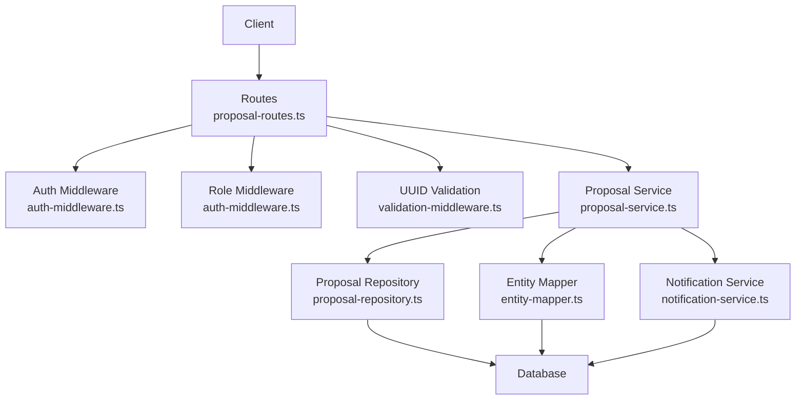
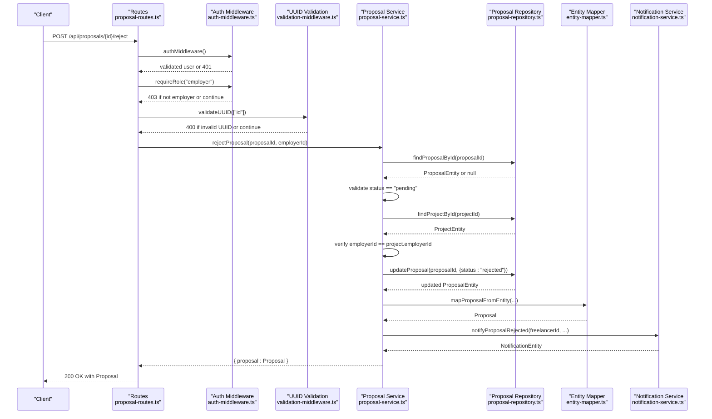
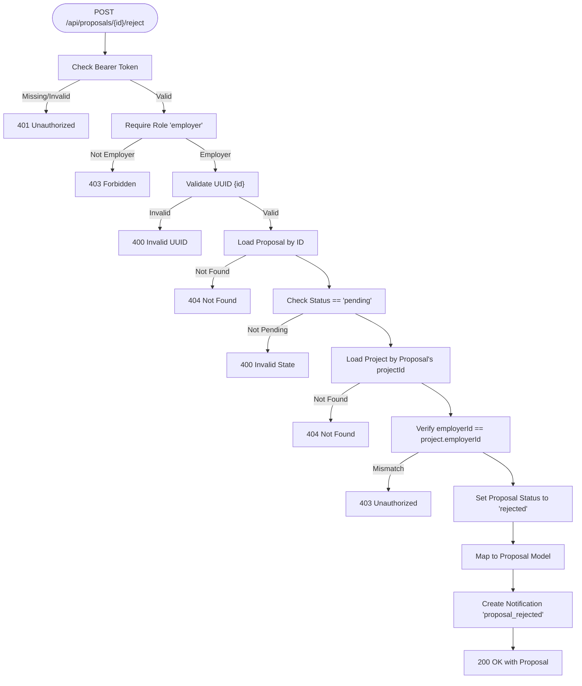
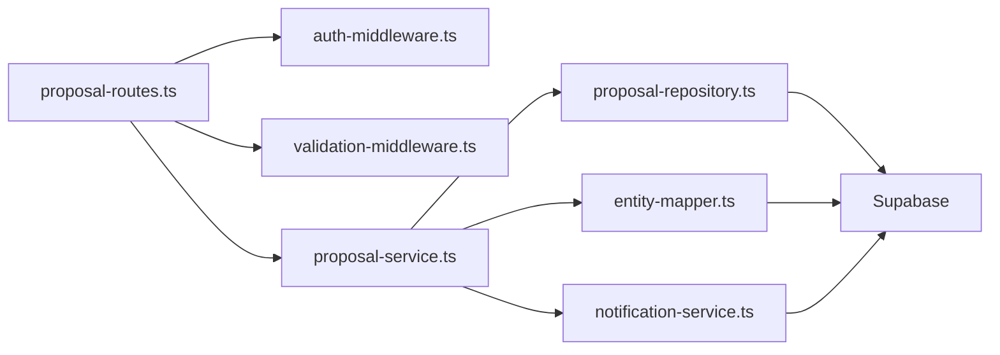

# Proposal Rejection

<cite>
**Referenced Files in This Document**
- [proposal-routes.ts](file://src/routes/proposal-routes.ts)
- [proposal-service.ts](file://src/services/proposal-service.ts)
- [validation-middleware.ts](file://src/middleware/validation-middleware.ts)
- [auth-middleware.ts](file://src/middleware/auth-middleware.ts)
- [proposal-repository.ts](file://src/repositories/proposal-repository.ts)
- [entity-mapper.ts](file://src/utils/entity-mapper.ts)
- [notification-service.ts](file://src/services/notification-service.ts)
</cite>

## Table of Contents
1. [Introduction](#introduction)
2. [Project Structure](#project-structure)
3. [Core Components](#core-components)
4. [Architecture Overview](#architecture-overview)
5. [Detailed Component Analysis](#detailed-component-analysis)
6. [Dependency Analysis](#dependency-analysis)
7. [Performance Considerations](#performance-considerations)
8. [Troubleshooting Guide](#troubleshooting-guide)
9. [Conclusion](#conclusion)

## Introduction
This document describes the POST /api/proposals/{id}/reject endpoint used by employers to reject a proposal. It covers the HTTP method, URL structure with UUID path parameter, authentication and role-based access control, workflow behavior, response schema, and status codes. It also explains backend validations that ensure only the project owner can reject proposals and only pending proposals can be rejected, along with the notification trigger that informs the freelancer.

## Project Structure
The proposal rejection endpoint is implemented as part of the proposals feature module:
- Route handler: defines the endpoint, applies middleware, and delegates to the service layer
- Service layer: enforces business rules, updates the proposal, and triggers notifications
- Middleware: authentication and role checks, plus UUID validation for path parameters
- Repositories and mappers: persistence and model mapping
- Notification service: creates a “proposal_rejected” notification for the freelancer

**Diagram sources**
- [proposal-routes.ts](file://src/routes/proposal-routes.ts#L330-L390)
- [auth-middleware.ts](file://src/middleware/auth-middleware.ts#L25-L70)
- [auth-middleware.ts](file://src/middleware/auth-middleware.ts#L72-L101)
- [validation-middleware.ts](file://src/middleware/validation-middleware.ts#L780-L815)
- [proposal-service.ts](file://src/services/proposal-service.ts#L299-L370)
- [proposal-repository.ts](file://src/repositories/proposal-repository.ts#L1-L113)
- [entity-mapper.ts](file://src/utils/entity-mapper.ts#L252-L280)
- [notification-service.ts](file://src/services/notification-service.ts#L196-L209)

**Section sources**
- [proposal-routes.ts](file://src/routes/proposal-routes.ts#L330-L390)
- [auth-middleware.ts](file://src/middleware/auth-middleware.ts#L25-L101)
- [validation-middleware.ts](file://src/middleware/validation-middleware.ts#L780-L815)
- [proposal-service.ts](file://src/services/proposal-service.ts#L299-L370)
- [proposal-repository.ts](file://src/repositories/proposal-repository.ts#L1-L113)
- [entity-mapper.ts](file://src/utils/entity-mapper.ts#L252-L280)
- [notification-service.ts](file://src/services/notification-service.ts#L196-L209)

## Core Components
- Endpoint definition: POST /api/proposals/{id}/reject
- Authentication: Bearer JWT token required
- Authorization: Only users with role “employer”
- Path parameter validation: {id} must be a valid UUID
- Business logic: Reject a pending proposal and send a notification to the freelancer
- Response: Updated Proposal object

**Section sources**
- [proposal-routes.ts](file://src/routes/proposal-routes.ts#L330-L390)
- [auth-middleware.ts](file://src/middleware/auth-middleware.ts#L25-L101)
- [validation-middleware.ts](file://src/middleware/validation-middleware.ts#L780-L815)
- [proposal-service.ts](file://src/services/proposal-service.ts#L299-L370)

## Architecture Overview
The rejection workflow spans route handling, middleware enforcement, service logic, and persistence/notification layers.

**Diagram sources**
- [proposal-routes.ts](file://src/routes/proposal-routes.ts#L360-L390)
- [auth-middleware.ts](file://src/middleware/auth-middleware.ts#L25-L101)
- [validation-middleware.ts](file://src/middleware/validation-middleware.ts#L780-L815)
- [proposal-service.ts](file://src/services/proposal-service.ts#L299-L370)
- [proposal-repository.ts](file://src/repositories/proposal-repository.ts#L1-L113)
- [entity-mapper.ts](file://src/utils/entity-mapper.ts#L252-L280)
- [notification-service.ts](file://src/services/notification-service.ts#L196-L209)

## Detailed Component Analysis

### Endpoint Definition
- Method: POST
- URL: /api/proposals/{id}/reject
- Path parameter: id (UUID)
- Authentication: Bearer JWT token required
- Authorization: employer role required
- Body: not used for rejection (no request body)
- Response: 200 OK with the updated Proposal object

**Section sources**
- [proposal-routes.ts](file://src/routes/proposal-routes.ts#L330-L390)

### Authentication and Authorization
- Authentication middleware validates the Authorization header format and verifies the JWT token. On failure, returns 401 with an error payload.
- Role middleware ensures the authenticated user has role “employer”. On failure, returns 403 with an error payload.

**Section sources**
- [auth-middleware.ts](file://src/middleware/auth-middleware.ts#L25-L70)
- [auth-middleware.ts](file://src/middleware/auth-middleware.ts#L72-L101)

### UUID Validation
- The route applies UUID validation for the path parameter {id}. If invalid, returns 400 with a validation error payload.

**Section sources**
- [validation-middleware.ts](file://src/middleware/validation-middleware.ts#L780-L815)
- [proposal-routes.ts](file://src/routes/proposal-routes.ts#L360-L390)

### Business Logic and Workflow
- Load proposal by ID; return 404 if not found.
- Ensure proposal status is “pending”; otherwise return 400 with an error indicating invalid state.
- Load project by proposal’s project_id; return 404 if not found.
- Verify that the employerId equals the project’s employerId; otherwise return 403 with unauthorized error.
- Update proposal status to “rejected”.
- Map the updated entity to the Proposal model.
- Create a notification of type “proposal_rejected” for the freelancer.
- Return the updated Proposal object with 200 OK.

**Diagram sources**
- [proposal-routes.ts](file://src/routes/proposal-routes.ts#L360-L390)
- [proposal-service.ts](file://src/services/proposal-service.ts#L299-L370)
- [proposal-repository.ts](file://src/repositories/proposal-repository.ts#L1-L113)
- [entity-mapper.ts](file://src/utils/entity-mapper.ts#L252-L280)
- [notification-service.ts](file://src/services/notification-service.ts#L196-L209)

**Section sources**
- [proposal-service.ts](file://src/services/proposal-service.ts#L299-L370)

### Response Schema
- Success response: 200 OK with the updated Proposal object
- Error responses:
  - 400 Bad Request: invalid UUID format or invalid proposal state
  - 401 Unauthorized: missing or invalid Bearer token
  - 403 Forbidden: insufficient permissions (not employer) or unauthorized action (not project owner)
  - 404 Not Found: proposal or project not found

The Proposal object includes:
- id: string (UUID)
- projectId: string (UUID)
- freelancerId: string (UUID)
- coverLetter: string
- proposedRate: number
- estimatedDuration: number
- status: one of pending, accepted, rejected, withdrawn
- createdAt: string (ISO 8601)
- updatedAt: string (ISO 8601)

**Section sources**
- [proposal-routes.ts](file://src/routes/proposal-routes.ts#L330-L390)
- [proposal-service.ts](file://src/services/proposal-service.ts#L299-L370)
- [entity-mapper.ts](file://src/utils/entity-mapper.ts#L252-L280)

### Example Scenario
Scenario: An employer rejects a proposal because the freelancer’s skills do not match the project requirements.
- The employer calls POST /api/proposals/{proposalId}/reject with a valid JWT token and role “employer”.
- The system verifies the proposal is pending and owned by the employer.
- The proposal status is updated to “rejected”.
- A notification of type “proposal_rejected” is created for the freelancer.
- The endpoint returns 200 OK with the updated Proposal object.

**Section sources**
- [proposal-service.ts](file://src/services/proposal-service.ts#L299-L370)
- [notification-service.ts](file://src/services/notification-service.ts#L196-L209)

## Dependency Analysis
- Route depends on:
  - auth-middleware for JWT validation and role checks
  - validation-middleware for UUID parameter validation
  - proposal-service for business logic
- proposal-service depends on:
  - proposal-repository for persistence
  - entity-mapper for model conversion
  - notification-service for creating notifications
- proposal-repository depends on Supabase client and the proposals table
- notification-service depends on notification-repository and Supabase

**Diagram sources**
- [proposal-routes.ts](file://src/routes/proposal-routes.ts#L330-L390)
- [auth-middleware.ts](file://src/middleware/auth-middleware.ts#L25-L101)
- [validation-middleware.ts](file://src/middleware/validation-middleware.ts#L780-L815)
- [proposal-service.ts](file://src/services/proposal-service.ts#L299-L370)
- [proposal-repository.ts](file://src/repositories/proposal-repository.ts#L1-L113)
- [entity-mapper.ts](file://src/utils/entity-mapper.ts#L252-L280)
- [notification-service.ts](file://src/services/notification-service.ts#L196-L209)

**Section sources**
- [proposal-routes.ts](file://src/routes/proposal-routes.ts#L330-L390)
- [proposal-service.ts](file://src/services/proposal-service.ts#L299-L370)
- [proposal-repository.ts](file://src/repositories/proposal-repository.ts#L1-L113)
- [entity-mapper.ts](file://src/utils/entity-mapper.ts#L252-L280)
- [notification-service.ts](file://src/services/notification-service.ts#L196-L209)

## Performance Considerations
- The endpoint performs two database reads (proposal and project) and one write (proposal update). These are lightweight operations suitable for typical load.
- UUID validation occurs before any database calls, reducing unnecessary database traffic on malformed requests.
- Notification creation is performed synchronously in the service layer; consider offloading to a queue if high throughput is anticipated.

[No sources needed since this section provides general guidance]

## Troubleshooting Guide
Common issues and resolutions:
- 400 Invalid UUID: Ensure the {id} path parameter is a valid UUID.
- 400 Invalid State: The proposal must be in “pending” status to be rejected.
- 401 Unauthorized: Confirm the Authorization header is present and contains a valid Bearer token.
- 403 Forbidden: The authenticated user must have role “employer” and must own the project containing the proposal.
- 404 Not Found: The proposal or project does not exist.

Validation and error handling are centralized in the route handlers and middleware, returning structured error payloads with timestamps and request IDs.

**Section sources**
- [proposal-routes.ts](file://src/routes/proposal-routes.ts#L360-L390)
- [auth-middleware.ts](file://src/middleware/auth-middleware.ts#L25-L101)
- [validation-middleware.ts](file://src/middleware/validation-middleware.ts#L780-L815)
- [proposal-service.ts](file://src/services/proposal-service.ts#L299-L370)

## Conclusion
The POST /api/proposals/{id}/reject endpoint provides a secure and robust mechanism for employers to reject proposals. It enforces JWT authentication, role-based access control, UUID parameter validation, and strict business rules (only pending proposals, only project owners). On success, it returns the updated Proposal object and triggers a notification for the freelancer. The implementation is modular, testable, and aligned with the broader system architecture.