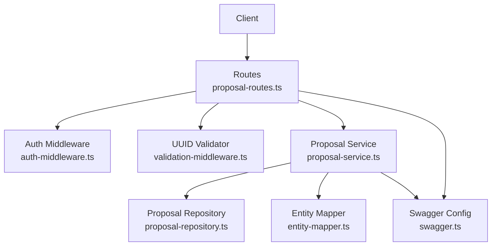
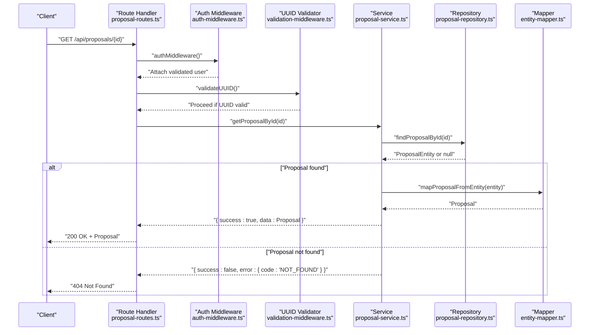
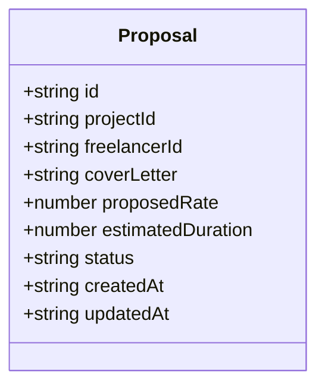
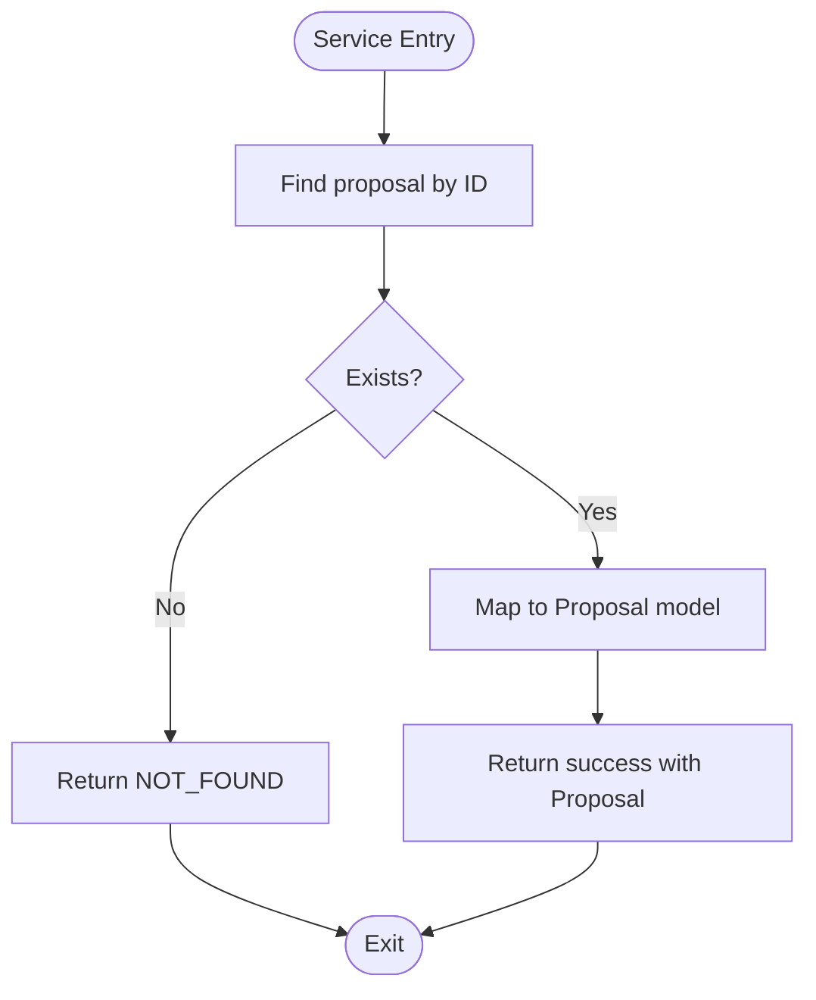
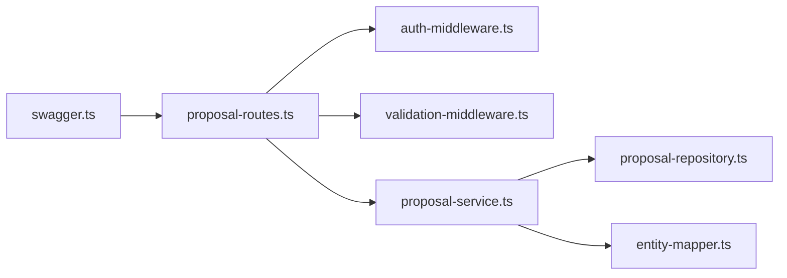

# Proposal Retrieval

<cite>
**Referenced Files in This Document**
- [proposal-routes.ts](file://src/routes/proposal-routes.ts)
- [proposal-service.ts](file://src/services/proposal-service.ts)
- [proposal-repository.ts](file://src/repositories/proposal-repository.ts)
- [validation-middleware.ts](file://src/middleware/validation-middleware.ts)
- [auth-middleware.ts](file://src/middleware/auth-middleware.ts)
- [entity-mapper.ts](file://src/utils/entity-mapper.ts)
- [swagger.ts](file://src/config/swagger.ts)
- [app.ts](file://src/app.ts)
</cite>

## Table of Contents
1. [Introduction](#introduction)
2. [Project Structure](#project-structure)
3. [Core Components](#core-components)
4. [Architecture Overview](#architecture-overview)
5. [Detailed Component Analysis](#detailed-component-analysis)
6. [Dependency Analysis](#dependency-analysis)
7. [Performance Considerations](#performance-considerations)
8. [Troubleshooting Guide](#troubleshooting-guide)
9. [Conclusion](#conclusion)

## Introduction
This document describes the proposal retrieval endpoints in the FreelanceXchain system. It covers:
- Two GET endpoints: retrieving a specific proposal by UUID and retrieving all proposals submitted by the authenticated freelancer.
- Authentication and authorization requirements.
- Response schemas aligned with the Proposal model.
- Access control rules and error responses.
- Usage examples for an employer viewing a proposal and a freelancer checking their submission history.
- How the service layer validates ownership and permissions before returning data.

## Project Structure
The proposal retrieval endpoints are implemented in the routing layer and backed by a service layer that interacts with repositories and uses entity mappers to produce the Proposal model.

**Diagram sources**
- [proposal-routes.ts](file://src/routes/proposal-routes.ts#L1-L253)
- [auth-middleware.ts](file://src/middleware/auth-middleware.ts#L1-L101)
- [validation-middleware.ts](file://src/middleware/validation-middleware.ts#L772-L800)
- [proposal-service.ts](file://src/services/proposal-service.ts#L129-L171)
- [proposal-repository.ts](file://src/repositories/proposal-repository.ts#L1-L113)
- [entity-mapper.ts](file://src/utils/entity-mapper.ts#L252-L279)
- [swagger.ts](file://src/config/swagger.ts#L139-L152)
- [app.ts](file://src/app.ts#L58-L87)

**Section sources**
- [proposal-routes.ts](file://src/routes/proposal-routes.ts#L1-L253)
- [app.ts](file://src/app.ts#L58-L87)

## Core Components
- Route handlers for proposal retrieval:
  - GET /api/proposals/{id}
  - GET /api/proposals/freelancer/me
- Service layer functions:
  - getProposalById
  - getProposalsByFreelancer
- Repository for proposal persistence:
  - findProposalById
  - getProposalsByFreelancer
- Entity mapper for Proposal model:
  - mapProposalFromEntity
- Authentication and authorization:
  - authMiddleware
  - requireRole('freelancer')
- UUID validation:
  - validateUUID middleware and isValidUUID

**Section sources**
- [proposal-routes.ts](file://src/routes/proposal-routes.ts#L156-L253)
- [proposal-service.ts](file://src/services/proposal-service.ts#L129-L171)
- [proposal-repository.ts](file://src/repositories/proposal-repository.ts#L23-L70)
- [entity-mapper.ts](file://src/utils/entity-mapper.ts#L252-L279)
- [auth-middleware.ts](file://src/middleware/auth-middleware.ts#L1-L101)
- [validation-middleware.ts](file://src/middleware/validation-middleware.ts#L772-L800)

## Architecture Overview
The retrieval flow follows a layered architecture: route handler -> middleware -> service -> repository -> mapper -> response.

**Diagram sources**
- [proposal-routes.ts](file://src/routes/proposal-routes.ts#L188-L204)
- [auth-middleware.ts](file://src/middleware/auth-middleware.ts#L25-L70)
- [validation-middleware.ts](file://src/middleware/validation-middleware.ts#L782-L800)
- [proposal-service.ts](file://src/services/proposal-service.ts#L129-L139)
- [proposal-repository.ts](file://src/repositories/proposal-repository.ts#L23-L37)
- [entity-mapper.ts](file://src/utils/entity-mapper.ts#L267-L279)

## Detailed Component Analysis

### Endpoint: GET /api/proposals/{id}
- Method: GET
- URL Pattern: /api/proposals/{id}
- Path Parameters:
  - id: string, format: uuid
- Authentication:
  - Requires a valid Bearer JWT token via authMiddleware.
- Authorization:
  - Any authenticated user can view a proposal if they have access. The route itself does not enforce role restrictions; however, the service layer checks for existence and returns a NOT_FOUND error if absent.
- Response Schema:
  - 200 OK: Proposal object aligned with the Proposal model.
  - 400 Bad Request: Returned when the UUID parameter fails validation.
  - 401 Unauthorized: Missing or invalid Authorization header.
  - 404 Not Found: Proposal not found.
- Error Responses:
  - 400: Invalid UUID format.
  - 404: Proposal not found.
- Usage Example:
  - An employer retrieves a specific proposal to review details before deciding whether to accept or reject it.

Access control note:
- The route does not restrict roles; any authenticated user can call this endpoint. Ownership checks are enforced at the service level by verifying existence and returning errors accordingly.

**Section sources**
- [proposal-routes.ts](file://src/routes/proposal-routes.ts#L156-L204)
- [validation-middleware.ts](file://src/middleware/validation-middleware.ts#L782-L800)
- [proposal-service.ts](file://src/services/proposal-service.ts#L129-L139)
- [swagger.ts](file://src/config/swagger.ts#L139-L152)

### Endpoint: GET /api/proposals/freelancer/me
- Method: GET
- URL Pattern: /api/proposals/freelancer/me
- Authentication:
  - Requires a valid Bearer JWT token via authMiddleware.
- Authorization:
  - Role requirement: freelancer. Only freelancers can access their own proposal list.
- Response Schema:
  - 200 OK: Array of Proposal objects aligned with the Proposal model.
  - 401 Unauthorized: Missing or invalid Authorization header.
  - 403 Forbidden: Insufficient permissions (non-freelancer).
- Error Responses:
  - 401: Authentication required.
  - 403: Insufficient permissions.
- Usage Example:
  - A freelancer checks their submission history and current status of proposals across projects.

Access control note:
- The route enforces requireRole('freelancer'), ensuring only freelancers can access their own submissions.

**Section sources**
- [proposal-routes.ts](file://src/routes/proposal-routes.ts#L206-L253)
- [auth-middleware.ts](file://src/middleware/auth-middleware.ts#L72-L101)
- [proposal-service.ts](file://src/services/proposal-service.ts#L165-L171)
- [swagger.ts](file://src/config/swagger.ts#L139-L152)

### Proposal Model
The Proposal model used in responses is defined in the entity mapper and Swagger components.

**Diagram sources**
- [entity-mapper.ts](file://src/utils/entity-mapper.ts#L252-L279)
- [swagger.ts](file://src/config/swagger.ts#L139-L152)

**Section sources**
- [entity-mapper.ts](file://src/utils/entity-mapper.ts#L252-L279)
- [swagger.ts](file://src/config/swagger.ts#L139-L152)

### Service Layer Ownership and Permission Validation
- getProposalById:
  - Fetches proposal by ID from the repository.
  - Returns NOT_FOUND if the proposal does not exist.
  - Does not enforce ownership; any authenticated user can retrieve a proposal if it exists.
- getProposalsByFreelancer:
  - Fetches proposals by freelancerId from the repository.
  - Returns all proposals submitted by the authenticated freelancer.
  - Ownership is implicitly enforced by passing the authenticated user’s ID as the freelancerId filter.

**Diagram sources**
- [proposal-service.ts](file://src/services/proposal-service.ts#L129-L139)
- [proposal-repository.ts](file://src/repositories/proposal-repository.ts#L23-L37)
- [entity-mapper.ts](file://src/utils/entity-mapper.ts#L267-L279)

**Section sources**
- [proposal-service.ts](file://src/services/proposal-service.ts#L129-L171)
- [proposal-repository.ts](file://src/repositories/proposal-repository.ts#L23-L70)
- [entity-mapper.ts](file://src/utils/entity-mapper.ts#L252-L279)

## Dependency Analysis
The retrieval endpoints depend on middleware for authentication and UUID validation, and on the service/repository layers for data access and mapping.

**Diagram sources**
- [proposal-routes.ts](file://src/routes/proposal-routes.ts#L1-L253)
- [auth-middleware.ts](file://src/middleware/auth-middleware.ts#L1-L101)
- [validation-middleware.ts](file://src/middleware/validation-middleware.ts#L772-L800)
- [proposal-service.ts](file://src/services/proposal-service.ts#L129-L171)
- [proposal-repository.ts](file://src/repositories/proposal-repository.ts#L1-L113)
- [entity-mapper.ts](file://src/utils/entity-mapper.ts#L252-L279)
- [swagger.ts](file://src/config/swagger.ts#L139-L152)

**Section sources**
- [proposal-routes.ts](file://src/routes/proposal-routes.ts#L1-L253)
- [auth-middleware.ts](file://src/middleware/auth-middleware.ts#L1-L101)
- [validation-middleware.ts](file://src/middleware/validation-middleware.ts#L772-L800)
- [proposal-service.ts](file://src/services/proposal-service.ts#L129-L171)
- [proposal-repository.ts](file://src/repositories/proposal-repository.ts#L1-L113)
- [entity-mapper.ts](file://src/utils/entity-mapper.ts#L252-L279)
- [swagger.ts](file://src/config/swagger.ts#L139-L152)

## Performance Considerations
- The freelancer proposal list endpoint returns all proposals ordered by creation time. Depending on the number of proposals, consider pagination in future enhancements.
- UUID validation occurs at the route level; keep the validation middleware lightweight and reuse the existing UUID validator.

## Troubleshooting Guide
Common issues and resolutions:
- 400 Bad Request (UUID invalid):
  - Cause: The id path parameter is not a valid UUID.
  - Resolution: Ensure the UUID is correctly formatted and passed in the path.
- 401 Unauthorized:
  - Cause: Missing or invalid Authorization header.
  - Resolution: Include a valid Bearer token in the Authorization header.
- 403 Forbidden:
  - Cause: Non-freelancer attempting to access /api/proposals/freelancer/me.
  - Resolution: Ensure the caller has the freelancer role.
- 404 Not Found:
  - Cause: Proposal does not exist for the given id.
  - Resolution: Verify the proposal id and that the proposal belongs to a project.

**Section sources**
- [proposal-routes.ts](file://src/routes/proposal-routes.ts#L188-L204)
- [proposal-routes.ts](file://src/routes/proposal-routes.ts#L228-L253)
- [auth-middleware.ts](file://src/middleware/auth-middleware.ts#L25-L70)
- [validation-middleware.ts](file://src/middleware/validation-middleware.ts#L782-L800)
- [proposal-service.ts](file://src/services/proposal-service.ts#L129-L139)

## Conclusion
The proposal retrieval endpoints provide authenticated access to proposal details and freelancer submission histories. The system enforces JWT-based authentication and role-based access for the freelancer list endpoint. UUID validation ensures robust input handling. The service layer focuses on data retrieval and mapping, returning standardized error responses aligned with the project’s error schema.