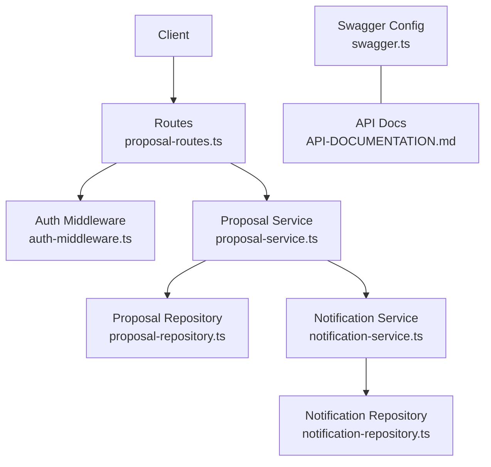
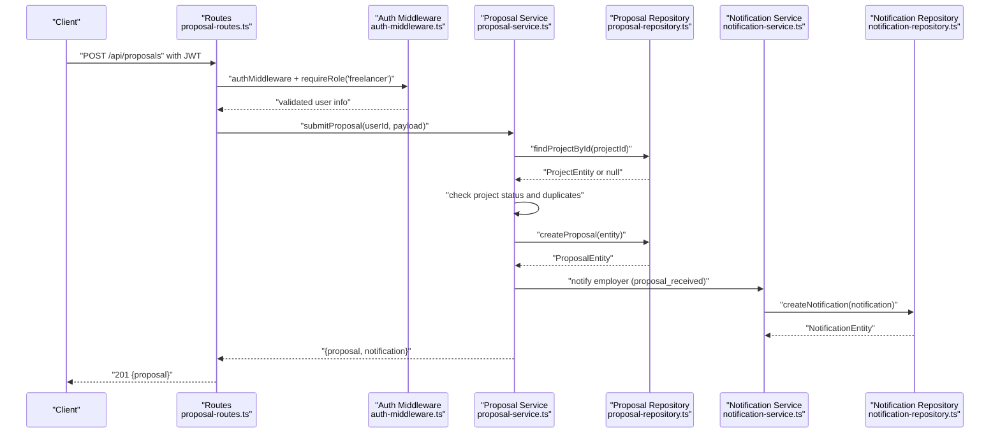
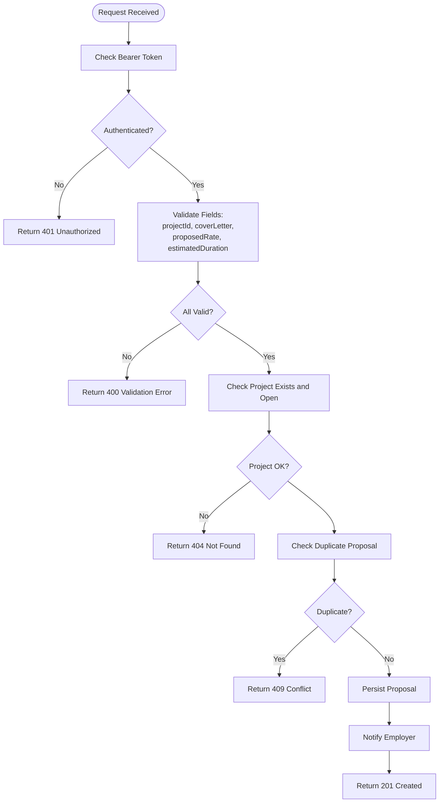
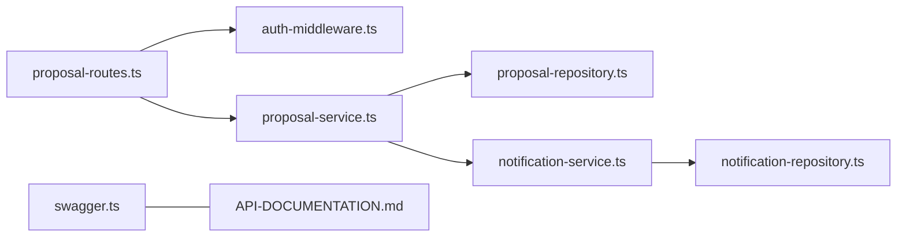

# Proposal Submission

<cite>
**Referenced Files in This Document**
- [proposal-routes.ts](file://src/routes/proposal-routes.ts)
- [proposal-service.ts](file://src/services/proposal-service.ts)
- [proposal-repository.ts](file://src/repositories/proposal-repository.ts)
- [auth-middleware.ts](file://src/middleware/auth-middleware.ts)
- [swagger.ts](file://src/config/swagger.ts)
- [API-DOCUMENTATION.md](file://docs/API-DOCUMENTATION.md)
- [entity-mapper.ts](file://src/utils/entity-mapper.ts)
- [notification-service.ts](file://src/services/notification-service.ts)
- [notification-repository.ts](file://src/repositories/notification-repository.ts)
</cite>

## Table of Contents
1. [Introduction](#introduction)
2. [Project Structure](#project-structure)
3. [Core Components](#core-components)
4. [Architecture Overview](#architecture-overview)
5. [Detailed Component Analysis](#detailed-component-analysis)
6. [Dependency Analysis](#dependency-analysis)
7. [Performance Considerations](#performance-considerations)
8. [Troubleshooting Guide](#troubleshooting-guide)
9. [Conclusion](#conclusion)
10. [Appendices](#appendices)

## Introduction
This document provides comprehensive API documentation for the proposal submission endpoint in the FreelanceXchain system. It covers the POST /api/proposals endpoint, including HTTP method, URL pattern, request body schema, authentication via JWT, role-based access control, validation rules, response schema, and status codes. It also explains how the service layer interacts with the database through the proposal repository and triggers relevant notifications.

## Project Structure
The proposal submission feature spans routing, middleware, service, repository, and documentation layers:
- Routes define the endpoint and apply middleware.
- Middleware enforces JWT authentication and role checks.
- Service orchestrates business logic, validation, repository interactions, and notifications.
- Repository abstracts database operations.
- Swagger and API docs define schemas and responses.

**Diagram sources**
- [proposal-routes.ts](file://src/routes/proposal-routes.ts#L97-L153)
- [auth-middleware.ts](file://src/middleware/auth-middleware.ts#L25-L100)
- [proposal-service.ts](file://src/services/proposal-service.ts#L63-L126)
- [proposal-repository.ts](file://src/repositories/proposal-repository.ts#L18-L110)
- [notification-service.ts](file://src/services/notification-service.ts#L1-L63)
- [notification-repository.ts](file://src/repositories/notification-repository.ts#L1-L46)
- [swagger.ts](file://src/config/swagger.ts#L1-L233)
- [API-DOCUMENTATION.md](file://docs/API-DOCUMENTATION.md#L292-L331)

**Section sources**
- [proposal-routes.ts](file://src/routes/proposal-routes.ts#L97-L153)
- [auth-middleware.ts](file://src/middleware/auth-middleware.ts#L25-L100)
- [proposal-service.ts](file://src/services/proposal-service.ts#L63-L126)
- [proposal-repository.ts](file://src/repositories/proposal-repository.ts#L18-L110)
- [swagger.ts](file://src/config/swagger.ts#L1-L233)
- [API-DOCUMENTATION.md](file://docs/API-DOCUMENTATION.md#L292-L331)

## Core Components
- Endpoint: POST /api/proposals
- Authentication: Bearer JWT token required
- Role-based Access Control: Only users with role "freelancer" can submit proposals
- Request Body Schema:
  - projectId: string (UUID)
  - coverLetter: string (minimum length 10)
  - proposedRate: number (minimum 1)
  - estimatedDuration: number (minimum 1 day)
- Response Schema: Proposal model
- Status Codes:
  - 201 Created on success
  - 400 Bad Request for validation errors
  - 401 Unauthorized for missing/invalid token
  - 404 Not Found when project is not found
  - 409 Conflict for duplicate proposals

**Section sources**
- [proposal-routes.ts](file://src/routes/proposal-routes.ts#L47-L96)
- [proposal-routes.ts](file://src/routes/proposal-routes.ts#L97-L153)
- [auth-middleware.ts](file://src/middleware/auth-middleware.ts#L72-L100)
- [proposal-service.ts](file://src/services/proposal-service.ts#L63-L126)
- [API-DOCUMENTATION.md](file://docs/API-DOCUMENTATION.md#L292-L331)

## Architecture Overview
The proposal submission flow integrates route validation, middleware enforcement, service orchestration, repository persistence, and notification dispatch.

**Diagram sources**
- [proposal-routes.ts](file://src/routes/proposal-routes.ts#L97-L153)
- [auth-middleware.ts](file://src/middleware/auth-middleware.ts#L25-L100)
- [proposal-service.ts](file://src/services/proposal-service.ts#L63-L126)
- [proposal-repository.ts](file://src/repositories/proposal-repository.ts#L23-L33)
- [notification-service.ts](file://src/services/notification-service.ts#L1-L63)
- [notification-repository.ts](file://src/repositories/notification-repository.ts#L28-L46)

## Detailed Component Analysis

### Endpoint Definition and Validation
- HTTP Method: POST
- URL Pattern: /api/proposals
- Authentication: Bearer token mandatory; enforced by authMiddleware
- Role Requirement: requireRole('freelancer')
- Request Body Validation:
  - projectId: required string and valid UUID
  - coverLetter: required string with minimum length 10
  - proposedRate: required number ≥ 1
  - estimatedDuration: required number ≥ 1 day
- Response: 201 with Proposal model on success; otherwise error responses with standardized shape

**Section sources**
- [proposal-routes.ts](file://src/routes/proposal-routes.ts#L47-L96)
- [proposal-routes.ts](file://src/routes/proposal-routes.ts#L97-L153)
- [auth-middleware.ts](file://src/middleware/auth-middleware.ts#L25-L100)

### Service Layer: submitProposal
Responsibilities:
- Validate project existence and open status
- Prevent duplicate proposals per freelancer per project
- Persist proposal with status "pending"
- Emit notification for employer ("proposal_received")

Key behaviors:
- Project existence checked via projectRepository
- Duplicate check via proposalRepository.getExistingProposal
- Proposal creation via proposalRepository.createProposal
- Notification creation via notification-service helper

**Section sources**
- [proposal-service.ts](file://src/services/proposal-service.ts#L63-L126)
- [proposal-repository.ts](file://src/repositories/proposal-repository.ts#L95-L109)
- [notification-service.ts](file://src/services/notification-service.ts#L164-L178)

### Repository Layer: ProposalRepository
- Provides createProposal, findProposalById, updateProposal
- Supports duplicate detection and project-scoped queries
- Uses Supabase client with explicit error handling

**Section sources**
- [proposal-repository.ts](file://src/repositories/proposal-repository.ts#L18-L110)

### Response Schema: Proposal Model
The Proposal model includes:
- id, projectId, freelancerId
- coverLetter, proposedRate, estimatedDuration
- status (pending, accepted, rejected, withdrawn)
- createdAt, updatedAt

Swagger and API docs define the schema and enums.

**Section sources**
- [swagger.ts](file://src/config/swagger.ts#L139-L151)
- [entity-mapper.ts](file://src/utils/entity-mapper.ts#L252-L279)
- [API-DOCUMENTATION.md](file://docs/API-DOCUMENTATION.md#L292-L331)

### Real-World Example
Submitting a proposal for a web development project:
- projectId: UUID of the target project
- coverLetter: "I am a skilled frontend developer with 5+ years of experience building responsive web applications..."
- proposedRate: 50 (representing USD per hour)
- estimatedDuration: 14 (days)

Expected outcome:
- 201 Created with the created Proposal object
- Employer receives a "proposal_received" notification

**Section sources**
- [proposal-routes.ts](file://src/routes/proposal-routes.ts#L97-L153)
- [proposal-service.ts](file://src/services/proposal-service.ts#L108-L126)
- [notification-service.ts](file://src/services/notification-service.ts#L164-L178)

### Status Codes
- 201 Created: Successful proposal submission
- 400 Bad Request: Validation errors (missing/invalid fields)
- 401 Unauthorized: Missing or invalid Bearer token
- 404 Not Found: Project not found
- 409 Conflict: Duplicate proposal for the same project by the same freelancer

**Section sources**
- [proposal-routes.ts](file://src/routes/proposal-routes.ts#L128-L153)
- [proposal-service.ts](file://src/services/proposal-service.ts#L69-L93)

### Validation Flow

**Diagram sources**
- [proposal-routes.ts](file://src/routes/proposal-routes.ts#L111-L153)
- [proposal-service.ts](file://src/services/proposal-service.ts#L69-L126)

## Dependency Analysis
- Routes depend on auth middleware and proposal service
- Service depends on proposal repository, project repository, user repository, and notification service
- Repositories depend on Supabase client and shared base repository
- Swagger defines schemas consumed by routes and docs

**Diagram sources**
- [proposal-routes.ts](file://src/routes/proposal-routes.ts#L97-L153)
- [auth-middleware.ts](file://src/middleware/auth-middleware.ts#L25-L100)
- [proposal-service.ts](file://src/services/proposal-service.ts#L63-L126)
- [proposal-repository.ts](file://src/repositories/proposal-repository.ts#L18-L110)
- [notification-service.ts](file://src/services/notification-service.ts#L1-L63)
- [notification-repository.ts](file://src/repositories/notification-repository.ts#L1-L46)
- [swagger.ts](file://src/config/swagger.ts#L1-L233)
- [API-DOCUMENTATION.md](file://docs/API-DOCUMENTATION.md#L292-L331)

**Section sources**
- [proposal-routes.ts](file://src/routes/proposal-routes.ts#L97-L153)
- [proposal-service.ts](file://src/services/proposal-service.ts#L63-L126)
- [proposal-repository.ts](file://src/repositories/proposal-repository.ts#L18-L110)
- [swagger.ts](file://src/config/swagger.ts#L1-L233)
- [API-DOCUMENTATION.md](file://docs/API-DOCUMENTATION.md#L292-L331)

## Performance Considerations
- Input validation occurs before database calls to minimize unnecessary operations.
- Repository methods encapsulate Supabase queries; ensure indexes exist on project_id and freelancer_id for efficient duplicate checks.
- Notification creation is lightweight; ensure database indexing on user_id for notification retrieval.
- Consider caching project metadata if frequently accessed during proposal submissions.

[No sources needed since this section provides general guidance]

## Troubleshooting Guide
Common issues and resolutions:
- 401 Unauthorized: Ensure Authorization header includes a valid Bearer token. Verify token expiration and format.
- 403 Forbidden: Confirm the user role is "freelancer".
- 400 Validation Error: Check that projectId is a valid UUID, coverLetter is at least 10 characters, proposedRate and estimatedDuration are ≥ 1.
- 404 Not Found: The project ID may not exist or is closed for proposals.
- 409 Conflict: The freelancer has already submitted a proposal for this project.

**Section sources**
- [auth-middleware.ts](file://src/middleware/auth-middleware.ts#L25-L100)
- [proposal-routes.ts](file://src/routes/proposal-routes.ts#L111-L153)
- [proposal-service.ts](file://src/services/proposal-service.ts#L69-L93)

## Conclusion
The proposal submission endpoint enforces strict authentication and role-based access control, validates request payloads, prevents duplicate submissions, persists proposals, and notifies employers. The service layer cleanly separates concerns between validation, persistence, and notifications, while the repository layer abstracts database operations.

[No sources needed since this section summarizes without analyzing specific files]

## Appendices

### API Reference: POST /api/proposals
- Authentication: Bearer JWT
- Roles: freelancer
- Request Body:
  - projectId: string (UUID)
  - coverLetter: string (≥10 chars)
  - proposedRate: number (≥1)
  - estimatedDuration: number (≥1)
- Responses:
  - 201: Proposal object
  - 400: Validation error
  - 401: Unauthorized
  - 404: Project not found
  - 409: Duplicate proposal

**Section sources**
- [proposal-routes.ts](file://src/routes/proposal-routes.ts#L47-L96)
- [proposal-routes.ts](file://src/routes/proposal-routes.ts#L97-L153)
- [API-DOCUMENTATION.md](file://docs/API-DOCUMENTATION.md#L292-L331)