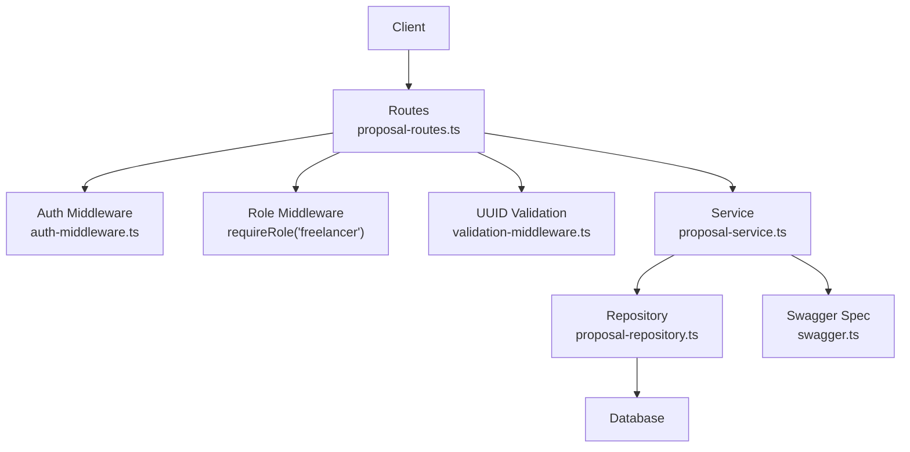
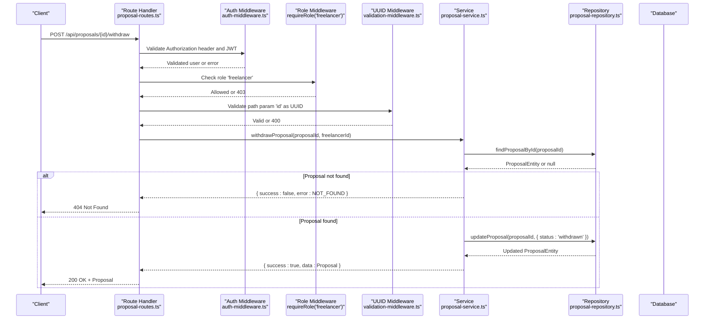
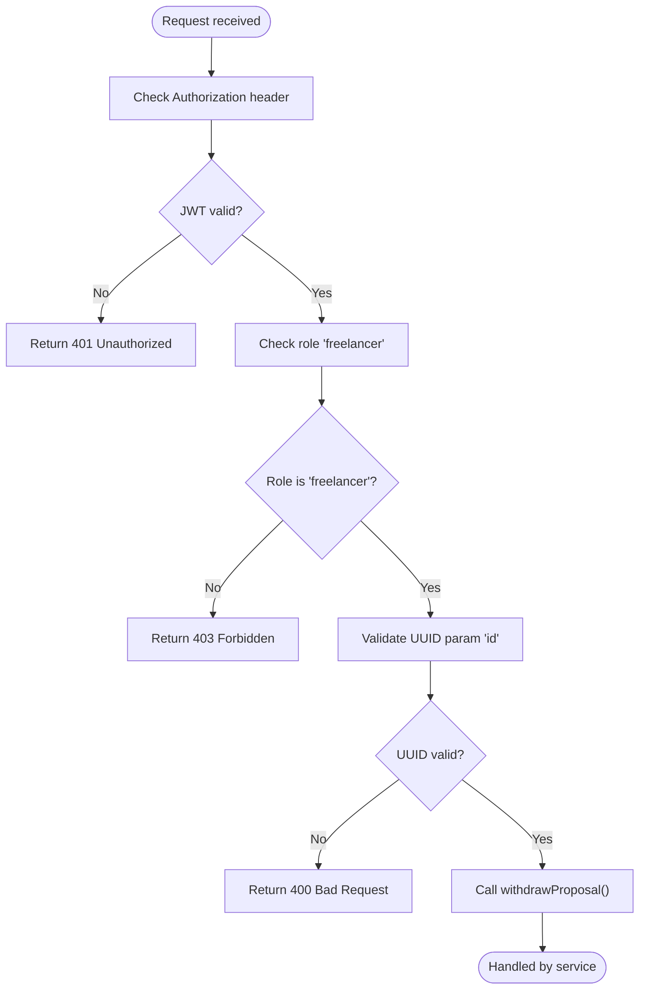
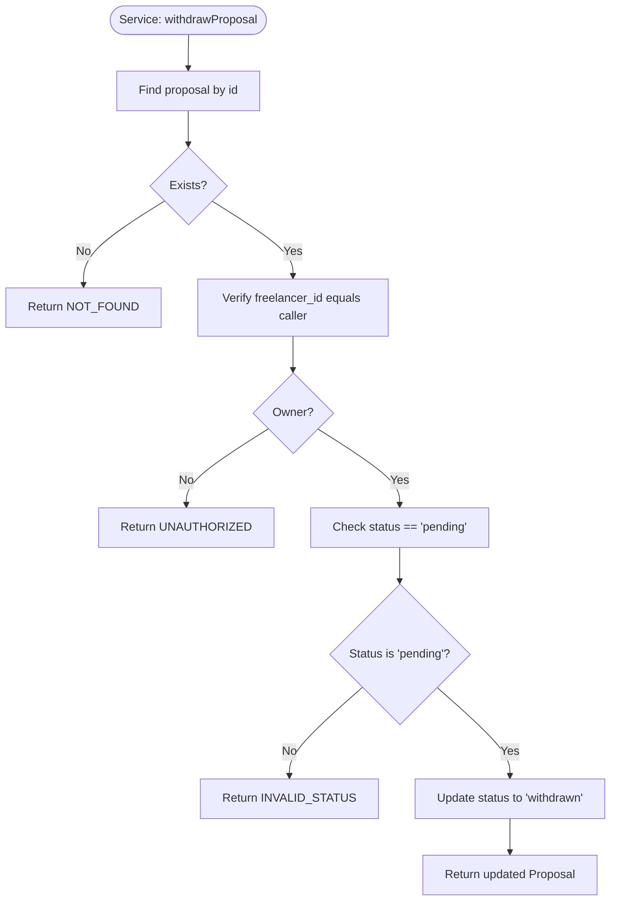
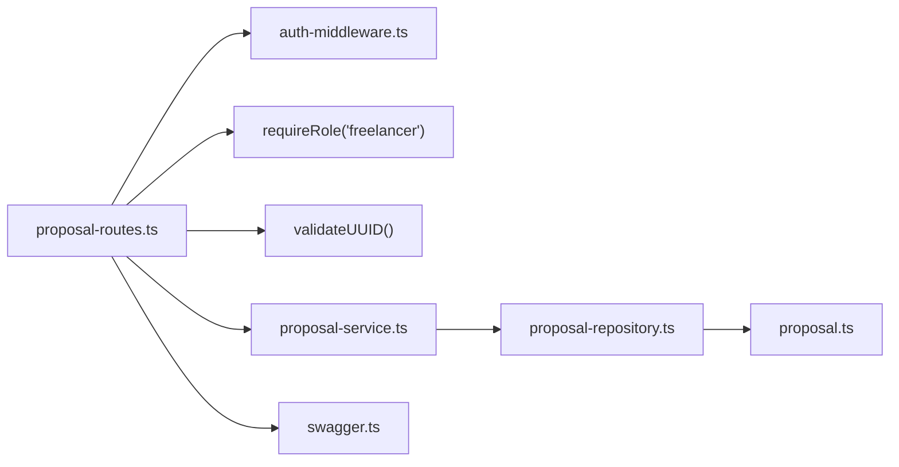

# Proposal Withdrawal

<cite>
**Referenced Files in This Document**
- [proposal-routes.ts](file://src/routes/proposal-routes.ts)
- [proposal-service.ts](file://src/services/proposal-service.ts)
- [proposal-repository.ts](file://src/repositories/proposal-repository.ts)
- [auth-middleware.ts](file://src/middleware/auth-middleware.ts)
- [validation-middleware.ts](file://src/middleware/validation-middleware.ts)
- [swagger.ts](file://src/config/swagger.ts)
- [proposal.ts](file://src/models/proposal.ts)
</cite>

## Table of Contents
1. [Introduction](#introduction)
2. [Project Structure](#project-structure)
3. [Core Components](#core-components)
4. [Architecture Overview](#architecture-overview)
5. [Detailed Component Analysis](#detailed-component-analysis)
6. [Dependency Analysis](#dependency-analysis)
7. [Performance Considerations](#performance-considerations)
8. [Troubleshooting Guide](#troubleshooting-guide)
9. [Conclusion](#conclusion)

## Introduction
This document describes the POST /api/proposals/{id}/withdraw endpoint that enables freelancers to withdraw their pending proposals. It covers the HTTP method, URL pattern, authentication and authorization requirements, state transition rules, response schema, and error handling behavior. It also includes a practical use case and validation logic that prevents withdrawal of proposals that are already accepted, rejected, or withdrawn, and ensures ownership by the requesting freelancer.

## Project Structure
The proposal withdrawal feature spans routing, middleware, service, and repository layers:
- Route handler enforces JWT authentication, role checks, and UUID parameter validation.
- Service layer performs business validation and updates the proposal status.
- Repository layer persists the change to the database.
- Swagger defines the endpoint’s OpenAPI specification and response schema.

**Diagram sources**
- [proposal-routes.ts](file://src/routes/proposal-routes.ts#L393-L455)
- [auth-middleware.ts](file://src/middleware/auth-middleware.ts#L25-L100)
- [validation-middleware.ts](file://src/middleware/validation-middleware.ts#L758-L800)
- [proposal-service.ts](file://src/services/proposal-service.ts#L372-L413)
- [proposal-repository.ts](file://src/repositories/proposal-repository.ts#L1-L113)
- [swagger.ts](file://src/config/swagger.ts#L139-L152)

**Section sources**
- [proposal-routes.ts](file://src/routes/proposal-routes.ts#L393-L455)
- [swagger.ts](file://src/config/swagger.ts#L139-L152)

## Core Components
- Endpoint: POST /api/proposals/{id}/withdraw
- Authentication: JWT via Authorization: Bearer <token>
- Authorization: Requires role 'freelancer'
- Path parameter: id must be a valid UUID
- Business rule: Only proposals with status 'pending' can be withdrawn; successful withdrawal sets status to 'withdrawn'
- Ownership: Only the freelancer who submitted the proposal can withdraw it
- Response: Updated Proposal object

HTTP status codes:
- 200 OK: Proposal successfully withdrawn
- 400 Bad Request: Invalid UUID format or invalid state transition
- 401 Unauthorized: Missing/invalid/expired JWT or missing/invalid Authorization header
- 403 Forbidden: Insufficient permissions (non-freelancer)
- 404 Not Found: Proposal not found

**Section sources**
- [proposal-routes.ts](file://src/routes/proposal-routes.ts#L393-L455)
- [proposal-service.ts](file://src/services/proposal-service.ts#L372-L413)
- [proposal-repository.ts](file://src/repositories/proposal-repository.ts#L1-L113)
- [auth-middleware.ts](file://src/middleware/auth-middleware.ts#L25-L100)
- [validation-middleware.ts](file://src/middleware/validation-middleware.ts#L758-L800)
- [swagger.ts](file://src/config/swagger.ts#L139-L152)

## Architecture Overview
The endpoint follows a layered architecture:
- Route layer validates JWT, role, and UUID format.
- Service layer enforces business rules (ownership and status).
- Repository layer updates the proposal record.
- Swagger documents the response schema.

**Diagram sources**
- [proposal-routes.ts](file://src/routes/proposal-routes.ts#L425-L455)
- [auth-middleware.ts](file://src/middleware/auth-middleware.ts#L25-L100)
- [validation-middleware.ts](file://src/middleware/validation-middleware.ts#L758-L800)
- [proposal-service.ts](file://src/services/proposal-service.ts#L372-L413)
- [proposal-repository.ts](file://src/repositories/proposal-repository.ts#L1-L113)

## Detailed Component Analysis

### Endpoint Definition and Behavior
- Method: POST
- URL: /api/proposals/{id}/withdraw
- Path parameter: id (UUID)
- Authentication: Bearer JWT
- Authorization: Role must be 'freelancer'
- Validation: UUID format enforced by middleware
- Business logic:
  - Only proposals with status 'pending' can be withdrawn
  - Only the freelancer who owns the proposal can withdraw it
  - On success, status transitions to 'withdrawn'

Response schema:
- Returns the updated Proposal object with fields: id, projectId, freelancerId, coverLetter, proposedRate, estimatedDuration, status, createdAt, updatedAt.

Status codes:
- 200: Successful withdrawal
- 400: Invalid UUID format or invalid state transition
- 401: Unauthorized (missing/invalid/expired token)
- 403: Permission denied (not a freelancer)
- 404: Proposal not found

**Section sources**
- [proposal-routes.ts](file://src/routes/proposal-routes.ts#L393-L455)
- [swagger.ts](file://src/config/swagger.ts#L139-L152)
- [proposal-service.ts](file://src/services/proposal-service.ts#L372-L413)
- [proposal-repository.ts](file://src/repositories/proposal-repository.ts#L1-L113)

### Validation and Authorization Flow

**Diagram sources**
- [proposal-routes.ts](file://src/routes/proposal-routes.ts#L425-L455)
- [auth-middleware.ts](file://src/middleware/auth-middleware.ts#L25-L100)
- [validation-middleware.ts](file://src/middleware/validation-middleware.ts#L758-L800)

### Service Layer Logic
The service enforces:
- Proposal existence
- Ownership verification (freelancer_id equals caller)
- Status validation (must be 'pending')
- Update to 'withdrawn'

**Diagram sources**
- [proposal-service.ts](file://src/services/proposal-service.ts#L372-L413)
- [proposal-repository.ts](file://src/repositories/proposal-repository.ts#L1-L113)

### Use Case: Withdraw After Accepting Another Project
Scenario:
- A freelancer submits Proposal A and later accepts a competing Proposal B for the same project.
- The freelancer decides to withdraw Proposal A while keeping Proposal B active.
- Steps:
  1. Ensure Proposal A exists and is still 'pending'.
  2. Authenticate with JWT and confirm role 'freelancer'.
  3. Call POST /api/proposals/{proposalAId}/withdraw.
  4. Server validates UUID, ownership, and status.
  5. Server updates Proposal A status to 'withdrawn'.
  6. Client receives 200 OK with the updated Proposal A.

Constraints:
- Proposal A must be 'pending' and owned by the freelancer.
- Proposal B’s acceptance does not affect the withdrawal of Proposal A; the withdrawal is independent.

**Section sources**
- [proposal-service.ts](file://src/services/proposal-service.ts#L372-L413)
- [proposal-routes.ts](file://src/routes/proposal-routes.ts#L425-L455)

## Dependency Analysis

**Diagram sources**
- [proposal-routes.ts](file://src/routes/proposal-routes.ts#L393-L455)
- [auth-middleware.ts](file://src/middleware/auth-middleware.ts#L25-L100)
- [validation-middleware.ts](file://src/middleware/validation-middleware.ts#L758-L800)
- [proposal-service.ts](file://src/services/proposal-service.ts#L372-L413)
- [proposal-repository.ts](file://src/repositories/proposal-repository.ts#L1-L113)
- [proposal.ts](file://src/models/proposal.ts#L1-L3)
- [swagger.ts](file://src/config/swagger.ts#L139-L152)

**Section sources**
- [proposal-routes.ts](file://src/routes/proposal-routes.ts#L393-L455)
- [proposal-service.ts](file://src/services/proposal-service.ts#L372-L413)
- [proposal-repository.ts](file://src/repositories/proposal-repository.ts#L1-L113)
- [auth-middleware.ts](file://src/middleware/auth-middleware.ts#L25-L100)
- [validation-middleware.ts](file://src/middleware/validation-middleware.ts#L758-L800)
- [swagger.ts](file://src/config/swagger.ts#L139-L152)

## Performance Considerations
- The endpoint performs two database reads: one to fetch the proposal and one to update it. Both are simple indexed lookups by id.
- No heavy computations are involved; performance is primarily bound by database latency.
- Consider adding database-level constraints to prevent concurrent conflicting updates if needed.

[No sources needed since this section provides general guidance]

## Troubleshooting Guide
Common issues and resolutions:
- 400 Bad Request
  - Cause: Invalid UUID format in path parameter.
  - Resolution: Ensure id is a valid UUID.
- 401 Unauthorized
  - Cause: Missing Authorization header, invalid token format, or expired token.
  - Resolution: Provide a valid Bearer token in the Authorization header.
- 403 Forbidden
  - Cause: Caller is not authenticated as a freelancer.
  - Resolution: Authenticate with a freelancer account.
- 404 Not Found
  - Cause: Proposal does not exist.
  - Resolution: Verify the proposal id.
- 400 Invalid state transition
  - Cause: Proposal status is not 'pending'.
  - Resolution: Only 'pending' proposals can be withdrawn.

Validation logic highlights:
- UUID enforcement occurs at route level.
- Ownership and status checks occur in the service layer.
- Role enforcement occurs at route level.

**Section sources**
- [proposal-routes.ts](file://src/routes/proposal-routes.ts#L425-L455)
- [auth-middleware.ts](file://src/middleware/auth-middleware.ts#L25-L100)
- [validation-middleware.ts](file://src/middleware/validation-middleware.ts#L758-L800)
- [proposal-service.ts](file://src/services/proposal-service.ts#L372-L413)

## Conclusion
The POST /api/proposals/{id}/withdraw endpoint provides a controlled mechanism for freelancers to withdraw pending proposals. It enforces JWT authentication, role-based authorization, UUID parameter validation, and strict business rules around ownership and status. The response returns the updated Proposal object, and the endpoint adheres to standard HTTP status codes for clear client-side handling.