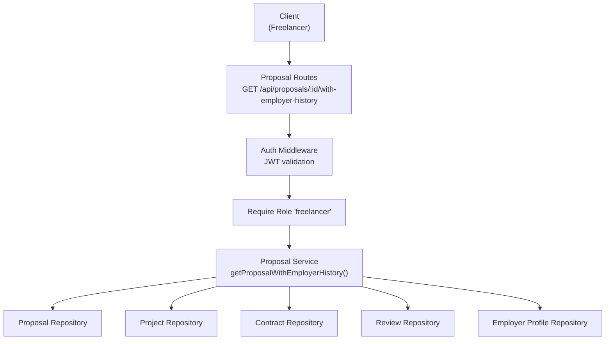
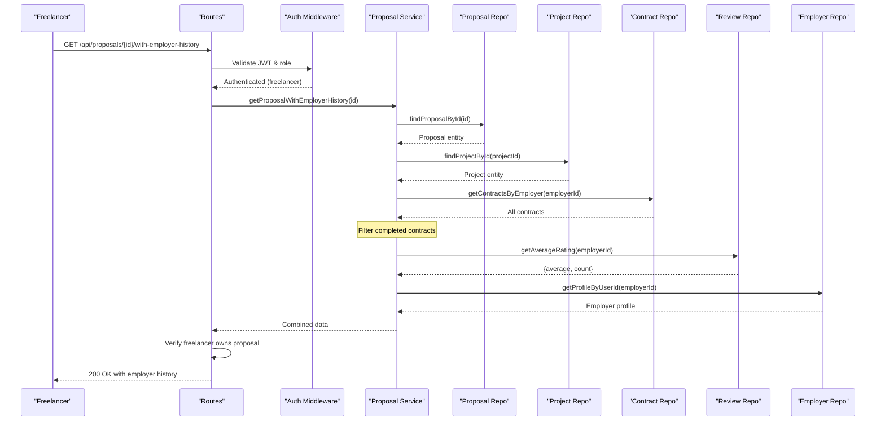

# Proposal with Employer History API

<cite>
**Referenced Files in This Document**
- [proposal-routes.ts](file://src/routes/proposal-routes.ts)
- [proposal-service.ts](file://src/services/proposal-service.ts)
- [contract-repository.ts](file://src/repositories/contract-repository.ts)
- [review-repository.ts](file://src/repositories/review-repository.ts)
- [employer-profile-repository.ts](file://src/repositories/employer-profile-repository.ts)
- [auth-middleware.ts](file://src/middleware/auth-middleware.ts)
</cite>

## Table of Contents
1. [Introduction](#introduction)
2. [Endpoint Specification](#endpoint-specification)
3. [Architecture Overview](#architecture-overview)
4. [Request Flow](#request-flow)
5. [Response Schema](#response-schema)
6. [Authorization Rules](#authorization-rules)
7. [Use Cases](#use-cases)
8. [Error Handling](#error-handling)
9. [Performance Considerations](#performance-considerations)
10. [Client Implementation Examples](#client-implementation-examples)

## Introduction

This endpoint allows freelancers to view proposal details along with the employer's track record, including completed projects count, average rating, and company information. This transparency helps freelancers make informed decisions about which proposals to pursue.

**Key Features:**
- View employer's completed project count
- See employer's average rating from previous freelancers
- Access employer's company information
- Freelancer-only access for privacy protection

## Endpoint Specification

### HTTP Method and URL
```
GET /api/proposals/{id}/with-employer-history
```

### Authentication
- **Required:** Yes
- **Type:** JWT Bearer Token
- **Role:** Freelancer only

### Path Parameters
| Parameter | Type | Required | Description |
|-----------|------|----------|-------------|
| id | UUID | Yes | Proposal ID |

### Headers
```http
Authorization: Bearer {jwt_token}
Content-Type: application/json
```

## Architecture Overview



## Request Flow



## Response Schema

### Success Response (200 OK)

```json
{
  "proposal": {
    "id": "550e8400-e29b-41d4-a716-446655440000",
    "projectId": "660e8400-e29b-41d4-a716-446655440000",
    "freelancerId": "770e8400-e29b-41d4-a716-446655440000",
    "coverLetter": null,
    "attachments": [
      {
        "url": "https://storage.supabase.co/...",
        "filename": "portfolio.pdf",
        "size": 1024000,
        "mimeType": "application/pdf"
      }
    ],
    "proposedRate": 5000,
    "estimatedDuration": 30,
    "tags": ["web-development", "react", "nodejs"],
    "status": "pending",
    "createdAt": "2026-03-12T10:00:00Z",
    "updatedAt": "2026-03-12T10:00:00Z"
  },
  "project": {
    "id": "660e8400-e29b-41d4-a716-446655440000",
    "title": "E-commerce Website Development",
    "description": "Build a modern e-commerce platform with React and Node.js",
    "employerId": "880e8400-e29b-41d4-a716-446655440000",
    "budget": 5000,
    "deadline": "2026-04-30",
    "status": "open",
    "milestones": [
      {
        "title": "Frontend Development",
        "amount": 2500,
        "dueDate": "2026-04-15"
      },
      {
        "title": "Backend Integration",
        "amount": 2500,
        "dueDate": "2026-04-30"
      }
    ]
  },
  "employerHistory": {
    "completedProjectsCount": 15,
    "averageRating": 4.7,
    "reviewCount": 12,
    "companyName": "Tech Solutions Inc.",
    "industry": "Technology"
  }
}
```

### Field Descriptions

#### employerHistory Object

| Field | Type | Description |
|-------|------|-------------|
| completedProjectsCount | number | Total number of completed contracts by this employer |
| averageRating | number | Average rating from all reviews (0-5, rounded to 1 decimal) |
| reviewCount | number | Total number of reviews received |
| companyName | string | Employer's company name |
| industry | string | Employer's industry/sector |

## Authorization Rules

### Access Control
1. **Freelancer Role Required:** Only users with 'freelancer' role can access this endpoint
2. **Proposal Ownership:** Freelancer must be the one who submitted the proposal
3. **No Employer Access:** Employers cannot view their own history through this endpoint
4. **No Admin Override:** Even admins cannot access this freelancer-specific feature

### Authorization Flow
```typescript
// 1. JWT validation (authMiddleware)
// 2. Role check (requireRole('freelancer'))
// 3. Ownership verification
if (result.data.proposal.freelancerId !== userId) {
  return 403 Forbidden
}
```

## Use Cases

### 1. Assessing Employer Reliability
**Scenario:** Freelancer receives multiple proposals and wants to prioritize reliable employers

**Decision Factors:**
- `completedProjectsCount > 10` → Experienced employer
- `completedProjectsCount === 0` → New employer (higher risk)
- `averageRating >= 4.5` → Highly rated employer

**Example:**
```javascript
if (employerHistory.completedProjectsCount >= 10 && 
    employerHistory.averageRating >= 4.5) {
  // High priority - reliable employer
  priorityLevel = 'HIGH';
} else if (employerHistory.completedProjectsCount === 0) {
  // New employer - proceed with caution
  priorityLevel = 'LOW';
}
```

### 2. Risk Assessment
**Scenario:** Freelancer evaluates payment risk before accepting proposal

**Risk Indicators:**
- Low rating (`< 3.0`) → Payment issues or difficult client
- No completed projects → Unproven track record
- High rating (`>= 4.5`) + many projects → Safe bet

### 3. Company Verification
**Scenario:** Freelancer verifies legitimacy of employer

**Verification Steps:**
1. Check company name matches project description
2. Verify industry alignment with project type
3. Cross-reference with external sources if needed

## Error Handling

### Error Responses

#### 400 Bad Request
```json
{
  "error": {
    "code": "VALIDATION_ERROR",
    "message": "Invalid UUID format"
  },
  "timestamp": "2026-03-12T10:00:00Z",
  "requestId": "req-123"
}
```

#### 401 Unauthorized
```json
{
  "error": {
    "code": "AUTH_UNAUTHORIZED",
    "message": "User not authenticated"
  },
  "timestamp": "2026-03-12T10:00:00Z",
  "requestId": "req-123"
}
```

#### 403 Forbidden
```json
{
  "error": {
    "code": "UNAUTHORIZED",
    "message": "You are not authorized to view this proposal"
  },
  "timestamp": "2026-03-12T10:00:00Z",
  "requestId": "req-123"
}
```

#### 404 Not Found
```json
{
  "error": {
    "code": "NOT_FOUND",
    "message": "Proposal not found"
  },
  "timestamp": "2026-03-12T10:00:00Z",
  "requestId": "req-123"
}
```

#### 500 Internal Server Error
```json
{
  "error": "Failed to fetch proposal with employer history"
}
```

## Performance Considerations

### Database Queries
The endpoint executes multiple queries:
1. `findProposalById()` - Single row lookup (indexed)
2. `findProjectById()` - Single row lookup (indexed)
3. `getContractsByEmployer()` - Multiple rows (filtered by employer_id)
4. `getAverageRating()` - Aggregation query on reviews table
5. `getProfileByUserId()` - Single row lookup (indexed)

### Optimization Strategies

#### 1. Caching
```typescript
// Cache employer history for 1 hour
const cacheKey = `employer-history:${employerId}`;
const cached = await cache.get(cacheKey);
if (cached) return cached;

// ... fetch from database ...

await cache.set(cacheKey, employerHistory, 3600); // 1 hour TTL
```

#### 2. Parallel Queries
```typescript
// Execute independent queries in parallel
const [contracts, rating, profile] = await Promise.all([
  contractRepository.getContractsByEmployer(employerId),
  ReviewRepository.getAverageRating(employerId),
  employerProfileRepository.getProfileByUserId(employerId)
]);
```

#### 3. Database Indexing
Ensure indexes exist on:
- `contracts.employer_id`
- `reviews.reviewee_id`
- `employer_profiles.user_id`

### Expected Response Time
- **Without caching:** 200-500ms
- **With caching:** 50-100ms
- **Under load:** May increase to 1-2s

## Client Implementation Examples

### JavaScript/TypeScript (Fetch API)

```typescript
async function getProposalWithEmployerHistory(
  proposalId: string, 
  token: string
): Promise<ProposalWithEmployerHistory> {
  const response = await fetch(
    `https://api.freelancexchain.com/api/proposals/${proposalId}/with-employer-history`,
    {
      method: 'GET',
      headers: {
        'Authorization': `Bearer ${token}`,
        'Content-Type': 'application/json'
      }
    }
  );

  if (!response.ok) {
    const error = await response.json();
    throw new Error(error.error.message);
  }

  return await response.json();
}

// Usage
try {
  const data = await getProposalWithEmployerHistory(
    '550e8400-e29b-41d4-a716-446655440000',
    userToken
  );
  
  console.log(`Employer: ${data.employerHistory.companyName}`);
  console.log(`Rating: ${data.employerHistory.averageRating}/5`);
  console.log(`Completed: ${data.employerHistory.completedProjectsCount} projects`);
  
  // Risk assessment
  if (data.employerHistory.averageRating >= 4.5) {
    console.log('✓ Highly rated employer');
  }
} catch (error) {
  console.error('Failed to fetch proposal:', error);
}
```

### React Component Example

```tsx
import { useState, useEffect } from 'react';

interface EmployerHistory {
  completedProjectsCount: number;
  averageRating: number;
  reviewCount: number;
  companyName: string;
  industry: string;
}

function ProposalDetailWithHistory({ proposalId }: { proposalId: string }) {
  const [data, setData] = useState<any>(null);
  const [loading, setLoading] = useState(true);
  const [error, setError] = useState<string | null>(null);

  useEffect(() => {
    async function fetchData() {
      try {
        const token = localStorage.getItem('authToken');
        const response = await fetch(
          `/api/proposals/${proposalId}/with-employer-history`,
          {
            headers: { 'Authorization': `Bearer ${token}` }
          }
        );
        
        if (!response.ok) throw new Error('Failed to fetch');
        
        const result = await response.json();
        setData(result);
      } catch (err) {
        setError(err.message);
      } finally {
        setLoading(false);
      }
    }
    
    fetchData();
  }, [proposalId]);

  if (loading) return <div>Loading...</div>;
  if (error) return <div>Error: {error}</div>;
  if (!data) return null;

  const { proposal, project, employerHistory } = data;

  return (
    <div className="proposal-detail">
      <h2>{project.title}</h2>
      
      <div className="employer-info">
        <h3>Employer Information</h3>
        <p><strong>Company:</strong> {employerHistory.companyName}</p>
        <p><strong>Industry:</strong> {employerHistory.industry}</p>
        
        <div className="employer-stats">
          <div className="stat">
            <span className="label">Rating</span>
            <span className="value">
              {employerHistory.averageRating.toFixed(1)} / 5.0
              {employerHistory.averageRating >= 4.5 && ' ⭐'}
            </span>
            <span className="count">
              ({employerHistory.reviewCount} reviews)
            </span>
          </div>
          
          <div className="stat">
            <span className="label">Completed Projects</span>
            <span className="value">
              {employerHistory.completedProjectsCount}
            </span>
          </div>
        </div>
        
        {employerHistory.completedProjectsCount === 0 && (
          <div className="warning">
            ⚠️ This is a new employer with no completed projects yet
          </div>
        )}
        
        {employerHistory.averageRating < 3.0 && (
          <div className="warning">
            ⚠️ This employer has a low rating. Proceed with caution.
          </div>
        )}
      </div>
      
      <div className="proposal-details">
        <h3>Your Proposal</h3>
        <p><strong>Rate:</strong> ${proposal.proposedRate}</p>
        <p><strong>Duration:</strong> {proposal.estimatedDuration} days</p>
        <p><strong>Status:</strong> {proposal.status}</p>
      </div>
    </div>
  );
}
```

### Python Example

```python
import requests
from typing import Dict, Any

def get_proposal_with_employer_history(
    proposal_id: str, 
    token: str
) -> Dict[str, Any]:
    """
    Fetch proposal with employer history
    
    Args:
        proposal_id: UUID of the proposal
        token: JWT authentication token
        
    Returns:
        Dictionary containing proposal, project, and employer history
        
    Raises:
        requests.HTTPError: If request fails
    """
    url = f"https://api.freelancexchain.com/api/proposals/{proposal_id}/with-employer-history"
    headers = {
        "Authorization": f"Bearer {token}",
        "Content-Type": "application/json"
    }
    
    response = requests.get(url, headers=headers)
    response.raise_for_status()
    
    return response.json()

# Usage
try:
    data = get_proposal_with_employer_history(
        proposal_id="550e8400-e29b-41d4-a716-446655440000",
        token=user_token
    )
    
    employer = data["employerHistory"]
    
    print(f"Employer: {employer['companyName']}")
    print(f"Rating: {employer['averageRating']}/5 ({employer['reviewCount']} reviews)")
    print(f"Completed Projects: {employer['completedProjectsCount']}")
    
    # Risk assessment
    if employer["averageRating"] >= 4.5 and employer["completedProjectsCount"] >= 10:
        print("✓ Highly reliable employer")
    elif employer["completedProjectsCount"] == 0:
        print("⚠ New employer - no track record")
        
except requests.HTTPError as e:
    print(f"Error: {e.response.json()['error']['message']}")
```

## Conclusion

The Proposal with Employer History endpoint provides freelancers with critical transparency into employer reliability and track record. By exposing completed project counts, average ratings, and company information, it enables informed decision-making and reduces risk for freelancers. The endpoint follows security best practices with role-based access control and ownership verification, ensuring that only authorized freelancers can view employer history for their own proposals.

**Key Takeaways:**
- Freelancer-only access for privacy protection
- Multiple database queries optimized with parallel execution
- Caching recommended for frequently accessed employer data
- Clear risk indicators help freelancers assess opportunities
- Comprehensive error handling for robust client integration
