# Reputation API

<cite>
**Referenced Files in This Document**
- [reputation-routes.ts](file://src/routes/reputation-routes.ts)
- [reputation-service.ts](file://src/services/reputation-service.ts)
- [reputation-contract.ts](file://src/services/reputation-contract.ts)
- [FreelanceReputation.sol](file://contracts/FreelanceReputation.sol)
- [auth-middleware.ts](file://src/middleware/auth-middleware.ts)
- [validation-middleware.ts](file://src/middleware/validation-middleware.ts)
- [blockchain-client.ts](file://src/services/blockchain-client.ts)
- [notification-service.ts](file://src/services/notification-service.ts)
- [API-DOCUMENTATION.md](file://docs/API-DOCUMENTATION.md)
- [swagger.ts](file://src/config/swagger.ts)
</cite>

## Table of Contents
1. [Introduction](#introduction)
2. [Project Structure](#project-structure)
3. [Core Components](#core-components)
4. [Architecture Overview](#architecture-overview)
5. [Detailed Component Analysis](#detailed-component-analysis)
6. [Dependency Analysis](#dependency-analysis)
7. [Performance Considerations](#performance-considerations)
8. [Troubleshooting Guide](#troubleshooting-guide)
9. [Conclusion](#conclusion)
10. [Appendices](#appendices)

## Introduction
This document provides comprehensive API documentation for the reputation system endpoints in the FreelanceXchain platform. It covers:
- HTTP methods, URL patterns, request/response schemas
- Authentication requirements (JWT Bearer)
- Rating scale and constraints
- Endpoints for submitting ratings, retrieving reputation scores, and accessing work history
- Integration between API endpoints and blockchain smart contracts for immutable storage
- Client implementation examples for submitting ratings and displaying reputation

## Project Structure
The reputation system spans route handlers, service logic, blockchain integration, and smart contracts:
- Routes define the HTTP endpoints and request/response schemas
- Services encapsulate business logic, validation, and blockchain interactions
- Blockchain client simulates transaction submission and confirmation
- Smart contract defines on-chain storage and constraints

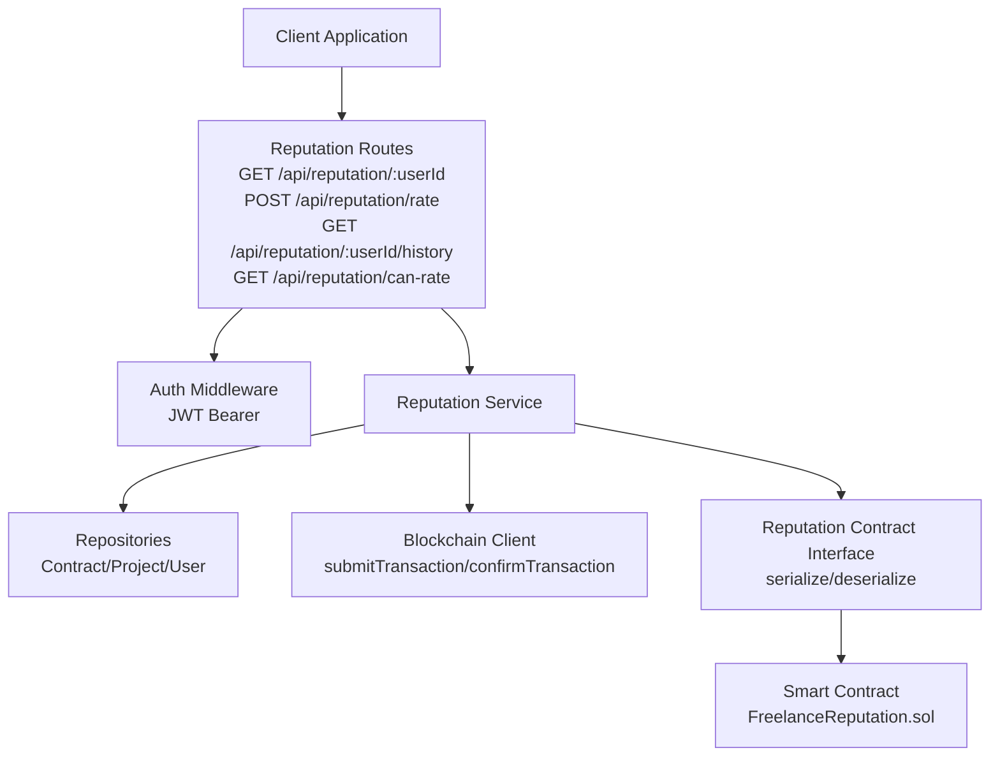

**Diagram sources**
- [reputation-routes.ts](file://src/routes/reputation-routes.ts#L1-L413)
- [auth-middleware.ts](file://src/middleware/auth-middleware.ts#L1-L70)
- [reputation-service.ts](file://src/services/reputation-service.ts#L1-L357)
- [reputation-contract.ts](file://src/services/reputation-contract.ts#L1-L288)
- [FreelanceReputation.sol](file://contracts/FreelanceReputation.sol#L1-L183)
- [blockchain-client.ts](file://src/services/blockchain-client.ts#L1-L293)

**Section sources**
- [reputation-routes.ts](file://src/routes/reputation-routes.ts#L1-L413)
- [swagger.ts](file://src/config/swagger.ts#L1-L233)

## Core Components
- Reputation Routes: Define endpoints, authentication, and response schemas
- Reputation Service: Validates inputs, enforces constraints, computes reputation, and orchestrates blockchain interactions
- Reputation Contract Interface: Serializes/deserializes ratings and interacts with blockchain client
- Smart Contract: On-chain storage of ratings with constraints and events
- Auth Middleware: Enforces JWT Bearer authentication
- Validation Middleware: Validates UUID parameters
- Blockchain Client: Simulates transaction lifecycle
- Notification Service: Notifies users upon receiving ratings

**Section sources**
- [reputation-routes.ts](file://src/routes/reputation-routes.ts#L1-L413)
- [reputation-service.ts](file://src/services/reputation-service.ts#L1-L357)
- [reputation-contract.ts](file://src/services/reputation-contract.ts#L1-L288)
- [FreelanceReputation.sol](file://contracts/FreelanceReputation.sol#L1-L183)
- [auth-middleware.ts](file://src/middleware/auth-middleware.ts#L1-L70)
- [validation-middleware.ts](file://src/middleware/validation-middleware.ts#L770-L814)
- [blockchain-client.ts](file://src/services/blockchain-client.ts#L1-L293)
- [notification-service.ts](file://src/services/notification-service.ts#L302-L316)

## Architecture Overview
The reputation API follows a layered architecture:
- HTTP Layer: Routes handle requests and responses
- Service Layer: Business logic, validation, and orchestration
- Blockchain Layer: Transaction submission and confirmation
- Smart Contract Layer: Immutable on-chain storage

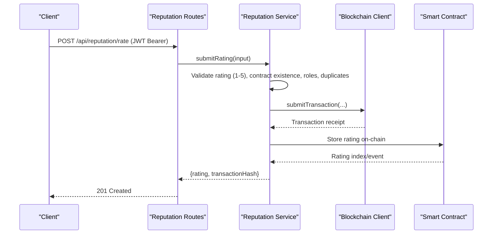

**Diagram sources**
- [reputation-routes.ts](file://src/routes/reputation-routes.ts#L151-L272)
- [reputation-service.ts](file://src/services/reputation-service.ts#L76-L180)
- [reputation-contract.ts](file://src/services/reputation-contract.ts#L91-L149)
- [blockchain-client.ts](file://src/services/blockchain-client.ts#L131-L206)
- [FreelanceReputation.sol](file://contracts/FreelanceReputation.sol#L64-L106)

## Detailed Component Analysis

### Endpoint: GET /api/reputation/:userId
- Purpose: Retrieve a user’s reputation score and ratings from the blockchain
- Authentication: None (public endpoint)
- Path Parameters:
  - userId: UUID (validated by middleware)
- Response Schema:
  - userId: string (UUID)
  - score: number (weighted average with time decay)
  - totalRatings: integer
  - averageRating: number (simple average without time decay)
  - ratings: array of BlockchainRating
- Error Responses:
  - 400: Invalid UUID format
  - 404: User not found (service returns error)

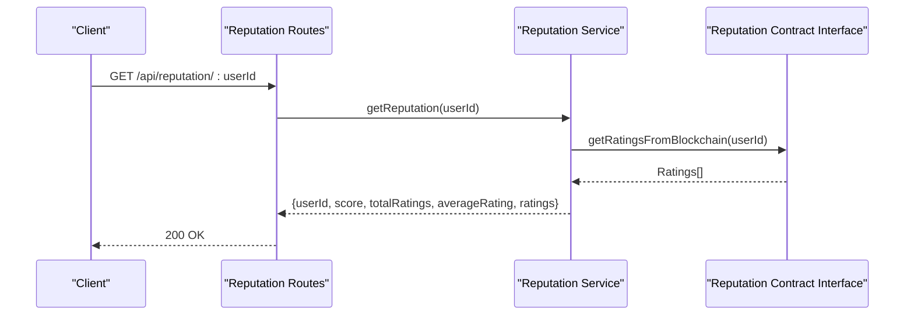

**Diagram sources**
- [reputation-routes.ts](file://src/routes/reputation-routes.ts#L96-L149)
- [reputation-service.ts](file://src/services/reputation-service.ts#L188-L213)
- [reputation-contract.ts](file://src/services/reputation-contract.ts#L155-L166)

**Section sources**
- [reputation-routes.ts](file://src/routes/reputation-routes.ts#L96-L149)
- [reputation-service.ts](file://src/services/reputation-service.ts#L188-L213)
- [reputation-contract.ts](file://src/services/reputation-contract.ts#L155-L166)

### Endpoint: POST /api/reputation/rate
- Purpose: Submit a rating for another user after contract completion
- Authentication: Required (JWT Bearer)
- Request Body Schema (RatingInput):
  - contractId: string (UUID)
  - rateeId: string (UUID)
  - rating: integer (1-5)
  - comment: string (optional)
- Response Schema:
  - rating: BlockchainRating
  - transactionHash: string
- Constraints and Validation:
  - Only contract participants can submit ratings
  - Ratee must be a contract participant
  - Cannot rate self
  - Duplicate rating per contract is prevented
  - Rating must be integer between 1 and 5
- Error Responses:
  - 400: Validation error (missing fields, invalid rating, invalid UUID)
  - 401: Unauthorized (missing/invalid JWT)
  - 403: Unauthorized (not a contract participant)
  - 404: Contract not found
  - 409: Duplicate rating

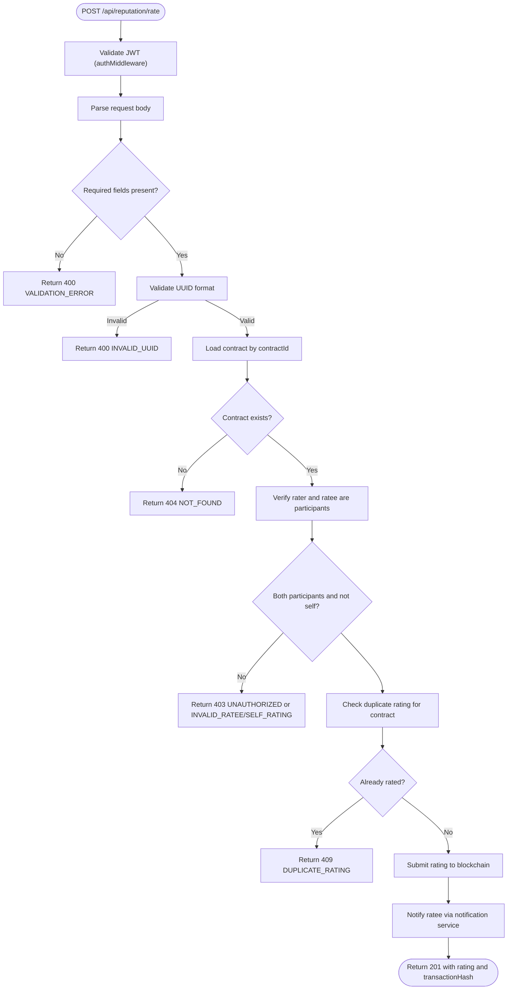

**Diagram sources**
- [reputation-routes.ts](file://src/routes/reputation-routes.ts#L151-L272)
- [auth-middleware.ts](file://src/middleware/auth-middleware.ts#L25-L70)
- [reputation-service.ts](file://src/services/reputation-service.ts#L76-L180)
- [reputation-contract.ts](file://src/services/reputation-contract.ts#L91-L149)
- [blockchain-client.ts](file://src/services/blockchain-client.ts#L131-L206)
- [notification-service.ts](file://src/services/notification-service.ts#L302-L316)

**Section sources**
- [reputation-routes.ts](file://src/routes/reputation-routes.ts#L151-L272)
- [auth-middleware.ts](file://src/middleware/auth-middleware.ts#L25-L70)
- [reputation-service.ts](file://src/services/reputation-service.ts#L76-L180)
- [reputation-contract.ts](file://src/services/reputation-contract.ts#L91-L149)
- [blockchain-client.ts](file://src/services/blockchain-client.ts#L131-L206)
- [notification-service.ts](file://src/services/notification-service.ts#L302-L316)

### Endpoint: GET /api/reputation/:userId/history
- Purpose: Retrieve work history for a user including completed contracts and ratings
- Authentication: None (public endpoint)
- Path Parameters:
  - userId: UUID (validated by middleware)
- Response Schema: Array of WorkHistoryEntry
  - contractId: string (UUID)
  - projectId: string (UUID)
  - projectTitle: string
  - role: enum ["freelancer","employer"]
  - completedAt: string (ISO 8601)
  - rating?: integer (1-5)
  - ratingComment?: string
- Error Responses:
  - 400: Invalid UUID format
  - 404: User not found (service returns error)

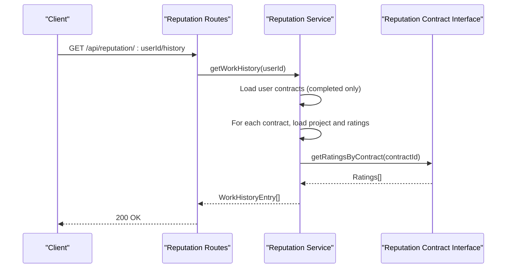

**Diagram sources**
- [reputation-routes.ts](file://src/routes/reputation-routes.ts#L275-L330)
- [reputation-service.ts](file://src/services/reputation-service.ts#L220-L269)
- [reputation-contract.ts](file://src/services/reputation-contract.ts#L193-L203)

**Section sources**
- [reputation-routes.ts](file://src/routes/reputation-routes.ts#L275-L330)
- [reputation-service.ts](file://src/services/reputation-service.ts#L220-L269)
- [reputation-contract.ts](file://src/services/reputation-contract.ts#L193-L203)

### Endpoint: GET /api/reputation/can-rate
- Purpose: Check if the authenticated user can rate another user for a specific contract
- Authentication: Required (JWT Bearer)
- Query Parameters:
  - contractId: string (UUID)
  - rateeId: string (UUID)
- Response Schema:
  - canRate: boolean
  - reason?: string (present when false)
- Error Responses:
  - 400: Validation error (missing parameters)
  - 401: Unauthorized (missing/invalid JWT)

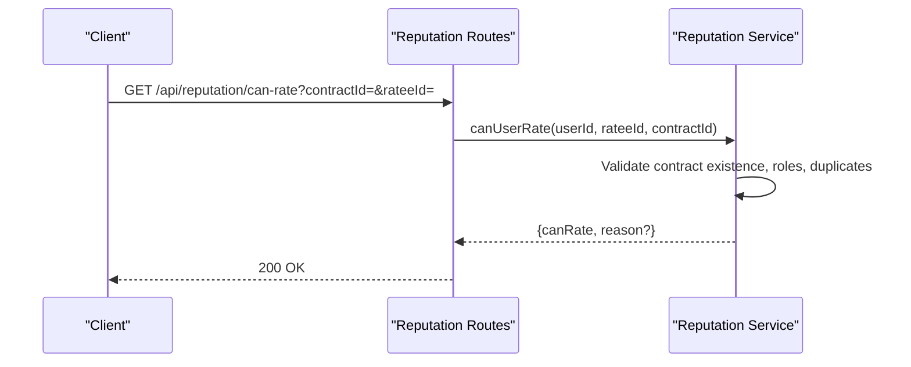

**Diagram sources**
- [reputation-routes.ts](file://src/routes/reputation-routes.ts#L332-L410)
- [reputation-service.ts](file://src/services/reputation-service.ts#L301-L357)

**Section sources**
- [reputation-routes.ts](file://src/routes/reputation-routes.ts#L332-L410)
- [reputation-service.ts](file://src/services/reputation-service.ts#L301-L357)

### Rating Scale and Constraints
- Rating Scale: Integer from 1 to 5
- Who can rate whom:
  - Only contract participants can submit ratings
  - Ratee must be a participant in the same contract
  - Users cannot rate themselves
  - Duplicate rating per contract is prevented
- Additional constraints enforced by smart contract:
  - Cannot rate zero address
  - Score must be between 1 and 5
  - Contract ID required
  - Duplicate rating per contract prevented

**Section sources**
- [reputation-service.ts](file://src/services/reputation-service.ts#L76-L180)
- [FreelanceReputation.sol](file://contracts/FreelanceReputation.sol#L64-L106)

### Authentication Requirements (JWT)
- All protected endpoints require a Bearer token in the Authorization header:
  - Authorization: Bearer <access_token>
- Protected endpoints:
  - POST /api/reputation/rate
  - GET /api/reputation/can-rate
- Auth middleware validates:
  - Presence of Authorization header
  - Format "Bearer <token>"
  - Token validity and expiration

**Section sources**
- [swagger.ts](file://src/config/swagger.ts#L22-L28)
- [API-DOCUMENTATION.md](file://docs/API-DOCUMENTATION.md#L7-L14)
- [auth-middleware.ts](file://src/middleware/auth-middleware.ts#L25-L70)

### Integration with Blockchain Smart Contracts
- Submission flow:
  - Route handler calls service
  - Service validates and calls blockchain client to submit transaction
  - Blockchain client simulates transaction submission and confirmation
  - Service stores serialized rating and returns transaction hash
- Retrieval flow:
  - Service retrieves ratings from blockchain interface
  - Aggregation uses time decay weighting
- Smart contract responsibilities:
  - Enforce rating constraints
  - Store ratings immutably
  - Emit events on rating submission
  - Provide getters for aggregates and indices

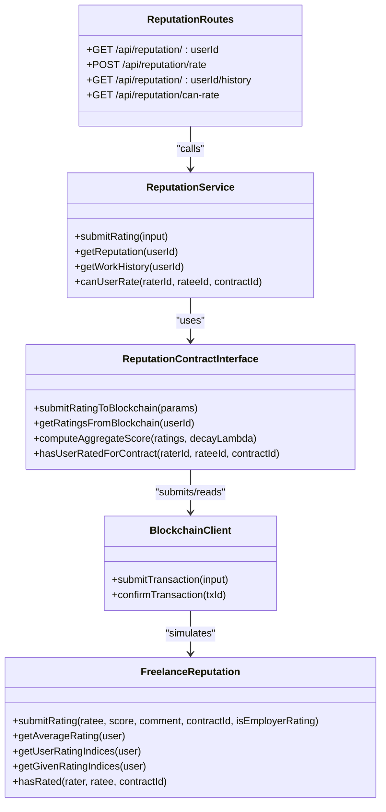

**Diagram sources**
- [reputation-routes.ts](file://src/routes/reputation-routes.ts#L1-L413)
- [reputation-service.ts](file://src/services/reputation-service.ts#L1-L357)
- [reputation-contract.ts](file://src/services/reputation-contract.ts#L1-L288)
- [blockchain-client.ts](file://src/services/blockchain-client.ts#L131-L206)
- [FreelanceReputation.sol](file://contracts/FreelanceReputation.sol#L64-L106)

**Section sources**
- [reputation-contract.ts](file://src/services/reputation-contract.ts#L91-L149)
- [blockchain-client.ts](file://src/services/blockchain-client.ts#L131-L206)
- [FreelanceReputation.sol](file://contracts/FreelanceReputation.sol#L64-L106)

### Client Implementation Examples

#### Example 1: Submit a rating with comment after contract completion
- Steps:
  - Authenticate and obtain a JWT
  - Call POST /api/reputation/rate with:
    - contractId: UUID of the completed contract
    - rateeId: UUID of the user being rated
    - rating: integer 1-5
    - comment: optional string
  - Handle response containing the stored rating and transactionHash
- Notes:
  - Ensure the authenticated user is a participant in the contract
  - Ensure the ratee is a participant in the contract
  - Ensure the rating is not a duplicate for the contract

**Section sources**
- [reputation-routes.ts](file://src/routes/reputation-routes.ts#L151-L272)
- [reputation-service.ts](file://src/services/reputation-service.ts#L76-L180)

#### Example 2: Retrieve a user's reputation score with blockchain ratings
- Steps:
  - Call GET /api/reputation/:userId
  - Use the returned score (weighted average with time decay) and ratings array
- Notes:
  - The ratings array contains blockchain-stored ratings with timestamps and comments

**Section sources**
- [reputation-routes.ts](file://src/routes/reputation-routes.ts#L96-L149)
- [reputation-service.ts](file://src/services/reputation-service.ts#L188-L213)
- [reputation-contract.ts](file://src/services/reputation-contract.ts#L155-L166)

#### Example 3: View work history with project details
- Steps:
  - Call GET /api/reputation/:userId/history
  - Iterate entries to show:
    - Project title
    - Role (freelancer or employer)
    - Completed date
    - Rating and comment (if available)
- Notes:
  - Only completed contracts are included
  - Ratings are fetched per contract

**Section sources**
- [reputation-routes.ts](file://src/routes/reputation-routes.ts#L275-L330)
- [reputation-service.ts](file://src/services/reputation-service.ts#L220-L269)

## Dependency Analysis
- Routes depend on:
  - Auth middleware for protected endpoints
  - Validation middleware for UUID parameters
  - Reputation service for business logic
- Reputation service depends on:
  - Repositories for contract/project/user data
  - Reputation contract interface for blockchain operations
  - Notification service for user notifications
- Reputation contract interface depends on:
  - Blockchain client for transaction submission/confirmation
  - In-memory store to simulate blockchain storage
- Smart contract defines:
  - Immutable storage and constraints
  - Events for rating submissions

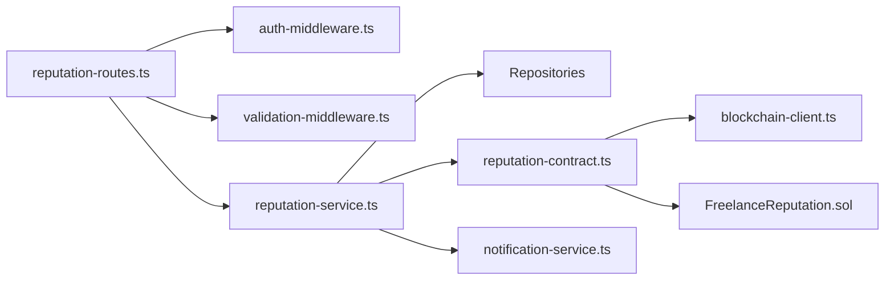

**Diagram sources**
- [reputation-routes.ts](file://src/routes/reputation-routes.ts#L1-L413)
- [auth-middleware.ts](file://src/middleware/auth-middleware.ts#L1-L70)
- [validation-middleware.ts](file://src/middleware/validation-middleware.ts#L770-L814)
- [reputation-service.ts](file://src/services/reputation-service.ts#L1-L357)
- [reputation-contract.ts](file://src/services/reputation-contract.ts#L1-L288)
- [blockchain-client.ts](file://src/services/blockchain-client.ts#L1-L293)
- [FreelanceReputation.sol](file://contracts/FreelanceReputation.sol#L1-L183)
- [notification-service.ts](file://src/services/notification-service.ts#L302-L316)

**Section sources**
- [reputation-routes.ts](file://src/routes/reputation-routes.ts#L1-L413)
- [reputation-service.ts](file://src/services/reputation-service.ts#L1-L357)
- [reputation-contract.ts](file://src/services/reputation-contract.ts#L1-L288)
- [blockchain-client.ts](file://src/services/blockchain-client.ts#L1-L293)
- [FreelanceReputation.sol](file://contracts/FreelanceReputation.sol#L1-L183)
- [auth-middleware.ts](file://src/middleware/auth-middleware.ts#L1-L70)
- [validation-middleware.ts](file://src/middleware/validation-middleware.ts#L770-L814)
- [notification-service.ts](file://src/services/notification-service.ts#L302-L316)

## Performance Considerations
- Time decay computation: Weighted average calculation scales linearly with the number of ratings per user
- Blockchain simulation: In-memory store and simulated confirmation add minimal overhead
- Recommendations:
  - Cache frequently accessed reputation scores for popular users
  - Paginate work history for users with many contracts
  - Use efficient sorting and filtering in repositories

[No sources needed since this section provides general guidance]

## Troubleshooting Guide
Common issues and resolutions:
- 400 Validation Error:
  - Missing required fields or invalid UUID format
  - Fix: Ensure contractId, rateeId, and rating are provided and valid UUIDs
- 401 Unauthorized:
  - Missing or invalid JWT
  - Fix: Include Authorization: Bearer <token> header
- 403 Unauthorized:
  - Not a contract participant or attempting self-rating
  - Fix: Verify user roles in the contract and ensure raterId != rateeId
- 404 Not Found:
  - Contract not found
  - Fix: Verify contractId exists
- 409 Conflict (Duplicate Rating):
  - Already rated for this contract
  - Fix: Do not submit duplicate ratings

**Section sources**
- [reputation-routes.ts](file://src/routes/reputation-routes.ts#L151-L272)
- [reputation-service.ts](file://src/services/reputation-service.ts#L76-L180)

## Conclusion
The reputation system provides secure, immutable rating storage integrated with blockchain technology. The API ensures proper authentication, strict validation, and clear constraints on who can rate whom. Clients can submit ratings, retrieve reputation scores with time-decayed weighting, and view work histories with project details.

[No sources needed since this section summarizes without analyzing specific files]

## Appendices

### API Definitions

- Base URL: http://localhost:7860/api
- Interactive Docs: http://localhost:7860/api-docs
- Authentication: Bearer JWT

Endpoints:
- GET /api/reputation/:userId
  - Description: Get user reputation score and ratings
  - Response: ReputationScore
- POST /api/reputation/rate
  - Description: Submit a rating for another user after contract completion
  - Request: RatingInput
  - Response: { rating: BlockchainRating, transactionHash: string }
- GET /api/reputation/:userId/history
  - Description: Get work history for a user
  - Response: Array of WorkHistoryEntry
- GET /api/reputation/can-rate
  - Description: Check if authenticated user can rate another user for a contract
  - Query: contractId, rateeId
  - Response: { canRate: boolean, reason?: string }

**Section sources**
- [API-DOCUMENTATION.md](file://docs/API-DOCUMENTATION.md#L395-L438)
- [swagger.ts](file://src/config/swagger.ts#L22-L28)
- [reputation-routes.ts](file://src/routes/reputation-routes.ts#L96-L410)

### Data Models

- RatingInput
  - contractId: string (UUID)
  - rateeId: string (UUID)
  - rating: integer (1-5)
  - comment?: string

- BlockchainRating
  - id: string (UUID)
  - contractId: string (UUID)
  - raterId: string (UUID)
  - rateeId: string (UUID)
  - rating: integer (1-5)
  - comment?: string
  - timestamp: integer
  - transactionHash: string

- ReputationScore
  - userId: string (UUID)
  - score: number (time-decayed weighted average)
  - totalRatings: integer
  - averageRating: number (simple average)
  - ratings: array of BlockchainRating

- WorkHistoryEntry
  - contractId: string (UUID)
  - projectId: string (UUID)
  - projectTitle: string
  - role: enum ["freelancer","employer"]
  - completedAt: string (ISO 8601)
  - rating?: integer (1-5)
  - ratingComment?: string

**Section sources**
- [reputation-routes.ts](file://src/routes/reputation-routes.ts#L13-L93)
- [reputation-service.ts](file://src/services/reputation-service.ts#L23-L51)
- [reputation-contract.ts](file://src/services/reputation-contract.ts#L15-L47)

---

# Get Reputation Score

<cite>
**Referenced Files in This Document**
- [reputation-routes.ts](file://src/routes/reputation-routes.ts)
- [reputation-service.ts](file://src/services/reputation-service.ts)
- [reputation-contract.ts](file://src/services/reputation-contract.ts)
- [FreelanceReputation.sol](file://contracts/FreelanceReputation.sol)
- [auth-middleware.ts](file://src/middleware/auth-middleware.ts)
- [API-DOCUMENTATION.md](file://docs/API-DOCUMENTATION.md)
- [app.ts](file://src/app.ts)
- [env.ts](file://src/config/env.ts)
</cite>

## Table of Contents
1. [Introduction](#introduction)
2. [Project Structure](#project-structure)
3. [Core Components](#core-components)
4. [Architecture Overview](#architecture-overview)
5. [Detailed Component Analysis](#detailed-component-analysis)
6. [Dependency Analysis](#dependency-analysis)
7. [Performance Considerations](#performance-considerations)
8. [Troubleshooting Guide](#troubleshooting-guide)
9. [Conclusion](#conclusion)
10. [Appendices](#appendices)

## Introduction
This document provides API documentation for retrieving a user’s reputation score in the FreelanceXchain system. It covers the GET /api/reputation/:userId endpoint, JWT authentication requirements, optional time-range parameters, and the service’s aggregation logic that computes a weighted average score with time decay. It also documents the response schema, caching strategies, edge cases, and client-side implementation tips for displaying dynamic reputation indicators.

## Project Structure
The reputation feature spans routing, service, and blockchain abstraction layers:
- Routes define the endpoint and apply validation and authentication.
- Services orchestrate data retrieval and computation.
- Blockchain abstraction simulates on-chain interactions for development/testing.
- Smart contract defines on-chain data model and operations.

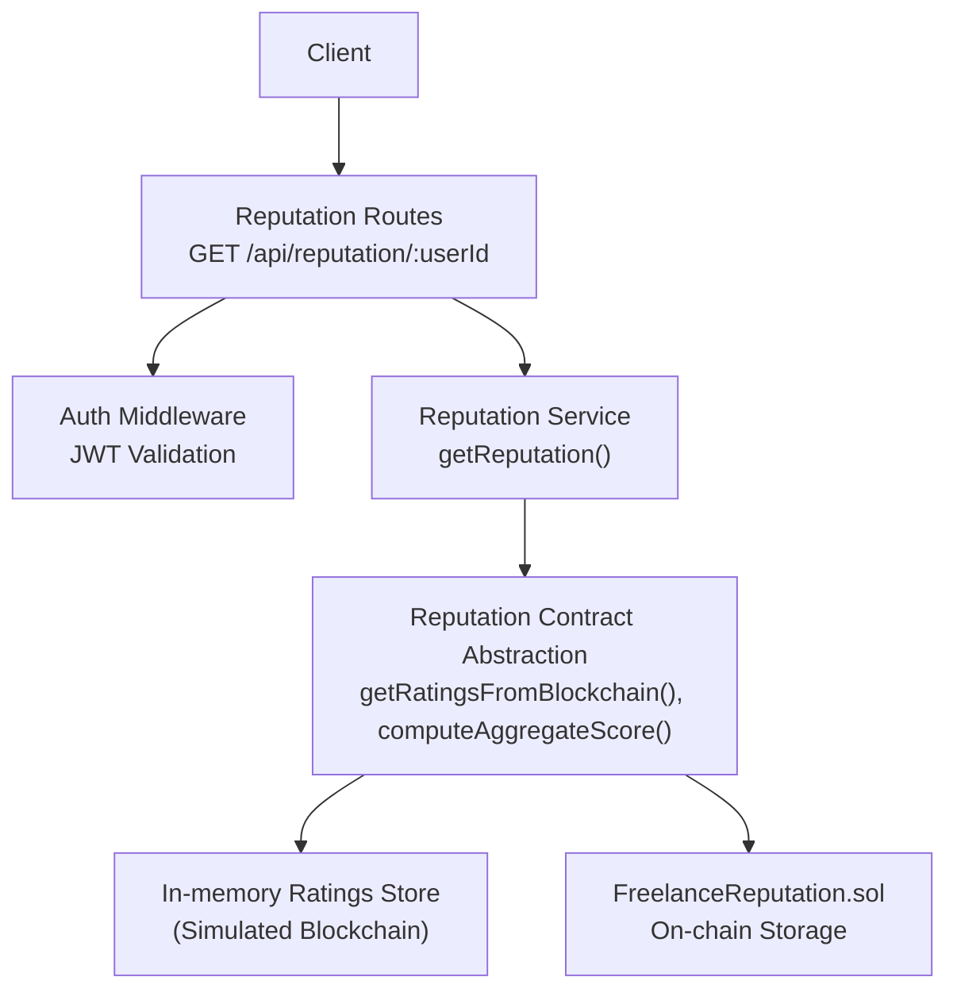

**Diagram sources**
- [reputation-routes.ts](file://src/routes/reputation-routes.ts#L124-L149)
- [auth-middleware.ts](file://src/middleware/auth-middleware.ts#L25-L70)
- [reputation-service.ts](file://src/services/reputation-service.ts#L188-L213)
- [reputation-contract.ts](file://src/services/reputation-contract.ts#L152-L203)
- [FreelanceReputation.sol](file://contracts/FreelanceReputation.sol#L1-L183)

**Section sources**
- [reputation-routes.ts](file://src/routes/reputation-routes.ts#L1-L150)
- [reputation-service.ts](file://src/services/reputation-service.ts#L183-L213)
- [reputation-contract.ts](file://src/services/reputation-contract.ts#L152-L203)
- [FreelanceReputation.sol](file://contracts/FreelanceReputation.sol#L1-L183)

## Core Components
- Endpoint: GET /api/reputation/:userId
- Authentication: JWT Bearer token required
- Optional parameters: None currently defined on the route; time-range filtering is not exposed as a query parameter in the current implementation
- Response: Reputation score with weighted average, simple average, total ratings, and raw ratings

Key implementation references:
- Route handler and Swagger schema for GET /api/reputation/:userId
- Service function that fetches ratings and computes weighted average
- Contract abstraction that retrieves ratings and computes aggregate score
- On-chain smart contract that stores ratings and exposes read operations

**Section sources**
- [reputation-routes.ts](file://src/routes/reputation-routes.ts#L96-L149)
- [reputation-service.ts](file://src/services/reputation-service.ts#L188-L213)
- [reputation-contract.ts](file://src/services/reputation-contract.ts#L205-L242)
- [FreelanceReputation.sol](file://contracts/FreelanceReputation.sol#L110-L141)

## Architecture Overview
The GET /api/reputation/:userId flow:
1. Client sends a request with a JWT Bearer token.
2. Auth middleware validates the token and attaches user info to the request.
3. Route validates path parameters and delegates to the service.
4. Service fetches all ratings for the user from the blockchain abstraction.
5. Service computes a weighted average score using time decay and a simple average.
6. Service returns structured data including ratings, counts, and averages.

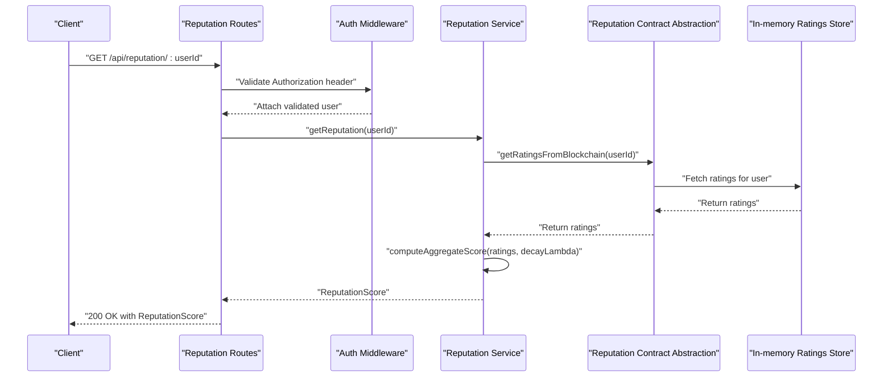

**Diagram sources**
- [reputation-routes.ts](file://src/routes/reputation-routes.ts#L124-L149)
- [auth-middleware.ts](file://src/middleware/auth-middleware.ts#L25-L70)
- [reputation-service.ts](file://src/services/reputation-service.ts#L188-L213)
- [reputation-contract.ts](file://src/services/reputation-contract.ts#L152-L203)

## Detailed Component Analysis

### Endpoint Definition: GET /api/reputation/:userId
- Path parameter: userId (UUID)
- Authentication: Requires a Bearer token in the Authorization header
- Response: ReputationScore object containing:
  - userId
  - score (weighted average with time decay)
  - totalRatings
  - averageRating (simple average)
  - ratings (array of BlockchainRating)

Swagger schema and endpoint definition are declared in the routes file.

**Section sources**
- [reputation-routes.ts](file://src/routes/reputation-routes.ts#L96-L149)
- [API-DOCUMENTATION.md](file://docs/API-DOCUMENTATION.md#L395-L418)

### Authentication and Authorization
- The route uses the auth middleware to validate JWT tokens.
- The middleware checks for a Bearer token and validates it, attaching user info to the request.
- If the token is missing, malformed, expired, or invalid, the middleware responds with 401.

**Section sources**
- [auth-middleware.ts](file://src/middleware/auth-middleware.ts#L25-L70)
- [API-DOCUMENTATION.md](file://docs/API-DOCUMENTATION.md#L7-L14)

### Service Layer: getReputation(userId, decayLambda?)
- Fetches all ratings for the user from the blockchain abstraction.
- Computes:
  - Weighted average score using time decay (default decayLambda = 0.01)
  - Simple average (no time decay)
- Returns a ReputationScore object.

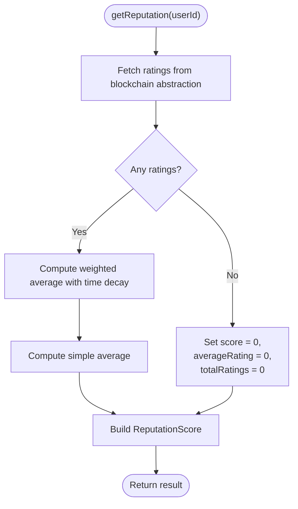

**Diagram sources**
- [reputation-service.ts](file://src/services/reputation-service.ts#L188-L213)
- [reputation-contract.ts](file://src/services/reputation-contract.ts#L205-L242)

**Section sources**
- [reputation-service.ts](file://src/services/reputation-service.ts#L188-L213)

### Blockchain Abstraction: Ratings Retrieval and Aggregation
- getRatingsFromBlockchain(userId): Returns all ratings for a user sorted by timestamp descending.
- computeAggregateScore(ratings, decayLambda): Implements time decay weighting:
  - Age in days computed from timestamp
  - Weight = e^(-lambda × age_in_days)
  - Weighted average rounded to two decimals
- Edge case: If no ratings, returns 0 for score.

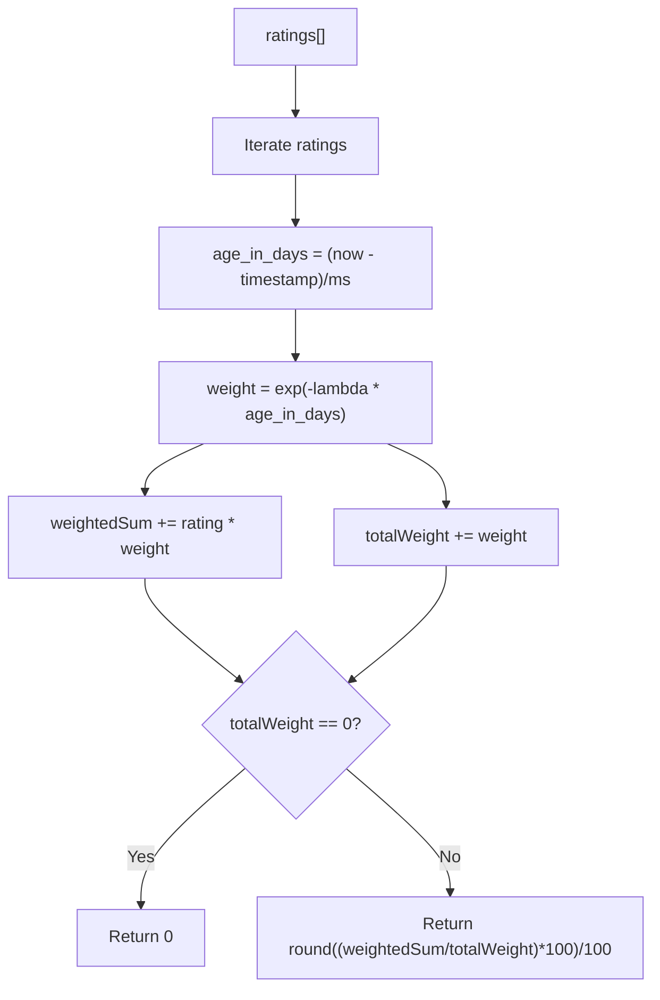

**Diagram sources**
- [reputation-contract.ts](file://src/services/reputation-contract.ts#L205-L242)

**Section sources**
- [reputation-contract.ts](file://src/services/reputation-contract.ts#L152-L203)
- [reputation-contract.ts](file://src/services/reputation-contract.ts#L205-L242)

### On-chain Smart Contract: FreelanceReputation.sol
- Stores ratings with fields: rater, ratee, score (1–5), comment, contractId, timestamp, isEmployerRating.
- Provides read-only functions:
  - getAverageRating(address): returns totalScore * 100 / ratingCount (or 0 if no ratings)
  - getRatingCount(address): number of ratings
  - getUserRatingIndices(address): indices of received ratings
  - getGivenRatingIndices(address): indices of given ratings
  - getRating(index): returns rating details
  - getTotalRatings(): total count
  - hasRated(rater, ratee, contractId): duplicate check
- The current backend uses an in-memory store to simulate on-chain behavior during development.

**Section sources**
- [FreelanceReputation.sol](file://contracts/FreelanceReputation.sol#L1-L183)
- [reputation-contract.ts](file://src/services/reputation-contract.ts#L48-L53)

### Response Schema
- ReputationScore:
  - userId: string
  - score: number (weighted average with time decay)
  - totalRatings: integer
  - averageRating: number (simple average)
  - ratings: array of BlockchainRating

- BlockchainRating:
  - id: string
  - contractId: string
  - raterId: string
  - rateeId: string
  - rating: integer (1–5)
  - comment: string (optional)
  - timestamp: integer
  - transactionHash: string

These schemas are defined in the routes file and referenced by the Swagger documentation.

**Section sources**
- [reputation-routes.ts](file://src/routes/reputation-routes.ts#L18-L76)
- [API-DOCUMENTATION.md](file://docs/API-DOCUMENTATION.md#L395-L418)

### Optional Time-Range Parameters
- Current implementation does not expose time-range query parameters for GET /api/reputation/:userId.
- The service fetches all ratings for the user and applies time decay in-memory.
- If future enhancements add time-range filtering, it should be implemented in the service layer and reflected in the route and Swagger schema.

**Section sources**
- [reputation-routes.ts](file://src/routes/reputation-routes.ts#L96-L149)
- [reputation-service.ts](file://src/services/reputation-service.ts#L188-L213)

### Practical Example: Fetching a Freelancer’s Reputation Score
- Client calls GET /api/reputation/:userId with a valid JWT Bearer token.
- Backend returns a JSON payload containing:
  - userId
  - score (weighted average)
  - totalRatings
  - averageRating
  - ratings array with individual rating details

This response can be directly used to render a profile view with:
- Star rating visualization
- Total review count
- Recent ratings preview

**Section sources**
- [API-DOCUMENTATION.md](file://docs/API-DOCUMENTATION.md#L395-L418)

### Caching Strategies
- Current implementation does not include explicit caching for reputation scores.
- Recommendations:
  - Cache the computed score per userId with TTL (e.g., 5–15 minutes) to reduce blockchain reads.
  - Invalidate cache on rating submission or significant changes.
  - Use a distributed cache (e.g., Redis) in production for horizontal scaling.
  - Cache the raw ratings list separately if needed for frequent profile rendering.

[No sources needed since this section provides general guidance]

### Edge Cases and Error Handling
- No ratings:
  - Service returns score = 0, averageRating = 0, totalRatings = 0.
- Invalid userId:
  - Route validation ensures userId is present; otherwise returns 400.
- JWT issues:
  - Auth middleware returns 401 for missing or invalid tokens.
- Unknown user:
  - The service fetches ratings regardless of user existence; if no ratings are found, it still returns a valid zero-score response.

**Section sources**
- [reputation-service.ts](file://src/services/reputation-service.ts#L188-L213)
- [reputation-routes.ts](file://src/routes/reputation-routes.ts#L124-L149)
- [auth-middleware.ts](file://src/middleware/auth-middleware.ts#L25-L70)

### Client-Side Implementation Tips
- Display:
  - Render a star-based indicator using score (rounded to nearest half-star).
  - Show totalRatings and averageRating prominently.
  - Optionally show recent ratings with timestamps and comments.
- Interactions:
  - Refresh reputation after rating submission.
  - Debounce repeated requests to the same endpoint.
- UX:
  - Gracefully handle loading states and empty states.
  - Provide tooltips explaining the difference between weighted and simple averages.

[No sources needed since this section provides general guidance]

## Dependency Analysis
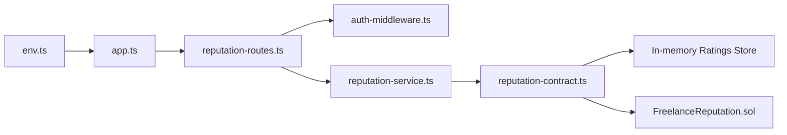

**Diagram sources**
- [reputation-routes.ts](file://src/routes/reputation-routes.ts#L1-L150)
- [auth-middleware.ts](file://src/middleware/auth-middleware.ts#L25-L70)
- [reputation-service.ts](file://src/services/reputation-service.ts#L1-L100)
- [reputation-contract.ts](file://src/services/reputation-contract.ts#L1-L60)
- [FreelanceReputation.sol](file://contracts/FreelanceReputation.sol#L1-L183)
- [app.ts](file://src/app.ts#L1-L87)
- [env.ts](file://src/config/env.ts#L1-L70)

**Section sources**
- [reputation-routes.ts](file://src/routes/reputation-routes.ts#L1-L150)
- [reputation-service.ts](file://src/services/reputation-service.ts#L1-L100)
- [reputation-contract.ts](file://src/services/reputation-contract.ts#L1-L60)
- [FreelanceReputation.sol](file://contracts/FreelanceReputation.sol#L1-L183)
- [app.ts](file://src/app.ts#L1-L87)
- [env.ts](file://src/config/env.ts#L1-L70)

## Performance Considerations
- Time decay computation is O(n) where n is the number of ratings; acceptable for typical user rating volumes.
- To reduce blockchain reads:
  - Cache aggregated score and raw ratings per user.
  - Batch updates and invalidate caches on rating submission.
- Consider pagination or time-range filtering in future iterations to limit dataset size.

[No sources needed since this section provides general guidance]

## Troubleshooting Guide
- 401 Unauthorized:
  - Ensure Authorization header is present and formatted as Bearer <token>.
  - Verify token is not expired or revoked.
- 400 Validation Error:
  - Confirm userId is a valid UUID and present.
- 500 Internal Error:
  - Check server logs and environment configuration (JWT secrets, blockchain RPC settings).
- Unexpected zero score:
  - Confirm the user has received ratings; otherwise, zero is expected.

**Section sources**
- [auth-middleware.ts](file://src/middleware/auth-middleware.ts#L25-L70)
- [reputation-routes.ts](file://src/routes/reputation-routes.ts#L124-L149)
- [API-DOCUMENTATION.md](file://docs/API-DOCUMENTATION.md#L611-L642)
- [env.ts](file://src/config/env.ts#L41-L67)

## Conclusion
The GET /api/reputation/:userId endpoint provides a robust, time-decayed reputation score backed by on-chain data. The current implementation focuses on correctness and simplicity, returning weighted and simple averages along with raw ratings. Future enhancements can include optional time-range filtering, caching, and richer client-side visualizations to improve user experience.

## Appendices

### Endpoint Reference
- Method: GET
- Path: /api/reputation/:userId
- Path Params:
  - userId: string (UUID)
- Query Params: None (time-range filtering not implemented)
- Authentication: Bearer JWT
- Success Response: 200 with ReputationScore
- Error Responses: 400, 401, 404 (as applicable)

**Section sources**
- [reputation-routes.ts](file://src/routes/reputation-routes.ts#L96-L149)
- [API-DOCUMENTATION.md](file://docs/API-DOCUMENTATION.md#L395-L418)

---

# Submit Rating

<cite>
**Referenced Files in This Document**
- [reputation-routes.ts](file://src/routes/reputation-routes.ts)
- [reputation-service.ts](file://src/services/reputation-service.ts)
- [reputation-contract.ts](file://src/services/reputation-contract.ts)
- [blockchain-client.ts](file://src/services/blockchain-client.ts)
- [auth-middleware.ts](file://src/middleware/auth-middleware.ts)
- [contract-repository.ts](file://src/repositories/contract-repository.ts)
- [entity-mapper.ts](file://src/utils/entity-mapper.ts)
- [FreelanceReputation.sol](file://contracts/FreelanceReputation.sol)
- [API-DOCUMENTATION.md](file://docs/API-DOCUMENTATION.md)
</cite>

## Table of Contents
1. [Introduction](#introduction)
2. [Project Structure](#project-structure)
3. [Core Components](#core-components)
4. [Architecture Overview](#architecture-overview)
5. [Detailed Component Analysis](#detailed-component-analysis)
6. [Dependency Analysis](#dependency-analysis)
7. [Performance Considerations](#performance-considerations)
8. [Troubleshooting Guide](#troubleshooting-guide)
9. [Conclusion](#conclusion)
10. [Appendices](#appendices)

## Introduction
This document provides API documentation for the rating submission endpoint in the FreelanceXchain reputation system. It covers the POST /api/reputation/rate endpoint, including JWT authentication, request body schema, validation rules, and the business logic flow. It also explains how the system integrates with the FreelanceReputation.sol smart contract via the reputation-service to store ratings immutably on-chain, and how blockchain transaction confirmation works. Guidance is included for client applications to handle transaction confirmation and user feedback.

## Project Structure
The rating submission flow spans the route handler, service layer, blockchain integration, and smart contract. The following diagram shows the high-level structure and interactions.

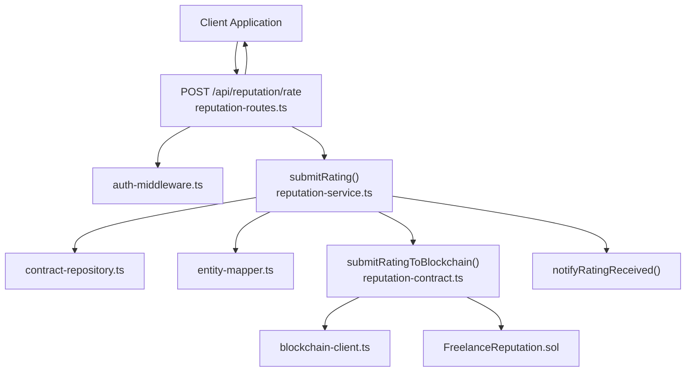

**Diagram sources**
- [reputation-routes.ts](file://src/routes/reputation-routes.ts#L188-L272)
- [auth-middleware.ts](file://src/middleware/auth-middleware.ts#L25-L70)
- [reputation-service.ts](file://src/services/reputation-service.ts#L76-L180)
- [contract-repository.ts](file://src/repositories/contract-repository.ts#L24-L31)
- [entity-mapper.ts](file://src/utils/entity-mapper.ts#L282-L310)
- [reputation-contract.ts](file://src/services/reputation-contract.ts#L91-L149)
- [blockchain-client.ts](file://src/services/blockchain-client.ts#L131-L209)
- [FreelanceReputation.sol](file://contracts/FreelanceReputation.sol#L64-L106)

**Section sources**
- [reputation-routes.ts](file://src/routes/reputation-routes.ts#L188-L272)
- [API-DOCUMENTATION.md](file://docs/API-DOCUMENTATION.md#L1-L20)

## Core Components
- Route handler: Validates JWT, parses request body, performs validation, and delegates to the service.
- Service: Enforces business rules (contract existence, eligibility, duplicate prevention), submits to blockchain, and notifies the ratee.
- Blockchain integration: Submits a transaction, confirms it, and stores a local representation of the rating.
- Smart contract: Enforces on-chain constraints and emits events.

**Section sources**
- [reputation-routes.ts](file://src/routes/reputation-routes.ts#L188-L272)
- [reputation-service.ts](file://src/services/reputation-service.ts#L76-L180)
- [reputation-contract.ts](file://src/services/reputation-contract.ts#L91-L149)
- [blockchain-client.ts](file://src/services/blockchain-client.ts#L131-L209)
- [FreelanceReputation.sol](file://contracts/FreelanceReputation.sol#L64-L106)

## Architecture Overview
The rating submission follows a layered architecture:
- Presentation: Express route validates JWT and request payload.
- Application: Service enforces business rules and orchestrates blockchain submission.
- Persistence: Local in-memory blockchain store simulates on-chain storage during development.
- Consensus: Smart contract enforces immutability and uniqueness.

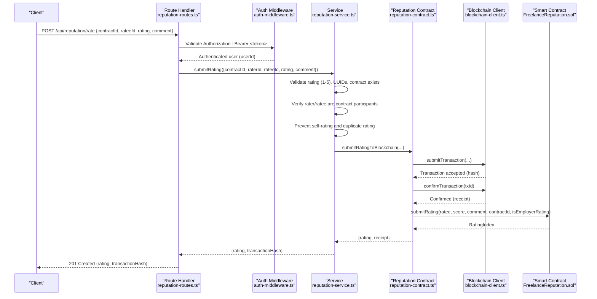

**Diagram sources**
- [reputation-routes.ts](file://src/routes/reputation-routes.ts#L188-L272)
- [auth-middleware.ts](file://src/middleware/auth-middleware.ts#L25-L70)
- [reputation-service.ts](file://src/services/reputation-service.ts#L76-L180)
- [reputation-contract.ts](file://src/services/reputation-contract.ts#L91-L149)
- [blockchain-client.ts](file://src/services/blockchain-client.ts#L131-L209)
- [FreelanceReputation.sol](file://contracts/FreelanceReputation.sol#L64-L106)

## Detailed Component Analysis

### Endpoint Definition
- Method: POST
- Path: /api/reputation/rate
- Security: Requires Bearer token JWT
- Request body schema:
  - contractId: string (UUID)
  - rateeId: string (UUID)
  - rating: integer (1-5)
  - comment: string (optional)
- Responses:
  - 201 Created: { rating: BlockchainRating, transactionHash: string }
  - 400 Bad Request: Validation errors (invalid rating, missing fields, invalid UUID)
  - 401 Unauthorized: Missing/invalid token
  - 403 Forbidden: Unauthorized (not a contract participant)
  - 404 Not Found: Contract not found
  - 409 Conflict: Duplicate rating

**Section sources**
- [reputation-routes.ts](file://src/routes/reputation-routes.ts#L151-L187)
- [reputation-routes.ts](file://src/routes/reputation-routes.ts#L188-L272)
- [API-DOCUMENTATION.md](file://docs/API-DOCUMENTATION.md#L1-L20)

### Authentication and Authorization
- The route uses auth-middleware to extract and validate the Bearer token.
- On success, the authenticated user’s userId is attached to the request and used as raterId.
- On failure, the route responds with 401 Unauthorized.

**Section sources**
- [auth-middleware.ts](file://src/middleware/auth-middleware.ts#L25-L70)
- [reputation-routes.ts](file://src/routes/reputation-routes.ts#L188-L206)

### Request Validation
- Required fields: contractId, rateeId, rating.
- UUID validation: Both contractId and rateeId must be valid UUIDs.
- Rating value: Must be an integer between 1 and 5.
- On validation failure, the route returns 400 with details.

**Section sources**
- [reputation-routes.ts](file://src/routes/reputation-routes.ts#L208-L247)

### Business Logic Flow
- Contract existence: Fetch contract by contractId; return 404 if not found.
- Eligibility checks:
  - raterId must be either freelancerId or employerId in the contract.
  - rateeId must be a contract participant.
  - raterId must not equal rateeId (self-rating prohibited).
- Duplicate prevention: Check if a rating already exists for the rater/ratee/contract combination.
- Blockchain submission: If all checks pass, submit rating to the smart contract and return the receipt’s transactionHash along with the rating.

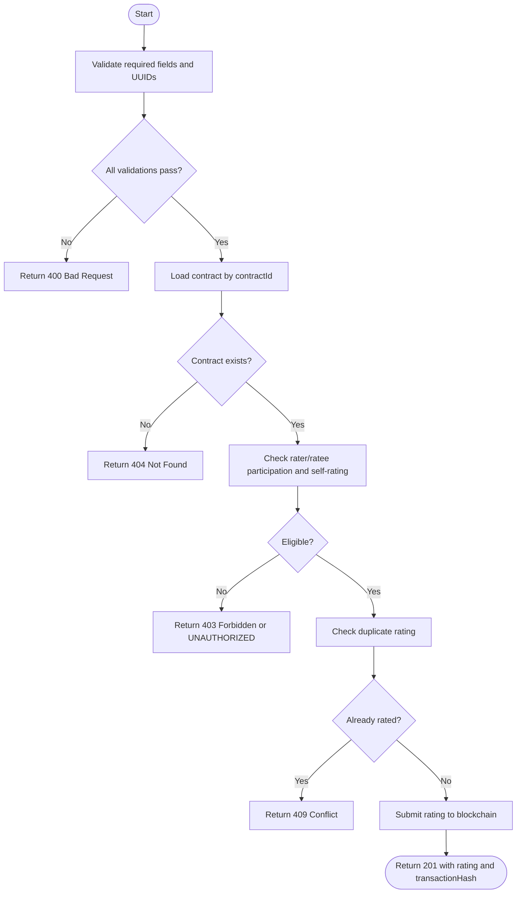

**Diagram sources**
- [reputation-routes.ts](file://src/routes/reputation-routes.ts#L188-L272)
- [reputation-service.ts](file://src/services/reputation-service.ts#L76-L180)
- [contract-repository.ts](file://src/repositories/contract-repository.ts#L24-L31)

**Section sources**
- [reputation-service.ts](file://src/services/reputation-service.ts#L76-L180)

### Blockchain Integration and Smart Contract
- The service calls submitRatingToBlockchain with the rating parameters.
- The blockchain client simulates transaction submission and confirmation.
- The smart contract enforces:
  - Ratee address must be non-zero and not equal to rater.
  - Rating must be between 1 and 5.
  - ContractId must be non-empty.
  - Duplicate rating prevention using a composite key.
- The service returns the transactionHash from the receipt.

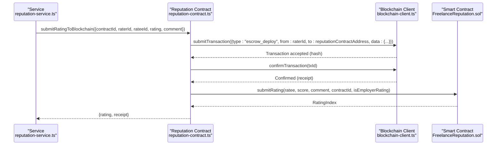

**Diagram sources**
- [reputation-contract.ts](file://src/services/reputation-contract.ts#L91-L149)
- [blockchain-client.ts](file://src/services/blockchain-client.ts#L131-L209)
- [FreelanceReputation.sol](file://contracts/FreelanceReputation.sol#L64-L106)

**Section sources**
- [reputation-contract.ts](file://src/services/reputation-contract.ts#L91-L149)
- [blockchain-client.ts](file://src/services/blockchain-client.ts#L131-L209)
- [FreelanceReputation.sol](file://contracts/FreelanceReputation.sol#L64-L106)

### Example: Freelancer Submits a 5-Star Rating with Comment After Contract Completion
- The route requires a Bearer token JWT in the Authorization header.
- The request body must include contractId, rateeId, rating (5), and an optional comment.
- The service verifies the contract exists, ensures the rater is a contract participant, prevents self-rating, and checks for duplicates.
- The service submits the rating to the smart contract and returns the rating and transactionHash.

Note: The repository simulates blockchain behavior. In production, replace the in-memory blockchain client with a real RPC connection.

**Section sources**
- [reputation-routes.ts](file://src/routes/reputation-routes.ts#L151-L187)
- [reputation-service.ts](file://src/services/reputation-service.ts#L76-L180)
- [FreelanceReputation.sol](file://contracts/FreelanceReputation.sol#L64-L106)

## Dependency Analysis
The following diagram shows the key dependencies among components involved in rating submission.

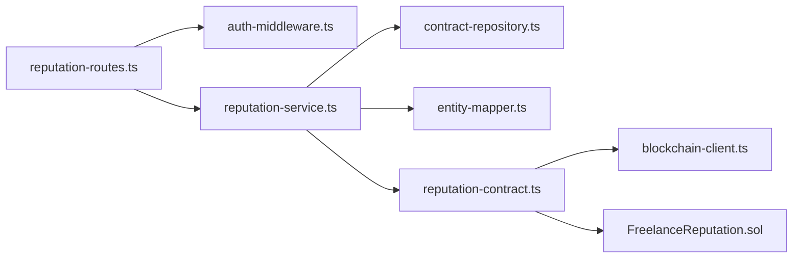

**Diagram sources**
- [reputation-routes.ts](file://src/routes/reputation-routes.ts#L188-L272)
- [auth-middleware.ts](file://src/middleware/auth-middleware.ts#L25-L70)
- [reputation-service.ts](file://src/services/reputation-service.ts#L76-L180)
- [contract-repository.ts](file://src/repositories/contract-repository.ts#L24-L31)
- [entity-mapper.ts](file://src/utils/entity-mapper.ts#L282-L310)
- [reputation-contract.ts](file://src/services/reputation-contract.ts#L91-L149)
- [blockchain-client.ts](file://src/services/blockchain-client.ts#L131-L209)
- [FreelanceReputation.sol](file://contracts/FreelanceReputation.sol#L64-L106)

**Section sources**
- [reputation-routes.ts](file://src/routes/reputation-routes.ts#L188-L272)
- [reputation-service.ts](file://src/services/reputation-service.ts#L76-L180)
- [reputation-contract.ts](file://src/services/reputation-contract.ts#L91-L149)
- [blockchain-client.ts](file://src/services/blockchain-client.ts#L131-L209)
- [FreelanceReputation.sol](file://contracts/FreelanceReputation.sol#L64-L106)

## Performance Considerations
- Transaction confirmation latency: The blockchain client simulates confirmation timing; in production, expect network latency and gas fees.
- Time decay computation: The service computes aggregate scores using time decay; this is efficient for small-to-medium datasets but consider caching for high-volume scenarios.
- Duplicate checks: The service performs a linear scan of stored ratings to detect duplicates; consider indexing or a dedicated duplicate-check function in production.

[No sources needed since this section provides general guidance]

## Troubleshooting Guide
Common error responses and their causes:
- 400 Bad Request
  - Missing required fields: contractId, rateeId, rating.
  - Invalid UUID format for contractId or rateeId.
  - Invalid rating value (non-integer or outside 1-5).
- 401 Unauthorized
  - Missing Authorization header or invalid Bearer token.
- 403 Forbidden
  - User is not a participant in the contract.
- 404 Not Found
  - Contract not found.
- 409 Conflict
  - Duplicate rating for the same rater/ratee/contract combination.
- Blockchain transaction failures
  - Transaction confirmation fails or smart contract reverts (e.g., duplicate rating, invalid parameters).

Client-side guidance:
- Show a loading indicator while awaiting the 201 response.
- On 400/409, display user-friendly messages indicating missing/invalid fields or duplicate rating.
- On 401, prompt the user to log in again.
- On 403/404, inform the user that they cannot rate or the contract was not found.
- For blockchain-related errors, retry after a delay or instruct the user to try again later.

**Section sources**
- [reputation-routes.ts](file://src/routes/reputation-routes.ts#L257-L271)
- [auth-middleware.ts](file://src/middleware/auth-middleware.ts#L25-L70)
- [reputation-service.ts](file://src/services/reputation-service.ts#L76-L180)
- [reputation-contract.ts](file://src/services/reputation-contract.ts#L91-L149)
- [blockchain-client.ts](file://src/services/blockchain-client.ts#L182-L239)
- [FreelanceReputation.sol](file://contracts/FreelanceReputation.sol#L64-L106)

## Conclusion
The rating submission endpoint enforces strict validation and eligibility rules, integrates with a smart contract to ensure immutable records, and returns a transaction hash for confirmation. Clients should handle various error responses gracefully and provide clear feedback to users. The current implementation simulates blockchain behavior; production deployments should connect to a real RPC endpoint.

[No sources needed since this section summarizes without analyzing specific files]

## Appendices

### API Definition
- Method: POST
- Path: /api/reputation/rate
- Security: Bearer token JWT
- Request body:
  - contractId: string (UUID)
  - rateeId: string (UUID)
  - rating: integer (1-5)
  - comment: string (optional)
- Responses:
  - 201 Created: { rating: BlockchainRating, transactionHash: string }
  - 400 Bad Request: Validation errors
  - 401 Unauthorized: Missing/invalid token
  - 403 Forbidden: Unauthorized (not a contract participant)
  - 404 Not Found: Contract not found
  - 409 Conflict: Duplicate rating

**Section sources**
- [reputation-routes.ts](file://src/routes/reputation-routes.ts#L151-L187)
- [reputation-routes.ts](file://src/routes/reputation-routes.ts#L188-L272)
- [API-DOCUMENTATION.md](file://docs/API-DOCUMENTATION.md#L1-L20)

### Smart Contract Constraints
- Ratee address must be non-zero and not equal to rater.
- Rating must be between 1 and 5.
- ContractId must be non-empty.
- Duplicate rating prevention using a composite key.

**Section sources**
- [FreelanceReputation.sol](file://contracts/FreelanceReputation.sol#L64-L106)

---

# Work History

<cite>
**Referenced Files in This Document**
- [reputation-routes.ts](file://src/routes/reputation-routes.ts)
- [reputation-service.ts](file://src/services/reputation-service.ts)
- [reputation-contract.ts](file://src/services/reputation-contract.ts)
- [contract-repository.ts](file://src/repositories/contract-repository.ts)
- [project-repository.ts](file://src/repositories/project-repository.ts)
- [entity-mapper.ts](file://src/utils/entity-mapper.ts)
- [auth-middleware.ts](file://src/middleware/auth-middleware.ts)
- [swagger.ts](file://src/config/swagger.ts)
- [API-DOCUMENTATION.md](file://docs/API-DOCUMENTATION.md)
- [FreelanceReputation.sol](file://contracts/FreelanceReputation.sol)
- [blockchain-client.ts](file://src/services/blockchain-client.ts)
</cite>

## Table of Contents
1. [Introduction](#introduction)
2. [Project Structure](#project-structure)
3. [Core Components](#core-components)
4. [Architecture Overview](#architecture-overview)
5. [Detailed Component Analysis](#detailed-component-analysis)
6. [Dependency Analysis](#dependency-analysis)
7. [Performance Considerations](#performance-considerations)
8. [Troubleshooting Guide](#troubleshooting-guide)
9. [Conclusion](#conclusion)
10. [Appendices](#appendices)

## Introduction
This document explains the work history retrieval endpoint for the FreelanceXchain platform. It covers:
- Endpoint definition and authentication via JWT
- How the service combines on-chain reputation data from the smart contract with off-chain project metadata from Supabase
- Response structure and enrichment fields
- Real-world example of a client reviewing a freelancer’s history
- Pagination and performance considerations
- Data consistency model and discrepancy handling

## Project Structure
The work history feature spans routing, service orchestration, repositories, and blockchain integration:
- Route handler for GET /api/reputation/:userId/history
- Service layer that aggregates contracts, projects, and ratings
- Repositories for contracts and projects
- Blockchain client and reputation contract interface
- Swagger/OpenAPI schema for the endpoint

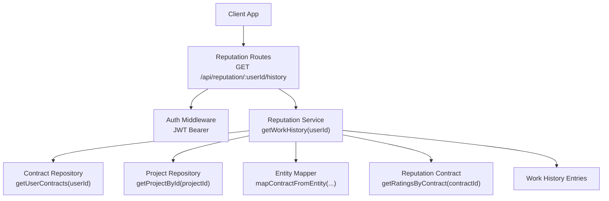

**Diagram sources**
- [reputation-routes.ts](file://src/routes/reputation-routes.ts#L305-L330)
- [auth-middleware.ts](file://src/middleware/auth-middleware.ts#L25-L70)
- [reputation-service.ts](file://src/services/reputation-service.ts#L220-L269)
- [contract-repository.ts](file://src/repositories/contract-repository.ts#L116-L135)
- [project-repository.ts](file://src/repositories/project-repository.ts#L39-L41)
- [entity-mapper.ts](file://src/utils/entity-mapper.ts#L281-L310)
- [reputation-contract.ts](file://src/services/reputation-contract.ts#L190-L203)

**Section sources**
- [reputation-routes.ts](file://src/routes/reputation-routes.ts#L275-L330)
- [swagger.ts](file://src/config/swagger.ts#L21-L29)
- [API-DOCUMENTATION.md](file://docs/API-DOCUMENTATION.md#L432-L438)

## Core Components
- Route: Defines the GET /api/reputation/:userId/history endpoint, validates userId, and delegates to the service.
- Service: Loads user contracts, filters to completed, enriches with project metadata, and attaches ratings from the blockchain.
- Repositories: ContractRepository.getUserContracts and ProjectRepository.getProjectById.
- Blockchain: ReputationContract interface simulates on-chain storage and retrieval for ratings.
- Auth: JWT Bearer token validated by auth middleware.

Key responsibilities:
- Enforce authentication and authorization
- Retrieve and filter contracts by status
- Fetch project titles and timestamps
- Fetch ratings per contract and attach to entries
- Sort by completion date descending

**Section sources**
- [reputation-routes.ts](file://src/routes/reputation-routes.ts#L305-L330)
- [reputation-service.ts](file://src/services/reputation-service.ts#L220-L269)
- [contract-repository.ts](file://src/repositories/contract-repository.ts#L116-L135)
- [project-repository.ts](file://src/repositories/project-repository.ts#L39-L41)
- [reputation-contract.ts](file://src/services/reputation-contract.ts#L190-L203)
- [auth-middleware.ts](file://src/middleware/auth-middleware.ts#L25-L70)

## Architecture Overview
The work history pipeline integrates on-chain and off-chain data:

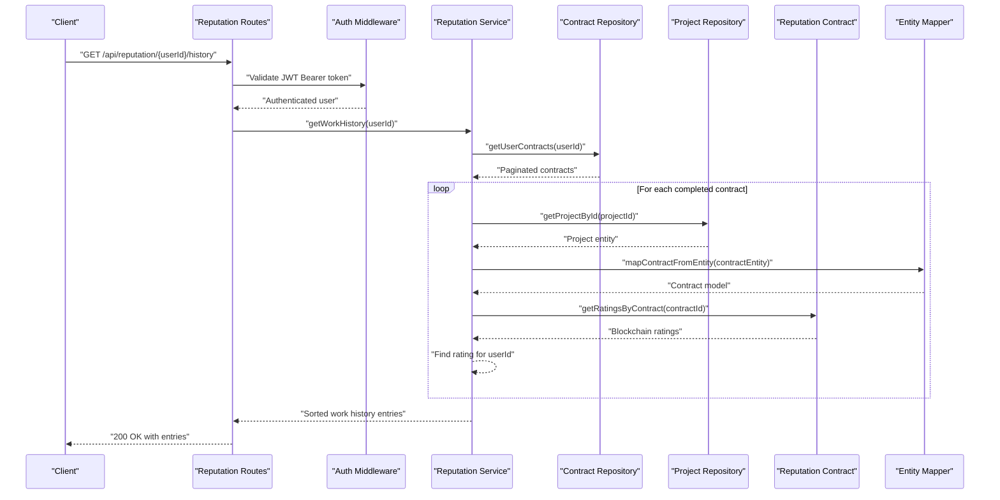

**Diagram sources**
- [reputation-routes.ts](file://src/routes/reputation-routes.ts#L305-L330)
- [auth-middleware.ts](file://src/middleware/auth-middleware.ts#L25-L70)
- [reputation-service.ts](file://src/services/reputation-service.ts#L220-L269)
- [contract-repository.ts](file://src/repositories/contract-repository.ts#L116-L135)
- [project-repository.ts](file://src/repositories/project-repository.ts#L39-L41)
- [entity-mapper.ts](file://src/utils/entity-mapper.ts#L281-L310)
- [reputation-contract.ts](file://src/services/reputation-contract.ts#L190-L203)

## Detailed Component Analysis

### Endpoint Definition and Authentication
- Endpoint: GET /api/reputation/:userId/history
- Path parameter: userId (validated as UUID)
- Authentication: Requires Authorization: Bearer <JWT>. The auth middleware validates the token and attaches user info to the request.
- Response: Array of WorkHistoryEntry objects.

Swagger/OpenAPI schema defines the WorkHistoryEntry shape and the endpoint’s security scheme.

**Section sources**
- [reputation-routes.ts](file://src/routes/reputation-routes.ts#L275-L330)
- [swagger.ts](file://src/config/swagger.ts#L21-L29)
- [API-DOCUMENTATION.md](file://docs/API-DOCUMENTATION.md#L432-L438)
- [auth-middleware.ts](file://src/middleware/auth-middleware.ts#L25-L70)

### Service Logic: getWorkHistory(userId)
- Load user contracts using ContractRepository.getUserContracts(userId).
- Filter to completed contracts.
- For each completed contract:
  - Determine role (freelancer or employer) based on userId.
  - Fetch project title via ProjectRepository.getProjectById(projectId).
  - Retrieve all ratings for the contract via getRatingsByContract(contractId).
  - Select the rating received by the user (rateeId === userId).
- Sort entries by completedAt descending.
- Return the enriched list.

```mermaid
flowchart TD
Start(["getWorkHistory(userId)"]) --> Load["Load user contracts"]
Load --> Filter["Filter to completed"]
Filter --> Loop{"For each contract"}
Loop --> |Yes| Proj["Fetch project by projectId"]
Proj --> Role["Determine role (freelancer/employer)"]
Role --> Ratings["Fetch ratings by contractId"]
Ratings --> Find["Find rating received by userId"]
Find --> Push["Push entry with projectTitle, role, completedAt, rating, ratingComment"]
Push --> Loop
Loop --> |No| Sort["Sort by completedAt desc"]
Sort --> Done(["Return entries"])
```

**Diagram sources**
- [reputation-service.ts](file://src/services/reputation-service.ts#L220-L269)
- [contract-repository.ts](file://src/repositories/contract-repository.ts#L116-L135)
- [project-repository.ts](file://src/repositories/project-repository.ts#L39-L41)
- [reputation-contract.ts](file://src/services/reputation-contract.ts#L190-L203)

**Section sources**
- [reputation-service.ts](file://src/services/reputation-service.ts#L220-L269)

### On-chain Reputation Data Integration
- Ratings are retrieved per contract using getRatingsByContract(contractId).
- The service selects the rating where rateeId equals the queried userId.
- The blockchain interface simulates storage and retrieval; in production, this would call the FreelanceReputation.sol contract.

```mermaid
classDiagram
class ReputationContractInterface {
+getRatingsByContract(contractId) BlockchainRating[]
+getRatingsFromBlockchain(userId) BlockchainRating[]
+hasUserRatedForContract(raterId, rateeId, contractId) boolean
}
class FreelanceReputation {
+submitRating(ratee, score, comment, contractId, isEmployerRating) uint256
+getRatingCount(user) uint256
+getAverageRating(user) uint256
+getUserRatingIndices(user) uint256[]
+getGivenRatingIndices(user) uint256[]
+hasRated(rater, ratee, contractId) bool
}
ReputationContractInterface <|.. FreelanceReputation : "simulated interface"
```

**Diagram sources**
- [reputation-contract.ts](file://src/services/reputation-contract.ts#L190-L203)
- [FreelanceReputation.sol](file://contracts/FreelanceReputation.sol#L64-L106)

**Section sources**
- [reputation-contract.ts](file://src/services/reputation-contract.ts#L190-L203)
- [FreelanceReputation.sol](file://contracts/FreelanceReputation.sol#L64-L106)

### Off-chain Project Metadata
- Project titles and statuses are fetched from Supabase via ProjectRepository.getProjectById(projectId).
- The entity mapper converts database entities to API models for consistent field names.

**Section sources**
- [project-repository.ts](file://src/repositories/project-repository.ts#L39-L41)
- [entity-mapper.ts](file://src/utils/entity-mapper.ts#L236-L249)

### Response Structure
Each WorkHistoryEntry includes:
- contractId: UUID of the contract
- projectId: UUID of the project
- projectTitle: String title of the project
- role: Enum 'freelancer' or 'employer'
- completedAt: ISO date-time string
- rating: Integer 1–5 (optional)
- ratingComment: String (optional)

Swagger schema and route documentation define these fields.

**Section sources**
- [reputation-routes.ts](file://src/routes/reputation-routes.ts#L56-L76)
- [API-DOCUMENTATION.md](file://docs/API-DOCUMENTATION.md#L432-L438)

### Real-world Example: Client Hiring Decision
Scenario:
- A client wants to hire a freelancer for a new project.
- The client opens the freelancer’s profile and navigates to the Work History tab.
- The client calls GET /api/reputation/:userId/history with a valid JWT.
- The system returns a list of past completed contracts, each with:
  - Project title
  - Completion date
  - Client’s rating and comment (if applicable)
  - The client’s role in the contract (employer)
- The client evaluates the history to decide whether to hire.

Outcome:
- The client sees a chronological list of completed projects, ratings, and comments, enabling informed decision-making.

**Section sources**
- [reputation-routes.ts](file://src/routes/reputation-routes.ts#L275-L330)
- [reputation-service.ts](file://src/services/reputation-service.ts#L220-L269)

### Filtering Parameters
Current endpoint:
- No query parameters are defined for filtering by project status or date range.
- The service filters contracts to completed only and sorts by completion date descending.

If future enhancements are introduced:
- Add query parameters for status and date range.
- Apply filters at the repository level (e.g., ContractRepository.getContractsByStatus and date range filters).
- Ensure pagination remains consistent.

**Section sources**
- [reputation-routes.ts](file://src/routes/reputation-routes.ts#L305-L330)
- [contract-repository.ts](file://src/repositories/contract-repository.ts#L95-L114)

## Dependency Analysis
High-level dependencies:
- Routes depend on auth middleware and reputation service.
- Service depends on repositories and reputation contract interface.
- Repositories depend on Supabase client and shared query options.
- Blockchain client provides transaction simulation and confirmation.

```mermaid
graph LR
Routes["reputation-routes.ts"] --> Auth["auth-middleware.ts"]
Routes --> Service["reputation-service.ts"]
Service --> ContractsRepo["contract-repository.ts"]
Service --> ProjectsRepo["project-repository.ts"]
Service --> ContractMap["entity-mapper.ts"]
Service --> ReputationContract["reputation-contract.ts"]
ReputationContract --> BlockchainClient["blockchain-client.ts"]
```

**Diagram sources**
- [reputation-routes.ts](file://src/routes/reputation-routes.ts#L305-L330)
- [auth-middleware.ts](file://src/middleware/auth-middleware.ts#L25-L70)
- [reputation-service.ts](file://src/services/reputation-service.ts#L220-L269)
- [contract-repository.ts](file://src/repositories/contract-repository.ts#L116-L135)
- [project-repository.ts](file://src/repositories/project-repository.ts#L39-L41)
- [entity-mapper.ts](file://src/utils/entity-mapper.ts#L281-L310)
- [reputation-contract.ts](file://src/services/reputation-contract.ts#L190-L203)
- [blockchain-client.ts](file://src/services/blockchain-client.ts#L131-L159)

**Section sources**
- [reputation-service.ts](file://src/services/reputation-service.ts#L220-L269)
- [contract-repository.ts](file://src/repositories/contract-repository.ts#L116-L135)
- [project-repository.ts](file://src/repositories/project-repository.ts#L39-L41)
- [reputation-contract.ts](file://src/services/reputation-contract.ts#L190-L203)
- [blockchain-client.ts](file://src/services/blockchain-client.ts#L131-L159)

## Performance Considerations
- Pagination:
  - ContractRepository.getUserContracts returns paginated results with hasMore and total. The service currently iterates all items; consider applying pagination limits upstream to reduce memory usage and response latency.
- Sorting:
  - Sorting by completedAt occurs in-memory after collecting entries. For large histories, consider sorting at the database level or limiting the number of entries returned.
- Network calls:
  - Each completed contract triggers a project metadata fetch and a blockchain ratings query. For very large histories, consider batching or caching project titles and ratings per contract.
- Blockchain latency:
  - The blockchain client simulates confirmation. In production, transaction confirmation adds latency; consider caching recent ratings or using a read replica for ratings.

Recommendations:
- Limit pageSize for getUserContracts and cap the number of returned entries.
- Cache project titles keyed by projectId to avoid repeated lookups.
- Cache per-contract ratings keyed by contractId to avoid repeated blockchain queries.
- Add optional query parameters for date range and status to reduce payload size.

**Section sources**
- [contract-repository.ts](file://src/repositories/contract-repository.ts#L116-L135)
- [reputation-service.ts](file://src/services/reputation-service.ts#L220-L269)
- [blockchain-client.ts](file://src/services/blockchain-client.ts#L182-L239)

## Troubleshooting Guide
Common issues and resolutions:
- Authentication failures:
  - Missing or invalid Authorization header: 401 Unauthorized.
  - Token expired or invalid: 401 Unauthorized with specific error code.
- Validation errors:
  - Missing or invalid userId: 400 with VALIDATION_ERROR.
- Not found:
  - If no contracts exist for the user, the service returns an empty array.
- Blockchain availability:
  - In simulation mode, transactions are confirmed immediately; in production, ensure RPC connectivity and handle confirmation timeouts.

Operational tips:
- Verify JWT token format: Bearer <token>.
- Confirm userId is a valid UUID.
- Check Supabase connectivity for project metadata.
- Monitor blockchain client availability and transaction confirmation status.

**Section sources**
- [auth-middleware.ts](file://src/middleware/auth-middleware.ts#L25-L70)
- [reputation-routes.ts](file://src/routes/reputation-routes.ts#L305-L330)
- [blockchain-client.ts](file://src/services/blockchain-client.ts#L288-L293)

## Conclusion
The work history endpoint provides clients with a comprehensive, time-ordered view of a freelancer’s completed projects, ratings, and comments. By combining on-chain reputation data with off-chain project metadata, the system delivers immutable, verifiable insights. Future enhancements should focus on pagination, caching, and optional filtering to improve performance and scalability.

## Appendices

### Endpoint Reference
- Method: GET
- Path: /api/reputation/:userId/history
- Security: Bearer JWT
- Path parameters:
  - userId: UUID
- Response: Array of WorkHistoryEntry
  - contractId: UUID
  - projectId: UUID
  - projectTitle: String
  - role: 'freelancer' | 'employer'
  - completedAt: ISO date-time
  - rating: Integer 1–5 (optional)
  - ratingComment: String (optional)

**Section sources**
- [reputation-routes.ts](file://src/routes/reputation-routes.ts#L275-L330)
- [swagger.ts](file://src/config/swagger.ts#L21-L29)
- [API-DOCUMENTATION.md](file://docs/API-DOCUMENTATION.md#L432-L438)