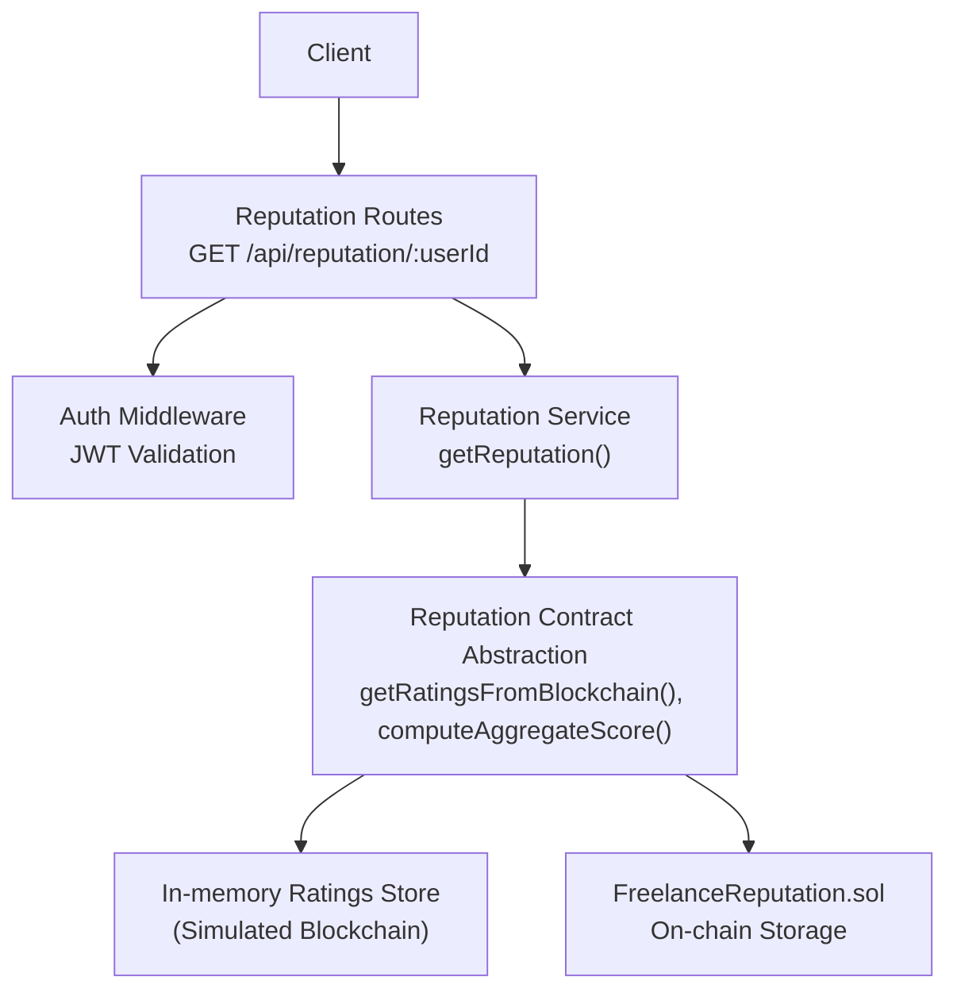
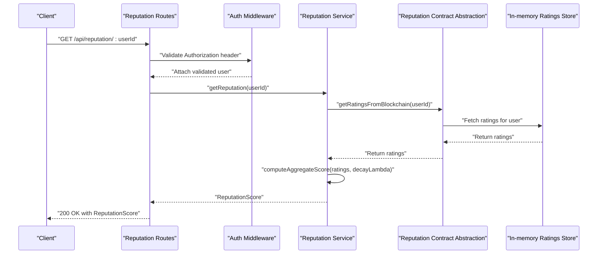
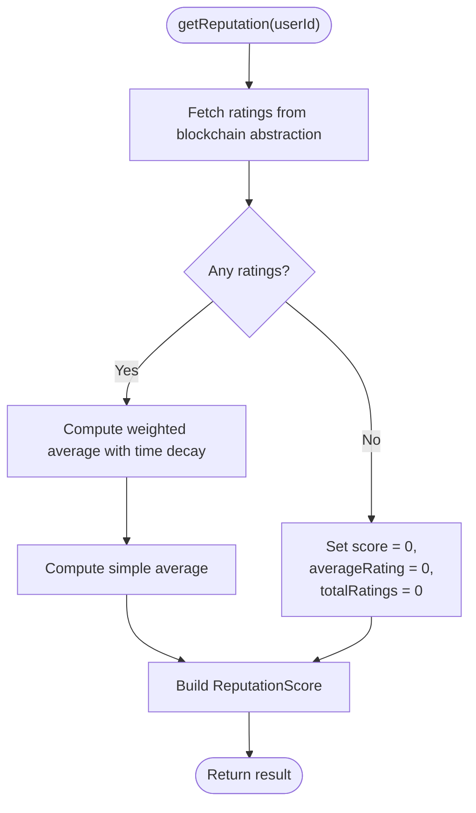
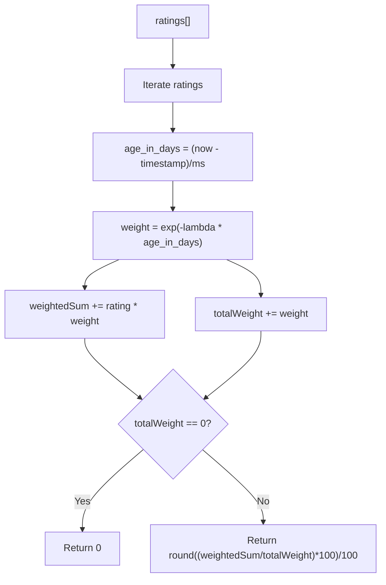
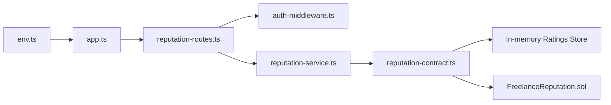

# Get Reputation Score

<cite>
**Referenced Files in This Document**
- [reputation-routes.ts](file://src/routes/reputation-routes.ts)
- [reputation-service.ts](file://src/services/reputation-service.ts)
- [reputation-contract.ts](file://src/services/reputation-contract.ts)
- [FreelanceReputation.sol](file://contracts/FreelanceReputation.sol)
- [auth-middleware.ts](file://src/middleware/auth-middleware.ts)
- [API-DOCUMENTATION.md](file://docs/API-DOCUMENTATION.md)
- [app.ts](file://src/app.ts)
- [env.ts](file://src/config/env.ts)
</cite>

## Table of Contents
1. [Introduction](#introduction)
2. [Project Structure](#project-structure)
3. [Core Components](#core-components)
4. [Architecture Overview](#architecture-overview)
5. [Detailed Component Analysis](#detailed-component-analysis)
6. [Dependency Analysis](#dependency-analysis)
7. [Performance Considerations](#performance-considerations)
8. [Troubleshooting Guide](#troubleshooting-guide)
9. [Conclusion](#conclusion)
10. [Appendices](#appendices)

## Introduction
This document provides API documentation for retrieving a user’s reputation score in the FreelanceXchain system. It covers the GET /api/reputation/:userId endpoint, JWT authentication requirements, optional time-range parameters, and the service’s aggregation logic that computes a weighted average score with time decay. It also documents the response schema, caching strategies, edge cases, and client-side implementation tips for displaying dynamic reputation indicators.

## Project Structure
The reputation feature spans routing, service, and blockchain abstraction layers:
- Routes define the endpoint and apply validation and authentication.
- Services orchestrate data retrieval and computation.
- Blockchain abstraction simulates on-chain interactions for development/testing.
- Smart contract defines on-chain data model and operations.

**Diagram sources**
- [reputation-routes.ts](file://src/routes/reputation-routes.ts#L124-L149)
- [auth-middleware.ts](file://src/middleware/auth-middleware.ts#L25-L70)
- [reputation-service.ts](file://src/services/reputation-service.ts#L188-L213)
- [reputation-contract.ts](file://src/services/reputation-contract.ts#L152-L203)
- [FreelanceReputation.sol](file://contracts/FreelanceReputation.sol#L1-L183)

**Section sources**
- [reputation-routes.ts](file://src/routes/reputation-routes.ts#L1-L150)
- [reputation-service.ts](file://src/services/reputation-service.ts#L183-L213)
- [reputation-contract.ts](file://src/services/reputation-contract.ts#L152-L203)
- [FreelanceReputation.sol](file://contracts/FreelanceReputation.sol#L1-L183)

## Core Components
- Endpoint: GET /api/reputation/:userId
- Authentication: JWT Bearer token required
- Optional parameters: None currently defined on the route; time-range filtering is not exposed as a query parameter in the current implementation
- Response: Reputation score with weighted average, simple average, total ratings, and raw ratings

Key implementation references:
- Route handler and Swagger schema for GET /api/reputation/:userId
- Service function that fetches ratings and computes weighted average
- Contract abstraction that retrieves ratings and computes aggregate score
- On-chain smart contract that stores ratings and exposes read operations

**Section sources**
- [reputation-routes.ts](file://src/routes/reputation-routes.ts#L96-L149)
- [reputation-service.ts](file://src/services/reputation-service.ts#L188-L213)
- [reputation-contract.ts](file://src/services/reputation-contract.ts#L205-L242)
- [FreelanceReputation.sol](file://contracts/FreelanceReputation.sol#L110-L141)

## Architecture Overview
The GET /api/reputation/:userId flow:
1. Client sends a request with a JWT Bearer token.
2. Auth middleware validates the token and attaches user info to the request.
3. Route validates path parameters and delegates to the service.
4. Service fetches all ratings for the user from the blockchain abstraction.
5. Service computes a weighted average score using time decay and a simple average.
6. Service returns structured data including ratings, counts, and averages.

**Diagram sources**
- [reputation-routes.ts](file://src/routes/reputation-routes.ts#L124-L149)
- [auth-middleware.ts](file://src/middleware/auth-middleware.ts#L25-L70)
- [reputation-service.ts](file://src/services/reputation-service.ts#L188-L213)
- [reputation-contract.ts](file://src/services/reputation-contract.ts#L152-L203)

## Detailed Component Analysis

### Endpoint Definition: GET /api/reputation/:userId
- Path parameter: userId (UUID)
- Authentication: Requires a Bearer token in the Authorization header
- Response: ReputationScore object containing:
  - userId
  - score (weighted average with time decay)
  - totalRatings
  - averageRating (simple average)
  - ratings (array of BlockchainRating)

Swagger schema and endpoint definition are declared in the routes file.

**Section sources**
- [reputation-routes.ts](file://src/routes/reputation-routes.ts#L96-L149)
- [API-DOCUMENTATION.md](file://docs/API-DOCUMENTATION.md#L395-L418)

### Authentication and Authorization
- The route uses the auth middleware to validate JWT tokens.
- The middleware checks for a Bearer token and validates it, attaching user info to the request.
- If the token is missing, malformed, expired, or invalid, the middleware responds with 401.

**Section sources**
- [auth-middleware.ts](file://src/middleware/auth-middleware.ts#L25-L70)
- [API-DOCUMENTATION.md](file://docs/API-DOCUMENTATION.md#L7-L14)

### Service Layer: getReputation(userId, decayLambda?)
- Fetches all ratings for the user from the blockchain abstraction.
- Computes:
  - Weighted average score using time decay (default decayLambda = 0.01)
  - Simple average (no time decay)
- Returns a ReputationScore object.

**Diagram sources**
- [reputation-service.ts](file://src/services/reputation-service.ts#L188-L213)
- [reputation-contract.ts](file://src/services/reputation-contract.ts#L205-L242)

**Section sources**
- [reputation-service.ts](file://src/services/reputation-service.ts#L188-L213)

### Blockchain Abstraction: Ratings Retrieval and Aggregation
- getRatingsFromBlockchain(userId): Returns all ratings for a user sorted by timestamp descending.
- computeAggregateScore(ratings, decayLambda): Implements time decay weighting:
  - Age in days computed from timestamp
  - Weight = e^(-lambda × age_in_days)
  - Weighted average rounded to two decimals
- Edge case: If no ratings, returns 0 for score.

**Diagram sources**
- [reputation-contract.ts](file://src/services/reputation-contract.ts#L205-L242)

**Section sources**
- [reputation-contract.ts](file://src/services/reputation-contract.ts#L152-L203)
- [reputation-contract.ts](file://src/services/reputation-contract.ts#L205-L242)

### On-chain Smart Contract: FreelanceReputation.sol
- Stores ratings with fields: rater, ratee, score (1–5), comment, contractId, timestamp, isEmployerRating.
- Provides read-only functions:
  - getAverageRating(address): returns totalScore * 100 / ratingCount (or 0 if no ratings)
  - getRatingCount(address): number of ratings
  - getUserRatingIndices(address): indices of received ratings
  - getGivenRatingIndices(address): indices of given ratings
  - getRating(index): returns rating details
  - getTotalRatings(): total count
  - hasRated(rater, ratee, contractId): duplicate check
- The current backend uses an in-memory store to simulate on-chain behavior during development.

**Section sources**
- [FreelanceReputation.sol](file://contracts/FreelanceReputation.sol#L1-L183)
- [reputation-contract.ts](file://src/services/reputation-contract.ts#L48-L53)

### Response Schema
- ReputationScore:
  - userId: string
  - score: number (weighted average with time decay)
  - totalRatings: integer
  - averageRating: number (simple average)
  - ratings: array of BlockchainRating

- BlockchainRating:
  - id: string
  - contractId: string
  - raterId: string
  - rateeId: string
  - rating: integer (1–5)
  - comment: string (optional)
  - timestamp: integer
  - transactionHash: string

These schemas are defined in the routes file and referenced by the Swagger documentation.

**Section sources**
- [reputation-routes.ts](file://src/routes/reputation-routes.ts#L18-L76)
- [API-DOCUMENTATION.md](file://docs/API-DOCUMENTATION.md#L395-L418)

### Optional Time-Range Parameters
- Current implementation does not expose time-range query parameters for GET /api/reputation/:userId.
- The service fetches all ratings for the user and applies time decay in-memory.
- If future enhancements add time-range filtering, it should be implemented in the service layer and reflected in the route and Swagger schema.

**Section sources**
- [reputation-routes.ts](file://src/routes/reputation-routes.ts#L96-L149)
- [reputation-service.ts](file://src/services/reputation-service.ts#L188-L213)

### Practical Example: Fetching a Freelancer’s Reputation Score
- Client calls GET /api/reputation/:userId with a valid JWT Bearer token.
- Backend returns a JSON payload containing:
  - userId
  - score (weighted average)
  - totalRatings
  - averageRating
  - ratings array with individual rating details

This response can be directly used to render a profile view with:
- Star rating visualization
- Total review count
- Recent ratings preview

**Section sources**
- [API-DOCUMENTATION.md](file://docs/API-DOCUMENTATION.md#L395-L418)

### Caching Strategies
- Current implementation does not include explicit caching for reputation scores.
- Recommendations:
  - Cache the computed score per userId with TTL (e.g., 5–15 minutes) to reduce blockchain reads.
  - Invalidate cache on rating submission or significant changes.
  - Use a distributed cache (e.g., Redis) in production for horizontal scaling.
  - Cache the raw ratings list separately if needed for frequent profile rendering.

[No sources needed since this section provides general guidance]

### Edge Cases and Error Handling
- No ratings:
  - Service returns score = 0, averageRating = 0, totalRatings = 0.
- Invalid userId:
  - Route validation ensures userId is present; otherwise returns 400.
- JWT issues:
  - Auth middleware returns 401 for missing or invalid tokens.
- Unknown user:
  - The service fetches ratings regardless of user existence; if no ratings are found, it still returns a valid zero-score response.

**Section sources**
- [reputation-service.ts](file://src/services/reputation-service.ts#L188-L213)
- [reputation-routes.ts](file://src/routes/reputation-routes.ts#L124-L149)
- [auth-middleware.ts](file://src/middleware/auth-middleware.ts#L25-L70)

### Client-Side Implementation Tips
- Display:
  - Render a star-based indicator using score (rounded to nearest half-star).
  - Show totalRatings and averageRating prominently.
  - Optionally show recent ratings with timestamps and comments.
- Interactions:
  - Refresh reputation after rating submission.
  - Debounce repeated requests to the same endpoint.
- UX:
  - Gracefully handle loading states and empty states.
  - Provide tooltips explaining the difference between weighted and simple averages.

[No sources needed since this section provides general guidance]

## Dependency Analysis

**Diagram sources**
- [reputation-routes.ts](file://src/routes/reputation-routes.ts#L1-L150)
- [auth-middleware.ts](file://src/middleware/auth-middleware.ts#L25-L70)
- [reputation-service.ts](file://src/services/reputation-service.ts#L1-L100)
- [reputation-contract.ts](file://src/services/reputation-contract.ts#L1-L60)
- [FreelanceReputation.sol](file://contracts/FreelanceReputation.sol#L1-L183)
- [app.ts](file://src/app.ts#L1-L87)
- [env.ts](file://src/config/env.ts#L1-L70)

**Section sources**
- [reputation-routes.ts](file://src/routes/reputation-routes.ts#L1-L150)
- [reputation-service.ts](file://src/services/reputation-service.ts#L1-L100)
- [reputation-contract.ts](file://src/services/reputation-contract.ts#L1-L60)
- [FreelanceReputation.sol](file://contracts/FreelanceReputation.sol#L1-L183)
- [app.ts](file://src/app.ts#L1-L87)
- [env.ts](file://src/config/env.ts#L1-L70)

## Performance Considerations
- Time decay computation is O(n) where n is the number of ratings; acceptable for typical user rating volumes.
- To reduce blockchain reads:
  - Cache aggregated score and raw ratings per user.
  - Batch updates and invalidate caches on rating submission.
- Consider pagination or time-range filtering in future iterations to limit dataset size.

[No sources needed since this section provides general guidance]

## Troubleshooting Guide
- 401 Unauthorized:
  - Ensure Authorization header is present and formatted as Bearer <token>.
  - Verify token is not expired or revoked.
- 400 Validation Error:
  - Confirm userId is a valid UUID and present.
- 500 Internal Error:
  - Check server logs and environment configuration (JWT secrets, blockchain RPC settings).
- Unexpected zero score:
  - Confirm the user has received ratings; otherwise, zero is expected.

**Section sources**
- [auth-middleware.ts](file://src/middleware/auth-middleware.ts#L25-L70)
- [reputation-routes.ts](file://src/routes/reputation-routes.ts#L124-L149)
- [API-DOCUMENTATION.md](file://docs/API-DOCUMENTATION.md#L611-L642)
- [env.ts](file://src/config/env.ts#L41-L67)

## Conclusion
The GET /api/reputation/:userId endpoint provides a robust, time-decayed reputation score backed by on-chain data. The current implementation focuses on correctness and simplicity, returning weighted and simple averages along with raw ratings. Future enhancements can include optional time-range filtering, caching, and richer client-side visualizations to improve user experience.

## Appendices

### Endpoint Reference
- Method: GET
- Path: /api/reputation/:userId
- Path Params:
  - userId: string (UUID)
- Query Params: None (time-range filtering not implemented)
- Authentication: Bearer JWT
- Success Response: 200 with ReputationScore
- Error Responses: 400, 401, 404 (as applicable)

**Section sources**
- [reputation-routes.ts](file://src/routes/reputation-routes.ts#L96-L149)
- [API-DOCUMENTATION.md](file://docs/API-DOCUMENTATION.md#L395-L418)