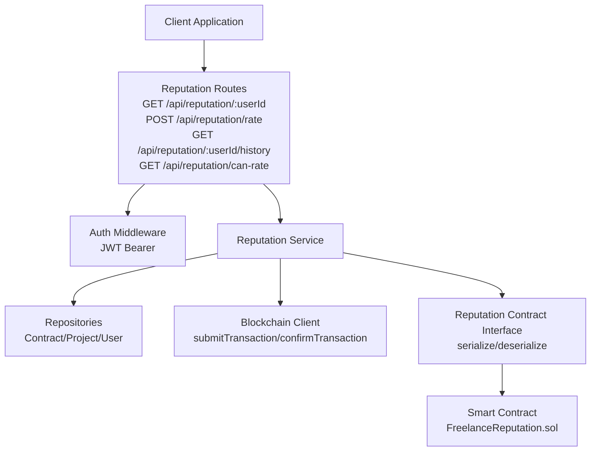
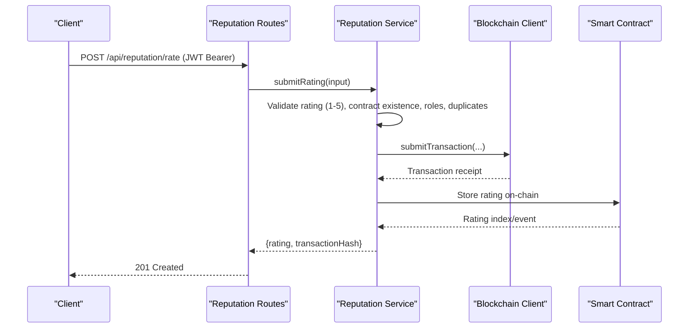
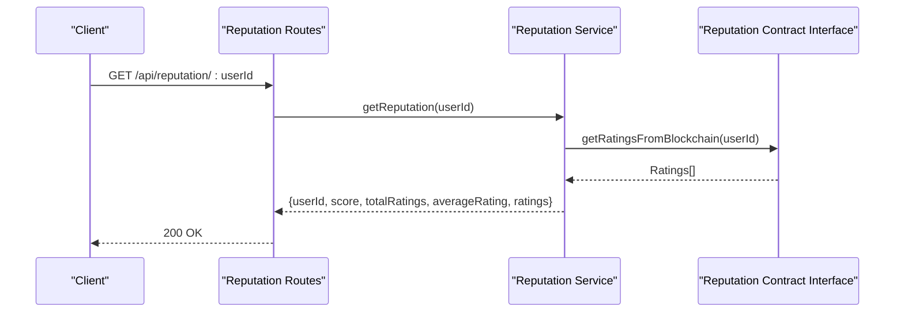
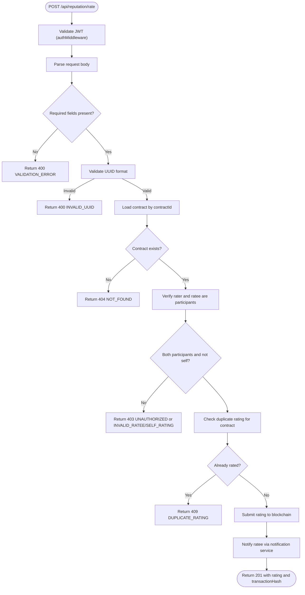
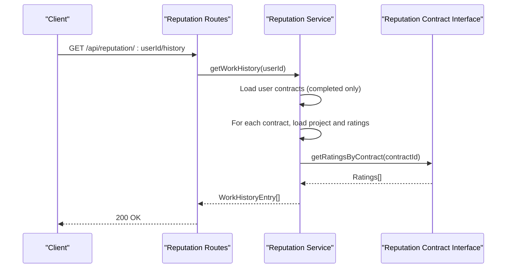
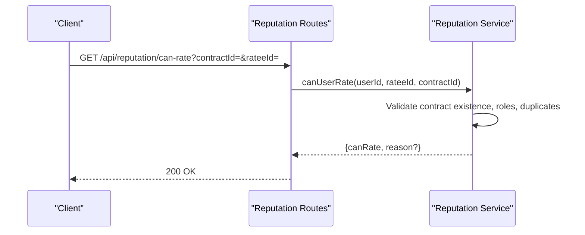
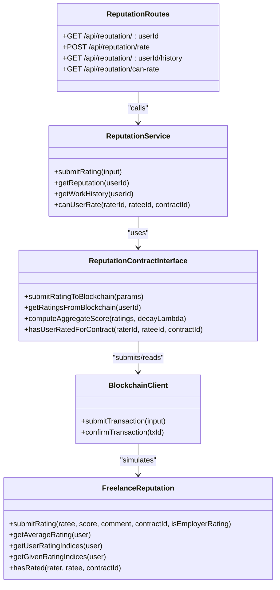
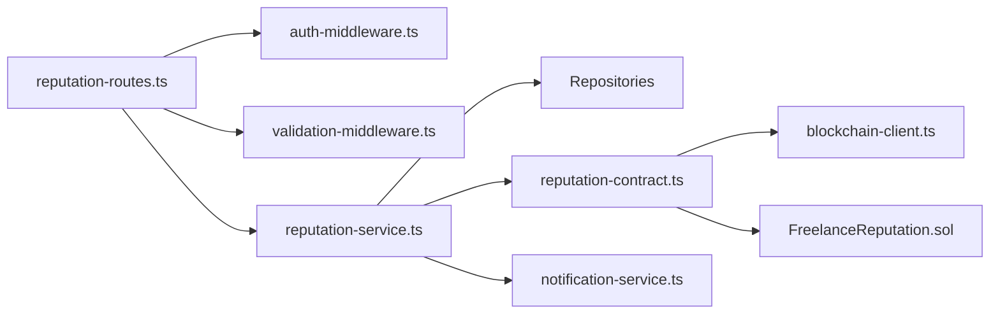

# Reputation API

<cite>
**Referenced Files in This Document**
- [reputation-routes.ts](file://src/routes/reputation-routes.ts)
- [reputation-service.ts](file://src/services/reputation-service.ts)
- [reputation-contract.ts](file://src/services/reputation-contract.ts)
- [FreelanceReputation.sol](file://contracts/FreelanceReputation.sol)
- [auth-middleware.ts](file://src/middleware/auth-middleware.ts)
- [validation-middleware.ts](file://src/middleware/validation-middleware.ts)
- [blockchain-client.ts](file://src/services/blockchain-client.ts)
- [notification-service.ts](file://src/services/notification-service.ts)
- [API-DOCUMENTATION.md](file://docs/API-DOCUMENTATION.md)
- [swagger.ts](file://src/config/swagger.ts)
</cite>

## Table of Contents
1. [Introduction](#introduction)
2. [Project Structure](#project-structure)
3. [Core Components](#core-components)
4. [Architecture Overview](#architecture-overview)
5. [Detailed Component Analysis](#detailed-component-analysis)
6. [Dependency Analysis](#dependency-analysis)
7. [Performance Considerations](#performance-considerations)
8. [Troubleshooting Guide](#troubleshooting-guide)
9. [Conclusion](#conclusion)
10. [Appendices](#appendices)

## Introduction
This document provides comprehensive API documentation for the reputation system endpoints in the FreelanceXchain platform. It covers:
- HTTP methods, URL patterns, request/response schemas
- Authentication requirements (JWT Bearer)
- Rating scale and constraints
- Endpoints for submitting ratings, retrieving reputation scores, and accessing work history
- Integration between API endpoints and blockchain smart contracts for immutable storage
- Client implementation examples for submitting ratings and displaying reputation

## Project Structure
The reputation system spans route handlers, service logic, blockchain integration, and smart contracts:
- Routes define the HTTP endpoints and request/response schemas
- Services encapsulate business logic, validation, and blockchain interactions
- Blockchain client simulates transaction submission and confirmation
- Smart contract defines on-chain storage and constraints

**Diagram sources**
- [reputation-routes.ts](file://src/routes/reputation-routes.ts#L1-L413)
- [auth-middleware.ts](file://src/middleware/auth-middleware.ts#L1-L70)
- [reputation-service.ts](file://src/services/reputation-service.ts#L1-L357)
- [reputation-contract.ts](file://src/services/reputation-contract.ts#L1-L288)
- [FreelanceReputation.sol](file://contracts/FreelanceReputation.sol#L1-L183)
- [blockchain-client.ts](file://src/services/blockchain-client.ts#L1-L293)

**Section sources**
- [reputation-routes.ts](file://src/routes/reputation-routes.ts#L1-L413)
- [swagger.ts](file://src/config/swagger.ts#L1-L233)

## Core Components
- Reputation Routes: Define endpoints, authentication, and response schemas
- Reputation Service: Validates inputs, enforces constraints, computes reputation, and orchestrates blockchain interactions
- Reputation Contract Interface: Serializes/deserializes ratings and interacts with blockchain client
- Smart Contract: On-chain storage of ratings with constraints and events
- Auth Middleware: Enforces JWT Bearer authentication
- Validation Middleware: Validates UUID parameters
- Blockchain Client: Simulates transaction lifecycle
- Notification Service: Notifies users upon receiving ratings

**Section sources**
- [reputation-routes.ts](file://src/routes/reputation-routes.ts#L1-L413)
- [reputation-service.ts](file://src/services/reputation-service.ts#L1-L357)
- [reputation-contract.ts](file://src/services/reputation-contract.ts#L1-L288)
- [FreelanceReputation.sol](file://contracts/FreelanceReputation.sol#L1-L183)
- [auth-middleware.ts](file://src/middleware/auth-middleware.ts#L1-L70)
- [validation-middleware.ts](file://src/middleware/validation-middleware.ts#L770-L814)
- [blockchain-client.ts](file://src/services/blockchain-client.ts#L1-L293)
- [notification-service.ts](file://src/services/notification-service.ts#L302-L316)

## Architecture Overview
The reputation API follows a layered architecture:
- HTTP Layer: Routes handle requests and responses
- Service Layer: Business logic, validation, and orchestration
- Blockchain Layer: Transaction submission and confirmation
- Smart Contract Layer: Immutable on-chain storage

**Diagram sources**
- [reputation-routes.ts](file://src/routes/reputation-routes.ts#L151-L272)
- [reputation-service.ts](file://src/services/reputation-service.ts#L76-L180)
- [reputation-contract.ts](file://src/services/reputation-contract.ts#L91-L149)
- [blockchain-client.ts](file://src/services/blockchain-client.ts#L131-L206)
- [FreelanceReputation.sol](file://contracts/FreelanceReputation.sol#L64-L106)

## Detailed Component Analysis

### Endpoint: GET /api/reputation/:userId
- Purpose: Retrieve a user’s reputation score and ratings from the blockchain
- Authentication: None (public endpoint)
- Path Parameters:
  - userId: UUID (validated by middleware)
- Response Schema:
  - userId: string (UUID)
  - score: number (weighted average with time decay)
  - totalRatings: integer
  - averageRating: number (simple average without time decay)
  - ratings: array of BlockchainRating
- Error Responses:
  - 400: Invalid UUID format
  - 404: User not found (service returns error)

**Diagram sources**
- [reputation-routes.ts](file://src/routes/reputation-routes.ts#L96-L149)
- [reputation-service.ts](file://src/services/reputation-service.ts#L188-L213)
- [reputation-contract.ts](file://src/services/reputation-contract.ts#L155-L166)

**Section sources**
- [reputation-routes.ts](file://src/routes/reputation-routes.ts#L96-L149)
- [reputation-service.ts](file://src/services/reputation-service.ts#L188-L213)
- [reputation-contract.ts](file://src/services/reputation-contract.ts#L155-L166)

### Endpoint: POST /api/reputation/rate
- Purpose: Submit a rating for another user after contract completion
- Authentication: Required (JWT Bearer)
- Request Body Schema (RatingInput):
  - contractId: string (UUID)
  - rateeId: string (UUID)
  - rating: integer (1-5)
  - comment: string (optional)
- Response Schema:
  - rating: BlockchainRating
  - transactionHash: string
- Constraints and Validation:
  - Only contract participants can submit ratings
  - Ratee must be a contract participant
  - Cannot rate self
  - Duplicate rating per contract is prevented
  - Rating must be integer between 1 and 5
- Error Responses:
  - 400: Validation error (missing fields, invalid rating, invalid UUID)
  - 401: Unauthorized (missing/invalid JWT)
  - 403: Unauthorized (not a contract participant)
  - 404: Contract not found
  - 409: Duplicate rating

**Diagram sources**
- [reputation-routes.ts](file://src/routes/reputation-routes.ts#L151-L272)
- [auth-middleware.ts](file://src/middleware/auth-middleware.ts#L25-L70)
- [reputation-service.ts](file://src/services/reputation-service.ts#L76-L180)
- [reputation-contract.ts](file://src/services/reputation-contract.ts#L91-L149)
- [blockchain-client.ts](file://src/services/blockchain-client.ts#L131-L206)
- [notification-service.ts](file://src/services/notification-service.ts#L302-L316)

**Section sources**
- [reputation-routes.ts](file://src/routes/reputation-routes.ts#L151-L272)
- [auth-middleware.ts](file://src/middleware/auth-middleware.ts#L25-L70)
- [reputation-service.ts](file://src/services/reputation-service.ts#L76-L180)
- [reputation-contract.ts](file://src/services/reputation-contract.ts#L91-L149)
- [blockchain-client.ts](file://src/services/blockchain-client.ts#L131-L206)
- [notification-service.ts](file://src/services/notification-service.ts#L302-L316)

### Endpoint: GET /api/reputation/:userId/history
- Purpose: Retrieve work history for a user including completed contracts and ratings
- Authentication: None (public endpoint)
- Path Parameters:
  - userId: UUID (validated by middleware)
- Response Schema: Array of WorkHistoryEntry
  - contractId: string (UUID)
  - projectId: string (UUID)
  - projectTitle: string
  - role: enum ["freelancer","employer"]
  - completedAt: string (ISO 8601)
  - rating?: integer (1-5)
  - ratingComment?: string
- Error Responses:
  - 400: Invalid UUID format
  - 404: User not found (service returns error)

**Diagram sources**
- [reputation-routes.ts](file://src/routes/reputation-routes.ts#L275-L330)
- [reputation-service.ts](file://src/services/reputation-service.ts#L220-L269)
- [reputation-contract.ts](file://src/services/reputation-contract.ts#L193-L203)

**Section sources**
- [reputation-routes.ts](file://src/routes/reputation-routes.ts#L275-L330)
- [reputation-service.ts](file://src/services/reputation-service.ts#L220-L269)
- [reputation-contract.ts](file://src/services/reputation-contract.ts#L193-L203)

### Endpoint: GET /api/reputation/can-rate
- Purpose: Check if the authenticated user can rate another user for a specific contract
- Authentication: Required (JWT Bearer)
- Query Parameters:
  - contractId: string (UUID)
  - rateeId: string (UUID)
- Response Schema:
  - canRate: boolean
  - reason?: string (present when false)
- Error Responses:
  - 400: Validation error (missing parameters)
  - 401: Unauthorized (missing/invalid JWT)

**Diagram sources**
- [reputation-routes.ts](file://src/routes/reputation-routes.ts#L332-L410)
- [reputation-service.ts](file://src/services/reputation-service.ts#L301-L357)

**Section sources**
- [reputation-routes.ts](file://src/routes/reputation-routes.ts#L332-L410)
- [reputation-service.ts](file://src/services/reputation-service.ts#L301-L357)

### Rating Scale and Constraints
- Rating Scale: Integer from 1 to 5
- Who can rate whom:
  - Only contract participants can submit ratings
  - Ratee must be a participant in the same contract
  - Users cannot rate themselves
  - Duplicate rating per contract is prevented
- Additional constraints enforced by smart contract:
  - Cannot rate zero address
  - Score must be between 1 and 5
  - Contract ID required
  - Duplicate rating per contract prevented

**Section sources**
- [reputation-service.ts](file://src/services/reputation-service.ts#L76-L180)
- [FreelanceReputation.sol](file://contracts/FreelanceReputation.sol#L64-L106)

### Authentication Requirements (JWT)
- All protected endpoints require a Bearer token in the Authorization header:
  - Authorization: Bearer <access_token>
- Protected endpoints:
  - POST /api/reputation/rate
  - GET /api/reputation/can-rate
- Auth middleware validates:
  - Presence of Authorization header
  - Format "Bearer <token>"
  - Token validity and expiration

**Section sources**
- [swagger.ts](file://src/config/swagger.ts#L22-L28)
- [API-DOCUMENTATION.md](file://docs/API-DOCUMENTATION.md#L7-L14)
- [auth-middleware.ts](file://src/middleware/auth-middleware.ts#L25-L70)

### Integration with Blockchain Smart Contracts
- Submission flow:
  - Route handler calls service
  - Service validates and calls blockchain client to submit transaction
  - Blockchain client simulates transaction submission and confirmation
  - Service stores serialized rating and returns transaction hash
- Retrieval flow:
  - Service retrieves ratings from blockchain interface
  - Aggregation uses time decay weighting
- Smart contract responsibilities:
  - Enforce rating constraints
  - Store ratings immutably
  - Emit events on rating submission
  - Provide getters for aggregates and indices

**Diagram sources**
- [reputation-routes.ts](file://src/routes/reputation-routes.ts#L1-L413)
- [reputation-service.ts](file://src/services/reputation-service.ts#L1-L357)
- [reputation-contract.ts](file://src/services/reputation-contract.ts#L1-L288)
- [blockchain-client.ts](file://src/services/blockchain-client.ts#L131-L206)
- [FreelanceReputation.sol](file://contracts/FreelanceReputation.sol#L64-L106)

**Section sources**
- [reputation-contract.ts](file://src/services/reputation-contract.ts#L91-L149)
- [blockchain-client.ts](file://src/services/blockchain-client.ts#L131-L206)
- [FreelanceReputation.sol](file://contracts/FreelanceReputation.sol#L64-L106)

### Client Implementation Examples

#### Example 1: Submit a rating with comment after contract completion
- Steps:
  - Authenticate and obtain a JWT
  - Call POST /api/reputation/rate with:
    - contractId: UUID of the completed contract
    - rateeId: UUID of the user being rated
    - rating: integer 1-5
    - comment: optional string
  - Handle response containing the stored rating and transactionHash
- Notes:
  - Ensure the authenticated user is a participant in the contract
  - Ensure the ratee is a participant in the contract
  - Ensure the rating is not a duplicate for the contract

**Section sources**
- [reputation-routes.ts](file://src/routes/reputation-routes.ts#L151-L272)
- [reputation-service.ts](file://src/services/reputation-service.ts#L76-L180)

#### Example 2: Retrieve a user's reputation score with blockchain ratings
- Steps:
  - Call GET /api/reputation/:userId
  - Use the returned score (weighted average with time decay) and ratings array
- Notes:
  - The ratings array contains blockchain-stored ratings with timestamps and comments

**Section sources**
- [reputation-routes.ts](file://src/routes/reputation-routes.ts#L96-L149)
- [reputation-service.ts](file://src/services/reputation-service.ts#L188-L213)
- [reputation-contract.ts](file://src/services/reputation-contract.ts#L155-L166)

#### Example 3: View work history with project details
- Steps:
  - Call GET /api/reputation/:userId/history
  - Iterate entries to show:
    - Project title
    - Role (freelancer or employer)
    - Completed date
    - Rating and comment (if available)
- Notes:
  - Only completed contracts are included
  - Ratings are fetched per contract

**Section sources**
- [reputation-routes.ts](file://src/routes/reputation-routes.ts#L275-L330)
- [reputation-service.ts](file://src/services/reputation-service.ts#L220-L269)

## Dependency Analysis
- Routes depend on:
  - Auth middleware for protected endpoints
  - Validation middleware for UUID parameters
  - Reputation service for business logic
- Reputation service depends on:
  - Repositories for contract/project/user data
  - Reputation contract interface for blockchain operations
  - Notification service for user notifications
- Reputation contract interface depends on:
  - Blockchain client for transaction submission/confirmation
  - In-memory store to simulate blockchain storage
- Smart contract defines:
  - Immutable storage and constraints
  - Events for rating submissions

**Diagram sources**
- [reputation-routes.ts](file://src/routes/reputation-routes.ts#L1-L413)
- [auth-middleware.ts](file://src/middleware/auth-middleware.ts#L1-L70)
- [validation-middleware.ts](file://src/middleware/validation-middleware.ts#L770-L814)
- [reputation-service.ts](file://src/services/reputation-service.ts#L1-L357)
- [reputation-contract.ts](file://src/services/reputation-contract.ts#L1-L288)
- [blockchain-client.ts](file://src/services/blockchain-client.ts#L1-L293)
- [FreelanceReputation.sol](file://contracts/FreelanceReputation.sol#L1-L183)
- [notification-service.ts](file://src/services/notification-service.ts#L302-L316)

**Section sources**
- [reputation-routes.ts](file://src/routes/reputation-routes.ts#L1-L413)
- [reputation-service.ts](file://src/services/reputation-service.ts#L1-L357)
- [reputation-contract.ts](file://src/services/reputation-contract.ts#L1-L288)
- [blockchain-client.ts](file://src/services/blockchain-client.ts#L1-L293)
- [FreelanceReputation.sol](file://contracts/FreelanceReputation.sol#L1-L183)
- [auth-middleware.ts](file://src/middleware/auth-middleware.ts#L1-L70)
- [validation-middleware.ts](file://src/middleware/validation-middleware.ts#L770-L814)
- [notification-service.ts](file://src/services/notification-service.ts#L302-L316)

## Performance Considerations
- Time decay computation: Weighted average calculation scales linearly with the number of ratings per user
- Blockchain simulation: In-memory store and simulated confirmation add minimal overhead
- Recommendations:
  - Cache frequently accessed reputation scores for popular users
  - Paginate work history for users with many contracts
  - Use efficient sorting and filtering in repositories

[No sources needed since this section provides general guidance]

## Troubleshooting Guide
Common issues and resolutions:
- 400 Validation Error:
  - Missing required fields or invalid UUID format
  - Fix: Ensure contractId, rateeId, and rating are provided and valid UUIDs
- 401 Unauthorized:
  - Missing or invalid JWT
  - Fix: Include Authorization: Bearer <token> header
- 403 Unauthorized:
  - Not a contract participant or attempting self-rating
  - Fix: Verify user roles in the contract and ensure raterId != rateeId
- 404 Not Found:
  - Contract not found
  - Fix: Verify contractId exists
- 409 Conflict (Duplicate Rating):
  - Already rated for this contract
  - Fix: Do not submit duplicate ratings

**Section sources**
- [reputation-routes.ts](file://src/routes/reputation-routes.ts#L151-L272)
- [reputation-service.ts](file://src/services/reputation-service.ts#L76-L180)

## Conclusion
The reputation system provides secure, immutable rating storage integrated with blockchain technology. The API ensures proper authentication, strict validation, and clear constraints on who can rate whom. Clients can submit ratings, retrieve reputation scores with time-decayed weighting, and view work histories with project details.

[No sources needed since this section summarizes without analyzing specific files]

## Appendices

### API Definitions

- Base URL: http://localhost:3000/api
- Interactive Docs: http://localhost:3000/api-docs
- Authentication: Bearer JWT

Endpoints:
- GET /api/reputation/:userId
  - Description: Get user reputation score and ratings
  - Response: ReputationScore
- POST /api/reputation/rate
  - Description: Submit a rating for another user after contract completion
  - Request: RatingInput
  - Response: { rating: BlockchainRating, transactionHash: string }
- GET /api/reputation/:userId/history
  - Description: Get work history for a user
  - Response: Array of WorkHistoryEntry
- GET /api/reputation/can-rate
  - Description: Check if authenticated user can rate another user for a contract
  - Query: contractId, rateeId
  - Response: { canRate: boolean, reason?: string }

**Section sources**
- [API-DOCUMENTATION.md](file://docs/API-DOCUMENTATION.md#L395-L438)
- [swagger.ts](file://src/config/swagger.ts#L22-L28)
- [reputation-routes.ts](file://src/routes/reputation-routes.ts#L96-L410)

### Data Models

- RatingInput
  - contractId: string (UUID)
  - rateeId: string (UUID)
  - rating: integer (1-5)
  - comment?: string

- BlockchainRating
  - id: string (UUID)
  - contractId: string (UUID)
  - raterId: string (UUID)
  - rateeId: string (UUID)
  - rating: integer (1-5)
  - comment?: string
  - timestamp: integer
  - transactionHash: string

- ReputationScore
  - userId: string (UUID)
  - score: number (time-decayed weighted average)
  - totalRatings: integer
  - averageRating: number (simple average)
  - ratings: array of BlockchainRating

- WorkHistoryEntry
  - contractId: string (UUID)
  - projectId: string (UUID)
  - projectTitle: string
  - role: enum ["freelancer","employer"]
  - completedAt: string (ISO 8601)
  - rating?: integer (1-5)
  - ratingComment?: string

**Section sources**
- [reputation-routes.ts](file://src/routes/reputation-routes.ts#L13-L93)
- [reputation-service.ts](file://src/services/reputation-service.ts#L23-L51)
- [reputation-contract.ts](file://src/services/reputation-contract.ts#L15-L47)