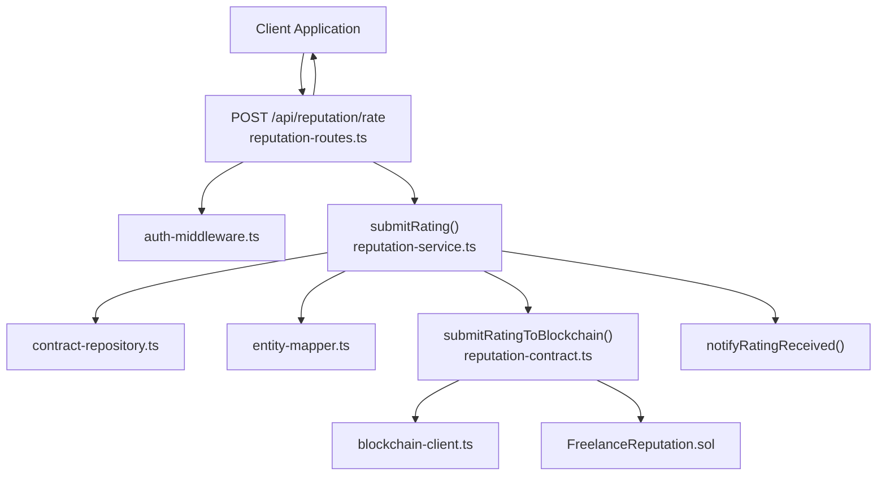
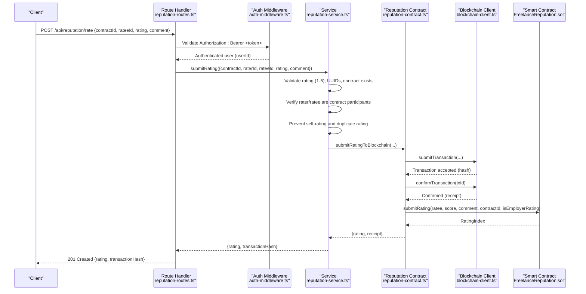
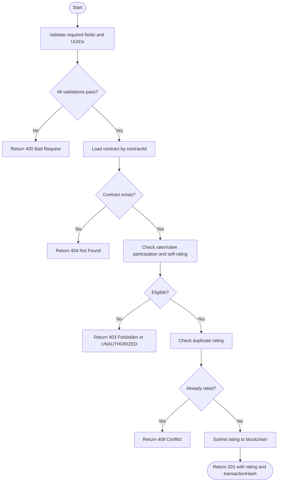
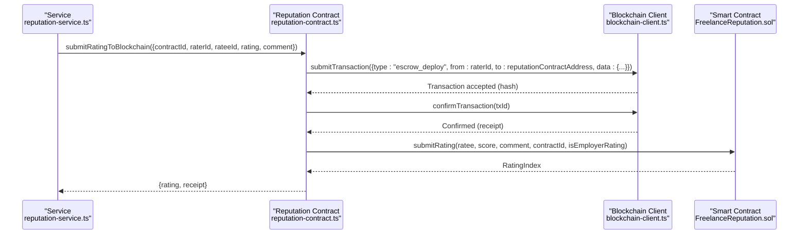
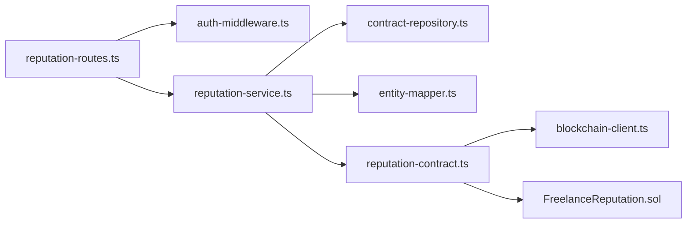

# Submit Rating

<cite>
**Referenced Files in This Document**
- [reputation-routes.ts](file://src/routes/reputation-routes.ts)
- [reputation-service.ts](file://src/services/reputation-service.ts)
- [reputation-contract.ts](file://src/services/reputation-contract.ts)
- [blockchain-client.ts](file://src/services/blockchain-client.ts)
- [auth-middleware.ts](file://src/middleware/auth-middleware.ts)
- [contract-repository.ts](file://src/repositories/contract-repository.ts)
- [entity-mapper.ts](file://src/utils/entity-mapper.ts)
- [FreelanceReputation.sol](file://contracts/FreelanceReputation.sol)
- [API-DOCUMENTATION.md](file://docs/API-DOCUMENTATION.md)
</cite>

## Table of Contents
1. [Introduction](#introduction)
2. [Project Structure](#project-structure)
3. [Core Components](#core-components)
4. [Architecture Overview](#architecture-overview)
5. [Detailed Component Analysis](#detailed-component-analysis)
6. [Dependency Analysis](#dependency-analysis)
7. [Performance Considerations](#performance-considerations)
8. [Troubleshooting Guide](#troubleshooting-guide)
9. [Conclusion](#conclusion)
10. [Appendices](#appendices)

## Introduction
This document provides API documentation for the rating submission endpoint in the FreelanceXchain reputation system. It covers the POST /api/reputation/rate endpoint, including JWT authentication, request body schema, validation rules, and the business logic flow. It also explains how the system integrates with the FreelanceReputation.sol smart contract via the reputation-service to store ratings immutably on-chain, and how blockchain transaction confirmation works. Guidance is included for client applications to handle transaction confirmation and user feedback.

## Project Structure
The rating submission flow spans the route handler, service layer, blockchain integration, and smart contract. The following diagram shows the high-level structure and interactions.

**Diagram sources**
- [reputation-routes.ts](file://src/routes/reputation-routes.ts#L188-L272)
- [auth-middleware.ts](file://src/middleware/auth-middleware.ts#L25-L70)
- [reputation-service.ts](file://src/services/reputation-service.ts#L76-L180)
- [contract-repository.ts](file://src/repositories/contract-repository.ts#L24-L31)
- [entity-mapper.ts](file://src/utils/entity-mapper.ts#L282-L310)
- [reputation-contract.ts](file://src/services/reputation-contract.ts#L91-L149)
- [blockchain-client.ts](file://src/services/blockchain-client.ts#L131-L209)
- [FreelanceReputation.sol](file://contracts/FreelanceReputation.sol#L64-L106)

**Section sources**
- [reputation-routes.ts](file://src/routes/reputation-routes.ts#L188-L272)
- [API-DOCUMENTATION.md](file://docs/API-DOCUMENTATION.md#L1-L20)

## Core Components
- Route handler: Validates JWT, parses request body, performs validation, and delegates to the service.
- Service: Enforces business rules (contract existence, eligibility, duplicate prevention), submits to blockchain, and notifies the ratee.
- Blockchain integration: Submits a transaction, confirms it, and stores a local representation of the rating.
- Smart contract: Enforces on-chain constraints and emits events.

**Section sources**
- [reputation-routes.ts](file://src/routes/reputation-routes.ts#L188-L272)
- [reputation-service.ts](file://src/services/reputation-service.ts#L76-L180)
- [reputation-contract.ts](file://src/services/reputation-contract.ts#L91-L149)
- [blockchain-client.ts](file://src/services/blockchain-client.ts#L131-L209)
- [FreelanceReputation.sol](file://contracts/FreelanceReputation.sol#L64-L106)

## Architecture Overview
The rating submission follows a layered architecture:
- Presentation: Express route validates JWT and request payload.
- Application: Service enforces business rules and orchestrates blockchain submission.
- Persistence: Local in-memory blockchain store simulates on-chain storage during development.
- Consensus: Smart contract enforces immutability and uniqueness.

**Diagram sources**
- [reputation-routes.ts](file://src/routes/reputation-routes.ts#L188-L272)
- [auth-middleware.ts](file://src/middleware/auth-middleware.ts#L25-L70)
- [reputation-service.ts](file://src/services/reputation-service.ts#L76-L180)
- [reputation-contract.ts](file://src/services/reputation-contract.ts#L91-L149)
- [blockchain-client.ts](file://src/services/blockchain-client.ts#L131-L209)
- [FreelanceReputation.sol](file://contracts/FreelanceReputation.sol#L64-L106)

## Detailed Component Analysis

### Endpoint Definition
- Method: POST
- Path: /api/reputation/rate
- Security: Requires Bearer token JWT
- Request body schema:
  - contractId: string (UUID)
  - rateeId: string (UUID)
  - rating: integer (1-5)
  - comment: string (optional)
- Responses:
  - 201 Created: { rating: BlockchainRating, transactionHash: string }
  - 400 Bad Request: Validation errors (invalid rating, missing fields, invalid UUID)
  - 401 Unauthorized: Missing/invalid token
  - 403 Forbidden: Unauthorized (not a contract participant)
  - 404 Not Found: Contract not found
  - 409 Conflict: Duplicate rating

**Section sources**
- [reputation-routes.ts](file://src/routes/reputation-routes.ts#L151-L187)
- [reputation-routes.ts](file://src/routes/reputation-routes.ts#L188-L272)
- [API-DOCUMENTATION.md](file://docs/API-DOCUMENTATION.md#L1-L20)

### Authentication and Authorization
- The route uses auth-middleware to extract and validate the Bearer token.
- On success, the authenticated user’s userId is attached to the request and used as raterId.
- On failure, the route responds with 401 Unauthorized.

**Section sources**
- [auth-middleware.ts](file://src/middleware/auth-middleware.ts#L25-L70)
- [reputation-routes.ts](file://src/routes/reputation-routes.ts#L188-L206)

### Request Validation
- Required fields: contractId, rateeId, rating.
- UUID validation: Both contractId and rateeId must be valid UUIDs.
- Rating value: Must be an integer between 1 and 5.
- On validation failure, the route returns 400 with details.

**Section sources**
- [reputation-routes.ts](file://src/routes/reputation-routes.ts#L208-L247)

### Business Logic Flow
- Contract existence: Fetch contract by contractId; return 404 if not found.
- Eligibility checks:
  - raterId must be either freelancerId or employerId in the contract.
  - rateeId must be a contract participant.
  - raterId must not equal rateeId (self-rating prohibited).
- Duplicate prevention: Check if a rating already exists for the rater/ratee/contract combination.
- Blockchain submission: If all checks pass, submit rating to the smart contract and return the receipt’s transactionHash along with the rating.

**Diagram sources**
- [reputation-routes.ts](file://src/routes/reputation-routes.ts#L188-L272)
- [reputation-service.ts](file://src/services/reputation-service.ts#L76-L180)
- [contract-repository.ts](file://src/repositories/contract-repository.ts#L24-L31)

**Section sources**
- [reputation-service.ts](file://src/services/reputation-service.ts#L76-L180)

### Blockchain Integration and Smart Contract
- The service calls submitRatingToBlockchain with the rating parameters.
- The blockchain client simulates transaction submission and confirmation.
- The smart contract enforces:
  - Ratee address must be non-zero and not equal to rater.
  - Rating must be between 1 and 5.
  - ContractId must be non-empty.
  - Duplicate rating prevention using a composite key.
- The service returns the transactionHash from the receipt.

**Diagram sources**
- [reputation-contract.ts](file://src/services/reputation-contract.ts#L91-L149)
- [blockchain-client.ts](file://src/services/blockchain-client.ts#L131-L209)
- [FreelanceReputation.sol](file://contracts/FreelanceReputation.sol#L64-L106)

**Section sources**
- [reputation-contract.ts](file://src/services/reputation-contract.ts#L91-L149)
- [blockchain-client.ts](file://src/services/blockchain-client.ts#L131-L209)
- [FreelanceReputation.sol](file://contracts/FreelanceReputation.sol#L64-L106)

### Example: Freelancer Submits a 5-Star Rating with Comment After Contract Completion
- The route requires a Bearer token JWT in the Authorization header.
- The request body must include contractId, rateeId, rating (5), and an optional comment.
- The service verifies the contract exists, ensures the rater is a contract participant, prevents self-rating, and checks for duplicates.
- The service submits the rating to the smart contract and returns the rating and transactionHash.

Note: The repository simulates blockchain behavior. In production, replace the in-memory blockchain client with a real RPC connection.

**Section sources**
- [reputation-routes.ts](file://src/routes/reputation-routes.ts#L151-L187)
- [reputation-service.ts](file://src/services/reputation-service.ts#L76-L180)
- [FreelanceReputation.sol](file://contracts/FreelanceReputation.sol#L64-L106)

## Dependency Analysis
The following diagram shows the key dependencies among components involved in rating submission.

**Diagram sources**
- [reputation-routes.ts](file://src/routes/reputation-routes.ts#L188-L272)
- [auth-middleware.ts](file://src/middleware/auth-middleware.ts#L25-L70)
- [reputation-service.ts](file://src/services/reputation-service.ts#L76-L180)
- [contract-repository.ts](file://src/repositories/contract-repository.ts#L24-L31)
- [entity-mapper.ts](file://src/utils/entity-mapper.ts#L282-L310)
- [reputation-contract.ts](file://src/services/reputation-contract.ts#L91-L149)
- [blockchain-client.ts](file://src/services/blockchain-client.ts#L131-L209)
- [FreelanceReputation.sol](file://contracts/FreelanceReputation.sol#L64-L106)

**Section sources**
- [reputation-routes.ts](file://src/routes/reputation-routes.ts#L188-L272)
- [reputation-service.ts](file://src/services/reputation-service.ts#L76-L180)
- [reputation-contract.ts](file://src/services/reputation-contract.ts#L91-L149)
- [blockchain-client.ts](file://src/services/blockchain-client.ts#L131-L209)
- [FreelanceReputation.sol](file://contracts/FreelanceReputation.sol#L64-L106)

## Performance Considerations
- Transaction confirmation latency: The blockchain client simulates confirmation timing; in production, expect network latency and gas fees.
- Time decay computation: The service computes aggregate scores using time decay; this is efficient for small-to-medium datasets but consider caching for high-volume scenarios.
- Duplicate checks: The service performs a linear scan of stored ratings to detect duplicates; consider indexing or a dedicated duplicate-check function in production.

[No sources needed since this section provides general guidance]

## Troubleshooting Guide
Common error responses and their causes:
- 400 Bad Request
  - Missing required fields: contractId, rateeId, rating.
  - Invalid UUID format for contractId or rateeId.
  - Invalid rating value (non-integer or outside 1-5).
- 401 Unauthorized
  - Missing Authorization header or invalid Bearer token.
- 403 Forbidden
  - User is not a participant in the contract.
- 404 Not Found
  - Contract not found.
- 409 Conflict
  - Duplicate rating for the same rater/ratee/contract combination.
- Blockchain transaction failures
  - Transaction confirmation fails or smart contract reverts (e.g., duplicate rating, invalid parameters).

Client-side guidance:
- Show a loading indicator while awaiting the 201 response.
- On 400/409, display user-friendly messages indicating missing/invalid fields or duplicate rating.
- On 401, prompt the user to log in again.
- On 403/404, inform the user that they cannot rate or the contract was not found.
- For blockchain-related errors, retry after a delay or instruct the user to try again later.

**Section sources**
- [reputation-routes.ts](file://src/routes/reputation-routes.ts#L257-L271)
- [auth-middleware.ts](file://src/middleware/auth-middleware.ts#L25-L70)
- [reputation-service.ts](file://src/services/reputation-service.ts#L76-L180)
- [reputation-contract.ts](file://src/services/reputation-contract.ts#L91-L149)
- [blockchain-client.ts](file://src/services/blockchain-client.ts#L182-L239)
- [FreelanceReputation.sol](file://contracts/FreelanceReputation.sol#L64-L106)

## Conclusion
The rating submission endpoint enforces strict validation and eligibility rules, integrates with a smart contract to ensure immutable records, and returns a transaction hash for confirmation. Clients should handle various error responses gracefully and provide clear feedback to users. The current implementation simulates blockchain behavior; production deployments should connect to a real RPC endpoint.

[No sources needed since this section summarizes without analyzing specific files]

## Appendices

### API Definition
- Method: POST
- Path: /api/reputation/rate
- Security: Bearer token JWT
- Request body:
  - contractId: string (UUID)
  - rateeId: string (UUID)
  - rating: integer (1-5)
  - comment: string (optional)
- Responses:
  - 201 Created: { rating: BlockchainRating, transactionHash: string }
  - 400 Bad Request: Validation errors
  - 401 Unauthorized: Missing/invalid token
  - 403 Forbidden: Unauthorized (not a contract participant)
  - 404 Not Found: Contract not found
  - 409 Conflict: Duplicate rating

**Section sources**
- [reputation-routes.ts](file://src/routes/reputation-routes.ts#L151-L187)
- [reputation-routes.ts](file://src/routes/reputation-routes.ts#L188-L272)
- [API-DOCUMENTATION.md](file://docs/API-DOCUMENTATION.md#L1-L20)

### Smart Contract Constraints
- Ratee address must be non-zero and not equal to rater.
- Rating must be between 1 and 5.
- ContractId must be non-empty.
- Duplicate rating prevention using a composite key.

**Section sources**
- [FreelanceReputation.sol](file://contracts/FreelanceReputation.sol#L64-L106)