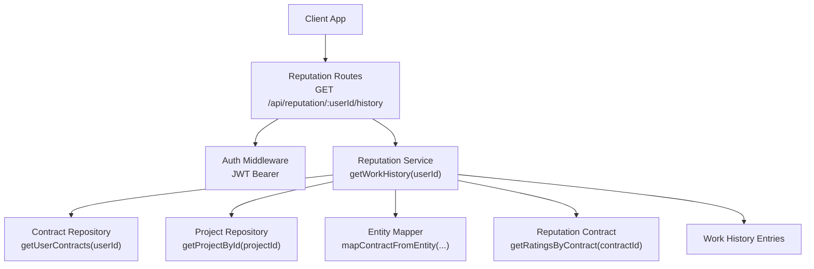
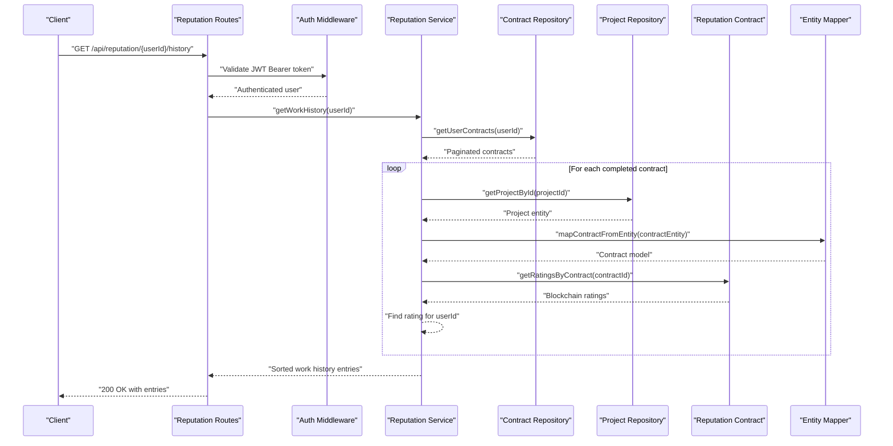
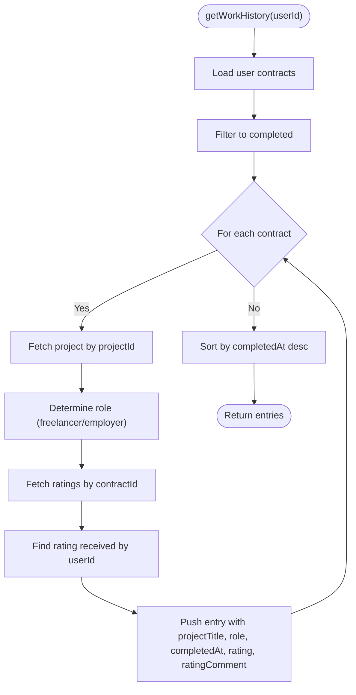
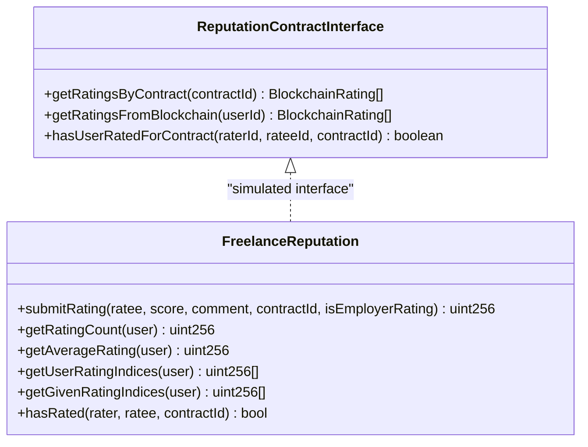
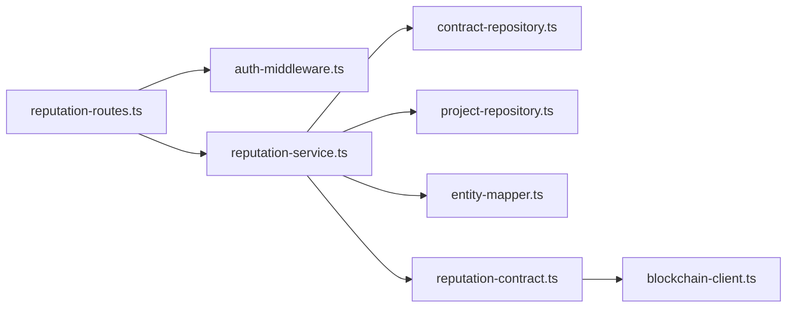

# Work History

<cite>
**Referenced Files in This Document**
- [reputation-routes.ts](file://src/routes/reputation-routes.ts)
- [reputation-service.ts](file://src/services/reputation-service.ts)
- [reputation-contract.ts](file://src/services/reputation-contract.ts)
- [contract-repository.ts](file://src/repositories/contract-repository.ts)
- [project-repository.ts](file://src/repositories/project-repository.ts)
- [entity-mapper.ts](file://src/utils/entity-mapper.ts)
- [auth-middleware.ts](file://src/middleware/auth-middleware.ts)
- [swagger.ts](file://src/config/swagger.ts)
- [API-DOCUMENTATION.md](file://docs/API-DOCUMENTATION.md)
- [FreelanceReputation.sol](file://contracts/FreelanceReputation.sol)
- [blockchain-client.ts](file://src/services/blockchain-client.ts)
</cite>

## Table of Contents
1. [Introduction](#introduction)
2. [Project Structure](#project-structure)
3. [Core Components](#core-components)
4. [Architecture Overview](#architecture-overview)
5. [Detailed Component Analysis](#detailed-component-analysis)
6. [Dependency Analysis](#dependency-analysis)
7. [Performance Considerations](#performance-considerations)
8. [Troubleshooting Guide](#troubleshooting-guide)
9. [Conclusion](#conclusion)
10. [Appendices](#appendices)

## Introduction
This document explains the work history retrieval endpoint for the FreelanceXchain platform. It covers:
- Endpoint definition and authentication via JWT
- How the service combines on-chain reputation data from the smart contract with off-chain project metadata from Supabase
- Response structure and enrichment fields
- Real-world example of a client reviewing a freelancer’s history
- Pagination and performance considerations
- Data consistency model and discrepancy handling

## Project Structure
The work history feature spans routing, service orchestration, repositories, and blockchain integration:
- Route handler for GET /api/reputation/:userId/history
- Service layer that aggregates contracts, projects, and ratings
- Repositories for contracts and projects
- Blockchain client and reputation contract interface
- Swagger/OpenAPI schema for the endpoint

**Diagram sources**
- [reputation-routes.ts](file://src/routes/reputation-routes.ts#L305-L330)
- [auth-middleware.ts](file://src/middleware/auth-middleware.ts#L25-L70)
- [reputation-service.ts](file://src/services/reputation-service.ts#L220-L269)
- [contract-repository.ts](file://src/repositories/contract-repository.ts#L116-L135)
- [project-repository.ts](file://src/repositories/project-repository.ts#L39-L41)
- [entity-mapper.ts](file://src/utils/entity-mapper.ts#L281-L310)
- [reputation-contract.ts](file://src/services/reputation-contract.ts#L190-L203)

**Section sources**
- [reputation-routes.ts](file://src/routes/reputation-routes.ts#L275-L330)
- [swagger.ts](file://src/config/swagger.ts#L21-L29)
- [API-DOCUMENTATION.md](file://docs/API-DOCUMENTATION.md#L432-L438)

## Core Components
- Route: Defines the GET /api/reputation/:userId/history endpoint, validates userId, and delegates to the service.
- Service: Loads user contracts, filters to completed, enriches with project metadata, and attaches ratings from the blockchain.
- Repositories: ContractRepository.getUserContracts and ProjectRepository.getProjectById.
- Blockchain: ReputationContract interface simulates on-chain storage and retrieval for ratings.
- Auth: JWT Bearer token validated by auth middleware.

Key responsibilities:
- Enforce authentication and authorization
- Retrieve and filter contracts by status
- Fetch project titles and timestamps
- Fetch ratings per contract and attach to entries
- Sort by completion date descending

**Section sources**
- [reputation-routes.ts](file://src/routes/reputation-routes.ts#L305-L330)
- [reputation-service.ts](file://src/services/reputation-service.ts#L220-L269)
- [contract-repository.ts](file://src/repositories/contract-repository.ts#L116-L135)
- [project-repository.ts](file://src/repositories/project-repository.ts#L39-L41)
- [reputation-contract.ts](file://src/services/reputation-contract.ts#L190-L203)
- [auth-middleware.ts](file://src/middleware/auth-middleware.ts#L25-L70)

## Architecture Overview
The work history pipeline integrates on-chain and off-chain data:

**Diagram sources**
- [reputation-routes.ts](file://src/routes/reputation-routes.ts#L305-L330)
- [auth-middleware.ts](file://src/middleware/auth-middleware.ts#L25-L70)
- [reputation-service.ts](file://src/services/reputation-service.ts#L220-L269)
- [contract-repository.ts](file://src/repositories/contract-repository.ts#L116-L135)
- [project-repository.ts](file://src/repositories/project-repository.ts#L39-L41)
- [entity-mapper.ts](file://src/utils/entity-mapper.ts#L281-L310)
- [reputation-contract.ts](file://src/services/reputation-contract.ts#L190-L203)

## Detailed Component Analysis

### Endpoint Definition and Authentication
- Endpoint: GET /api/reputation/:userId/history
- Path parameter: userId (validated as UUID)
- Authentication: Requires Authorization: Bearer <JWT>. The auth middleware validates the token and attaches user info to the request.
- Response: Array of WorkHistoryEntry objects.

Swagger/OpenAPI schema defines the WorkHistoryEntry shape and the endpoint’s security scheme.

**Section sources**
- [reputation-routes.ts](file://src/routes/reputation-routes.ts#L275-L330)
- [swagger.ts](file://src/config/swagger.ts#L21-L29)
- [API-DOCUMENTATION.md](file://docs/API-DOCUMENTATION.md#L432-L438)
- [auth-middleware.ts](file://src/middleware/auth-middleware.ts#L25-L70)

### Service Logic: getWorkHistory(userId)
- Load user contracts using ContractRepository.getUserContracts(userId).
- Filter to completed contracts.
- For each completed contract:
  - Determine role (freelancer or employer) based on userId.
  - Fetch project title via ProjectRepository.getProjectById(projectId).
  - Retrieve all ratings for the contract via getRatingsByContract(contractId).
  - Select the rating received by the user (rateeId === userId).
- Sort entries by completedAt descending.
- Return the enriched list.

**Diagram sources**
- [reputation-service.ts](file://src/services/reputation-service.ts#L220-L269)
- [contract-repository.ts](file://src/repositories/contract-repository.ts#L116-L135)
- [project-repository.ts](file://src/repositories/project-repository.ts#L39-L41)
- [reputation-contract.ts](file://src/services/reputation-contract.ts#L190-L203)

**Section sources**
- [reputation-service.ts](file://src/services/reputation-service.ts#L220-L269)

### On-chain Reputation Data Integration
- Ratings are retrieved per contract using getRatingsByContract(contractId).
- The service selects the rating where rateeId equals the queried userId.
- The blockchain interface simulates storage and retrieval; in production, this would call the FreelanceReputation.sol contract.

**Diagram sources**
- [reputation-contract.ts](file://src/services/reputation-contract.ts#L190-L203)
- [FreelanceReputation.sol](file://contracts/FreelanceReputation.sol#L64-L106)

**Section sources**
- [reputation-contract.ts](file://src/services/reputation-contract.ts#L190-L203)
- [FreelanceReputation.sol](file://contracts/FreelanceReputation.sol#L64-L106)

### Off-chain Project Metadata
- Project titles and statuses are fetched from Supabase via ProjectRepository.getProjectById(projectId).
- The entity mapper converts database entities to API models for consistent field names.

**Section sources**
- [project-repository.ts](file://src/repositories/project-repository.ts#L39-L41)
- [entity-mapper.ts](file://src/utils/entity-mapper.ts#L236-L249)

### Response Structure
Each WorkHistoryEntry includes:
- contractId: UUID of the contract
- projectId: UUID of the project
- projectTitle: String title of the project
- role: Enum 'freelancer' or 'employer'
- completedAt: ISO date-time string
- rating: Integer 1–5 (optional)
- ratingComment: String (optional)

Swagger schema and route documentation define these fields.

**Section sources**
- [reputation-routes.ts](file://src/routes/reputation-routes.ts#L56-L76)
- [API-DOCUMENTATION.md](file://docs/API-DOCUMENTATION.md#L432-L438)

### Real-world Example: Client Hiring Decision
Scenario:
- A client wants to hire a freelancer for a new project.
- The client opens the freelancer’s profile and navigates to the Work History tab.
- The client calls GET /api/reputation/:userId/history with a valid JWT.
- The system returns a list of past completed contracts, each with:
  - Project title
  - Completion date
  - Client’s rating and comment (if applicable)
  - The client’s role in the contract (employer)
- The client evaluates the history to decide whether to hire.

Outcome:
- The client sees a chronological list of completed projects, ratings, and comments, enabling informed decision-making.

**Section sources**
- [reputation-routes.ts](file://src/routes/reputation-routes.ts#L275-L330)
- [reputation-service.ts](file://src/services/reputation-service.ts#L220-L269)

### Filtering Parameters
Current endpoint:
- No query parameters are defined for filtering by project status or date range.
- The service filters contracts to completed only and sorts by completion date descending.

If future enhancements are introduced:
- Add query parameters for status and date range.
- Apply filters at the repository level (e.g., ContractRepository.getContractsByStatus and date range filters).
- Ensure pagination remains consistent.

**Section sources**
- [reputation-routes.ts](file://src/routes/reputation-routes.ts#L305-L330)
- [contract-repository.ts](file://src/repositories/contract-repository.ts#L95-L114)

## Dependency Analysis
High-level dependencies:
- Routes depend on auth middleware and reputation service.
- Service depends on repositories and reputation contract interface.
- Repositories depend on Supabase client and shared query options.
- Blockchain client provides transaction simulation and confirmation.

**Diagram sources**
- [reputation-routes.ts](file://src/routes/reputation-routes.ts#L305-L330)
- [auth-middleware.ts](file://src/middleware/auth-middleware.ts#L25-L70)
- [reputation-service.ts](file://src/services/reputation-service.ts#L220-L269)
- [contract-repository.ts](file://src/repositories/contract-repository.ts#L116-L135)
- [project-repository.ts](file://src/repositories/project-repository.ts#L39-L41)
- [entity-mapper.ts](file://src/utils/entity-mapper.ts#L281-L310)
- [reputation-contract.ts](file://src/services/reputation-contract.ts#L190-L203)
- [blockchain-client.ts](file://src/services/blockchain-client.ts#L131-L159)

**Section sources**
- [reputation-service.ts](file://src/services/reputation-service.ts#L220-L269)
- [contract-repository.ts](file://src/repositories/contract-repository.ts#L116-L135)
- [project-repository.ts](file://src/repositories/project-repository.ts#L39-L41)
- [reputation-contract.ts](file://src/services/reputation-contract.ts#L190-L203)
- [blockchain-client.ts](file://src/services/blockchain-client.ts#L131-L159)

## Performance Considerations
- Pagination:
  - ContractRepository.getUserContracts returns paginated results with hasMore and total. The service currently iterates all items; consider applying pagination limits upstream to reduce memory usage and response latency.
- Sorting:
  - Sorting by completedAt occurs in-memory after collecting entries. For large histories, consider sorting at the database level or limiting the number of entries returned.
- Network calls:
  - Each completed contract triggers a project metadata fetch and a blockchain ratings query. For very large histories, consider batching or caching project titles and ratings per contract.
- Blockchain latency:
  - The blockchain client simulates confirmation. In production, transaction confirmation adds latency; consider caching recent ratings or using a read replica for ratings.

Recommendations:
- Limit pageSize for getUserContracts and cap the number of returned entries.
- Cache project titles keyed by projectId to avoid repeated lookups.
- Cache per-contract ratings keyed by contractId to avoid repeated blockchain queries.
- Add optional query parameters for date range and status to reduce payload size.

**Section sources**
- [contract-repository.ts](file://src/repositories/contract-repository.ts#L116-L135)
- [reputation-service.ts](file://src/services/reputation-service.ts#L220-L269)
- [blockchain-client.ts](file://src/services/blockchain-client.ts#L182-L239)

## Troubleshooting Guide
Common issues and resolutions:
- Authentication failures:
  - Missing or invalid Authorization header: 401 Unauthorized.
  - Token expired or invalid: 401 Unauthorized with specific error code.
- Validation errors:
  - Missing or invalid userId: 400 with VALIDATION_ERROR.
- Not found:
  - If no contracts exist for the user, the service returns an empty array.
- Blockchain availability:
  - In simulation mode, transactions are confirmed immediately; in production, ensure RPC connectivity and handle confirmation timeouts.

Operational tips:
- Verify JWT token format: Bearer <token>.
- Confirm userId is a valid UUID.
- Check Supabase connectivity for project metadata.
- Monitor blockchain client availability and transaction confirmation status.

**Section sources**
- [auth-middleware.ts](file://src/middleware/auth-middleware.ts#L25-L70)
- [reputation-routes.ts](file://src/routes/reputation-routes.ts#L305-L330)
- [blockchain-client.ts](file://src/services/blockchain-client.ts#L288-L293)

## Conclusion
The work history endpoint provides clients with a comprehensive, time-ordered view of a freelancer’s completed projects, ratings, and comments. By combining on-chain reputation data with off-chain project metadata, the system delivers immutable, verifiable insights. Future enhancements should focus on pagination, caching, and optional filtering to improve performance and scalability.

## Appendices

### Endpoint Reference
- Method: GET
- Path: /api/reputation/:userId/history
- Security: Bearer JWT
- Path parameters:
  - userId: UUID
- Response: Array of WorkHistoryEntry
  - contractId: UUID
  - projectId: UUID
  - projectTitle: String
  - role: 'freelancer' | 'employer'
  - completedAt: ISO date-time
  - rating: Integer 1–5 (optional)
  - ratingComment: String (optional)

**Section sources**
- [reputation-routes.ts](file://src/routes/reputation-routes.ts#L275-L330)
- [swagger.ts](file://src/config/swagger.ts#L21-L29)
- [API-DOCUMENTATION.md](file://docs/API-DOCUMENTATION.md#L432-L438)