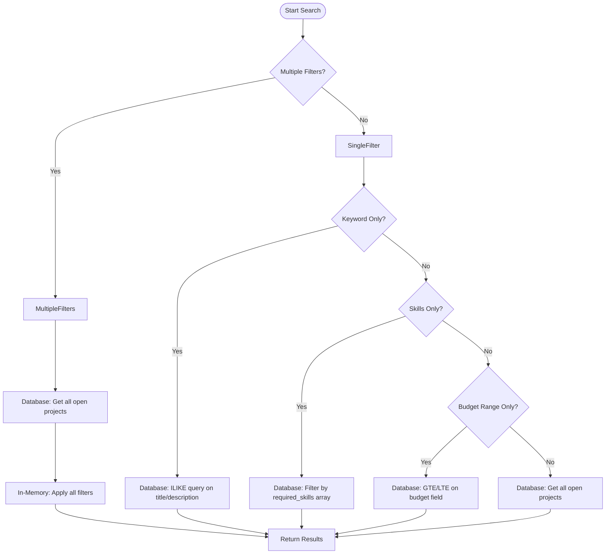
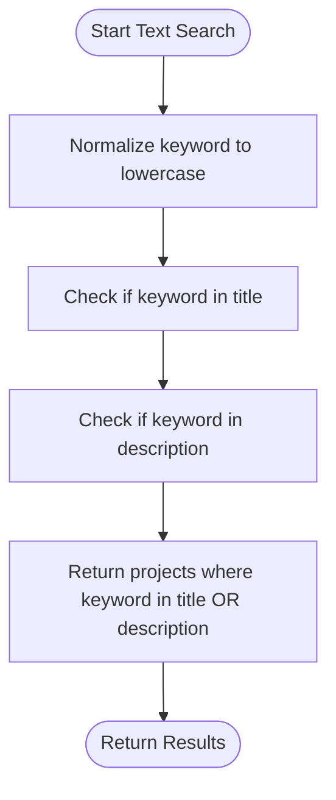
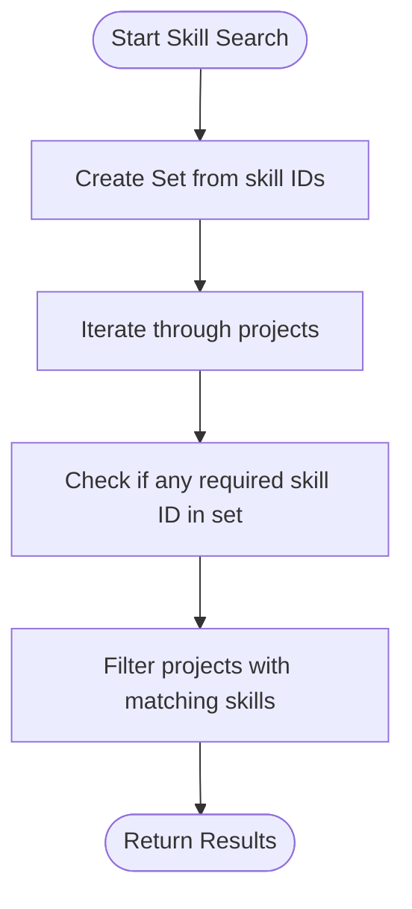
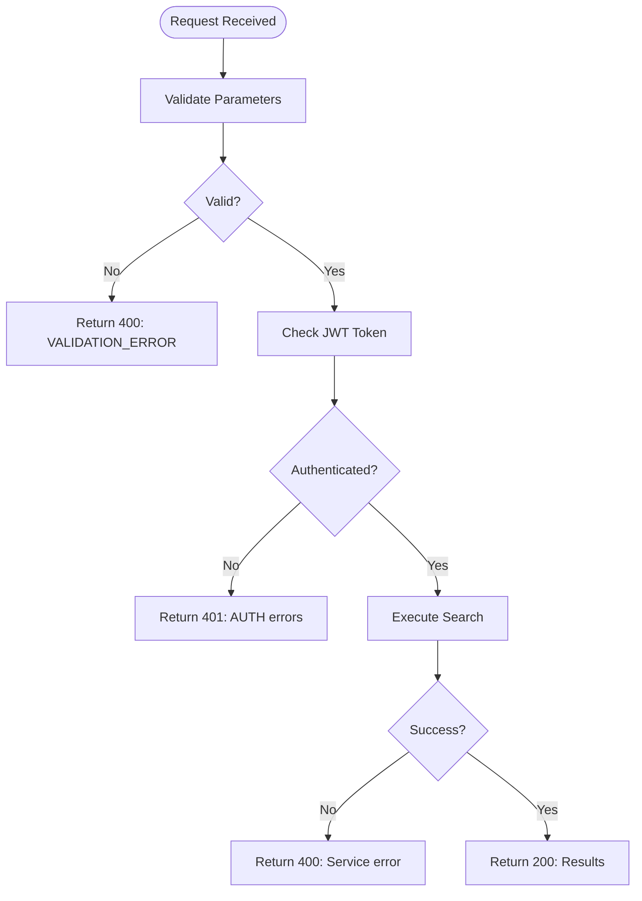
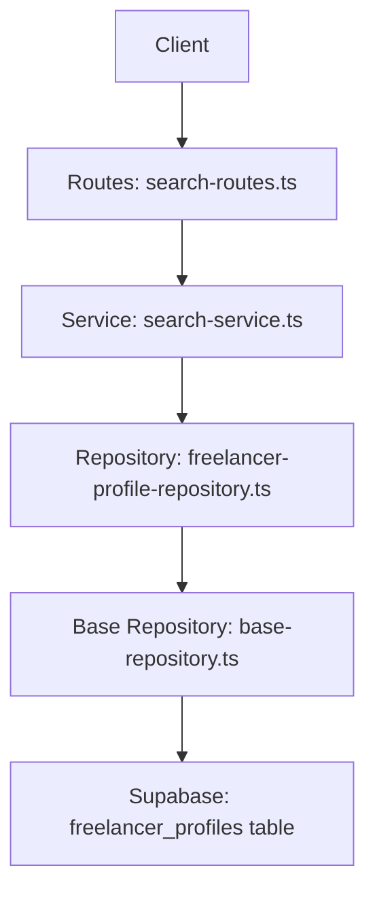
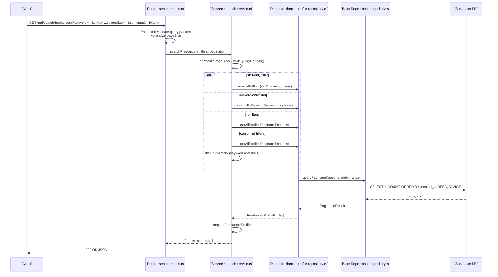
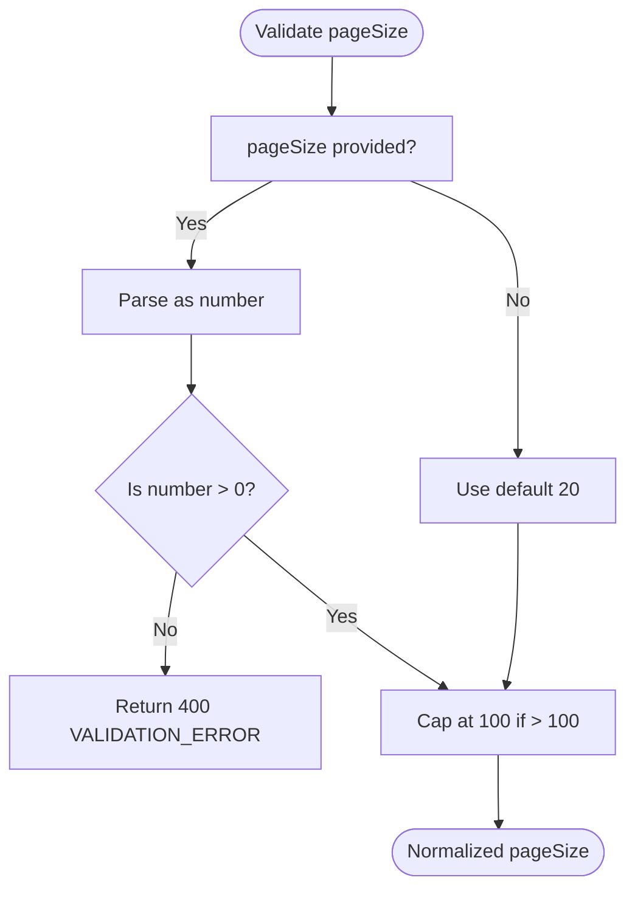
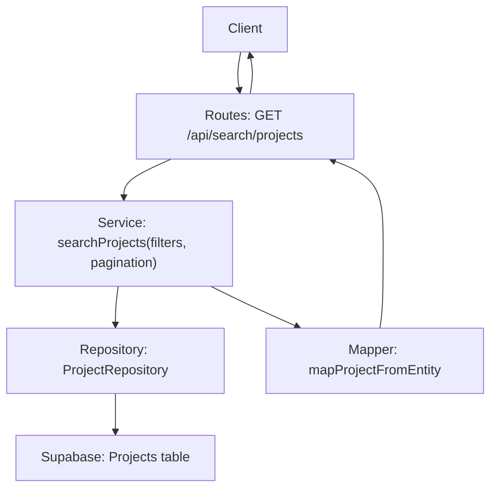
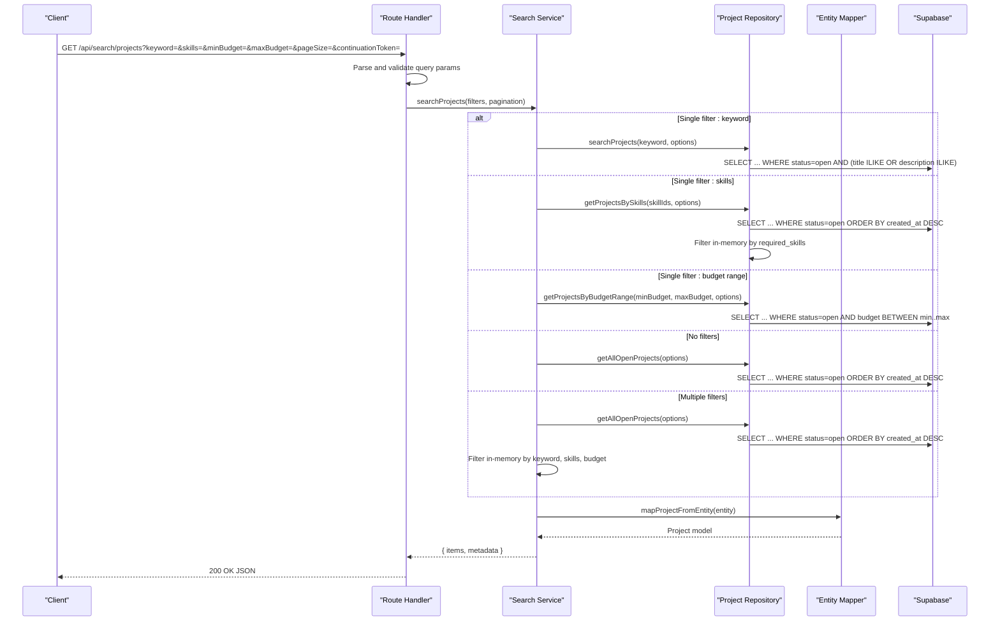
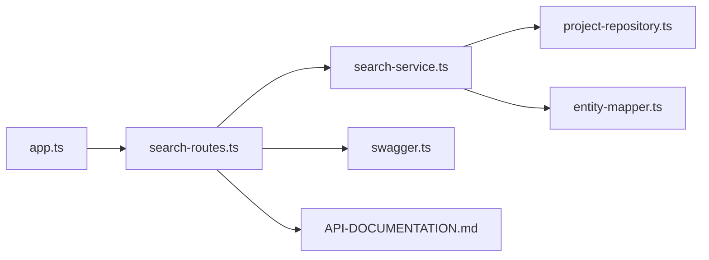

# Search API

<cite>
**Referenced Files in This Document**   
- [search-routes.ts](file://src/routes/search-routes.ts)
- [search-service.ts](file://src/services/search-service.ts)
- [project-repository.ts](file://src/repositories/project-repository.ts)
- [freelancer-profile-repository.ts](file://src/repositories/freelancer-profile-repository.ts)
- [entity-mapper.ts](file://src/utils/entity-mapper.ts)
- [validation-middleware.ts](file://src/middleware/validation-middleware.ts)
- [auth-middleware.ts](file://src/middleware/auth-middleware.ts)
</cite>

## Table of Contents
1. [Introduction](#introduction)
2. [Project Search Endpoint](#project-search-endpoint)
3. [Freelancer Search Endpoint](#freelancer-search-endpoint)
4. [Search Algorithms and Relevance Scoring](#search-algorithms-and-relevance-scoring)
5. [Client Implementation Examples](#client-implementation-examples)
6. [Performance Considerations](#performance-considerations)
7. [Error Handling](#error-handling)

## Introduction
The FreelanceXchain system provides robust search and discovery endpoints that enable users to find projects and freelancers based on various criteria. These endpoints support keyword search, skill-based filtering, budget range filtering, pagination, and sorting. The search functionality is designed to be efficient and scalable, with optimized database queries and in-memory filtering for complex search scenarios. All search endpoints require JWT authentication to ensure secure access to the platform's data.

**Section sources**
- [search-routes.ts](file://src/routes/search-routes.ts#L1-L267)
- [search-service.ts](file://src/services/search-service.ts#L1-L206)

## Project Search Endpoint

The project search endpoint allows users to search for projects using keyword, skill, and budget filters. This endpoint supports pagination through the `pageSize` and `continuationToken` parameters, enabling efficient retrieval of large datasets.

### HTTP Method and URL Pattern
```
GET /api/search/projects
```

### Authentication Requirements
This endpoint requires JWT authentication. The Authorization header must contain a valid Bearer token:
```
Authorization: Bearer <JWT_TOKEN>
```

### Query Parameters
| Parameter | Type | Required | Description | Example |
|---------|------|---------|-------------|---------|
| `keyword` | string | No | Search keyword for project title and description | "web development" |
| `skills` | string | No | Comma-separated skill IDs to filter projects | "123e4567-e89b-12d3-a456-426614174000,123e4567-e89b-12d3-a456-426614174001" |
| `minBudget` | number | No | Minimum budget filter (inclusive) | 1000 |
| `maxBudget` | number | No | Maximum budget filter (inclusive) | 5000 |
| `pageSize` | integer | No | Number of results per page (default: 20, max: 100) | 25 |
| `continuationToken` | string | No | Token for pagination (offset value) | "20" |

### Request Examples
**Search projects by keyword:**
```
GET /api/search/projects?keyword=web+development&pageSize=10
```

**Search projects by skills:**
```
GET /api/search/projects?skills=123e4567-e89b-12d3-a456-426614174000,123e4567-e89b-12d3-a456-426614174001&pageSize=15
```

**Search projects by budget range:**
```
GET /api/search/projects?minBudget=1000&maxBudget=5000&pageSize=20
```

**Search projects with multiple filters:**
```
GET /api/search/projects?keyword=mobile+app&skills=123e4567-e89b-12d3-a456-426614174002&minBudget=2000&maxBudget=8000&pageSize=25
```

### Response Schema
The response follows a standardized format with items and metadata:

```json
{
  "items": [
    {
      "id": "string",
      "employerId": "string",
      "title": "string",
      "description": "string",
      "requiredSkills": [
        {
          "skillId": "string",
          "skillName": "string",
          "categoryId": "string",
          "yearsOfExperience": "number"
        }
      ],
      "budget": "number",
      "deadline": "string",
      "status": "string",
      "milestones": [
        {
          "id": "string",
          "title": "string",
          "description": "string",
          "amount": "number",
          "dueDate": "string",
          "status": "string"
        }
      ],
      "createdAt": "string",
      "updatedAt": "string"
    }
  ],
  "metadata": {
    "pageSize": "integer",
    "hasMore": "boolean",
    "continuationToken": "string"
  }
}
```

### Response Example
```json
{
  "items": [
    {
      "id": "123e4567-e89b-12d3-a456-426614174000",
      "employerId": "123e4567-e89b-12d3-a456-426614174001",
      "title": "E-commerce Website Development",
      "description": "Build a responsive e-commerce website with payment integration",
      "requiredSkills": [
        {
          "skillId": "123e4567-e89b-12d3-a456-426614174002",
          "skillName": "React",
          "categoryId": "123e4567-e89b-12d3-a456-426614174003"
        },
        {
          "skillId": "123e4567-e89b-12d3-a456-426614174004",
          "skillName": "Node.js",
          "categoryId": "123e4567-e89b-12d3-a456-426614174003"
        }
      ],
      "budget": 4500,
      "deadline": "2024-12-31T23:59:59Z",
      "status": "open",
      "milestones": [
        {
          "id": "123e4567-e89b-12d3-a456-426614174005",
          "title": "Design Phase",
          "description": "Complete UI/UX design",
          "amount": 1000,
          "dueDate": "2024-06-30T23:59:59Z",
          "status": "pending"
        }
      ],
      "createdAt": "2024-01-15T10:30:00Z",
      "updatedAt": "2024-01-15T10:30:00Z"
    }
  ],
  "metadata": {
    "pageSize": 20,
    "hasMore": true,
    "continuationToken": "20"
  }
}
```

**Section sources**
- [search-routes.ts](file://src/routes/search-routes.ts#L45-L170)
- [search-service.ts](file://src/services/search-service.ts#L77-L147)
- [project-repository.ts](file://src/repositories/project-repository.ts#L167-L187)

## Freelancer Search Endpoint

The freelancer search endpoint enables users to discover freelancers based on keyword and skill filters. This endpoint supports pagination and returns comprehensive freelancer profile information.

### HTTP Method and URL Pattern
```
GET /api/search/freelancers
```

### Authentication Requirements
This endpoint requires JWT authentication. The Authorization header must contain a valid Bearer token:
```
Authorization: Bearer <JWT_TOKEN>
```

### Query Parameters
| Parameter | Type | Required | Description | Example |
|---------|------|---------|-------------|---------|
| `keyword` | string | No | Search keyword for freelancer bio | "full stack developer" |
| `skills` | string | No | Comma-separated skill IDs to filter freelancers | "123e4567-e89b-12d3-a456-426614174000,123e4567-e89b-12d3-a456-426614174001" |
| `pageSize` | integer | No | Number of results per page (default: 20, max: 100) | 30 |
| `continuationToken` | string | No | Token for pagination (offset value) | "30" |

### Request Examples
**Search freelancers by keyword:**
```
GET /api/search/freelancers?keyword=full+stack+developer&pageSize=15
```

**Search freelancers by skills:**
```
GET /api/search/freelancers?skills=123e4567-e89b-12d3-a456-426614174002,123e4567-e89b-12d3-a456-426614174004&pageSize=20
```

**Search freelancers with multiple filters:**
```
GET /api/search/freelancers?keyword=senior+developer&skills=123e4567-e89b-12d3-a456-426614174002&pageSize=25
```

### Response Schema
The response follows a standardized format with items and metadata:

```json
{
  "items": [
    {
      "id": "string",
      "userId": "string",
      "bio": "string",
      "hourlyRate": "number",
      "skills": [
        {
          "name": "string",
          "yearsOfExperience": "number"
        }
      ],
      "experience": [
        {
          "id": "string",
          "title": "string",
          "company": "string",
          "description": "string",
          "startDate": "string",
          "endDate": "string"
        }
      ],
      "availability": "string",
      "createdAt": "string",
      "updatedAt": "string"
    }
  ],
  "metadata": {
    "pageSize": "integer",
    "hasMore": "boolean",
    "continuationToken": "string"
  }
}
```

### Response Example
```json
{
  "items": [
    {
      "id": "123e4567-e89b-12d3-a456-426614174006",
      "userId": "123e4567-e89b-12d3-a456-426614174007",
      "bio": "Senior full stack developer with 8 years of experience in React, Node.js, and MongoDB",
      "hourlyRate": 75,
      "skills": [
        {
          "name": "React",
          "yearsOfExperience": 6
        },
        {
          "name": "Node.js",
          "yearsOfExperience": 7
        },
        {
          "name": "MongoDB",
          "yearsOfExperience": 5
        }
      ],
      "experience": [
        {
          "id": "123e4567-e89b-12d3-a456-426614174008",
          "title": "Senior Developer",
          "company": "Tech Solutions Inc.",
          "description": "Led development of multiple web applications",
          "startDate": "2020-01-01",
          "endDate": null
        }
      ],
      "availability": "available",
      "createdAt": "2023-05-10T08:15:00Z",
      "updatedAt": "2024-01-10T14:20:00Z"
    }
  ],
  "metadata": {
    "pageSize": 20,
    "hasMore": true,
    "continuationToken": "20"
  }
}
```

**Section sources**
- [search-routes.ts](file://src/routes/search-routes.ts#L175-L264)
- [search-service.ts](file://src/services/search-service.ts#L154-L205)
- [freelancer-profile-repository.ts](file://src/repositories/freelancer-profile-repository.ts#L95-L114)

## Search Algorithms and Relevance Scoring

The FreelanceXchain search system implements different algorithms based on the type and combination of filters provided in the search request. The system optimizes performance by using database-level queries when possible and falling back to in-memory filtering for complex scenarios.

### Search Strategy Overview
The search service employs a decision tree to determine the most efficient search strategy based on the provided filters:



**Diagram sources**
- [search-service.ts](file://src/services/search-service.ts#L86-L138)
- [project-repository.ts](file://src/repositories/project-repository.ts#L167-L187)

### Text Matching Algorithm
For keyword searches, the system uses case-insensitive partial matching on project titles and descriptions. The algorithm converts the search keyword to lowercase and checks if it appears anywhere within the title or description text:



**Diagram sources**
- [search-service.ts](file://src/services/search-service.ts#L111-L117)
- [project-repository.ts](file://src/repositories/project-repository.ts#L176-L177)

### Skill Matching Algorithm
When searching by skills, the system uses exact matching on skill IDs for projects and skill names for freelancers. For projects, the search checks if any required skill matches the provided skill IDs. For freelancers, the search performs case-insensitive matching on skill names:



**Diagram sources**
- [search-service.ts](file://src/services/search-service.ts#L121-L125)
- [project-repository.ts](file://src/repositories/project-repository.ts#L133-L135)

### Relevance Scoring
Currently, the system does not implement complex relevance scoring. Results are returned in chronological order (newest first) based on the project's creation date. Future enhancements could include:
- Boosting projects with exact keyword matches in the title
- Prioritizing projects with skills that exactly match the search criteria
- Incorporating freelancer ratings and reputation scores
- Considering project budget and complexity

## Client Implementation Examples

### JavaScript/TypeScript Implementation
```typescript
class FreelanceXchainClient {
  private baseUrl: string;
  private token: string;

  constructor(baseUrl: string, token: string) {
    this.baseUrl = baseUrl;
    this.token = token;
  }

  private async request<T>(endpoint: string, params: Record<string, any> = {}): Promise<T> {
    const url = new URL(`${this.baseUrl}${endpoint}`);
    Object.keys(params).forEach(key => {
      if (params[key] !== undefined) {
        url.searchParams.append(key, params[key]);
      }
    });

    const response = await fetch(url.toString(), {
      headers: {
        'Authorization': `Bearer ${this.token}`,
        'Content-Type': 'application/json'
      }
    });

    if (!response.ok) {
      throw new Error(`HTTP ${response.status}: ${await response.text()}`);
    }

    return response.json();
  }

  // Search projects
  async searchProjects(
    keyword?: string,
    skillIds?: string[],
    minBudget?: number,
    maxBudget?: number,
    pageSize: number = 20,
    continuationToken?: string
  ) {
    return this.request('/api/search/projects', {
      keyword,
      skills: skillIds?.join(','),
      minBudget,
      maxBudget,
      pageSize,
      continuationToken
    });
  }

  // Search freelancers
  async searchFreelancers(
    keyword?: string,
    skillIds?: string[],
    pageSize: number = 20,
    continuationToken?: string
  ) {
    return this.request('/api/search/freelancers', {
      keyword,
      skills: skillIds?.join(','),
      pageSize,
      continuationToken
    });
  }
}

// Usage example
const client = new FreelanceXchainClient('https://api.freelancexchain.com', 'your-jwt-token');

// Search for web development projects
client.searchProjects('web development', ['skill-123', 'skill-456'], 1000, 5000, 25)
  .then(results => {
    console.log(`Found ${results.items.length} projects`);
    console.log('Has more results:', results.metadata.hasMore);
    console.log('Next page token:', results.metadata.continuationToken);
  })
  .catch(error => console.error('Search failed:', error));
```

### React Search Interface
```jsx
import React, { useState, useEffect } from 'react';

function ProjectSearch() {
  const [keyword, setKeyword] = useState('');
  const [skills, setSkills] = useState([]);
  const [minBudget, setMinBudget] = useState('');
  const [maxBudget, setMaxBudget] = useState('');
  const [pageSize, setPageSize] = useState(20);
  const [projects, setProjects] = useState([]);
  const [hasMore, setHasMore] = useState(false);
  const [continuationToken, setContinuationToken] = useState(null);
  const [loading, setLoading] = useState(false);

  const searchProjects = async (token = null) => {
    setLoading(true);
    
    try {
      const response = await fetch('/api/search/projects', {
        method: 'GET',
        headers: {
          'Authorization': `Bearer ${localStorage.getItem('token')}`,
          'Content-Type': 'application/json'
        },
        params: {
          keyword: keyword || undefined,
          skills: skills.length > 0 ? skills.join(',') : undefined,
          minBudget: minBudget || undefined,
          maxBudget: maxBudget || undefined,
          pageSize,
          continuationToken: token || undefined
        }
      });

      const data = await response.json();
      setProjects(prev => token ? [...prev, ...data.items] : data.items);
      setHasMore(data.metadata.hasMore);
      setContinuationToken(data.metadata.continuationToken);
    } catch (error) {
      console.error('Search failed:', error);
    } finally {
      setLoading(false);
    }
  };

  const handleSearch = () => {
    searchProjects();
  };

  const loadMore = () => {
    if (hasMore && continuationToken) {
      searchProjects(continuationToken);
    }
  };

  return (
    <div>
      <div className="search-filters">
        <input
          type="text"
          placeholder="Search by keyword"
          value={keyword}
          onChange={(e) => setKeyword(e.target.value)}
        />
        <input
          type="text"
          placeholder="Skill IDs (comma-separated)"
          value={skills.join(',')}
          onChange={(e) => setSkills(e.target.value.split(',').map(s => s.trim()).filter(s => s))}
        />
        <input
          type="number"
          placeholder="Min budget"
          value={minBudget}
          onChange={(e) => setMinBudget(e.target.value)}
        />
        <input
          type="number"
          placeholder="Max budget"
          value={maxBudget}
          onChange={(e) => setMaxBudget(e.target.value)}
        />
        <select value={pageSize} onChange={(e) => setPageSize(Number(e.target.value))}>
          <option value={10}>10 per page</option>
          <option value={20}>20 per page</option>
          <option value={50}>50 per page</option>
        </select>
        <button onClick={handleSearch}>Search</button>
      </div>

      <div className="search-results">
        {projects.map(project => (
          <div key={project.id} className="project-card">
            <h3>{project.title}</h3>
            <p>{project.description}</p>
            <p>Budget: ${project.budget}</p>
            <p>Skills: {project.requiredSkills.map(s => s.skillName).join(', ')}</p>
          </div>
        ))}
      </div>

      {hasMore && (
        <button onClick={loadMore} disabled={loading}>
          {loading ? 'Loading...' : 'Load More'}
        </button>
      )}
    </div>
  );
}
```

**Section sources**
- [search-routes.ts](file://src/routes/search-routes.ts#L45-L264)
- [search-service.ts](file://src/services/search-service.ts#L77-L205)

## Performance Considerations

The search system is designed to handle large datasets efficiently through several optimization strategies:

### Database Indexing
The system leverages Supabase/PostgreSQL indexing to accelerate search queries:
- **Text search**: GIN indexes on project title and description columns for ILIKE operations
- **Skill filtering**: GIN indexes on the required_skills JSONB array column
- **Budget filtering**: B-tree indexes on the budget column for range queries
- **Status filtering**: Index on the status column to quickly filter open projects

### Pagination Strategy
The system implements cursor-based pagination using the `continuationToken` parameter, which represents the offset in the result set. This approach avoids the performance degradation associated with LIMIT/OFFSET pagination on large datasets:


**Diagram sources**
- [base-repository.ts](file://src/repositories/base-repository.ts#L134-L138)
- [search-service.ts](file://src/services/search-service.ts#L52-L54)

### Query Optimization
The search service optimizes queries by:
1. Using database-level filtering when only a single filter is applied
2. Minimizing the amount of data transferred from the database
3. Applying filters in the most efficient order
4. Caching frequently accessed data when possible

### Rate Limiting
To prevent abuse and ensure system stability, the search endpoints are subject to rate limiting:
- Maximum of 100 requests per minute per user
- Burst limit of 10 requests per second
- Higher limits for premium accounts

### Scalability Recommendations
For optimal performance with large datasets:
- Implement Redis caching for frequent search queries
- Use database read replicas to distribute query load
- Consider implementing Elasticsearch for more advanced text search capabilities
- Monitor query performance and adjust indexes as needed
- Implement client-side caching to reduce redundant requests

**Section sources**
- [base-repository.ts](file://src/repositories/base-repository.ts#L134-L147)
- [project-repository.ts](file://src/repositories/project-repository.ts#L167-L187)
- [freelancer-profile-repository.ts](file://src/repositories/freelancer-profile-repository.ts#L95-L114)

## Error Handling

The search endpoints implement comprehensive error handling to provide meaningful feedback to clients.

### Error Response Format
All error responses follow a standardized format:

```json
{
  "error": {
    "code": "string",
    "message": "string"
  },
  "timestamp": "string",
  "requestId": "string"
}
```

### Common Error Codes
| Error Code | HTTP Status | Description |
|----------|------------|-------------|
| `VALIDATION_ERROR` | 400 | Invalid request parameters |
| `AUTH_MISSING_TOKEN` | 401 | Authorization header is missing |
| `AUTH_INVALID_TOKEN` | 401 | Provided JWT token is invalid |
| `AUTH_TOKEN_EXPIRED` | 401 | JWT token has expired |

### Validation Rules
The system validates all input parameters:
- `pageSize` must be a positive integer between 1 and 100
- `minBudget` and `maxBudget` must be valid numbers
- `continuationToken` must be a valid string or number
- When both `minBudget` and `maxBudget` are provided, `minBudget` must be less than or equal to `maxBudget`

### Error Handling Flow


**Section sources**
- [search-routes.ts](file://src/routes/search-routes.ts#L116-L142)
- [error-handler.ts](file://src/middleware/error-handler.ts#L1-L53)
- [auth-middleware.ts](file://src/middleware/auth-middleware.ts#L25-L69)

---

# Freelancer Search API

<cite>
**Referenced Files in This Document**
- [search-routes.ts](file://src/routes/search-routes.ts)
- [search-service.ts](file://src/services/search-service.ts)
- [freelancer-profile-repository.ts](file://src/repositories/freelancer-profile-repository.ts)
- [base-repository.ts](file://src/repositories/base-repository.ts)
- [swagger.ts](file://src/config/swagger.ts)
- [API-DOCUMENTATION.md](file://docs/API-DOCUMENTATION.md)
- [schema.sql](file://supabase/schema.sql)
</cite>

## Table of Contents
1. [Introduction](#introduction)
2. [Project Structure](#project-structure)
3. [Core Components](#core-components)
4. [Architecture Overview](#architecture-overview)
5. [Detailed Component Analysis](#detailed-component-analysis)
6. [Dependency Analysis](#dependency-analysis)
7. [Performance Considerations](#performance-considerations)
8. [Troubleshooting Guide](#troubleshooting-guide)
9. [Conclusion](#conclusion)

## Introduction
This document provides comprehensive API documentation for the GET /api/search/freelancers endpoint in the FreelanceXchain system. It covers the HTTP method, URL pattern, authentication requirements, query parameters, request and response schemas, server-side validation, pagination model, integration with the search-service and repositories, and the underlying database indexing strategy. Practical examples demonstrate searching by keyword, filtering by skills, and combining both filters. Guidance is included for client-side implementation patterns for filter combinations and infinite scrolling.

## Project Structure
The freelancer search endpoint is implemented as follows:
- Route handler: GET /api/search/freelancers
- Validation and pagination logic: route layer
- Business logic: search-service module
- Data access: freelancer-profile-repository using Supabase
- Pagination model: shared base-repository abstraction
- Documentation: OpenAPI/Swagger definitions and API docs



**Diagram sources**
- [search-routes.ts](file://src/routes/search-routes.ts#L173-L264)
- [search-service.ts](file://src/services/search-service.ts#L150-L205)
- [freelancer-profile-repository.ts](file://src/repositories/freelancer-profile-repository.ts#L68-L118)
- [base-repository.ts](file://src/repositories/base-repository.ts#L129-L147)
- [schema.sql](file://supabase/schema.sql#L40-L51)

**Section sources**
- [search-routes.ts](file://src/routes/search-routes.ts#L173-L264)
- [search-service.ts](file://src/services/search-service.ts#L150-L205)
- [freelancer-profile-repository.ts](file://src/repositories/freelancer-profile-repository.ts#L68-L118)
- [base-repository.ts](file://src/repositories/base-repository.ts#L129-L147)
- [swagger.ts](file://src/config/swagger.ts#L1-L233)
- [API-DOCUMENTATION.md](file://docs/API-DOCUMENTATION.md#L485-L510)

## Core Components
- Endpoint: GET /api/search/freelancers
- Authentication: Requires a Bearer token in the Authorization header
- Query parameters:
  - keyword (string): Bio search term
  - skills (string): Comma-separated skill identifiers
  - pageSize (integer, default 20, min 1, max 100)
  - continuationToken (string): Pagination token (converted to numeric offset)
- Response schema:
  - items: array of FreelancerProfile
  - metadata: SearchResultMetadata with pageSize, hasMore, offset
- Pagination model:
  - pageSize normalized to 1–100
  - offset derived from continuationToken
  - hasMore computed from count and range

**Section sources**
- [search-routes.ts](file://src/routes/search-routes.ts#L173-L264)
- [search-service.ts](file://src/services/search-service.ts#L18-L33)
- [swagger.ts](file://src/config/swagger.ts#L1-L233)
- [API-DOCUMENTATION.md](file://docs/API-DOCUMENTATION.md#L485-L510)

## Architecture Overview
The endpoint flow:
1. Route parses query parameters and validates pageSize
2. Builds filters and pagination objects
3. Calls search-service.searchFreelancers
4. search-service applies normalization and delegates to repository methods
5. Repository executes Supabase queries with ilike and JSONB array matching
6. Results mapped to API models and returned with pagination metadata



**Diagram sources**
- [search-routes.ts](file://src/routes/search-routes.ts#L215-L264)
- [search-service.ts](file://src/services/search-service.ts#L150-L205)
- [freelancer-profile-repository.ts](file://src/repositories/freelancer-profile-repository.ts#L68-L118)
- [base-repository.ts](file://src/repositories/base-repository.ts#L129-L147)

## Detailed Component Analysis

### Endpoint Definition and Authentication
- Method: GET
- URL: /api/search/freelancers
- Authentication: Bearer token required in Authorization header
- Notes: The route handler does not attach a middleware to enforce JWT; however, the API documentation states that protected endpoints require a Bearer token. Clients should include the token as per the documented pattern.

**Section sources**
- [API-DOCUMENTATION.md](file://docs/API-DOCUMENTATION.md#L7-L14)
- [search-routes.ts](file://src/routes/search-routes.ts#L173-L214)

### Query Parameters
- keyword (string): Filters profiles by bio text using case-insensitive partial matching
- skills (string): Comma-separated skill identifiers; service converts to skill names for matching
- pageSize (integer): Defaults to 20; constrained to 1–100
- continuationToken (string): Converted to numeric offset; used for pagination

Validation behavior:
- pageSize must be a positive integer; otherwise returns 400 with VALIDATION_ERROR
- skill IDs are parsed from comma-separated string and trimmed
- Keyword is optional; skill IDs are optional

**Section sources**
- [search-routes.ts](file://src/routes/search-routes.ts#L215-L264)
- [search-service.ts](file://src/services/search-service.ts#L18-L33)

### Request and Response Schema
- Request: Query parameters only (no body)
- Response: FreelancerSearchResult
  - items: array of FreelancerProfile
  - metadata: SearchResultMetadata
    - pageSize: number
    - hasMore: boolean
    - offset: number (present when pagination offset is used)

Swagger/OpenAPI definitions:
- FreelancerProfile schema includes id, userId, bio, hourlyRate, skills, experience, availability, createdAt, updatedAt
- SearchResultMetadata schema includes pageSize, hasMore, continuationToken

**Section sources**
- [swagger.ts](file://src/config/swagger.ts#L66-L106)
- [swagger.ts](file://src/config/swagger.ts#L215-L223)
- [search-service.ts](file://src/services/search-service.ts#L23-L33)

### Server-Side Validation Logic for pageSize
- If pageSize is missing or less than 1, defaults to 20
- If pageSize exceeds 100, caps at 100
- If pageSize is present but not a positive integer, returns 400 with VALIDATION_ERROR



**Diagram sources**
- [search-service.ts](file://src/services/search-service.ts#L46-L50)
- [search-routes.ts](file://src/routes/search-routes.ts#L229-L238)

**Section sources**
- [search-service.ts](file://src/services/search-service.ts#L46-L50)
- [search-routes.ts](file://src/routes/search-routes.ts#L229-L238)

### Pagination Model and Continuation Token
- Pagination input: pageSize and offset
- continuationToken is converted to numeric offset; if empty or invalid, offset defaults to 0
- hasMore computed from count and range; offset included in metadata when provided

**Section sources**
- [search-service.ts](file://src/services/search-service.ts#L18-L33)
- [search-routes.ts](file://src/routes/search-routes.ts#L246-L250)
- [base-repository.ts](file://src/repositories/base-repository.ts#L129-L147)

### Integration with search-service and Repositories
- searchFreelancers:
  - skill-only: calls repository.searchBySkills
  - keyword-only: calls repository.searchByKeyword
  - no filters: calls repository.getAllProfilesPaginated
  - combined filters: fetches all profiles and filters in-memory (keyword and skills)
- Repository methods:
  - searchBySkills: performs range query and filters by skill names (case-insensitive)
  - searchByKeyword: uses ilike on bio with range and count
  - getAllProfilesPaginated: generic paginated query with ordering by created_at desc

**Section sources**
- [search-service.ts](file://src/services/search-service.ts#L150-L205)
- [freelancer-profile-repository.ts](file://src/repositories/freelancer-profile-repository.ts#L68-L118)
- [base-repository.ts](file://src/repositories/base-repository.ts#L129-L147)

### Underlying Database Indexing Strategy
- Table: freelancer_profiles
- Fields: bio (TEXT), skills (JSONB), experience (JSONB), availability (VARCHAR), user_id (UUID)
- Indexes: primary key on id, unique index on user_id, and various auxiliary indexes on other tables
- Text search on bio uses ilike; JSONB skills array matching uses overlap checks and in-memory filtering

**Section sources**
- [schema.sql](file://supabase/schema.sql#L40-L51)
- [freelancer-profile-repository.ts](file://src/repositories/freelancer-profile-repository.ts#L95-L114)
- [freelancer-profile-repository.ts](file://src/repositories/freelancer-profile-repository.ts#L68-L93)

### Practical Examples
- Search by keyword “React expert”:
  - GET /api/search/freelancers?keyword=React+expert&pageSize=20
- Filter by skill IDs “3,7”:
  - GET /api/search/freelancers?skills=3,7&pageSize=20
- Combine keyword and skills:
  - GET /api/search/freelancers?keyword=React+expert&skills=3,7&pageSize=20
- Pagination:
  - Use continuationToken to fetch subsequent pages; token is treated as numeric offset

Notes:
- The service expects skill identifiers; however, repository filtering uses skill names. Ensure skill identifiers map to skill names consistently.

**Section sources**
- [search-routes.ts](file://src/routes/search-routes.ts#L215-L264)
- [search-service.ts](file://src/services/search-service.ts#L170-L196)
- [freelancer-profile-repository.ts](file://src/repositories/freelancer-profile-repository.ts#L68-L93)

## Dependency Analysis


**Diagram sources**
- [search-routes.ts](file://src/routes/search-routes.ts#L1-L267)
- [search-service.ts](file://src/services/search-service.ts#L1-L206)
- [freelancer-profile-repository.ts](file://src/repositories/freelancer-profile-repository.ts#L1-L122)
- [base-repository.ts](file://src/repositories/base-repository.ts#L1-L149)

**Section sources**
- [search-routes.ts](file://src/routes/search-routes.ts#L1-L267)
- [search-service.ts](file://src/services/search-service.ts#L1-L206)
- [freelancer-profile-repository.ts](file://src/repositories/freelancer-profile-repository.ts#L1-L122)
- [base-repository.ts](file://src/repositories/base-repository.ts#L1-L149)

## Performance Considerations
- Text search on bio:
  - Uses ilike; consider adding a GIN index on bio for improved performance if frequent text searches occur.
- JSONB skills array:
  - Repository filters by skill names in-memory; consider normalizing skills to separate table with foreign keys for efficient joins and indexing.
- Pagination:
  - Range queries with exact counts; ensure indexes on frequently sorted columns (e.g., created_at) are present.
- Combined filters:
  - When multiple filters are used, the service retrieves all profiles and filters in-memory; this can be expensive for large datasets. Consider optimizing with composite indexes or materialized views if needed.

[No sources needed since this section provides general guidance]

## Troubleshooting Guide
Common issues and resolutions:
- 400 Validation Error for pageSize:
  - Ensure pageSize is a positive integer and within 1–100.
- 401 Unauthorized:
  - Include a valid Bearer token in the Authorization header.
- Unexpected empty results:
  - Verify keyword spelling and skill identifiers; remember case-insensitive matching and that skills are matched by names in the repository.
- Pagination gaps:
  - Use continuationToken as numeric offset; ensure consistent pageSize across requests.

**Section sources**
- [search-routes.ts](file://src/routes/search-routes.ts#L229-L238)
- [API-DOCUMENTATION.md](file://docs/API-DOCUMENTATION.md#L7-L14)

## Conclusion
The GET /api/search/freelancers endpoint provides flexible filtering over freelancer profiles with keyword and skills criteria, robust pagination, and clear error handling. For optimal performance, consider enhancing database indexes and normalizing skills to enable efficient joins and indexing. Clients should implement filter combinations and infinite scrolling by maintaining consistent pageSize and using continuationToken-derived offsets.

---

# Project Search API

<cite>
**Referenced Files in This Document**
- [search-routes.ts](file://src/routes/search-routes.ts)
- [search-service.ts](file://src/services/search-service.ts)
- [project-repository.ts](file://src/repositories/project-repository.ts)
- [entity-mapper.ts](file://src/utils/entity-mapper.ts)
- [swagger.ts](file://src/config/swagger.ts)
- [API-DOCUMENTATION.md](file://docs/API-DOCUMENTATION.md)
- [app.ts](file://src/app.ts)
- [validation-middleware.ts](file://src/middleware/validation-middleware.ts)
- [auth-middleware.ts](file://src/middleware/auth-middleware.ts)
</cite>

## Table of Contents
1. [Introduction](#introduction)
2. [Project Structure](#project-structure)
3. [Core Components](#core-components)
4. [Architecture Overview](#architecture-overview)
5. [Detailed Component Analysis](#detailed-component-analysis)
6. [Dependency Analysis](#dependency-analysis)
7. [Performance Considerations](#performance-considerations)
8. [Troubleshooting Guide](#troubleshooting-guide)
9. [Conclusion](#conclusion)

## Introduction
This document describes the GET /api/search/projects endpoint in the FreelanceXchain system. It covers the HTTP method, URL pattern, authentication requirements, query parameters, request and response schemas, server-side validation, pagination model, and the underlying search-service and repository implementation. It also explains the database indexing strategy used for project title/description and required skills, and provides practical examples and performance recommendations for large datasets.

## Project Structure
The project search endpoint is implemented as follows:
- Route handler: GET /api/search/projects
- Validation: Built-in parameter parsing and validation in the route handler
- Service layer: searchProjects(filter, pagination) orchestrating repository calls
- Repository layer: Supabase client queries with database-level filters and in-memory filtering for multi-criteria
- Response mapping: Entities mapped to API models



**Diagram sources**
- [search-routes.ts](file://src/routes/search-routes.ts#L95-L170)
- [search-service.ts](file://src/services/search-service.ts#L77-L147)
- [project-repository.ts](file://src/repositories/project-repository.ts#L118-L188)
- [entity-mapper.ts](file://src/utils/entity-mapper.ts#L236-L250)

**Section sources**
- [search-routes.ts](file://src/routes/search-routes.ts#L95-L170)
- [search-service.ts](file://src/services/search-service.ts#L77-L147)
- [project-repository.ts](file://src/repositories/project-repository.ts#L118-L188)
- [entity-mapper.ts](file://src/utils/entity-mapper.ts#L236-L250)

## Core Components
- Endpoint: GET /api/search/projects
- Authentication: Requires a Bearer JWT token in the Authorization header
- Query parameters:
  - keyword (string): Free-text search across title and description
  - skills (string): Comma-separated skill IDs to filter by
  - minBudget (number): Minimum budget filter
  - maxBudget (number): Maximum budget filter
  - pageSize (integer, default 20, min 1, max 100): Results per page
  - continuationToken (string): Pagination token (parsed as an integer offset)
- Response schema:
  - items: array of Project
  - metadata: object with pageSize, hasMore, offset

**Section sources**
- [API-DOCUMENTATION.md](file://docs/API-DOCUMENTATION.md#L485-L510)
- [swagger.ts](file://src/config/swagger.ts#L23-L28)
- [search-routes.ts](file://src/routes/search-routes.ts#L43-L94)
- [search-service.ts](file://src/services/search-service.ts#L18-L33)

## Architecture Overview
The request lifecycle for GET /api/search/projects:



**Diagram sources**
- [search-routes.ts](file://src/routes/search-routes.ts#L95-L170)
- [search-service.ts](file://src/services/search-service.ts#L77-L147)
- [project-repository.ts](file://src/repositories/project-repository.ts#L118-L188)
- [entity-mapper.ts](file://src/utils/entity-mapper.ts#L236-L250)

## Detailed Component Analysis

### Endpoint Definition and Authentication
- HTTP method: GET
- URL pattern: /api/search/projects
- Authentication: Bearer JWT token required in Authorization header
- Swagger security scheme defines bearerAuth with JWT format

**Section sources**
- [swagger.ts](file://src/config/swagger.ts#L23-L28)
- [API-DOCUMENTATION.md](file://docs/API-DOCUMENTATION.md#L7-L14)

### Query Parameters and Validation
- keyword: string; used for ILIKE search on title and description
- skills: string; comma-separated skill IDs; parsed into an array
- minBudget: number; validated to be numeric and non-negative
- maxBudget: number; validated to be numeric and non-negative
- pageSize: integer; normalized to 1–100; default 20
- continuationToken: string; parsed as integer offset; used for pagination

Server-side validation logic:
- Numeric parameters minBudget and maxBudget are parsed and validated; non-numeric values return 400 with VALIDATION_ERROR
- pageSize must be a positive integer; otherwise returns 400 with VALIDATION_ERROR
- Filters are built conditionally based on presence of parameters

**Section sources**
- [search-routes.ts](file://src/routes/search-routes.ts#L99-L170)
- [validation-middleware.ts](file://src/middleware/validation-middleware.ts#L134-L163)

### Request and Response Schema
- Request: Query parameters as described above
- Response:
  - items: array of Project
  - metadata: object containing pageSize, hasMore, offset

Swagger/OpenAPI schemas define:
- ProjectSearchResult: items array of Project, metadata of type SearchResultMetadata
- SearchResultMetadata: pageSize, hasMore, offset

**Section sources**
- [search-routes.ts](file://src/routes/search-routes.ts#L1-L40)
- [search-service.ts](file://src/services/search-service.ts#L18-L33)
- [swagger.ts](file://src/config/swagger.ts#L106-L127)

### Service Layer Implementation
- searchProjects(filters, pagination):
  - Normalizes pageSize to 1–100
  - Builds QueryOptions with limit and offset
  - Applies optimized repository methods when a single filter is present
  - Falls back to getAllOpenProjects and applies in-memory filters for multiple criteria
  - Maps entities to models and constructs a SearchResult with metadata

**Section sources**
- [search-service.ts](file://src/services/search-service.ts#L43-L71)
- [search-service.ts](file://src/services/search-service.ts#L77-L147)

### Repository Layer and Database Indexing Strategy
- searchProjects(keyword, options):
  - Database-level ILIKE search on title and description for open projects
  - Uses Supabase orients query with or(title.ilike, description.ilike)
- getProjectsBySkills(skillIds, options):
  - Fetches open projects and filters in-memory by required_skills.skill_id
- getProjectsByBudgetRange(minBudget, maxBudget, options):
  - Database-level gte/bounded budget query for open projects
- getAllOpenProjects(options):
  - Fetches open projects ordered by created_at with pagination

Underlying database indexing strategy:
- Project titles and descriptions are searched using ILIKE with or() conditions
- Required skills are stored as an array of records in the projects table; repository filters by required_skills in memory
- Budget range filtering uses database operators gte/lte

**Section sources**
- [project-repository.ts](file://src/repositories/project-repository.ts#L118-L188)

### Entity Mapping
- mapProjectFromEntity(entity) converts repository entities to API models
- Project model includes id, employerId, title, description, requiredSkills, budget, deadline, status, milestones, createdAt, updatedAt

**Section sources**
- [entity-mapper.ts](file://src/utils/entity-mapper.ts#L236-L250)

### Practical Examples
- Search by keyword:
  - GET /api/search/projects?keyword=web%20development
- Filter by skill IDs:
  - GET /api/search/projects?skills=1,5,9
- Budget range:
  - GET /api/search/projects?minBudget=500&maxBudget=5000
- Combined filters:
  - GET /api/search/projects?keyword=react&skills=10,15&minBudget=1000&maxBudget=10000&pageSize=20&continuationToken=20

Notes:
- pageSize defaults to 20 and is capped at 100
- continuationToken is parsed as an integer offset

**Section sources**
- [search-routes.ts](file://src/routes/search-routes.ts#L99-L170)
- [API-DOCUMENTATION.md](file://docs/API-DOCUMENTATION.md#L485-L510)

## Dependency Analysis


**Diagram sources**
- [search-routes.ts](file://src/routes/search-routes.ts#L95-L170)
- [search-service.ts](file://src/services/search-service.ts#L77-L147)
- [project-repository.ts](file://src/repositories/project-repository.ts#L118-L188)
- [entity-mapper.ts](file://src/utils/entity-mapper.ts#L236-L250)
- [swagger.ts](file://src/config/swagger.ts#L1-L233)
- [API-DOCUMENTATION.md](file://docs/API-DOCUMENTATION.md#L485-L510)
- [app.ts](file://src/app.ts#L79-L86)

**Section sources**
- [search-routes.ts](file://src/routes/search-routes.ts#L95-L170)
- [search-service.ts](file://src/services/search-service.ts#L77-L147)
- [project-repository.ts](file://src/repositories/project-repository.ts#L118-L188)
- [entity-mapper.ts](file://src/utils/entity-mapper.ts#L236-L250)
- [swagger.ts](file://src/config/swagger.ts#L1-L233)
- [API-DOCUMENTATION.md](file://docs/API-DOCUMENTATION.md#L485-L510)
- [app.ts](file://src/app.ts#L79-L86)

## Performance Considerations
- Single-filter optimization:
  - Keyword search uses database ILIKE with or() conditions
  - Skills filter uses database query and in-memory filtering
  - Budget range uses database gte/lte filters
- Multi-filter fallback:
  - When multiple filters are present, the service fetches all open projects and applies in-memory filters (keyword, skills, budget). This scales with dataset size and should be avoided for large datasets.
- Pagination:
  - pageSize is normalized to 1–100; continuationToken is parsed as an integer offset
- Recommendations:
  - Prefer single filters for optimal performance
  - For multi-filter scenarios, consider adding database indexes on required_skills arrays or denormalizing skills for efficient querying
  - Use smaller pageSize values and leverage continuationToken for progressive loading
  - Cache frequently accessed keyword lists and skill IDs where appropriate

**Section sources**
- [search-service.ts](file://src/services/search-service.ts#L77-L147)
- [project-repository.ts](file://src/repositories/project-repository.ts#L118-L188)

## Troubleshooting Guide
Common validation errors:
- Invalid numeric parameters:
  - minBudget or maxBudget must be valid numbers; otherwise returns 400 with VALIDATION_ERROR
- Invalid pageSize:
  - pageSize must be a positive integer; otherwise returns 400 with VALIDATION_ERROR
- Authentication failures:
  - Missing Authorization header or invalid Bearer token format returns 401
  - Invalid/expired token returns 401 with AUTH_INVALID_TOKEN or AUTH_TOKEN_EXPIRED
- CORS and request ID:
  - Requests include X-Request-ID for tracing; CORS policies vary by environment

**Section sources**
- [search-routes.ts](file://src/routes/search-routes.ts#L115-L142)
- [auth-middleware.ts](file://src/middleware/auth-middleware.ts#L25-L70)
- [app.ts](file://src/app.ts#L28-L53)

## Conclusion
The GET /api/search/projects endpoint provides flexible project discovery with keyword, skills, and budget filters. It enforces JWT authentication, validates numeric parameters, and supports pagination via pageSize and continuationToken. The service optimizes single-filter queries at the database level while falling back to in-memory filtering for multi-criteria. For large-scale deployments, consider enhancing database indexing and caching strategies to improve performance under multi-filter workloads.