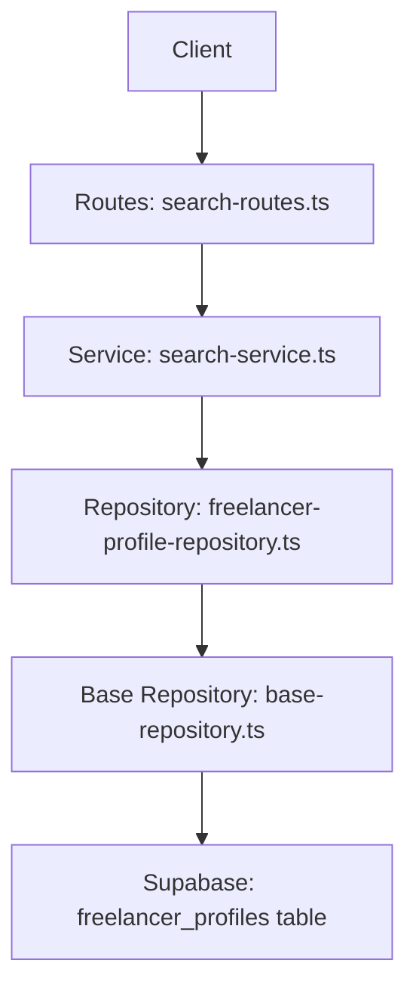
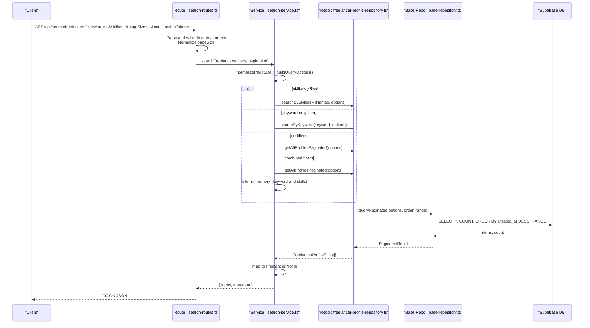
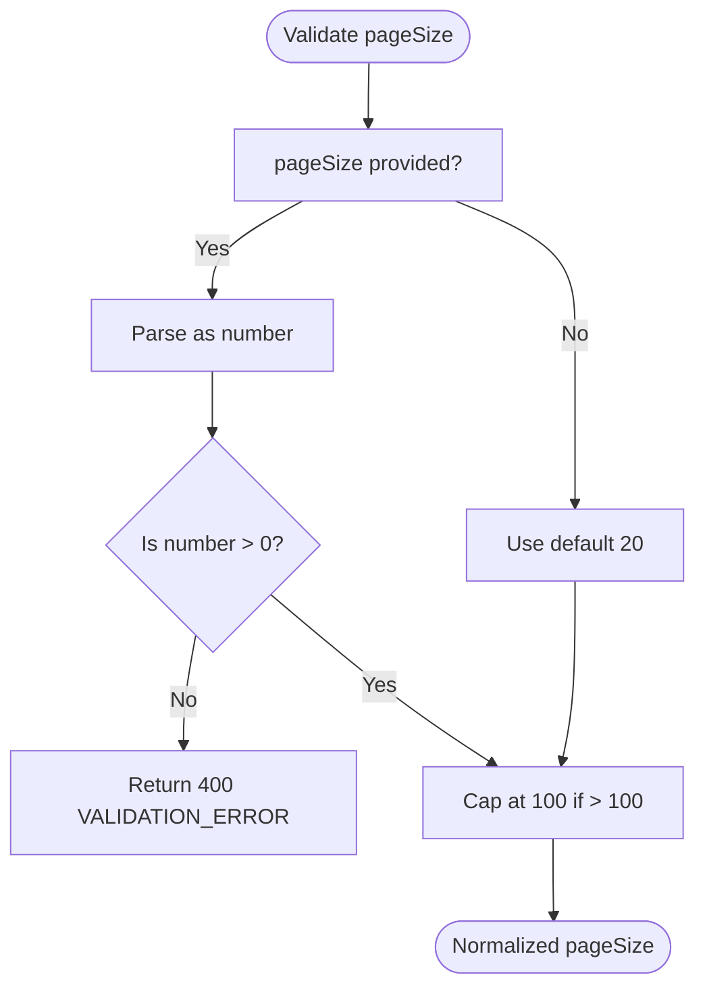

# Freelancer Search API

<cite>
**Referenced Files in This Document**
- [search-routes.ts](file://src/routes/search-routes.ts)
- [search-service.ts](file://src/services/search-service.ts)
- [freelancer-profile-repository.ts](file://src/repositories/freelancer-profile-repository.ts)
- [base-repository.ts](file://src/repositories/base-repository.ts)
- [swagger.ts](file://src/config/swagger.ts)
- [API-DOCUMENTATION.md](file://docs/API-DOCUMENTATION.md)
- [schema.sql](file://supabase/schema.sql)
</cite>

## Table of Contents
1. [Introduction](#introduction)
2. [Project Structure](#project-structure)
3. [Core Components](#core-components)
4. [Architecture Overview](#architecture-overview)
5. [Detailed Component Analysis](#detailed-component-analysis)
6. [Dependency Analysis](#dependency-analysis)
7. [Performance Considerations](#performance-considerations)
8. [Troubleshooting Guide](#troubleshooting-guide)
9. [Conclusion](#conclusion)

## Introduction
This document provides comprehensive API documentation for the GET /api/search/freelancers endpoint in the FreelanceXchain system. It covers the HTTP method, URL pattern, authentication requirements, query parameters, request and response schemas, server-side validation, pagination model, integration with the search-service and repositories, and the underlying database indexing strategy. Practical examples demonstrate searching by keyword, filtering by skills, and combining both filters. Guidance is included for client-side implementation patterns for filter combinations and infinite scrolling.

## Project Structure
The freelancer search endpoint is implemented as follows:
- Route handler: GET /api/search/freelancers
- Validation and pagination logic: route layer
- Business logic: search-service module
- Data access: freelancer-profile-repository using Supabase
- Pagination model: shared base-repository abstraction
- Documentation: OpenAPI/Swagger definitions and API docs

**Diagram sources**
- [search-routes.ts](file://src/routes/search-routes.ts#L173-L264)
- [search-service.ts](file://src/services/search-service.ts#L150-L205)
- [freelancer-profile-repository.ts](file://src/repositories/freelancer-profile-repository.ts#L68-L118)
- [base-repository.ts](file://src/repositories/base-repository.ts#L129-L147)
- [schema.sql](file://supabase/schema.sql#L40-L51)

**Section sources**
- [search-routes.ts](file://src/routes/search-routes.ts#L173-L264)
- [search-service.ts](file://src/services/search-service.ts#L150-L205)
- [freelancer-profile-repository.ts](file://src/repositories/freelancer-profile-repository.ts#L68-L118)
- [base-repository.ts](file://src/repositories/base-repository.ts#L129-L147)
- [swagger.ts](file://src/config/swagger.ts#L1-L233)
- [API-DOCUMENTATION.md](file://docs/API-DOCUMENTATION.md#L485-L510)

## Core Components
- Endpoint: GET /api/search/freelancers
- Authentication: Requires a Bearer token in the Authorization header
- Query parameters:
  - keyword (string): Bio search term
  - skills (string): Comma-separated skill identifiers
  - pageSize (integer, default 20, min 1, max 100)
  - continuationToken (string): Pagination token (converted to numeric offset)
- Response schema:
  - items: array of FreelancerProfile
  - metadata: SearchResultMetadata with pageSize, hasMore, offset
- Pagination model:
  - pageSize normalized to 1–100
  - offset derived from continuationToken
  - hasMore computed from count and range

**Section sources**
- [search-routes.ts](file://src/routes/search-routes.ts#L173-L264)
- [search-service.ts](file://src/services/search-service.ts#L18-L33)
- [swagger.ts](file://src/config/swagger.ts#L1-L233)
- [API-DOCUMENTATION.md](file://docs/API-DOCUMENTATION.md#L485-L510)

## Architecture Overview
The endpoint flow:
1. Route parses query parameters and validates pageSize
2. Builds filters and pagination objects
3. Calls search-service.searchFreelancers
4. search-service applies normalization and delegates to repository methods
5. Repository executes Supabase queries with ilike and JSONB array matching
6. Results mapped to API models and returned with pagination metadata

**Diagram sources**
- [search-routes.ts](file://src/routes/search-routes.ts#L215-L264)
- [search-service.ts](file://src/services/search-service.ts#L150-L205)
- [freelancer-profile-repository.ts](file://src/repositories/freelancer-profile-repository.ts#L68-L118)
- [base-repository.ts](file://src/repositories/base-repository.ts#L129-L147)

## Detailed Component Analysis

### Endpoint Definition and Authentication
- Method: GET
- URL: /api/search/freelancers
- Authentication: Bearer token required in Authorization header
- Notes: The route handler does not attach a middleware to enforce JWT; however, the API documentation states that protected endpoints require a Bearer token. Clients should include the token as per the documented pattern.

**Section sources**
- [API-DOCUMENTATION.md](file://docs/API-DOCUMENTATION.md#L7-L14)
- [search-routes.ts](file://src/routes/search-routes.ts#L173-L214)

### Query Parameters
- keyword (string): Filters profiles by bio text using case-insensitive partial matching
- skills (string): Comma-separated skill identifiers; service converts to skill names for matching
- pageSize (integer): Defaults to 20; constrained to 1–100
- continuationToken (string): Converted to numeric offset; used for pagination

Validation behavior:
- pageSize must be a positive integer; otherwise returns 400 with VALIDATION_ERROR
- skill IDs are parsed from comma-separated string and trimmed
- Keyword is optional; skill IDs are optional

**Section sources**
- [search-routes.ts](file://src/routes/search-routes.ts#L215-L264)
- [search-service.ts](file://src/services/search-service.ts#L18-L33)

### Request and Response Schema
- Request: Query parameters only (no body)
- Response: FreelancerSearchResult
  - items: array of FreelancerProfile
  - metadata: SearchResultMetadata
    - pageSize: number
    - hasMore: boolean
    - offset: number (present when pagination offset is used)

Swagger/OpenAPI definitions:
- FreelancerProfile schema includes id, userId, bio, hourlyRate, skills, experience, availability, createdAt, updatedAt
- SearchResultMetadata schema includes pageSize, hasMore, continuationToken

**Section sources**
- [swagger.ts](file://src/config/swagger.ts#L66-L106)
- [swagger.ts](file://src/config/swagger.ts#L215-L223)
- [search-service.ts](file://src/services/search-service.ts#L23-L33)

### Server-Side Validation Logic for pageSize
- If pageSize is missing or less than 1, defaults to 20
- If pageSize exceeds 100, caps at 100
- If pageSize is present but not a positive integer, returns 400 with VALIDATION_ERROR

**Diagram sources**
- [search-service.ts](file://src/services/search-service.ts#L46-L50)
- [search-routes.ts](file://src/routes/search-routes.ts#L229-L238)

**Section sources**
- [search-service.ts](file://src/services/search-service.ts#L46-L50)
- [search-routes.ts](file://src/routes/search-routes.ts#L229-L238)

### Pagination Model and Continuation Token
- Pagination input: pageSize and offset
- continuationToken is converted to numeric offset; if empty or invalid, offset defaults to 0
- hasMore computed from count and range; offset included in metadata when provided

**Section sources**
- [search-service.ts](file://src/services/search-service.ts#L18-L33)
- [search-routes.ts](file://src/routes/search-routes.ts#L246-L250)
- [base-repository.ts](file://src/repositories/base-repository.ts#L129-L147)

### Integration with search-service and Repositories
- searchFreelancers:
  - skill-only: calls repository.searchBySkills
  - keyword-only: calls repository.searchByKeyword
  - no filters: calls repository.getAllProfilesPaginated
  - combined filters: fetches all profiles and filters in-memory (keyword and skills)
- Repository methods:
  - searchBySkills: performs range query and filters by skill names (case-insensitive)
  - searchByKeyword: uses ilike on bio with range and count
  - getAllProfilesPaginated: generic paginated query with ordering by created_at desc

**Section sources**
- [search-service.ts](file://src/services/search-service.ts#L150-L205)
- [freelancer-profile-repository.ts](file://src/repositories/freelancer-profile-repository.ts#L68-L118)
- [base-repository.ts](file://src/repositories/base-repository.ts#L129-L147)

### Underlying Database Indexing Strategy
- Table: freelancer_profiles
- Fields: bio (TEXT), skills (JSONB), experience (JSONB), availability (VARCHAR), user_id (UUID)
- Indexes: primary key on id, unique index on user_id, and various auxiliary indexes on other tables
- Text search on bio uses ilike; JSONB skills array matching uses overlap checks and in-memory filtering

**Section sources**
- [schema.sql](file://supabase/schema.sql#L40-L51)
- [freelancer-profile-repository.ts](file://src/repositories/freelancer-profile-repository.ts#L95-L114)
- [freelancer-profile-repository.ts](file://src/repositories/freelancer-profile-repository.ts#L68-L93)

### Practical Examples
- Search by keyword “React expert”:
  - GET /api/search/freelancers?keyword=React+expert&pageSize=20
- Filter by skill IDs “3,7”:
  - GET /api/search/freelancers?skills=3,7&pageSize=20
- Combine keyword and skills:
  - GET /api/search/freelancers?keyword=React+expert&skills=3,7&pageSize=20
- Pagination:
  - Use continuationToken to fetch subsequent pages; token is treated as numeric offset

Notes:
- The service expects skill identifiers; however, repository filtering uses skill names. Ensure skill identifiers map to skill names consistently.

**Section sources**
- [search-routes.ts](file://src/routes/search-routes.ts#L215-L264)
- [search-service.ts](file://src/services/search-service.ts#L170-L196)
- [freelancer-profile-repository.ts](file://src/repositories/freelancer-profile-repository.ts#L68-L93)

## Dependency Analysis

**Diagram sources**
- [search-routes.ts](file://src/routes/search-routes.ts#L1-L267)
- [search-service.ts](file://src/services/search-service.ts#L1-L206)
- [freelancer-profile-repository.ts](file://src/repositories/freelancer-profile-repository.ts#L1-L122)
- [base-repository.ts](file://src/repositories/base-repository.ts#L1-L149)

**Section sources**
- [search-routes.ts](file://src/routes/search-routes.ts#L1-L267)
- [search-service.ts](file://src/services/search-service.ts#L1-L206)
- [freelancer-profile-repository.ts](file://src/repositories/freelancer-profile-repository.ts#L1-L122)
- [base-repository.ts](file://src/repositories/base-repository.ts#L1-L149)

## Performance Considerations
- Text search on bio:
  - Uses ilike; consider adding a GIN index on bio for improved performance if frequent text searches occur.
- JSONB skills array:
  - Repository filters by skill names in-memory; consider normalizing skills to separate table with foreign keys for efficient joins and indexing.
- Pagination:
  - Range queries with exact counts; ensure indexes on frequently sorted columns (e.g., created_at) are present.
- Combined filters:
  - When multiple filters are used, the service retrieves all profiles and filters in-memory; this can be expensive for large datasets. Consider optimizing with composite indexes or materialized views if needed.

[No sources needed since this section provides general guidance]

## Troubleshooting Guide
Common issues and resolutions:
- 400 Validation Error for pageSize:
  - Ensure pageSize is a positive integer and within 1–100.
- 401 Unauthorized:
  - Include a valid Bearer token in the Authorization header.
- Unexpected empty results:
  - Verify keyword spelling and skill identifiers; remember case-insensitive matching and that skills are matched by names in the repository.
- Pagination gaps:
  - Use continuationToken as numeric offset; ensure consistent pageSize across requests.

**Section sources**
- [search-routes.ts](file://src/routes/search-routes.ts#L229-L238)
- [API-DOCUMENTATION.md](file://docs/API-DOCUMENTATION.md#L7-L14)

## Conclusion
The GET /api/search/freelancers endpoint provides flexible filtering over freelancer profiles with keyword and skills criteria, robust pagination, and clear error handling. For optimal performance, consider enhancing database indexes and normalizing skills to enable efficient joins and indexing. Clients should implement filter combinations and infinite scrolling by maintaining consistent pageSize and using continuationToken-derived offsets.