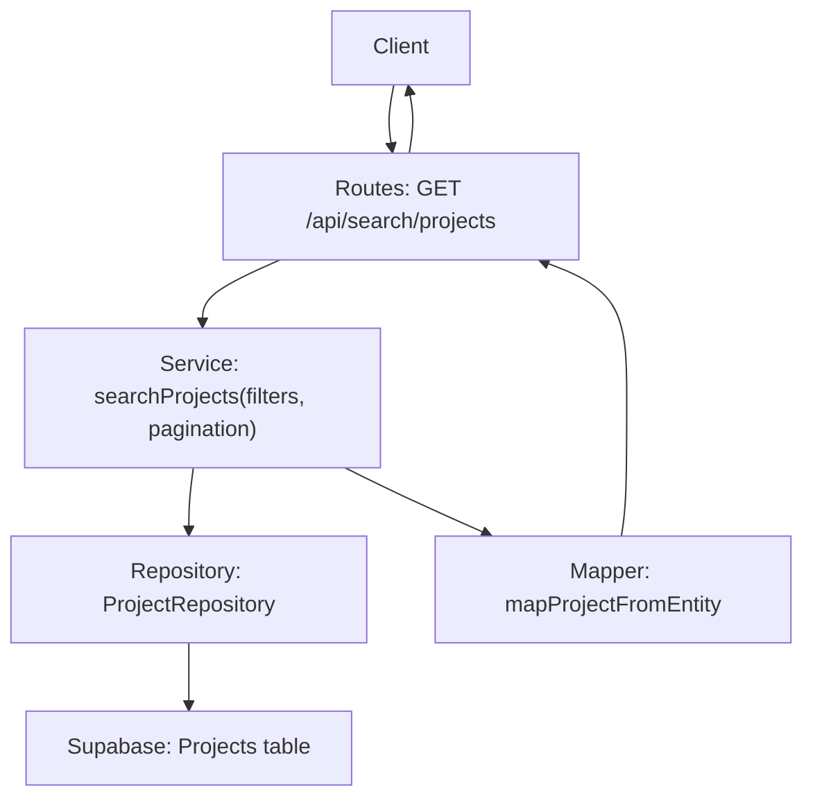
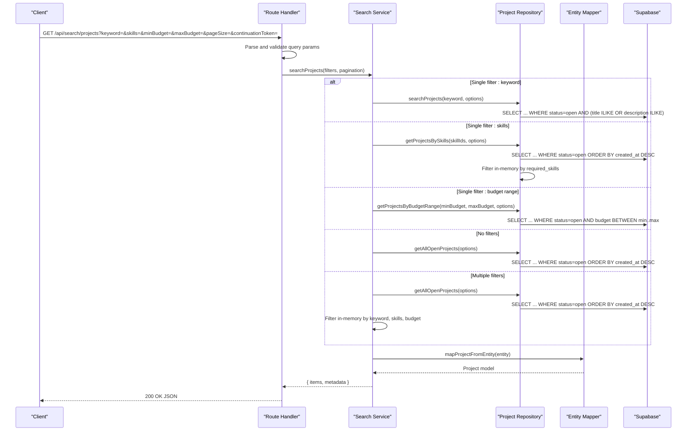
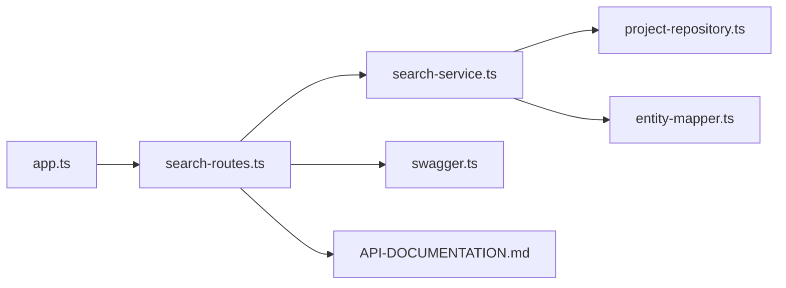

# Project Search API

<cite>
**Referenced Files in This Document**
- [search-routes.ts](file://src/routes/search-routes.ts)
- [search-service.ts](file://src/services/search-service.ts)
- [project-repository.ts](file://src/repositories/project-repository.ts)
- [entity-mapper.ts](file://src/utils/entity-mapper.ts)
- [swagger.ts](file://src/config/swagger.ts)
- [API-DOCUMENTATION.md](file://docs/API-DOCUMENTATION.md)
- [app.ts](file://src/app.ts)
- [validation-middleware.ts](file://src/middleware/validation-middleware.ts)
- [auth-middleware.ts](file://src/middleware/auth-middleware.ts)
</cite>

## Table of Contents
1. [Introduction](#introduction)
2. [Project Structure](#project-structure)
3. [Core Components](#core-components)
4. [Architecture Overview](#architecture-overview)
5. [Detailed Component Analysis](#detailed-component-analysis)
6. [Dependency Analysis](#dependency-analysis)
7. [Performance Considerations](#performance-considerations)
8. [Troubleshooting Guide](#troubleshooting-guide)
9. [Conclusion](#conclusion)

## Introduction
This document describes the GET /api/search/projects endpoint in the FreelanceXchain system. It covers the HTTP method, URL pattern, authentication requirements, query parameters, request and response schemas, server-side validation, pagination model, and the underlying search-service and repository implementation. It also explains the database indexing strategy used for project title/description and required skills, and provides practical examples and performance recommendations for large datasets.

## Project Structure
The project search endpoint is implemented as follows:
- Route handler: GET /api/search/projects
- Validation: Built-in parameter parsing and validation in the route handler
- Service layer: searchProjects(filter, pagination) orchestrating repository calls
- Repository layer: Supabase client queries with database-level filters and in-memory filtering for multi-criteria
- Response mapping: Entities mapped to API models

**Diagram sources**
- [search-routes.ts](file://src/routes/search-routes.ts#L95-L170)
- [search-service.ts](file://src/services/search-service.ts#L77-L147)
- [project-repository.ts](file://src/repositories/project-repository.ts#L118-L188)
- [entity-mapper.ts](file://src/utils/entity-mapper.ts#L236-L250)

**Section sources**
- [search-routes.ts](file://src/routes/search-routes.ts#L95-L170)
- [search-service.ts](file://src/services/search-service.ts#L77-L147)
- [project-repository.ts](file://src/repositories/project-repository.ts#L118-L188)
- [entity-mapper.ts](file://src/utils/entity-mapper.ts#L236-L250)

## Core Components
- Endpoint: GET /api/search/projects
- Authentication: Requires a Bearer JWT token in the Authorization header
- Query parameters:
  - keyword (string): Free-text search across title and description
  - skills (string): Comma-separated skill IDs to filter by
  - minBudget (number): Minimum budget filter
  - maxBudget (number): Maximum budget filter
  - pageSize (integer, default 20, min 1, max 100): Results per page
  - continuationToken (string): Pagination token (parsed as an integer offset)
- Response schema:
  - items: array of Project
  - metadata: object with pageSize, hasMore, offset

**Section sources**
- [API-DOCUMENTATION.md](file://docs/API-DOCUMENTATION.md#L485-L510)
- [swagger.ts](file://src/config/swagger.ts#L23-L28)
- [search-routes.ts](file://src/routes/search-routes.ts#L43-L94)
- [search-service.ts](file://src/services/search-service.ts#L18-L33)

## Architecture Overview
The request lifecycle for GET /api/search/projects:

**Diagram sources**
- [search-routes.ts](file://src/routes/search-routes.ts#L95-L170)
- [search-service.ts](file://src/services/search-service.ts#L77-L147)
- [project-repository.ts](file://src/repositories/project-repository.ts#L118-L188)
- [entity-mapper.ts](file://src/utils/entity-mapper.ts#L236-L250)

## Detailed Component Analysis

### Endpoint Definition and Authentication
- HTTP method: GET
- URL pattern: /api/search/projects
- Authentication: Bearer JWT token required in Authorization header
- Swagger security scheme defines bearerAuth with JWT format

**Section sources**
- [swagger.ts](file://src/config/swagger.ts#L23-L28)
- [API-DOCUMENTATION.md](file://docs/API-DOCUMENTATION.md#L7-L14)

### Query Parameters and Validation
- keyword: string; used for ILIKE search on title and description
- skills: string; comma-separated skill IDs; parsed into an array
- minBudget: number; validated to be numeric and non-negative
- maxBudget: number; validated to be numeric and non-negative
- pageSize: integer; normalized to 1–100; default 20
- continuationToken: string; parsed as integer offset; used for pagination

Server-side validation logic:
- Numeric parameters minBudget and maxBudget are parsed and validated; non-numeric values return 400 with VALIDATION_ERROR
- pageSize must be a positive integer; otherwise returns 400 with VALIDATION_ERROR
- Filters are built conditionally based on presence of parameters

**Section sources**
- [search-routes.ts](file://src/routes/search-routes.ts#L99-L170)
- [validation-middleware.ts](file://src/middleware/validation-middleware.ts#L134-L163)

### Request and Response Schema
- Request: Query parameters as described above
- Response:
  - items: array of Project
  - metadata: object containing pageSize, hasMore, offset

Swagger/OpenAPI schemas define:
- ProjectSearchResult: items array of Project, metadata of type SearchResultMetadata
- SearchResultMetadata: pageSize, hasMore, offset

**Section sources**
- [search-routes.ts](file://src/routes/search-routes.ts#L1-L40)
- [search-service.ts](file://src/services/search-service.ts#L18-L33)
- [swagger.ts](file://src/config/swagger.ts#L106-L127)

### Service Layer Implementation
- searchProjects(filters, pagination):
  - Normalizes pageSize to 1–100
  - Builds QueryOptions with limit and offset
  - Applies optimized repository methods when a single filter is present
  - Falls back to getAllOpenProjects and applies in-memory filters for multiple criteria
  - Maps entities to models and constructs a SearchResult with metadata

**Section sources**
- [search-service.ts](file://src/services/search-service.ts#L43-L71)
- [search-service.ts](file://src/services/search-service.ts#L77-L147)

### Repository Layer and Database Indexing Strategy
- searchProjects(keyword, options):
  - Database-level ILIKE search on title and description for open projects
  - Uses Supabase orients query with or(title.ilike, description.ilike)
- getProjectsBySkills(skillIds, options):
  - Fetches open projects and filters in-memory by required_skills.skill_id
- getProjectsByBudgetRange(minBudget, maxBudget, options):
  - Database-level gte/bounded budget query for open projects
- getAllOpenProjects(options):
  - Fetches open projects ordered by created_at with pagination

Underlying database indexing strategy:
- Project titles and descriptions are searched using ILIKE with or() conditions
- Required skills are stored as an array of records in the projects table; repository filters by required_skills in memory
- Budget range filtering uses database operators gte/lte

**Section sources**
- [project-repository.ts](file://src/repositories/project-repository.ts#L118-L188)

### Entity Mapping
- mapProjectFromEntity(entity) converts repository entities to API models
- Project model includes id, employerId, title, description, requiredSkills, budget, deadline, status, milestones, createdAt, updatedAt

**Section sources**
- [entity-mapper.ts](file://src/utils/entity-mapper.ts#L236-L250)

### Practical Examples
- Search by keyword:
  - GET /api/search/projects?keyword=web%20development
- Filter by skill IDs:
  - GET /api/search/projects?skills=1,5,9
- Budget range:
  - GET /api/search/projects?minBudget=500&maxBudget=5000
- Combined filters:
  - GET /api/search/projects?keyword=react&skills=10,15&minBudget=1000&maxBudget=10000&pageSize=20&continuationToken=20

Notes:
- pageSize defaults to 20 and is capped at 100
- continuationToken is parsed as an integer offset

**Section sources**
- [search-routes.ts](file://src/routes/search-routes.ts#L99-L170)
- [API-DOCUMENTATION.md](file://docs/API-DOCUMENTATION.md#L485-L510)

## Dependency Analysis

**Diagram sources**
- [search-routes.ts](file://src/routes/search-routes.ts#L95-L170)
- [search-service.ts](file://src/services/search-service.ts#L77-L147)
- [project-repository.ts](file://src/repositories/project-repository.ts#L118-L188)
- [entity-mapper.ts](file://src/utils/entity-mapper.ts#L236-L250)
- [swagger.ts](file://src/config/swagger.ts#L1-L233)
- [API-DOCUMENTATION.md](file://docs/API-DOCUMENTATION.md#L485-L510)
- [app.ts](file://src/app.ts#L79-L86)

**Section sources**
- [search-routes.ts](file://src/routes/search-routes.ts#L95-L170)
- [search-service.ts](file://src/services/search-service.ts#L77-L147)
- [project-repository.ts](file://src/repositories/project-repository.ts#L118-L188)
- [entity-mapper.ts](file://src/utils/entity-mapper.ts#L236-L250)
- [swagger.ts](file://src/config/swagger.ts#L1-L233)
- [API-DOCUMENTATION.md](file://docs/API-DOCUMENTATION.md#L485-L510)
- [app.ts](file://src/app.ts#L79-L86)

## Performance Considerations
- Single-filter optimization:
  - Keyword search uses database ILIKE with or() conditions
  - Skills filter uses database query and in-memory filtering
  - Budget range uses database gte/lte filters
- Multi-filter fallback:
  - When multiple filters are present, the service fetches all open projects and applies in-memory filters (keyword, skills, budget). This scales with dataset size and should be avoided for large datasets.
- Pagination:
  - pageSize is normalized to 1–100; continuationToken is parsed as an integer offset
- Recommendations:
  - Prefer single filters for optimal performance
  - For multi-filter scenarios, consider adding database indexes on required_skills arrays or denormalizing skills for efficient querying
  - Use smaller pageSize values and leverage continuationToken for progressive loading
  - Cache frequently accessed keyword lists and skill IDs where appropriate

**Section sources**
- [search-service.ts](file://src/services/search-service.ts#L77-L147)
- [project-repository.ts](file://src/repositories/project-repository.ts#L118-L188)

## Troubleshooting Guide
Common validation errors:
- Invalid numeric parameters:
  - minBudget or maxBudget must be valid numbers; otherwise returns 400 with VALIDATION_ERROR
- Invalid pageSize:
  - pageSize must be a positive integer; otherwise returns 400 with VALIDATION_ERROR
- Authentication failures:
  - Missing Authorization header or invalid Bearer token format returns 401
  - Invalid/expired token returns 401 with AUTH_INVALID_TOKEN or AUTH_TOKEN_EXPIRED
- CORS and request ID:
  - Requests include X-Request-ID for tracing; CORS policies vary by environment

**Section sources**
- [search-routes.ts](file://src/routes/search-routes.ts#L115-L142)
- [auth-middleware.ts](file://src/middleware/auth-middleware.ts#L25-L70)
- [app.ts](file://src/app.ts#L28-L53)

## Conclusion
The GET /api/search/projects endpoint provides flexible project discovery with keyword, skills, and budget filters. It enforces JWT authentication, validates numeric parameters, and supports pagination via pageSize and continuationToken. The service optimizes single-filter queries at the database level while falling back to in-memory filtering for multi-criteria. For large-scale deployments, consider enhancing database indexing and caching strategies to improve performance under multi-filter workloads.