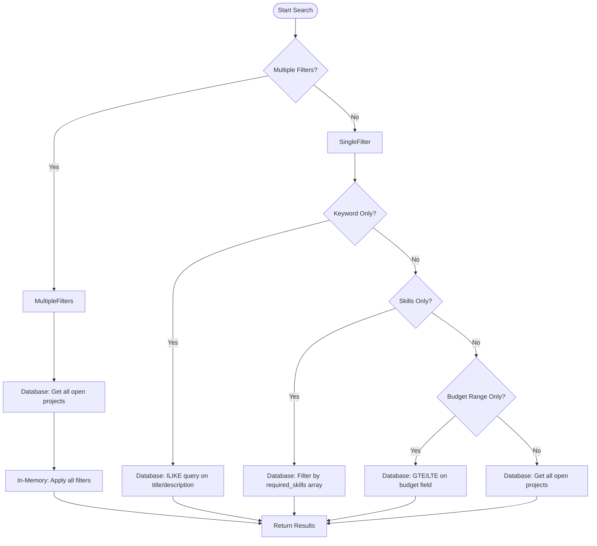
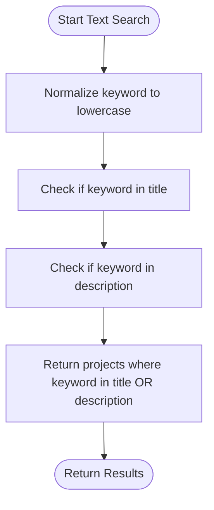
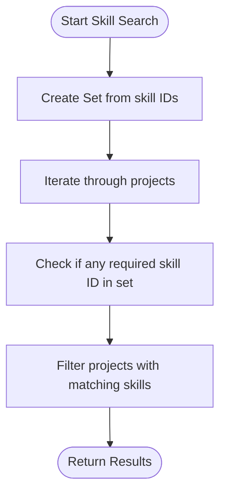
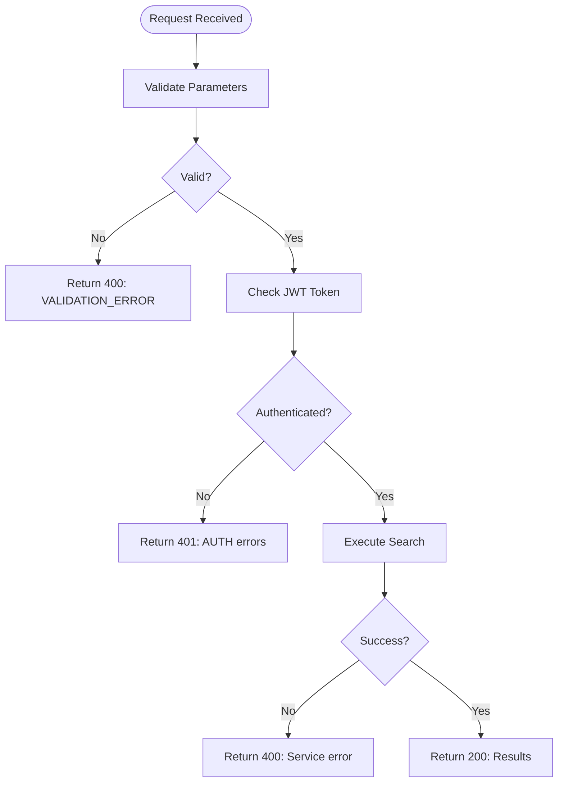

# Search API

<cite>
**Referenced Files in This Document**   
- [search-routes.ts](file://src/routes/search-routes.ts)
- [search-service.ts](file://src/services/search-service.ts)
- [project-repository.ts](file://src/repositories/project-repository.ts)
- [freelancer-profile-repository.ts](file://src/repositories/freelancer-profile-repository.ts)
- [entity-mapper.ts](file://src/utils/entity-mapper.ts)
- [validation-middleware.ts](file://src/middleware/validation-middleware.ts)
- [auth-middleware.ts](file://src/middleware/auth-middleware.ts)
</cite>

## Table of Contents
1. [Introduction](#introduction)
2. [Project Search Endpoint](#project-search-endpoint)
3. [Freelancer Search Endpoint](#freelancer-search-endpoint)
4. [Search Algorithms and Relevance Scoring](#search-algorithms-and-relevance-scoring)
5. [Client Implementation Examples](#client-implementation-examples)
6. [Performance Considerations](#performance-considerations)
7. [Error Handling](#error-handling)

## Introduction
The FreelanceXchain system provides robust search and discovery endpoints that enable users to find projects and freelancers based on various criteria. These endpoints support keyword search, skill-based filtering, budget range filtering, pagination, and sorting. The search functionality is designed to be efficient and scalable, with optimized database queries and in-memory filtering for complex search scenarios. All search endpoints require JWT authentication to ensure secure access to the platform's data.

**Section sources**
- [search-routes.ts](file://src/routes/search-routes.ts#L1-L267)
- [search-service.ts](file://src/services/search-service.ts#L1-L206)

## Project Search Endpoint

The project search endpoint allows users to search for projects using keyword, skill, and budget filters. This endpoint supports pagination through the `pageSize` and `continuationToken` parameters, enabling efficient retrieval of large datasets.

### HTTP Method and URL Pattern
```
GET /api/search/projects
```

### Authentication Requirements
This endpoint requires JWT authentication. The Authorization header must contain a valid Bearer token:
```
Authorization: Bearer <JWT_TOKEN>
```

### Query Parameters
| Parameter | Type | Required | Description | Example |
|---------|------|---------|-------------|---------|
| `keyword` | string | No | Search keyword for project title and description | "web development" |
| `skills` | string | No | Comma-separated skill IDs to filter projects | "123e4567-e89b-12d3-a456-426614174000,123e4567-e89b-12d3-a456-426614174001" |
| `minBudget` | number | No | Minimum budget filter (inclusive) | 1000 |
| `maxBudget` | number | No | Maximum budget filter (inclusive) | 5000 |
| `pageSize` | integer | No | Number of results per page (default: 20, max: 100) | 25 |
| `continuationToken` | string | No | Token for pagination (offset value) | "20" |

### Request Examples
**Search projects by keyword:**
```
GET /api/search/projects?keyword=web+development&pageSize=10
```

**Search projects by skills:**
```
GET /api/search/projects?skills=123e4567-e89b-12d3-a456-426614174000,123e4567-e89b-12d3-a456-426614174001&pageSize=15
```

**Search projects by budget range:**
```
GET /api/search/projects?minBudget=1000&maxBudget=5000&pageSize=20
```

**Search projects with multiple filters:**
```
GET /api/search/projects?keyword=mobile+app&skills=123e4567-e89b-12d3-a456-426614174002&minBudget=2000&maxBudget=8000&pageSize=25
```

### Response Schema
The response follows a standardized format with items and metadata:

```json
{
  "items": [
    {
      "id": "string",
      "employerId": "string",
      "title": "string",
      "description": "string",
      "requiredSkills": [
        {
          "skillId": "string",
          "skillName": "string",
          "categoryId": "string",
          "yearsOfExperience": "number"
        }
      ],
      "budget": "number",
      "deadline": "string",
      "status": "string",
      "milestones": [
        {
          "id": "string",
          "title": "string",
          "description": "string",
          "amount": "number",
          "dueDate": "string",
          "status": "string"
        }
      ],
      "createdAt": "string",
      "updatedAt": "string"
    }
  ],
  "metadata": {
    "pageSize": "integer",
    "hasMore": "boolean",
    "continuationToken": "string"
  }
}
```

### Response Example
```json
{
  "items": [
    {
      "id": "123e4567-e89b-12d3-a456-426614174000",
      "employerId": "123e4567-e89b-12d3-a456-426614174001",
      "title": "E-commerce Website Development",
      "description": "Build a responsive e-commerce website with payment integration",
      "requiredSkills": [
        {
          "skillId": "123e4567-e89b-12d3-a456-426614174002",
          "skillName": "React",
          "categoryId": "123e4567-e89b-12d3-a456-426614174003"
        },
        {
          "skillId": "123e4567-e89b-12d3-a456-426614174004",
          "skillName": "Node.js",
          "categoryId": "123e4567-e89b-12d3-a456-426614174003"
        }
      ],
      "budget": 4500,
      "deadline": "2024-12-31T23:59:59Z",
      "status": "open",
      "milestones": [
        {
          "id": "123e4567-e89b-12d3-a456-426614174005",
          "title": "Design Phase",
          "description": "Complete UI/UX design",
          "amount": 1000,
          "dueDate": "2024-06-30T23:59:59Z",
          "status": "pending"
        }
      ],
      "createdAt": "2024-01-15T10:30:00Z",
      "updatedAt": "2024-01-15T10:30:00Z"
    }
  ],
  "metadata": {
    "pageSize": 20,
    "hasMore": true,
    "continuationToken": "20"
  }
}
```

**Section sources**
- [search-routes.ts](file://src/routes/search-routes.ts#L45-L170)
- [search-service.ts](file://src/services/search-service.ts#L77-L147)
- [project-repository.ts](file://src/repositories/project-repository.ts#L167-L187)

## Freelancer Search Endpoint

The freelancer search endpoint enables users to discover freelancers based on keyword and skill filters. This endpoint supports pagination and returns comprehensive freelancer profile information.

### HTTP Method and URL Pattern
```
GET /api/search/freelancers
```

### Authentication Requirements
This endpoint requires JWT authentication. The Authorization header must contain a valid Bearer token:
```
Authorization: Bearer <JWT_TOKEN>
```

### Query Parameters
| Parameter | Type | Required | Description | Example |
|---------|------|---------|-------------|---------|
| `keyword` | string | No | Search keyword for freelancer bio | "full stack developer" |
| `skills` | string | No | Comma-separated skill IDs to filter freelancers | "123e4567-e89b-12d3-a456-426614174000,123e4567-e89b-12d3-a456-426614174001" |
| `pageSize` | integer | No | Number of results per page (default: 20, max: 100) | 30 |
| `continuationToken` | string | No | Token for pagination (offset value) | "30" |

### Request Examples
**Search freelancers by keyword:**
```
GET /api/search/freelancers?keyword=full+stack+developer&pageSize=15
```

**Search freelancers by skills:**
```
GET /api/search/freelancers?skills=123e4567-e89b-12d3-a456-426614174002,123e4567-e89b-12d3-a456-426614174004&pageSize=20
```

**Search freelancers with multiple filters:**
```
GET /api/search/freelancers?keyword=senior+developer&skills=123e4567-e89b-12d3-a456-426614174002&pageSize=25
```

### Response Schema
The response follows a standardized format with items and metadata:

```json
{
  "items": [
    {
      "id": "string",
      "userId": "string",
      "bio": "string",
      "hourlyRate": "number",
      "skills": [
        {
          "name": "string",
          "yearsOfExperience": "number"
        }
      ],
      "experience": [
        {
          "id": "string",
          "title": "string",
          "company": "string",
          "description": "string",
          "startDate": "string",
          "endDate": "string"
        }
      ],
      "availability": "string",
      "createdAt": "string",
      "updatedAt": "string"
    }
  ],
  "metadata": {
    "pageSize": "integer",
    "hasMore": "boolean",
    "continuationToken": "string"
  }
}
```

### Response Example
```json
{
  "items": [
    {
      "id": "123e4567-e89b-12d3-a456-426614174006",
      "userId": "123e4567-e89b-12d3-a456-426614174007",
      "bio": "Senior full stack developer with 8 years of experience in React, Node.js, and MongoDB",
      "hourlyRate": 75,
      "skills": [
        {
          "name": "React",
          "yearsOfExperience": 6
        },
        {
          "name": "Node.js",
          "yearsOfExperience": 7
        },
        {
          "name": "MongoDB",
          "yearsOfExperience": 5
        }
      ],
      "experience": [
        {
          "id": "123e4567-e89b-12d3-a456-426614174008",
          "title": "Senior Developer",
          "company": "Tech Solutions Inc.",
          "description": "Led development of multiple web applications",
          "startDate": "2020-01-01",
          "endDate": null
        }
      ],
      "availability": "available",
      "createdAt": "2023-05-10T08:15:00Z",
      "updatedAt": "2024-01-10T14:20:00Z"
    }
  ],
  "metadata": {
    "pageSize": 20,
    "hasMore": true,
    "continuationToken": "20"
  }
}
```

**Section sources**
- [search-routes.ts](file://src/routes/search-routes.ts#L175-L264)
- [search-service.ts](file://src/services/search-service.ts#L154-L205)
- [freelancer-profile-repository.ts](file://src/repositories/freelancer-profile-repository.ts#L95-L114)

## Search Algorithms and Relevance Scoring

The FreelanceXchain search system implements different algorithms based on the type and combination of filters provided in the search request. The system optimizes performance by using database-level queries when possible and falling back to in-memory filtering for complex scenarios.

### Search Strategy Overview
The search service employs a decision tree to determine the most efficient search strategy based on the provided filters:



**Diagram sources**
- [search-service.ts](file://src/services/search-service.ts#L86-L138)
- [project-repository.ts](file://src/repositories/project-repository.ts#L167-L187)

### Text Matching Algorithm
For keyword searches, the system uses case-insensitive partial matching on project titles and descriptions. The algorithm converts the search keyword to lowercase and checks if it appears anywhere within the title or description text:



**Diagram sources**
- [search-service.ts](file://src/services/search-service.ts#L111-L117)
- [project-repository.ts](file://src/repositories/project-repository.ts#L176-L177)

### Skill Matching Algorithm
When searching by skills, the system uses exact matching on skill IDs for projects and skill names for freelancers. For projects, the search checks if any required skill matches the provided skill IDs. For freelancers, the search performs case-insensitive matching on skill names:



**Diagram sources**
- [search-service.ts](file://src/services/search-service.ts#L121-L125)
- [project-repository.ts](file://src/repositories/project-repository.ts#L133-L135)

### Relevance Scoring
Currently, the system does not implement complex relevance scoring. Results are returned in chronological order (newest first) based on the project's creation date. Future enhancements could include:
- Boosting projects with exact keyword matches in the title
- Prioritizing projects with skills that exactly match the search criteria
- Incorporating freelancer ratings and reputation scores
- Considering project budget and complexity

## Client Implementation Examples

### JavaScript/TypeScript Implementation
```typescript
class FreelanceXchainClient {
  private baseUrl: string;
  private token: string;

  constructor(baseUrl: string, token: string) {
    this.baseUrl = baseUrl;
    this.token = token;
  }

  private async request<T>(endpoint: string, params: Record<string, any> = {}): Promise<T> {
    const url = new URL(`${this.baseUrl}${endpoint}`);
    Object.keys(params).forEach(key => {
      if (params[key] !== undefined) {
        url.searchParams.append(key, params[key]);
      }
    });

    const response = await fetch(url.toString(), {
      headers: {
        'Authorization': `Bearer ${this.token}`,
        'Content-Type': 'application/json'
      }
    });

    if (!response.ok) {
      throw new Error(`HTTP ${response.status}: ${await response.text()}`);
    }

    return response.json();
  }

  // Search projects
  async searchProjects(
    keyword?: string,
    skillIds?: string[],
    minBudget?: number,
    maxBudget?: number,
    pageSize: number = 20,
    continuationToken?: string
  ) {
    return this.request('/api/search/projects', {
      keyword,
      skills: skillIds?.join(','),
      minBudget,
      maxBudget,
      pageSize,
      continuationToken
    });
  }

  // Search freelancers
  async searchFreelancers(
    keyword?: string,
    skillIds?: string[],
    pageSize: number = 20,
    continuationToken?: string
  ) {
    return this.request('/api/search/freelancers', {
      keyword,
      skills: skillIds?.join(','),
      pageSize,
      continuationToken
    });
  }
}

// Usage example
const client = new FreelanceXchainClient('https://api.freelancexchain.com', 'your-jwt-token');

// Search for web development projects
client.searchProjects('web development', ['skill-123', 'skill-456'], 1000, 5000, 25)
  .then(results => {
    console.log(`Found ${results.items.length} projects`);
    console.log('Has more results:', results.metadata.hasMore);
    console.log('Next page token:', results.metadata.continuationToken);
  })
  .catch(error => console.error('Search failed:', error));
```

### React Search Interface
```jsx
import React, { useState, useEffect } from 'react';

function ProjectSearch() {
  const [keyword, setKeyword] = useState('');
  const [skills, setSkills] = useState([]);
  const [minBudget, setMinBudget] = useState('');
  const [maxBudget, setMaxBudget] = useState('');
  const [pageSize, setPageSize] = useState(20);
  const [projects, setProjects] = useState([]);
  const [hasMore, setHasMore] = useState(false);
  const [continuationToken, setContinuationToken] = useState(null);
  const [loading, setLoading] = useState(false);

  const searchProjects = async (token = null) => {
    setLoading(true);
    
    try {
      const response = await fetch('/api/search/projects', {
        method: 'GET',
        headers: {
          'Authorization': `Bearer ${localStorage.getItem('token')}`,
          'Content-Type': 'application/json'
        },
        params: {
          keyword: keyword || undefined,
          skills: skills.length > 0 ? skills.join(',') : undefined,
          minBudget: minBudget || undefined,
          maxBudget: maxBudget || undefined,
          pageSize,
          continuationToken: token || undefined
        }
      });

      const data = await response.json();
      setProjects(prev => token ? [...prev, ...data.items] : data.items);
      setHasMore(data.metadata.hasMore);
      setContinuationToken(data.metadata.continuationToken);
    } catch (error) {
      console.error('Search failed:', error);
    } finally {
      setLoading(false);
    }
  };

  const handleSearch = () => {
    searchProjects();
  };

  const loadMore = () => {
    if (hasMore && continuationToken) {
      searchProjects(continuationToken);
    }
  };

  return (
    <div>
      <div className="search-filters">
        <input
          type="text"
          placeholder="Search by keyword"
          value={keyword}
          onChange={(e) => setKeyword(e.target.value)}
        />
        <input
          type="text"
          placeholder="Skill IDs (comma-separated)"
          value={skills.join(',')}
          onChange={(e) => setSkills(e.target.value.split(',').map(s => s.trim()).filter(s => s))}
        />
        <input
          type="number"
          placeholder="Min budget"
          value={minBudget}
          onChange={(e) => setMinBudget(e.target.value)}
        />
        <input
          type="number"
          placeholder="Max budget"
          value={maxBudget}
          onChange={(e) => setMaxBudget(e.target.value)}
        />
        <select value={pageSize} onChange={(e) => setPageSize(Number(e.target.value))}>
          <option value={10}>10 per page</option>
          <option value={20}>20 per page</option>
          <option value={50}>50 per page</option>
        </select>
        <button onClick={handleSearch}>Search</button>
      </div>

      <div className="search-results">
        {projects.map(project => (
          <div key={project.id} className="project-card">
            <h3>{project.title}</h3>
            <p>{project.description}</p>
            <p>Budget: ${project.budget}</p>
            <p>Skills: {project.requiredSkills.map(s => s.skillName).join(', ')}</p>
          </div>
        ))}
      </div>

      {hasMore && (
        <button onClick={loadMore} disabled={loading}>
          {loading ? 'Loading...' : 'Load More'}
        </button>
      )}
    </div>
  );
}
```

**Section sources**
- [search-routes.ts](file://src/routes/search-routes.ts#L45-L264)
- [search-service.ts](file://src/services/search-service.ts#L77-L205)

## Performance Considerations

The search system is designed to handle large datasets efficiently through several optimization strategies:

### Database Indexing
The system leverages Supabase/PostgreSQL indexing to accelerate search queries:
- **Text search**: GIN indexes on project title and description columns for ILIKE operations
- **Skill filtering**: GIN indexes on the required_skills JSONB array column
- **Budget filtering**: B-tree indexes on the budget column for range queries
- **Status filtering**: Index on the status column to quickly filter open projects

### Pagination Strategy
The system implements cursor-based pagination using the `continuationToken` parameter, which represents the offset in the result set. This approach avoids the performance degradation associated with LIMIT/OFFSET pagination on large datasets:


**Diagram sources**
- [base-repository.ts](file://src/repositories/base-repository.ts#L134-L138)
- [search-service.ts](file://src/services/search-service.ts#L52-L54)

### Query Optimization
The search service optimizes queries by:
1. Using database-level filtering when only a single filter is applied
2. Minimizing the amount of data transferred from the database
3. Applying filters in the most efficient order
4. Caching frequently accessed data when possible

### Rate Limiting
To prevent abuse and ensure system stability, the search endpoints are subject to rate limiting:
- Maximum of 100 requests per minute per user
- Burst limit of 10 requests per second
- Higher limits for premium accounts

### Scalability Recommendations
For optimal performance with large datasets:
- Implement Redis caching for frequent search queries
- Use database read replicas to distribute query load
- Consider implementing Elasticsearch for more advanced text search capabilities
- Monitor query performance and adjust indexes as needed
- Implement client-side caching to reduce redundant requests

**Section sources**
- [base-repository.ts](file://src/repositories/base-repository.ts#L134-L147)
- [project-repository.ts](file://src/repositories/project-repository.ts#L167-L187)
- [freelancer-profile-repository.ts](file://src/repositories/freelancer-profile-repository.ts#L95-L114)

## Error Handling

The search endpoints implement comprehensive error handling to provide meaningful feedback to clients.

### Error Response Format
All error responses follow a standardized format:

```json
{
  "error": {
    "code": "string",
    "message": "string"
  },
  "timestamp": "string",
  "requestId": "string"
}
```

### Common Error Codes
| Error Code | HTTP Status | Description |
|----------|------------|-------------|
| `VALIDATION_ERROR` | 400 | Invalid request parameters |
| `AUTH_MISSING_TOKEN` | 401 | Authorization header is missing |
| `AUTH_INVALID_TOKEN` | 401 | Provided JWT token is invalid |
| `AUTH_TOKEN_EXPIRED` | 401 | JWT token has expired |

### Validation Rules
The system validates all input parameters:
- `pageSize` must be a positive integer between 1 and 100
- `minBudget` and `maxBudget` must be valid numbers
- `continuationToken` must be a valid string or number
- When both `minBudget` and `maxBudget` are provided, `minBudget` must be less than or equal to `maxBudget`

### Error Handling Flow


**Section sources**
- [search-routes.ts](file://src/routes/search-routes.ts#L116-L142)
- [error-handler.ts](file://src/middleware/error-handler.ts#L1-L53)
- [auth-middleware.ts](file://src/middleware/auth-middleware.ts#L25-L69)