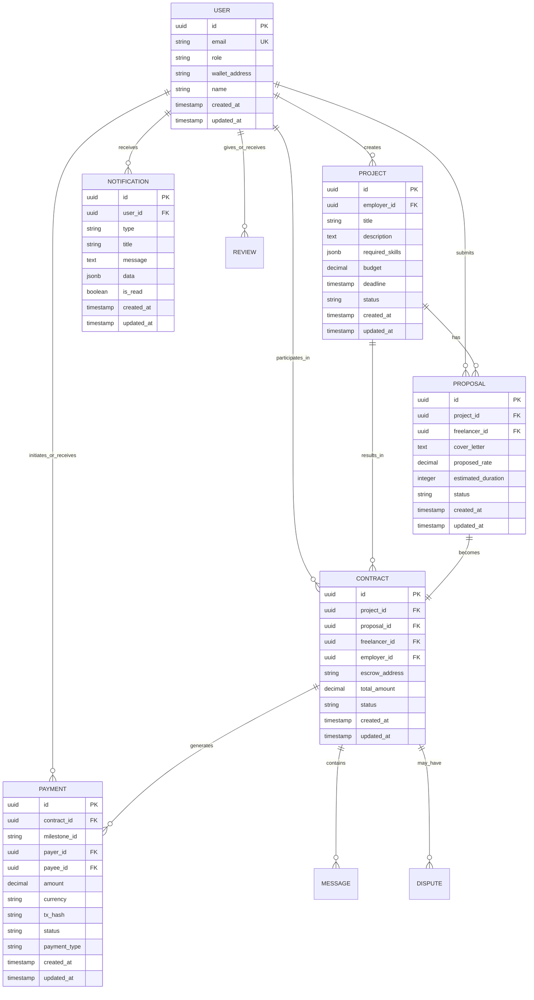
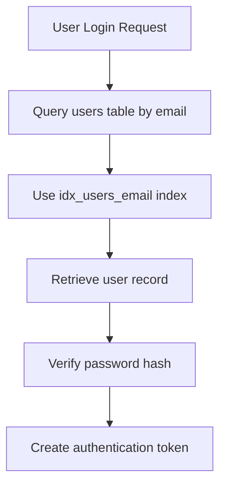
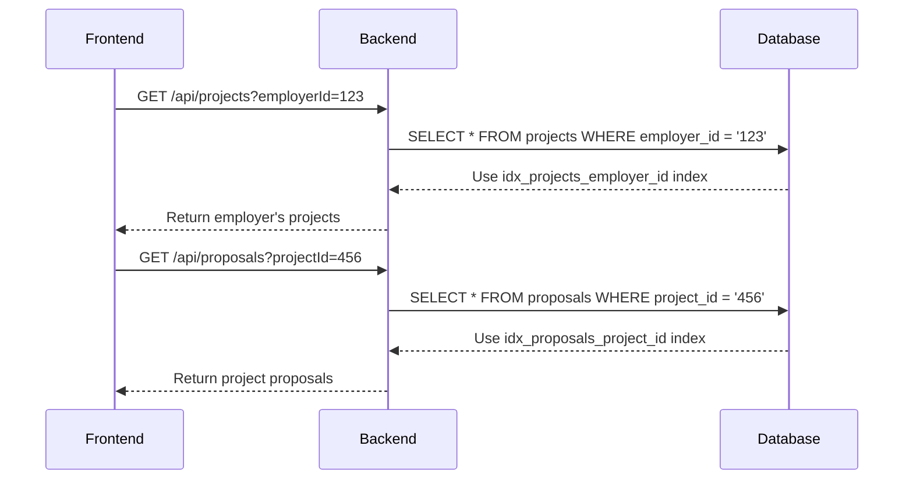
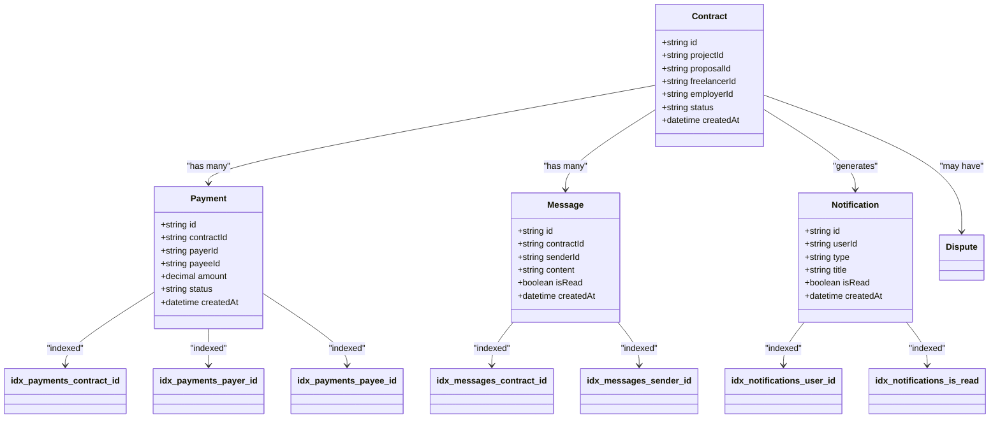

# Indexing Strategy

<cite>
**Referenced Files in This Document**   
- [schema.sql](file://supabase/schema.sql)
- [user-repository.ts](file://src/repositories/user-repository.ts)
- [project-repository.ts](file://src/repositories/project-repository.ts)
- [proposal-repository.ts](file://src/repositories/proposal-repository.ts)
- [notification-repository.ts](file://src/repositories/notification-repository.ts)
- [contract-repository.ts](file://src/repositories/contract-repository.ts)
- [payment-repository.ts](file://src/repositories/payment-repository.ts)
- [message-repository.ts](file://src/repositories/message-repository.ts)
- [base-repository.ts](file://src/repositories/base-repository.ts)
- [supabase.ts](file://src/config/supabase.ts)
</cite>

## Table of Contents
1. [Introduction](#introduction)
2. [Indexing Strategy Overview](#indexing-strategy-overview)
3. [Core Indexes and Query Patterns](#core-indexes-and-query-patterns)
4. [Performance Benefits](#performance-benefits)
5. [Trade-offs and Considerations](#trade-offs-and-considerations)
6. [Monitoring and Optimization](#monitoring-and-optimization)
7. [Conclusion](#conclusion)

## Introduction
The FreelanceXchain platform implements a comprehensive indexing strategy to optimize database query performance across its core entities. This document details the indexing approach used in the Supabase PostgreSQL database, focusing on how indexes support common query patterns in the freelance marketplace. The indexing strategy balances read performance optimization with write overhead considerations, ensuring efficient data retrieval for user-facing operations while maintaining data integrity and write performance.

## Indexing Strategy Overview

The database schema implements a targeted indexing strategy focused on foreign key relationships, frequently queried attributes, and common access patterns. All indexes are created using PostgreSQL's B-tree structure, which provides efficient equality and range queries on the indexed columns.

**Diagram sources**
- [schema.sql](file://supabase/schema.sql#L8-L223)

**Section sources**
- [schema.sql](file://supabase/schema.sql#L8-L223)

## Core Indexes and Query Patterns

The indexing strategy targets the most common query patterns in the FreelanceXchain application, with indexes created on foreign keys and frequently filtered columns. Each index supports specific business operations and API endpoints.

### User and Authentication Indexes
The `idx_users_email` index on the users table enables efficient user lookup during authentication and account management operations. This unique index supports the critical path of user login and session creation.

**Diagram sources**
- [schema.sql](file://supabase/schema.sql#L203)
- [user-repository.ts](file://src/repositories/user-repository.ts#L28-L41)

**Section sources**
- [schema.sql](file://supabase/schema.sql#L203)
- [user-repository.ts](file://src/repositories/user-repository.ts#L28-L41)

### Project and Proposal Indexes
The platform implements indexes on foreign keys for projects, proposals, and related entities to support the core marketplace functionality. The `idx_projects_employer_id` index enables efficient retrieval of all projects created by a specific employer, while `idx_proposals_project_id` supports fetching all proposals for a given project.

**Diagram sources**
- [schema.sql](file://supabase/schema.sql#L206-L209)
- [project-repository.ts](file://src/repositories/project-repository.ts#L55-L74)
- [proposal-repository.ts](file://src/repositories/proposal-repository.ts#L39-L58)

**Section sources**
- [schema.sql](file://supabase/schema.sql#L206-L209)
- [project-repository.ts](file://src/repositories/project-repository.ts#L55-L74)
- [proposal-repository.ts](file://src/repositories/proposal-repository.ts#L39-L58)

### Contract and Transaction Indexes
The indexing strategy includes comprehensive coverage of contract-related entities to support the platform's transactional workflows. Indexes on foreign keys for contracts, disputes, notifications, payments, and messages ensure efficient retrieval of related records for a given contract or user.

**Diagram sources**
- [schema.sql](file://supabase/schema.sql#L210-L223)
- [contract-repository.ts](file://src/repositories/contract-repository.ts#L41-L81)
- [payment-repository.ts](file://src/repositories/payment-repository.ts#L38-L57)
- [message-repository.ts](file://src/repositories/message-repository.ts#L18-L37)

**Section sources**
- [schema.sql](file://supabase/schema.sql#L210-L223)
- [contract-repository.ts](file://src/repositories/contract-repository.ts#L41-L81)
- [payment-repository.ts](file://src/repositories/payment-repository.ts#L38-L57)
- [message-repository.ts](file://src/repositories/message-repository.ts#L18-L37)

## Performance Benefits

The implemented indexing strategy provides significant performance improvements for common query patterns in the FreelanceXchain application. By creating indexes on foreign key columns and frequently filtered attributes, the database can efficiently locate records without performing full table scans.

For example, when retrieving all projects posted by a specific employer, the `idx_projects_employer_id` index allows PostgreSQL to quickly locate the relevant rows using an index scan rather than examining every row in the projects table. Similarly, when fetching all proposals for a specific project, the `idx_proposals_project_id` index enables efficient filtering.

The `idx_notifications_user_id` and `idx_notifications_is_read` indexes work together to optimize notification retrieval, particularly for queries that filter by both user and read status. This compound filtering pattern is common in the application's notification center, where users typically want to see their unread notifications.

The indexing strategy also supports efficient pagination through the use of ordered indexes. When retrieving paginated results sorted by creation date (as seen in the repository methods), PostgreSQL can use the index to quickly locate the starting point for each page, reducing the need for expensive sorting operations.

## Trade-offs and Considerations

While the indexing strategy provides substantial read performance benefits, it introduces several trade-offs that must be considered:

1. **Write Performance Overhead**: Each index adds overhead to INSERT, UPDATE, and DELETE operations, as the database must maintain the index structure in addition to the table data. This overhead increases with the number of indexes and the frequency of write operations.

2. **Storage Requirements**: Indexes consume additional disk space. In PostgreSQL, indexes are typically smaller than the tables they index, but they still represent a significant storage cost, especially for large tables with many indexes.

3. **Index Maintenance**: As data changes, indexes must be updated to reflect the current state. This maintenance occurs automatically but can impact overall database performance during periods of high write activity.

4. **Query Planner Complexity**: A large number of indexes can make it more difficult for the PostgreSQL query planner to select the optimal execution plan, potentially leading to suboptimal performance in some cases.

The current indexing strategy balances these trade-offs by focusing on the most critical query patterns while avoiding over-indexing. The indexes are concentrated on foreign key relationships and frequently filtered columns, which represent the most common access patterns in the application.

## Monitoring and Optimization

To ensure the continued effectiveness of the indexing strategy, the following PostgreSQL tools and techniques should be used for monitoring and optimization:

1. **EXPLAIN and EXPLAIN ANALYZE**: These commands provide insight into query execution plans, showing which indexes are being used and identifying potential performance bottlenecks.

2. **pg_stat_user_indexes**: This system view provides statistics on index usage, including the number of scans and tuple reads, helping to identify unused or underutilized indexes.

3. **pg_stat_statements**: This extension tracks execution statistics for all SQL statements executed by the server, enabling identification of slow queries that might benefit from additional indexing.

4. **Index Size Monitoring**: Regularly monitoring the size of indexes helps ensure they remain within acceptable limits and don't consume excessive storage.

Additional indexes might be needed based on evolving query patterns, such as:
- Composite indexes for common multi-column queries
- Partial indexes for queries that filter on specific subsets of data
- Indexes on frequently sorted columns when pagination is used

When considering new indexes, the following factors should be evaluated:
- Frequency and importance of the query pattern
- Selectivity of the indexed column(s)
- Impact on write performance
- Storage requirements

## Conclusion
The FreelanceXchain database indexing strategy effectively optimizes query performance for the platform's core functionality. By focusing on foreign key relationships and common access patterns, the indexes support efficient data retrieval for user-facing operations while maintaining reasonable write performance. The strategy balances read optimization with the inherent trade-offs of index maintenance overhead and storage requirements. Ongoing monitoring using PostgreSQL's built-in tools will ensure the indexing strategy continues to meet the platform's performance needs as usage patterns evolve.