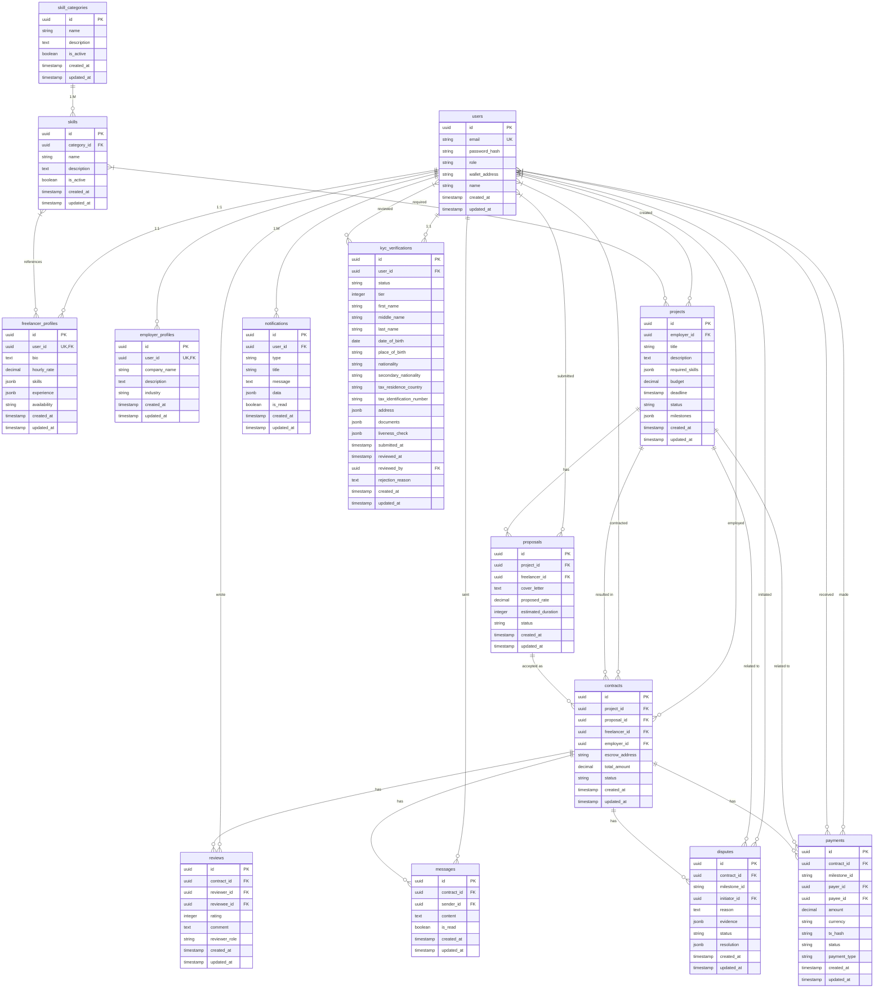
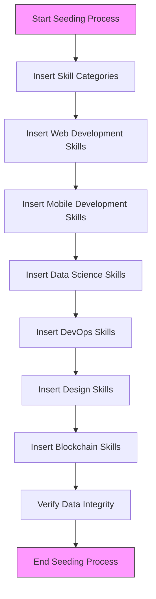

# Database Schema Design

<cite>
**Referenced Files in This Document**   
- [schema.sql](file://supabase/schema.sql)
- [seed-skills.sql](file://supabase/seed-skills.sql)
- [entity-mapper.ts](file://src/utils/entity-mapper.ts)
- [supabase.ts](file://src/config/supabase.ts)
</cite>

## Table of Contents
1. [Introduction](#introduction)
2. [Core Tables](#core-tables)
3. [Entity-Relationship Diagram](#entity-relationship-diagram)
4. [Indexing Strategy](#indexing-strategy)
5. [Row Level Security Policies](#row-level-security-policies)
6. [Data Seeding Process](#data-seeding-process)
7. [Database Performance Considerations](#database-performance-considerations)
8. [Conclusion](#conclusion)

## Introduction

The FreelanceXchain platform utilizes a Supabase PostgreSQL database to store all application data, providing a robust foundation for the blockchain-based freelance marketplace. The database schema is designed to support key features including user management, project lifecycle, contract execution, payment processing, and dispute resolution. This document provides comprehensive documentation of the database schema, detailing all tables, their relationships, indexing strategy, security policies, and performance considerations.

The schema implements a relational model with UUID primary keys for all tables, ensuring global uniqueness and preventing enumeration attacks. JSONB columns are strategically used for flexible data storage where schema flexibility is required, such as storing skills, experience, and milestone data. Row Level Security (RLS) is enabled on all tables to enforce data access controls based on user roles and ownership, providing a secure multi-tenant environment.

**Section sources**
- [schema.sql](file://supabase/schema.sql#L1-L261)

## Core Tables

### Users Table
The `users` table serves as the central identity management system for the platform, storing core user information and authentication data. Each user is assigned a role that determines their permissions and access to platform features.

**Table: users**
| Column | Type | Constraints | Description |
|-------|------|-------------|-------------|
| id | UUID | PRIMARY KEY, DEFAULT uuid_generate_v4() | Unique identifier for the user |
| email | VARCHAR(255) | UNIQUE, NOT NULL | User's email address used for authentication |
| password_hash | VARCHAR(255) | NOT NULL | Hashed password for secure authentication |
| role | VARCHAR(20) | NOT NULL, CHECK constraint | User role: freelancer, employer, or admin |
| wallet_address | VARCHAR(255) | DEFAULT '' | Blockchain wallet address for transactions |
| name | VARCHAR(255) | DEFAULT '' | User's display name |
| created_at | TIMESTAMPTZ | DEFAULT NOW() | Timestamp of record creation |
| updated_at | TIMESTAMPTZ | DEFAULT NOW() | Timestamp of last record update |

**Section sources**
- [schema.sql](file://supabase/schema.sql#L8-L17)

### Skill Categories and Skills Tables
The `skill_categories` and `skills` tables form a hierarchical taxonomy of professional skills, enabling AI-powered matching between freelancers and projects. This two-level hierarchy allows for organized skill classification while maintaining flexibility for future expansion.

**Table: skill_categories**
| Column | Type | Constraints | Description |
|-------|------|-------------|-------------|
| id | UUID | PRIMARY KEY, DEFAULT uuid_generate_v4() | Unique identifier for the category |
| name | VARCHAR(255) | NOT NULL | Name of the skill category |
| description | TEXT | | Detailed description of the category |
| is_active | BOOLEAN | DEFAULT true | Flag indicating if category is active |
| created_at | TIMESTAMPTZ | DEFAULT NOW() | Timestamp of record creation |
| updated_at | TIMESTAMPTZ | DEFAULT NOW() | Timestamp of last record update |

**Table: skills**
| Column | Type | Constraints | Description |
|-------|------|-------------|-------------|
| id | UUID | PRIMARY KEY, DEFAULT uuid_generate_v4() | Unique identifier for the skill |
| category_id | UUID | REFERENCES skill_categories(id) ON DELETE CASCADE | Foreign key to parent category |
| name | VARCHAR(255) | NOT NULL | Name of the skill |
| description | TEXT | | Detailed description of the skill |
| is_active | BOOLEAN | DEFAULT true | Flag indicating if skill is active |
| created_at | TIMESTAMPTZ | DEFAULT NOW() | Timestamp of record creation |
| updated_at | TIMESTAMPTZ | DEFAULT NOW() | Timestamp of last record update |

**Section sources**
- [schema.sql](file://supabase/schema.sql#L19-L38)

### Freelancer and Employer Profiles Tables
The `freelancer_profiles` and `employer_profiles` tables store detailed information about platform participants, extending the basic user data with role-specific attributes. These profiles are essential for the matching algorithm and user discovery features.

**Table: freelancer_profiles**
| Column | Type | Constraints | Description |
|-------|------|-------------|-------------|
| id | UUID | PRIMARY KEY, DEFAULT uuid_generate_v4() | Unique identifier for the profile |
| user_id | UUID | UNIQUE, REFERENCES users(id) ON DELETE CASCADE | Foreign key to associated user |
| bio | TEXT | | Freelancer's biography and introduction |
| hourly_rate | DECIMAL(10, 2) | DEFAULT 0 | Preferred hourly rate for work |
| skills | JSONB | DEFAULT '[]' | Array of skills with experience level |
| experience | JSONB | DEFAULT '[]' | Array of work experience entries |
| availability | VARCHAR(20) | DEFAULT 'available', CHECK constraint | Current availability status |
| created_at | TIMESTAMPTZ | DEFAULT NOW() | Timestamp of record creation |
| updated_at | TIMESTAMPTZ | DEFAULT NOW() | Timestamp of last record update |

**Table: employer_profiles**
| Column | Type | Constraints | Description |
|-------|------|-------------|-------------|
| id | UUID | PRIMARY KEY, DEFAULT uuid_generate_v4() | Unique identifier for the profile |
| user_id | UUID | UNIQUE, REFERENCES users(id) ON DELETE CASCADE | Foreign key to associated user |
| company_name | VARCHAR(255) | | Name of the employer's company |
| description | TEXT | | Company description and background |
| industry | VARCHAR(255) | | Industry sector of the company |
| created_at | TIMESTAMPTZ | DEFAULT NOW() | Timestamp of record creation |
| updated_at | TIMESTAMPTZ | DEFAULT NOW() | Timestamp of last record update |

**Section sources**
- [schema.sql](file://supabase/schema.sql#L40-L62)

### Projects, Proposals, and Contracts Tables
These interconnected tables manage the core workflow of the platform, from project creation through proposal submission to contract execution. They form the foundation of the freelance engagement lifecycle.

**Table: projects**
| Column | Type | Constraints | Description |
|-------|------|-------------|-------------|
| id | UUID | PRIMARY KEY, DEFAULT uuid_generate_v4() | Unique identifier for the project |
| employer_id | UUID | REFERENCES users(id) ON DELETE CASCADE | Foreign key to creating employer |
| title | VARCHAR(255) | NOT NULL | Project title |
| description | TEXT | | Detailed project description |
| required_skills | JSONB | DEFAULT '[]' | Array of required skills for the project |
| budget | DECIMAL(12, 2) | DEFAULT 0 | Project budget in ETH |
| deadline | TIMESTAMPTZ | | Project completion deadline |
| status | VARCHAR(20) | DEFAULT 'draft', CHECK constraint | Current project status |
| milestones | JSONB | DEFAULT '[]' | Array of project milestones |
| created_at | TIMESTAMPTZ | DEFAULT NOW() | Timestamp of record creation |
| updated_at | TIMESTAMPTZ | DEFAULT NOW() | Timestamp of last record update |

**Table: proposals**
| Column | Type | Constraints | Description |
|-------|------|-------------|-------------|
| id | UUID | PRIMARY KEY, DEFAULT uuid_generate_v4() | Unique identifier for the proposal |
| project_id | UUID | REFERENCES projects(id) ON DELETE CASCADE | Foreign key to target project |
| freelancer_id | UUID | REFERENCES users(id) ON DELETE CASCADE | Foreign key to submitting freelancer |
| cover_letter | TEXT | | Proposal cover letter |
| proposed_rate | DECIMAL(10, 2) | DEFAULT 0 | Rate proposed by freelancer |
| estimated_duration | INTEGER | DEFAULT 0 | Estimated completion time in days |
| status | VARCHAR(20) | DEFAULT 'pending', CHECK constraint | Current proposal status |
| created_at | TIMESTAMPTZ | DEFAULT NOW() | Timestamp of record creation |
| updated_at | TIMESTAMPTZ | DEFAULT NOW() | Timestamp of last record update |
| UNIQUE(project_id, freelancer_id) | | | Prevents duplicate proposals |

**Table: contracts**
| Column | Type | Constraints | Description |
|-------|------|-------------|-------------|
| id | UUID | PRIMARY KEY, DEFAULT uuid_generate_v4() | Unique identifier for the contract |
| project_id | UUID | REFERENCES projects(id) ON DELETE CASCADE | Foreign key to source project |
| proposal_id | UUID | REFERENCES proposals(id) ON DELETE CASCADE | Foreign key to accepted proposal |
| freelancer_id | UUID | REFERENCES users(id) ON DELETE CASCADE | Foreign key to contracted freelancer |
| employer_id | UUID | REFERENCES users(id) ON DELETE CASCADE | Foreign key to contracting employer |
| escrow_address | VARCHAR(255) | | Blockchain address for escrow funds |
| total_amount | DECIMAL(12, 2) | DEFAULT 0 | Total contract value in ETH |
| status | VARCHAR(20) | DEFAULT 'active', CHECK constraint | Current contract status |
| created_at | TIMESTAMPTZ | DEFAULT NOW() | Timestamp of record creation |
| updated_at | TIMESTAMPTZ | DEFAULT NOW() | Timestamp of last record update |

**Section sources**
- [schema.sql](file://supabase/schema.sql#L65-L106)

### Disputes, Payments, and Reviews Tables
These tables handle post-contract activities including dispute resolution, payment processing, and reputation management. They ensure transparency and accountability in all transactions.

**Table: disputes**
| Column | Type | Constraints | Description |
|-------|------|-------------|-------------|
| id | UUID | PRIMARY KEY, DEFAULT uuid_generate_v4() | Unique identifier for the dispute |
| contract_id | UUID | REFERENCES contracts(id) ON DELETE CASCADE | Foreign key to disputed contract |
| milestone_id | VARCHAR(255) | | Identifier of disputed milestone |
| initiator_id | UUID | REFERENCES users(id) ON DELETE CASCADE | Foreign key to user initiating dispute |
| reason | TEXT | | Detailed reason for the dispute |
| evidence | JSONB | DEFAULT '[]' | Array of evidence supporting the dispute |
| status | VARCHAR(20) | DEFAULT 'open', CHECK constraint | Current dispute status |
| resolution | JSONB | | Resolution details when resolved |
| created_at | TIMESTAMPTZ | DEFAULT NOW() | Timestamp of record creation |
| updated_at | TIMESTAMPTZ | DEFAULT NOW() | Timestamp of last record update |

**Table: payments**
| Column | Type | Constraints | Description |
|-------|------|-------------|-------------|
| id | UUID | PRIMARY KEY, DEFAULT uuid_generate_v4() | Unique identifier for the payment |
| contract_id | UUID | REFERENCES contracts(id) ON DELETE CASCADE | Foreign key to associated contract |
| milestone_id | VARCHAR(255) | | Identifier of milestone being paid |
| payer_id | UUID | REFERENCES users(id) ON DELETE CASCADE | Foreign key to user making payment |
| payee_id | UUID | REFERENCES users(id) ON DELETE CASCADE | Foreign key to user receiving payment |
| amount | DECIMAL(12, 2) | NOT NULL | Payment amount in ETH |
| currency | VARCHAR(10) | DEFAULT 'ETH' | Cryptocurrency used for payment |
| tx_hash | VARCHAR(255) | | Blockchain transaction hash |
| status | VARCHAR(20) | DEFAULT 'pending', CHECK constraint | Current payment status |
| payment_type | VARCHAR(20) | NOT NULL, CHECK constraint | Type of payment transaction |
| created_at | TIMESTAMPTZ | DEFAULT NOW() | Timestamp of record creation |
| updated_at | TIMESTAMPTZ | DEFAULT NOW() | Timestamp of last record update |

**Table: reviews**
| Column | Type | Constraints | Description |
|-------|------|-------------|-------------|
| id | UUID | PRIMARY KEY, DEFAULT uuid_generate_v4() | Unique identifier for the review |
| contract_id | UUID | REFERENCES contracts(id) ON DELETE CASCADE | Foreign key to reviewed contract |
| reviewer_id | UUID | REFERENCES users(id) ON DELETE CASCADE | Foreign key to user writing review |
| reviewee_id | UUID | REFERENCES users(id) ON DELETE CASCADE | Foreign key to user being reviewed |
| rating | INTEGER | NOT NULL, CHECK constraint (1-5) | Numerical rating (1-5 stars) |
| comment | TEXT | | Written feedback |
| reviewer_role | VARCHAR(20) | NOT NULL, CHECK constraint | Role of reviewer (freelancer/employer) |
| created_at | TIMESTAMPTZ | DEFAULT NOW() | Timestamp of record creation |
| updated_at | TIMESTAMPTZ | DEFAULT NOW() | Timestamp of last record update |
| UNIQUE(contract_id, reviewer_id) | | | Prevents duplicate reviews |

**Section sources**
- [schema.sql](file://supabase/schema.sql#L108-L173)

### Notifications and Messages Tables
These tables support communication and engagement features, ensuring users are informed of important events and can communicate with each other.

**Table: notifications**
| Column | Type | Constraints | Description |
|-------|------|-------------|-------------|
| id | UUID | PRIMARY KEY, DEFAULT uuid_generate_v4() | Unique identifier for the notification |
| user_id | UUID | REFERENCES users(id) ON DELETE CASCADE | Foreign key to recipient user |
| type | VARCHAR(50) | NOT NULL | Type of notification |
| title | VARCHAR(255) | NOT NULL | Notification title |
| message | TEXT | | Detailed notification message |
| data | JSONB | DEFAULT '{}' | Additional data payload |
| is_read | BOOLEAN | DEFAULT false | Read status indicator |
| created_at | TIMESTAMPTZ | DEFAULT NOW() | Timestamp of record creation |
| updated_at | TIMESTAMPTZ | DEFAULT NOW() | Timestamp of last record update |

**Table: messages**
| Column | Type | Constraints | Description |
|-------|------|-------------|-------------|
| id | UUID | PRIMARY KEY, DEFAULT uuid_generate_v4() | Unique identifier for the message |
| contract_id | UUID | REFERENCES contracts(id) ON DELETE CASCADE | Foreign key to related contract |
| sender_id | UUID | REFERENCES users(id) ON DELETE CASCADE | Foreign key to message sender |
| content | TEXT | NOT NULL | Message content |
| is_read | BOOLEAN | DEFAULT false | Read status indicator |
| created_at | TIMESTAMPTZ | DEFAULT NOW() | Timestamp of record creation |
| updated_at | TIMESTAMPTZ | DEFAULT NOW() | Timestamp of last record update |

**Section sources**
- [schema.sql](file://supabase/schema.sql#L122-L184)

### KYC Verifications Table
The `kyc_verifications` table manages the Know Your Customer (KYC) process, ensuring compliance with financial regulations and enhancing platform security.

**Table: kyc_verifications**
| Column | Type | Constraints | Description |
|-------|------|-------------|-------------|
| id | UUID | PRIMARY KEY, DEFAULT uuid_generate_v4() | Unique identifier for the verification |
| user_id | UUID | REFERENCES users(id) ON DELETE CASCADE | Foreign key to verified user |
| status | VARCHAR(20) | DEFAULT 'pending', CHECK constraint | Current verification status |
| tier | INTEGER | DEFAULT 1 | Verification tier level |
| first_name | VARCHAR(255) | | User's first name |
| middle_name | VARCHAR(255) | | User's middle name |
| last_name | VARCHAR(255) | | User's last name |
| date_of_birth | DATE | | User's date of birth |
| place_of_birth | VARCHAR(255) | | User's place of birth |
| nationality | VARCHAR(100) | | User's nationality |
| secondary_nationality | VARCHAR(100) | | User's secondary nationality |
| tax_residence_country | VARCHAR(100) | | User's tax residence country |
| tax_identification_number | VARCHAR(100) | | User's tax ID number |
| address | JSONB | DEFAULT '{}' | User's residential address |
| documents | JSONB | DEFAULT '[]' | Array of submitted document references |
| liveness_check | JSONB | | Liveness verification data |
| submitted_at | TIMESTAMPTZ | | Timestamp of submission |
| reviewed_at | TIMESTAMPTZ | | Timestamp of review completion |
| reviewed_by | UUID | REFERENCES users(id) | Foreign key to reviewing admin |
| rejection_reason | TEXT | | Reason for rejection if applicable |
| created_at | TIMESTAMPTZ | DEFAULT NOW() | Timestamp of record creation |
| updated_at | TIMESTAMPTZ | DEFAULT NOW() | Timestamp of last record update |

**Section sources**
- [schema.sql](file://supabase/schema.sql#L135-L159)

## Entity-Relationship Diagram



**Diagram sources**
- [schema.sql](file://supabase/schema.sql#L8-L261)

## Indexing Strategy

The database implements a comprehensive indexing strategy to optimize query performance for frequently accessed data patterns. Indexes are created on foreign key columns, status fields, and other commonly queried attributes to ensure efficient data retrieval.

```mermaid
graph TD
A[Indexing Strategy] --> B[Foreign Key Indexes]
A --> C[Status Indexes]
A --> D[User-Specific Indexes]
A --> E[Composite Indexes]
B --> B1[idx_freelancer_profiles_user_id]
B --> B2[idx_employer_profiles_user_id]
B --> B3[idx_projects_employer_id]
B --> B4[idx_proposals_project_id]
B --> B5[idx_proposals_freelancer_id]
B --> B6[idx_contracts_freelancer_id]
B --> B7[idx_contracts_employer_id]
B --> B8[idx_disputes_contract_id]
B --> B9[idx_notifications_user_id]
B --> B10[idx_kyc_user_id]
B --> B11[idx_skills_category_id]
B --> B12[idx_reviews_contract_id]
B --> B13[idx_reviews_reviewee_id]
B --> B14[idx_messages_contract_id]
B --> B15[idx_messages_sender_id]
B --> B16[idx_payments_contract_id]
B --> B17[idx_payments_payer_id]
B --> B18[idx_payments_payee_id]
C --> C1[idx_projects_status]
C --> C2[idx_notifications_is_read]
D --> D1[idx_users_email]
E --> E1[UNIQUE(project_id, freelancer_id)]
E --> E2[UNIQUE(contract_id, reviewer_id)]
```

The indexing strategy focuses on several key areas:

1. **Foreign Key Indexes**: All foreign key columns are indexed to optimize JOIN operations and ensure referential integrity checks are performed efficiently.

2. **Status Indexes**: Status columns are indexed to enable fast filtering of records by their current state (e.g., open projects, pending proposals).

3. **User-Specific Indexes**: User-related columns are indexed to support personalized queries, such as retrieving all notifications for a specific user.

4. **Composite Indexes**: Unique constraints are implemented as composite indexes to prevent duplicate entries in critical relationships.

The most critical indexes for query optimization include:
- `idx_users_email` for user authentication and lookup
- `idx_projects_status` for filtering projects by status (especially 'open' projects)
- `idx_skills_category_id` for retrieving all skills within a specific category
- `idx_proposals_project_id` for finding all proposals for a given project

**Section sources**
- [schema.sql](file://supabase/schema.sql#L202-L223)

## Row Level Security Policies

Row Level Security (RLS) is enabled on all tables to enforce data access controls based on user roles and ownership. This ensures that users can only access data they are authorized to view or modify, providing a secure multi-tenant environment.

```mermaid
graph TD
A[RLS Policies] --> B[Public Read Policies]
A --> C[Service Role Policies]
A --> D[Future Custom Policies]
B --> B1["Allow public read on skill_categories"]
B --> B2["Allow public read on skills"]
B --> B3["Allow public read on open projects"]
C --> C1["Service role full access users"]
C --> C2["Service role full access freelancer_profiles"]
C --> C3["Service role full access employer_profiles"]
C --> C4["Service role full access projects"]
C --> C5["Service role full access proposals"]
C --> C6["Service role full access contracts"]
C --> C7["Service role full access disputes"]
C --> C8["Service role full access notifications"]
C --> C9["Service role full access kyc_verifications"]
C --> C10["Service role full access skills"]
C --> C11["Service role full access skill_categories"]
C --> C12["Service role full access reviews"]
C --> C13["Service role full access messages"]
C --> C14["Service role full access payments"]
D --> D1[Custom policies for user-owned data]
D --> D2[Role-based access controls]
```



The current RLS policy implementation includes:

1. **Public Read Policies**: Certain data is made publicly accessible to support platform functionality:
   - Skill categories and skills can be read by anyone to enable skill selection and display
   - Open projects can be viewed by all users to facilitate discovery

2. **Service Role Policies**: A service role with full access to all tables is established for backend operations:
   - The application backend can perform all CRUD operations on all tables
   - This enables the API to manage data on behalf of users while maintaining security

3. **Future Custom Policies**: The current implementation provides a foundation for more granular policies:
   - User-owned data (profiles, notifications) will be accessible only to the owner
   - Contract-related data will be accessible only to the involved parties
   - Administrative functions will be restricted to users with appropriate roles

The RLS policies are implemented using PostgreSQL's native Row Level Security feature, which evaluates policies for every row accessed by a query. This ensures that unauthorized data access is prevented at the database level, providing a robust security boundary.

**Section sources**
- [schema.sql](file://supabase/schema.sql#L225-L260)

## Data Seeding Process

The initial skill categories and skills are seeded into the database using the `seed-skills.sql` script. This process establishes the foundational taxonomy used for AI-powered matching and user profile management.



The seeding process follows these steps:

1. **Insert Skill Categories**: Six core skill categories are inserted with predefined UUIDs:
   - Web Development
   - Mobile Development
   - Data Science
   - DevOps
   - Design
   - Blockchain

2. **Insert Skills by Category**: Skills are inserted for each category, establishing the relationship through the `category_id` foreign key:
   - Web Development: TypeScript, JavaScript, React, Node.js, Vue.js, Angular, Next.js, Express.js, HTML/CSS, Tailwind CSS
   - Mobile Development: React Native, Flutter, Swift, Kotlin
   - Data Science: Python, Machine Learning, TensorFlow, SQL
   - DevOps: Docker, Kubernetes, AWS, CI/CD
   - Design: Figma, UI/UX Design, Adobe XD
   - Blockchain: Solidity, Ethereum, Web3.js, Hardhat

3. **Handle Conflicts**: The `ON CONFLICT (id) DO NOTHING` clause ensures that the seeding process is idempotent, preventing errors if the script is run multiple times.

4. **Verify Data Integrity**: A verification query confirms that all categories and their associated skills have been correctly inserted.

The predefined UUIDs ensure consistency across different environments (development, staging, production) and prevent issues with foreign key references in application code that may reference specific skill IDs.

**Section sources**
- [seed-skills.sql](file://supabase/seed-skills.sql#L1-L75)

## Database Performance Considerations

The database schema and configuration are optimized for performance in a high-traffic freelance marketplace environment. Several strategies are employed to ensure responsive queries and efficient data processing.

### Connection Pooling
The application utilizes Supabase's built-in connection pooling to manage database connections efficiently. This reduces the overhead of establishing new connections for each request and prevents connection exhaustion under high load.

### Query Optimization
The indexing strategy (documented in the Indexing Strategy section) is designed to optimize the most common query patterns, particularly:
- User authentication and profile retrieval
- Project discovery and filtering
- Contract and payment history lookup
- Notification retrieval

### Data Modeling Choices
Several data modeling decisions contribute to performance:
- **UUID Primary Keys**: While slightly larger than integer keys, UUIDs provide global uniqueness and prevent enumeration attacks.
- **JSONB Columns**: Used for flexible data storage where schema evolution is expected, such as skills, experience, and milestone data. These columns are indexed when necessary for querying.
- **Appropriate Data Types**: Numeric values use DECIMAL types for precise financial calculations, while timestamps use TIMESTAMPTZ for timezone-aware storage.

### Future Optimization Opportunities
Potential performance improvements include:
- **Partial Indexes**: Creating indexes on subsets of data (e.g., only active skills) to reduce index size
- **Materialized Views**: For complex queries that aggregate data across multiple tables
- **Partitioning**: For tables that are expected to grow very large, such as notifications and payments

### Monitoring and Maintenance
Regular database maintenance should include:
- Monitoring query performance using Supabase's analytics tools
- Reviewing and optimizing slow queries
- Updating table statistics to ensure optimal query planning
- Managing index bloat and vacuuming tables as needed

**Section sources**
- [schema.sql](file://supabase/schema.sql#L1-L261)
- [supabase.ts](file://src/config/supabase.ts#L1-L45)

## Conclusion

The FreelanceXchain database schema provides a robust foundation for a blockchain-based freelance marketplace with AI-powered skill matching. The relational model effectively captures the complex relationships between users, projects, contracts, and payments, while incorporating modern database features like JSONB storage and Row Level Security.

Key strengths of the schema design include:
- Comprehensive data model covering all aspects of the freelance lifecycle
- Strategic use of UUIDs for global uniqueness and security
- Flexible JSONB columns for evolving data requirements
- Robust security through Row Level Security policies
- Optimized indexing for common query patterns

The schema is well-positioned to support the platform's growth and evolving requirements, with clear pathways for future enhancements such as more granular RLS policies, advanced indexing strategies, and performance optimizations. By combining relational integrity with flexible NoSQL-like features, the database strikes an effective balance between structure and adaptability.

**Section sources**
- [schema.sql](file://supabase/schema.sql#L1-L261)
- [seed-skills.sql](file://supabase/seed-skills.sql#L1-L75)
- [entity-mapper.ts](file://src/utils/entity-mapper.ts#L1-L412)