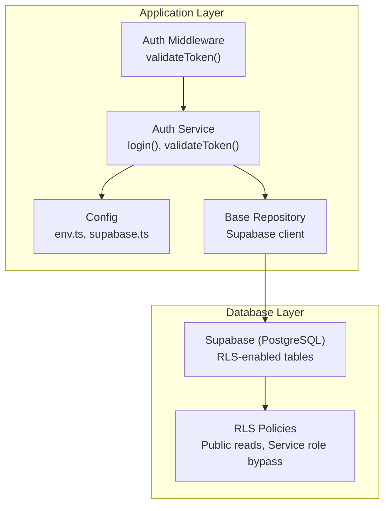
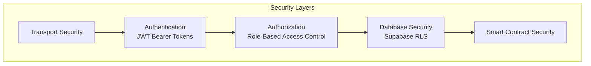
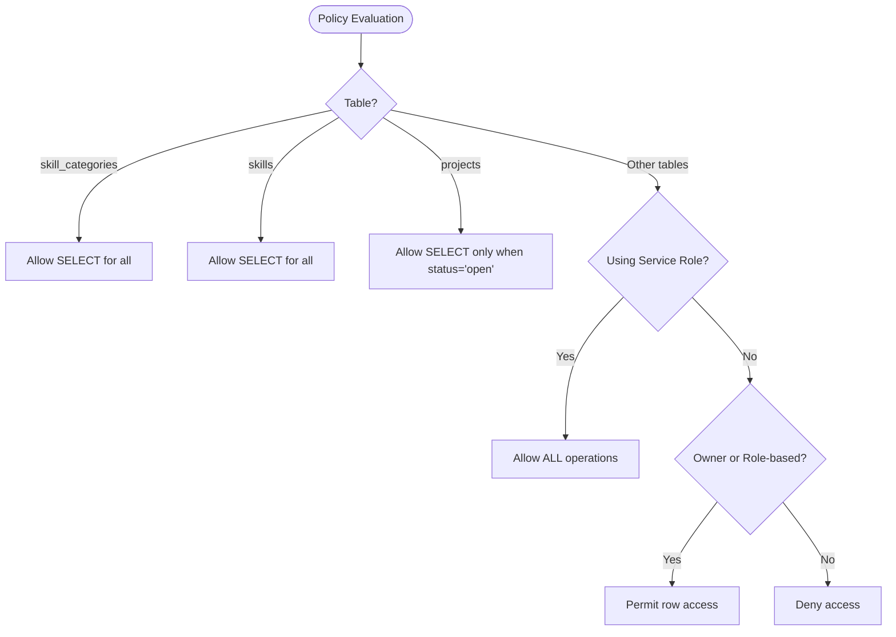
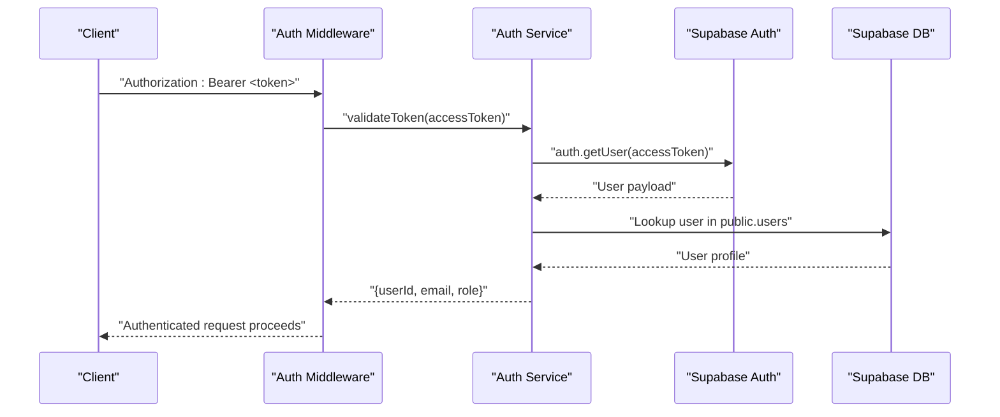
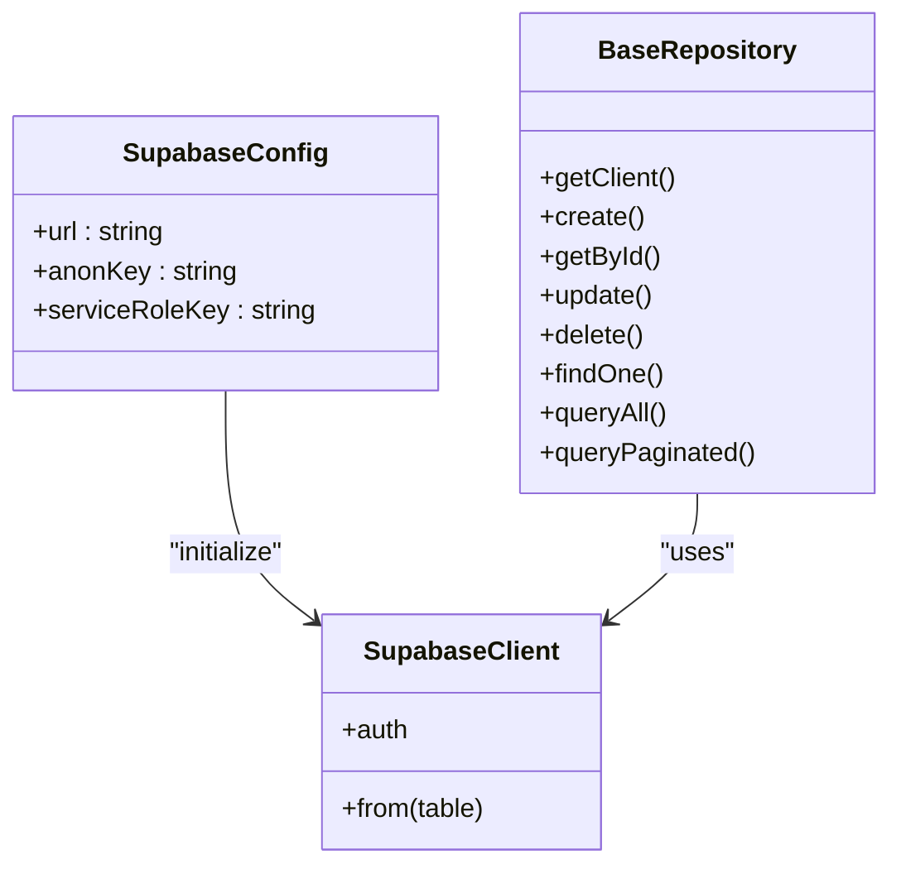
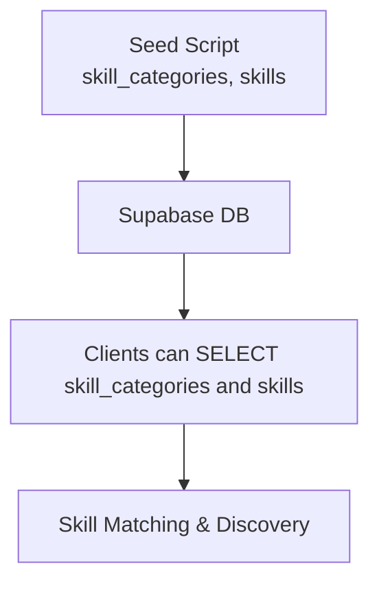
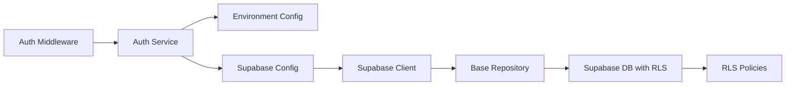

# Row Level Security

<cite>
**Referenced Files in This Document**
- [schema.sql](file://supabase/schema.sql)
- [ARCHITECTURE.md](file://docs/ARCHITECTURE.md)
- [auth-middleware.ts](file://src/middleware/auth-middleware.ts)
- [auth-service.ts](file://src/services/auth-service.ts)
- [env.ts](file://src/config/env.ts)
- [supabase.ts](file://src/config/supabase.ts)
- [base-repository.ts](file://src/repositories/base-repository.ts)
- [seed-skills.sql](file://supabase/seed-skills.sql)
</cite>

## Table of Contents
1. [Introduction](#introduction)
2. [Project Structure](#project-structure)
3. [Core Components](#core-components)
4. [Architecture Overview](#architecture-overview)
5. [Detailed Component Analysis](#detailed-component-analysis)
6. [Dependency Analysis](#dependency-analysis)
7. [Performance Considerations](#performance-considerations)
8. [Troubleshooting Guide](#troubleshooting-guide)
9. [Conclusion](#conclusion)

## Introduction
This document explains the Row Level Security (RLS) implementation in the FreelanceXchain database. It describes how RLS policies are enabled on all tables via ALTER TABLE statements, outlines the public read policies for skill categories, skills, and open projects, and details the service role bypass policies that allow the backend application to perform administrative operations. It also explains how the Supabase authentication layer integrates with the application’s role-based access control to enforce data access restrictions based on user roles and ownership.

## Project Structure
RLS is defined in the database schema and enforced by Supabase. The application’s authentication and authorization middleware validate tokens and roles, while repositories and services interact with Supabase using the Supabase client. The architecture diagram in the documentation shows how authentication and RLS fit into the overall security layers.

**Diagram sources**
- [auth-middleware.ts](file://src/middleware/auth-middleware.ts#L1-L101)
- [auth-service.ts](file://src/services/auth-service.ts#L233-L259)
- [env.ts](file://src/config/env.ts#L41-L67)
- [supabase.ts](file://src/config/supabase.ts#L1-L45)
- [base-repository.ts](file://src/repositories/base-repository.ts#L1-L149)
- [schema.sql](file://supabase/schema.sql#L225-L261)

**Section sources**
- [schema.sql](file://supabase/schema.sql#L225-L261)
- [ARCHITECTURE.md](file://docs/ARCHITECTURE.md#L183-L218)

## Core Components
- RLS enablement: All tables have RLS enabled via ALTER TABLE commands in the schema.
- Public read policies: skill_categories and skills allow SELECT for all users; projects allow SELECT only when status equals open.
- Service role bypass: A policy allows full access to all tables for the Supabase service role, enabling backend operations.

These policies are defined in the database schema and enforced by Supabase.

**Section sources**
- [schema.sql](file://supabase/schema.sql#L225-L261)

## Architecture Overview
The system enforces layered security:
- Transport security (HTTPS/TLS)
- Authentication (JWT bearer tokens)
- Authorization (role-based access control)
- Database security (Supabase RLS)
- Smart contract security (blockchain layer)

RLS sits alongside the Supabase auth layer to restrict row-level access based on policies.

**Diagram sources**
- [ARCHITECTURE.md](file://docs/ARCHITECTURE.md#L183-L218)

**Section sources**
- [ARCHITECTURE.md](file://docs/ARCHITECTURE.md#L183-L218)

## Detailed Component Analysis

### RLS Policy Definitions
- Enable RLS on all tables: The schema enables RLS on users, profiles, projects, proposals, contracts, disputes, notifications, KYC verifications, skills, skill categories, reviews, messages, and payments.
- Public read policies:
  - skill_categories: SELECT is permitted for everyone.
  - skills: SELECT is permitted for everyone.
  - projects: SELECT is permitted when status equals open.
- Service role bypass: ALL operations are permitted for the service role on all tables.

These policies ensure:
- Public discovery of categories and skills.
- Controlled exposure of open projects.
- Backend operations requiring elevated privileges.

**Diagram sources**
- [schema.sql](file://supabase/schema.sql#L225-L261)

**Section sources**
- [schema.sql](file://supabase/schema.sql#L225-L261)

### Integration with Authentication and Authorization
- Application authentication validates JWT tokens and attaches user identity (userId, role) to requests.
- The auth middleware ensures requests carry a valid Bearer token and forwards validated user info downstream.
- The auth service retrieves user metadata from Supabase and constructs application-level user objects.

**Diagram sources**
- [auth-middleware.ts](file://src/middleware/auth-middleware.ts#L25-L70)
- [auth-service.ts](file://src/services/auth-service.ts#L233-L259)

**Section sources**
- [auth-middleware.ts](file://src/middleware/auth-middleware.ts#L1-L101)
- [auth-service.ts](file://src/services/auth-service.ts#L233-L259)

### Supabase Client and Service Role Key
- The Supabase client is initialized with the Supabase URL and anonymous key.
- The service role key is configured in environment variables and is intended for server-side use only.
- Repositories use the Supabase client to perform database operations.

**Diagram sources**
- [env.ts](file://src/config/env.ts#L41-L67)
- [supabase.ts](file://src/config/supabase.ts#L1-L45)
- [base-repository.ts](file://src/repositories/base-repository.ts#L1-L149)

**Section sources**
- [env.ts](file://src/config/env.ts#L41-L67)
- [supabase.ts](file://src/config/supabase.ts#L1-L45)
- [base-repository.ts](file://src/repositories/base-repository.ts#L1-L149)

### Public Data Exposure and Seed Data
- Public read policies allow clients to discover categories and skills without authentication.
- Seed data populates categories and skills for demonstration and matching workflows.

**Diagram sources**
- [seed-skills.sql](file://supabase/seed-skills.sql#L1-L75)
- [schema.sql](file://supabase/schema.sql#L241-L245)

**Section sources**
- [seed-skills.sql](file://supabase/seed-skills.sql#L1-L75)
- [schema.sql](file://supabase/schema.sql#L241-L245)

## Dependency Analysis
- RLS depends on Supabase’s policy engine and the Supabase client.
- Application middleware depends on the auth service to validate tokens and roles.
- Repositories depend on the Supabase client to perform CRUD operations; RLS policies apply to these operations server-side.

**Diagram sources**
- [auth-middleware.ts](file://src/middleware/auth-middleware.ts#L25-L70)
- [auth-service.ts](file://src/services/auth-service.ts#L233-L259)
- [env.ts](file://src/config/env.ts#L41-L67)
- [supabase.ts](file://src/config/supabase.ts#L1-L45)
- [base-repository.ts](file://src/repositories/base-repository.ts#L1-L149)
- [schema.sql](file://supabase/schema.sql#L225-L261)

**Section sources**
- [auth-middleware.ts](file://src/middleware/auth-middleware.ts#L1-L101)
- [auth-service.ts](file://src/services/auth-service.ts#L233-L259)
- [env.ts](file://src/config/env.ts#L41-L67)
- [supabase.ts](file://src/config/supabase.ts#L1-L45)
- [base-repository.ts](file://src/repositories/base-repository.ts#L1-L149)
- [schema.sql](file://supabase/schema.sql#L225-L261)

## Performance Considerations
- RLS evaluation occurs server-side during query execution; keep policies simple to minimize overhead.
- Indexes on frequently filtered columns (e.g., projects.status) improve query performance under RLS.
- Use pagination and selective column selection to reduce payload sizes.

[No sources needed since this section provides general guidance]

## Troubleshooting Guide
Common issues and resolutions:
- Unauthorized access to protected tables:
  - Ensure the request is made with a valid JWT issued by Supabase and that the user role aligns with the operation.
  - Confirm that RLS policies are enabled on the target table and that the service role bypass is not misapplied.
- Public read not working for categories/skills:
  - Verify the public read policies exist and that the client is not using an authenticated session that would trigger row-level filtering.
- Open projects visibility:
  - Confirm that the projects table uses the “open” status policy and that only records with status equal to open are returned.
- Service role bypass:
  - Ensure the service role key is configured server-side and used only for trusted backend operations.

**Section sources**
- [schema.sql](file://supabase/schema.sql#L225-L261)
- [auth-service.ts](file://src/services/auth-service.ts#L233-L259)
- [env.ts](file://src/config/env.ts#L41-L67)

## Conclusion
The FreelanceXchain database employs Supabase RLS to enforce fine-grained access control across all tables. Public read policies enable discovery of categories and skills and controlled exposure of open projects. A service role bypass policy permits backend operations while maintaining strict access controls for authenticated users. Together with the application’s JWT-based authentication and role-based authorization, RLS forms a robust, layered security model that protects sensitive data and prevents unauthorized access.