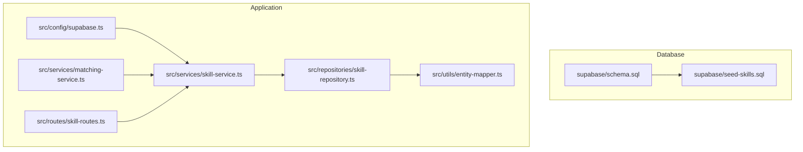
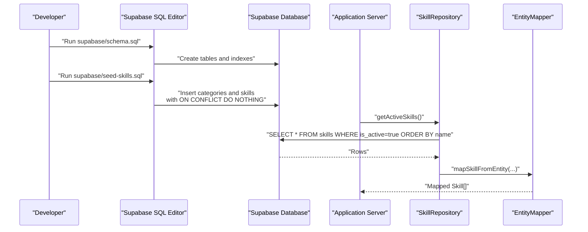
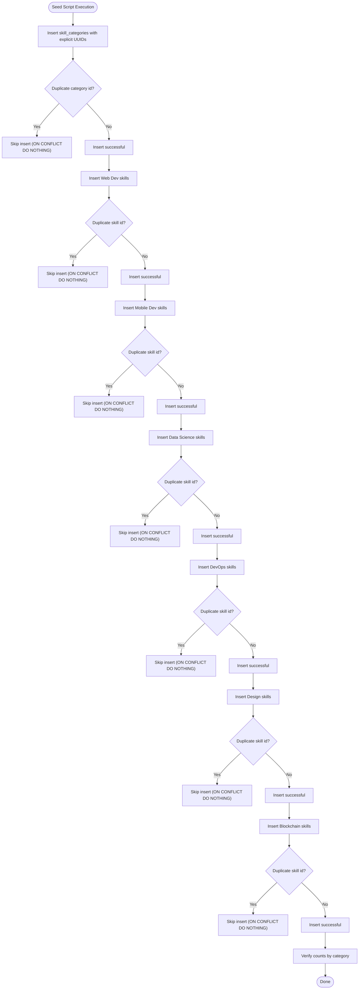
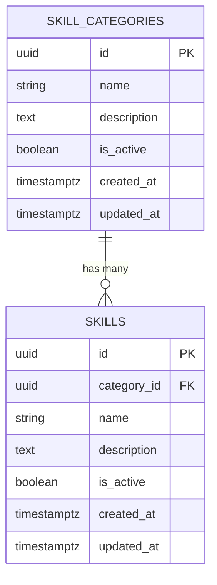
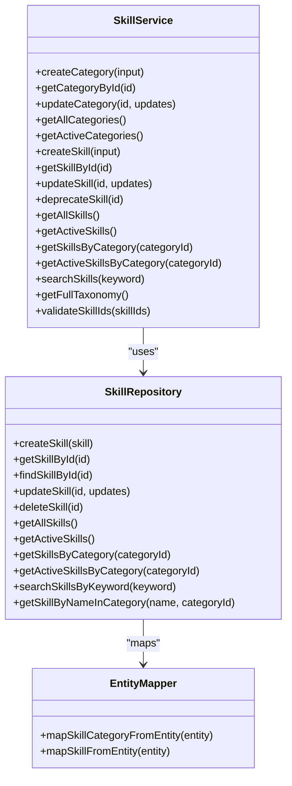
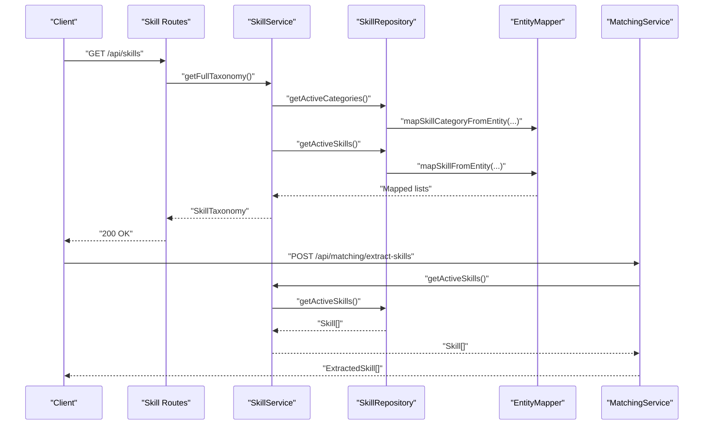
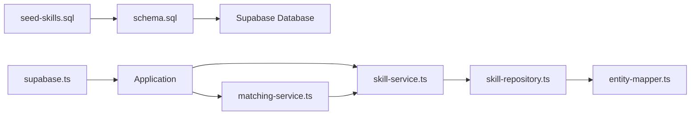

# Data Seeding

<cite>
**Referenced Files in This Document**
- [seed-skills.sql](file://supabase/seed-skills.sql)
- [schema.sql](file://supabase/schema.sql)
- [skill-service.ts](file://src/services/skill-service.ts)
- [skill-repository.ts](file://src/repositories/skill-repository.ts)
- [entity-mapper.ts](file://src/utils/entity-mapper.ts)
- [supabase.ts](file://src/config/supabase.ts)
- [README.md](file://README.md)
- [matching-service.ts](file://src/services/matching-service.ts)
- [skill-routes.ts](file://src/routes/skill-routes.ts)
</cite>

## Table of Contents
1. [Introduction](#introduction)
2. [Project Structure](#project-structure)
3. [Core Components](#core-components)
4. [Architecture Overview](#architecture-overview)
5. [Detailed Component Analysis](#detailed-component-analysis)
6. [Dependency Analysis](#dependency-analysis)
7. [Performance Considerations](#performance-considerations)
8. [Troubleshooting Guide](#troubleshooting-guide)
9. [Conclusion](#conclusion)

## Introduction
This document explains the data seeding process for initial database content in FreelanceXchain, focusing on the seed-skills.sql script that populates skill categories and skills for domains such as Web Development, Mobile Development, Data Science, DevOps, Design, and Blockchain. It details the use of UUIDs for stable identifiers, the ON CONFLICT DO NOTHING clause to prevent duplicates during repeated seeding, and the hierarchical relationship between categories and skills. It also describes how this seeded taxonomy supports the AI-powered matching system by providing a standardized vocabulary for freelancer skills and project requirements, and outlines when and how the seeding integrates with the database initialization workflow in development and production environments.

## Project Structure
The seeding and taxonomy-related components are organized as follows:
- Database schema and seed scripts live under supabase/.
- Application services and repositories that consume the taxonomy live under src/.

**Diagram sources**
- [schema.sql](file://supabase/schema.sql#L1-L261)
- [seed-skills.sql](file://supabase/seed-skills.sql#L1-L75)
- [supabase.ts](file://src/config/supabase.ts#L1-L45)
- [skill-service.ts](file://src/services/skill-service.ts#L1-L285)
- [skill-repository.ts](file://src/repositories/skill-repository.ts#L1-L127)
- [entity-mapper.ts](file://src/utils/entity-mapper.ts#L1-L120)
- [matching-service.ts](file://src/services/matching-service.ts#L1-L391)
- [skill-routes.ts](file://src/routes/skill-routes.ts#L70-L129)

**Section sources**
- [schema.sql](file://supabase/schema.sql#L1-L261)
- [seed-skills.sql](file://supabase/seed-skills.sql#L1-L75)
- [README.md](file://README.md#L102-L122)

## Core Components
- Seed script: Defines stable UUID identifiers for categories and skills, inserts predefined values, and uses ON CONFLICT DO NOTHING to avoid duplicates on repeated runs.
- Schema: Declares skill_categories and skills tables with UUID primary keys and foreign key relationships.
- Application services and repositories: Provide CRUD and taxonomy operations, including retrieving active skills and building hierarchical taxonomy for API clients.
- Matching service: Consumes the taxonomy to power AI skill matching, skill extraction, and skill gap analysis.

**Section sources**
- [seed-skills.sql](file://supabase/seed-skills.sql#L1-L75)
- [schema.sql](file://supabase/schema.sql#L19-L38)
- [skill-service.ts](file://src/services/skill-service.ts#L246-L285)
- [skill-repository.ts](file://src/repositories/skill-repository.ts#L48-L123)
- [entity-mapper.ts](file://src/utils/entity-mapper.ts#L47-L88)
- [matching-service.ts](file://src/services/matching-service.ts#L220-L269)

## Architecture Overview
The seeding process integrates with the database initialization workflow as follows:
- Developers run the schema.sql in the Supabase SQL Editor to create tables and enable extensions.
- After schema creation, developers run seed-skills.sql to populate categories and skills with stable UUIDs.
- The application’s Supabase client and repositories read the taxonomy to support skill management and AI matching.

**Diagram sources**
- [schema.sql](file://supabase/schema.sql#L1-L261)
- [seed-skills.sql](file://supabase/seed-skills.sql#L1-L75)
- [skill-repository.ts](file://src/repositories/skill-repository.ts#L48-L123)
- [entity-mapper.ts](file://src/utils/entity-mapper.ts#L78-L88)

## Detailed Component Analysis

### Seed Script: seed-skills.sql
- Purpose: Populate skill_categories and skills with predefined values for six domains.
- Stable identifiers: Uses explicit UUIDs for categories and skills to ensure consistent IDs across environments.
- Duplicate prevention: Uses ON CONFLICT (id) DO NOTHING to safely re-run the script without errors.
- Hierarchical structure: Each skill row references a category via category_id, establishing a parent-child relationship.
- Verification: Includes a SELECT that groups skills by category to confirm counts.

**Diagram sources**
- [seed-skills.sql](file://supabase/seed-skills.sql#L1-L75)

**Section sources**
- [seed-skills.sql](file://supabase/seed-skills.sql#L1-L75)

### Schema: supabase/schema.sql
- Enables UUID extension for generating stable identifiers.
- Declares skill_categories and skills tables with UUID primary keys.
- Defines foreign key relationship from skills.category_id to skill_categories.id with cascade delete.
- Adds indexes and Row Level Security policies, including public read access for skills and categories.

**Diagram sources**
- [schema.sql](file://supabase/schema.sql#L19-L38)

**Section sources**
- [schema.sql](file://supabase/schema.sql#L1-L261)

### Application Services and Repositories
- SkillRepository: Provides methods to retrieve skills by category, active skills, and search by keyword. It orders results by name and filters by is_active where applicable.
- SkillService: Exposes higher-level operations such as getFullTaxonomy(), which aggregates active categories with their active skills. It also validates skill IDs and exposes search with category names.
- EntityMapper: Converts database entities (snake_case) to API models (camelCase), including Skill and SkillCategory types.

**Diagram sources**
- [skill-repository.ts](file://src/repositories/skill-repository.ts#L1-L127)
- [skill-service.ts](file://src/services/skill-service.ts#L1-L285)
- [entity-mapper.ts](file://src/utils/entity-mapper.ts#L47-L88)

**Section sources**
- [skill-repository.ts](file://src/repositories/skill-repository.ts#L1-L127)
- [skill-service.ts](file://src/services/skill-service.ts#L211-L285)
- [entity-mapper.ts](file://src/utils/entity-mapper.ts#L47-L88)

### AI-Powered Matching Integration
- Skill taxonomy consumption: The matching service retrieves active skills to build a reference set for skill extraction and matching.
- Skill extraction and mapping: The matching service extracts skills from text and maps them to taxonomy IDs, using the active skill list as the controlled vocabulary.
- Recommendations: The matching service computes match scores using either AI or keyword-based methods, relying on the standardized taxonomy to compare freelancer and project skill sets.

**Diagram sources**
- [skill-routes.ts](file://src/routes/skill-routes.ts#L70-L129)
- [skill-service.ts](file://src/services/skill-service.ts#L246-L285)
- [skill-repository.ts](file://src/repositories/skill-repository.ts#L48-L123)
- [entity-mapper.ts](file://src/utils/entity-mapper.ts#L47-L88)
- [matching-service.ts](file://src/services/matching-service.ts#L220-L269)

**Section sources**
- [matching-service.ts](file://src/services/matching-service.ts#L220-L269)
- [skill-routes.ts](file://src/routes/skill-routes.ts#L70-L129)

## Dependency Analysis
- Database dependencies:
  - schema.sql defines tables and indexes; seed-skills.sql depends on these definitions.
  - ON CONFLICT DO NOTHING relies on unique constraints enforced by primary keys.
- Application dependencies:
  - SkillRepository depends on Supabase client configuration and table names.
  - SkillService depends on SkillRepository and EntityMapper.
  - MatchingService depends on SkillService to access taxonomy data.

**Diagram sources**
- [seed-skills.sql](file://supabase/seed-skills.sql#L1-L75)
- [schema.sql](file://supabase/schema.sql#L1-L261)
- [supabase.ts](file://src/config/supabase.ts#L1-L45)
- [skill-service.ts](file://src/services/skill-service.ts#L1-L285)
- [skill-repository.ts](file://src/repositories/skill-repository.ts#L1-L127)
- [entity-mapper.ts](file://src/utils/entity-mapper.ts#L1-L120)
- [matching-service.ts](file://src/services/matching-service.ts#L1-L391)

**Section sources**
- [schema.sql](file://supabase/schema.sql#L1-L261)
- [seed-skills.sql](file://supabase/seed-skills.sql#L1-L75)
- [supabase.ts](file://src/config/supabase.ts#L1-L45)
- [skill-service.ts](file://src/services/skill-service.ts#L1-L285)
- [skill-repository.ts](file://src/repositories/skill-repository.ts#L1-L127)
- [entity-mapper.ts](file://src/utils/entity-mapper.ts#L1-L120)
- [matching-service.ts](file://src/services/matching-service.ts#L1-L391)

## Performance Considerations
- Indexes: The schema creates an index on skills(category_id), which supports efficient filtering by category and improves performance for taxonomy queries.
- Active-only queries: Using is_active filters reduces result sizes and improves matching performance.
- UUID stability: Stable UUIDs avoid costly re-mapping when data is re-seeded, minimizing churn in downstream systems.

**Section sources**
- [schema.sql](file://supabase/schema.sql#L202-L224)
- [skill-repository.ts](file://src/repositories/skill-repository.ts#L60-L94)

## Troubleshooting Guide
- Duplicate entries on re-seeding:
  - Symptom: Errors when re-running seed-skills.sql.
  - Resolution: The script uses ON CONFLICT DO NOTHING to skip duplicates. Ensure the script is executed after schema creation and that ids match the seeded values.
- Missing taxonomy data:
  - Symptom: Matching service returns empty skill lists or extraction fails.
  - Resolution: Confirm that seed-skills.sql was executed after schema.sql and that the database is reachable via the configured Supabase client.
- Connection issues:
  - Symptom: Application cannot connect to Supabase.
  - Resolution: Verify SUPABASE_URL and SUPABASE_ANON_KEY environment variables and ensure the Supabase project is healthy.

**Section sources**
- [seed-skills.sql](file://supabase/seed-skills.sql#L1-L75)
- [supabase.ts](file://src/config/supabase.ts#L1-L45)
- [README.md](file://README.md#L102-L122)

## Conclusion
The seed-skills.sql script establishes a stable, repeatable taxonomy for skills and categories, enabling consistent identification and matching across environments. Its use of UUIDs and ON CONFLICT DO NOTHING ensures safe re-execution without duplication. The schema enforces referential integrity and performance through indexes. Application services and repositories consume this taxonomy to power skill management and AI-driven matching, while the matching service leverages the standardized vocabulary for skill extraction and gap analysis. Integrating seeding into the database initialization workflow guarantees that the taxonomy is present for both development and production deployments.