# Contracts Table

<cite>
**Referenced Files in This Document**
- [schema.sql](file://supabase/schema.sql)
- [supabase.ts](file://src/config/supabase.ts)
- [contract-repository.ts](file://src/repositories/contract-repository.ts)
- [contract-service.ts](file://src/services/contract-service.ts)
- [entity-mapper.ts](file://src/utils/entity-mapper.ts)
- [payment-service.ts](file://src/services/payment-service.ts)
- [FreelanceEscrow.sol](file://contracts/FreelanceEscrow.sol)
</cite>

## Table of Contents
1. [Introduction](#introduction)
2. [Project Structure](#project-structure)
3. [Core Components](#core-components)
4. [Architecture Overview](#architecture-overview)
5. [Detailed Component Analysis](#detailed-component-analysis)
6. [Dependency Analysis](#dependency-analysis)
7. [Performance Considerations](#performance-considerations)
8. [Troubleshooting Guide](#troubleshooting-guide)
9. [Conclusion](#conclusion)

## Introduction
This document provides comprehensive data model documentation for the contracts table in the FreelanceXchain Supabase PostgreSQL database. The contracts table formalizes the agreement between freelancers and employers, linking off-chain project and proposal data to on-chain escrow smart contracts. It centralizes payment and milestone release workflows, enforces status transitions, and ensures only authorized parties can access sensitive data.

## Project Structure
The contracts table definition and related components are distributed across:
- Database schema: table creation, indexes, and RLS policies
- Application configuration: table name constants
- Data access layer: repository and service for CRUD and business logic
- Domain mapping: entity-to-model mapping utilities
- Payment workflow: orchestration of milestone approvals, disputes, and contract completion
- On-chain bridge: escrow contract enabling secure fund holding and release

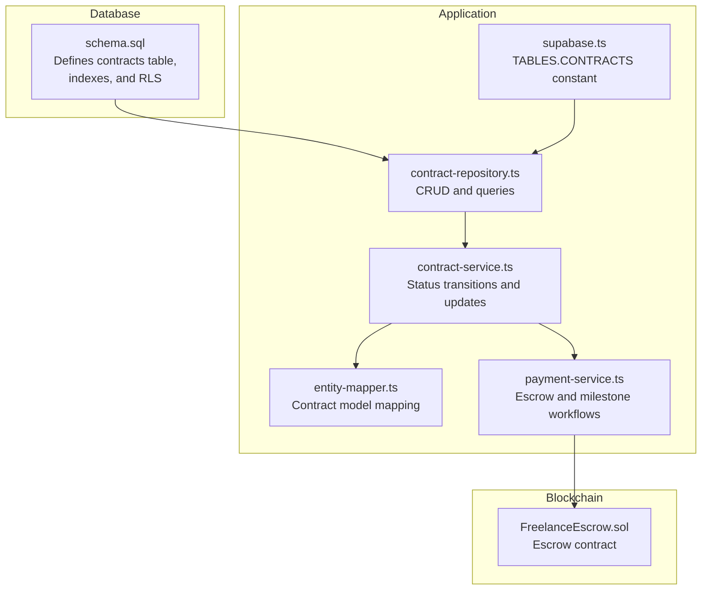

**Diagram sources**
- [schema.sql](file://supabase/schema.sql#L94-L106)
- [supabase.ts](file://src/config/supabase.ts#L6-L21)
- [contract-repository.ts](file://src/repositories/contract-repository.ts#L1-L139)
- [contract-service.ts](file://src/services/contract-service.ts#L1-L140)
- [entity-mapper.ts](file://src/utils/entity-mapper.ts#L281-L310)
- [payment-service.ts](file://src/services/payment-service.ts#L590-L643)
- [FreelanceEscrow.sol](file://contracts/FreelanceEscrow.sol#L1-L264)

**Section sources**
- [schema.sql](file://supabase/schema.sql#L94-L106)
- [supabase.ts](file://src/config/supabase.ts#L6-L21)

## Core Components
- contracts table: stores the formal agreement with foreign keys to users, projects, and proposals; maintains escrow address and status; includes audit timestamps.
- Repository: provides typed CRUD and query methods for contracts.
- Service: validates status transitions and updates contract records.
- Mapper: converts between database entities and API models.
- Payment workflow: integrates with the on-chain escrow to manage milestone submissions, approvals, disputes, and contract completion.
- Escrow contract: holds funds and releases them according to milestone approvals and dispute resolution.

**Section sources**
- [schema.sql](file://supabase/schema.sql#L94-L106)
- [contract-repository.ts](file://src/repositories/contract-repository.ts#L1-L139)
- [contract-service.ts](file://src/services/contract-service.ts#L65-L139)
- [entity-mapper.ts](file://src/utils/entity-mapper.ts#L281-L310)
- [payment-service.ts](file://src/services/payment-service.ts#L1-L140)
- [FreelanceEscrow.sol](file://contracts/FreelanceEscrow.sol#L1-L264)

## Architecture Overview
The contracts table bridges off-chain data with on-chain escrow:
- Off-chain: projects define milestones; proposals link to projects; contracts formalize the agreement and store the escrow address.
- On-chain: FreelanceEscrow holds funds and releases them upon milestone approval; disputes route through the arbiter.

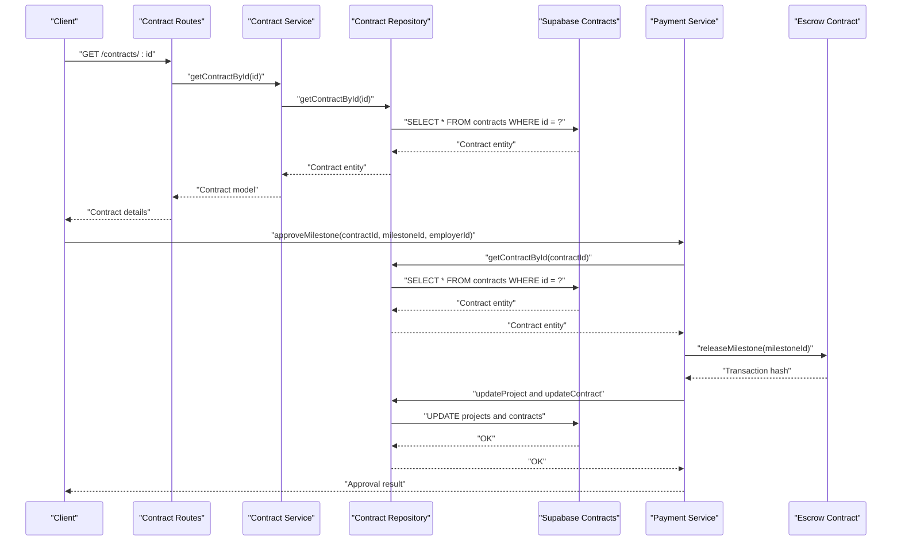

**Diagram sources**
- [contract-service.ts](file://src/services/contract-service.ts#L23-L32)
- [contract-repository.ts](file://src/repositories/contract-repository.ts#L24-L34)
- [payment-service.ts](file://src/services/payment-service.ts#L201-L352)
- [FreelanceEscrow.sol](file://contracts/FreelanceEscrow.sol#L136-L161)

## Detailed Component Analysis

### Contracts Table Definition and Purpose
- Purpose: Formal agreement between parties, linking off-chain project/proposal data to on-chain escrow.
- Central role: Orchestrates payment and milestone release workflow; tracks contract lifecycle via status.

Columns:
- id: UUID primary key, auto-generated.
- project_id: UUID foreign key to projects; links to the project containing milestones.
- proposal_id: UUID foreign key to proposals; links to the accepted proposal forming the contract.
- freelancer_id: UUID foreign key to users; identifies the freelancer.
- employer_id: UUID foreign key to users; identifies the employer.
- escrow_address: String; on-chain escrow contract address for fund holding and release.
- total_amount: Decimal; total budget allocated to the contract.
- status: String with CHECK constraint limiting values to active, completed, disputed, cancelled.
- created_at, updated_at: Audit timestamps.

Indexes:
- Indexes on freelancer_id and employer_id improve query performance for retrieving contracts by party.

RLS Policies:
- RLS enabled on contracts; service role policies grant full access; application-level authorization ensures only parties can access sensitive data.

**Section sources**
- [schema.sql](file://supabase/schema.sql#L94-L106)
- [schema.sql](file://supabase/schema.sql#L202-L224)
- [schema.sql](file://supabase/schema.sql#L225-L261)
- [supabase.ts](file://src/config/supabase.ts#L6-L21)

### Data Model Mapping
- Contract entity shape: snake_case fields aligned to database schema.
- Contract model: camelCase fields for API consumption.
- Mapping preserves all contract attributes, including status and audit timestamps.

**Section sources**
- [entity-mapper.ts](file://src/utils/entity-mapper.ts#L281-L310)

### Repository Layer
- Typed contract entity interface.
- Methods:
  - Create, read by id, update.
  - Query by proposal id, freelancer id, employer id, project id, and status.
  - Paginated retrieval with ordering and counts.
- Uses TABLES.CONTRACTS constant for table name.

**Section sources**
- [contract-repository.ts](file://src/repositories/contract-repository.ts#L1-L139)
- [supabase.ts](file://src/config/supabase.ts#L6-L21)

### Service Layer: Status Transitions and Updates
- Validates status transitions:
  - From active: allowed to completed, disputed, cancelled.
  - From disputed: allowed to active, completed, cancelled.
  - Completed and cancelled are terminal states.
- Updates escrow address and contract status atomically via repository.

**Section sources**
- [contract-service.ts](file://src/services/contract-service.ts#L65-L139)

### Payment Workflow and Escrow Integration
- Escrow initialization:
  - Deploys FreelanceEscrow with employer, freelancer, total amount, and milestones.
  - Deposits funds into the escrow.
  - Stores the escrow address on the contract.
- Milestone submission and approval:
  - Freelancer requests milestone completion; project milestones updated.
  - Employer approves milestone; escrow releases funds to freelancer; project milestones updated.
  - If all milestones approved, contract status becomes completed and project completes.
- Disputes:
  - Either party can dispute a submitted milestone; project milestone marked disputed.
  - Contract status moves to disputed; notifications sent to both parties.
- Contract completion triggers on-chain agreement completion.

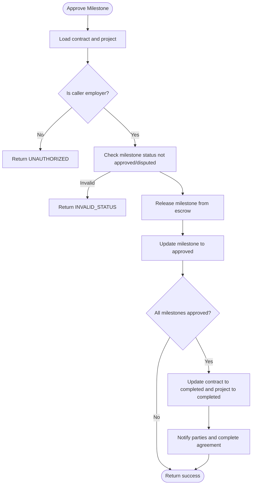

**Diagram sources**
- [payment-service.ts](file://src/services/payment-service.ts#L201-L352)
- [FreelanceEscrow.sol](file://contracts/FreelanceEscrow.sol#L136-L161)

**Section sources**
- [payment-service.ts](file://src/services/payment-service.ts#L590-L643)
- [FreelanceEscrow.sol](file://contracts/FreelanceEscrow.sol#L1-L264)

### Contract Status Impact on Payment and Disputes
- Active:
  - Normal operation: milestones can be submitted and approved.
  - Escrow holds funds; releases occur upon approval.
- Disputed:
  - Milestone under dispute; cannot be approved until resolved.
  - Contract status set to disputed; dispute process initiated.
- Completed:
  - Terminal state; no further payments or approvals.
- Cancelled:
  - Contract terminated; funds may be refunded depending on milestone status.

**Section sources**
- [contract-service.ts](file://src/services/contract-service.ts#L77-L83)
- [payment-service.ts](file://src/services/payment-service.ts#L355-L480)

## Dependency Analysis
- contracts table depends on:
  - users (freelancer_id, employer_id)
  - projects (project_id)
  - proposals (proposal_id)
- Repository and service depend on:
  - TABLES.CONTRACTS constant for table name.
  - Entity mapper for model conversion.
- Payment service depends on:
  - Contract repository for contract state.
  - Escrow contract for fund release.
  - Project repository for milestone state.
  - Notification service for user notifications.

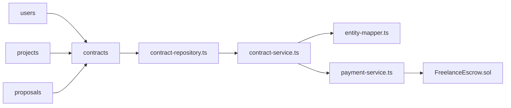

**Diagram sources**
- [schema.sql](file://supabase/schema.sql#L94-L106)
- [contract-repository.ts](file://src/repositories/contract-repository.ts#L1-L139)
- [contract-service.ts](file://src/services/contract-service.ts#L1-L140)
- [entity-mapper.ts](file://src/utils/entity-mapper.ts#L281-L310)
- [payment-service.ts](file://src/services/payment-service.ts#L1-L140)
- [FreelanceEscrow.sol](file://contracts/FreelanceEscrow.sol#L1-L264)

**Section sources**
- [schema.sql](file://supabase/schema.sql#L94-L106)
- [contract-repository.ts](file://src/repositories/contract-repository.ts#L1-L139)
- [contract-service.ts](file://src/services/contract-service.ts#L1-L140)
- [payment-service.ts](file://src/services/payment-service.ts#L1-L140)

## Performance Considerations
- Indexes:
  - freelancer_id and employer_id indexes enable efficient retrieval of contracts by party.
  - Additional indexes exist for related tables; ensure maintenance of statistics for optimal query plans.
- Pagination:
  - Repository methods support pagination with limit and offset; use reasonable limits to prevent heavy scans.
- Status filtering:
  - Filtering by status is supported; combine with ordering by created_at for predictable results.

**Section sources**
- [schema.sql](file://supabase/schema.sql#L202-L224)
- [contract-repository.ts](file://src/repositories/contract-repository.ts#L41-L81)
- [contract-repository.ts](file://src/repositories/contract-repository.ts#L95-L114)

## Troubleshooting Guide
- Not found errors:
  - Contract not found when querying by id or proposal id; verify identifiers and existence.
- Unauthorized access:
  - Only parties (freelancer or employer) can perform actions on a contract; ensure user identity matches contract participants.
- Invalid status transitions:
  - Cannot transition from current status to target status; consult allowed transitions.
- Escrow deployment or release failures:
  - Review payment service error codes and underlying blockchain client logs.
- RLS access denied:
  - Even with service role policies, application-level authorization restricts access to contract parties.

**Section sources**
- [contract-service.ts](file://src/services/contract-service.ts#L23-L32)
- [contract-service.ts](file://src/services/contract-service.ts#L65-L103)
- [payment-service.ts](file://src/services/payment-service.ts#L201-L352)

## Conclusion
The contracts table is the backbone of FreelanceXchain’s payment and milestone release system. It formalizes agreements, connects off-chain project data to on-chain escrow, and enforces strict status transitions. With targeted indexes and robust repository/service layers, it supports scalable, secure workflows while ensuring only authorized parties can access sensitive data.

---

# Disputes Table

<cite>
**Referenced Files in This Document**
- [schema.sql](file://supabase/schema.sql)
- [supabase.ts](file://src/config/supabase.ts)
- [dispute-repository.ts](file://src/repositories/dispute-repository.ts)
- [dispute-service.ts](file://src/services/dispute-service.ts)
- [dispute-registry.ts](file://src/services/dispute-registry.ts)
- [entity-mapper.ts](file://src/utils/entity-mapper.ts)
- [DisputeResolution.sol](file://contracts/DisputeResolution.sol)
- [dispute-routes.ts](file://src/routes/dispute-routes.ts)
</cite>

## Table of Contents
1. [Introduction](#introduction)
2. [Project Structure](#project-structure)
3. [Core Components](#core-components)
4. [Architecture Overview](#architecture-overview)
5. [Detailed Component Analysis](#detailed-component-analysis)
6. [Dependency Analysis](#dependency-analysis)
7. [Performance Considerations](#performance-considerations)
8. [Troubleshooting Guide](#troubleshooting-guide)
9. [Conclusion](#conclusion)

## Introduction
This document provides comprehensive data model documentation for the disputes table in the FreelanceXchain Supabase PostgreSQL database. It explains the purpose of the disputes table as the conflict resolution tracking system, details each column, and describes how it integrates with the on-chain DisputeResolution.sol contract. It also covers evidence submission off-chain, the dispute lifecycle from creation to resolution, and how it affects payment flows. Finally, it references the TABLES.DISPUTES constant and the idx_disputes_contract_id index, and addresses RLS policies ensuring privacy during dispute resolution.

## Project Structure
The disputes table is defined in the Supabase schema and is used by the backend services and routes to manage disputes. The key files involved are:
- Database schema definition
- Supabase client constants
- Repository and service layers for disputes
- Blockchain integration for on-chain records
- API routes for dispute operations
- Entity mapping for data transfer

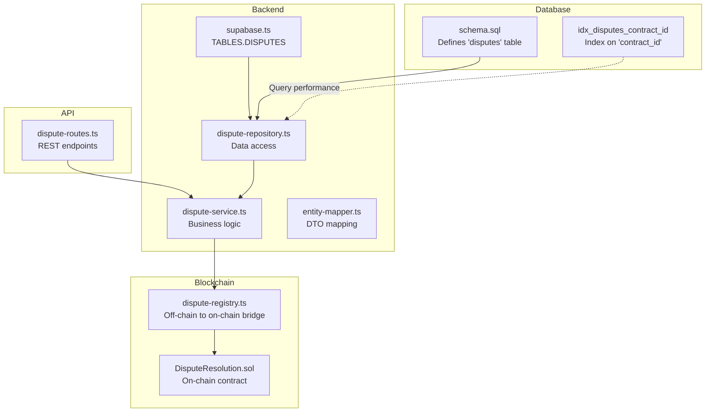

**Diagram sources**
- [schema.sql](file://supabase/schema.sql#L108-L120)
- [schema.sql](file://supabase/schema.sql#L202-L224)
- [supabase.ts](file://src/config/supabase.ts#L6-L21)
- [dispute-repository.ts](file://src/repositories/dispute-repository.ts#L34-L136)
- [dispute-service.ts](file://src/services/dispute-service.ts#L63-L521)
- [dispute-registry.ts](file://src/services/dispute-registry.ts#L40-L289)
- [DisputeResolution.sol](file://contracts/DisputeResolution.sol#L1-L153)
- [dispute-routes.ts](file://src/routes/dispute-routes.ts#L1-L558)

**Section sources**
- [schema.sql](file://supabase/schema.sql#L108-L120)
- [schema.sql](file://supabase/schema.sql#L202-L224)
- [supabase.ts](file://src/config/supabase.ts#L6-L21)

## Core Components
- Disputes table: Stores dispute metadata, evidence, and resolution outcomes.
- Repository: Provides CRUD and query helpers for disputes.
- Service: Orchestrates dispute lifecycle, validates inputs, updates statuses, and triggers blockchain actions.
- Blockchain integration: Off-chain service writes hashes to the on-chain DisputeResolution.sol contract.
- API routes: Expose endpoints for creating, retrieving, submitting evidence, and resolving disputes.

**Section sources**
- [dispute-repository.ts](file://src/repositories/dispute-repository.ts#L34-L136)
- [dispute-service.ts](file://src/services/dispute-service.ts#L63-L521)
- [dispute-registry.ts](file://src/services/dispute-registry.ts#L40-L289)
- [dispute-routes.ts](file://src/routes/dispute-routes.ts#L1-L558)

## Architecture Overview
The disputes lifecycle spans the database, backend services, and blockchain:
- Creation: Validates contract and milestone, marks milestone as disputed, persists dispute, and records on-chain.
- Evidence submission: Adds evidence to the dispute and updates the on-chain evidence hash.
- Resolution: Admin resolves, updates statuses, triggers payment flows, and records on-chain outcome.

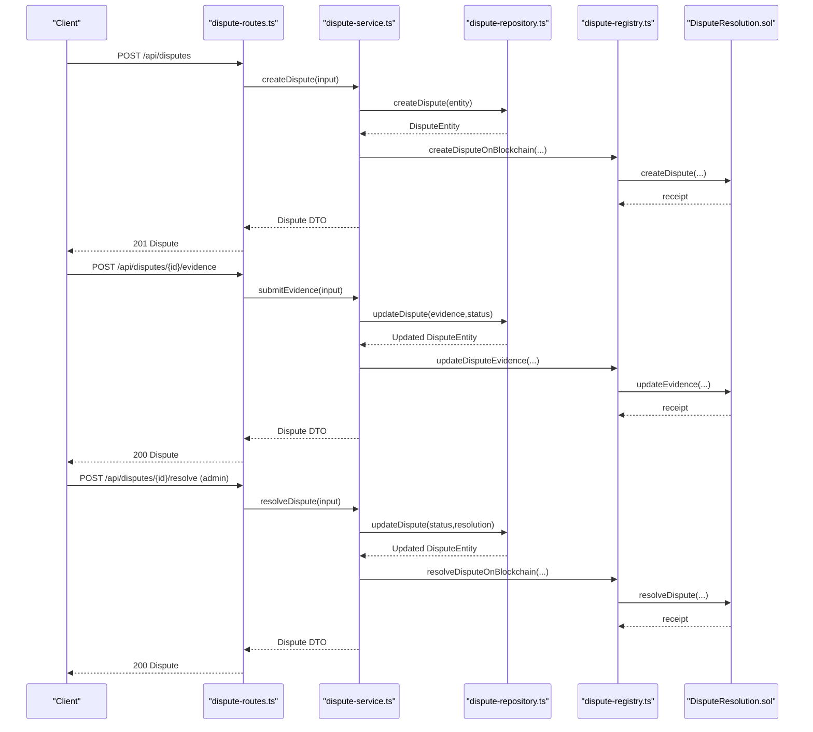

**Diagram sources**
- [dispute-routes.ts](file://src/routes/dispute-routes.ts#L149-L223)
- [dispute-routes.ts](file://src/routes/dispute-routes.ts#L328-L381)
- [dispute-routes.ts](file://src/routes/dispute-routes.ts#L424-L486)
- [dispute-service.ts](file://src/services/dispute-service.ts#L63-L521)
- [dispute-registry.ts](file://src/services/dispute-registry.ts#L69-L253)
- [DisputeResolution.sol](file://contracts/DisputeResolution.sol#L51-L125)

## Detailed Component Analysis

### Disputes Table Definition and Purpose
- Purpose: Centralized conflict resolution tracking system for milestones within contracts. It stores who initiated the dispute, the reason, evidence, current status, and resolution details. It also tracks audit timestamps.
- Integration: Off-chain evidence and resolution outcomes are hashed and recorded on-chain via DisputeResolution.sol for immutability and transparency.

Columns:
- id: UUID primary key, auto-generated.
- contract_id: UUID foreign key to contracts, linking disputes to specific contracts.
- milestone_id: String identifier for the blockchain milestone; used to correlate with on-chain records.
- initiator_id: UUID foreign key to users, identifying the party who opened the dispute.
- reason: Text describing the cause of the dispute.
- evidence: JSONB array storing evidence entries (id, submitter_id, type, content, submitted_at).
- status: Enum-like string with CHECK constraint limiting values to open, under_review, resolved.
- resolution: JSONB object containing decision, reasoning, resolved_by, resolved_at.
- created_at, updated_at: Audit timestamps managed by the database.

Indexes:
- idx_disputes_contract_id: Index on contract_id to optimize queries by contract.

RLS Policies:
- RLS enabled on the disputes table.
- Service role policy grants full access for backend operations.
- Additional policies can be configured to restrict visibility to parties involved in the contract.

**Section sources**
- [schema.sql](file://supabase/schema.sql#L108-L120)
- [schema.sql](file://supabase/schema.sql#L202-L224)
- [schema.sql](file://supabase/schema.sql#L225-L261)

### Data Model and Types
- Repository types define DisputeEntity, EvidenceEntity, and DisputeResolutionEntity with snake_case fields aligned to the database.
- Mapper types define Dispute, Evidence, and DisputeResolution with camelCase fields for the API.

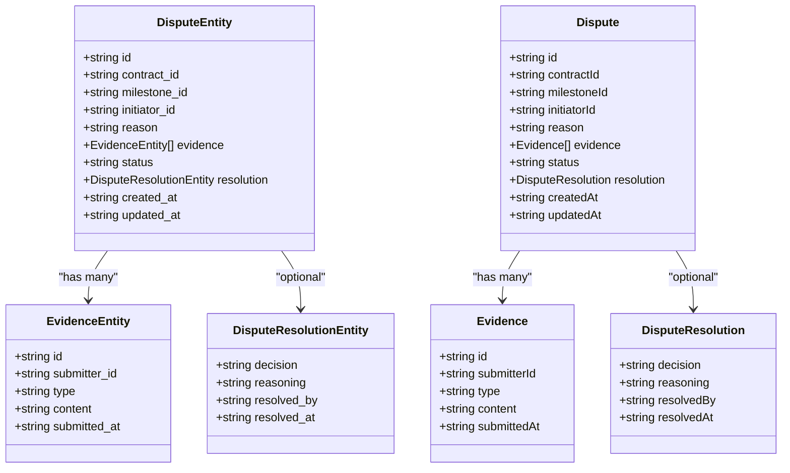

**Diagram sources**
- [dispute-repository.ts](file://src/repositories/dispute-repository.ts#L21-L33)
- [entity-mapper.ts](file://src/utils/entity-mapper.ts#L312-L371)

**Section sources**
- [dispute-repository.ts](file://src/repositories/dispute-repository.ts#L21-L33)
- [entity-mapper.ts](file://src/utils/entity-mapper.ts#L312-L371)

### Lifecycle: Creation to Resolution
- Creation:
  - Validates contract existence and that the initiator is a party to the contract.
  - Validates milestone exists and is not already disputed/approved.
  - Prevents duplicate active disputes for the same milestone.
  - Persists dispute with status open.
  - Records on-chain dispute with hashes of identifiers and amounts.
  - Updates milestone status to disputed and contract status to disputed.
  - Sends notifications to both parties.
- Evidence Submission:
  - Only parties to the contract can submit evidence.
  - Evidence is appended; status transitions to under_review if previously open.
  - On-chain evidence hash is updated.
- Resolution:
  - Only admins can resolve disputes.
  - Based on decision (freelancer_favor, employer_favor, split):
    - Releases funds to freelancer or refunds to employer via escrow.
    - Updates milestone status accordingly.
    - If no other milestones are disputed, contract status reverts to active.
  - Records on-chain resolution outcome and reasoning.
  - Sends notifications to both parties.

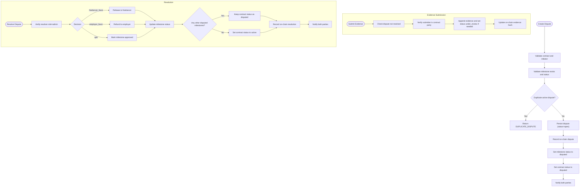

**Diagram sources**
- [dispute-service.ts](file://src/services/dispute-service.ts#L63-L521)
- [dispute-registry.ts](file://src/services/dispute-registry.ts#L69-L253)

**Section sources**
- [dispute-service.ts](file://src/services/dispute-service.ts#L63-L521)

### API Endpoints and Access Control
- POST /api/disputes: Create a dispute (authenticated).
- GET /api/disputes/{disputeId}: Retrieve a dispute (authenticated).
- POST /api/disputes/{disputeId}/evidence: Submit evidence (authenticated, contract party).
- POST /api/disputes/{disputeId}/resolve: Resolve dispute (admin only).
- GET /api/contracts/{contractId}/disputes: List disputes for a contract (authenticated, contract party).

Access control:
- Authentication enforced by auth middleware.
- Authorization checks ensure only parties to the contract can view or submit evidence.
- Admin-only endpoint for resolution.

**Section sources**
- [dispute-routes.ts](file://src/routes/dispute-routes.ts#L149-L223)
- [dispute-routes.ts](file://src/routes/dispute-routes.ts#L258-L286)
- [dispute-routes.ts](file://src/routes/dispute-routes.ts#L328-L381)
- [dispute-routes.ts](file://src/routes/dispute-routes.ts#L424-L486)
- [dispute-routes.ts](file://src/routes/dispute-routes.ts#L490-L555)

### On-Chain Integration
- Off-chain service generates SHA-256 hashes for disputeId, contractId, milestoneId, and evidence payload.
- Records are stored in a local in-memory registry keyed by disputeIdHash.
- The DisputeResolution.sol contract maintains a mapping of disputeIdHash to DisputeRecord with fields for evidenceHash, outcome, reasoning, and timestamps.
- Events are emitted for dispute creation, evidence submission, and resolution.

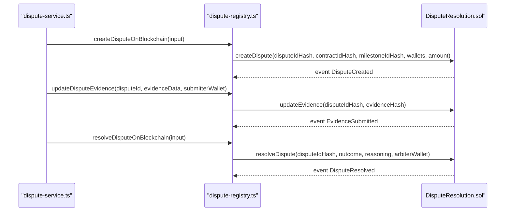

**Diagram sources**
- [dispute-registry.ts](file://src/services/dispute-registry.ts#L69-L253)
- [DisputeResolution.sol](file://contracts/DisputeResolution.sol#L51-L125)

**Section sources**
- [dispute-registry.ts](file://src/services/dispute-registry.ts#L40-L289)
- [DisputeResolution.sol](file://contracts/DisputeResolution.sol#L1-L153)

### Payment Flow Impact
- Creation locks funds by marking milestone as disputed and contract as disputed.
- Resolution triggers payment actions:
  - freelancer_favor: releases milestone to freelancer.
  - employer_favor: refunds milestone to employer.
  - split: marks milestone approved (partial release handled separately).
- After resolution, if no other milestones remain disputed, contract status reverts to active.

**Section sources**
- [dispute-service.ts](file://src/services/dispute-service.ts#L368-L409)

### Constants and Index References
- TABLES.DISPUTES: The constant for the disputes table name is defined in the Supabase configuration module and is used by the repository to target the correct table.
- idx_disputes_contract_id: The index on contract_id is defined in the schema to optimize queries filtering by contract.

**Section sources**
- [supabase.ts](file://src/config/supabase.ts#L6-L21)
- [schema.sql](file://supabase/schema.sql#L202-L224)

## Dependency Analysis
- Repository depends on TABLES.DISPUTES constant and Supabase client.
- Service depends on repository, contract and project repositories, user repository, notification service, and blockchain registry.
- Routes depend on service and enforce authentication and authorization.
- Blockchain registry depends on blockchain client and generates hashes for on-chain storage.

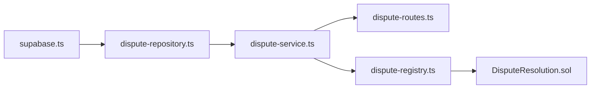

**Diagram sources**
- [supabase.ts](file://src/config/supabase.ts#L6-L21)
- [dispute-repository.ts](file://src/repositories/dispute-repository.ts#L34-L53)
- [dispute-service.ts](file://src/services/dispute-service.ts#L63-L120)
- [dispute-routes.ts](file://src/routes/dispute-routes.ts#L1-L50)
- [dispute-registry.ts](file://src/services/dispute-registry.ts#L40-L120)
- [DisputeResolution.sol](file://contracts/DisputeResolution.sol#L1-L40)

**Section sources**
- [supabase.ts](file://src/config/supabase.ts#L6-L21)
- [dispute-repository.ts](file://src/repositories/dispute-repository.ts#L34-L53)
- [dispute-service.ts](file://src/services/dispute-service.ts#L63-L120)
- [dispute-routes.ts](file://src/routes/dispute-routes.ts#L1-L50)
- [dispute-registry.ts](file://src/services/dispute-registry.ts#L40-L120)
- [DisputeResolution.sol](file://contracts/DisputeResolution.sol#L1-L40)

## Performance Considerations
- Use idx_disputes_contract_id to efficiently query disputes by contract.
- Limit pagination for listing disputes to prevent large result sets.
- Store only necessary evidence content in the database; large attachments should be stored off-chain with references.
- Batch updates for milestone status changes to minimize write operations.

[No sources needed since this section provides general guidance]

## Troubleshooting Guide
Common issues and resolutions:
- Not Found:
  - Contract or milestone missing: Ensure contractId and milestoneId are valid and match the project’s milestones.
  - Dispute not found: Verify disputeId format and existence.
- Unauthorized:
  - Only parties to the contract can create disputes or submit evidence.
  - Only admins can resolve disputes.
- Already Resolved:
  - Cannot submit evidence or resolve a dispute already marked as resolved.
- Duplicate Active Dispute:
  - A dispute for the same milestone cannot be created while another active dispute exists.
- Validation Errors:
  - Ensure UUID formats are correct and required fields are present.

**Section sources**
- [dispute-service.ts](file://src/services/dispute-service.ts#L63-L521)
- [dispute-routes.ts](file://src/routes/dispute-routes.ts#L149-L223)
- [dispute-routes.ts](file://src/routes/dispute-routes.ts#L328-L381)
- [dispute-routes.ts](file://src/routes/dispute-routes.ts#L424-L486)

## Conclusion
The disputes table serves as the central record for conflict resolution in FreelanceXchain. It integrates tightly with the contract and milestone lifecycle, enforces strict access controls, and bridges off-chain data with on-chain immutability. The documented lifecycle, API endpoints, and payment flow ensure predictable behavior for all stakeholders, while indexes and RLS policies support performance and privacy.

---

# Employer Profiles Table

<cite>
**Referenced Files in This Document**
- [schema.sql](file://supabase/schema.sql)
- [supabase.ts](file://src/config/supabase.ts)
- [employer-profile-repository.ts](file://src/repositories/employer-profile-repository.ts)
- [employer-profile-service.ts](file://src/services/employer-profile-service.ts)
- [entity-mapper.ts](file://src/utils/entity-mapper.ts)
- [employer-routes.ts](file://src/routes/employer-routes.ts)
- [validation-middleware.ts](file://src/middleware/validation-middleware.ts)
- [project-repository.ts](file://src/repositories/project-repository.ts)
- [project-service.ts](file://src/services/project-service.ts)
- [ARCHITECTURE.md](file://docs/ARCHITECTURE.md)
</cite>

## Table of Contents
1. [Introduction](#introduction)
2. [Project Structure](#project-structure)
3. [Core Components](#core-components)
4. [Architecture Overview](#architecture-overview)
5. [Detailed Component Analysis](#detailed-component-analysis)
6. [Dependency Analysis](#dependency-analysis)
7. [Performance Considerations](#performance-considerations)
8. [Troubleshooting Guide](#troubleshooting-guide)
9. [Conclusion](#conclusion)

## Introduction
This document provides comprehensive data model documentation for the employer_profiles table in the FreelanceXchain Supabase PostgreSQL database. It explains the table’s structure, relationships, and lifecycle, and describes how it supports the platform’s organizational identity for employers posting projects. It also covers the one-to-one relationship with the users table, the purpose of verified company information in building trust, and how employer profiles integrate with project browsing and display. Finally, it references the TABLES.EMPLOYER_PROFILES constant and the idx_employer_profiles_user_id index, and outlines considerations for Row Level Security (RLS) policies.

## Project Structure
The employer_profiles table is defined in the Supabase schema and is accessed through the backend service layer. The relevant files include:
- Database schema definition and indexes
- Backend constants for table names
- Repository and service layers for CRUD operations
- Entity mapping for API-friendly types
- Route handlers and validation for employer profile endpoints
- Project-related repositories/services that demonstrate how employer identity integrates with project browsing

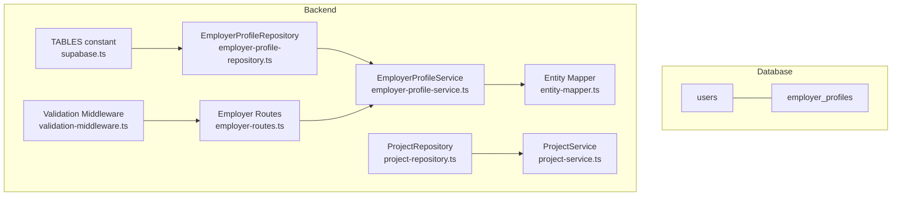

**Diagram sources**
- [schema.sql](file://supabase/schema.sql#L54-L62)
- [supabase.ts](file://src/config/supabase.ts#L6-L21)
- [employer-profile-repository.ts](file://src/repositories/employer-profile-repository.ts#L1-L56)
- [employer-profile-service.ts](file://src/services/employer-profile-service.ts#L1-L92)
- [entity-mapper.ts](file://src/utils/entity-mapper.ts#L175-L196)
- [employer-routes.ts](file://src/routes/employer-routes.ts#L1-L279)
- [validation-middleware.ts](file://src/middleware/validation-middleware.ts#L496-L518)
- [project-repository.ts](file://src/repositories/project-repository.ts#L1-L191)
- [project-service.ts](file://src/services/project-service.ts#L1-L200)

**Section sources**
- [schema.sql](file://supabase/schema.sql#L54-L62)
- [supabase.ts](file://src/config/supabase.ts#L6-L21)

## Core Components
- Table definition: employer_profiles contains id (UUID primary key), user_id (unique foreign key to users), company_name, description, industry, and audit timestamps.
- Index: idx_employer_profiles_user_id ensures efficient lookups by user_id.
- RLS: employer_profiles has Row Level Security enabled.
- Backend integration:
  - TABLES constant exposes EMPLOYER_PROFILES for centralized table naming.
  - EmployerProfileRepository provides typed CRUD operations.
  - EmployerProfileService enforces business rules (e.g., uniqueness by user_id).
  - Entity mapper converts database entities to API-friendly types.
  - Routes and validation govern creation and updates.
  - Project repositories/services demonstrate employer identity usage in project browsing.

**Section sources**
- [schema.sql](file://supabase/schema.sql#L54-L62)
- [schema.sql](file://supabase/schema.sql#L203-L206)
- [schema.sql](file://supabase/schema.sql#L225-L240)
- [supabase.ts](file://src/config/supabase.ts#L6-L21)
- [employer-profile-repository.ts](file://src/repositories/employer-profile-repository.ts#L1-L56)
- [employer-profile-service.ts](file://src/services/employer-profile-service.ts#L1-L92)
- [entity-mapper.ts](file://src/utils/entity-mapper.ts#L175-L196)
- [employer-routes.ts](file://src/routes/employer-routes.ts#L1-L279)
- [validation-middleware.ts](file://src/middleware/validation-middleware.ts#L496-L518)
- [project-repository.ts](file://src/repositories/project-repository.ts#L1-L191)
- [project-service.ts](file://src/services/project-service.ts#L1-L200)

## Architecture Overview
The employer_profiles table underpins employer identity and trust. It is linked to users via a unique foreign key and is used to present employer information when browsing projects. The backend follows a layered architecture:
- Routes handle HTTP requests and enforce roles.
- Services encapsulate business logic and validations.
- Repositories abstract database operations.
- Entity mappers convert between database and API models.
- RLS protects data at the database level.

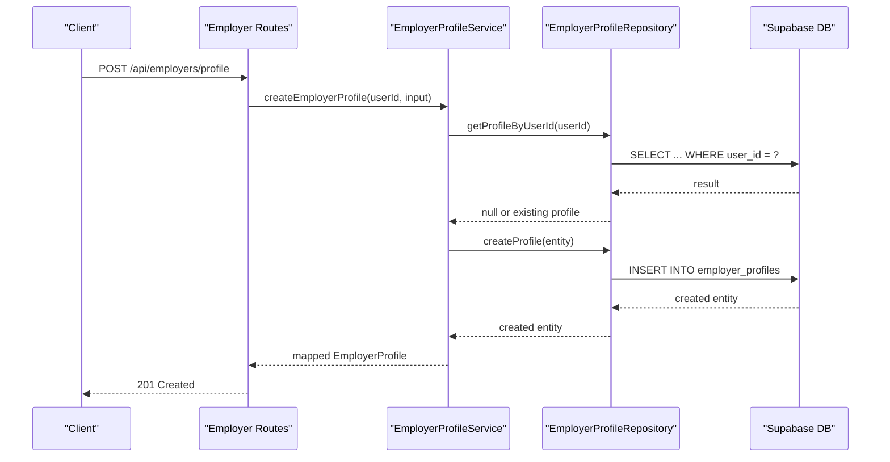

**Diagram sources**
- [employer-routes.ts](file://src/routes/employer-routes.ts#L161-L214)
- [employer-profile-service.ts](file://src/services/employer-profile-service.ts#L28-L50)
- [employer-profile-repository.ts](file://src/repositories/employer-profile-repository.ts#L19-L21)
- [schema.sql](file://supabase/schema.sql#L54-L62)

## Detailed Component Analysis

### Data Model: employer_profiles
- Purpose: Stores verified organizational identity for employers posting projects.
- Columns:
  - id: UUID primary key
  - user_id: UUID unique foreign key to users.id
  - company_name: VARCHAR(255)
  - description: TEXT
  - industry: VARCHAR(255)
  - created_at: TIMESTAMPTZ default NOW()
  - updated_at: TIMESTAMPTZ default NOW()
- Relationship: One-to-one with users via user_id (UNIQUE constraint).
- Index: idx_employer_profiles_user_id improves lookups by user_id.

```mermaid
erDiagram
USERS {
uuid id PK
string email UK
string password_hash
string role
string wallet_address
string name
timestamptz created_at
timestamptz updated_at
}
EMPLOYER_PROFILES {
uuid id PK
uuid user_id UK FK
string company_name
text description
string industry
timestamptz created_at
timestamptz updated_at
}
USERS ||--|| EMPLOYER_PROFILES : "one-to-one via user_id"
```

**Diagram sources**
- [schema.sql](file://supabase/schema.sql#L8-L17)
- [schema.sql](file://supabase/schema.sql#L54-L62)

**Section sources**
- [schema.sql](file://supabase/schema.sql#L54-L62)
- [schema.sql](file://supabase/schema.sql#L203-L206)

### Backend Types and Mapping
- Repository entity type: EmployerProfileEntity mirrors the table schema.
- Service types: CreateEmployerProfileInput and UpdateEmployerProfileInput define validated inputs.
- API model: EmployerProfile maps database snake_case to camelCase for clients.

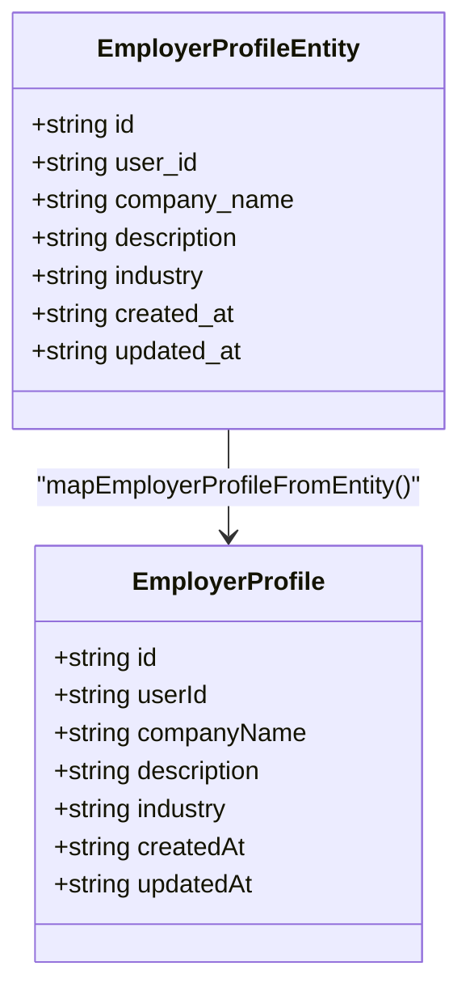

**Diagram sources**
- [employer-profile-repository.ts](file://src/repositories/employer-profile-repository.ts#L4-L12)
- [entity-mapper.ts](file://src/utils/entity-mapper.ts#L175-L196)

**Section sources**
- [employer-profile-repository.ts](file://src/repositories/employer-profile-repository.ts#L1-L12)
- [entity-mapper.ts](file://src/utils/entity-mapper.ts#L175-L196)

### Repository and Service Layer
- Repository responsibilities:
  - Create, read by id, read by user_id, update, delete, list, and filter by industry.
- Service responsibilities:
  - Enforce uniqueness by user_id.
  - Validate inputs and map results to API models.

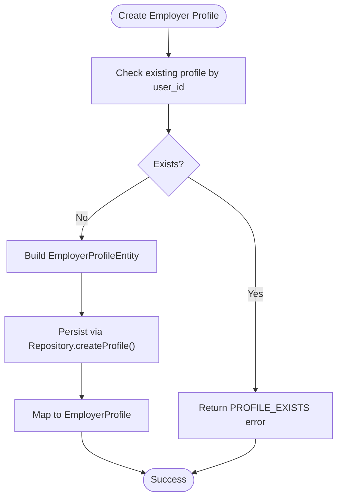

**Diagram sources**
- [employer-profile-service.ts](file://src/services/employer-profile-service.ts#L28-L50)
- [employer-profile-repository.ts](file://src/repositories/employer-profile-repository.ts#L19-L21)

**Section sources**
- [employer-profile-repository.ts](file://src/repositories/employer-profile-repository.ts#L1-L56)
- [employer-profile-service.ts](file://src/services/employer-profile-service.ts#L1-L92)

### Routing and Validation
- Routes:
  - POST /api/employers/profile creates an employer profile for authenticated employers.
  - PATCH /api/employers/profile updates an employer profile for authenticated employers.
  - GET /api/employers/:id retrieves a profile by user id.
- Validation:
  - createEmployerProfileSchema and updateEmployerProfileSchema define required fields and minimum lengths.

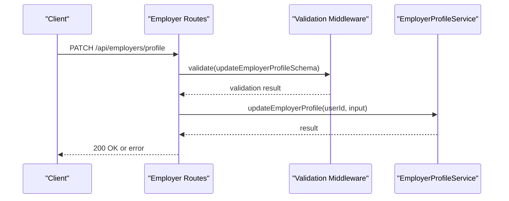

**Diagram sources**
- [employer-routes.ts](file://src/routes/employer-routes.ts#L248-L347)
- [validation-middleware.ts](file://src/middleware/validation-middleware.ts#L496-L518)
- [employer-profile-service.ts](file://src/services/employer-profile-service.ts#L65-L92)

**Section sources**
- [employer-routes.ts](file://src/routes/employer-routes.ts#L1-L279)
- [validation-middleware.ts](file://src/middleware/validation-middleware.ts#L496-L518)

### Integration with Project Browsing
- Project repositories and services demonstrate how employer identity is used:
  - Projects are associated with employers via employer_id (foreign key to users).
  - Project listings and filtering rely on employer identity for ownership checks and display.
- While the employer_profiles table is not directly joined in project queries, the presence of an employer profile contributes to trust signals when browsing projects.

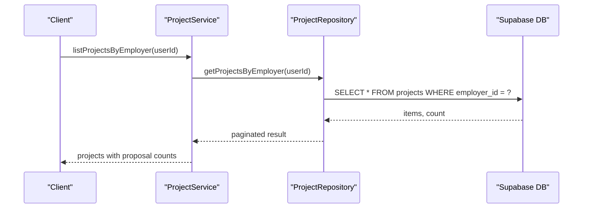

**Diagram sources**
- [project-service.ts](file://src/services/project-service.ts#L1-L200)
- [project-repository.ts](file://src/repositories/project-repository.ts#L55-L74)

**Section sources**
- [project-repository.ts](file://src/repositories/project-repository.ts#L1-L191)
- [project-service.ts](file://src/services/project-service.ts#L1-L200)

### RLS Policies and Data Exposure
- RLS is enabled for employer_profiles.
- Public read policies are defined for select tables (e.g., skill_categories, skills, open projects).
- Service role policies grant full access for backend operations.
- Considerations:
  - For employer profiles, the default policy allows service role full access. Public read is not enabled for employer_profiles in the provided schema.
  - To expose employer profile data publicly, define a public read policy for employer_profiles and carefully scope it to non-sensitive fields (e.g., company_name, industry).
  - For private data, rely on service role bypass and backend authorization to control access.

**Section sources**
- [schema.sql](file://supabase/schema.sql#L225-L240)
- [schema.sql](file://supabase/schema.sql#L241-L261)
- [ARCHITECTURE.md](file://docs/ARCHITECTURE.md#L183-L218)

## Dependency Analysis
- Centralized table naming via TABLES constant ensures consistency across repositories and routes.
- Repository depends on Supabase client and table name constant.
- Service depends on repository and entity mapper.
- Routes depend on services and validation middleware.
- Project services depend on repositories and skill repositories.

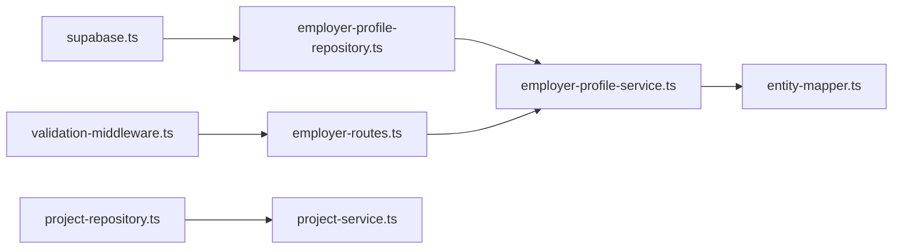

**Diagram sources**
- [supabase.ts](file://src/config/supabase.ts#L6-L21)
- [employer-profile-repository.ts](file://src/repositories/employer-profile-repository.ts#L1-L56)
- [employer-profile-service.ts](file://src/services/employer-profile-service.ts#L1-L92)
- [entity-mapper.ts](file://src/utils/entity-mapper.ts#L175-L196)
- [employer-routes.ts](file://src/routes/employer-routes.ts#L1-L279)
- [validation-middleware.ts](file://src/middleware/validation-middleware.ts#L496-L518)
- [project-repository.ts](file://src/repositories/project-repository.ts#L1-L191)
- [project-service.ts](file://src/services/project-service.ts#L1-L200)

**Section sources**
- [supabase.ts](file://src/config/supabase.ts#L6-L21)
- [employer-profile-repository.ts](file://src/repositories/employer-profile-repository.ts#L1-L56)
- [employer-profile-service.ts](file://src/services/employer-profile-service.ts#L1-L92)
- [entity-mapper.ts](file://src/utils/entity-mapper.ts#L175-L196)
- [employer-routes.ts](file://src/routes/employer-routes.ts#L1-L279)
- [validation-middleware.ts](file://src/middleware/validation-middleware.ts#L496-L518)
- [project-repository.ts](file://src/repositories/project-repository.ts#L1-L191)
- [project-service.ts](file://src/services/project-service.ts#L1-L200)

## Performance Considerations
- Index usage:
  - idx_employer_profiles_user_id accelerates lookups by user_id.
- Query patterns:
  - Prefer filtering by user_id in repositories to leverage the index.
  - Use order by created_at descending for consistent listing.
- RLS overhead:
  - RLS adds minimal overhead; ensure policies are selective and avoid expensive joins in policies.

**Section sources**
- [schema.sql](file://supabase/schema.sql#L203-L206)
- [employer-profile-repository.ts](file://src/repositories/employer-profile-repository.ts#L27-L29)
- [employer-profile-repository.ts](file://src/repositories/employer-profile-repository.ts#L43-L53)

## Troubleshooting Guide
- Profile already exists:
  - Symptom: Creating a profile for a user who already has one fails.
  - Cause: Service enforces uniqueness by user_id.
  - Resolution: Update the existing profile or remove the duplicate.
- Profile not found:
  - Symptom: Retrieving or updating a profile returns not found.
  - Cause: No record for the given user_id.
  - Resolution: Ensure the profile exists before update or create it first.
- Validation errors:
  - Symptom: Requests rejected due to invalid input.
  - Cause: Missing or too-short fields (companyName, description, industry).
  - Resolution: Follow validation schema requirements.
- RLS access denied:
  - Symptom: Access to employer_profiles denied.
  - Cause: Public read not enabled; only service role has full access in the provided schema.
  - Resolution: Configure appropriate RLS policies or use service role for backend operations.

**Section sources**
- [employer-profile-service.ts](file://src/services/employer-profile-service.ts#L28-L50)
- [employer-profile-service.ts](file://src/services/employer-profile-service.ts#L52-L63)
- [validation-middleware.ts](file://src/middleware/validation-middleware.ts#L496-L518)
- [schema.sql](file://supabase/schema.sql#L225-L240)
- [schema.sql](file://supabase/schema.sql#L241-L261)

## Conclusion
The employer_profiles table defines the organizational identity for employers in FreelanceXchain. Its one-to-one relationship with users, combined with the unique user_id constraint and idx_employer_profiles_user_id index, enables efficient and secure profile management. Through the service and repository layers, the backend enforces business rules and provides robust CRUD operations. While RLS is enabled, public read is not configured for employer_profiles in the provided schema; service role policies allow backend operations. Integrating employer profiles with project browsing enhances trust by surfacing verified company information alongside project listings.

---

# Freelancer Profiles Table

<cite>
**Referenced Files in This Document**
- [schema.sql](file://supabase/schema.sql)
- [supabase.ts](file://src/config/supabase.ts)
- [freelancer-profile-repository.ts](file://src/repositories/freelancer-profile-repository.ts)
- [freelancer-profile-service.ts](file://src/services/freelancer-profile-service.ts)
- [entity-mapper.ts](file://src/utils/entity-mapper.ts)
- [matching-service.ts](file://src/services/matching-service.ts)
</cite>

## Table of Contents
1. [Introduction](#introduction)
2. [Project Structure](#project-structure)
3. [Core Components](#core-components)
4. [Architecture Overview](#architecture-overview)
5. [Detailed Component Analysis](#detailed-component-analysis)
6. [Dependency Analysis](#dependency-analysis)
7. [Performance Considerations](#performance-considerations)
8. [Troubleshooting Guide](#troubleshooting-guide)
9. [Conclusion](#conclusion)

## Introduction
This document provides comprehensive data model documentation for the freelancer_profiles table in the FreelanceXchain Supabase PostgreSQL database. It explains each column, the one-to-one relationship with the users table, and how the table enables personalized matching through the AI service. It also covers JSONB structures for skills and experience, the TABLES.FREELANCER_PROFILES constant, the idx_freelancer_profiles_user_id index, and RLS policies and privacy considerations.

## Project Structure
The freelancer_profiles table is defined in the Supabase schema and is consumed by the application through typed repositories and services. The TABLES constant centralizes table names for consistent access across the codebase. The matching service consumes profile data to compute AI-driven recommendations.

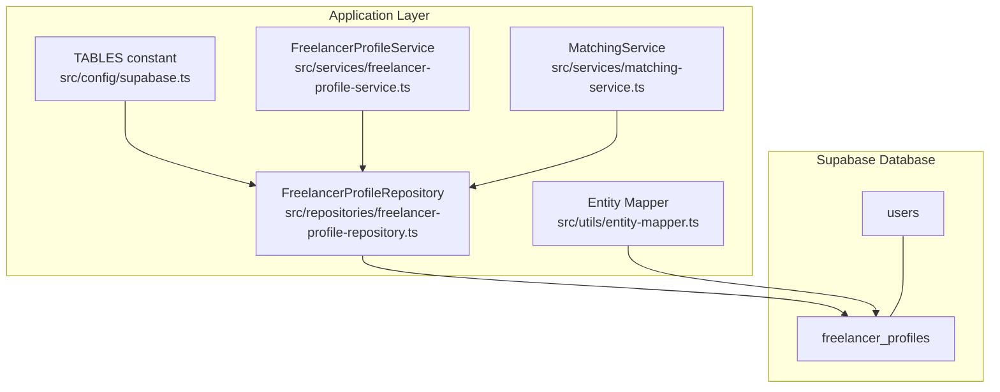

**Diagram sources**
- [schema.sql](file://supabase/schema.sql#L40-L51)
- [supabase.ts](file://src/config/supabase.ts#L6-L21)
- [freelancer-profile-repository.ts](file://src/repositories/freelancer-profile-repository.ts#L1-L20)
- [freelancer-profile-service.ts](file://src/services/freelancer-profile-service.ts#L1-L20)
- [entity-mapper.ts](file://src/utils/entity-mapper.ts#L130-L173)
- [matching-service.ts](file://src/services/matching-service.ts#L1-L40)

**Section sources**
- [schema.sql](file://supabase/schema.sql#L40-L51)
- [supabase.ts](file://src/config/supabase.ts#L6-L21)

## Core Components
- Table definition and constraints
  - Primary key: id (UUID)
  - Foreign key: user_id (unique, references users.id, cascade delete)
  - Columns: bio (TEXT), hourly_rate (DECIMAL), skills (JSONB array), experience (JSONB array), availability (CHECK ENUM), created_at (TIMESTAMPTZ), updated_at (TIMESTAMPTZ)
- Indexes
  - idx_freelancer_profiles_user_id on user_id
- RLS and policies
  - RLS enabled on freelancer_profiles
  - Service role policies grant full access for backend operations

These components form the foundation for storing detailed professional identity for freelancers and enabling efficient lookups and AI-driven matching.

**Section sources**
- [schema.sql](file://supabase/schema.sql#L40-L51)
- [schema.sql](file://supabase/schema.sql#L202-L206)
- [schema.sql](file://supabase/schema.sql#L224-L261)

## Architecture Overview
The freelancer_profiles table integrates with the application through typed repositories and services. The TABLES constant ensures consistent table naming. The entity mapper converts database entities to API-friendly models. The matching service reads profile data to compute skill-based recommendations.

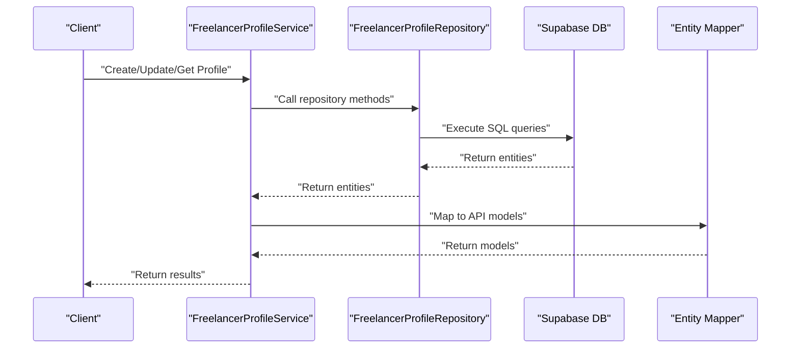

**Diagram sources**
- [freelancer-profile-service.ts](file://src/services/freelancer-profile-service.ts#L71-L134)
- [freelancer-profile-repository.ts](file://src/repositories/freelancer-profile-repository.ts#L21-L66)
- [entity-mapper.ts](file://src/utils/entity-mapper.ts#L130-L173)

## Detailed Component Analysis

### Table Definition and Columns
- id: UUID primary key with default generated value
- user_id: UUID unique foreign key referencing users.id with ON DELETE CASCADE
- bio: TEXT field for professional summary
- hourly_rate: DECIMAL(10, 2) default 0
- skills: JSONB array of skill entries; each entry contains name and years_of_experience
- experience: JSONB array of work experience entries; each entry contains id, title, company, description, start_date, end_date
- availability: VARCHAR(20) default 'available' with CHECK constraint limiting values to 'available', 'busy', 'unavailable'
- created_at, updated_at: TIMESTAMPTZ defaults for audit timestamps

Purpose:
- Stores detailed professional identity for freelancers, enabling personalized matching and filtering.

Relationship with users:
- One-to-one via unique foreign key user_id referencing users.id.

**Section sources**
- [schema.sql](file://supabase/schema.sql#L40-L51)

### JSONB Structures: Skills and Experience
- skills: Array of objects containing name and years_of_experience
- experience: Array of objects containing id, title, company, description, start_date, end_date

Usage in code:
- Repository methods accept and return arrays of these structures
- Services validate and update these arrays
- Entity mapper maps these structures to API models

Examples of structures:
- skills: [{"name": "...", "years_of_experience": 3}, ...]
- experience: [{"id": "...", "title": "...", "company": "...", "description": "...", "start_date": "...", "end_date": null}, ...]

These structures enable flexible querying and aggregation, such as filtering by skill name or availability.

**Section sources**
- [freelancer-profile-repository.ts](file://src/repositories/freelancer-profile-repository.ts#L4-L14)
- [freelancer-profile-service.ts](file://src/services/freelancer-profile-service.ts#L139-L218)
- [entity-mapper.ts](file://src/utils/entity-mapper.ts#L90-L111)
- [entity-mapper.ts](file://src/utils/entity-mapper.ts#L130-L173)

### Application Integration and Access Patterns
- TABLES constant
  - TABLES.FREELANCER_PROFILES provides centralized table name access across the codebase
- Repository methods
  - CRUD operations and specialized queries (by user_id, availability, skill containment)
- Service layer
  - Validates inputs, manages updates to skills and experience arrays, and exposes higher-level operations
- Entity mapping
  - Converts database entities to API models with camelCase fields

```mermaid
classDiagram
class FreelancerProfileEntity {
+string id
+string user_id
+string bio
+number hourly_rate
+SkillReference[] skills
+WorkExperience[] experience
+string availability
+string created_at
+string updated_at
}
class SkillReference {
+string name
+number years_of_experience
}
class WorkExperience {
+string id
+string title
+string company
+string description
+string start_date
+string end_date
}
class FreelancerProfileRepository {
+createProfile(profile)
+getProfileById(id)
+getProfileByUserId(userId)
+updateProfile(id, updates)
+deleteProfile(id)
+getAllProfiles()
+getProfilesBySkillId(skillId)
+getAvailableProfiles()
+searchBySkills(skillNames, options)
+searchByKeyword(keyword, options)
+getAllProfilesPaginated(options)
}
class FreelancerProfileService {
+createProfile(userId, input)
+getProfileByUserId(userId)
+updateProfile(userId, input)
+addSkillsToProfile(userId, skills)
+removeSkillFromProfile(userId, skillName)
+addExperience(userId, input)
+updateExperience(userId, experienceId, input)
+removeExperience(userId, experienceId)
}
FreelancerProfileRepository --> FreelancerProfileEntity : "operates on"
FreelancerProfileService --> FreelancerProfileRepository : "uses"
FreelancerProfileEntity --> SkillReference : "contains"
FreelancerProfileEntity --> WorkExperience : "contains"
```

**Diagram sources**
- [freelancer-profile-repository.ts](file://src/repositories/freelancer-profile-repository.ts#L1-L20)
- [freelancer-profile-service.ts](file://src/services/freelancer-profile-service.ts#L1-L35)
- [entity-mapper.ts](file://src/utils/entity-mapper.ts#L90-L111)
- [entity-mapper.ts](file://src/utils/entity-mapper.ts#L130-L173)

**Section sources**
- [supabase.ts](file://src/config/supabase.ts#L6-L21)
- [freelancer-profile-repository.ts](file://src/repositories/freelancer-profile-repository.ts#L21-L119)
- [freelancer-profile-service.ts](file://src/services/freelancer-profile-service.ts#L71-L134)
- [entity-mapper.ts](file://src/utils/entity-mapper.ts#L130-L173)

### Personalized Matching Through the AI Service
The matching service uses freelancer profiles to compute skill-based recommendations:
- Retrieves a freelancer’s profile by user_id
- Gathers open projects or available freelancers
- Converts skills to SkillInfo structures
- Computes match scores using AI or keyword-based fallback
- Ranks and returns recommendations

```mermaid
sequenceDiagram
participant Client as "Client"
participant MatchSvc as "MatchingService"
participant ProfRepo as "FreelancerProfileRepository"
participant ProjRepo as "ProjectRepository"
participant AISvc as "AI Client"
Client->>MatchSvc : "getProjectRecommendations(freelancerId)"
MatchSvc->>ProfRepo : "getProfileByUserId(userId)"
ProfRepo-->>MatchSvc : "ProfileEntity"
MatchSvc->>ProjRepo : "getAllOpenProjects(limit)"
ProjRepo-->>MatchSvc : "ProjectEntities"
MatchSvc->>AISvc : "analyzeSkillMatch(...)"
AISvc-->>MatchSvc : "SkillMatchResult or error"
MatchSvc-->>Client : "Ranked recommendations"
```

**Diagram sources**
- [matching-service.ts](file://src/services/matching-service.ts#L73-L141)
- [freelancer-profile-repository.ts](file://src/repositories/freelancer-profile-repository.ts#L29-L31)
- [matching-service.ts](file://src/services/matching-service.ts#L1-L40)

**Section sources**
- [matching-service.ts](file://src/services/matching-service.ts#L73-L141)
- [matching-service.ts](file://src/services/matching-service.ts#L143-L218)

### Index and Lookup Behavior
- Index: idx_freelancer_profiles_user_id on user_id
- Repository usage:
  - getProfileByUserId uses equality on user_id
  - getAvailableProfiles filters by availability
  - getProfilesBySkillId uses JSONB contains operator to match skill entries
  - searchBySkills performs server-side pagination and filters in-memory by skill name

```mermaid
flowchart TD
Start(["Search by Skills"]) --> SelectProfiles["Select all profiles with count"]
SelectProfiles --> Range["Apply pagination range"]
Range --> Filter["Filter in-memory by skill name (case-insensitive)"]
Filter --> Return["Return paginated results"]
```

**Diagram sources**
- [freelancer-profile-repository.ts](file://src/repositories/freelancer-profile-repository.ts#L68-L93)

**Section sources**
- [schema.sql](file://supabase/schema.sql#L202-L206)
- [freelancer-profile-repository.ts](file://src/repositories/freelancer-profile-repository.ts#L45-L66)
- [freelancer-profile-repository.ts](file://src/repositories/freelancer-profile-repository.ts#L68-L93)

### RLS Policies and Privacy Considerations
- RLS is enabled on freelancer_profiles
- Service role policies grant full access for backend operations
- Public read policies are defined for other tables (e.g., skill_categories, skills, open projects)
- For freelancer_profiles, the service role policy allows backend services to manage data while keeping row-level controls enabled

Privacy considerations:
- RLS enables fine-grained access control
- Backend services operate under the service role, minimizing exposure to client-side access
- Consider adding user-specific policies if granular visibility controls are required

**Section sources**
- [schema.sql](file://supabase/schema.sql#L224-L261)

## Dependency Analysis
- Centralized table naming via TABLES constant
- Repository encapsulates database access and index-backed queries
- Service layer validates inputs and orchestrates updates to JSONB arrays
- Entity mapper transforms database entities to API models
- Matching service depends on repository for profile data and AI client for scoring

```mermaid
graph LR
CFG["TABLES (src/config/supabase.ts)"] --> REP["FreelancerProfileRepository"]
REP --> DB["freelancer_profiles (DB)"]
SVC["FreelancerProfileService"] --> REP
MAP["Entity Mapper"] --> SVC
MATCH["MatchingService"] --> REP
```

**Diagram sources**
- [supabase.ts](file://src/config/supabase.ts#L6-L21)
- [freelancer-profile-repository.ts](file://src/repositories/freelancer-profile-repository.ts#L1-L20)
- [freelancer-profile-service.ts](file://src/services/freelancer-profile-service.ts#L1-L20)
- [entity-mapper.ts](file://src/utils/entity-mapper.ts#L130-L173)
- [matching-service.ts](file://src/services/matching-service.ts#L1-L40)

**Section sources**
- [supabase.ts](file://src/config/supabase.ts#L6-L21)
- [freelancer-profile-repository.ts](file://src/repositories/freelancer-profile-repository.ts#L1-L20)
- [freelancer-profile-service.ts](file://src/services/freelancer-profile-service.ts#L1-L20)
- [entity-mapper.ts](file://src/utils/entity-mapper.ts#L130-L173)
- [matching-service.ts](file://src/services/matching-service.ts#L1-L40)

## Performance Considerations
- Use the idx_freelancer_profiles_user_id index for lookups by user_id
- For skill-based filtering, leverage getProfilesBySkillId with JSONB contains to utilize index-backed queries
- For keyword searches, use searchByKeyword with ILIKE and pagination to avoid scanning entire tables
- Consider adding GIN indexes on skills and experience JSONB columns if frequent containment or overlap queries become common

[No sources needed since this section provides general guidance]

## Troubleshooting Guide
Common issues and resolutions:
- Profile not found by user_id
  - Ensure the user_id exists and the profile was created
  - Verify getProfileByUserId returns null and handle accordingly
- Skill updates not persisting
  - Confirm addSkillsToProfile removes duplicates and merges arrays correctly
  - Validate that repository.updateProfile is invoked with the updated skills array
- Experience date validation errors
  - Ensure start dates are before or equal to end dates
  - Validate date string formats before updating
- Availability filtering yields unexpected results
  - Confirm availability values are one of 'available', 'busy', 'unavailable'

**Section sources**
- [freelancer-profile-service.ts](file://src/services/freelancer-profile-service.ts#L139-L218)
- [freelancer-profile-service.ts](file://src/services/freelancer-profile-service.ts#L223-L356)
- [freelancer-profile-repository.ts](file://src/repositories/freelancer-profile-repository.ts#L45-L66)

## Conclusion
The freelancer_profiles table defines the detailed professional identity for freelancers, with a one-to-one relationship to users and robust support for skill and experience JSONB structures. The TABLES constant, repository methods, and service layer provide a cohesive integration that powers AI-driven matching. Proper indexing and RLS policies ensure efficient and secure access, while JSONB flexibility enables powerful querying and aggregation.

---

# KYC Verifications Table

<cite>
**Referenced Files in This Document**
- [schema.sql](file://supabase/schema.sql)
- [supabase.ts](file://src/config/supabase.ts)
- [kyc.ts](file://src/models/kyc.ts)
- [kyc-repository.ts](file://src/repositories/kyc-repository.ts)
- [kyc-service.ts](file://src/services/kyc-service.ts)
- [kyc-routes.ts](file://src/routes/kyc-routes.ts)
- [KYCVerification.sol](file://contracts/KYCVerification.sol)
- [kyc-contract.ts](file://src/services/kyc-contract.ts)
- [base-repository.ts](file://src/repositories/base-repository.ts)
</cite>

## Table of Contents
1. [Introduction](#introduction)
2. [Project Structure](#project-structure)
3. [Core Components](#core-components)
4. [Architecture Overview](#architecture-overview)
5. [Detailed Component Analysis](#detailed-component-analysis)
6. [Dependency Analysis](#dependency-analysis)
7. [Performance Considerations](#performance-considerations)
8. [Troubleshooting Guide](#troubleshooting-guide)
9. [Conclusion](#conclusion)
10. [Appendices](#appendices)

## Introduction
This document provides comprehensive data model documentation for the kyc_verifications table in the FreelanceXchain Supabase PostgreSQL database. It explains each column, constraints, indexes, and roles within the privacy-preserving identity verification system integrated with blockchain. The table serves as the central persistence layer for international KYC submissions, biometric checks, and administrative review, while the on-chain KYCVerification.sol smart contract ensures immutable, transparent verification records without exposing personal data.

The documentation covers:
- Column definitions and data types
- Purpose and relationships to users and admin reviewers
- Status lifecycle and tier levels
- Biometric and document handling
- Compliance and trust mechanisms
- RLS policies and data protection
- Withdrawal limits and dispute resolution privileges tied to KYC status
- Index usage and performance considerations

## Project Structure
The kyc_verifications table is defined in the Supabase schema and accessed through typed models, repositories, services, and routes. The on-chain counterpart is implemented in Solidity and bridged via service functions.

```mermaid
graph TB
subgraph "Supabase Database"
TBL["kyc_verifications table"]
IDX["idx_kyc_user_id index"]
end
subgraph "Backend Services"
ROUTE["kyc-routes.ts"]
SVC["kyc-service.ts"]
REPO["kyc-repository.ts"]
MODEL["kyc.ts"]
CFG["supabase.ts"]
end
subgraph "Blockchain"
SOL["KYCVerification.sol"]
CON["kyc-contract.ts"]
end
ROUTE --> SVC
SVC --> REPO
REPO --> TBL
REPO --> IDX
SVC --> CON
CON --> SOL
CFG --> REPO
MODEL --> SVC
```

**Diagram sources**
- [schema.sql](file://supabase/schema.sql#L135-L159)
- [kyc-routes.ts](file://src/routes/kyc-routes.ts#L1-L120)
- [kyc-service.ts](file://src/services/kyc-service.ts#L1-L120)
- [kyc-repository.ts](file://src/repositories/kyc-repository.ts#L1-L40)
- [kyc.ts](file://src/models/kyc.ts#L1-L120)
- [supabase.ts](file://src/config/supabase.ts#L6-L21)
- [KYCVerification.sol](file://contracts/KYCVerification.sol#L1-L60)
- [kyc-contract.ts](file://src/services/kyc-contract.ts#L1-L60)

**Section sources**
- [schema.sql](file://supabase/schema.sql#L135-L159)
- [supabase.ts](file://src/config/supabase.ts#L6-L21)

## Core Components
- Table definition and constraints: The kyc_verifications table defines UUID primary keys, foreign key to users, status with a constrained set of values, tier levels, personal information fields, address as JSONB, documents as JSONB array, biometric liveness_check JSONB, timestamps, reviewer linkage, rejection reason, and audit timestamps.
- Index: An index on user_id accelerates lookups by user.
- RLS: Row Level Security is enabled on the table to enforce access controls.
- Backend mapping: Typed models define the shape of KYC records, including nested JSONB structures for address and documents, and optional biometric data.
- Repository and service: The repository encapsulates CRUD operations and status queries; the service orchestrates submission, liveness, face match, review, and blockchain synchronization.

**Section sources**
- [schema.sql](file://supabase/schema.sql#L135-L159)
- [schema.sql](file://supabase/schema.sql#L215-L215)
- [schema.sql](file://supabase/schema.sql#L234-L234)
- [kyc.ts](file://src/models/kyc.ts#L84-L119)
- [kyc-repository.ts](file://src/repositories/kyc-repository.ts#L1-L40)
- [kyc-service.ts](file://src/services/kyc-service.ts#L86-L190)

## Architecture Overview
The KYC system integrates off-chain persistence with on-chain immutability:
- Off-chain: Supabase stores KYC records, user references, and biometric metadata. Routes and services manage submission, liveness, face match, and admin review.
- On-chain: The KYCVerification.sol contract stores verification status, tier, data hash, and expiration, enabling trustless verification checks and dispute resolution.

```mermaid
sequenceDiagram
participant Client as "Client"
participant Route as "kyc-routes.ts"
participant Svc as "kyc-service.ts"
participant Repo as "kyc-repository.ts"
participant DB as "Supabase DB"
participant BcSvc as "kyc-contract.ts"
participant SC as "KYCVerification.sol"
Client->>Route : POST /api/kyc/submit
Route->>Svc : submitKyc(userId, input)
Svc->>Repo : create/update KYC record
Repo->>DB : INSERT/UPDATE kyc_verifications
DB-->>Repo : OK
Repo-->>Svc : KYC record
Svc->>BcSvc : submitKycToBlockchain(...)
BcSvc->>SC : submitVerification(...)
SC-->>BcSvc : OK
Svc-->>Route : KYC result
Route-->>Client : 201 Created
```

**Diagram sources**
- [kyc-routes.ts](file://src/routes/kyc-routes.ts#L367-L428)
- [kyc-service.ts](file://src/services/kyc-service.ts#L90-L190)
- [kyc-repository.ts](file://src/repositories/kyc-repository.ts#L124-L129)
- [kyc-contract.ts](file://src/services/kyc-contract.ts#L93-L156)
- [KYCVerification.sol](file://contracts/KYCVerification.sol#L61-L87)

## Detailed Component Analysis

### Table Schema and Columns
The kyc_verifications table schema defines:
- id: UUID primary key with default generated value
- user_id: UUID foreign key to users(id) with cascade delete
- status: VARCHAR with CHECK constraint limiting values to pending, submitted, under_review, approved, rejected
- tier: INTEGER default 1
- Personal information: first_name, middle_name, last_name, date_of_birth, place_of_birth, nationality, secondary_nationality, tax_residence_country, tax_identification_number
- address: JSONB default empty object
- documents: JSONB default empty array
- liveness_check: JSONB for biometric session data
- submitted_at, reviewed_at: TIMESTAMPTZ
- reviewed_by: UUID foreign key to users(id)
- rejection_reason: TEXT
- created_at, updated_at: TIMESTAMPTZ defaults

Index:
- idx_kyc_user_id on user_id

RLS:
- Enabled on kyc_verifications

Purpose:
- Central persistence for international KYC submissions, biometric verification, and administrative review.
- Integrates with blockchain via stored hashes and status to enable trustless verification.

**Section sources**
- [schema.sql](file://supabase/schema.sql#L135-L159)
- [schema.sql](file://supabase/schema.sql#L215-L215)
- [schema.sql](file://supabase/schema.sql#L234-L234)

### Data Model Types
Typed models define:
- KycStatus union and KycTier enumeration
- InternationalAddress interface for address JSONB
- KycDocument and OCR/MRZ extraction types
- LivenessCheck and LivenessChallenge structures
- KycVerification interface mirroring the table schema plus additional fields for internal processing (e.g., selfie URL, face match, AML screening, risk metrics)
- Submission, liveness, face match, and review input types

These types ensure strong typing across the API, repository, and service layers.

**Section sources**
- [kyc.ts](file://src/models/kyc.ts#L1-L120)
- [kyc.ts](file://src/models/kyc.ts#L136-L206)

### Repository and Entity Mapping
The repository:
- Extends BaseRepository with the kyc_verifications table name
- Provides create, get by id, get by user id, update, and status-based queries
- Uses Supabase client to select, insert, update, and order by timestamps

Entity-to-model mapping:
- Converts snake_case database fields to camelCase model properties
- Preserves JSONB structures for address, documents, and liveness_check
- Maps optional fields and enums appropriately

**Section sources**
- [kyc-repository.ts](file://src/repositories/kyc-repository.ts#L1-L40)
- [kyc-repository.ts](file://src/repositories/kyc-repository.ts#L43-L117)
- [kyc-repository.ts](file://src/repositories/kyc-repository.ts#L119-L175)
- [base-repository.ts](file://src/repositories/base-repository.ts#L39-L86)

### Service Orchestration
Key flows:
- Submission: Validates country and document type support, prevents duplicates, sets status to submitted, attaches documents, and optionally submits to blockchain
- Liveness: Creates a session with randomized challenges, validates session, computes confidence, and marks pass/fail/expired
- Face Match: Computes similarity score and updates face match status
- Review: Approves or rejects, sets reviewer, risk metrics, and updates blockchain accordingly
- Integrity: Compares off-chain status with on-chain verification and verifies data hash

**Section sources**
- [kyc-service.ts](file://src/services/kyc-service.ts#L86-L190)
- [kyc-service.ts](file://src/services/kyc-service.ts#L193-L293)
- [kyc-service.ts](file://src/services/kyc-service.ts#L295-L318)
- [kyc-service.ts](file://src/services/kyc-service.ts#L328-L407)
- [kyc-service.ts](file://src/services/kyc-service.ts#L470-L547)

### Blockchain Integration
The backend simulates blockchain interactions:
- Generates data hash and user ID hash
- Submits KYC to blockchain (pending), approves (approved with tier and expiry), or rejects (rejected with reason)
- Checks wallet verification status and compares with off-chain records

The on-chain contract:
- Stores verification status, tier, dataHash, verifiedAt, expiresAt, verifiedBy, and rejectionReason
- Supports submit, approve, reject, expire, and query functions
- Emits events for transparency

**Section sources**
- [kyc-contract.ts](file://src/services/kyc-contract.ts#L66-L156)
- [kyc-contract.ts](file://src/services/kyc-contract.ts#L158-L221)
- [kyc-contract.ts](file://src/services/kyc-contract.ts#L223-L278)
- [kyc-contract.ts](file://src/services/kyc-contract.ts#L280-L338)
- [KYCVerification.sol](file://contracts/KYCVerification.sol#L1-L60)
- [KYCVerification.sol](file://contracts/KYCVerification.sol#L88-L150)
- [KYCVerification.sol](file://contracts/KYCVerification.sol#L151-L210)

### API Exposure and Admin Workflows
Routes expose:
- Countries and requirements
- Status retrieval
- Submission endpoint
- Liveness session creation and verification
- Face match endpoint
- Additional document upload
- Admin endpoints to list pending reviews and get by status

Validation and error handling are implemented in routes and services.

**Section sources**
- [kyc-routes.ts](file://src/routes/kyc-routes.ts#L240-L365)
- [kyc-routes.ts](file://src/routes/kyc-routes.ts#L367-L428)
- [kyc-routes.ts](file://src/routes/kyc-routes.ts#L430-L540)
- [kyc-routes.ts](file://src/routes/kyc-routes.ts#L541-L624)
- [kyc-routes.ts](file://src/routes/kyc-routes.ts#L626-L698)
- [kyc-routes.ts](file://src/routes/kyc-routes.ts#L700-L764)
- [kyc-routes.ts](file://src/routes/kyc-routes.ts#L766-L800)

## Dependency Analysis
- supabase.ts defines TABLES.KYC_VERIFICATIONS and exposes it to repositories
- kyc-repository.ts depends on supabase.ts for table name and BaseRepository for DB operations
- kyc-service.ts depends on kyc-repository.ts and kyc-contract.ts
- kyc-routes.ts depends on kyc-service.ts and exports Swagger schemas
- KYCVerification.sol is the on-chain dependency for blockchain operations

```mermaid
graph LR
SUP["supabase.ts"] --> REP["kyc-repository.ts"]
REP --> SVC["kyc-service.ts"]
SVC --> RT["kyc-routes.ts"]
SVC --> BC["kyc-contract.ts"]
BC --> SOL["KYCVerification.sol"]
```

**Diagram sources**
- [supabase.ts](file://src/config/supabase.ts#L6-L21)
- [kyc-repository.ts](file://src/repositories/kyc-repository.ts#L1-L20)
- [kyc-service.ts](file://src/services/kyc-service.ts#L1-L20)
- [kyc-routes.ts](file://src/routes/kyc-routes.ts#L1-L20)
- [kyc-contract.ts](file://src/services/kyc-contract.ts#L1-L20)
- [KYCVerification.sol](file://contracts/KYCVerification.sol#L1-L20)

**Section sources**
- [supabase.ts](file://src/config/supabase.ts#L6-L21)
- [kyc-repository.ts](file://src/repositories/kyc-repository.ts#L1-L20)
- [kyc-service.ts](file://src/services/kyc-service.ts#L1-L20)
- [kyc-routes.ts](file://src/routes/kyc-routes.ts#L1-L20)
- [kyc-contract.ts](file://src/services/kyc-contract.ts#L1-L20)
- [KYCVerification.sol](file://contracts/KYCVerification.sol#L1-L20)

## Performance Considerations
- Index usage: The idx_kyc_user_id index optimizes lookups by user_id, crucial for retrieving the latest KYC record per user.
- Query patterns: Repository methods use ordering by created_at and limits for paginated admin review lists.
- JSONB storage: Efficient for flexible document and address structures; consider selective indexing if querying nested fields frequently.
- RLS overhead: Enabling RLS adds minimal overhead; ensure policies remain minimal and targeted.

**Section sources**
- [schema.sql](file://supabase/schema.sql#L215-L215)
- [kyc-repository.ts](file://src/repositories/kyc-repository.ts#L136-L170)

## Troubleshooting Guide
Common issues and resolutions:
- Duplicate KYC submission: The service prevents re-submission if already approved or pending; handle 409 Conflict responses.
- Liveness session errors: Session invalid or expired; recreate session or verify session ID and expiry.
- Validation failures: Ensure required fields (name, DOB, nationality, address, document) are present and formatted correctly.
- Admin review errors: Rejection requires a reason; ensure rejectionReason is provided when rejecting.
- Blockchain sync: If blockchain operations fail, logs indicate failure; retry or inspect transaction receipts.

**Section sources**
- [kyc-service.ts](file://src/services/kyc-service.ts#L90-L190)
- [kyc-service.ts](file://src/services/kyc-service.ts#L193-L293)
- [kyc-service.ts](file://src/services/kyc-service.ts#L328-L407)
- [kyc-routes.ts](file://src/routes/kyc-routes.ts#L367-L428)
- [kyc-routes.ts](file://src/routes/kyc-routes.ts#L430-L540)

## Conclusion
The kyc_verifications table is the backbone of FreelanceXchain’s privacy-preserving KYC system. It captures international identity data, biometric verification, and administrative review while maintaining strict compliance and transparency. Off-chain storage ensures flexibility and performance, while on-chain verification guarantees immutability and trust. Together with RLS and robust service-layer orchestration, the system establishes a secure foundation for compliance, withdrawal limits enforcement, and dispute resolution.

## Appendices

### Column Reference and Constraints
- id: UUID primary key
- user_id: UUID foreign key to users(id), cascade delete
- status: CHECK (pending, submitted, under_review, approved, rejected)
- tier: INTEGER default 1
- Personal info: first_name, middle_name, last_name, date_of_birth, place_of_birth, nationality, secondary_nationality, tax_residence_country, tax_identification_number
- address: JSONB default {}
- documents: JSONB default []
- liveness_check: JSONB
- submitted_at, reviewed_at: TIMESTAMPTZ
- reviewed_by: UUID foreign key to users(id)
- rejection_reason: TEXT
- created_at, updated_at: TIMESTAMPTZ defaults

**Section sources**
- [schema.sql](file://supabase/schema.sql#L135-L159)

### RLS Policies and Data Protection
- RLS enabled on kyc_verifications
- Service role policy allows backend operations
- Access control should be enforced at route and service layers; ensure user isolation and admin-only endpoints for review

**Section sources**
- [schema.sql](file://supabase/schema.sql#L225-L240)
- [schema.sql](file://supabase/schema.sql#L246-L261)

### Example: How KYC Status Affects Withdrawal Limits and Disputes
- Approved KYC status enables higher withdrawal limits and grants dispute resolution privileges based on tier.
- Pending or rejected status restricts actions until verification completes or is resolved.
- The service layer enforces these rules during transactions and dispute handling.

[No sources needed since this section provides conceptual guidance]

### Example: How KYC Status Affects Dispute Resolution Privileges
- Higher tiers (standard/enhanced) may grant additional rights in dispute resolution workflows.
- The service compares off-chain status with on-chain verification to ensure integrity and enforce policies consistently.

[No sources needed since this section provides conceptual guidance]

---

# Messages Table

<cite>
**Referenced Files in This Document**
- [schema.sql](file://supabase/schema.sql)
- [supabase.ts](file://src/config/supabase.ts)
- [message-repository.ts](file://src/repositories/message-repository.ts)
- [message-service.ts](file://src/services/message-service.ts)
- [contract-repository.ts](file://src/repositories/contract-repository.ts)
- [base-repository.ts](file://src/repositories/base-repository.ts)
</cite>

## Table of Contents
1. [Introduction](#introduction)
2. [Project Structure](#project-structure)
3. [Core Components](#core-components)
4. [Architecture Overview](#architecture-overview)
5. [Detailed Component Analysis](#detailed-component-analysis)
6. [Dependency Analysis](#dependency-analysis)
7. [Performance Considerations](#performance-considerations)
8. [Troubleshooting Guide](#troubleshooting-guide)
9. [Conclusion](#conclusion)

## Introduction
This document describes the messages table in the FreelanceXchain Supabase PostgreSQL database. It defines the table schema, explains the purpose of secure communication between contract parties, and documents how the application enforces access control and performance optimizations. It also covers message threading within contracts, read receipts, and the role of messages in dispute evidence collection.

## Project Structure
The messages table is defined in the Supabase schema and is accessed by the application through a typed repository and service layer. The TABLES.MESSAGES constant centralizes table naming across the codebase.

```mermaid
graph TB
subgraph "Supabase Schema"
MSG["messages (table)"]
CON["contracts (table)"]
USR["users (table)"]
end
subgraph "Application Layer"
CFG["TABLES.MESSAGES constant"]
REP["MessageRepository"]
SVC["MessageService"]
CREP["ContractRepository"]
end
CFG --> REP
REP --> MSG
SVC --> REP
SVC --> CREP
MSG --> CON
MSG --> USR
```

**Diagram sources**
- [schema.sql](file://supabase/schema.sql#L175-L184)
- [supabase.ts](file://src/config/supabase.ts#L6-L21)
- [message-repository.ts](file://src/repositories/message-repository.ts#L1-L82)
- [message-service.ts](file://src/services/message-service.ts#L1-L84)
- [contract-repository.ts](file://src/repositories/contract-repository.ts#L1-L139)

**Section sources**
- [schema.sql](file://supabase/schema.sql#L175-L184)
- [supabase.ts](file://src/config/supabase.ts#L6-L21)

## Core Components
- messages table: Stores secure, contract-scoped communications between parties.
- MessageRepository: Typed repository providing CRUD and query helpers for messages.
- MessageService: Orchestrates message creation, retrieval, and read receipts while enforcing participant checks.
- ContractRepository: Validates contract existence and participant roles before message operations.
- TABLES.MESSAGES: Centralized table name constant used by repositories and services.

**Section sources**
- [schema.sql](file://supabase/schema.sql#L175-L184)
- [message-repository.ts](file://src/repositories/message-repository.ts#L1-L82)
- [message-service.ts](file://src/services/message-service.ts#L1-L84)
- [contract-repository.ts](file://src/repositories/contract-repository.ts#L1-L139)
- [supabase.ts](file://src/config/supabase.ts#L6-L21)

## Architecture Overview
The messages table underpins secure, contract-bound communication. It ensures only authorized parties can access messages and provides efficient querying via indexes. Read receipts are tracked per message and can be batch-marked as read.

```mermaid
sequenceDiagram
participant Client as "Client"
participant Service as "MessageService"
participant ContractRepo as "ContractRepository"
participant Repo as "MessageRepository"
participant DB as "Supabase DB"
Client->>Service : "sendMessage(contractId, senderId, content)"
Service->>ContractRepo : "getContractById(contractId)"
ContractRepo->>DB : "SELECT * FROM contracts WHERE id = contractId"
DB-->>ContractRepo : "ContractEntity"
ContractRepo-->>Service : "ContractEntity"
Service->>Service : "Verify sender is freelancer or employer"
Service->>Repo : "create({ contract_id, sender_id, content, is_read=false })"
Repo->>DB : "INSERT INTO messages"
DB-->>Repo : "MessageEntity"
Repo-->>Service : "MessageEntity"
Service-->>Client : "MessageEntity"
```

**Diagram sources**
- [message-service.ts](file://src/services/message-service.ts#L18-L47)
- [contract-repository.ts](file://src/repositories/contract-repository.ts#L24-L35)
- [message-repository.ts](file://src/repositories/message-repository.ts#L39-L62)
- [base-repository.ts](file://src/repositories/base-repository.ts#L39-L55)

## Detailed Component Analysis

### Messages Table Schema
- id: UUID primary key with default generated value.
- contract_id: UUID foreign key referencing contracts(id), cascade delete.
- sender_id: UUID foreign key referencing users(id), cascade delete.
- content: Text field, required.
- is_read: Boolean flag, defaults to false.
- created_at: Timestamp with timezone, default current time.
- updated_at: Timestamp with timezone, default current time.

Purpose:
- Provides a secure communication channel between parties in a contract.
- Enables collaboration by persisting conversations scoped to a contract.
- Supports read receipts and dispute evidence capture.

Indexes:
- idx_messages_contract_id: Improves query performance for contract-scoped message retrieval.
- idx_messages_sender_id: Optimizes sender-based filtering and analytics.

RLS Policies:
- RLS enabled on messages table.
- Service role policy grants full access for backend operations.
- Additional participant-based policies are enforced at the application level during reads/writes.

**Section sources**
- [schema.sql](file://supabase/schema.sql#L175-L184)
- [schema.sql](file://supabase/schema.sql#L202-L224)
- [schema.sql](file://supabase/schema.sql#L225-L261)
- [message-repository.ts](file://src/repositories/message-repository.ts#L18-L37)
- [message-repository.ts](file://src/repositories/message-repository.ts#L39-L62)

### Message Threading Within a Contract
- Messages are grouped by contract_id.
- Retrieval sorts by created_at ascending to display chronological order.
- Latest message per contract can be fetched for conversation summaries.

```mermaid
flowchart TD
Start(["Get Messages for Contract"]) --> CheckUser["Verify user is a contract participant"]
CheckUser --> |Valid| Query["Query messages by contract_id<br/>ORDER BY created_at ASC"]
CheckUser --> |Invalid| Error["Throw error: not a participant"]
Query --> Paginate["Apply pagination (limit/offset)"]
Paginate --> Return["Return paginated messages"]
Error --> End(["End"])
Return --> End
```

**Diagram sources**
- [message-service.ts](file://src/services/message-service.ts#L49-L58)
- [message-repository.ts](file://src/repositories/message-repository.ts#L18-L37)

**Section sources**
- [message-repository.ts](file://src/repositories/message-repository.ts#L18-L37)
- [message-service.ts](file://src/services/message-service.ts#L49-L58)

### Read Receipt Tracking
- is_read flag defaults to false when a message is created.
- Unread count is computed for the other party (neq sender_id).
- Batch marking as read updates is_read and updated_at for all unread messages in a contract for the other party.

```mermaid
flowchart TD
Entry(["Mark Messages as Read"]) --> Fetch["Select messages where:<br/>contract_id = X<br/>sender_id != userId<br/>is_read = false"]
Fetch --> Update["UPDATE is_read=true, updated_at=CURRENT_TIMESTAMP"]
Update --> Done(["Done"])
```

**Diagram sources**
- [message-repository.ts](file://src/repositories/message-repository.ts#L39-L62)

**Section sources**
- [message-repository.ts](file://src/repositories/message-repository.ts#L39-L62)

### Role-Based Access Control and Participant Checks
- Application-level enforcement ensures only parties in a contract can send or retrieve messages.
- MessageService validates that the sender is either the freelancer or employer linked to the contract.

```mermaid
sequenceDiagram
participant Svc as "MessageService"
participant CRepo as "ContractRepository"
participant Repo as "MessageRepository"
Svc->>CRepo : "getContractById(contractId)"
CRepo-->>Svc : "ContractEntity"
Svc->>Svc : "Check senderId equals freelancer_id OR employer_id"
alt Valid participant
Svc->>Repo : "findByContractId(contractId, options)"
Repo-->>Svc : "Paginated messages"
else Not participant
Svc-->>Svc : "Throw error"
end
```

**Diagram sources**
- [message-service.ts](file://src/services/message-service.ts#L49-L58)
- [contract-repository.ts](file://src/repositories/contract-repository.ts#L24-L35)

**Section sources**
- [message-service.ts](file://src/services/message-service.ts#L21-L27)
- [message-service.ts](file://src/services/message-service.ts#L49-L58)

### Evidence Gathering for Disputes
- Messages are persisted with timestamps and sender identity.
- Disputes can reference relevant messages as evidence.
- The is_read flag helps track whether a party has seen messages prior to escalation.

**Section sources**
- [schema.sql](file://supabase/schema.sql#L109-L120)
- [schema.sql](file://supabase/schema.sql#L175-L184)

## Dependency Analysis
- The messages table depends on contracts and users via foreign keys.
- Repositories and services depend on the TABLES.MESSAGES constant for table identification.
- MessageService depends on ContractRepository to validate participants.

```mermaid
graph LR
SUP["supabase.ts<br/>TABLES.MESSAGES"] --> MR["MessageRepository"]
MR --> MS["MessageService"]
MS --> CR["ContractRepository"]
MR --> DB["Supabase DB<br/>messages"]
CR --> DB
US["users"] --> DB
CT["contracts"] --> DB
```

**Diagram sources**
- [supabase.ts](file://src/config/supabase.ts#L6-L21)
- [message-repository.ts](file://src/repositories/message-repository.ts#L1-L16)
- [message-service.ts](file://src/services/message-service.ts#L1-L17)
- [contract-repository.ts](file://src/repositories/contract-repository.ts#L1-L19)
- [schema.sql](file://supabase/schema.sql#L95-L106)
- [schema.sql](file://supabase/schema.sql#L175-L184)

**Section sources**
- [supabase.ts](file://src/config/supabase.ts#L6-L21)
- [message-repository.ts](file://src/repositories/message-repository.ts#L1-L16)
- [message-service.ts](file://src/services/message-service.ts#L1-L17)
- [contract-repository.ts](file://src/repositories/contract-repository.ts#L1-L19)
- [schema.sql](file://supabase/schema.sql#L95-L106)
- [schema.sql](file://supabase/schema.sql#L175-L184)

## Performance Considerations
- Indexes on contract_id and sender_id improve query performance for:
  - Listing messages per contract.
  - Filtering unread messages by sender.
- Pagination is supported via limit/offset to handle large conversation histories.
- Batch marking as read updates only the necessary records.

**Section sources**
- [schema.sql](file://supabase/schema.sql#L202-L224)
- [message-repository.ts](file://src/repositories/message-repository.ts#L18-L37)
- [message-repository.ts](file://src/repositories/message-repository.ts#L39-L62)

## Troubleshooting Guide
- Contract not found: Ensure the contract exists before sending or retrieving messages.
- User not a participant: Only the freelancer or employer associated with a contract can send or view messages.
- Read receipt not updating: Confirm that the caller is the other party (neq sender_id) and that messages remain is_read=false.
- No messages returned: Verify pagination parameters and that the contract_id is correct.

**Section sources**
- [message-service.ts](file://src/services/message-service.ts#L21-L27)
- [message-service.ts](file://src/services/message-service.ts#L49-L58)
- [message-repository.ts](file://src/repositories/message-repository.ts#L39-L62)

## Conclusion
The messages table provides a secure, indexed, and participant-enforced communication mechanism for contract collaboration. Its design supports chronological threading, read receipts, and efficient querying. Together with RLS and application-level checks, it ensures privacy and integrity of communications while enabling evidence collection for disputes.

---

# Notifications Table

<cite>
**Referenced Files in This Document**
- [schema.sql](file://supabase/schema.sql)
- [supabase.ts](file://src/config/supabase.ts)
- [notification-repository.ts](file://src/repositories/notification-repository.ts)
- [notification-service.ts](file://src/services/notification-service.ts)
- [entity-mapper.ts](file://src/utils/entity-mapper.ts)
- [notification-routes.ts](file://src/routes/notification-routes.ts)
</cite>

## Table of Contents
1. [Introduction](#introduction)
2. [Project Structure](#project-structure)
3. [Core Components](#core-components)
4. [Architecture Overview](#architecture-overview)
5. [Detailed Component Analysis](#detailed-component-analysis)
6. [Dependency Analysis](#dependency-analysis)
7. [Performance Considerations](#performance-considerations)
8. [Troubleshooting Guide](#troubleshooting-guide)
9. [Conclusion](#conclusion)

## Introduction
This document describes the notifications table in the FreelanceXchain Supabase PostgreSQL database. It explains the table schema, the roles of each column, and how the table powers the event-driven communication system for user engagement. The notifications table stores events such as proposal status changes, contract updates, and messages, enabling targeted UI behaviors for users.

## Project Structure
The notifications table is defined in the Supabase schema and is accessed through the backend service layer and routes. The key files involved are:
- Database schema definition
- Backend constants for table names
- Repository and service layers for CRUD operations and helper functions
- Swagger route definitions for consuming notifications in the API

```mermaid
graph TB
subgraph "Database"
NTF["notifications table"]
end
subgraph "Backend"
CFG["TABLES constant<br/>supabase.ts"]
REP["NotificationRepository<br/>notification-repository.ts"]
SVC["NotificationService<br/>notification-service.ts"]
RT["Notification Routes<br/>notification-routes.ts"]
end
CFG --> REP
REP --> NTF
SVC --> REP
RT --> SVC
```

**Diagram sources**
- [schema.sql](file://supabase/schema.sql#L122-L133)
- [supabase.ts](file://src/config/supabase.ts#L6-L21)
- [notification-repository.ts](file://src/repositories/notification-repository.ts#L28-L117)
- [notification-service.ts](file://src/services/notification-service.ts#L1-L316)
- [notification-routes.ts](file://src/routes/notification-routes.ts#L1-L289)

**Section sources**
- [schema.sql](file://supabase/schema.sql#L122-L133)
- [supabase.ts](file://src/config/supabase.ts#L6-L21)

## Core Components
- notifications table: Stores event notifications for users with metadata and payload.
- TABLES.NOTIFICATIONS: Centralized table name constant used across the codebase.
- NotificationRepository: Encapsulates CRUD and query operations for notifications.
- NotificationService: Provides typed helpers for creating notifications and managing read state.
- Notification Routes: Expose API endpoints to list, count, and mark notifications as read.

**Section sources**
- [schema.sql](file://supabase/schema.sql#L122-L133)
- [supabase.ts](file://src/config/supabase.ts#L6-L21)
- [notification-repository.ts](file://src/repositories/notification-repository.ts#L28-L117)
- [notification-service.ts](file://src/services/notification-service.ts#L1-L316)
- [notification-routes.ts](file://src/routes/notification-routes.ts#L1-L289)

## Architecture Overview
The notifications system follows a layered architecture:
- Data layer: Supabase PostgreSQL table with indexes and RLS enabled.
- Service layer: Typed helpers and business logic for creating and updating notifications.
- Repository layer: Generic base repository plus notification-specific queries.
- API layer: Routes exposing endpoints for listing, counting, and marking notifications as read.

```mermaid
sequenceDiagram
participant Client as "Client"
participant Route as "Notification Routes"
participant Service as "NotificationService"
participant Repo as "NotificationRepository"
participant DB as "Supabase DB"
Client->>Route : GET /api/notifications
Route->>Service : getNotificationsByUser(userId, options)
Service->>Repo : getNotificationsByUser(userId, options)
Repo->>DB : SELECT ... WHERE user_id=? ORDER BY created_at DESC
DB-->>Repo : Rows
Repo-->>Service : PaginatedResult<NotificationEntity>
Service-->>Route : PaginatedResult<Notification>
Route-->>Client : 200 OK
Client->>Route : PATCH /api/notifications/{id}/read
Route->>Service : markNotificationAsRead(id, userId)
Service->>Repo : getNotificationById(id)
Repo->>DB : SELECT * FROM notifications WHERE id=?
DB-->>Repo : Row
Repo-->>Service : NotificationEntity
Service->>Repo : update(id, { is_read : true })
Repo->>DB : UPDATE ... SET is_read=true
DB-->>Repo : Updated Row
Repo-->>Service : Updated NotificationEntity
Service-->>Route : Notification
Route-->>Client : 200 OK
```

**Diagram sources**
- [notification-routes.ts](file://src/routes/notification-routes.ts#L83-L118)
- [notification-service.ts](file://src/services/notification-service.ts#L80-L151)
- [notification-repository.ts](file://src/repositories/notification-repository.ts#L41-L117)
- [schema.sql](file://supabase/schema.sql#L122-L133)

## Detailed Component Analysis

### Database Schema: notifications table
- Purpose: Event-driven communication hub for user engagement.
- Columns:
  - id: UUID primary key, auto-generated.
  - user_id: UUID foreign key referencing users(id), cascade delete.
  - type: String categorizing the notification (e.g., proposal-related, milestone-related, payment-related, dispute-related, rating-related, message).
  - title: String, not null, short headline for the notification.
  - message: Text, human-readable description of the event.
  - data: JSONB payload containing contextual details (IDs, titles, amounts, etc.).
  - is_read: Boolean flag indicating whether the user has viewed the notification.
  - created_at, updated_at: Timestamps with timezone.
- Indexes:
  - idx_notifications_user_id: Improves queries by user.
  - idx_notifications_is_read: Improves unread queries and counts.
- RLS:
  - Enabled on notifications table.
  - Service role policy allows full access for backend operations.

How it supports the event-driven system:
- Tracks lifecycle events such as proposal submissions, acceptance/rejection, milestone approvals, payment releases, disputes, ratings, and messages.
- The data JSONB field carries enough context for UI to render actionable links and details.

**Section sources**
- [schema.sql](file://supabase/schema.sql#L122-L133)
- [schema.sql](file://supabase/schema.sql#L213-L214)
- [schema.sql](file://supabase/schema.sql#L233-L239)
- [schema.sql](file://supabase/schema.sql#L246-L260)

### TABLES.NOTIFICATIONS constant
- Centralized table name constant ensures consistency across the codebase.
- Used by the repository to target the notifications table.

**Section sources**
- [supabase.ts](file://src/config/supabase.ts#L6-L21)
- [notification-repository.ts](file://src/repositories/notification-repository.ts#L30-L31)

### NotificationRepository
Responsibilities:
- Create notifications.
- Retrieve notifications by user with pagination.
- Retrieve all notifications by user (ordered by creation time).
- Retrieve unread notifications by user.
- Mark a notification as read.
- Mark all notifications as read for a user.
- Count unread notifications for a user.

Key behaviors:
- Uses eq('user_id', userId) to scope queries to the authenticated user.
- Uses eq('is_read', false) to filter unread items.
- Orders by created_at descending for newest-first views.

**Section sources**
- [notification-repository.ts](file://src/repositories/notification-repository.ts#L28-L117)

### NotificationService
Responsibilities:
- Typed input for creating notifications.
- Helper functions for specific notification types:
  - Proposal lifecycle: received, accepted, rejected.
  - Milestone lifecycle: submitted, approved.
  - Payment lifecycle: released.
  - Dispute lifecycle: created, resolved.
  - Rating received.
- Read-state management: mark individual and all notifications as read, and get unread count.

Authorization note:
- When marking a notification as read, the service verifies that the notification belongs to the requesting user before updating.

**Section sources**
- [notification-service.ts](file://src/services/notification-service.ts#L1-L151)
- [notification-service.ts](file://src/services/notification-service.ts#L162-L316)

### Notification Routes
Endpoints:
- GET /api/notifications: Lists paginated notifications for the authenticated user.
- GET /api/notifications/unread-count: Returns the unread count for the authenticated user.
- PATCH /api/notifications/{id}/read: Marks a specific notification as read.
- PATCH /api/notifications/read-all: Marks all notifications as read for the authenticated user.

Security:
- All endpoints require authentication via bearer token.
- Unauthorized access attempts receive appropriate HTTP status codes.

**Section sources**
- [notification-routes.ts](file://src/routes/notification-routes.ts#L83-L118)
- [notification-routes.ts](file://src/routes/notification-routes.ts#L144-L169)
- [notification-routes.ts](file://src/routes/notification-routes.ts#L204-L234)
- [notification-routes.ts](file://src/routes/notification-routes.ts#L261-L286)

### Data Model and Types
- Notification type: camelCase representation used in API responses.
- NotificationEntity: snake_case representation used in the database.
- NotificationType union defines allowed notification categories.

```mermaid
classDiagram
class Notification {
+string id
+string userId
+string type
+string title
+string message
+Record~string, unknown~ data
+boolean isRead
+string createdAt
}
class NotificationEntity {
+string id
+string user_id
+string type
+string title
+string message
+Record~string, unknown~ data
+boolean is_read
+string created_at
+string updated_at
}
class NotificationRepository {
+createNotification(notification)
+getNotificationById(id)
+getNotificationsByUser(userId, options)
+getAllNotificationsByUser(userId)
+getUnreadNotificationsByUser(userId)
+markAsRead(id)
+markAllAsRead(userId)
+getUnreadCount(userId)
}
class NotificationService {
+createNotification(input)
+createNotifications(inputs)
+getNotificationById(id, userId)
+getNotificationsByUser(userId, options)
+getAllNotificationsByUser(userId)
+getUnreadNotificationsByUser(userId)
+markNotificationAsRead(id, userId)
+markAllNotificationsAsRead(userId)
+getUnreadCount(userId)
+notifyProposalReceived(...)
+notifyProposalAccepted(...)
+notifyProposalRejected(...)
+notifyMilestoneSubmitted(...)
+notifyMilestoneApproved(...)
+notifyPaymentReleased(...)
+notifyDisputeCreated(...)
+notifyDisputeResolved(...)
+notifyRatingReceived(...)
}
NotificationRepository --> NotificationEntity : "maps to/from"
NotificationService --> Notification : "returns"
NotificationService --> NotificationRepository : "uses"
```

**Diagram sources**
- [entity-mapper.ts](file://src/utils/entity-mapper.ts#L373-L409)
- [notification-repository.ts](file://src/repositories/notification-repository.ts#L16-L26)
- [notification-service.ts](file://src/services/notification-service.ts#L1-L316)

## Dependency Analysis
- The repository depends on TABLES.NOTIFICATIONS for table targeting.
- The service depends on the repository for persistence and on the entity mapper for type conversion.
- The routes depend on the service for business logic and on authentication middleware for security.

```mermaid
graph LR
SUP["supabase.ts<br/>TABLES.NOTIFICATIONS"] --> REP["notification-repository.ts"]
REP --> SVC["notification-service.ts"]
SVC --> RT["notification-routes.ts"]
MAP["entity-mapper.ts<br/>Notification types"] --> SVC
MAP --> REP
```

**Diagram sources**
- [supabase.ts](file://src/config/supabase.ts#L6-L21)
- [notification-repository.ts](file://src/repositories/notification-repository.ts#L28-L31)
- [notification-service.ts](file://src/services/notification-service.ts#L1-L316)
- [entity-mapper.ts](file://src/utils/entity-mapper.ts#L373-L409)
- [notification-routes.ts](file://src/routes/notification-routes.ts#L1-L289)

**Section sources**
- [supabase.ts](file://src/config/supabase.ts#L6-L21)
- [notification-repository.ts](file://src/repositories/notification-repository.ts#L28-L31)
- [notification-service.ts](file://src/services/notification-service.ts#L1-L316)
- [entity-mapper.ts](file://src/utils/entity-mapper.ts#L373-L409)
- [notification-routes.ts](file://src/routes/notification-routes.ts#L1-L289)

## Performance Considerations
- Indexes:
  - idx_notifications_user_id: Optimizes per-user queries.
  - idx_notifications_is_read: Optimizes unread queries and unread counts.
- Pagination:
  - The repository supports pagination to limit result sets.
- Sorting:
  - Queries order by created_at descending for efficient newest-first lists.
- RLS:
  - Enabling RLS on notifications ensures row-level filtering, which is essential for correctness and performance when combined with indexes.

**Section sources**
- [schema.sql](file://supabase/schema.sql#L213-L214)
- [schema.sql](file://supabase/schema.sql#L225-L239)
- [notification-repository.ts](file://src/repositories/notification-repository.ts#L41-L60)

## Troubleshooting Guide
Common scenarios and resolutions:
- Unauthorized access when marking a notification as read:
  - The service checks that the notification belongs to the requesting user. If not, it returns UNAUTHORIZED.
- Notification not found:
  - Attempting to mark a non-existent notification returns NOT_FOUND.
- Update failures:
  - If the update operation fails, the service returns UPDATE_FAILED.
- Authentication errors:
  - Routes require a valid bearer token; missing or invalid tokens result in 401 responses.

Operational tips:
- Use GET /api/notifications/unread-count to drive badge indicators.
- Use PATCH /api/notifications/read-all to batch-clear notifications after user action.
- Use PATCH /api/notifications/{id}/read to immediately reflect user interaction.

**Section sources**
- [notification-service.ts](file://src/services/notification-service.ts#L113-L151)
- [notification-routes.ts](file://src/routes/notification-routes.ts#L204-L234)
- [notification-routes.ts](file://src/routes/notification-routes.ts#L261-L286)

## Conclusion
The notifications table is the backbone of FreelanceXchain’s event-driven user engagement. It captures lifecycle events across proposals, milestones, payments, disputes, ratings, and messages. With centralized table naming, robust repository and service layers, and secure API routes, it enables scalable, user-centric communication. Proper indexing and RLS ensure performance and data isolation, while helper functions simplify UI integration and badge-driven experiences.

---

# Payments Table

<cite>
**Referenced Files in This Document**
- [schema.sql](file://supabase/schema.sql)
- [supabase.ts](file://src/config/supabase.ts)
- [payment-repository.ts](file://src/repositories/payment-repository.ts)
- [transaction-service.ts](file://src/services/transaction-service.ts)
- [escrow-contract.ts](file://src/services/escrow-contract.ts)
- [FreelanceEscrow.sol](file://contracts/FreelanceEscrow.sol)
</cite>

## Table of Contents
1. [Introduction](#introduction)
2. [Project Structure](#project-structure)
3. [Core Components](#core-components)
4. [Architecture Overview](#architecture-overview)
5. [Detailed Component Analysis](#detailed-component-analysis)
6. [Dependency Analysis](#dependency-analysis)
7. [Performance Considerations](#performance-considerations)
8. [Troubleshooting Guide](#troubleshooting-guide)
9. [Conclusion](#conclusion)

## Introduction
This document provides comprehensive data model documentation for the payments table in the FreelanceXchain Supabase PostgreSQL database. The payments table serves as the transaction history ledger that bridges off-chain application records with on-chain events from the FreelanceEscrow.sol contract. It tracks fund flows across escrow deposits, milestone releases, refunds, and dispute resolutions, enabling auditability and reconciliation between Ethereum transactions and application state.

## Project Structure
The payments table is defined in the Supabase schema and integrated into the application through configuration constants, repository classes, and service functions. Indexes and Row Level Security (RLS) policies are configured to support efficient querying and financial privacy.

```mermaid
graph TB
subgraph "Supabase Schema"
P["payments table<br/>columns: id, contract_id, milestone_id, payer_id, payee_id,<br/>amount, currency, tx_hash, status, payment_type,<br/>created_at, updated_at"]
IDX["Indexes:<br/>idx_payments_contract_id<br/>idx_payments_payer_id<br/>idx_payments_payee_id"]
RLS["RLS enabled on payments"]
end
subgraph "Application Layer"
CFG["TABLES constant<br/>PAYMENTS='payments'"]
REPO["PaymentRepository<br/>findByContractId()<br/>findByUserId()<br/>findByTxHash()<br/>updateStatus()"]
SVC["TransactionService<br/>recordPayment()<br/>recordEscrowDeposit()<br/>recordMilestoneRelease()<br/>recordRefund()<br/>recordDisputeResolution()"]
end
P --> IDX
P --> RLS
CFG --> REPO
REPO --> SVC
```

**Diagram sources**
- [schema.sql](file://supabase/schema.sql#L186-L224)
- [supabase.ts](file://src/config/supabase.ts#L6-L21)
- [payment-repository.ts](file://src/repositories/payment-repository.ts#L1-L94)
- [transaction-service.ts](file://src/services/transaction-service.ts#L1-L124)

**Section sources**
- [schema.sql](file://supabase/schema.sql#L186-L224)
- [supabase.ts](file://src/config/supabase.ts#L6-L21)

## Core Components
- Purpose: The payments table is the canonical record of all monetary events associated with contracts, including escrow deposits, milestone releases, refunds, and dispute resolutions. It links off-chain application actions to on-chain transaction hashes for traceability.
- Primary keys and foreign keys:
  - id: UUID primary key
  - contract_id: UUID foreign key referencing contracts
  - payer_id: UUID foreign key referencing users
  - payee_id: UUID foreign key referencing users
  - milestone_id: String identifier for blockchain milestone linkage
- Data types and constraints:
  - amount: numeric with two decimal places (monetary precision)
  - currency: default 'ETH'
  - status: constrained enumeration with pending, processing, completed, failed, refunded
  - payment_type: constrained enumeration with escrow_deposit, milestone_release, refund, dispute_resolution
  - tx_hash: optional blockchain transaction identifier
  - Audit timestamps: created_at and updated_at with timezone-aware timestamps
- Indexes: contract_id, payer_id, payee_id for performance
- RLS: Enabled on payments for row-level security

**Section sources**
- [schema.sql](file://supabase/schema.sql#L186-L224)
- [supabase.ts](file://src/config/supabase.ts#L6-L21)

## Architecture Overview
The payments ledger integrates with the FreelanceEscrow.sol contract through application services that create payment records and update statuses based on blockchain confirmations. The TABLES constant ensures consistent table naming across the application.

```mermaid
sequenceDiagram
participant Client as "Client"
participant Service as "TransactionService"
participant Repo as "PaymentRepository"
participant DB as "Supabase payments"
participant Escrow as "Escrow Contract"
Client->>Service : "recordEscrowDeposit(...)"
Service->>Repo : "create payment (status=pending)"
Repo->>DB : "INSERT"
DB-->>Repo : "Payment created"
Repo-->>Service : "PaymentEntity"
Service-->>Client : "Payment created"
Client->>Service : "recordMilestoneRelease(..., txHash)"
Service->>Repo : "create payment (status=completed)"
Repo->>DB : "INSERT"
DB-->>Repo : "Payment created"
Repo-->>Service : "PaymentEntity"
Service-->>Client : "Payment created"
Client->>Service : "updatePaymentStatus(id, 'completed', txHash)"
Service->>Repo : "UPDATE status + tx_hash"
Repo->>DB : "UPDATE"
DB-->>Repo : "Updated"
Repo-->>Service : "Updated Payment"
Service-->>Client : "Status updated"
```

**Diagram sources**
- [transaction-service.ts](file://src/services/transaction-service.ts#L22-L124)
- [payment-repository.ts](file://src/repositories/payment-repository.ts#L1-L94)
- [schema.sql](file://supabase/schema.sql#L186-L224)

## Detailed Component Analysis

### Payments Table Schema and Constraints
- Columns and types:
  - id: UUID primary key
  - contract_id: UUID foreign key to contracts
  - milestone_id: String (blockchain milestone identifier)
  - payer_id: UUID foreign key to users
  - payee_id: UUID foreign key to users
  - amount: Decimal with precision suitable for ETH
  - currency: String with default 'ETH'
  - tx_hash: String (optional)
  - status: Enum with CHECK constraint
  - payment_type: Enum with CHECK constraint
  - created_at, updated_at: Timestamps with timezone
- Purpose:
  - Acts as the single source of truth for payment lifecycle events
  - Bridges off-chain actions with on-chain transaction identifiers
- Integrity:
  - CHECK constraints enforce valid status and payment_type values
  - Foreign keys ensure referential integrity with contracts and users
  - Default values normalize currency and timestamps

**Section sources**
- [schema.sql](file://supabase/schema.sql#L186-L224)

### Application Integration: TABLES Constant
- The TABLES constant defines the canonical table name for payments, ensuring consistent usage across repositories and services.

**Section sources**
- [supabase.ts](file://src/config/supabase.ts#L6-L21)

### Repository Layer: PaymentRepository
- Responsibilities:
  - Query payments by contract_id, user_id (payer or payee), and tx_hash
  - Update payment status and optionally set tx_hash
  - Aggregate totals for earnings and spent amounts
- Key methods:
  - findByContractId: sorts by created_at descending
  - findByUserId: paginated query using OR condition on payer_id and payee_id
  - findByTxHash: lookup by transaction hash
  - updateStatus: updates status and optionally tx_hash
  - getTotalEarnings/getTotalSpent: sums completed amounts for a user

**Section sources**
- [payment-repository.ts](file://src/repositories/payment-repository.ts#L1-L94)

### Service Layer: TransactionService
- Responsibilities:
  - Create payment records with appropriate payment_type and initial status
  - Update payment status and tx_hash after blockchain confirmations
  - Provide convenience functions for different payment categories
- Behavior:
  - recordPayment sets status to completed when txHash is provided, otherwise pending
  - recordEscrowDeposit, recordMilestoneRelease, recordRefund, recordDisputeResolution
  - updatePaymentStatus updates status and optionally tx_hash

**Section sources**
- [transaction-service.ts](file://src/services/transaction-service.ts#L1-L124)

### Blockchain Integration: Escrow Contract
- The FreelanceEscrow.sol contract emits events and performs transfers aligned with payment types:
  - FundsDeposited corresponds to escrow_deposit
  - MilestoneApproved corresponds to milestone_release
  - MilestoneRefunded corresponds to refund
  - DisputeResolved influences refund or release outcomes
- The application uses blockchain-client abstractions to submit and confirm transactions, then updates payments with tx_hash and status.

**Section sources**
- [FreelanceEscrow.sol](file://contracts/FreelanceEscrow.sol#L1-L264)
- [escrow-contract.ts](file://src/services/escrow-contract.ts#L1-L327)

### Status Lifecycle and tx_hash Mapping
- Initial state:
  - Pending when created without tx_hash
  - Completed when created with tx_hash
- Updates:
  - After blockchain confirmation, updatePaymentStatus sets status to completed and stores tx_hash
- tx_hash enables:
  - Direct blockchain explorer lookup
  - Cross-reference between on-chain receipts and off-chain records

```mermaid
flowchart TD
Start(["Payment Created"]) --> HasTx{"tx_hash provided?"}
HasTx --> |Yes| InitStatus["status=completed"]
HasTx --> |No| InitStatusPending["status=pending"]
InitStatus --> OnChain["Blockchain Confirmation"]
InitStatusPending --> OnChain
OnChain --> UpdateStatus["updatePaymentStatus(id, 'completed', txHash)"]
UpdateStatus --> End(["Payment Updated"])
```

**Diagram sources**
- [transaction-service.ts](file://src/services/transaction-service.ts#L22-L40)
- [payment-repository.ts](file://src/repositories/payment-repository.ts#L63-L67)

## Dependency Analysis
The payments table depends on contracts and users for referential integrity and on application services for lifecycle management. Indexes and RLS policies influence query performance and access control.

```mermaid
graph LR
Users["users"] --> Payments["payments"]
Contracts["contracts"] --> Payments
Payments --> PaymentRepo["PaymentRepository"]
PaymentRepo --> TxSvc["TransactionService"]
TxSvc --> Escrow["Escrow Contract"]
```

**Diagram sources**
- [schema.sql](file://supabase/schema.sql#L186-L224)
- [payment-repository.ts](file://src/repositories/payment-repository.ts#L1-L94)
- [transaction-service.ts](file://src/services/transaction-service.ts#L1-L124)
- [escrow-contract.ts](file://src/services/escrow-contract.ts#L1-L327)

**Section sources**
- [schema.sql](file://supabase/schema.sql#L186-L224)
- [payment-repository.ts](file://src/repositories/payment-repository.ts#L1-L94)
- [transaction-service.ts](file://src/services/transaction-service.ts#L1-L124)

## Performance Considerations
- Indexes:
  - idx_payments_contract_id: accelerates contract-level payment queries
  - idx_payments_payer_id: accelerates payer-centric views
  - idx_payments_payee_id: accelerates payee-centric views
- Pagination:
  - findByUserId supports pagination to limit result sets
- Aggregation:
  - getTotalEarnings and getTotalSpent compute summaries for completed payments only

**Section sources**
- [schema.sql](file://supabase/schema.sql#L202-L223)
- [payment-repository.ts](file://src/repositories/payment-repository.ts#L38-L94)

## Troubleshooting Guide
- Payment not found by tx_hash:
  - Ensure tx_hash is stored during updatePaymentStatus and that the record was created with txHash when applicable
- Incorrect status transitions:
  - Verify that updatePaymentStatus is invoked with the correct status and txHash after blockchain confirmation
- Missing indexes impacting performance:
  - Confirm indexes exist on contract_id, payer_id, and payee_id
- RLS access issues:
  - Ensure the Supabase session has appropriate permissions; RLS policies enable service role access for backend operations

**Section sources**
- [payment-repository.ts](file://src/repositories/payment-repository.ts#L59-L67)
- [schema.sql](file://supabase/schema.sql#L202-L224)

## Conclusion
The payments table is central to the FreelanceXchain architecture, providing a reliable bridge between off-chain application actions and on-chain Ethereum events. Through structured columns, constraints, indexes, and RLS policies, it ensures data integrity, performance, and privacy. Application services and repositories coordinate payment creation, status updates, and reconciliation with blockchain confirmations, enabling transparent and auditable fund flows across escrow deposits, milestone releases, refunds, and dispute resolutions.

---

# Projects Table

<cite>
**Referenced Files in This Document**
- [schema.sql](file://supabase/schema.sql)
- [supabase.ts](file://src/config/supabase.ts)
- [project-repository.ts](file://src/repositories/project-repository.ts)
- [project-service.ts](file://src/services/project-service.ts)
- [entity-mapper.ts](file://src/utils/entity-mapper.ts)
- [project.ts](file://src/models/project.ts)
- [ARCHITECTURE.md](file://docs/ARCHITECTURE.md)
- [README.md](file://README.md)
</cite>

## Table of Contents
1. [Introduction](#introduction)
2. [Project Structure](#project-structure)
3. [Core Components](#core-components)
4. [Architecture Overview](#architecture-overview)
5. [Detailed Component Analysis](#detailed-component-analysis)
6. [Dependency Analysis](#dependency-analysis)
7. [Performance Considerations](#performance-considerations)
8. [Troubleshooting Guide](#troubleshooting-guide)
9. [Conclusion](#conclusion)

## Introduction
This document provides comprehensive data model documentation for the projects table in the FreelanceXchain Supabase PostgreSQL database. The projects table is the central entity representing freelance work opportunities. It captures essential metadata such as employer identity, title, description, required skills, budget, deadline, and lifecycle status. It also stores structured milestone definitions and audit timestamps. The table integrates with related entities (proposals, contracts, notifications) and supports AI-driven recommendations and milestone-based payment workflows.

## Project Structure
The projects table is defined in the Supabase schema and is referenced throughout the backend via a centralized table name constant. Repositories and services encapsulate data access and business logic, while entity mappers convert between database entities and API-facing models.

```mermaid
graph TB
subgraph "Database"
P["projects (UUID PK)"]
U["users (UUID PK)"]
PR["proposals (UUID PK)"]
C["contracts (UUID PK)"]
N["notifications (UUID PK)"]
end
subgraph "Backend"
CFG["TABLES.PROJECTS"]
REPO["ProjectRepository"]
SVC["ProjectService"]
MAP["EntityMapper"]
end
U <-- "employer_id (FK)" --> P
P <-- "project_id (FK)" --> PR
P <-- "project_id (FK)" --> C
P <-- "project_id (FK)" --> N
CFG --> REPO
REPO --> SVC
SVC --> MAP
```

**Diagram sources**
- [schema.sql](file://supabase/schema.sql#L65-L78)
- [supabase.ts](file://src/config/supabase.ts#L6-L21)
- [project-repository.ts](file://src/repositories/project-repository.ts#L30-L33)
- [project-service.ts](file://src/services/project-service.ts#L1-L20)
- [entity-mapper.ts](file://src/utils/entity-mapper.ts#L198-L250)

**Section sources**
- [schema.sql](file://supabase/schema.sql#L65-L78)
- [supabase.ts](file://src/config/supabase.ts#L6-L21)
- [project-repository.ts](file://src/repositories/project-repository.ts#L30-L33)
- [project-service.ts](file://src/services/project-service.ts#L1-L20)
- [entity-mapper.ts](file://src/utils/entity-mapper.ts#L198-L250)

## Core Components
- Primary key: id (UUID, auto-generated)
- Foreign key: employer_id references users.id (CASCADE delete)
- Title: not null (VARCHAR)
- Description: text
- Required skills: JSONB array of skill references
- Budget: decimal (monetary)
- Deadline: timestamptz
- Status: enum-like string with CHECK constraint (draft, open, in_progress, completed, cancelled)
- Milestones: JSONB array of milestone definitions
- Audit timestamps: created_at, updated_at (timestamptz)

Purpose and scope:
- Central entity for freelance job postings
- Stores project requirements, budget, and timeline
- Enables discovery and matching via required_skills
- Drives milestone-based payment workflows and contract creation

**Section sources**
- [schema.sql](file://supabase/schema.sql#L65-L78)
- [project-repository.ts](file://src/repositories/project-repository.ts#L16-L28)
- [entity-mapper.ts](file://src/utils/entity-mapper.ts#L198-L250)

## Architecture Overview
The projects table participates in a broader ecosystem of entities. The following diagram shows how projects relate to users, proposals, contracts, and notifications.

```mermaid
erDiagram
USERS {
uuid id PK
varchar email UK
varchar role
timestamptz created_at
timestamptz updated_at
}
PROJECTS {
uuid id PK
uuid employer_id FK
varchar title
text description
jsonb required_skills
decimal budget
timestamptz deadline
varchar status
jsonb milestones
timestamptz created_at
timestamptz updated_at
}
PROPOSALS {
uuid id PK
uuid project_id FK
uuid freelancer_id FK
text cover_letter
decimal proposed_rate
integer estimated_duration
varchar status
timestamptz created_at
timestamptz updated_at
}
CONTRACTS {
uuid id PK
uuid project_id FK
uuid proposal_id FK
uuid freelancer_id FK
uuid employer_id FK
varchar escrow_address
decimal total_amount
varchar status
timestamptz created_at
timestamptz updated_at
}
NOTIFICATIONS {
uuid id PK
uuid user_id FK
varchar type
varchar title
text message
jsonb data
boolean is_read
timestamptz created_at
timestamptz updated_at
}
USERS ||--o{ PROJECTS : "employs"
PROJECTS ||--o{ PROPOSALS : "generates"
PROJECTS ||--o{ CONTRACTS : "defines"
PROJECTS ||--o{ NOTIFICATIONS : "triggers"
```

**Diagram sources**
- [schema.sql](file://supabase/schema.sql#L7-L17)
- [schema.sql](file://supabase/schema.sql#L65-L78)
- [schema.sql](file://supabase/schema.sql#L80-L92)
- [schema.sql](file://supabase/schema.sql#L94-L106)
- [schema.sql](file://supabase/schema.sql#L122-L133)
- [ARCHITECTURE.md](file://docs/ARCHITECTURE.md#L142-L179)

**Section sources**
- [schema.sql](file://supabase/schema.sql#L7-L17)
- [schema.sql](file://supabase/schema.sql#L65-L78)
- [schema.sql](file://supabase/schema.sql#L80-L92)
- [schema.sql](file://supabase/schema.sql#L94-L106)
- [schema.sql](file://supabase/schema.sql#L122-L133)
- [ARCHITECTURE.md](file://docs/ARCHITECTURE.md#L142-L179)

## Detailed Component Analysis

### Projects Table Definition and Constraints
- id: UUID primary key with default generator
- employer_id: UUID foreign key to users.id with cascade delete
- title: not null
- description: text
- required_skills: JSONB array with default empty array
- budget: decimal with default 0
- deadline: timestamptz
- status: default draft with CHECK constraint limiting values to draft, open, in_progress, completed, cancelled
- milestones: JSONB array with default empty array
- created_at, updated_at: timestamptz defaults

Indexes:
- idx_projects_employer_id on projects(employer_id)
- idx_projects_status on projects(status)

Row Level Security:
- Policy enabling public read access only for projects with status = 'open'

**Section sources**
- [schema.sql](file://supabase/schema.sql#L65-L78)
- [schema.sql](file://supabase/schema.sql#L202-L208)
- [schema.sql](file://supabase/schema.sql#L241-L245)

### TABLES.PROJECTS Constant
The backend references the projects table via a centralized constant to ensure consistency across repositories and services.

- TABLES.PROJECTS resolves to the literal string "projects"
- Used by ProjectRepository to target the projects table

**Section sources**
- [supabase.ts](file://src/config/supabase.ts#L6-L21)
- [project-repository.ts](file://src/repositories/project-repository.ts#L30-L33)

### Data Model Types and Mapping
- ProjectEntity mirrors the database schema for repository operations
- Project (mapped type) exposes camelCase fields and typed required_skills and milestones
- ProjectSkillReference and Milestone types define the structure of JSONB arrays

**Section sources**
- [project-repository.ts](file://src/repositories/project-repository.ts#L16-L28)
- [entity-mapper.ts](file://src/utils/entity-mapper.ts#L198-L250)

### Relationships with Proposals, Contracts, and Notifications
- Proposals: linked via project_id; used to gate edits and deletions when accepted proposals exist
- Contracts: linked via project_id; milestone-based payments originate from project milestones
- Notifications: linked via project_id; used to inform stakeholders about lifecycle events

**Section sources**
- [schema.sql](file://supabase/schema.sql#L80-L92)
- [schema.sql](file://supabase/schema.sql#L94-L106)
- [schema.sql](file://supabase/schema.sql#L122-L133)
- [project-service.ts](file://src/services/project-service.ts#L132-L151)
- [project-service.ts](file://src/services/project-service.ts#L365-L388)

### AI-Powered Recommendations Using required_skills
- required_skills drives AI matching by providing explicit skill requirements
- The AI client compares project requirements against freelancer skills to compute match scores
- Keyword-based extraction and skill gap analysis can supplement or fallback when explicit skills are absent

```mermaid
sequenceDiagram
participant Client as "Client"
participant Route as "Matching Routes"
participant Service as "AI Client"
participant DB as "Supabase Projects"
Client->>Route : GET /api/matching/projects/ : projectId
Route->>Service : computeMatchScores(projectId)
Service->>DB : fetch project.required_skills
DB-->>Service : skill refs (ids/names)
Service->>Service : compare with freelancer skills
Service-->>Route : match results (scores, matched/missing)
Route-->>Client : recommendation payload
```

**Diagram sources**
- [project-service.ts](file://src/services/project-service.ts#L85-L119)
- [entity-mapper.ts](file://src/utils/entity-mapper.ts#L112-L129)
- [schema.sql](file://supabase/schema.sql#L65-L78)

**Section sources**
- [project-service.ts](file://src/services/project-service.ts#L85-L119)
- [entity-mapper.ts](file://src/utils/entity-mapper.ts#L112-L129)
- [schema.sql](file://supabase/schema.sql#L65-L78)

### Milestones and Payment Releases
- Milestones define deliverables, due dates, and amounts
- Budget validation ensures milestone totals equal project budget
- Milestone statuses drive contract and payment workflows

```mermaid
flowchart TD
Start(["Add/Set Milestones"]) --> Validate["Validate milestone amounts sum equals budget"]
Validate --> Valid{"Valid?"}
Valid --> |No| Error["Return validation error"]
Valid --> |Yes| Persist["Persist milestones to project"]
Persist --> Notify["Emit notifications for milestones"]
Notify --> End(["Done"])
Error --> End
```

**Diagram sources**
- [project-service.ts](file://src/services/project-service.ts#L202-L251)
- [project-service.ts](file://src/services/project-service.ts#L253-L300)
- [schema.sql](file://supabase/schema.sql#L65-L78)

**Section sources**
- [project-service.ts](file://src/services/project-service.ts#L202-L251)
- [project-service.ts](file://src/services/project-service.ts#L253-L300)
- [schema.sql](file://supabase/schema.sql#L65-L78)

### Query Patterns and Indexes
- getProjectsByEmployer: filters by employer_id and sorts by created_at desc
- getAllOpenProjects: filters by status = 'open'
- getProjectsByStatus: filters by status
- getProjectsBySkills: fetches open projects and filters in-memory by required_skills
- getProjectsByBudgetRange: filters by status = 'open' and budget range
- searchProjects: filters by status = 'open' and full-text-like ILIKE on title/description

Indexes:
- idx_projects_employer_id improves employer-scoped queries
- idx_projects_status improves filtering by status

**Section sources**
- [project-repository.ts](file://src/repositories/project-repository.ts#L55-L74)
- [project-repository.ts](file://src/repositories/project-repository.ts#L76-L95)
- [project-repository.ts](file://src/repositories/project-repository.ts#L97-L116)
- [project-repository.ts](file://src/repositories/project-repository.ts#L118-L142)
- [project-repository.ts](file://src/repositories/project-repository.ts#L144-L165)
- [project-repository.ts](file://src/repositories/project-repository.ts#L167-L187)
- [schema.sql](file://supabase/schema.sql#L202-L208)

### RLS Policy for Public Read Access
- Policy allows SELECT for projects where status = 'open'
- Service role policies grant full access for backend operations

**Section sources**
- [schema.sql](file://supabase/schema.sql#L241-L245)
- [schema.sql](file://supabase/schema.sql#L246-L261)

## Dependency Analysis
- ProjectRepository depends on TABLES.PROJECTS for table targeting
- ProjectService orchestrates business rules around project lifecycle, milestone budget validation, and skill validation
- EntityMapper converts between database entities and API-facing models
- The projects table references users and is referenced by proposals, contracts, and notifications

```mermaid
graph LR
SUP["supabase.ts<br/>TABLES.PROJECTS"] --> REP["project-repository.ts<br/>ProjectRepository"]
REP --> SVC["project-service.ts<br/>ProjectService"]
SVC --> MAP["entity-mapper.ts<br/>Project/Milestone types"]
SCHEMA["schema.sql<br/>projects table"] --> REP
SCHEMA --> SVC
```

**Diagram sources**
- [supabase.ts](file://src/config/supabase.ts#L6-L21)
- [project-repository.ts](file://src/repositories/project-repository.ts#L30-L33)
- [project-service.ts](file://src/services/project-service.ts#L1-L20)
- [entity-mapper.ts](file://src/utils/entity-mapper.ts#L198-L250)
- [schema.sql](file://supabase/schema.sql#L65-L78)

**Section sources**
- [supabase.ts](file://src/config/supabase.ts#L6-L21)
- [project-repository.ts](file://src/repositories/project-repository.ts#L30-L33)
- [project-service.ts](file://src/services/project-service.ts#L1-L20)
- [entity-mapper.ts](file://src/utils/entity-mapper.ts#L198-L250)
- [schema.sql](file://supabase/schema.sql#L65-L78)

## Performance Considerations
- Use idx_projects_employer_id for employer-scoped queries
- Use idx_projects_status for status-filtered queries
- For skill-based filtering, fetch open projects and filter in-memory to leverage required_skills structure
- Prefer status = 'open' filters for public search and discovery
- Avoid scanning large datasets without filters; leverage pagination via QueryOptions

[No sources needed since this section provides general guidance]

## Troubleshooting Guide
Common issues and resolutions:
- Validation errors when adding milestones:
  - Ensure milestone amounts sum to the project budget
  - Verify milestone entries include required fields (title, description, amount, dueDate)
- Skill validation failures:
  - Confirm skill IDs exist and are active
- Locked project edits/deletes:
  - Cannot update/delete projects with accepted proposals; withdraw acceptance or cancel the proposal first
- Public read access:
  - Only projects with status = 'open' are publicly readable; adjust status accordingly

**Section sources**
- [project-service.ts](file://src/services/project-service.ts#L47-L56)
- [project-service.ts](file://src/services/project-service.ts#L202-L251)
- [project-service.ts](file://src/services/project-service.ts#L253-L300)
- [project-service.ts](file://src/services/project-service.ts#L132-L151)
- [project-service.ts](file://src/services/project-service.ts#L365-L388)
- [schema.sql](file://supabase/schema.sql#L241-L245)

## Conclusion
The projects table is the cornerstone of the FreelanceXchain marketplace. It defines the opportunity, requirements, and financial framework for freelance work. Its design enables efficient discovery, AI-driven matching, and secure milestone-based payments. Proper indexing, RLS policies, and service-layer validations ensure performance, security, and data integrity across the system.

[No sources needed since this section summarizes without analyzing specific files]

---

# Proposals Table

<cite>
**Referenced Files in This Document**
- [schema.sql](file://supabase/schema.sql)
- [supabase.ts](file://src/config/supabase.ts)
- [proposal-repository.ts](file://src/repositories/proposal-repository.ts)
- [proposal-service.ts](file://src/services/proposal-service.ts)
- [proposal-routes.ts](file://src/routes/proposal-routes.ts)
- [entity-mapper.ts](file://src/utils/entity-mapper.ts)
- [notification-service.ts](file://src/services/notification-service.ts)
- [notification-repository.ts](file://src/repositories/notification-repository.ts)
</cite>

## Table of Contents
1. [Introduction](#introduction)
2. [Project Structure](#project-structure)
3. [Core Components](#core-components)
4. [Architecture Overview](#architecture-overview)
5. [Detailed Component Analysis](#detailed-component-analysis)
6. [Dependency Analysis](#dependency-analysis)
7. [Performance Considerations](#performance-considerations)
8. [Troubleshooting Guide](#troubleshooting-guide)
9. [Conclusion](#conclusion)

## Introduction
This document provides comprehensive data model documentation for the proposals table in the FreelanceXchain Supabase PostgreSQL database. It explains each column, the table’s role as the bidding mechanism for freelancers to express interest in projects, and how proposal status changes drive downstream workflows such as notifications and contract creation. It also references the TABLES.PROPOSALS constant, indexes for performance, and RLS policies that govern visibility.

## Project Structure
The proposals table is defined in the Supabase schema and is consumed by the application through typed repositories, services, and routes. The TABLES.PROPOSALS constant centralizes table naming across the codebase.

```mermaid
graph TB
subgraph "Supabase Schema"
SCHEMA["schema.sql<br/>Defines proposals table"]
end
subgraph "Application Layer"
ROUTES["proposal-routes.ts<br/>HTTP endpoints"]
SERVICE["proposal-service.ts<br/>Business logic"]
REPO["proposal-repository.ts<br/>Data access"]
MAPPER["entity-mapper.ts<br/>Proposal model mapping"]
CFG["supabase.ts<br/>TABLES.PROPOSALS constant"]
end
SCHEMA --> REPO
CFG --> REPO
REPO --> SERVICE
SERVICE --> ROUTES
MAPPER --> SERVICE
```

**Diagram sources**
- [schema.sql](file://supabase/schema.sql#L80-L92)
- [supabase.ts](file://src/config/supabase.ts#L6-L21)
- [proposal-repository.ts](file://src/repositories/proposal-repository.ts#L18-L21)
- [proposal-service.ts](file://src/services/proposal-service.ts#L1-L20)
- [proposal-routes.ts](file://src/routes/proposal-routes.ts#L1-L20)
- [entity-mapper.ts](file://src/utils/entity-mapper.ts#L252-L279)

**Section sources**
- [schema.sql](file://supabase/schema.sql#L80-L92)
- [supabase.ts](file://src/config/supabase.ts#L6-L21)

## Core Components
- Table definition and constraints
  - id: UUID primary key with default generated by the database
  - project_id: UUID foreign key referencing projects(id) with cascade delete
  - freelancer_id: UUID foreign key referencing users(id) with cascade delete
  - cover_letter: text
  - proposed_rate: numeric with two decimal places
  - estimated_duration: integer representing days
  - status: varchar with a CHECK constraint limiting values to pending, accepted, rejected, withdrawn
  - UNIQUE(project_id, freelancer_id) prevents duplicate proposals per project per freelancer
  - created_at and updated_at timestamps with default NOW()

- Indexes for performance
  - idx_proposals_project_id on proposals(project_id)
  - idx_proposals_freelancer_id on proposals(freelancer_id)

- RLS policies
  - RLS enabled on proposals
  - Service role policy grants full access for backend operations

- Application-side constants and usage
  - TABLES.PROPOSALS constant used by repositories to target the proposals table

**Section sources**
- [schema.sql](file://supabase/schema.sql#L80-L92)
- [schema.sql](file://supabase/schema.sql#L202-L224)
- [schema.sql](file://supabase/schema.sql#L225-L261)
- [supabase.ts](file://src/config/supabase.ts#L6-L21)
- [proposal-repository.ts](file://src/repositories/proposal-repository.ts#L18-L21)

## Architecture Overview
The proposals table underpins the bidding workflow. Freelancers submit proposals, employers review and decide, and accepted proposals initiate contract creation and blockchain agreement signing. Notifications are generated for both parties upon submission and status changes.

```mermaid
sequenceDiagram
participant Client as "Client"
participant Routes as "proposal-routes.ts"
participant Service as "proposal-service.ts"
participant Repo as "proposal-repository.ts"
participant DB as "Supabase DB"
participant Notif as "notification-service.ts"
participant Proj as "project-repository.ts"
participant Contr as "contract-repository.ts"
Client->>Routes : POST /api/proposals
Routes->>Service : submitProposal(freelancerId, input)
Service->>Proj : findProjectById(projectId)
Service->>Repo : getExistingProposal(projectId, freelancerId)
Service->>Repo : createProposal(...)
Service->>Notif : notifyProposalReceived(employerId,...)
Service-->>Routes : {proposal, notification}
Routes-->>Client : 201 Created
Client->>Routes : POST /api/proposals/ : id/accept
Routes->>Service : acceptProposal(proposalId, employerId)
Service->>Repo : findProposalById(proposalId)
Service->>Repo : updateProposal(...status=accepted)
Service->>Contr : createContract(...)
Service->>Notif : notifyProposalAccepted(freelancerId,...)
Service-->>Routes : {proposal, contract, notification}
Routes-->>Client : 200 OK
```

**Diagram sources**
- [proposal-routes.ts](file://src/routes/proposal-routes.ts#L97-L153)
- [proposal-service.ts](file://src/services/proposal-service.ts#L64-L126)
- [proposal-service.ts](file://src/services/proposal-service.ts#L174-L296)
- [proposal-repository.ts](file://src/repositories/proposal-repository.ts#L23-L40)
- [notification-service.ts](file://src/services/notification-service.ts#L164-L209)
- [entity-mapper.ts](file://src/utils/entity-mapper.ts#L252-L279)

## Detailed Component Analysis

### Data Model Definition
- Purpose: The proposals table records bids from freelancers for specific projects. It captures the freelancer’s offer (rate and duration), a cover letter, and the current status of the bid.
- Constraints:
  - Status is constrained to pending, accepted, rejected, withdrawn
  - UNIQUE(project_id, freelancer_id) ensures a freelancer can only submit one proposal per project
- Foreign keys:
  - project_id links to projects
  - freelancer_id links to users (via the freelancer profile relationship)

```mermaid
erDiagram
PROPOSALS {
uuid id PK
uuid project_id FK
uuid freelancer_id FK
text cover_letter
decimal proposed_rate
int estimated_duration
varchar status
timestamptz created_at
timestamptz updated_at
}
PROJECTS ||--o{ PROPOSALS : "has many"
USERS ||--o{ PROPOSALS : "freelancer makes"
```

**Diagram sources**
- [schema.sql](file://supabase/schema.sql#L80-L92)

**Section sources**
- [schema.sql](file://supabase/schema.sql#L80-L92)

### Application Model Mapping
- The Proposal entity in the application mirrors the database schema with camelCase fields for API consumption.
- The entity mapper converts between database snake_case and application camelCase.

```mermaid
classDiagram
class ProposalEntity {
+string id
+string project_id
+string freelancer_id
+string cover_letter
+number proposed_rate
+number estimated_duration
+string status
+string created_at
+string updated_at
}
class Proposal {
+string id
+string projectId
+string freelancerId
+string coverLetter
+number proposedRate
+number estimatedDuration
+string status
+string createdAt
+string updatedAt
}
ProposalEntity <--> Proposal : "mapped by entity-mapper.ts"
```

**Diagram sources**
- [proposal-repository.ts](file://src/repositories/proposal-repository.ts#L6-L16)
- [entity-mapper.ts](file://src/utils/entity-mapper.ts#L252-L279)

**Section sources**
- [proposal-repository.ts](file://src/repositories/proposal-repository.ts#L6-L16)
- [entity-mapper.ts](file://src/utils/entity-mapper.ts#L252-L279)

### Repository and Service Integration
- Repository
  - Uses TABLES.PROPOSALS to target the proposals table
  - Provides CRUD and query helpers for proposals
  - Enforces uniqueness via getExistingProposal and UNIQUE constraint
- Service
  - Orchestrates proposal lifecycle: submit, accept, reject, withdraw
  - Generates notifications for relevant parties
  - Creates contracts and updates project status on acceptance

```mermaid
flowchart TD
Start(["submitProposal"]) --> CheckProject["Load project by id"]
CheckProject --> ProjectOpen{"Project status == open?"}
ProjectOpen --> |No| ReturnError["Return NOT_FOUND or PROJECT_NOT_OPEN"]
ProjectOpen --> |Yes| CheckDup["Check existing proposal (UNIQUE)"]
CheckDup --> DupFound{"Duplicate exists?"}
DupFound --> |Yes| ReturnDup["Return DUPLICATE_PROPOSAL"]
DupFound --> |No| CreateProposal["Insert proposal with status=pending"]
CreateProposal --> NotifyEmployer["Create proposal_received notification"]
NotifyEmployer --> Done(["Return created proposal"])
```

**Diagram sources**
- [proposal-service.ts](file://src/services/proposal-service.ts#L64-L126)
- [proposal-repository.ts](file://src/repositories/proposal-repository.ts#L95-L109)

**Section sources**
- [proposal-repository.ts](file://src/repositories/proposal-repository.ts#L18-L21)
- [proposal-service.ts](file://src/services/proposal-service.ts#L64-L126)

### Contract Creation Workflow Triggered by Status Change
- Accepting a proposal triggers:
  - Update proposal status to accepted
  - Create a contract record linking the project, proposal, and parties
  - Attempt to create and sign a blockchain agreement
  - Update project status to in_progress
  - Send a proposal_accepted notification to the freelancer

```mermaid
sequenceDiagram
participant Routes as "proposal-routes.ts"
participant Service as "proposal-service.ts"
participant Repo as "proposal-repository.ts"
participant ProjRepo as "project-repository.ts"
participant ContrRepo as "contract-repository.ts"
participant Notif as "notification-service.ts"
Routes->>Service : acceptProposal(proposalId, employerId)
Service->>Repo : findProposalById(proposalId)
Service->>Repo : updateProposal(...status=accepted)
Service->>ContrRepo : createContract(...)
Service->>Notif : notifyProposalAccepted(freelancerId,...)
Service-->>Routes : {proposal, contract, notification}
```

**Diagram sources**
- [proposal-routes.ts](file://src/routes/proposal-routes.ts#L293-L326)
- [proposal-service.ts](file://src/services/proposal-service.ts#L174-L296)
- [notification-service.ts](file://src/services/notification-service.ts#L180-L194)

**Section sources**
- [proposal-service.ts](file://src/services/proposal-service.ts#L174-L296)
- [proposal-routes.ts](file://src/routes/proposal-routes.ts#L293-L326)

### Notifications and RLS Policies
- Notifications
  - On submit: proposal_received notification sent to the project employer
  - On accept: proposal_accepted notification sent to the freelancer
  - On reject: proposal_rejected notification sent to the freelancer
- RLS
  - proposals table has RLS enabled
  - Service role policy grants full access for backend operations

```mermaid
flowchart TD
A["Proposal status change"] --> B{"accepted?"}
B --> |Yes| C["Create contract<br/>Notify freelancer"]
B --> |No| D{"rejected?"}
D --> |Yes| E["Notify freelancer"]
D --> |No| F{"withdrawn?"}
F --> |Yes| G["No action"]
F --> |No| H["No action"]
```

**Diagram sources**
- [proposal-service.ts](file://src/services/proposal-service.ts#L299-L371)
- [proposal-service.ts](file://src/services/proposal-service.ts#L372-L414)
- [notification-service.ts](file://src/services/notification-service.ts#L164-L209)
- [schema.sql](file://supabase/schema.sql#L225-L261)

**Section sources**
- [proposal-service.ts](file://src/services/proposal-service.ts#L299-L371)
- [proposal-service.ts](file://src/services/proposal-service.ts#L372-L414)
- [notification-service.ts](file://src/services/notification-service.ts#L164-L209)
- [schema.sql](file://supabase/schema.sql#L225-L261)

## Dependency Analysis
- Internal dependencies
  - proposal-repository depends on TABLES.PROPOSALS
  - proposal-service depends on proposal-repository, project-repository, contract-repository, notification-service, and entity-mapper
  - proposal-routes depend on proposal-service and auth middleware
  - notification-service depends on notification-repository

```mermaid
graph LR
Routes["proposal-routes.ts"] --> Service["proposal-service.ts"]
Service --> Repo["proposal-repository.ts"]
Service --> Notif["notification-service.ts"]
Repo --> Cfg["supabase.ts"]
Service --> Mapper["entity-mapper.ts"]
Service --> ProjRepo["project-repository.ts"]
Service --> ContrRepo["contract-repository.ts"]
Notif --> NotifRepo["notification-repository.ts"]
```

**Diagram sources**
- [proposal-routes.ts](file://src/routes/proposal-routes.ts#L1-L20)
- [proposal-service.ts](file://src/services/proposal-service.ts#L1-L20)
- [proposal-repository.ts](file://src/repositories/proposal-repository.ts#L18-L21)
- [supabase.ts](file://src/config/supabase.ts#L6-L21)
- [entity-mapper.ts](file://src/utils/entity-mapper.ts#L252-L279)
- [notification-service.ts](file://src/services/notification-service.ts#L1-L20)
- [notification-repository.ts](file://src/repositories/notification-repository.ts#L1-L20)

**Section sources**
- [proposal-routes.ts](file://src/routes/proposal-routes.ts#L1-L20)
- [proposal-service.ts](file://src/services/proposal-service.ts#L1-L20)
- [proposal-repository.ts](file://src/repositories/proposal-repository.ts#L18-L21)
- [supabase.ts](file://src/config/supabase.ts#L6-L21)
- [entity-mapper.ts](file://src/utils/entity-mapper.ts#L252-L279)
- [notification-service.ts](file://src/services/notification-service.ts#L1-L20)
- [notification-repository.ts](file://src/repositories/notification-repository.ts#L1-L20)

## Performance Considerations
- Indexes
  - idx_proposals_project_id accelerates fetching proposals by project
  - idx_proposals_freelancer_id accelerates fetching proposals by freelancer
- Query patterns
  - getProposalsByProject orders by created_at descending and paginates
  - getProposalsByFreelancer orders by created_at descending
- Unique constraint
  - UNIQUE(project_id, freelancer_id) prevents duplicates and supports fast duplicate checks

**Section sources**
- [schema.sql](file://supabase/schema.sql#L202-L224)
- [proposal-repository.ts](file://src/repositories/proposal-repository.ts#L39-L70)
- [proposal-repository.ts](file://src/repositories/proposal-repository.ts#L95-L109)

## Troubleshooting Guide
- Duplicate proposal error
  - Cause: UNIQUE(project_id, freelancer_id) violation
  - Symptom: submitProposal returns DUPLICATE_PROPOSAL
  - Resolution: Ensure the freelancer has not already submitted a proposal for the project
- Proposal not found
  - Cause: Invalid proposalId or missing record
  - Symptom: getProposalById or accept/reject/withdraw returns NOT_FOUND
  - Resolution: Verify proposalId and that the proposal exists
- Invalid status transitions
  - Cause: Attempting to accept/reject/withdraw a non-pending proposal
  - Symptom: INVALID_STATUS error
  - Resolution: Only pending proposals can be accepted/rejected/withdrawn
- Unauthorized actions
  - Cause: Non-employer attempting to accept/reject, or non-freelancer withdrawing
  - Symptom: UNAUTHORIZED error
  - Resolution: Ensure correct role and ownership
- Notification delivery
  - Cause: Notifications not visible to the intended user
  - Symptom: Missing notifications
  - Resolution: Confirm RLS policies and user_id filtering

**Section sources**
- [proposal-service.ts](file://src/services/proposal-service.ts#L64-L126)
- [proposal-service.ts](file://src/services/proposal-service.ts#L174-L296)
- [proposal-service.ts](file://src/services/proposal-service.ts#L299-L371)
- [proposal-service.ts](file://src/services/proposal-service.ts#L372-L414)
- [proposal-routes.ts](file://src/routes/proposal-routes.ts#L97-L153)
- [proposal-routes.ts](file://src/routes/proposal-routes.ts#L293-L326)
- [proposal-routes.ts](file://src/routes/proposal-routes.ts#L330-L390)
- [proposal-routes.ts](file://src/routes/proposal-routes.ts#L393-L455)

## Conclusion
The proposals table is central to the FreelanceXchain bidding and contract creation workflow. Its design enforces business rules (status constraints, uniqueness), supports efficient queries via indexes, and integrates tightly with services that handle notifications and contract generation. The TABLES.PROPOSALS constant and RLS policies ensure consistent access patterns and security across the application.

---

# Reviews Table

<cite>
**Referenced Files in This Document**
- [schema.sql](file://supabase/schema.sql)
- [supabase.ts](file://src/config/supabase.ts)
- [review-repository.ts](file://src/repositories/review-repository.ts)
- [review-service.ts](file://src/services/review-service.ts)
- [reputation-contract.ts](file://src/services/reputation-contract.ts)
- [FreelanceReputation.sol](file://contracts/FreelanceReputation.sol)
- [contract-repository.ts](file://src/repositories/contract-repository.ts)
- [entity-mapper.ts](file://src/utils/entity-mapper.ts)
</cite>

## Table of Contents
1. [Introduction](#introduction)
2. [Project Structure](#project-structure)
3. [Core Components](#core-components)
4. [Architecture Overview](#architecture-overview)
5. [Detailed Component Analysis](#detailed-component-analysis)
6. [Dependency Analysis](#dependency-analysis)
7. [Performance Considerations](#performance-considerations)
8. [Troubleshooting Guide](#troubleshooting-guide)
9. [Conclusion](#conclusion)

## Introduction
This document provides comprehensive data model documentation for the reviews table in the FreelanceXchain Supabase PostgreSQL database. It explains the structure, constraints, and relationships of the reviews table, and clarifies its role in the platform’s off-chain reputation data store. It also describes how the off-chain reviews integrate with the on-chain reputation system implemented in the FreelanceReputation.sol smart contract, including how submissions occur post-completion, how visibility is controlled via Row Level Security (RLS), and how indexes and unique constraints support performance and data integrity.

## Project Structure
The reviews table is defined in the Supabase schema and is referenced by the application through a centralized table constant. The off-chain repository and service layer provide CRUD operations and business logic around reviews, while the on-chain reputation system stores immutable records for scoring and transparency.

```mermaid
graph TB
subgraph "Supabase Database"
REV["reviews (table)"]
CON["contracts (table)"]
USR["users (table)"]
end
subgraph "Application Layer"
CFG["TABLES.REVIEWS constant"]
REP["ReviewRepository"]
RES["ReviewService"]
RCT["ReputationContract (simulation)"]
SCR["FreelanceReputation.sol"]
end
CFG --> REV
REP --> REV
RES --> REP
RES --> CON
RES --> USR
RES --> RCT
RCT --> SCR
REV --- CON
REV --- USR
```

**Diagram sources**
- [schema.sql](file://supabase/schema.sql#L161-L173)
- [supabase.ts](file://src/config/supabase.ts#L6-L21)
- [review-repository.ts](file://src/repositories/review-repository.ts#L1-L20)
- [review-service.ts](file://src/services/review-service.ts#L1-L20)
- [reputation-contract.ts](file://src/services/reputation-contract.ts#L1-L40)
- [FreelanceReputation.sol](file://contracts/FreelanceReputation.sol#L1-L40)

**Section sources**
- [schema.sql](file://supabase/schema.sql#L161-L173)
- [supabase.ts](file://src/config/supabase.ts#L6-L21)

## Core Components
- Reviews table definition and constraints
- Indexes for performance
- RLS policies for visibility
- Off-chain repository/service for reviews
- On-chain reputation system integration

**Section sources**
- [schema.sql](file://supabase/schema.sql#L161-L173)
- [schema.sql](file://supabase/schema.sql#L202-L224)
- [schema.sql](file://supabase/schema.sql#L225-L261)
- [review-repository.ts](file://src/repositories/review-repository.ts#L1-L20)
- [review-service.ts](file://src/services/review-service.ts#L1-L20)
- [reputation-contract.ts](file://src/services/reputation-contract.ts#L1-L40)
- [FreelanceReputation.sol](file://contracts/FreelanceReputation.sol#L1-L40)

## Architecture Overview
The off-chain reviews table stores transient, mutable feedback entries linked to contracts and users. These entries are used to build user profiles and inform on-chain reputation submissions. The on-chain system ensures immutability and transparency of reputation records.

```mermaid
sequenceDiagram
participant Client as "Client"
participant API as "ReviewService"
participant Repo as "ReviewRepository"
participant DB as "Supabase (reviews)"
participant Chain as "ReputationContract (simulation)"
Client->>API : "Submit review after contract completion"
API->>Repo : "hasReviewed(contractId, reviewerId)"
Repo->>DB : "SELECT id WHERE contract_id=? AND reviewer_id=?"
DB-->>Repo : "exists?"
Repo-->>API : "boolean"
API->>DB : "INSERT review (contract_id, reviewer_id, reviewee_id, rating, comment, reviewer_role)"
DB-->>API : "inserted"
API->>Chain : "submitRatingToBlockchain(...)"
Chain-->>API : "rating + receipt"
API-->>Client : "Review submitted"
```

**Diagram sources**
- [review-service.ts](file://src/services/review-service.ts#L20-L65)
- [review-repository.ts](file://src/repositories/review-repository.ts#L69-L80)
- [reputation-contract.ts](file://src/services/reputation-contract.ts#L91-L149)

## Detailed Component Analysis

### Reviews Table Data Model
- Purpose: Off-chain data store for transient feedback entries associated with contracts and users.
- Columns:
  - id: UUID primary key
  - contract_id: UUID foreign key to contracts
  - reviewer_id: UUID foreign key to users
  - reviewee_id: UUID foreign key to users
  - rating: integer with CHECK constraint 1–5
  - comment: text (nullable)
  - reviewer_role: enum 'freelancer' or 'employer'
  - created_at: timestamptz (audit)
  - updated_at: timestamptz (audit)
- Unique constraint: Prevents duplicate reviews per contract and reviewer pair.
- Indexes: contract_id, reviewee_id.

```mermaid
erDiagram
REVIEWS {
uuid id PK
uuid contract_id FK
uuid reviewer_id FK
uuid reviewee_id FK
int4 rating
text comment
varchar reviewer_role
timestamptz created_at
timestamptz updated_at
}
CONTRACTS ||--o{ REVIEWS : "links"
USERS ||--o{ REVIEWS : "reviewer"
USERS ||--o{ REVIEWS : "reviewee"
```

**Diagram sources**
- [schema.sql](file://supabase/schema.sql#L161-L173)

**Section sources**
- [schema.sql](file://supabase/schema.sql#L161-L173)

### Off-chain Repository and Service
- Repository:
  - findByContractId: fetch reviews for a contract ordered by newest first.
  - findByRevieweeId: paginated fetch of reviews received by a user.
  - getAverageRating: computes average and count for a user.
  - hasReviewed: checks uniqueness constraint.
- Service:
  - submitReview: validates rating, contract status, participant roles, and uniqueness; determines reviewee and role; inserts review; notifies reviewee.
  - getReviewsByContract, getUserReviews, getUserRatingSummary, canReview.

```mermaid
classDiagram
class ReviewRepository {
+findByContractId(contractId)
+findByRevieweeId(revieweeId, options)
+getAverageRating(revieweeId)
+hasReviewed(contractId, reviewerId)
}
class ReviewService {
+submitReview(input)
+getReviewsByContract(contractId)
+getUserReviews(userId, options)
+getUserRatingSummary(userId)
+canReview(contractId, userId)
}
ReviewService --> ReviewRepository : "uses"
```

**Diagram sources**
- [review-repository.ts](file://src/repositories/review-repository.ts#L1-L84)
- [review-service.ts](file://src/services/review-service.ts#L1-L107)

**Section sources**
- [review-repository.ts](file://src/repositories/review-repository.ts#L1-L84)
- [review-service.ts](file://src/services/review-service.ts#L1-L107)

### On-chain Reputation Integration
- Off-chain reviews are used to drive on-chain submissions via a simulated blockchain interface.
- The on-chain contract (FreelanceReputation.sol) stores immutable ratings with:
  - Struct fields for rater, ratee, score (1–5), comment, contractId, timestamp, and isEmployerRating.
  - Mapping to prevent duplicate ratings per contract.
  - Aggregates for totalScore and ratingCount.
- The off-chain service serializes and submits ratings to the blockchain, returning a transaction receipt.

```mermaid
sequenceDiagram
participant Svc as "ReviewService"
participant Repo as "ReviewRepository"
participant Chain as "ReputationContract"
participant SC as "FreelanceReputation.sol"
Svc->>Repo : "hasReviewed(contractId, reviewerId)"
Repo-->>Svc : "boolean"
Svc->>Chain : "submitRatingToBlockchain(params)"
Chain->>SC : "submitRating(ratee, score, comment, contractId, isEmployerRating)"
SC-->>Chain : "ratingIndex"
Chain-->>Svc : "rating + receipt"
```

**Diagram sources**
- [review-service.ts](file://src/services/review-service.ts#L20-L65)
- [reputation-contract.ts](file://src/services/reputation-contract.ts#L91-L149)
- [FreelanceReputation.sol](file://contracts/FreelanceReputation.sol#L64-L106)

**Section sources**
- [reputation-contract.ts](file://src/services/reputation-contract.ts#L1-L40)
- [FreelanceReputation.sol](file://contracts/FreelanceReputation.sol#L1-L40)

### Unique Constraint and Duplicate Prevention
- Off-chain: UNIQUE(contract_id, reviewer_id) prevents duplicate reviews per contract and reviewer.
- On-chain: Mapping keyed by rater+ratee+contractId prevents duplicate submissions.

```mermaid
flowchart TD
Start(["Submit Review"]) --> CheckContract["Check contract exists and status='completed'"]
CheckContract --> IsParticipant{"Is reviewer part of contract?"}
IsParticipant --> |No| Reject["Reject: unauthorized"]
IsParticipant --> |Yes| CheckDuplicateOff["Check off-chain UNIQUE(contracts.review_id)"]
CheckDuplicateOff --> |Exists| RejectDup["Reject: already reviewed"]
CheckDuplicateOff --> |Not Exists| InsertReview["Insert review row"]
InsertReview --> SubmitOnChain["Submit rating to blockchain"]
SubmitOnChain --> Done(["Success"])
Reject --> End(["End"])
RejectDup --> End
End --> Done
```

**Diagram sources**
- [review-service.ts](file://src/services/review-service.ts#L20-L65)
- [schema.sql](file://supabase/schema.sql#L161-L173)
- [FreelanceReputation.sol](file://contracts/FreelanceReputation.sol#L76-L82)

**Section sources**
- [review-service.ts](file://src/services/review-service.ts#L20-L65)
- [schema.sql](file://supabase/schema.sql#L161-L173)
- [FreelanceReputation.sol](file://contracts/FreelanceReputation.sol#L76-L82)

### RLS Policies and Visibility
- All tables enable Row Level Security.
- Reviews table has RLS enabled and a service-role policy granting full access for backend operations.
- Visibility of reviews is governed by application-level logic and user permissions enforced by the API and repository/service layers.

```mermaid
graph LR
Policy["Service role full access reviews"] --> Reviews["reviews"]
Reviews --> Users["users"]
Reviews --> Contracts["contracts"]
```

**Diagram sources**
- [schema.sql](file://supabase/schema.sql#L225-L261)

**Section sources**
- [schema.sql](file://supabase/schema.sql#L225-L261)

### Audit Timestamps and Data Flow
- created_at and updated_at are managed by the database defaults and updated by triggers or application logic.
- The repository/service layer returns these timestamps to clients for display and sorting.

**Section sources**
- [schema.sql](file://supabase/schema.sql#L161-L173)
- [review-repository.ts](file://src/repositories/review-repository.ts#L1-L20)

## Dependency Analysis
- Reviews table depends on contracts and users via foreign keys.
- Application code references TABLES.REVIEWS for consistent table naming.
- ReviewService depends on ContractRepository to validate contract state and participants.
- Off-chain repository/service integrates with on-chain reputation interface.

```mermaid
graph TB
CFG["TABLES.REVIEWS"] --> REV["reviews"]
REP["ReviewRepository"] --> REV
RES["ReviewService"] --> REP
RES --> CON["ContractRepository"]
RES --> USR["users"]
RES --> RCT["ReputationContract"]
RCT --> SCR["FreelanceReputation.sol"]
```

**Diagram sources**
- [supabase.ts](file://src/config/supabase.ts#L6-L21)
- [review-repository.ts](file://src/repositories/review-repository.ts#L1-L20)
- [review-service.ts](file://src/services/review-service.ts#L1-L20)
- [contract-repository.ts](file://src/repositories/contract-repository.ts#L1-L20)
- [reputation-contract.ts](file://src/services/reputation-contract.ts#L1-L40)
- [FreelanceReputation.sol](file://contracts/FreelanceReputation.sol#L1-L40)

**Section sources**
- [supabase.ts](file://src/config/supabase.ts#L6-L21)
- [review-repository.ts](file://src/repositories/review-repository.ts#L1-L20)
- [review-service.ts](file://src/services/review-service.ts#L1-L20)
- [contract-repository.ts](file://src/repositories/contract-repository.ts#L1-L20)
- [reputation-contract.ts](file://src/services/reputation-contract.ts#L1-L40)
- [FreelanceReputation.sol](file://contracts/FreelanceReputation.sol#L1-L40)

## Performance Considerations
- Indexes:
  - idx_reviews_contract_id: speeds up fetching reviews by contract.
  - idx_reviews_reviewee_id: speeds up fetching received reviews for user profiles.
- Pagination:
  - Repository supports pagination for user reviews to avoid large result sets.
- Average rating computation:
  - Repository aggregates ratings client-side; consider caching or materialized views for high-volume scenarios.

**Section sources**
- [schema.sql](file://supabase/schema.sql#L202-L224)
- [review-repository.ts](file://src/repositories/review-repository.ts#L32-L51)

## Troubleshooting Guide
- Validation errors:
  - Rating out of range (1–5) or invalid contract state/status.
- Authorization issues:
  - Non-participant attempting to submit review.
- Duplicate review attempts:
  - Off-chain UNIQUE constraint and on-chain mapping prevent duplicates.
- Database connectivity:
  - Ensure Supabase client initialization succeeds and TABLES constants are present.

**Section sources**
- [review-service.ts](file://src/services/review-service.ts#L20-L65)
- [schema.sql](file://supabase/schema.sql#L161-L173)
- [FreelanceReputation.sol](file://contracts/FreelanceReputation.sol#L76-L82)
- [supabase.ts](file://src/config/supabase.ts#L1-L21)

## Conclusion
The reviews table serves as the off-chain foundation for the platform’s reputation system. It captures transient feedback with strong constraints and indexes to ensure data integrity and performance. Together with the on-chain FreelanceReputation.sol contract, it enables transparent, immutable reputation records that reflect real-world interactions. Off-chain operations manage submission workflows, visibility, and user profile displays, while on-chain logic guarantees immutability and trust.

---

# Skill Categories Table

<cite>
**Referenced Files in This Document**
- [schema.sql](file://supabase/schema.sql)
- [seed-skills.sql](file://supabase/seed-skills.sql)
- [supabase.ts](file://src/config/supabase.ts)
- [skill-category-repository.ts](file://src/repositories/skill-category-repository.ts)
- [skill-repository.ts](file://src/repositories/skill-repository.ts)
- [matching-service.ts](file://src/services/matching-service.ts)
</cite>

## Table of Contents
1. [Introduction](#introduction)
2. [Project Structure](#project-structure)
3. [Core Components](#core-components)
4. [Architecture Overview](#architecture-overview)
5. [Detailed Component Analysis](#detailed-component-analysis)
6. [Dependency Analysis](#dependency-analysis)
7. [Performance Considerations](#performance-considerations)
8. [Troubleshooting Guide](#troubleshooting-guide)
9. [Conclusion](#conclusion)

## Introduction
This document provides comprehensive data model documentation for the skill_categories table in the FreelanceXchain Supabase PostgreSQL database. It explains the table’s structure, purpose as a hierarchical classification system for skills, and its one-to-many relationship with the skills table. It also covers programmatic access via the TABLES.SKILL_CATEGORIES constant, indexing strategy, and Row Level Security (RLS) policy enabling public read access. Finally, it demonstrates how skill categories support organized browsing and filtering within the AI-powered matching system.

## Project Structure
The skill_categories table is part of the core schema and is closely integrated with related repositories and services:
- Database schema defines the table and its constraints.
- Seed script initializes predefined categories and skills.
- Application code accesses the table through a typed repository and the TABLES constant.
- Matching service uses categories and skills to power AI-driven recommendations.

```mermaid
graph TB
subgraph "Database"
SC["skill_categories<br/>id (UUID PK), name, description, is_active,<br/>created_at, updated_at"]
SK["skills<br/>id (UUID PK), category_id (FK), name, description, is_active,<br/>created_at, updated_at"]
end
subgraph "Application"
CFG["TABLES.SKILL_CATEGORIES<br/>(constant)"]
SCR["SkillCategoryRepository<br/>(reads/writes)"]
SR["SkillRepository<br/>(reads/writes)"]
MS["MatchingService<br/>(AI matching)"]
end
SC --- SK
CFG --> SCR
SCR --> SC
SR --> SK
MS --> SCR
MS --> SR
```

**Diagram sources**
- [schema.sql](file://supabase/schema.sql#L19-L38)
- [seed-skills.sql](file://supabase/seed-skills.sql#L1-L20)
- [supabase.ts](file://src/config/supabase.ts#L6-L21)
- [skill-category-repository.ts](file://src/repositories/skill-category-repository.ts#L1-L74)
- [skill-repository.ts](file://src/repositories/skill-repository.ts#L1-L127)
- [matching-service.ts](file://src/services/matching-service.ts#L1-L120)

**Section sources**
- [schema.sql](file://supabase/schema.sql#L19-L38)
- [seed-skills.sql](file://supabase/seed-skills.sql#L1-L20)
- [supabase.ts](file://src/config/supabase.ts#L6-L21)

## Core Components
- skill_categories table
  - Purpose: Hierarchical classification system for skills.
  - Columns:
    - id: UUID primary key with generated default.
    - name: Non-null text label for the category.
    - description: Optional text describing the category.
    - is_active: Boolean flag controlling visibility and inclusion in public views.
    - created_at, updated_at: Audit timestamps managed by defaults.
- skills table
  - Purpose: Stores individual skills linked to a category.
  - Foreign key: category_id references skill_categories(id) with cascade delete.
- Programmatic access
  - TABLES.SKILL_CATEGORIES constant provides a centralized table name reference.
  - SkillCategoryRepository offers CRUD operations and filtered queries.

**Section sources**
- [schema.sql](file://supabase/schema.sql#L19-L38)
- [supabase.ts](file://src/config/supabase.ts#L6-L21)
- [skill-category-repository.ts](file://src/repositories/skill-category-repository.ts#L1-L74)

## Architecture Overview
The skill taxonomy is a foundational data model enabling:
- Organized browsing and filtering of skills by category.
- Efficient joins between categories and skills for reporting and matching.
- Public read access via RLS for discovery and transparency.

```mermaid
erDiagram
SKILL_CATEGORIES {
uuid id PK
string name
text description
boolean is_active
timestamptz created_at
timestamptz updated_at
}
SKILLS {
uuid id PK
uuid category_id FK
string name
text description
boolean is_active
timestamptz created_at
timestamptz updated_at
}
SKILL_CATEGORIES ||--o{ SKILLS : "has many"
```

**Diagram sources**
- [schema.sql](file://supabase/schema.sql#L19-L38)

## Detailed Component Analysis

### skill_categories table definition and constraints
- Primary key: id UUID with generated default.
- Not-null constraint: name.
- Flags: is_active defaults to true.
- Audit fields: created_at and updated_at defaults to current timestamp.
- Relationship: skills.category_id references skill_categories.id with ON DELETE CASCADE.

These constraints ensure consistent categorization, discoverability, and referential integrity.

**Section sources**
- [schema.sql](file://supabase/schema.sql#L19-L38)

### Programmatic access via TABLES.SKILL_CATEGORIES
- The TABLES constant exposes SKILL_CATEGORIES as a string literal, enabling:
  - Centralized table naming across repositories and services.
  - Type-safe usage in Supabase client calls.
- SkillCategoryRepository constructs its base class with TABLES.SKILL_CATEGORIES, ensuring consistent table targeting.

```mermaid
sequenceDiagram
participant Client as "Caller"
participant Repo as "SkillCategoryRepository"
participant Supabase as "Supabase Client"
participant DB as "skill_categories"
Client->>Repo : getAllCategories()
Repo->>Supabase : from(TABLES.SKILL_CATEGORIES).select("*").order("name")
Supabase-->>Repo : { data, error }
Repo-->>Client : Category list or throws error
```

**Diagram sources**
- [supabase.ts](file://src/config/supabase.ts#L6-L21)
- [skill-category-repository.ts](file://src/repositories/skill-category-repository.ts#L34-L43)

**Section sources**
- [supabase.ts](file://src/config/supabase.ts#L6-L21)
- [skill-category-repository.ts](file://src/repositories/skill-category-repository.ts#L1-L20)
- [skill-category-repository.ts](file://src/repositories/skill-category-repository.ts#L34-L43)

### One-to-many relationship with skills
- skill_categories.id is the parent; skills.category_id is the child foreign key.
- Cascade delete ensures removing a category also removes its skills.
- Filtering by category_id enables:
  - Listing all skills in a category.
  - Restricting to active skills only.
  - Building hierarchical taxonomy views.

```mermaid
flowchart TD
Start(["Select skills by category"]) --> CheckCat["Get categoryId"]
CheckCat --> Query["Query skills where category_id = ?"]
Query --> ActiveOnly{"Filter by is_active?"}
ActiveOnly --> |Yes| Filter["Add is_active = true"]
ActiveOnly --> |No| NoFilter["No extra filter"]
Filter --> Order["Order by name asc"]
NoFilter --> Order
Order --> Return["Return results"]
```

**Diagram sources**
- [schema.sql](file://supabase/schema.sql#L29-L38)
- [skill-repository.ts](file://src/repositories/skill-repository.ts#L71-L94)

**Section sources**
- [schema.sql](file://supabase/schema.sql#L29-L38)
- [skill-repository.ts](file://src/repositories/skill-repository.ts#L71-L94)

### Indexing strategy
- The schema creates an index on skills(category_id) to optimize category-based queries.
- No dedicated index is needed for skill_categories because:
  - The table is small and frequently accessed via public read policy.
  - The primary access patterns involve listing categories or filtering by is_active, which are lightweight operations.
  - Adding an index would increase write overhead without significant read benefit.

**Section sources**
- [schema.sql](file://supabase/schema.sql#L202-L224)
- [schema.sql](file://supabase/schema.sql#L242-L243)

### Row Level Security (RLS) policy
- skill_categories has a public read policy that allows SELECT for everyone.
- Service role policies grant full access for backend operations.
- This enables:
  - Transparent browsing of categories for anonymous users.
  - Controlled administrative updates via service role.

**Section sources**
- [schema.sql](file://supabase/schema.sql#L242-L243)
- [schema.sql](file://supabase/schema.sql#L247-L257)

### Example use cases in AI-powered matching
- Organized browsing and filtering:
  - Employers can browse categories to select relevant skills for project requirements.
  - Freelancers can filter by category to refine their profiles and discover opportunities.
- Matching pipeline:
  - MatchingService retrieves active skills and project requirements to compute match scores.
  - SkillCategoryRepository and SkillRepository provide category and skill data used by the matching engine.

```mermaid
sequenceDiagram
participant Emp as "Employer"
participant MS as "MatchingService"
participant SCR as "SkillCategoryRepository"
participant SR as "SkillRepository"
participant DB as "DB"
Emp->>MS : Request recommendations
MS->>SCR : getAllCategories()
SCR->>DB : SELECT * FROM skill_categories ORDER BY name
DB-->>SCR : Categories
SCR-->>MS : Categories
MS->>SR : getActiveSkills()
SR->>DB : SELECT * FROM skills WHERE is_active = true ORDER BY name
DB-->>SR : Skills
SR-->>MS : Skills
MS-->>Emp : Ranked recommendations
```

**Diagram sources**
- [matching-service.ts](file://src/services/matching-service.ts#L1-L120)
- [skill-category-repository.ts](file://src/repositories/skill-category-repository.ts#L34-L43)
- [skill-repository.ts](file://src/repositories/skill-repository.ts#L48-L69)

**Section sources**
- [matching-service.ts](file://src/services/matching-service.ts#L1-L120)
- [skill-category-repository.ts](file://src/repositories/skill-category-repository.ts#L34-L43)
- [skill-repository.ts](file://src/repositories/skill-repository.ts#L48-L69)

## Dependency Analysis
- skill_categories depends on:
  - Supabase client configured via TABLES constant.
  - SkillCategoryRepository for CRUD operations.
- skills depends on:
  - skill_categories.id via category_id foreign key.
  - SkillRepository for category-scoped queries.
- MatchingService depends on:
  - SkillCategoryRepository for category metadata.
  - SkillRepository for skill taxonomy and active skill lists.

```mermaid
graph LR
CFG["TABLES.SKILL_CATEGORIES"] --> SCR["SkillCategoryRepository"]
CFG --> SR["SkillRepository"]
SCR --> SC["skill_categories"]
SR --> SK["skills"]
MS["MatchingService"] --> SCR
MS --> SR
```

**Diagram sources**
- [supabase.ts](file://src/config/supabase.ts#L6-L21)
- [skill-category-repository.ts](file://src/repositories/skill-category-repository.ts#L1-L20)
- [skill-repository.ts](file://src/repositories/skill-repository.ts#L1-L27)
- [matching-service.ts](file://src/services/matching-service.ts#L1-L120)

**Section sources**
- [supabase.ts](file://src/config/supabase.ts#L6-L21)
- [skill-category-repository.ts](file://src/repositories/skill-category-repository.ts#L1-L20)
- [skill-repository.ts](file://src/repositories/skill-repository.ts#L1-L27)
- [matching-service.ts](file://src/services/matching-service.ts#L1-L120)

## Performance Considerations
- Indexing:
  - skills(category_id) is indexed to accelerate category-based queries.
  - No separate index on skill_categories is required due to small size and low cardinality.
- RLS overhead:
  - Public read policy adds minimal overhead while enabling transparent access.
- Query patterns:
  - Prefer filtering by is_active to reduce noise in matching and browsing.
  - Use ordered queries by name for consistent UI rendering.

[No sources needed since this section provides general guidance]

## Troubleshooting Guide
- Public read access issues:
  - If clients cannot read categories, verify the public SELECT policy is enabled.
- Repository errors:
  - SkillCategoryRepository and SkillRepository throw descriptive errors on query failures; inspect error codes and messages to diagnose issues.
- Data seeding:
  - Confirm seed script inserted categories and skills; verify counts and names.

**Section sources**
- [schema.sql](file://supabase/schema.sql#L242-L243)
- [skill-category-repository.ts](file://src/repositories/skill-category-repository.ts#L41-L43)
- [skill-repository.ts](file://src/repositories/skill-repository.ts#L55-L57)
- [seed-skills.sql](file://supabase/seed-skills.sql#L1-L20)

## Conclusion
The skill_categories table serves as the backbone of the skill taxonomy, enabling structured browsing, filtering, and AI-driven matching. Its design emphasizes simplicity, strong constraints, and efficient access patterns. With public read RLS and targeted indexing, it balances transparency and performance. Programmatic access through TABLES.SKILL_CATEGORIES and SkillCategoryRepository ensures consistent, maintainable usage across the application.

---

# Skills Table

<cite>
**Referenced Files in This Document**
- [schema.sql](file://supabase/schema.sql)
- [seed-skills.sql](file://supabase/seed-skills.sql)
- [supabase.ts](file://src/config/supabase.ts)
- [skill-repository.ts](file://src/repositories/skill-repository.ts)
- [skill-service.ts](file://src/services/skill-service.ts)
- [entity-mapper.ts](file://src/utils/entity-mapper.ts)
- [freelancer-profile-repository.ts](file://src/repositories/freelancer-profile-repository.ts)
- [freelancer-profile-service.ts](file://src/services/freelancer-profile-service.ts)
- [matching-service.ts](file://src/services/matching-service.ts)
</cite>

## Table of Contents
1. [Introduction](#introduction)
2. [Project Structure](#project-structure)
3. [Core Components](#core-components)
4. [Architecture Overview](#architecture-overview)
5. [Detailed Component Analysis](#detailed-component-analysis)
6. [Dependency Analysis](#dependency-analysis)
7. [Performance Considerations](#performance-considerations)
8. [Troubleshooting Guide](#troubleshooting-guide)
9. [Conclusion](#conclusion)

## Introduction
This document provides comprehensive data model documentation for the skills table in the FreelanceXchain Supabase PostgreSQL database. It explains the table’s schema, relationships, and behavior, and demonstrates how it underpins the platform’s AI-powered matching system. The skills table serves as the atomic unit of expertise tracking for freelancers, enabling precise skill-based recommendations and search. It is referenced by the TABLES.SKILLS constant, supported by the idx_skills_category_id index, and governed by Row Level Security (RLS) policies that permit public read access to support discovery and search.

## Project Structure
The skills table is defined in the Supabase schema and is used across the backend services and repositories. The following diagram shows how the skills table integrates with related tables and services.

```mermaid
graph TB
subgraph "Supabase Database"
SCHEMA["schema.sql"]
SKILLS["skills"]
SKILL_CATEGORIES["skill_categories"]
FREELANCER_PROFILES["freelancer_profiles"]
PROJECTS["projects"]
end
subgraph "Backend Services"
SUPABASE_TS["supabase.ts<br/>TABLES.SKILLS"]
SKILL_REPO["skill-repository.ts"]
SKILL_SERVICE["skill-service.ts"]
ENTITY_MAPPER["entity-mapper.ts"]
FP_REPO["freelancer-profile-repository.ts"]
FP_SERVICE["freelancer-profile-service.ts"]
MATCHING["matching-service.ts"]
end
SCHEMA --> SKILLS
SCHEMA --> SKILL_CATEGORIES
SCHEMA --> FREELANCER_PROFILES
SCHEMA --> PROJECTS
SUPABASE_TS --> SKILL_REPO
SKILL_REPO --> SKILL_SERVICE
ENTITY_MAPPER --> SKILL_SERVICE
ENTITY_MAPPER --> FP_REPO
FP_SERVICE --> FP_REPO
MATCHING --> FP_REPO
MATCHING --> SKILL_SERVICE
```

**Diagram sources**
- [schema.sql](file://supabase/schema.sql#L29-L38)
- [supabase.ts](file://src/config/supabase.ts#L6-L21)
- [skill-repository.ts](file://src/repositories/skill-repository.ts#L1-L26)
- [skill-service.ts](file://src/services/skill-service.ts#L1-L25)
- [entity-mapper.ts](file://src/utils/entity-mapper.ts#L47-L88)
- [freelancer-profile-repository.ts](file://src/repositories/freelancer-profile-repository.ts#L1-L19)
- [freelancer-profile-service.ts](file://src/services/freelancer-profile-service.ts#L139-L189)
- [matching-service.ts](file://src/services/matching-service.ts#L1-L30)

**Section sources**
- [schema.sql](file://supabase/schema.sql#L29-L38)
- [supabase.ts](file://src/config/supabase.ts#L6-L21)

## Core Components
- skills table: Stores atomic skill definitions with foreign key to skill_categories, plus metadata and audit timestamps.
- skill_categories table: Hierarchical grouping of skills.
- freelancer_profiles.skills: JSONB array storing freelancers’ skills as simplified references (name and years of experience).
- projects.required_skills: JSONB array capturing project-required skills (supports both taxonomy-aware and free-text entries).
- TABLES.SKILLS constant: Centralized table name reference used by repositories.
- idx_skills_category_id index: Optimizes category-based queries.
- RLS policies: Allow public read access on skills and skill_categories to enable discovery and search.

**Section sources**
- [schema.sql](file://supabase/schema.sql#L29-L38)
- [schema.sql](file://supabase/schema.sql#L20-L27)
- [schema.sql](file://supabase/schema.sql#L41-L51)
- [schema.sql](file://supabase/schema.sql#L66-L78)
- [supabase.ts](file://src/config/supabase.ts#L6-L21)
- [schema.sql](file://supabase/schema.sql#L216-L216)
- [schema.sql](file://supabase/schema.sql#L242-L243)

## Architecture Overview
The skills table participates in two complementary workflows:
- Discovery and taxonomy maintenance: Administrators manage categories and skills; clients read them for selection and search.
- AI-powered matching: The matching service consumes active skills to compute match scores between freelancers and projects.

```mermaid
sequenceDiagram
participant Admin as "Admin"
participant Repo as "SkillRepository"
participant DB as "Supabase DB"
participant Mapper as "EntityMapper"
participant Client as "Client App"
Admin->>Repo : Create/Update/Delete skills
Repo->>DB : INSERT/UPDATE/DELETE in "skills"
DB-->>Repo : OK
Repo-->>Mapper : Map to Skill model
Mapper-->>Client : Return Skill model
Client-->>Client : Display skills and categories
```

**Diagram sources**
- [skill-repository.ts](file://src/repositories/skill-repository.ts#L28-L46)
- [skill-service.ts](file://src/services/skill-service.ts#L104-L131)
- [entity-mapper.ts](file://src/utils/entity-mapper.ts#L78-L88)
- [schema.sql](file://supabase/schema.sql#L29-L38)

## Detailed Component Analysis

### Skills Table Schema
- id: UUID primary key, auto-generated.
- category_id: UUID foreign key referencing skill_categories(id), cascading delete ensures referential integrity.
- name: Non-null VARCHAR for the skill label.
- description: Optional TEXT for additional details.
- is_active: Boolean flag to mark skills as deprecated or inactive.
- created_at, updated_at: TIMESTAMPTZ audit timestamps.

These fields collectively define the atomic unit of expertise, enabling precise categorization and filtering.

**Section sources**
- [schema.sql](file://supabase/schema.sql#L29-L38)

### Relationship to Skill Categories
- skill_categories provides hierarchical grouping for skills.
- The skills table references skill_categories via category_id, establishing a parent-child relationship.

```mermaid
erDiagram
SKILL_CATEGORIES {
uuid id PK
string name
text description
boolean is_active
timestamptz created_at
timestamptz updated_at
}
SKILLS {
uuid id PK
uuid category_id FK
string name
text description
boolean is_active
timestamptz created_at
timestamptz updated_at
}
SKILL_CATEGORIES ||--o{ SKILLS : "has many"
```

**Diagram sources**
- [schema.sql](file://supabase/schema.sql#L20-L27)
- [schema.sql](file://supabase/schema.sql#L29-L38)

**Section sources**
- [schema.sql](file://supabase/schema.sql#L20-L27)
- [schema.sql](file://supabase/schema.sql#L29-L38)

### Skill Model and Repository
- Skill model: camelCase representation of the entity with isActive and categoryId.
- SkillRepository: encapsulates CRUD and query operations against TABLES.SKILLS, ordering by name and filtering by is_active where applicable.

```mermaid
classDiagram
class Skill {
+string id
+string categoryId
+string name
+string description
+boolean isActive
+string createdAt
+string updatedAt
}
class SkillRepository {
+createSkill(skill)
+getSkillById(id)
+findSkillById(id)
+updateSkill(id, updates)
+deleteSkill(id)
+getAllSkills()
+getActiveSkills()
+getSkillsByCategory(categoryId)
+getActiveSkillsByCategory(categoryId)
+searchSkillsByKeyword(keyword)
+getSkillByNameInCategory(name, categoryId)
}
SkillRepository --> Skill : "maps to/from"
```

**Diagram sources**
- [entity-mapper.ts](file://src/utils/entity-mapper.ts#L57-L88)
- [skill-repository.ts](file://src/repositories/skill-repository.ts#L13-L21)
- [skill-repository.ts](file://src/repositories/skill-repository.ts#L28-L123)

**Section sources**
- [entity-mapper.ts](file://src/utils/entity-mapper.ts#L57-L88)
- [skill-repository.ts](file://src/repositories/skill-repository.ts#L28-L123)

### Skill Management Service
- SkillService orchestrates creation, updates, deprecation, and retrieval of skills while enforcing uniqueness within categories and validating category existence.

```mermaid
flowchart TD
Start(["Create Skill"]) --> ValidateCat["Check category exists"]
ValidateCat --> Exists{"Exists?"}
Exists --> |No| ErrCat["Return CATEGORY_NOT_FOUND"]
Exists --> |Yes| CheckDup["Check duplicate by name in category"]
CheckDup --> Dup{"Duplicate?"}
Dup --> |Yes| ErrDup["Return DUPLICATE_SKILL"]
Dup --> |No| Persist["Persist skill entity"]
Persist --> Done(["Return created skill"])
ErrCat --> Done
ErrDup --> Done
```

**Diagram sources**
- [skill-service.ts](file://src/services/skill-service.ts#L104-L131)
- [skill-repository.ts](file://src/repositories/skill-repository.ts#L109-L123)

**Section sources**
- [skill-service.ts](file://src/services/skill-service.ts#L104-L131)
- [skill-service.ts](file://src/services/skill-service.ts#L133-L190)

### Skill-Based Recommendations and Matching
- Active skills are used to power AI-driven matching between freelancers and projects.
- MatchingService converts freelancer profiles’ JSONB skills and project required skills into a unified SkillInfo structure for scoring.

```mermaid
sequenceDiagram
participant Client as "Client"
participant Match as "MatchingService"
participant FPR as "FreelancerProfileRepository"
participant PR as "ProjectRepository"
participant SRV as "SkillService"
Client->>Match : getProjectRecommendations(freelancerId)
Match->>FPR : getProfileByUserId(freelancerId)
FPR-->>Match : profile with skills[]
Match->>PR : getAllOpenProjects(limit)
PR-->>Match : projects[]
Match->>SRV : getActiveSkills()
SRV-->>Match : active skills[]
Match->>Match : analyzeSkillMatch(...)
Match-->>Client : recommendations[]
```

**Diagram sources**
- [matching-service.ts](file://src/services/matching-service.ts#L77-L141)
- [matching-service.ts](file://src/services/matching-service.ts#L223-L269)
- [freelancer-profile-repository.ts](file://src/repositories/freelancer-profile-repository.ts#L29-L31)
- [skill-service.ts](file://src/services/skill-service.ts#L211-L219)

**Section sources**
- [matching-service.ts](file://src/services/matching-service.ts#L77-L141)
- [matching-service.ts](file://src/services/matching-service.ts#L223-L269)

### Freelancer Profiles: JSONB Skills Arrays
- freelancer_profiles.skills is a JSONB array of simplified skill references containing name and years_of_experience.
- The service adds or updates skills by name (case-insensitive) and persists them back to the profile.

```mermaid
flowchart TD
Start(["Add Skills to Profile"]) --> LoadProfile["Load existing profile"]
LoadProfile --> Loop["For each input skill"]
Loop --> Trim["Trim name"]
Trim --> Exists{"Already in profile?"}
Exists --> |No| PushNew["Push new skill {name, years_of_experience}"]
Exists --> |Yes| UpdateExp["Update years_of_experience"]
PushNew --> Merge["Merge arrays"]
UpdateExp --> Merge
Merge --> Save["Update profile.skills"]
Save --> Done(["Return updated profile"])
```

**Diagram sources**
- [freelancer-profile-service.ts](file://src/services/freelancer-profile-service.ts#L139-L189)
- [freelancer-profile-repository.ts](file://src/repositories/freelancer-profile-repository.ts#L9-L14)

**Section sources**
- [freelancer-profile-service.ts](file://src/services/freelancer-profile-service.ts#L139-L189)
- [freelancer-profile-repository.ts](file://src/repositories/freelancer-profile-repository.ts#L9-L14)

### Projects: Required Skills JSONB
- projects.required_skills is a JSONB array that can store either taxonomy-aware entries (with skill_id and category_id) or free-text entries (skill_name).
- MatchingService converts these into SkillInfo for scoring.

**Section sources**
- [schema.sql](file://supabase/schema.sql#L66-L78)
- [entity-mapper.ts](file://src/utils/entity-mapper.ts#L112-L128)
- [matching-service.ts](file://src/services/matching-service.ts#L44-L71)

### TABLES.SKILLS Constant and Index
- TABLES.SKILLS centralizes the table name used by repositories.
- idx_skills_category_id optimizes queries filtering by category_id.

**Section sources**
- [supabase.ts](file://src/config/supabase.ts#L6-L21)
- [schema.sql](file://supabase/schema.sql#L216-L216)

### RLS Policy for Public Read Access
- RLS policies enable public SELECT on skills and skill_categories, which is essential for search and discovery without requiring authentication.
- Service role policies grant full access for backend operations.

**Section sources**
- [schema.sql](file://supabase/schema.sql#L242-L243)
- [schema.sql](file://supabase/schema.sql#L246-L261)

## Dependency Analysis
The skills table underpins several layers:
- Data definition: schema.sql defines the table and indexes.
- Access layer: skill-repository.ts uses TABLES.SKILLS to query and mutate skills.
- Domain layer: skill-service.ts enforces business rules and uniqueness.
- Presentation layer: entity-mapper.ts maps to Skill model for API responses.
- Matching layer: matching-service.ts consumes active skills to compute recommendations.

```mermaid
graph LR
SCHEMA["schema.sql"] --> REPO["skill-repository.ts"]
SUPABASE["supabase.ts"] --> REPO
REPO --> SERVICE["skill-service.ts"]
MAPPER["entity-mapper.ts"] --> SERVICE
SERVICE --> MATCH["matching-service.ts"]
MAPPER --> FP["freelancer-profile-repository.ts"]
FP --> MATCH
```

**Diagram sources**
- [schema.sql](file://supabase/schema.sql#L29-L38)
- [supabase.ts](file://src/config/supabase.ts#L6-L21)
- [skill-repository.ts](file://src/repositories/skill-repository.ts#L23-L26)
- [skill-service.ts](file://src/services/skill-service.ts#L104-L131)
- [entity-mapper.ts](file://src/utils/entity-mapper.ts#L78-L88)
- [matching-service.ts](file://src/services/matching-service.ts#L223-L269)
- [freelancer-profile-repository.ts](file://src/repositories/freelancer-profile-repository.ts#L1-L19)

**Section sources**
- [schema.sql](file://supabase/schema.sql#L29-L38)
- [supabase.ts](file://src/config/supabase.ts#L6-L21)
- [skill-repository.ts](file://src/repositories/skill-repository.ts#L23-L26)
- [skill-service.ts](file://src/services/skill-service.ts#L104-L131)
- [entity-mapper.ts](file://src/utils/entity-mapper.ts#L78-L88)
- [matching-service.ts](file://src/services/matching-service.ts#L223-L269)
- [freelancer-profile-repository.ts](file://src/repositories/freelancer-profile-repository.ts#L1-L19)

## Performance Considerations
- Use idx_skills_category_id for category-based queries to avoid full scans.
- Prefer is_active filters to reduce result sets during discovery and matching.
- Leverage TABLES.SKILLS for centralized table naming to prevent typos and improve maintainability.
- For large-scale matching, cache active skills and invalidate on updates.

[No sources needed since this section provides general guidance]

## Troubleshooting Guide
- Duplicate skill in category: Creation fails if a skill with the same name already exists in the given category. Use getSkillByNameInCategory to detect duplicates before insert.
- Category not found: Creating a skill requires a valid category_id; ensure category exists prior to insertion.
- Public read disabled: If search results are empty, verify RLS policies allow SELECT on skills and skill_categories.
- JSONB skill mismatch: Ensure freelancer_profiles.skills and projects.required_skills conform to expected structures (name/year pairs vs. id/category pairs).

**Section sources**
- [skill-service.ts](file://src/services/skill-service.ts#L104-L131)
- [skill-service.ts](file://src/services/skill-service.ts#L133-L190)
- [schema.sql](file://supabase/schema.sql#L242-L243)
- [entity-mapper.ts](file://src/utils/entity-mapper.ts#L90-L111)
- [entity-mapper.ts](file://src/utils/entity-mapper.ts#L112-L128)

## Conclusion
The skills table is the foundational element for expertise modeling in FreelanceXchain. Its schema, relationships, and RLS policies enable robust discovery and matching. The TABLES.SKILLS constant and idx_skills_category_id index streamline development and query performance. Together with JSONB arrays in freelancer_profiles and projects, the skills table powers precise, AI-enhanced recommendations that connect freelancers and employers efficiently.

---

# Users Table

<cite>
**Referenced Files in This Document**
- [schema.sql](file://supabase/schema.sql)
- [supabase.ts](file://src/config/supabase.ts)
- [user-repository.ts](file://src/repositories/user-repository.ts)
- [entity-mapper.ts](file://src/utils/entity-mapper.ts)
- [auth-service.ts](file://src/services/auth-service.ts)
- [auth-middleware.ts](file://src/middleware/auth-middleware.ts)
- [freelancer-routes.ts](file://src/routes/freelancer-routes.ts)
- [employer-routes.ts](file://src/routes/employer-routes.ts)
</cite>

## Table of Contents
1. [Introduction](#introduction)
2. [Project Structure](#project-structure)
3. [Core Components](#core-components)
4. [Architecture Overview](#architecture-overview)
5. [Detailed Component Analysis](#detailed-component-analysis)
6. [Dependency Analysis](#dependency-analysis)
7. [Performance Considerations](#performance-considerations)
8. [Troubleshooting Guide](#troubleshooting-guide)
9. [Conclusion](#conclusion)

## Introduction
This document provides comprehensive data model documentation for the users table in the FreelanceXchain Supabase PostgreSQL database. It explains the schema, purpose, relationships with role-specific profiles, programmatic access patterns, and security considerations including password hashing and Row Level Security (RLS) policies. The users table serves as the central identity store for all platform users, with role-based access control enforced at both the database and application layers.

## Project Structure
The users table is defined in the Supabase schema and is accessed programmatically through the application’s configuration, repository, and service layers. Role-specific profile tables (freelancer_profiles and employer_profiles) reference users via foreign keys, enabling role-scoped data storage while maintaining a unified identity model.

```mermaid
graph TB
subgraph "Supabase Database"
U["users"]
FP["freelancer_profiles"]
EP["employer_profiles"]
end
subgraph "Application Layer"
CFG["TABLES.USERS<br/>src/config/supabase.ts"]
REP["UserRepository<br/>src/repositories/user-repository.ts"]
MAP["Entity Mapper<br/>src/utils/entity-mapper.ts"]
AUTH["AuthService<br/>src/services/auth-service.ts"]
MW["Auth Middleware<br/>src/middleware/auth-middleware.ts"]
FR["Freelancer Routes<br/>src/routes/freelancer-routes.ts"]
ER["Employer Routes<br/>src/routes/employer-routes.ts"]
end
CFG --> REP
REP --> U
MAP --> U
AUTH --> U
MW --> AUTH
FR --> MW
ER --> MW
FP --> U
EP --> U
```

**Diagram sources**
- [schema.sql](file://supabase/schema.sql#L7-L17)
- [supabase.ts](file://src/config/supabase.ts#L6-L21)
- [user-repository.ts](file://src/repositories/user-repository.ts#L1-L18)
- [entity-mapper.ts](file://src/utils/entity-mapper.ts#L13-L45)
- [auth-service.ts](file://src/services/auth-service.ts#L80-L155)
- [auth-middleware.ts](file://src/middleware/auth-middleware.ts#L25-L100)
- [freelancer-routes.ts](file://src/routes/freelancer-routes.ts#L170-L175)
- [employer-routes.ts](file://src/routes/employer-routes.ts#L84-L90)

**Section sources**
- [schema.sql](file://supabase/schema.sql#L7-L17)
- [supabase.ts](file://src/config/supabase.ts#L6-L21)

## Core Components
- users table: Central identity store with UUID primary key, unique email, password hash, role enumeration, optional wallet address and name, and audit timestamps.
- Role-specific profiles: freelancer_profiles and employer_profiles link to users via unique foreign keys, enabling role-scoped attributes.
- Programmatic access: TABLES.USERS constant defines the table name; UserRepository encapsulates CRUD operations; AuthService integrates with Supabase Auth; AuthMiddleware enforces role-based access control.

**Section sources**
- [schema.sql](file://supabase/schema.sql#L7-L17)
- [schema.sql](file://supabase/schema.sql#L40-L62)
- [supabase.ts](file://src/config/supabase.ts#L6-L21)
- [user-repository.ts](file://src/repositories/user-repository.ts#L1-L18)
- [auth-service.ts](file://src/services/auth-service.ts#L80-L155)
- [auth-middleware.ts](file://src/middleware/auth-middleware.ts#L72-L100)

## Architecture Overview
The users table underpins identity and access control across the platform. Supabase Auth manages authentication and user creation, while the application reads/writes user records through Supabase SQL API. RLS is enabled on all tables, and a service-role policy grants full access for backend operations. Application-level middleware validates tokens and enforces role-based route protection.

```mermaid
sequenceDiagram
participant Client as "Client"
participant Routes as "Routes"
participant MW as "Auth Middleware"
participant Auth as "AuthService"
participant Repo as "UserRepository"
participant DB as "Supabase SQL API"
Client->>Routes : "POST /api/auth/register"
Routes->>Auth : "register(input)"
Auth->>DB : "auth.signUp(email,password,options)"
DB-->>Auth : "session,user"
Auth->>Repo : "createUser(...) or getUserById(user.id)"
Repo->>DB : "INSERT/SELECT users"
DB-->>Repo : "UserEntity"
Repo-->>Auth : "UserEntity"
Auth-->>Routes : "AuthResult"
Routes-->>Client : "AuthResult"
```

**Diagram sources**
- [auth-service.ts](file://src/services/auth-service.ts#L80-L155)
- [user-repository.ts](file://src/repositories/user-repository.ts#L1-L18)
- [supabase.ts](file://src/config/supabase.ts#L6-L21)

## Detailed Component Analysis

### Users Table Schema
- id: UUID primary key with default generated by uuid_generate_v4().
- email: Unique, not null.
- password_hash: Not null; stores hashed credentials managed by Supabase Auth.
- role: Enumerated type constrained to 'freelancer', 'employer', or 'admin'.
- wallet_address: Optional, defaults to empty string.
- name: Optional, defaults to empty string.
- created_at, updated_at: Timestamps with timezone, defaulting to current time.

These constraints and defaults define a robust identity model with clear separation of concerns between authentication (Supabase Auth) and application-level user metadata (wallet_address, name).

**Section sources**
- [schema.sql](file://supabase/schema.sql#L7-L17)

### Relationship with Role-Specific Profiles
- freelancer_profiles.user_id: Unique foreign key referencing users.id with cascade delete.
- employer_profiles.user_id: Unique foreign key referencing users.id with cascade delete.
- This design ensures each user has at most one role-specific profile and enables efficient joins for role-scoped views.

```mermaid
erDiagram
USERS {
uuid id PK
string email UK
string password_hash
string role
string wallet_address
string name
timestamptz created_at
timestamptz updated_at
}
FREELANCER_PROFILES {
uuid id PK
uuid user_id UK FK
text bio
decimal hourly_rate
jsonb skills
jsonb experience
string availability
timestamptz created_at
timestamptz updated_at
}
EMPLOYER_PROFILES {
uuid id PK
uuid user_id UK FK
string company_name
text description
string industry
timestamptz created_at
timestamptz updated_at
}
USERS ||--o{ FREELANCER_PROFILES : "has profile"
USERS ||--o{ EMPLOYER_PROFILES : "has profile"
```

**Diagram sources**
- [schema.sql](file://supabase/schema.sql#L7-L17)
- [schema.sql](file://supabase/schema.sql#L40-L62)

**Section sources**
- [schema.sql](file://supabase/schema.sql#L40-L62)

### Programmatic Access via TABLES.USERS
- TABLES.USERS is defined as a constant and used by repositories to target the users table.
- UserRepository extends a base repository and constructs queries against TABLES.USERS.
- The application initializes the Supabase client and verifies connectivity to TABLES.USERS.

```mermaid
classDiagram
class SupabaseConfig {
+TABLES.USERS : string
+getSupabaseClient() SupabaseClient
+initializeDatabase() Promise<void>
}
class UserRepository {
-tableName : string
+constructor(table : string)
+create(user) Promise<UserEntity>
+getById(id) Promise<UserEntity|null>
+getUserByEmail(email) Promise<UserEntity|null>
+update(id, updates) Promise<UserEntity|null>
+delete(id) Promise<boolean>
+emailExists(email) Promise<boolean>
}
class UserEntity {
+id : string
+email : string
+password_hash : string
+role : "freelancer"|"employer"|"admin"
+wallet_address : string
+name : string
+created_at : string
+updated_at : string
}
SupabaseConfig --> UserRepository : "provides tableName"
UserRepository --> UserEntity : "operates on"
```

**Diagram sources**
- [supabase.ts](file://src/config/supabase.ts#L6-L21)
- [user-repository.ts](file://src/repositories/user-repository.ts#L1-L18)
- [user-repository.ts](file://src/repositories/user-repository.ts#L28-L41)

**Section sources**
- [supabase.ts](file://src/config/supabase.ts#L6-L21)
- [user-repository.ts](file://src/repositories/user-repository.ts#L1-L18)
- [user-repository.ts](file://src/repositories/user-repository.ts#L28-L41)

### Entity Mapping and Transformation
- The entity mapper converts between database entities (snake_case) and API models (camelCase), preserving passwordHash and walletAddress fields for application use.
- This mapping ensures consistent serialization/deserialization across repositories and services.

**Section sources**
- [entity-mapper.ts](file://src/utils/entity-mapper.ts#L13-L45)

### Authentication and Registration Flow
- Supabase Auth creates users and sends confirmation emails; the application waits briefly for triggers to populate public.users, then falls back to manual creation if needed.
- Registration passes role, wallet_address, and name to Supabase Auth options; the application retrieves the created user from public.users and returns an AuthResult.

```mermaid
sequenceDiagram
participant Client as "Client"
participant AuthSvc as "AuthService"
participant Supabase as "Supabase Auth"
participant Repo as "UserRepository"
participant DB as "Supabase SQL API"
Client->>AuthSvc : "register(input)"
AuthSvc->>Supabase : "signUp(email,password,options)"
Supabase-->>AuthSvc : "session,user"
AuthSvc->>Repo : "getUserById(user.id)"
Repo->>DB : "SELECT users WHERE id=..."
DB-->>Repo : "UserEntity"
Repo-->>AuthSvc : "UserEntity"
AuthSvc-->>Client : "AuthResult"
```

**Diagram sources**
- [auth-service.ts](file://src/services/auth-service.ts#L80-L155)
- [user-repository.ts](file://src/repositories/user-repository.ts#L1-L18)

**Section sources**
- [auth-service.ts](file://src/services/auth-service.ts#L80-L155)
- [user-repository.ts](file://src/repositories/user-repository.ts#L1-L18)

### Role-Based Access Control
- Application-level enforcement uses requireRole middleware to restrict routes to specific roles (e.g., freelancer or employer).
- Routes for freelancers and employers demonstrate requireRole('freelancer') and requireRole('employer') respectively.

```mermaid
flowchart TD
Start(["Incoming Request"]) --> CheckAuth["Auth Middleware validates token"]
CheckAuth --> AuthOK{"Valid?"}
AuthOK --> |No| Deny401["401 Unauthorized"]
AuthOK --> |Yes| CheckRole["requireRole(role...)"]
CheckRole --> RoleOK{"Has role?"}
RoleOK --> |No| Deny403["403 Forbidden"]
RoleOK --> |Yes| Next["Proceed to handler"]
Deny401 --> End(["Exit"])
Deny403 --> End
Next --> End
```

**Diagram sources**
- [auth-middleware.ts](file://src/middleware/auth-middleware.ts#L25-L100)
- [freelancer-routes.ts](file://src/routes/freelancer-routes.ts#L170-L175)
- [employer-routes.ts](file://src/routes/employer-routes.ts#L84-L90)

**Section sources**
- [auth-middleware.ts](file://src/middleware/auth-middleware.ts#L72-L100)
- [freelancer-routes.ts](file://src/routes/freelancer-routes.ts#L170-L175)
- [employer-routes.ts](file://src/routes/employer-routes.ts#L84-L90)

### Security Considerations
- Password hashing: The users table stores password_hash; Supabase Auth manages hashing and verification during sign-up and sign-in flows.
- Row Level Security (RLS): RLS is enabled on all tables, including users. Service-role policies grant full access for backend operations, while public read policies exist for specific tables (e.g., skill categories, skills, open projects).
- Token validation: The application validates access tokens via Supabase Auth and enriches requests with user identity and role for downstream authorization checks.

**Section sources**
- [schema.sql](file://supabase/schema.sql#L225-L261)
- [auth-service.ts](file://src/services/auth-service.ts#L230-L259)

## Dependency Analysis
- users depends on Supabase Auth for identity lifecycle and on the application’s Supabase client for database operations.
- freelancer_profiles and employer_profiles depend on users via foreign keys, enabling role-scoped profile management.
- Application middleware depends on AuthService for token validation and on Supabase Auth for user retrieval.

```mermaid
graph LR
SupabaseAuth["Supabase Auth"] --> AuthService["AuthService"]
SupabaseClient["Supabase Client"] --> UserRepository["UserRepository"]
AuthService --> UserRepository
UserRepository --> Users["users"]
Users --> FreelancerProfiles["freelancer_profiles"]
Users --> EmployerProfiles["employer_profiles"]
AuthMiddleware["Auth Middleware"] --> AuthService
Routes["Routes"] --> AuthMiddleware
```

**Diagram sources**
- [auth-service.ts](file://src/services/auth-service.ts#L156-L201)
- [user-repository.ts](file://src/repositories/user-repository.ts#L1-L18)
- [schema.sql](file://supabase/schema.sql#L7-L17)
- [schema.sql](file://supabase/schema.sql#L40-L62)
- [auth-middleware.ts](file://src/middleware/auth-middleware.ts#L25-L100)

**Section sources**
- [auth-service.ts](file://src/services/auth-service.ts#L156-L201)
- [user-repository.ts](file://src/repositories/user-repository.ts#L1-L18)
- [schema.sql](file://supabase/schema.sql#L7-L17)
- [schema.sql](file://supabase/schema.sql#L40-L62)
- [auth-middleware.ts](file://src/middleware/auth-middleware.ts#L25-L100)

## Performance Considerations
- Indexes: An index on users.email improves lookup performance for authentication and duplicate detection.
- RLS overhead: Enabling RLS adds minimal overhead compared to the benefits of fine-grained row-level controls.
- Token validation caching: Consider caching validated user roles in middleware for short-lived requests to reduce repeated token validation calls.

**Section sources**
- [schema.sql](file://supabase/schema.sql#L202-L204)

## Troubleshooting Guide
- Duplicate email registration: The application checks for existing emails before registering new users and returns a specific error code if a duplicate is detected.
- Invalid or expired tokens: Token validation returns explicit error codes for invalid/expired tokens; routes should handle these codes and respond with appropriate HTTP status.
- Missing authorization header: Requests without a Bearer token receive a 401 response with a standardized error code.
- Insufficient permissions: Requests with valid tokens but incorrect roles receive a 403 response with a standardized error code.

**Section sources**
- [auth-service.ts](file://src/services/auth-service.ts#L80-L105)
- [auth-middleware.ts](file://src/middleware/auth-middleware.ts#L25-L100)

## Conclusion
The users table is the foundation of identity and access control in FreelanceXchain. Its schema enforces strong constraints on identity fields, while role-specific profiles enable scalable, role-scoped data management. Programmatic access is centralized through TABLES.USERS and UserRepository, with Supabase Auth handling credential management. Application-level middleware and route guards enforce role-based access control, and RLS policies provide database-level safeguards. Together, these components deliver a secure, extensible identity model aligned with platform roles.