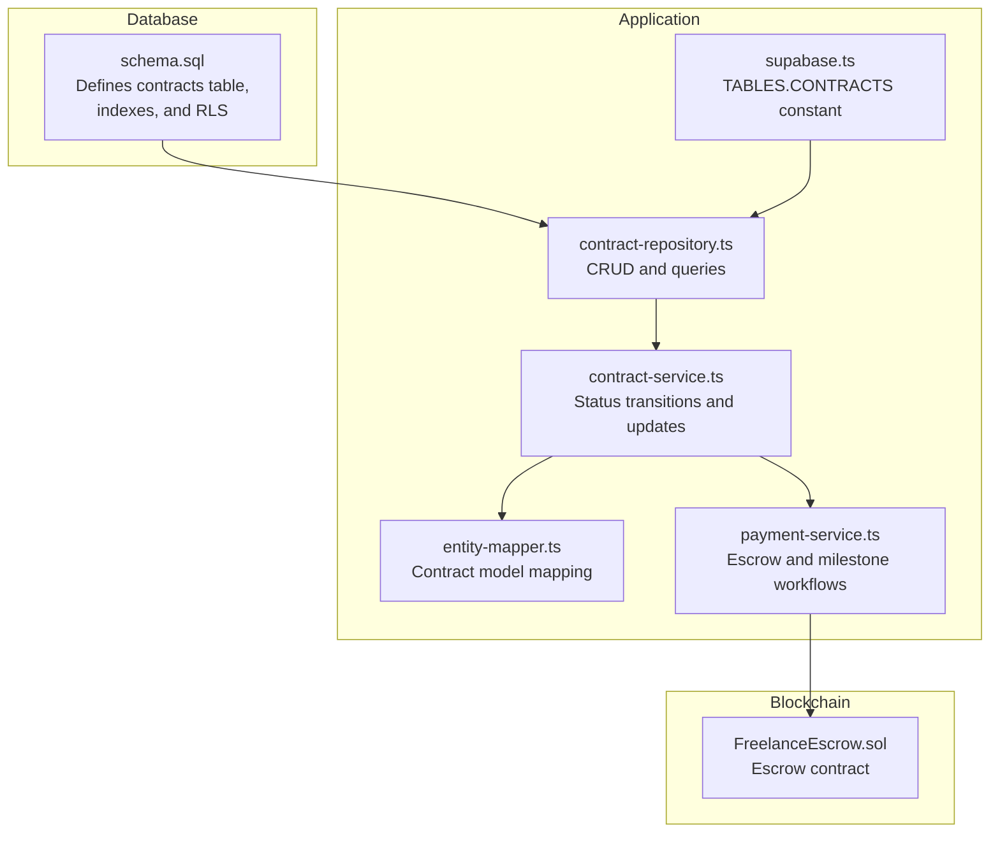
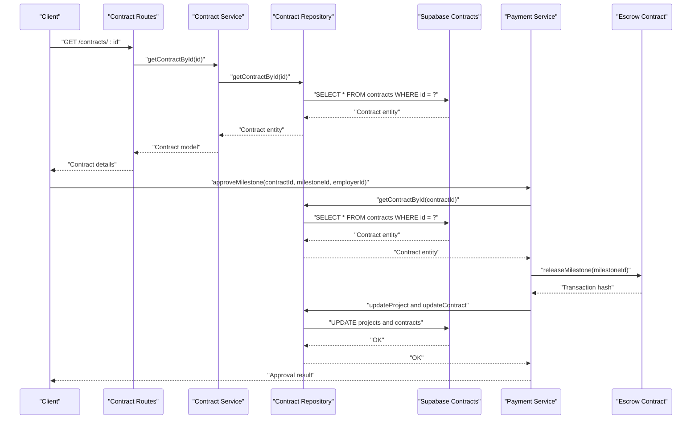
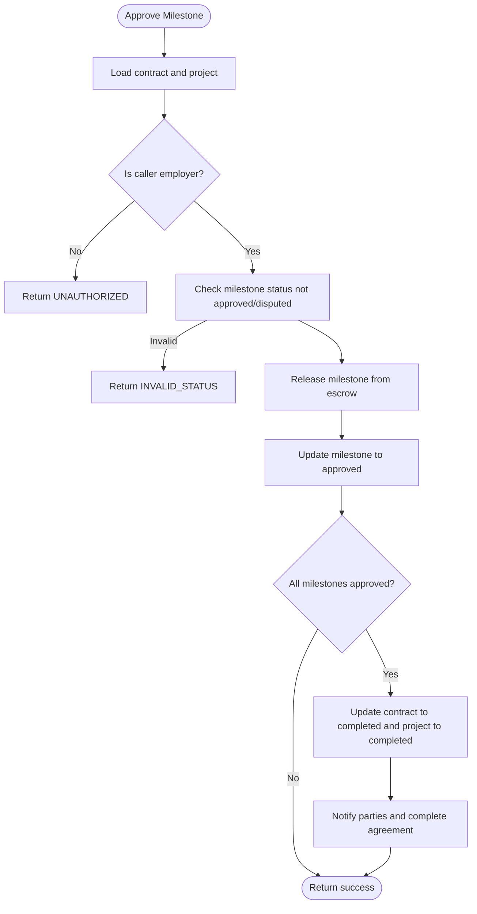
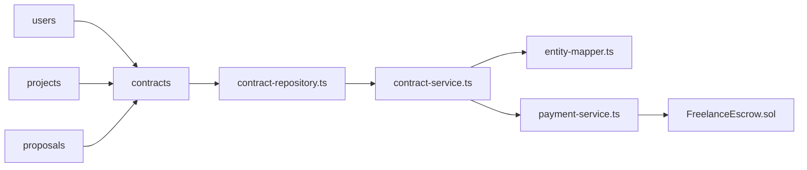

# Contracts Table

<cite>
**Referenced Files in This Document**
- [schema.sql](file://supabase/schema.sql)
- [supabase.ts](file://src/config/supabase.ts)
- [contract-repository.ts](file://src/repositories/contract-repository.ts)
- [contract-service.ts](file://src/services/contract-service.ts)
- [entity-mapper.ts](file://src/utils/entity-mapper.ts)
- [payment-service.ts](file://src/services/payment-service.ts)
- [FreelanceEscrow.sol](file://contracts/FreelanceEscrow.sol)
</cite>

## Table of Contents
1. [Introduction](#introduction)
2. [Project Structure](#project-structure)
3. [Core Components](#core-components)
4. [Architecture Overview](#architecture-overview)
5. [Detailed Component Analysis](#detailed-component-analysis)
6. [Dependency Analysis](#dependency-analysis)
7. [Performance Considerations](#performance-considerations)
8. [Troubleshooting Guide](#troubleshooting-guide)
9. [Conclusion](#conclusion)

## Introduction
This document provides comprehensive data model documentation for the contracts table in the FreelanceXchain Supabase PostgreSQL database. The contracts table formalizes the agreement between freelancers and employers, linking off-chain project and proposal data to on-chain escrow smart contracts. It centralizes payment and milestone release workflows, enforces status transitions, and ensures only authorized parties can access sensitive data.

## Project Structure
The contracts table definition and related components are distributed across:
- Database schema: table creation, indexes, and RLS policies
- Application configuration: table name constants
- Data access layer: repository and service for CRUD and business logic
- Domain mapping: entity-to-model mapping utilities
- Payment workflow: orchestration of milestone approvals, disputes, and contract completion
- On-chain bridge: escrow contract enabling secure fund holding and release

**Diagram sources**
- [schema.sql](file://supabase/schema.sql#L94-L106)
- [supabase.ts](file://src/config/supabase.ts#L6-L21)
- [contract-repository.ts](file://src/repositories/contract-repository.ts#L1-L139)
- [contract-service.ts](file://src/services/contract-service.ts#L1-L140)
- [entity-mapper.ts](file://src/utils/entity-mapper.ts#L281-L310)
- [payment-service.ts](file://src/services/payment-service.ts#L590-L643)
- [FreelanceEscrow.sol](file://contracts/FreelanceEscrow.sol#L1-L264)

**Section sources**
- [schema.sql](file://supabase/schema.sql#L94-L106)
- [supabase.ts](file://src/config/supabase.ts#L6-L21)

## Core Components
- contracts table: stores the formal agreement with foreign keys to users, projects, and proposals; maintains escrow address and status; includes audit timestamps.
- Repository: provides typed CRUD and query methods for contracts.
- Service: validates status transitions and updates contract records.
- Mapper: converts between database entities and API models.
- Payment workflow: integrates with the on-chain escrow to manage milestone submissions, approvals, disputes, and contract completion.
- Escrow contract: holds funds and releases them according to milestone approvals and dispute resolution.

**Section sources**
- [schema.sql](file://supabase/schema.sql#L94-L106)
- [contract-repository.ts](file://src/repositories/contract-repository.ts#L1-L139)
- [contract-service.ts](file://src/services/contract-service.ts#L65-L139)
- [entity-mapper.ts](file://src/utils/entity-mapper.ts#L281-L310)
- [payment-service.ts](file://src/services/payment-service.ts#L1-L140)
- [FreelanceEscrow.sol](file://contracts/FreelanceEscrow.sol#L1-L264)

## Architecture Overview
The contracts table bridges off-chain data with on-chain escrow:
- Off-chain: projects define milestones; proposals link to projects; contracts formalize the agreement and store the escrow address.
- On-chain: FreelanceEscrow holds funds and releases them upon milestone approval; disputes route through the arbiter.

**Diagram sources**
- [contract-service.ts](file://src/services/contract-service.ts#L23-L32)
- [contract-repository.ts](file://src/repositories/contract-repository.ts#L24-L34)
- [payment-service.ts](file://src/services/payment-service.ts#L201-L352)
- [FreelanceEscrow.sol](file://contracts/FreelanceEscrow.sol#L136-L161)

## Detailed Component Analysis

### Contracts Table Definition and Purpose
- Purpose: Formal agreement between parties, linking off-chain project/proposal data to on-chain escrow.
- Central role: Orchestrates payment and milestone release workflow; tracks contract lifecycle via status.

Columns:
- id: UUID primary key, auto-generated.
- project_id: UUID foreign key to projects; links to the project containing milestones.
- proposal_id: UUID foreign key to proposals; links to the accepted proposal forming the contract.
- freelancer_id: UUID foreign key to users; identifies the freelancer.
- employer_id: UUID foreign key to users; identifies the employer.
- escrow_address: String; on-chain escrow contract address for fund holding and release.
- total_amount: Decimal; total budget allocated to the contract.
- status: String with CHECK constraint limiting values to active, completed, disputed, cancelled.
- created_at, updated_at: Audit timestamps.

Indexes:
- Indexes on freelancer_id and employer_id improve query performance for retrieving contracts by party.

RLS Policies:
- RLS enabled on contracts; service role policies grant full access; application-level authorization ensures only parties can access sensitive data.

**Section sources**
- [schema.sql](file://supabase/schema.sql#L94-L106)
- [schema.sql](file://supabase/schema.sql#L202-L224)
- [schema.sql](file://supabase/schema.sql#L225-L261)
- [supabase.ts](file://src/config/supabase.ts#L6-L21)

### Data Model Mapping
- Contract entity shape: snake_case fields aligned to database schema.
- Contract model: camelCase fields for API consumption.
- Mapping preserves all contract attributes, including status and audit timestamps.

**Section sources**
- [entity-mapper.ts](file://src/utils/entity-mapper.ts#L281-L310)

### Repository Layer
- Typed contract entity interface.
- Methods:
  - Create, read by id, update.
  - Query by proposal id, freelancer id, employer id, project id, and status.
  - Paginated retrieval with ordering and counts.
- Uses TABLES.CONTRACTS constant for table name.

**Section sources**
- [contract-repository.ts](file://src/repositories/contract-repository.ts#L1-L139)
- [supabase.ts](file://src/config/supabase.ts#L6-L21)

### Service Layer: Status Transitions and Updates
- Validates status transitions:
  - From active: allowed to completed, disputed, cancelled.
  - From disputed: allowed to active, completed, cancelled.
  - Completed and cancelled are terminal states.
- Updates escrow address and contract status atomically via repository.

**Section sources**
- [contract-service.ts](file://src/services/contract-service.ts#L65-L139)

### Payment Workflow and Escrow Integration
- Escrow initialization:
  - Deploys FreelanceEscrow with employer, freelancer, total amount, and milestones.
  - Deposits funds into the escrow.
  - Stores the escrow address on the contract.
- Milestone submission and approval:
  - Freelancer requests milestone completion; project milestones updated.
  - Employer approves milestone; escrow releases funds to freelancer; project milestones updated.
  - If all milestones approved, contract status becomes completed and project completes.
- Disputes:
  - Either party can dispute a submitted milestone; project milestone marked disputed.
  - Contract status moves to disputed; notifications sent to both parties.
- Contract completion triggers on-chain agreement completion.

**Diagram sources**
- [payment-service.ts](file://src/services/payment-service.ts#L201-L352)
- [FreelanceEscrow.sol](file://contracts/FreelanceEscrow.sol#L136-L161)

**Section sources**
- [payment-service.ts](file://src/services/payment-service.ts#L590-L643)
- [FreelanceEscrow.sol](file://contracts/FreelanceEscrow.sol#L1-L264)

### Contract Status Impact on Payment and Disputes
- Active:
  - Normal operation: milestones can be submitted and approved.
  - Escrow holds funds; releases occur upon approval.
- Disputed:
  - Milestone under dispute; cannot be approved until resolved.
  - Contract status set to disputed; dispute process initiated.
- Completed:
  - Terminal state; no further payments or approvals.
- Cancelled:
  - Contract terminated; funds may be refunded depending on milestone status.

**Section sources**
- [contract-service.ts](file://src/services/contract-service.ts#L77-L83)
- [payment-service.ts](file://src/services/payment-service.ts#L355-L480)

## Dependency Analysis
- contracts table depends on:
  - users (freelancer_id, employer_id)
  - projects (project_id)
  - proposals (proposal_id)
- Repository and service depend on:
  - TABLES.CONTRACTS constant for table name.
  - Entity mapper for model conversion.
- Payment service depends on:
  - Contract repository for contract state.
  - Escrow contract for fund release.
  - Project repository for milestone state.
  - Notification service for user notifications.

**Diagram sources**
- [schema.sql](file://supabase/schema.sql#L94-L106)
- [contract-repository.ts](file://src/repositories/contract-repository.ts#L1-L139)
- [contract-service.ts](file://src/services/contract-service.ts#L1-L140)
- [entity-mapper.ts](file://src/utils/entity-mapper.ts#L281-L310)
- [payment-service.ts](file://src/services/payment-service.ts#L1-L140)
- [FreelanceEscrow.sol](file://contracts/FreelanceEscrow.sol#L1-L264)

**Section sources**
- [schema.sql](file://supabase/schema.sql#L94-L106)
- [contract-repository.ts](file://src/repositories/contract-repository.ts#L1-L139)
- [contract-service.ts](file://src/services/contract-service.ts#L1-L140)
- [payment-service.ts](file://src/services/payment-service.ts#L1-L140)

## Performance Considerations
- Indexes:
  - freelancer_id and employer_id indexes enable efficient retrieval of contracts by party.
  - Additional indexes exist for related tables; ensure maintenance of statistics for optimal query plans.
- Pagination:
  - Repository methods support pagination with limit and offset; use reasonable limits to prevent heavy scans.
- Status filtering:
  - Filtering by status is supported; combine with ordering by created_at for predictable results.

**Section sources**
- [schema.sql](file://supabase/schema.sql#L202-L224)
- [contract-repository.ts](file://src/repositories/contract-repository.ts#L41-L81)
- [contract-repository.ts](file://src/repositories/contract-repository.ts#L95-L114)

## Troubleshooting Guide
- Not found errors:
  - Contract not found when querying by id or proposal id; verify identifiers and existence.
- Unauthorized access:
  - Only parties (freelancer or employer) can perform actions on a contract; ensure user identity matches contract participants.
- Invalid status transitions:
  - Cannot transition from current status to target status; consult allowed transitions.
- Escrow deployment or release failures:
  - Review payment service error codes and underlying blockchain client logs.
- RLS access denied:
  - Even with service role policies, application-level authorization restricts access to contract parties.

**Section sources**
- [contract-service.ts](file://src/services/contract-service.ts#L23-L32)
- [contract-service.ts](file://src/services/contract-service.ts#L65-L103)
- [payment-service.ts](file://src/services/payment-service.ts#L201-L352)

## Conclusion
The contracts table is the backbone of FreelanceXchain’s payment and milestone release system. It formalizes agreements, connects off-chain project data to on-chain escrow, and enforces strict status transitions. With targeted indexes and robust repository/service layers, it supports scalable, secure workflows while ensuring only authorized parties can access sensitive data.