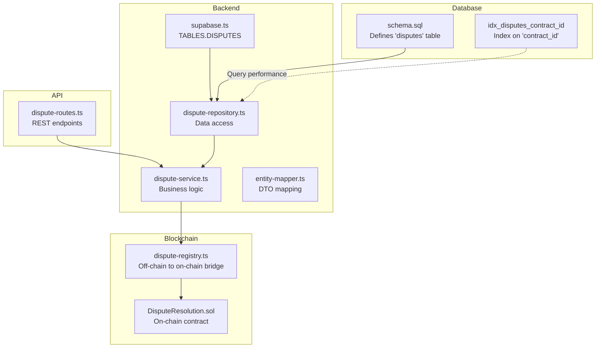
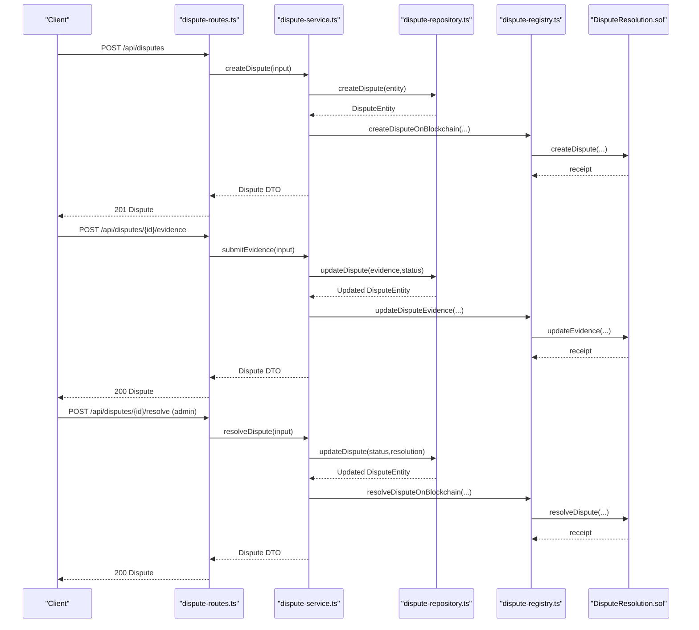
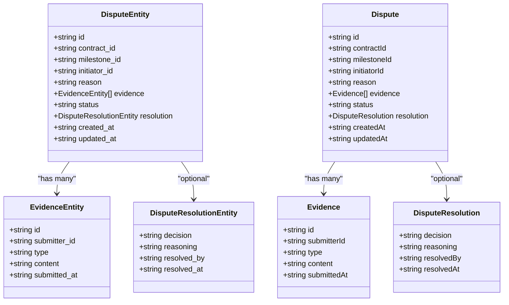
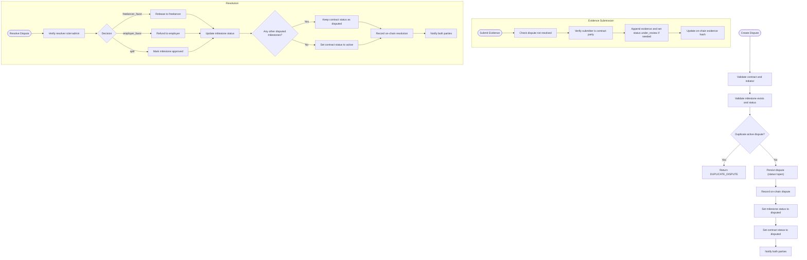
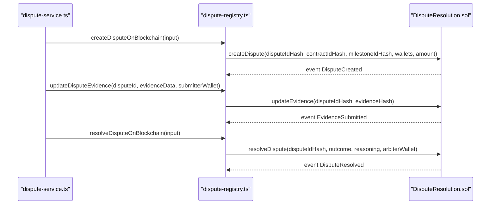
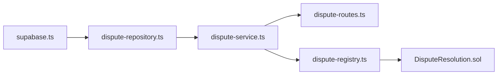

# Disputes Table

<cite>
**Referenced Files in This Document**
- [schema.sql](file://supabase/schema.sql)
- [supabase.ts](file://src/config/supabase.ts)
- [dispute-repository.ts](file://src/repositories/dispute-repository.ts)
- [dispute-service.ts](file://src/services/dispute-service.ts)
- [dispute-registry.ts](file://src/services/dispute-registry.ts)
- [entity-mapper.ts](file://src/utils/entity-mapper.ts)
- [DisputeResolution.sol](file://contracts/DisputeResolution.sol)
- [dispute-routes.ts](file://src/routes/dispute-routes.ts)
</cite>

## Table of Contents
1. [Introduction](#introduction)
2. [Project Structure](#project-structure)
3. [Core Components](#core-components)
4. [Architecture Overview](#architecture-overview)
5. [Detailed Component Analysis](#detailed-component-analysis)
6. [Dependency Analysis](#dependency-analysis)
7. [Performance Considerations](#performance-considerations)
8. [Troubleshooting Guide](#troubleshooting-guide)
9. [Conclusion](#conclusion)

## Introduction
This document provides comprehensive data model documentation for the disputes table in the FreelanceXchain Supabase PostgreSQL database. It explains the purpose of the disputes table as the conflict resolution tracking system, details each column, and describes how it integrates with the on-chain DisputeResolution.sol contract. It also covers evidence submission off-chain, the dispute lifecycle from creation to resolution, and how it affects payment flows. Finally, it references the TABLES.DISPUTES constant and the idx_disputes_contract_id index, and addresses RLS policies ensuring privacy during dispute resolution.

## Project Structure
The disputes table is defined in the Supabase schema and is used by the backend services and routes to manage disputes. The key files involved are:
- Database schema definition
- Supabase client constants
- Repository and service layers for disputes
- Blockchain integration for on-chain records
- API routes for dispute operations
- Entity mapping for data transfer

**Diagram sources**
- [schema.sql](file://supabase/schema.sql#L108-L120)
- [schema.sql](file://supabase/schema.sql#L202-L224)
- [supabase.ts](file://src/config/supabase.ts#L6-L21)
- [dispute-repository.ts](file://src/repositories/dispute-repository.ts#L34-L136)
- [dispute-service.ts](file://src/services/dispute-service.ts#L63-L521)
- [dispute-registry.ts](file://src/services/dispute-registry.ts#L40-L289)
- [DisputeResolution.sol](file://contracts/DisputeResolution.sol#L1-L153)
- [dispute-routes.ts](file://src/routes/dispute-routes.ts#L1-L558)

**Section sources**
- [schema.sql](file://supabase/schema.sql#L108-L120)
- [schema.sql](file://supabase/schema.sql#L202-L224)
- [supabase.ts](file://src/config/supabase.ts#L6-L21)

## Core Components
- Disputes table: Stores dispute metadata, evidence, and resolution outcomes.
- Repository: Provides CRUD and query helpers for disputes.
- Service: Orchestrates dispute lifecycle, validates inputs, updates statuses, and triggers blockchain actions.
- Blockchain integration: Off-chain service writes hashes to the on-chain DisputeResolution.sol contract.
- API routes: Expose endpoints for creating, retrieving, submitting evidence, and resolving disputes.

**Section sources**
- [dispute-repository.ts](file://src/repositories/dispute-repository.ts#L34-L136)
- [dispute-service.ts](file://src/services/dispute-service.ts#L63-L521)
- [dispute-registry.ts](file://src/services/dispute-registry.ts#L40-L289)
- [dispute-routes.ts](file://src/routes/dispute-routes.ts#L1-L558)

## Architecture Overview
The disputes lifecycle spans the database, backend services, and blockchain:
- Creation: Validates contract and milestone, marks milestone as disputed, persists dispute, and records on-chain.
- Evidence submission: Adds evidence to the dispute and updates the on-chain evidence hash.
- Resolution: Admin resolves, updates statuses, triggers payment flows, and records on-chain outcome.

**Diagram sources**
- [dispute-routes.ts](file://src/routes/dispute-routes.ts#L149-L223)
- [dispute-routes.ts](file://src/routes/dispute-routes.ts#L328-L381)
- [dispute-routes.ts](file://src/routes/dispute-routes.ts#L424-L486)
- [dispute-service.ts](file://src/services/dispute-service.ts#L63-L521)
- [dispute-registry.ts](file://src/services/dispute-registry.ts#L69-L253)
- [DisputeResolution.sol](file://contracts/DisputeResolution.sol#L51-L125)

## Detailed Component Analysis

### Disputes Table Definition and Purpose
- Purpose: Centralized conflict resolution tracking system for milestones within contracts. It stores who initiated the dispute, the reason, evidence, current status, and resolution details. It also tracks audit timestamps.
- Integration: Off-chain evidence and resolution outcomes are hashed and recorded on-chain via DisputeResolution.sol for immutability and transparency.

Columns:
- id: UUID primary key, auto-generated.
- contract_id: UUID foreign key to contracts, linking disputes to specific contracts.
- milestone_id: String identifier for the blockchain milestone; used to correlate with on-chain records.
- initiator_id: UUID foreign key to users, identifying the party who opened the dispute.
- reason: Text describing the cause of the dispute.
- evidence: JSONB array storing evidence entries (id, submitter_id, type, content, submitted_at).
- status: Enum-like string with CHECK constraint limiting values to open, under_review, resolved.
- resolution: JSONB object containing decision, reasoning, resolved_by, resolved_at.
- created_at, updated_at: Audit timestamps managed by the database.

Indexes:
- idx_disputes_contract_id: Index on contract_id to optimize queries by contract.

RLS Policies:
- RLS enabled on the disputes table.
- Service role policy grants full access for backend operations.
- Additional policies can be configured to restrict visibility to parties involved in the contract.

**Section sources**
- [schema.sql](file://supabase/schema.sql#L108-L120)
- [schema.sql](file://supabase/schema.sql#L202-L224)
- [schema.sql](file://supabase/schema.sql#L225-L261)

### Data Model and Types
- Repository types define DisputeEntity, EvidenceEntity, and DisputeResolutionEntity with snake_case fields aligned to the database.
- Mapper types define Dispute, Evidence, and DisputeResolution with camelCase fields for the API.

**Diagram sources**
- [dispute-repository.ts](file://src/repositories/dispute-repository.ts#L21-L33)
- [entity-mapper.ts](file://src/utils/entity-mapper.ts#L312-L371)

**Section sources**
- [dispute-repository.ts](file://src/repositories/dispute-repository.ts#L21-L33)
- [entity-mapper.ts](file://src/utils/entity-mapper.ts#L312-L371)

### Lifecycle: Creation to Resolution
- Creation:
  - Validates contract existence and that the initiator is a party to the contract.
  - Validates milestone exists and is not already disputed/approved.
  - Prevents duplicate active disputes for the same milestone.
  - Persists dispute with status open.
  - Records on-chain dispute with hashes of identifiers and amounts.
  - Updates milestone status to disputed and contract status to disputed.
  - Sends notifications to both parties.
- Evidence Submission:
  - Only parties to the contract can submit evidence.
  - Evidence is appended; status transitions to under_review if previously open.
  - On-chain evidence hash is updated.
- Resolution:
  - Only admins can resolve disputes.
  - Based on decision (freelancer_favor, employer_favor, split):
    - Releases funds to freelancer or refunds to employer via escrow.
    - Updates milestone status accordingly.
    - If no other milestones are disputed, contract status reverts to active.
  - Records on-chain resolution outcome and reasoning.
  - Sends notifications to both parties.

**Diagram sources**
- [dispute-service.ts](file://src/services/dispute-service.ts#L63-L521)
- [dispute-registry.ts](file://src/services/dispute-registry.ts#L69-L253)

**Section sources**
- [dispute-service.ts](file://src/services/dispute-service.ts#L63-L521)

### API Endpoints and Access Control
- POST /api/disputes: Create a dispute (authenticated).
- GET /api/disputes/{disputeId}: Retrieve a dispute (authenticated).
- POST /api/disputes/{disputeId}/evidence: Submit evidence (authenticated, contract party).
- POST /api/disputes/{disputeId}/resolve: Resolve dispute (admin only).
- GET /api/contracts/{contractId}/disputes: List disputes for a contract (authenticated, contract party).

Access control:
- Authentication enforced by auth middleware.
- Authorization checks ensure only parties to the contract can view or submit evidence.
- Admin-only endpoint for resolution.

**Section sources**
- [dispute-routes.ts](file://src/routes/dispute-routes.ts#L149-L223)
- [dispute-routes.ts](file://src/routes/dispute-routes.ts#L258-L286)
- [dispute-routes.ts](file://src/routes/dispute-routes.ts#L328-L381)
- [dispute-routes.ts](file://src/routes/dispute-routes.ts#L424-L486)
- [dispute-routes.ts](file://src/routes/dispute-routes.ts#L490-L555)

### On-Chain Integration
- Off-chain service generates SHA-256 hashes for disputeId, contractId, milestoneId, and evidence payload.
- Records are stored in a local in-memory registry keyed by disputeIdHash.
- The DisputeResolution.sol contract maintains a mapping of disputeIdHash to DisputeRecord with fields for evidenceHash, outcome, reasoning, and timestamps.
- Events are emitted for dispute creation, evidence submission, and resolution.

**Diagram sources**
- [dispute-registry.ts](file://src/services/dispute-registry.ts#L69-L253)
- [DisputeResolution.sol](file://contracts/DisputeResolution.sol#L51-L125)

**Section sources**
- [dispute-registry.ts](file://src/services/dispute-registry.ts#L40-L289)
- [DisputeResolution.sol](file://contracts/DisputeResolution.sol#L1-L153)

### Payment Flow Impact
- Creation locks funds by marking milestone as disputed and contract as disputed.
- Resolution triggers payment actions:
  - freelancer_favor: releases milestone to freelancer.
  - employer_favor: refunds milestone to employer.
  - split: marks milestone approved (partial release handled separately).
- After resolution, if no other milestones remain disputed, contract status reverts to active.

**Section sources**
- [dispute-service.ts](file://src/services/dispute-service.ts#L368-L409)

### Constants and Index References
- TABLES.DISPUTES: The constant for the disputes table name is defined in the Supabase configuration module and is used by the repository to target the correct table.
- idx_disputes_contract_id: The index on contract_id is defined in the schema to optimize queries filtering by contract.

**Section sources**
- [supabase.ts](file://src/config/supabase.ts#L6-L21)
- [schema.sql](file://supabase/schema.sql#L202-L224)

## Dependency Analysis
- Repository depends on TABLES.DISPUTES constant and Supabase client.
- Service depends on repository, contract and project repositories, user repository, notification service, and blockchain registry.
- Routes depend on service and enforce authentication and authorization.
- Blockchain registry depends on blockchain client and generates hashes for on-chain storage.

**Diagram sources**
- [supabase.ts](file://src/config/supabase.ts#L6-L21)
- [dispute-repository.ts](file://src/repositories/dispute-repository.ts#L34-L53)
- [dispute-service.ts](file://src/services/dispute-service.ts#L63-L120)
- [dispute-routes.ts](file://src/routes/dispute-routes.ts#L1-L50)
- [dispute-registry.ts](file://src/services/dispute-registry.ts#L40-L120)
- [DisputeResolution.sol](file://contracts/DisputeResolution.sol#L1-L40)

**Section sources**
- [supabase.ts](file://src/config/supabase.ts#L6-L21)
- [dispute-repository.ts](file://src/repositories/dispute-repository.ts#L34-L53)
- [dispute-service.ts](file://src/services/dispute-service.ts#L63-L120)
- [dispute-routes.ts](file://src/routes/dispute-routes.ts#L1-L50)
- [dispute-registry.ts](file://src/services/dispute-registry.ts#L40-L120)
- [DisputeResolution.sol](file://contracts/DisputeResolution.sol#L1-L40)

## Performance Considerations
- Use idx_disputes_contract_id to efficiently query disputes by contract.
- Limit pagination for listing disputes to prevent large result sets.
- Store only necessary evidence content in the database; large attachments should be stored off-chain with references.
- Batch updates for milestone status changes to minimize write operations.

[No sources needed since this section provides general guidance]

## Troubleshooting Guide
Common issues and resolutions:
- Not Found:
  - Contract or milestone missing: Ensure contractId and milestoneId are valid and match the project’s milestones.
  - Dispute not found: Verify disputeId format and existence.
- Unauthorized:
  - Only parties to the contract can create disputes or submit evidence.
  - Only admins can resolve disputes.
- Already Resolved:
  - Cannot submit evidence or resolve a dispute already marked as resolved.
- Duplicate Active Dispute:
  - A dispute for the same milestone cannot be created while another active dispute exists.
- Validation Errors:
  - Ensure UUID formats are correct and required fields are present.

**Section sources**
- [dispute-service.ts](file://src/services/dispute-service.ts#L63-L521)
- [dispute-routes.ts](file://src/routes/dispute-routes.ts#L149-L223)
- [dispute-routes.ts](file://src/routes/dispute-routes.ts#L328-L381)
- [dispute-routes.ts](file://src/routes/dispute-routes.ts#L424-L486)

## Conclusion
The disputes table serves as the central record for conflict resolution in FreelanceXchain. It integrates tightly with the contract and milestone lifecycle, enforces strict access controls, and bridges off-chain data with on-chain immutability. The documented lifecycle, API endpoints, and payment flow ensure predictable behavior for all stakeholders, while indexes and RLS policies support performance and privacy.