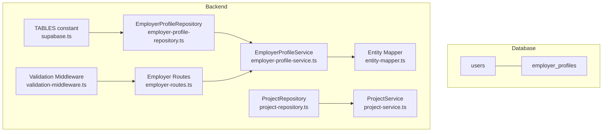
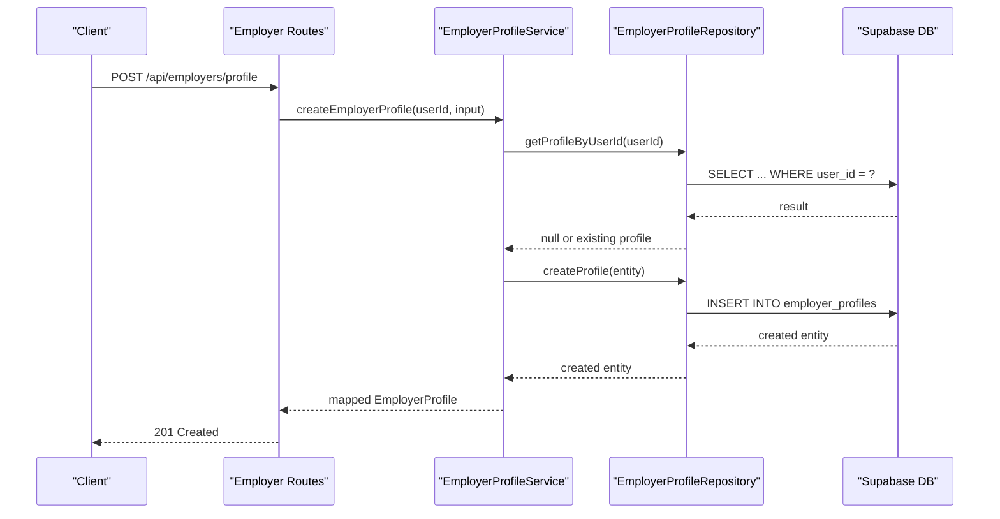
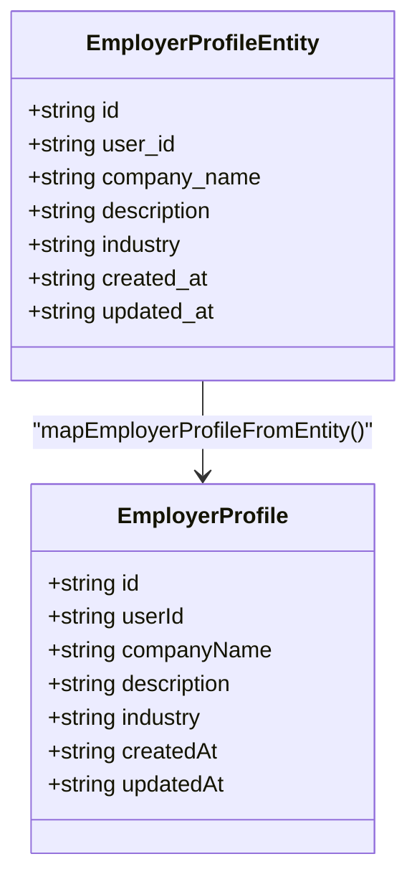
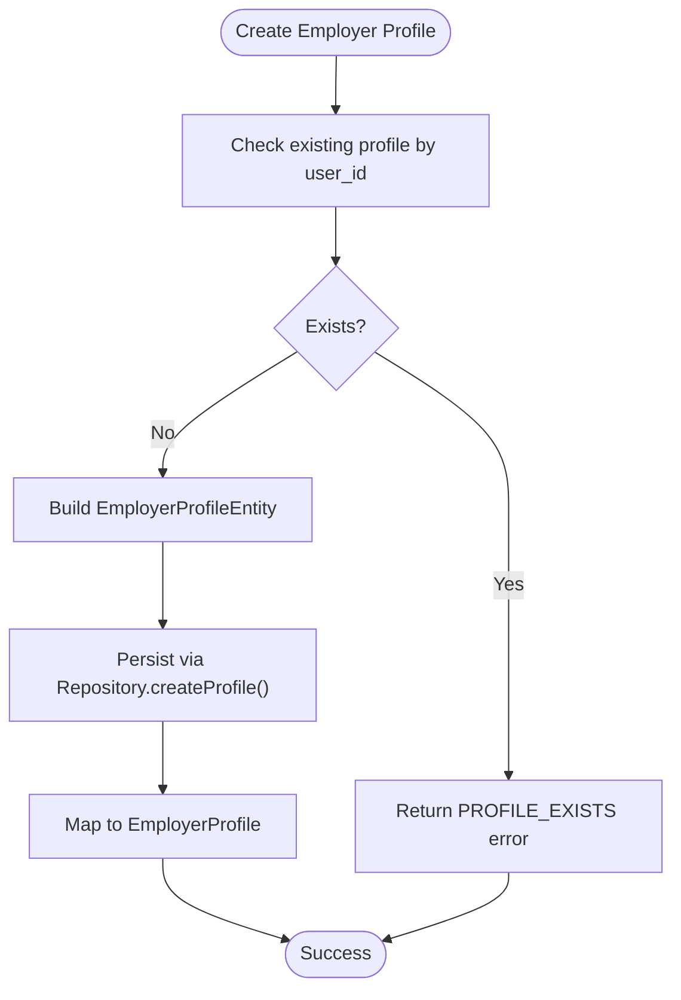
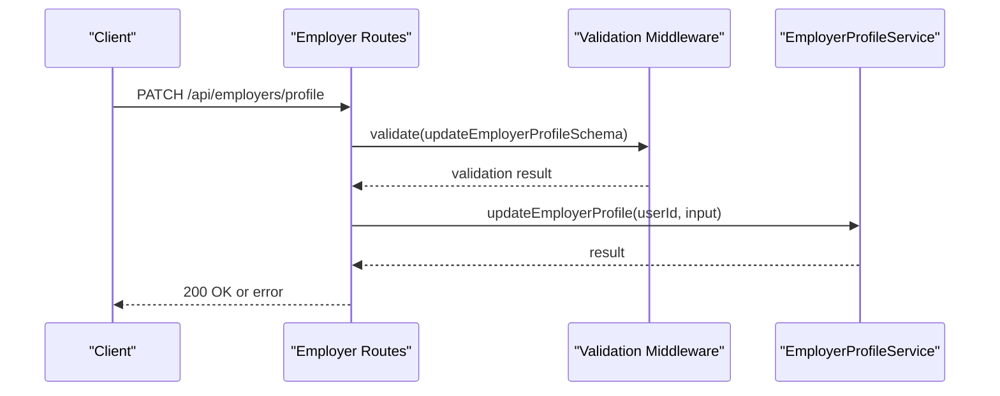
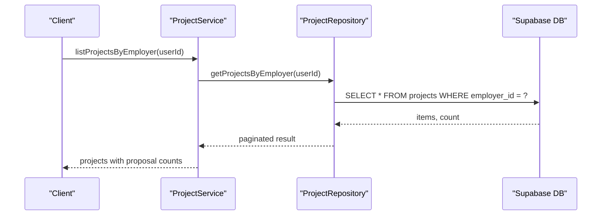
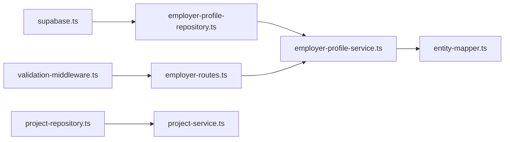

# Employer Profiles Table

<cite>
**Referenced Files in This Document**
- [schema.sql](file://supabase/schema.sql)
- [supabase.ts](file://src/config/supabase.ts)
- [employer-profile-repository.ts](file://src/repositories/employer-profile-repository.ts)
- [employer-profile-service.ts](file://src/services/employer-profile-service.ts)
- [entity-mapper.ts](file://src/utils/entity-mapper.ts)
- [employer-routes.ts](file://src/routes/employer-routes.ts)
- [validation-middleware.ts](file://src/middleware/validation-middleware.ts)
- [project-repository.ts](file://src/repositories/project-repository.ts)
- [project-service.ts](file://src/services/project-service.ts)
- [ARCHITECTURE.md](file://docs/ARCHITECTURE.md)
</cite>

## Table of Contents
1. [Introduction](#introduction)
2. [Project Structure](#project-structure)
3. [Core Components](#core-components)
4. [Architecture Overview](#architecture-overview)
5. [Detailed Component Analysis](#detailed-component-analysis)
6. [Dependency Analysis](#dependency-analysis)
7. [Performance Considerations](#performance-considerations)
8. [Troubleshooting Guide](#troubleshooting-guide)
9. [Conclusion](#conclusion)

## Introduction
This document provides comprehensive data model documentation for the employer_profiles table in the FreelanceXchain Supabase PostgreSQL database. It explains the table’s structure, relationships, and lifecycle, and describes how it supports the platform’s organizational identity for employers posting projects. It also covers the one-to-one relationship with the users table, the purpose of verified company information in building trust, and how employer profiles integrate with project browsing and display. Finally, it references the TABLES.EMPLOYER_PROFILES constant and the idx_employer_profiles_user_id index, and outlines considerations for Row Level Security (RLS) policies.

## Project Structure
The employer_profiles table is defined in the Supabase schema and is accessed through the backend service layer. The relevant files include:
- Database schema definition and indexes
- Backend constants for table names
- Repository and service layers for CRUD operations
- Entity mapping for API-friendly types
- Route handlers and validation for employer profile endpoints
- Project-related repositories/services that demonstrate how employer identity integrates with project browsing



**Diagram sources**
- [schema.sql](file://supabase/schema.sql#L54-L62)
- [supabase.ts](file://src/config/supabase.ts#L6-L21)
- [employer-profile-repository.ts](file://src/repositories/employer-profile-repository.ts#L1-L56)
- [employer-profile-service.ts](file://src/services/employer-profile-service.ts#L1-L92)
- [entity-mapper.ts](file://src/utils/entity-mapper.ts#L175-L196)
- [employer-routes.ts](file://src/routes/employer-routes.ts#L1-L279)
- [validation-middleware.ts](file://src/middleware/validation-middleware.ts#L496-L518)
- [project-repository.ts](file://src/repositories/project-repository.ts#L1-L191)
- [project-service.ts](file://src/services/project-service.ts#L1-L200)

**Section sources**
- [schema.sql](file://supabase/schema.sql#L54-L62)
- [supabase.ts](file://src/config/supabase.ts#L6-L21)

## Core Components
- Table definition: employer_profiles contains id (UUID primary key), user_id (unique foreign key to users), company_name, description, industry, and audit timestamps.
- Index: idx_employer_profiles_user_id ensures efficient lookups by user_id.
- RLS: employer_profiles has Row Level Security enabled.
- Backend integration:
  - TABLES constant exposes EMPLOYER_PROFILES for centralized table naming.
  - EmployerProfileRepository provides typed CRUD operations.
  - EmployerProfileService enforces business rules (e.g., uniqueness by user_id).
  - Entity mapper converts database entities to API-friendly types.
  - Routes and validation govern creation and updates.
  - Project repositories/services demonstrate employer identity usage in project browsing.

**Section sources**
- [schema.sql](file://supabase/schema.sql#L54-L62)
- [schema.sql](file://supabase/schema.sql#L203-L206)
- [schema.sql](file://supabase/schema.sql#L225-L240)
- [supabase.ts](file://src/config/supabase.ts#L6-L21)
- [employer-profile-repository.ts](file://src/repositories/employer-profile-repository.ts#L1-L56)
- [employer-profile-service.ts](file://src/services/employer-profile-service.ts#L1-L92)
- [entity-mapper.ts](file://src/utils/entity-mapper.ts#L175-L196)
- [employer-routes.ts](file://src/routes/employer-routes.ts#L1-L279)
- [validation-middleware.ts](file://src/middleware/validation-middleware.ts#L496-L518)
- [project-repository.ts](file://src/repositories/project-repository.ts#L1-L191)
- [project-service.ts](file://src/services/project-service.ts#L1-L200)

## Architecture Overview
The employer_profiles table underpins employer identity and trust. It is linked to users via a unique foreign key and is used to present employer information when browsing projects. The backend follows a layered architecture:
- Routes handle HTTP requests and enforce roles.
- Services encapsulate business logic and validations.
- Repositories abstract database operations.
- Entity mappers convert between database and API models.
- RLS protects data at the database level.



**Diagram sources**
- [employer-routes.ts](file://src/routes/employer-routes.ts#L161-L214)
- [employer-profile-service.ts](file://src/services/employer-profile-service.ts#L28-L50)
- [employer-profile-repository.ts](file://src/repositories/employer-profile-repository.ts#L19-L21)
- [schema.sql](file://supabase/schema.sql#L54-L62)

## Detailed Component Analysis

### Data Model: employer_profiles
- Purpose: Stores verified organizational identity for employers posting projects.
- Columns:
  - id: UUID primary key
  - user_id: UUID unique foreign key to users.id
  - company_name: VARCHAR(255)
  - description: TEXT
  - industry: VARCHAR(255)
  - created_at: TIMESTAMPTZ default NOW()
  - updated_at: TIMESTAMPTZ default NOW()
- Relationship: One-to-one with users via user_id (UNIQUE constraint).
- Index: idx_employer_profiles_user_id improves lookups by user_id.

```mermaid
erDiagram
USERS {
uuid id PK
string email UK
string password_hash
string role
string wallet_address
string name
timestamptz created_at
timestamptz updated_at
}
EMPLOYER_PROFILES {
uuid id PK
uuid user_id UK FK
string company_name
text description
string industry
timestamptz created_at
timestamptz updated_at
}
USERS ||--|| EMPLOYER_PROFILES : "one-to-one via user_id"
```

**Diagram sources**
- [schema.sql](file://supabase/schema.sql#L8-L17)
- [schema.sql](file://supabase/schema.sql#L54-L62)

**Section sources**
- [schema.sql](file://supabase/schema.sql#L54-L62)
- [schema.sql](file://supabase/schema.sql#L203-L206)

### Backend Types and Mapping
- Repository entity type: EmployerProfileEntity mirrors the table schema.
- Service types: CreateEmployerProfileInput and UpdateEmployerProfileInput define validated inputs.
- API model: EmployerProfile maps database snake_case to camelCase for clients.



**Diagram sources**
- [employer-profile-repository.ts](file://src/repositories/employer-profile-repository.ts#L4-L12)
- [entity-mapper.ts](file://src/utils/entity-mapper.ts#L175-L196)

**Section sources**
- [employer-profile-repository.ts](file://src/repositories/employer-profile-repository.ts#L1-L12)
- [entity-mapper.ts](file://src/utils/entity-mapper.ts#L175-L196)

### Repository and Service Layer
- Repository responsibilities:
  - Create, read by id, read by user_id, update, delete, list, and filter by industry.
- Service responsibilities:
  - Enforce uniqueness by user_id.
  - Validate inputs and map results to API models.



**Diagram sources**
- [employer-profile-service.ts](file://src/services/employer-profile-service.ts#L28-L50)
- [employer-profile-repository.ts](file://src/repositories/employer-profile-repository.ts#L19-L21)

**Section sources**
- [employer-profile-repository.ts](file://src/repositories/employer-profile-repository.ts#L1-L56)
- [employer-profile-service.ts](file://src/services/employer-profile-service.ts#L1-L92)

### Routing and Validation
- Routes:
  - POST /api/employers/profile creates an employer profile for authenticated employers.
  - PATCH /api/employers/profile updates an employer profile for authenticated employers.
  - GET /api/employers/:id retrieves a profile by user id.
- Validation:
  - createEmployerProfileSchema and updateEmployerProfileSchema define required fields and minimum lengths.



**Diagram sources**
- [employer-routes.ts](file://src/routes/employer-routes.ts#L248-L347)
- [validation-middleware.ts](file://src/middleware/validation-middleware.ts#L496-L518)
- [employer-profile-service.ts](file://src/services/employer-profile-service.ts#L65-L92)

**Section sources**
- [employer-routes.ts](file://src/routes/employer-routes.ts#L1-L279)
- [validation-middleware.ts](file://src/middleware/validation-middleware.ts#L496-L518)

### Integration with Project Browsing
- Project repositories and services demonstrate how employer identity is used:
  - Projects are associated with employers via employer_id (foreign key to users).
  - Project listings and filtering rely on employer identity for ownership checks and display.
- While the employer_profiles table is not directly joined in project queries, the presence of an employer profile contributes to trust signals when browsing projects.



**Diagram sources**
- [project-service.ts](file://src/services/project-service.ts#L1-L200)
- [project-repository.ts](file://src/repositories/project-repository.ts#L55-L74)

**Section sources**
- [project-repository.ts](file://src/repositories/project-repository.ts#L1-L191)
- [project-service.ts](file://src/services/project-service.ts#L1-L200)

### RLS Policies and Data Exposure
- RLS is enabled for employer_profiles.
- Public read policies are defined for select tables (e.g., skill_categories, skills, open projects).
- Service role policies grant full access for backend operations.
- Considerations:
  - For employer profiles, the default policy allows service role full access. Public read is not enabled for employer_profiles in the provided schema.
  - To expose employer profile data publicly, define a public read policy for employer_profiles and carefully scope it to non-sensitive fields (e.g., company_name, industry).
  - For private data, rely on service role bypass and backend authorization to control access.

**Section sources**
- [schema.sql](file://supabase/schema.sql#L225-L240)
- [schema.sql](file://supabase/schema.sql#L241-L261)
- [ARCHITECTURE.md](file://docs/ARCHITECTURE.md#L183-L218)

## Dependency Analysis
- Centralized table naming via TABLES constant ensures consistency across repositories and routes.
- Repository depends on Supabase client and table name constant.
- Service depends on repository and entity mapper.
- Routes depend on services and validation middleware.
- Project services depend on repositories and skill repositories.



**Diagram sources**
- [supabase.ts](file://src/config/supabase.ts#L6-L21)
- [employer-profile-repository.ts](file://src/repositories/employer-profile-repository.ts#L1-L56)
- [employer-profile-service.ts](file://src/services/employer-profile-service.ts#L1-L92)
- [entity-mapper.ts](file://src/utils/entity-mapper.ts#L175-L196)
- [employer-routes.ts](file://src/routes/employer-routes.ts#L1-L279)
- [validation-middleware.ts](file://src/middleware/validation-middleware.ts#L496-L518)
- [project-repository.ts](file://src/repositories/project-repository.ts#L1-L191)
- [project-service.ts](file://src/services/project-service.ts#L1-L200)

**Section sources**
- [supabase.ts](file://src/config/supabase.ts#L6-L21)
- [employer-profile-repository.ts](file://src/repositories/employer-profile-repository.ts#L1-L56)
- [employer-profile-service.ts](file://src/services/employer-profile-service.ts#L1-L92)
- [entity-mapper.ts](file://src/utils/entity-mapper.ts#L175-L196)
- [employer-routes.ts](file://src/routes/employer-routes.ts#L1-L279)
- [validation-middleware.ts](file://src/middleware/validation-middleware.ts#L496-L518)
- [project-repository.ts](file://src/repositories/project-repository.ts#L1-L191)
- [project-service.ts](file://src/services/project-service.ts#L1-L200)

## Performance Considerations
- Index usage:
  - idx_employer_profiles_user_id accelerates lookups by user_id.
- Query patterns:
  - Prefer filtering by user_id in repositories to leverage the index.
  - Use order by created_at descending for consistent listing.
- RLS overhead:
  - RLS adds minimal overhead; ensure policies are selective and avoid expensive joins in policies.

**Section sources**
- [schema.sql](file://supabase/schema.sql#L203-L206)
- [employer-profile-repository.ts](file://src/repositories/employer-profile-repository.ts#L27-L29)
- [employer-profile-repository.ts](file://src/repositories/employer-profile-repository.ts#L43-L53)

## Troubleshooting Guide
- Profile already exists:
  - Symptom: Creating a profile for a user who already has one fails.
  - Cause: Service enforces uniqueness by user_id.
  - Resolution: Update the existing profile or remove the duplicate.
- Profile not found:
  - Symptom: Retrieving or updating a profile returns not found.
  - Cause: No record for the given user_id.
  - Resolution: Ensure the profile exists before update or create it first.
- Validation errors:
  - Symptom: Requests rejected due to invalid input.
  - Cause: Missing or too-short fields (companyName, description, industry).
  - Resolution: Follow validation schema requirements.
- RLS access denied:
  - Symptom: Access to employer_profiles denied.
  - Cause: Public read not enabled; only service role has full access in the provided schema.
  - Resolution: Configure appropriate RLS policies or use service role for backend operations.

**Section sources**
- [employer-profile-service.ts](file://src/services/employer-profile-service.ts#L28-L50)
- [employer-profile-service.ts](file://src/services/employer-profile-service.ts#L52-L63)
- [validation-middleware.ts](file://src/middleware/validation-middleware.ts#L496-L518)
- [schema.sql](file://supabase/schema.sql#L225-L240)
- [schema.sql](file://supabase/schema.sql#L241-L261)

## Conclusion
The employer_profiles table defines the organizational identity for employers in FreelanceXchain. Its one-to-one relationship with users, combined with the unique user_id constraint and idx_employer_profiles_user_id index, enables efficient and secure profile management. Through the service and repository layers, the backend enforces business rules and provides robust CRUD operations. While RLS is enabled, public read is not configured for employer_profiles in the provided schema; service role policies allow backend operations. Integrating employer profiles with project browsing enhances trust by surfacing verified company information alongside project listings.