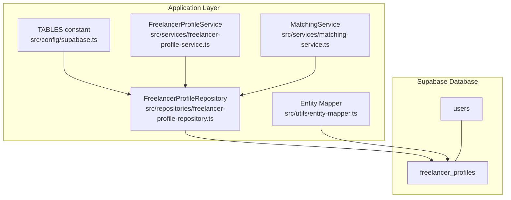
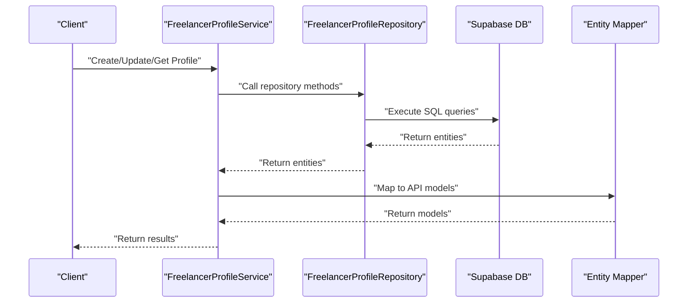
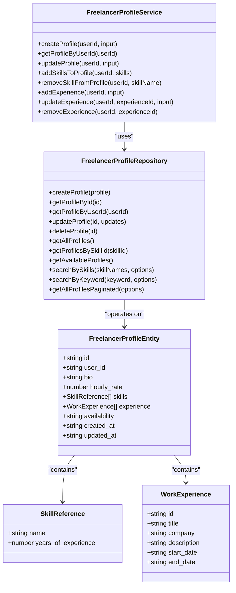
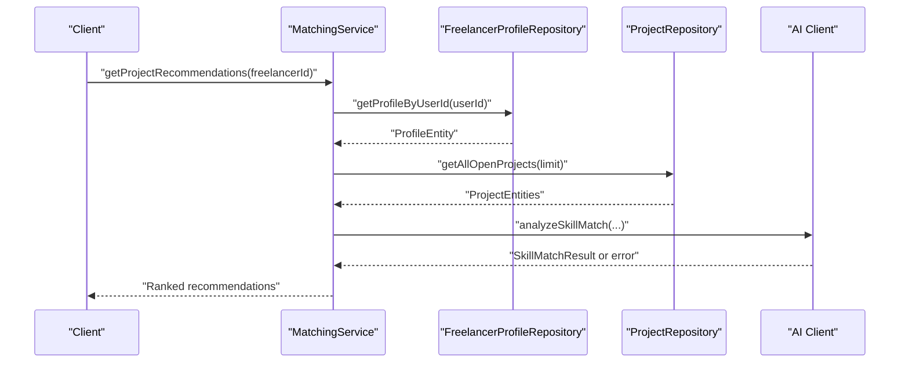
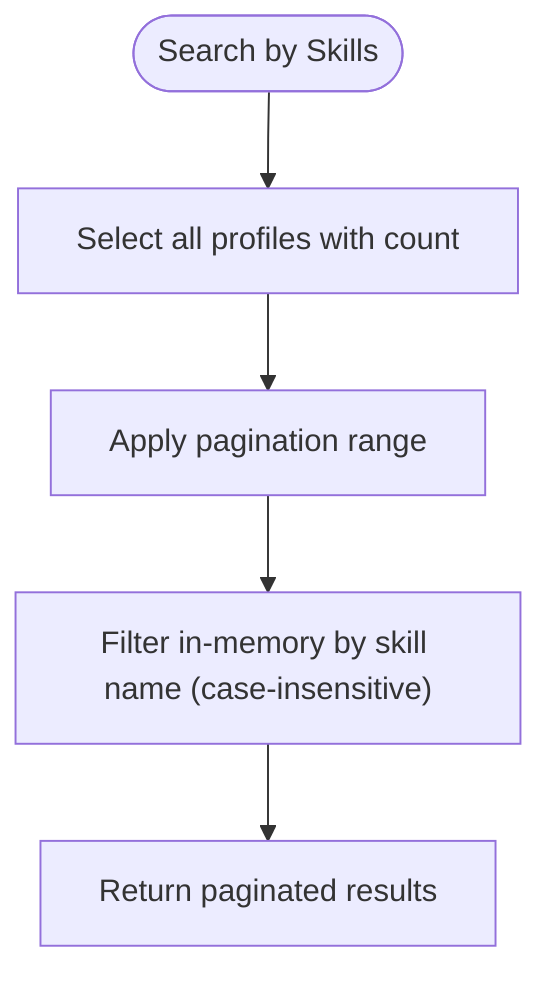
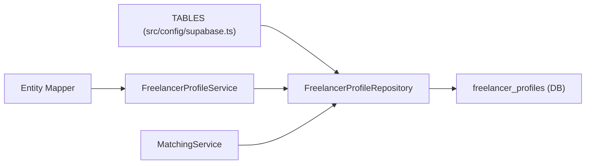

# Freelancer Profiles Table

<cite>
**Referenced Files in This Document**
- [schema.sql](file://supabase/schema.sql)
- [supabase.ts](file://src/config/supabase.ts)
- [freelancer-profile-repository.ts](file://src/repositories/freelancer-profile-repository.ts)
- [freelancer-profile-service.ts](file://src/services/freelancer-profile-service.ts)
- [entity-mapper.ts](file://src/utils/entity-mapper.ts)
- [matching-service.ts](file://src/services/matching-service.ts)
</cite>

## Table of Contents
1. [Introduction](#introduction)
2. [Project Structure](#project-structure)
3. [Core Components](#core-components)
4. [Architecture Overview](#architecture-overview)
5. [Detailed Component Analysis](#detailed-component-analysis)
6. [Dependency Analysis](#dependency-analysis)
7. [Performance Considerations](#performance-considerations)
8. [Troubleshooting Guide](#troubleshooting-guide)
9. [Conclusion](#conclusion)

## Introduction
This document provides comprehensive data model documentation for the freelancer_profiles table in the FreelanceXchain Supabase PostgreSQL database. It explains each column, the one-to-one relationship with the users table, and how the table enables personalized matching through the AI service. It also covers JSONB structures for skills and experience, the TABLES.FREELANCER_PROFILES constant, the idx_freelancer_profiles_user_id index, and RLS policies and privacy considerations.

## Project Structure
The freelancer_profiles table is defined in the Supabase schema and is consumed by the application through typed repositories and services. The TABLES constant centralizes table names for consistent access across the codebase. The matching service consumes profile data to compute AI-driven recommendations.

**Diagram sources**
- [schema.sql](file://supabase/schema.sql#L40-L51)
- [supabase.ts](file://src/config/supabase.ts#L6-L21)
- [freelancer-profile-repository.ts](file://src/repositories/freelancer-profile-repository.ts#L1-L20)
- [freelancer-profile-service.ts](file://src/services/freelancer-profile-service.ts#L1-L20)
- [entity-mapper.ts](file://src/utils/entity-mapper.ts#L130-L173)
- [matching-service.ts](file://src/services/matching-service.ts#L1-L40)

**Section sources**
- [schema.sql](file://supabase/schema.sql#L40-L51)
- [supabase.ts](file://src/config/supabase.ts#L6-L21)

## Core Components
- Table definition and constraints
  - Primary key: id (UUID)
  - Foreign key: user_id (unique, references users.id, cascade delete)
  - Columns: bio (TEXT), hourly_rate (DECIMAL), skills (JSONB array), experience (JSONB array), availability (CHECK ENUM), created_at (TIMESTAMPTZ), updated_at (TIMESTAMPTZ)
- Indexes
  - idx_freelancer_profiles_user_id on user_id
- RLS and policies
  - RLS enabled on freelancer_profiles
  - Service role policies grant full access for backend operations

These components form the foundation for storing detailed professional identity for freelancers and enabling efficient lookups and AI-driven matching.

**Section sources**
- [schema.sql](file://supabase/schema.sql#L40-L51)
- [schema.sql](file://supabase/schema.sql#L202-L206)
- [schema.sql](file://supabase/schema.sql#L224-L261)

## Architecture Overview
The freelancer_profiles table integrates with the application through typed repositories and services. The TABLES constant ensures consistent table naming. The entity mapper converts database entities to API-friendly models. The matching service reads profile data to compute skill-based recommendations.

**Diagram sources**
- [freelancer-profile-service.ts](file://src/services/freelancer-profile-service.ts#L71-L134)
- [freelancer-profile-repository.ts](file://src/repositories/freelancer-profile-repository.ts#L21-L66)
- [entity-mapper.ts](file://src/utils/entity-mapper.ts#L130-L173)

## Detailed Component Analysis

### Table Definition and Columns
- id: UUID primary key with default generated value
- user_id: UUID unique foreign key referencing users.id with ON DELETE CASCADE
- bio: TEXT field for professional summary
- hourly_rate: DECIMAL(10, 2) default 0
- skills: JSONB array of skill entries; each entry contains name and years_of_experience
- experience: JSONB array of work experience entries; each entry contains id, title, company, description, start_date, end_date
- availability: VARCHAR(20) default 'available' with CHECK constraint limiting values to 'available', 'busy', 'unavailable'
- created_at, updated_at: TIMESTAMPTZ defaults for audit timestamps

Purpose:
- Stores detailed professional identity for freelancers, enabling personalized matching and filtering.

Relationship with users:
- One-to-one via unique foreign key user_id referencing users.id.

**Section sources**
- [schema.sql](file://supabase/schema.sql#L40-L51)

### JSONB Structures: Skills and Experience
- skills: Array of objects containing name and years_of_experience
- experience: Array of objects containing id, title, company, description, start_date, end_date

Usage in code:
- Repository methods accept and return arrays of these structures
- Services validate and update these arrays
- Entity mapper maps these structures to API models

Examples of structures:
- skills: [{"name": "...", "years_of_experience": 3}, ...]
- experience: [{"id": "...", "title": "...", "company": "...", "description": "...", "start_date": "...", "end_date": null}, ...]

These structures enable flexible querying and aggregation, such as filtering by skill name or availability.

**Section sources**
- [freelancer-profile-repository.ts](file://src/repositories/freelancer-profile-repository.ts#L4-L14)
- [freelancer-profile-service.ts](file://src/services/freelancer-profile-service.ts#L139-L218)
- [entity-mapper.ts](file://src/utils/entity-mapper.ts#L90-L111)
- [entity-mapper.ts](file://src/utils/entity-mapper.ts#L130-L173)

### Application Integration and Access Patterns
- TABLES constant
  - TABLES.FREELANCER_PROFILES provides centralized table name access across the codebase
- Repository methods
  - CRUD operations and specialized queries (by user_id, availability, skill containment)
- Service layer
  - Validates inputs, manages updates to skills and experience arrays, and exposes higher-level operations
- Entity mapping
  - Converts database entities to API models with camelCase fields

**Diagram sources**
- [freelancer-profile-repository.ts](file://src/repositories/freelancer-profile-repository.ts#L1-L20)
- [freelancer-profile-service.ts](file://src/services/freelancer-profile-service.ts#L1-L35)
- [entity-mapper.ts](file://src/utils/entity-mapper.ts#L90-L111)
- [entity-mapper.ts](file://src/utils/entity-mapper.ts#L130-L173)

**Section sources**
- [supabase.ts](file://src/config/supabase.ts#L6-L21)
- [freelancer-profile-repository.ts](file://src/repositories/freelancer-profile-repository.ts#L21-L119)
- [freelancer-profile-service.ts](file://src/services/freelancer-profile-service.ts#L71-L134)
- [entity-mapper.ts](file://src/utils/entity-mapper.ts#L130-L173)

### Personalized Matching Through the AI Service
The matching service uses freelancer profiles to compute skill-based recommendations:
- Retrieves a freelancer’s profile by user_id
- Gathers open projects or available freelancers
- Converts skills to SkillInfo structures
- Computes match scores using AI or keyword-based fallback
- Ranks and returns recommendations

**Diagram sources**
- [matching-service.ts](file://src/services/matching-service.ts#L73-L141)
- [freelancer-profile-repository.ts](file://src/repositories/freelancer-profile-repository.ts#L29-L31)
- [matching-service.ts](file://src/services/matching-service.ts#L1-L40)

**Section sources**
- [matching-service.ts](file://src/services/matching-service.ts#L73-L141)
- [matching-service.ts](file://src/services/matching-service.ts#L143-L218)

### Index and Lookup Behavior
- Index: idx_freelancer_profiles_user_id on user_id
- Repository usage:
  - getProfileByUserId uses equality on user_id
  - getAvailableProfiles filters by availability
  - getProfilesBySkillId uses JSONB contains operator to match skill entries
  - searchBySkills performs server-side pagination and filters in-memory by skill name

**Diagram sources**
- [freelancer-profile-repository.ts](file://src/repositories/freelancer-profile-repository.ts#L68-L93)

**Section sources**
- [schema.sql](file://supabase/schema.sql#L202-L206)
- [freelancer-profile-repository.ts](file://src/repositories/freelancer-profile-repository.ts#L45-L66)
- [freelancer-profile-repository.ts](file://src/repositories/freelancer-profile-repository.ts#L68-L93)

### RLS Policies and Privacy Considerations
- RLS is enabled on freelancer_profiles
- Service role policies grant full access for backend operations
- Public read policies are defined for other tables (e.g., skill_categories, skills, open projects)
- For freelancer_profiles, the service role policy allows backend services to manage data while keeping row-level controls enabled

Privacy considerations:
- RLS enables fine-grained access control
- Backend services operate under the service role, minimizing exposure to client-side access
- Consider adding user-specific policies if granular visibility controls are required

**Section sources**
- [schema.sql](file://supabase/schema.sql#L224-L261)

## Dependency Analysis
- Centralized table naming via TABLES constant
- Repository encapsulates database access and index-backed queries
- Service layer validates inputs and orchestrates updates to JSONB arrays
- Entity mapper transforms database entities to API models
- Matching service depends on repository for profile data and AI client for scoring

**Diagram sources**
- [supabase.ts](file://src/config/supabase.ts#L6-L21)
- [freelancer-profile-repository.ts](file://src/repositories/freelancer-profile-repository.ts#L1-L20)
- [freelancer-profile-service.ts](file://src/services/freelancer-profile-service.ts#L1-L20)
- [entity-mapper.ts](file://src/utils/entity-mapper.ts#L130-L173)
- [matching-service.ts](file://src/services/matching-service.ts#L1-L40)

**Section sources**
- [supabase.ts](file://src/config/supabase.ts#L6-L21)
- [freelancer-profile-repository.ts](file://src/repositories/freelancer-profile-repository.ts#L1-L20)
- [freelancer-profile-service.ts](file://src/services/freelancer-profile-service.ts#L1-L20)
- [entity-mapper.ts](file://src/utils/entity-mapper.ts#L130-L173)
- [matching-service.ts](file://src/services/matching-service.ts#L1-L40)

## Performance Considerations
- Use the idx_freelancer_profiles_user_id index for lookups by user_id
- For skill-based filtering, leverage getProfilesBySkillId with JSONB contains to utilize index-backed queries
- For keyword searches, use searchByKeyword with ILIKE and pagination to avoid scanning entire tables
- Consider adding GIN indexes on skills and experience JSONB columns if frequent containment or overlap queries become common

[No sources needed since this section provides general guidance]

## Troubleshooting Guide
Common issues and resolutions:
- Profile not found by user_id
  - Ensure the user_id exists and the profile was created
  - Verify getProfileByUserId returns null and handle accordingly
- Skill updates not persisting
  - Confirm addSkillsToProfile removes duplicates and merges arrays correctly
  - Validate that repository.updateProfile is invoked with the updated skills array
- Experience date validation errors
  - Ensure start dates are before or equal to end dates
  - Validate date string formats before updating
- Availability filtering yields unexpected results
  - Confirm availability values are one of 'available', 'busy', 'unavailable'

**Section sources**
- [freelancer-profile-service.ts](file://src/services/freelancer-profile-service.ts#L139-L218)
- [freelancer-profile-service.ts](file://src/services/freelancer-profile-service.ts#L223-L356)
- [freelancer-profile-repository.ts](file://src/repositories/freelancer-profile-repository.ts#L45-L66)

## Conclusion
The freelancer_profiles table defines the detailed professional identity for freelancers, with a one-to-one relationship to users and robust support for skill and experience JSONB structures. The TABLES constant, repository methods, and service layer provide a cohesive integration that powers AI-driven matching. Proper indexing and RLS policies ensure efficient and secure access, while JSONB flexibility enables powerful querying and aggregation.