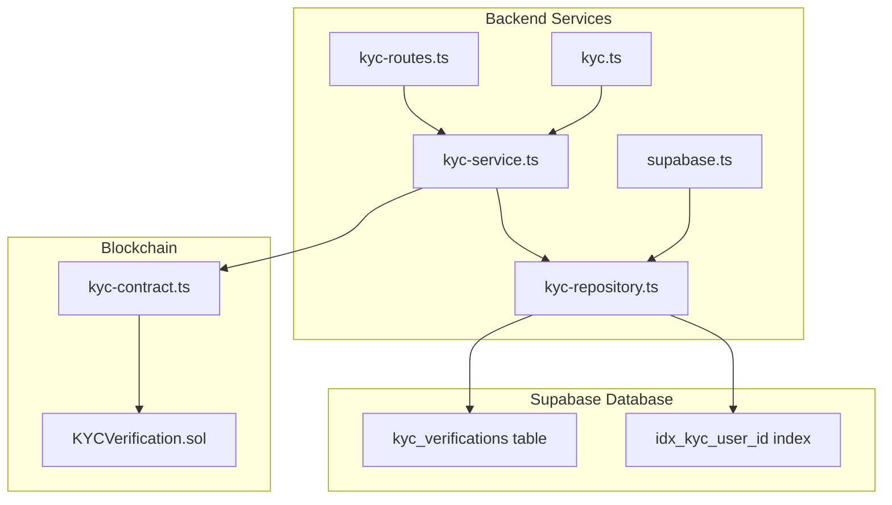
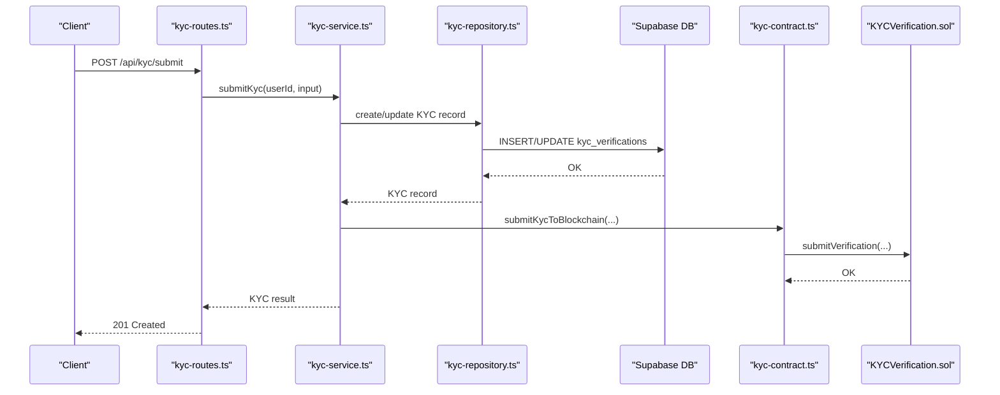
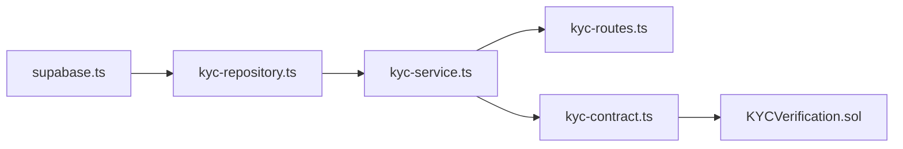

# KYC Verifications Table

<cite>
**Referenced Files in This Document**
- [schema.sql](file://supabase/schema.sql)
- [supabase.ts](file://src/config/supabase.ts)
- [kyc.ts](file://src/models/kyc.ts)
- [kyc-repository.ts](file://src/repositories/kyc-repository.ts)
- [kyc-service.ts](file://src/services/kyc-service.ts)
- [kyc-routes.ts](file://src/routes/kyc-routes.ts)
- [KYCVerification.sol](file://contracts/KYCVerification.sol)
- [kyc-contract.ts](file://src/services/kyc-contract.ts)
- [base-repository.ts](file://src/repositories/base-repository.ts)
</cite>

## Table of Contents
1. [Introduction](#introduction)
2. [Project Structure](#project-structure)
3. [Core Components](#core-components)
4. [Architecture Overview](#architecture-overview)
5. [Detailed Component Analysis](#detailed-component-analysis)
6. [Dependency Analysis](#dependency-analysis)
7. [Performance Considerations](#performance-considerations)
8. [Troubleshooting Guide](#troubleshooting-guide)
9. [Conclusion](#conclusion)
10. [Appendices](#appendices)

## Introduction
This document provides comprehensive data model documentation for the kyc_verifications table in the FreelanceXchain Supabase PostgreSQL database. It explains each column, constraints, indexes, and roles within the privacy-preserving identity verification system integrated with blockchain. The table serves as the central persistence layer for international KYC submissions, biometric checks, and administrative review, while the on-chain KYCVerification.sol smart contract ensures immutable, transparent verification records without exposing personal data.

The documentation covers:
- Column definitions and data types
- Purpose and relationships to users and admin reviewers
- Status lifecycle and tier levels
- Biometric and document handling
- Compliance and trust mechanisms
- RLS policies and data protection
- Withdrawal limits and dispute resolution privileges tied to KYC status
- Index usage and performance considerations

## Project Structure
The kyc_verifications table is defined in the Supabase schema and accessed through typed models, repositories, services, and routes. The on-chain counterpart is implemented in Solidity and bridged via service functions.

**Diagram sources**
- [schema.sql](file://supabase/schema.sql#L135-L159)
- [kyc-routes.ts](file://src/routes/kyc-routes.ts#L1-L120)
- [kyc-service.ts](file://src/services/kyc-service.ts#L1-L120)
- [kyc-repository.ts](file://src/repositories/kyc-repository.ts#L1-L40)
- [kyc.ts](file://src/models/kyc.ts#L1-L120)
- [supabase.ts](file://src/config/supabase.ts#L6-L21)
- [KYCVerification.sol](file://contracts/KYCVerification.sol#L1-L60)
- [kyc-contract.ts](file://src/services/kyc-contract.ts#L1-L60)

**Section sources**
- [schema.sql](file://supabase/schema.sql#L135-L159)
- [supabase.ts](file://src/config/supabase.ts#L6-L21)

## Core Components
- Table definition and constraints: The kyc_verifications table defines UUID primary keys, foreign key to users, status with a constrained set of values, tier levels, personal information fields, address as JSONB, documents as JSONB array, biometric liveness_check JSONB, timestamps, reviewer linkage, rejection reason, and audit timestamps.
- Index: An index on user_id accelerates lookups by user.
- RLS: Row Level Security is enabled on the table to enforce access controls.
- Backend mapping: Typed models define the shape of KYC records, including nested JSONB structures for address and documents, and optional biometric data.
- Repository and service: The repository encapsulates CRUD operations and status queries; the service orchestrates submission, liveness, face match, review, and blockchain synchronization.

**Section sources**
- [schema.sql](file://supabase/schema.sql#L135-L159)
- [schema.sql](file://supabase/schema.sql#L215-L215)
- [schema.sql](file://supabase/schema.sql#L234-L234)
- [kyc.ts](file://src/models/kyc.ts#L84-L119)
- [kyc-repository.ts](file://src/repositories/kyc-repository.ts#L1-L40)
- [kyc-service.ts](file://src/services/kyc-service.ts#L86-L190)

## Architecture Overview
The KYC system integrates off-chain persistence with on-chain immutability:
- Off-chain: Supabase stores KYC records, user references, and biometric metadata. Routes and services manage submission, liveness, face match, and admin review.
- On-chain: The KYCVerification.sol contract stores verification status, tier, data hash, and expiration, enabling trustless verification checks and dispute resolution.

**Diagram sources**
- [kyc-routes.ts](file://src/routes/kyc-routes.ts#L367-L428)
- [kyc-service.ts](file://src/services/kyc-service.ts#L90-L190)
- [kyc-repository.ts](file://src/repositories/kyc-repository.ts#L124-L129)
- [kyc-contract.ts](file://src/services/kyc-contract.ts#L93-L156)
- [KYCVerification.sol](file://contracts/KYCVerification.sol#L61-L87)

## Detailed Component Analysis

### Table Schema and Columns
The kyc_verifications table schema defines:
- id: UUID primary key with default generated value
- user_id: UUID foreign key to users(id) with cascade delete
- status: VARCHAR with CHECK constraint limiting values to pending, submitted, under_review, approved, rejected
- tier: INTEGER default 1
- Personal information: first_name, middle_name, last_name, date_of_birth, place_of_birth, nationality, secondary_nationality, tax_residence_country, tax_identification_number
- address: JSONB default empty object
- documents: JSONB default empty array
- liveness_check: JSONB for biometric session data
- submitted_at, reviewed_at: TIMESTAMPTZ
- reviewed_by: UUID foreign key to users(id)
- rejection_reason: TEXT
- created_at, updated_at: TIMESTAMPTZ defaults

Index:
- idx_kyc_user_id on user_id

RLS:
- Enabled on kyc_verifications

Purpose:
- Central persistence for international KYC submissions, biometric verification, and administrative review.
- Integrates with blockchain via stored hashes and status to enable trustless verification.

**Section sources**
- [schema.sql](file://supabase/schema.sql#L135-L159)
- [schema.sql](file://supabase/schema.sql#L215-L215)
- [schema.sql](file://supabase/schema.sql#L234-L234)

### Data Model Types
Typed models define:
- KycStatus union and KycTier enumeration
- InternationalAddress interface for address JSONB
- KycDocument and OCR/MRZ extraction types
- LivenessCheck and LivenessChallenge structures
- KycVerification interface mirroring the table schema plus additional fields for internal processing (e.g., selfie URL, face match, AML screening, risk metrics)
- Submission, liveness, face match, and review input types

These types ensure strong typing across the API, repository, and service layers.

**Section sources**
- [kyc.ts](file://src/models/kyc.ts#L1-L120)
- [kyc.ts](file://src/models/kyc.ts#L136-L206)

### Repository and Entity Mapping
The repository:
- Extends BaseRepository with the kyc_verifications table name
- Provides create, get by id, get by user id, update, and status-based queries
- Uses Supabase client to select, insert, update, and order by timestamps

Entity-to-model mapping:
- Converts snake_case database fields to camelCase model properties
- Preserves JSONB structures for address, documents, and liveness_check
- Maps optional fields and enums appropriately

**Section sources**
- [kyc-repository.ts](file://src/repositories/kyc-repository.ts#L1-L40)
- [kyc-repository.ts](file://src/repositories/kyc-repository.ts#L43-L117)
- [kyc-repository.ts](file://src/repositories/kyc-repository.ts#L119-L175)
- [base-repository.ts](file://src/repositories/base-repository.ts#L39-L86)

### Service Orchestration
Key flows:
- Submission: Validates country and document type support, prevents duplicates, sets status to submitted, attaches documents, and optionally submits to blockchain
- Liveness: Creates a session with randomized challenges, validates session, computes confidence, and marks pass/fail/expired
- Face Match: Computes similarity score and updates face match status
- Review: Approves or rejects, sets reviewer, risk metrics, and updates blockchain accordingly
- Integrity: Compares off-chain status with on-chain verification and verifies data hash

**Section sources**
- [kyc-service.ts](file://src/services/kyc-service.ts#L86-L190)
- [kyc-service.ts](file://src/services/kyc-service.ts#L193-L293)
- [kyc-service.ts](file://src/services/kyc-service.ts#L295-L318)
- [kyc-service.ts](file://src/services/kyc-service.ts#L328-L407)
- [kyc-service.ts](file://src/services/kyc-service.ts#L470-L547)

### Blockchain Integration
The backend simulates blockchain interactions:
- Generates data hash and user ID hash
- Submits KYC to blockchain (pending), approves (approved with tier and expiry), or rejects (rejected with reason)
- Checks wallet verification status and compares with off-chain records

The on-chain contract:
- Stores verification status, tier, dataHash, verifiedAt, expiresAt, verifiedBy, and rejectionReason
- Supports submit, approve, reject, expire, and query functions
- Emits events for transparency

**Section sources**
- [kyc-contract.ts](file://src/services/kyc-contract.ts#L66-L156)
- [kyc-contract.ts](file://src/services/kyc-contract.ts#L158-L221)
- [kyc-contract.ts](file://src/services/kyc-contract.ts#L223-L278)
- [kyc-contract.ts](file://src/services/kyc-contract.ts#L280-L338)
- [KYCVerification.sol](file://contracts/KYCVerification.sol#L1-L60)
- [KYCVerification.sol](file://contracts/KYCVerification.sol#L88-L150)
- [KYCVerification.sol](file://contracts/KYCVerification.sol#L151-L210)

### API Exposure and Admin Workflows
Routes expose:
- Countries and requirements
- Status retrieval
- Submission endpoint
- Liveness session creation and verification
- Face match endpoint
- Additional document upload
- Admin endpoints to list pending reviews and get by status

Validation and error handling are implemented in routes and services.

**Section sources**
- [kyc-routes.ts](file://src/routes/kyc-routes.ts#L240-L365)
- [kyc-routes.ts](file://src/routes/kyc-routes.ts#L367-L428)
- [kyc-routes.ts](file://src/routes/kyc-routes.ts#L430-L540)
- [kyc-routes.ts](file://src/routes/kyc-routes.ts#L541-L624)
- [kyc-routes.ts](file://src/routes/kyc-routes.ts#L626-L698)
- [kyc-routes.ts](file://src/routes/kyc-routes.ts#L700-L764)
- [kyc-routes.ts](file://src/routes/kyc-routes.ts#L766-L800)

## Dependency Analysis
- supabase.ts defines TABLES.KYC_VERIFICATIONS and exposes it to repositories
- kyc-repository.ts depends on supabase.ts for table name and BaseRepository for DB operations
- kyc-service.ts depends on kyc-repository.ts and kyc-contract.ts
- kyc-routes.ts depends on kyc-service.ts and exports Swagger schemas
- KYCVerification.sol is the on-chain dependency for blockchain operations

**Diagram sources**
- [supabase.ts](file://src/config/supabase.ts#L6-L21)
- [kyc-repository.ts](file://src/repositories/kyc-repository.ts#L1-L20)
- [kyc-service.ts](file://src/services/kyc-service.ts#L1-L20)
- [kyc-routes.ts](file://src/routes/kyc-routes.ts#L1-L20)
- [kyc-contract.ts](file://src/services/kyc-contract.ts#L1-L20)
- [KYCVerification.sol](file://contracts/KYCVerification.sol#L1-L20)

**Section sources**
- [supabase.ts](file://src/config/supabase.ts#L6-L21)
- [kyc-repository.ts](file://src/repositories/kyc-repository.ts#L1-L20)
- [kyc-service.ts](file://src/services/kyc-service.ts#L1-L20)
- [kyc-routes.ts](file://src/routes/kyc-routes.ts#L1-L20)
- [kyc-contract.ts](file://src/services/kyc-contract.ts#L1-L20)
- [KYCVerification.sol](file://contracts/KYCVerification.sol#L1-L20)

## Performance Considerations
- Index usage: The idx_kyc_user_id index optimizes lookups by user_id, crucial for retrieving the latest KYC record per user.
- Query patterns: Repository methods use ordering by created_at and limits for paginated admin review lists.
- JSONB storage: Efficient for flexible document and address structures; consider selective indexing if querying nested fields frequently.
- RLS overhead: Enabling RLS adds minimal overhead; ensure policies remain minimal and targeted.

**Section sources**
- [schema.sql](file://supabase/schema.sql#L215-L215)
- [kyc-repository.ts](file://src/repositories/kyc-repository.ts#L136-L170)

## Troubleshooting Guide
Common issues and resolutions:
- Duplicate KYC submission: The service prevents re-submission if already approved or pending; handle 409 Conflict responses.
- Liveness session errors: Session invalid or expired; recreate session or verify session ID and expiry.
- Validation failures: Ensure required fields (name, DOB, nationality, address, document) are present and formatted correctly.
- Admin review errors: Rejection requires a reason; ensure rejectionReason is provided when rejecting.
- Blockchain sync: If blockchain operations fail, logs indicate failure; retry or inspect transaction receipts.

**Section sources**
- [kyc-service.ts](file://src/services/kyc-service.ts#L90-L190)
- [kyc-service.ts](file://src/services/kyc-service.ts#L193-L293)
- [kyc-service.ts](file://src/services/kyc-service.ts#L328-L407)
- [kyc-routes.ts](file://src/routes/kyc-routes.ts#L367-L428)
- [kyc-routes.ts](file://src/routes/kyc-routes.ts#L430-L540)

## Conclusion
The kyc_verifications table is the backbone of FreelanceXchain’s privacy-preserving KYC system. It captures international identity data, biometric verification, and administrative review while maintaining strict compliance and transparency. Off-chain storage ensures flexibility and performance, while on-chain verification guarantees immutability and trust. Together with RLS and robust service-layer orchestration, the system establishes a secure foundation for compliance, withdrawal limits enforcement, and dispute resolution.

## Appendices

### Column Reference and Constraints
- id: UUID primary key
- user_id: UUID foreign key to users(id), cascade delete
- status: CHECK (pending, submitted, under_review, approved, rejected)
- tier: INTEGER default 1
- Personal info: first_name, middle_name, last_name, date_of_birth, place_of_birth, nationality, secondary_nationality, tax_residence_country, tax_identification_number
- address: JSONB default {}
- documents: JSONB default []
- liveness_check: JSONB
- submitted_at, reviewed_at: TIMESTAMPTZ
- reviewed_by: UUID foreign key to users(id)
- rejection_reason: TEXT
- created_at, updated_at: TIMESTAMPTZ defaults

**Section sources**
- [schema.sql](file://supabase/schema.sql#L135-L159)

### RLS Policies and Data Protection
- RLS enabled on kyc_verifications
- Service role policy allows backend operations
- Access control should be enforced at route and service layers; ensure user isolation and admin-only endpoints for review

**Section sources**
- [schema.sql](file://supabase/schema.sql#L225-L240)
- [schema.sql](file://supabase/schema.sql#L246-L261)

### Example: How KYC Status Affects Withdrawal Limits and Disputes
- Approved KYC status enables higher withdrawal limits and grants dispute resolution privileges based on tier.
- Pending or rejected status restricts actions until verification completes or is resolved.
- The service layer enforces these rules during transactions and dispute handling.

[No sources needed since this section provides conceptual guidance]

### Example: How KYC Status Affects Dispute Resolution Privileges
- Higher tiers (standard/enhanced) may grant additional rights in dispute resolution workflows.
- The service compares off-chain status with on-chain verification to ensure integrity and enforce policies consistently.

[No sources needed since this section provides conceptual guidance]