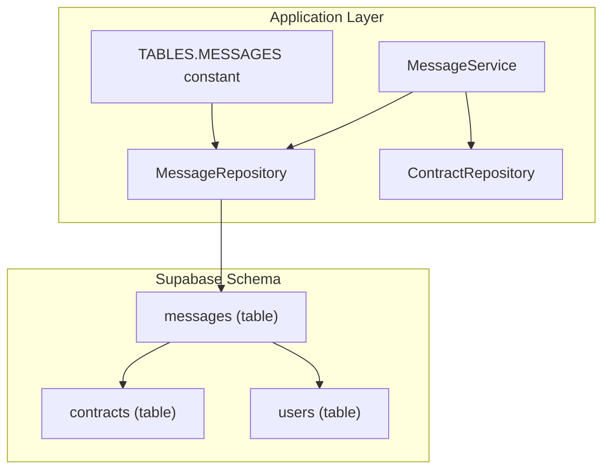
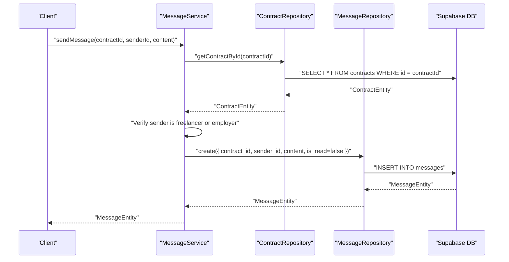
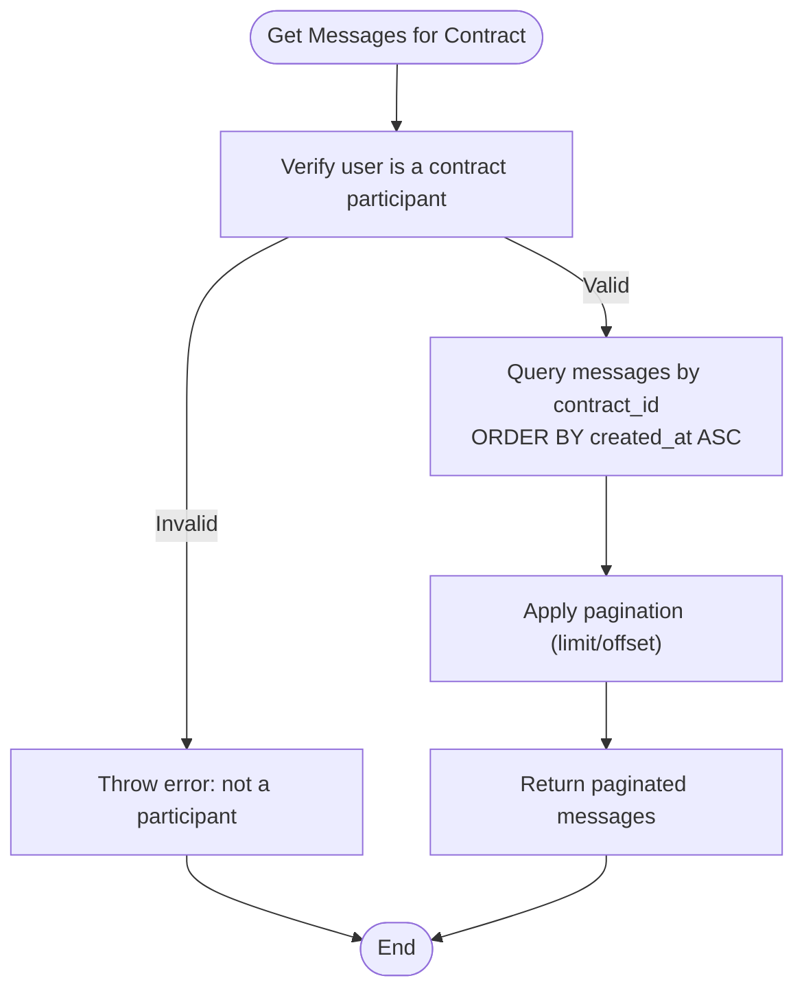
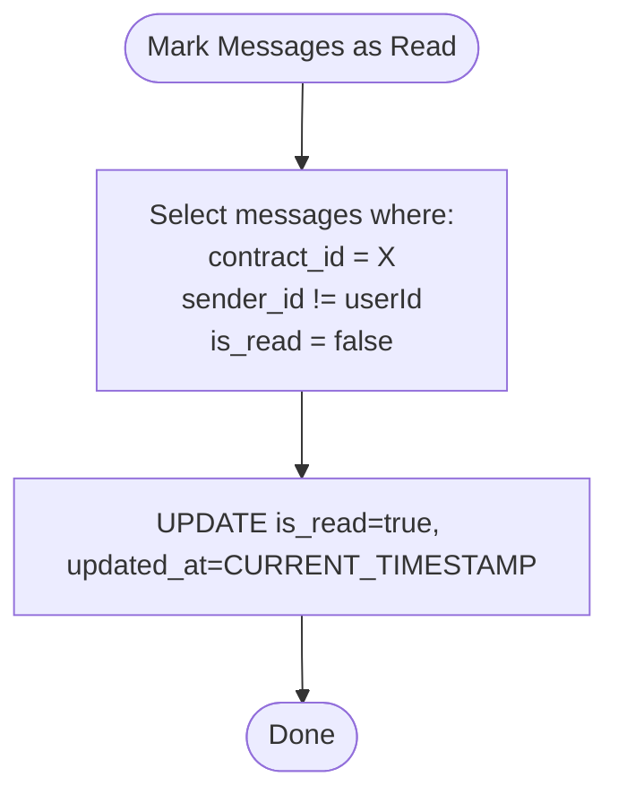
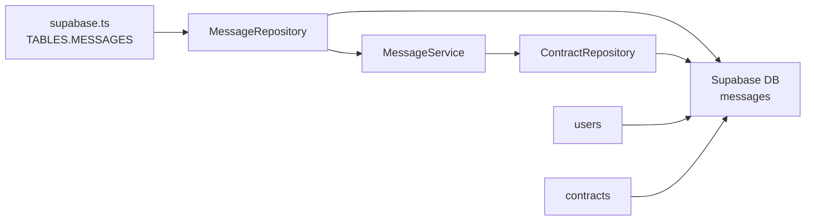

# Messages Table

<cite>
**Referenced Files in This Document**
- [schema.sql](file://supabase/schema.sql)
- [supabase.ts](file://src/config/supabase.ts)
- [message-repository.ts](file://src/repositories/message-repository.ts)
- [message-service.ts](file://src/services/message-service.ts)
- [contract-repository.ts](file://src/repositories/contract-repository.ts)
- [base-repository.ts](file://src/repositories/base-repository.ts)
</cite>

## Table of Contents
1. [Introduction](#introduction)
2. [Project Structure](#project-structure)
3. [Core Components](#core-components)
4. [Architecture Overview](#architecture-overview)
5. [Detailed Component Analysis](#detailed-component-analysis)
6. [Dependency Analysis](#dependency-analysis)
7. [Performance Considerations](#performance-considerations)
8. [Troubleshooting Guide](#troubleshooting-guide)
9. [Conclusion](#conclusion)

## Introduction
This document describes the messages table in the FreelanceXchain Supabase PostgreSQL database. It defines the table schema, explains the purpose of secure communication between contract parties, and documents how the application enforces access control and performance optimizations. It also covers message threading within contracts, read receipts, and the role of messages in dispute evidence collection.

## Project Structure
The messages table is defined in the Supabase schema and is accessed by the application through a typed repository and service layer. The TABLES.MESSAGES constant centralizes table naming across the codebase.

**Diagram sources**
- [schema.sql](file://supabase/schema.sql#L175-L184)
- [supabase.ts](file://src/config/supabase.ts#L6-L21)
- [message-repository.ts](file://src/repositories/message-repository.ts#L1-L82)
- [message-service.ts](file://src/services/message-service.ts#L1-L84)
- [contract-repository.ts](file://src/repositories/contract-repository.ts#L1-L139)

**Section sources**
- [schema.sql](file://supabase/schema.sql#L175-L184)
- [supabase.ts](file://src/config/supabase.ts#L6-L21)

## Core Components
- messages table: Stores secure, contract-scoped communications between parties.
- MessageRepository: Typed repository providing CRUD and query helpers for messages.
- MessageService: Orchestrates message creation, retrieval, and read receipts while enforcing participant checks.
- ContractRepository: Validates contract existence and participant roles before message operations.
- TABLES.MESSAGES: Centralized table name constant used by repositories and services.

**Section sources**
- [schema.sql](file://supabase/schema.sql#L175-L184)
- [message-repository.ts](file://src/repositories/message-repository.ts#L1-L82)
- [message-service.ts](file://src/services/message-service.ts#L1-L84)
- [contract-repository.ts](file://src/repositories/contract-repository.ts#L1-L139)
- [supabase.ts](file://src/config/supabase.ts#L6-L21)

## Architecture Overview
The messages table underpins secure, contract-bound communication. It ensures only authorized parties can access messages and provides efficient querying via indexes. Read receipts are tracked per message and can be batch-marked as read.

**Diagram sources**
- [message-service.ts](file://src/services/message-service.ts#L18-L47)
- [contract-repository.ts](file://src/repositories/contract-repository.ts#L24-L35)
- [message-repository.ts](file://src/repositories/message-repository.ts#L39-L62)
- [base-repository.ts](file://src/repositories/base-repository.ts#L39-L55)

## Detailed Component Analysis

### Messages Table Schema
- id: UUID primary key with default generated value.
- contract_id: UUID foreign key referencing contracts(id), cascade delete.
- sender_id: UUID foreign key referencing users(id), cascade delete.
- content: Text field, required.
- is_read: Boolean flag, defaults to false.
- created_at: Timestamp with timezone, default current time.
- updated_at: Timestamp with timezone, default current time.

Purpose:
- Provides a secure communication channel between parties in a contract.
- Enables collaboration by persisting conversations scoped to a contract.
- Supports read receipts and dispute evidence capture.

Indexes:
- idx_messages_contract_id: Improves query performance for contract-scoped message retrieval.
- idx_messages_sender_id: Optimizes sender-based filtering and analytics.

RLS Policies:
- RLS enabled on messages table.
- Service role policy grants full access for backend operations.
- Additional participant-based policies are enforced at the application level during reads/writes.

**Section sources**
- [schema.sql](file://supabase/schema.sql#L175-L184)
- [schema.sql](file://supabase/schema.sql#L202-L224)
- [schema.sql](file://supabase/schema.sql#L225-L261)
- [message-repository.ts](file://src/repositories/message-repository.ts#L18-L37)
- [message-repository.ts](file://src/repositories/message-repository.ts#L39-L62)

### Message Threading Within a Contract
- Messages are grouped by contract_id.
- Retrieval sorts by created_at ascending to display chronological order.
- Latest message per contract can be fetched for conversation summaries.

**Diagram sources**
- [message-service.ts](file://src/services/message-service.ts#L49-L58)
- [message-repository.ts](file://src/repositories/message-repository.ts#L18-L37)

**Section sources**
- [message-repository.ts](file://src/repositories/message-repository.ts#L18-L37)
- [message-service.ts](file://src/services/message-service.ts#L49-L58)

### Read Receipt Tracking
- is_read flag defaults to false when a message is created.
- Unread count is computed for the other party (neq sender_id).
- Batch marking as read updates is_read and updated_at for all unread messages in a contract for the other party.

**Diagram sources**
- [message-repository.ts](file://src/repositories/message-repository.ts#L39-L62)

**Section sources**
- [message-repository.ts](file://src/repositories/message-repository.ts#L39-L62)

### Role-Based Access Control and Participant Checks
- Application-level enforcement ensures only parties in a contract can send or retrieve messages.
- MessageService validates that the sender is either the freelancer or employer linked to the contract.

```mermaid
sequenceDiagram
participant Svc as "MessageService"
participant CRepo as "ContractRepository"
participant Repo as "MessageRepository"
Svc->>CRepo : "getContractById(contractId)"
CRepo-->>Svc : "ContractEntity"
Svc->>Svc : "Check senderId equals freelancer_id OR employer_id"
alt Valid participant
Svc->>Repo : "findByContractId(contractId, options)"
Repo-->>Svc : "Paginated messages"
else Not participant
Svc-->>Svc : "Throw error"
end
```

**Diagram sources**
- [message-service.ts](file://src/services/message-service.ts#L49-L58)
- [contract-repository.ts](file://src/repositories/contract-repository.ts#L24-L35)

**Section sources**
- [message-service.ts](file://src/services/message-service.ts#L21-L27)
- [message-service.ts](file://src/services/message-service.ts#L49-L58)

### Evidence Gathering for Disputes
- Messages are persisted with timestamps and sender identity.
- Disputes can reference relevant messages as evidence.
- The is_read flag helps track whether a party has seen messages prior to escalation.

**Section sources**
- [schema.sql](file://supabase/schema.sql#L109-L120)
- [schema.sql](file://supabase/schema.sql#L175-L184)

## Dependency Analysis
- The messages table depends on contracts and users via foreign keys.
- Repositories and services depend on the TABLES.MESSAGES constant for table identification.
- MessageService depends on ContractRepository to validate participants.

**Diagram sources**
- [supabase.ts](file://src/config/supabase.ts#L6-L21)
- [message-repository.ts](file://src/repositories/message-repository.ts#L1-L16)
- [message-service.ts](file://src/services/message-service.ts#L1-L17)
- [contract-repository.ts](file://src/repositories/contract-repository.ts#L1-L19)
- [schema.sql](file://supabase/schema.sql#L95-L106)
- [schema.sql](file://supabase/schema.sql#L175-L184)

**Section sources**
- [supabase.ts](file://src/config/supabase.ts#L6-L21)
- [message-repository.ts](file://src/repositories/message-repository.ts#L1-L16)
- [message-service.ts](file://src/services/message-service.ts#L1-L17)
- [contract-repository.ts](file://src/repositories/contract-repository.ts#L1-L19)
- [schema.sql](file://supabase/schema.sql#L95-L106)
- [schema.sql](file://supabase/schema.sql#L175-L184)

## Performance Considerations
- Indexes on contract_id and sender_id improve query performance for:
  - Listing messages per contract.
  - Filtering unread messages by sender.
- Pagination is supported via limit/offset to handle large conversation histories.
- Batch marking as read updates only the necessary records.

**Section sources**
- [schema.sql](file://supabase/schema.sql#L202-L224)
- [message-repository.ts](file://src/repositories/message-repository.ts#L18-L37)
- [message-repository.ts](file://src/repositories/message-repository.ts#L39-L62)

## Troubleshooting Guide
- Contract not found: Ensure the contract exists before sending or retrieving messages.
- User not a participant: Only the freelancer or employer associated with a contract can send or view messages.
- Read receipt not updating: Confirm that the caller is the other party (neq sender_id) and that messages remain is_read=false.
- No messages returned: Verify pagination parameters and that the contract_id is correct.

**Section sources**
- [message-service.ts](file://src/services/message-service.ts#L21-L27)
- [message-service.ts](file://src/services/message-service.ts#L49-L58)
- [message-repository.ts](file://src/repositories/message-repository.ts#L39-L62)

## Conclusion
The messages table provides a secure, indexed, and participant-enforced communication mechanism for contract collaboration. Its design supports chronological threading, read receipts, and efficient querying. Together with RLS and application-level checks, it ensures privacy and integrity of communications while enabling evidence collection for disputes.