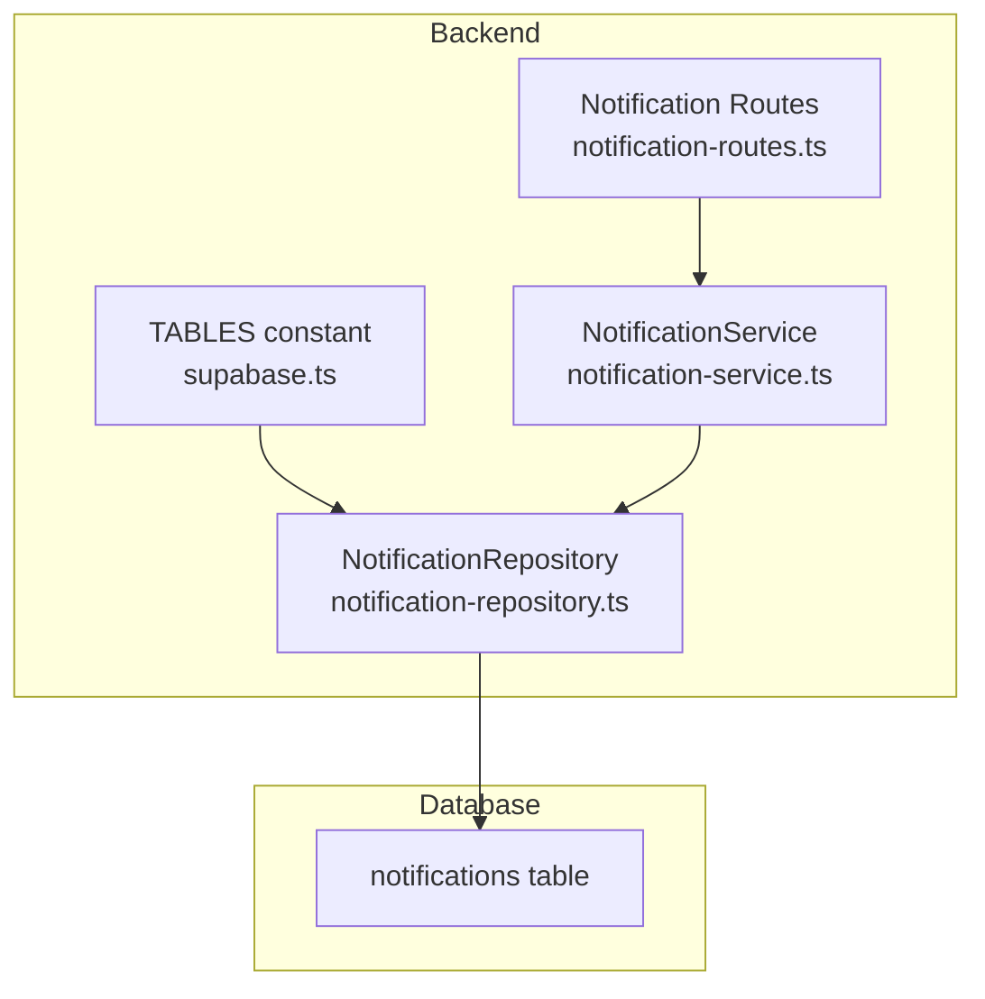
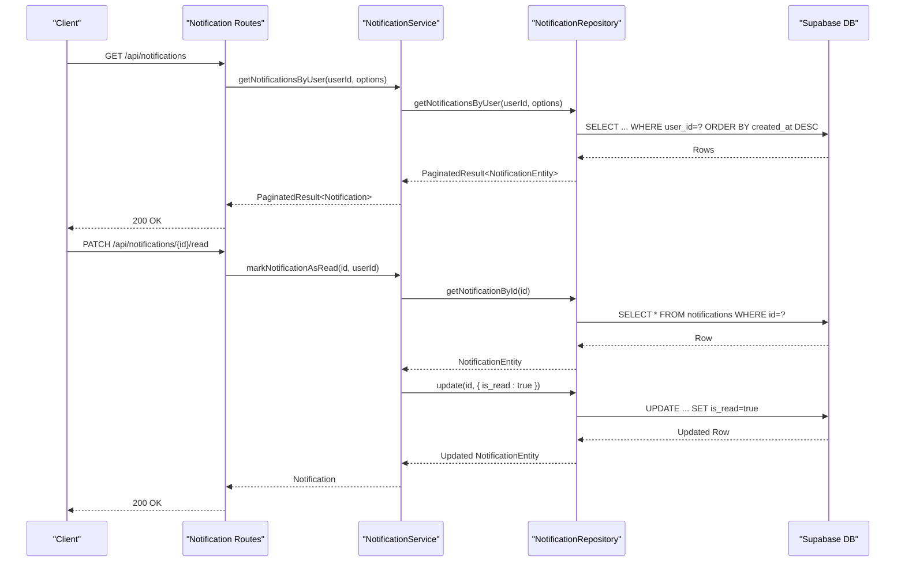
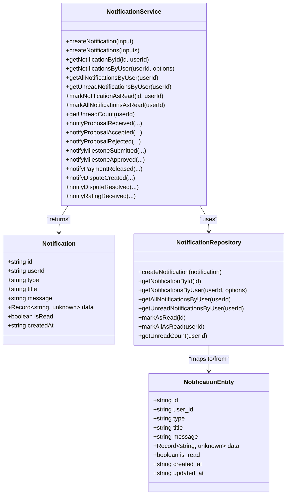
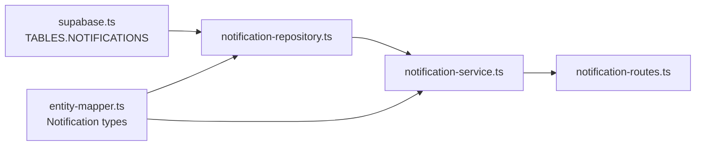

# Notifications Table

<cite>
**Referenced Files in This Document**
- [schema.sql](file://supabase/schema.sql)
- [supabase.ts](file://src/config/supabase.ts)
- [notification-repository.ts](file://src/repositories/notification-repository.ts)
- [notification-service.ts](file://src/services/notification-service.ts)
- [entity-mapper.ts](file://src/utils/entity-mapper.ts)
- [notification-routes.ts](file://src/routes/notification-routes.ts)
</cite>

## Table of Contents
1. [Introduction](#introduction)
2. [Project Structure](#project-structure)
3. [Core Components](#core-components)
4. [Architecture Overview](#architecture-overview)
5. [Detailed Component Analysis](#detailed-component-analysis)
6. [Dependency Analysis](#dependency-analysis)
7. [Performance Considerations](#performance-considerations)
8. [Troubleshooting Guide](#troubleshooting-guide)
9. [Conclusion](#conclusion)

## Introduction
This document describes the notifications table in the FreelanceXchain Supabase PostgreSQL database. It explains the table schema, the roles of each column, and how the table powers the event-driven communication system for user engagement. The notifications table stores events such as proposal status changes, contract updates, and messages, enabling targeted UI behaviors for users.

## Project Structure
The notifications table is defined in the Supabase schema and is accessed through the backend service layer and routes. The key files involved are:
- Database schema definition
- Backend constants for table names
- Repository and service layers for CRUD operations and helper functions
- Swagger route definitions for consuming notifications in the API

**Diagram sources**
- [schema.sql](file://supabase/schema.sql#L122-L133)
- [supabase.ts](file://src/config/supabase.ts#L6-L21)
- [notification-repository.ts](file://src/repositories/notification-repository.ts#L28-L117)
- [notification-service.ts](file://src/services/notification-service.ts#L1-L316)
- [notification-routes.ts](file://src/routes/notification-routes.ts#L1-L289)

**Section sources**
- [schema.sql](file://supabase/schema.sql#L122-L133)
- [supabase.ts](file://src/config/supabase.ts#L6-L21)

## Core Components
- notifications table: Stores event notifications for users with metadata and payload.
- TABLES.NOTIFICATIONS: Centralized table name constant used across the codebase.
- NotificationRepository: Encapsulates CRUD and query operations for notifications.
- NotificationService: Provides typed helpers for creating notifications and managing read state.
- Notification Routes: Expose API endpoints to list, count, and mark notifications as read.

**Section sources**
- [schema.sql](file://supabase/schema.sql#L122-L133)
- [supabase.ts](file://src/config/supabase.ts#L6-L21)
- [notification-repository.ts](file://src/repositories/notification-repository.ts#L28-L117)
- [notification-service.ts](file://src/services/notification-service.ts#L1-L316)
- [notification-routes.ts](file://src/routes/notification-routes.ts#L1-L289)

## Architecture Overview
The notifications system follows a layered architecture:
- Data layer: Supabase PostgreSQL table with indexes and RLS enabled.
- Service layer: Typed helpers and business logic for creating and updating notifications.
- Repository layer: Generic base repository plus notification-specific queries.
- API layer: Routes exposing endpoints for listing, counting, and marking notifications as read.

**Diagram sources**
- [notification-routes.ts](file://src/routes/notification-routes.ts#L83-L118)
- [notification-service.ts](file://src/services/notification-service.ts#L80-L151)
- [notification-repository.ts](file://src/repositories/notification-repository.ts#L41-L117)
- [schema.sql](file://supabase/schema.sql#L122-L133)

## Detailed Component Analysis

### Database Schema: notifications table
- Purpose: Event-driven communication hub for user engagement.
- Columns:
  - id: UUID primary key, auto-generated.
  - user_id: UUID foreign key referencing users(id), cascade delete.
  - type: String categorizing the notification (e.g., proposal-related, milestone-related, payment-related, dispute-related, rating-related, message).
  - title: String, not null, short headline for the notification.
  - message: Text, human-readable description of the event.
  - data: JSONB payload containing contextual details (IDs, titles, amounts, etc.).
  - is_read: Boolean flag indicating whether the user has viewed the notification.
  - created_at, updated_at: Timestamps with timezone.
- Indexes:
  - idx_notifications_user_id: Improves queries by user.
  - idx_notifications_is_read: Improves unread queries and counts.
- RLS:
  - Enabled on notifications table.
  - Service role policy allows full access for backend operations.

How it supports the event-driven system:
- Tracks lifecycle events such as proposal submissions, acceptance/rejection, milestone approvals, payment releases, disputes, ratings, and messages.
- The data JSONB field carries enough context for UI to render actionable links and details.

**Section sources**
- [schema.sql](file://supabase/schema.sql#L122-L133)
- [schema.sql](file://supabase/schema.sql#L213-L214)
- [schema.sql](file://supabase/schema.sql#L233-L239)
- [schema.sql](file://supabase/schema.sql#L246-L260)

### TABLES.NOTIFICATIONS constant
- Centralized table name constant ensures consistency across the codebase.
- Used by the repository to target the notifications table.

**Section sources**
- [supabase.ts](file://src/config/supabase.ts#L6-L21)
- [notification-repository.ts](file://src/repositories/notification-repository.ts#L30-L31)

### NotificationRepository
Responsibilities:
- Create notifications.
- Retrieve notifications by user with pagination.
- Retrieve all notifications by user (ordered by creation time).
- Retrieve unread notifications by user.
- Mark a notification as read.
- Mark all notifications as read for a user.
- Count unread notifications for a user.

Key behaviors:
- Uses eq('user_id', userId) to scope queries to the authenticated user.
- Uses eq('is_read', false) to filter unread items.
- Orders by created_at descending for newest-first views.

**Section sources**
- [notification-repository.ts](file://src/repositories/notification-repository.ts#L28-L117)

### NotificationService
Responsibilities:
- Typed input for creating notifications.
- Helper functions for specific notification types:
  - Proposal lifecycle: received, accepted, rejected.
  - Milestone lifecycle: submitted, approved.
  - Payment lifecycle: released.
  - Dispute lifecycle: created, resolved.
  - Rating received.
- Read-state management: mark individual and all notifications as read, and get unread count.

Authorization note:
- When marking a notification as read, the service verifies that the notification belongs to the requesting user before updating.

**Section sources**
- [notification-service.ts](file://src/services/notification-service.ts#L1-L151)
- [notification-service.ts](file://src/services/notification-service.ts#L162-L316)

### Notification Routes
Endpoints:
- GET /api/notifications: Lists paginated notifications for the authenticated user.
- GET /api/notifications/unread-count: Returns the unread count for the authenticated user.
- PATCH /api/notifications/{id}/read: Marks a specific notification as read.
- PATCH /api/notifications/read-all: Marks all notifications as read for the authenticated user.

Security:
- All endpoints require authentication via bearer token.
- Unauthorized access attempts receive appropriate HTTP status codes.

**Section sources**
- [notification-routes.ts](file://src/routes/notification-routes.ts#L83-L118)
- [notification-routes.ts](file://src/routes/notification-routes.ts#L144-L169)
- [notification-routes.ts](file://src/routes/notification-routes.ts#L204-L234)
- [notification-routes.ts](file://src/routes/notification-routes.ts#L261-L286)

### Data Model and Types
- Notification type: camelCase representation used in API responses.
- NotificationEntity: snake_case representation used in the database.
- NotificationType union defines allowed notification categories.

**Diagram sources**
- [entity-mapper.ts](file://src/utils/entity-mapper.ts#L373-L409)
- [notification-repository.ts](file://src/repositories/notification-repository.ts#L16-L26)
- [notification-service.ts](file://src/services/notification-service.ts#L1-L316)

## Dependency Analysis
- The repository depends on TABLES.NOTIFICATIONS for table targeting.
- The service depends on the repository for persistence and on the entity mapper for type conversion.
- The routes depend on the service for business logic and on authentication middleware for security.

**Diagram sources**
- [supabase.ts](file://src/config/supabase.ts#L6-L21)
- [notification-repository.ts](file://src/repositories/notification-repository.ts#L28-L31)
- [notification-service.ts](file://src/services/notification-service.ts#L1-L316)
- [entity-mapper.ts](file://src/utils/entity-mapper.ts#L373-L409)
- [notification-routes.ts](file://src/routes/notification-routes.ts#L1-L289)

**Section sources**
- [supabase.ts](file://src/config/supabase.ts#L6-L21)
- [notification-repository.ts](file://src/repositories/notification-repository.ts#L28-L31)
- [notification-service.ts](file://src/services/notification-service.ts#L1-L316)
- [entity-mapper.ts](file://src/utils/entity-mapper.ts#L373-L409)
- [notification-routes.ts](file://src/routes/notification-routes.ts#L1-L289)

## Performance Considerations
- Indexes:
  - idx_notifications_user_id: Optimizes per-user queries.
  - idx_notifications_is_read: Optimizes unread queries and unread counts.
- Pagination:
  - The repository supports pagination to limit result sets.
- Sorting:
  - Queries order by created_at descending for efficient newest-first lists.
- RLS:
  - Enabling RLS on notifications ensures row-level filtering, which is essential for correctness and performance when combined with indexes.

**Section sources**
- [schema.sql](file://supabase/schema.sql#L213-L214)
- [schema.sql](file://supabase/schema.sql#L225-L239)
- [notification-repository.ts](file://src/repositories/notification-repository.ts#L41-L60)

## Troubleshooting Guide
Common scenarios and resolutions:
- Unauthorized access when marking a notification as read:
  - The service checks that the notification belongs to the requesting user. If not, it returns UNAUTHORIZED.
- Notification not found:
  - Attempting to mark a non-existent notification returns NOT_FOUND.
- Update failures:
  - If the update operation fails, the service returns UPDATE_FAILED.
- Authentication errors:
  - Routes require a valid bearer token; missing or invalid tokens result in 401 responses.

Operational tips:
- Use GET /api/notifications/unread-count to drive badge indicators.
- Use PATCH /api/notifications/read-all to batch-clear notifications after user action.
- Use PATCH /api/notifications/{id}/read to immediately reflect user interaction.

**Section sources**
- [notification-service.ts](file://src/services/notification-service.ts#L113-L151)
- [notification-routes.ts](file://src/routes/notification-routes.ts#L204-L234)
- [notification-routes.ts](file://src/routes/notification-routes.ts#L261-L286)

## Conclusion
The notifications table is the backbone of FreelanceXchain’s event-driven user engagement. It captures lifecycle events across proposals, milestones, payments, disputes, ratings, and messages. With centralized table naming, robust repository and service layers, and secure API routes, it enables scalable, user-centric communication. Proper indexing and RLS ensure performance and data isolation, while helper functions simplify UI integration and badge-driven experiences.