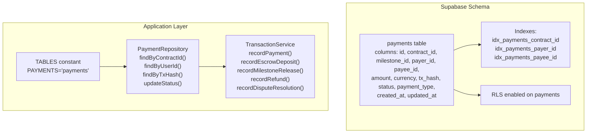
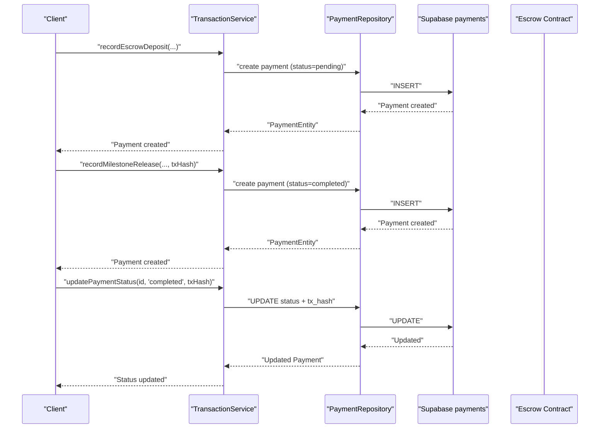
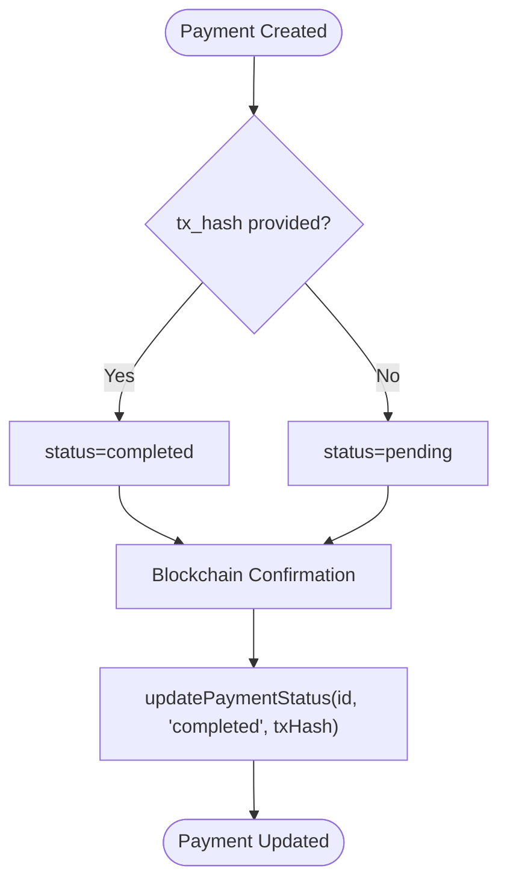
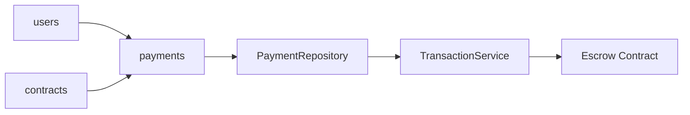

# Payments Table

<cite>
**Referenced Files in This Document**
- [schema.sql](file://supabase/schema.sql)
- [supabase.ts](file://src/config/supabase.ts)
- [payment-repository.ts](file://src/repositories/payment-repository.ts)
- [transaction-service.ts](file://src/services/transaction-service.ts)
- [escrow-contract.ts](file://src/services/escrow-contract.ts)
- [FreelanceEscrow.sol](file://contracts/FreelanceEscrow.sol)
</cite>

## Table of Contents
1. [Introduction](#introduction)
2. [Project Structure](#project-structure)
3. [Core Components](#core-components)
4. [Architecture Overview](#architecture-overview)
5. [Detailed Component Analysis](#detailed-component-analysis)
6. [Dependency Analysis](#dependency-analysis)
7. [Performance Considerations](#performance-considerations)
8. [Troubleshooting Guide](#troubleshooting-guide)
9. [Conclusion](#conclusion)

## Introduction
This document provides comprehensive data model documentation for the payments table in the FreelanceXchain Supabase PostgreSQL database. The payments table serves as the transaction history ledger that bridges off-chain application records with on-chain events from the FreelanceEscrow.sol contract. It tracks fund flows across escrow deposits, milestone releases, refunds, and dispute resolutions, enabling auditability and reconciliation between Ethereum transactions and application state.

## Project Structure
The payments table is defined in the Supabase schema and integrated into the application through configuration constants, repository classes, and service functions. Indexes and Row Level Security (RLS) policies are configured to support efficient querying and financial privacy.

**Diagram sources**
- [schema.sql](file://supabase/schema.sql#L186-L224)
- [supabase.ts](file://src/config/supabase.ts#L6-L21)
- [payment-repository.ts](file://src/repositories/payment-repository.ts#L1-L94)
- [transaction-service.ts](file://src/services/transaction-service.ts#L1-L124)

**Section sources**
- [schema.sql](file://supabase/schema.sql#L186-L224)
- [supabase.ts](file://src/config/supabase.ts#L6-L21)

## Core Components
- Purpose: The payments table is the canonical record of all monetary events associated with contracts, including escrow deposits, milestone releases, refunds, and dispute resolutions. It links off-chain application actions to on-chain transaction hashes for traceability.
- Primary keys and foreign keys:
  - id: UUID primary key
  - contract_id: UUID foreign key referencing contracts
  - payer_id: UUID foreign key referencing users
  - payee_id: UUID foreign key referencing users
  - milestone_id: String identifier for blockchain milestone linkage
- Data types and constraints:
  - amount: numeric with two decimal places (monetary precision)
  - currency: default 'ETH'
  - status: constrained enumeration with pending, processing, completed, failed, refunded
  - payment_type: constrained enumeration with escrow_deposit, milestone_release, refund, dispute_resolution
  - tx_hash: optional blockchain transaction identifier
  - Audit timestamps: created_at and updated_at with timezone-aware timestamps
- Indexes: contract_id, payer_id, payee_id for performance
- RLS: Enabled on payments for row-level security

**Section sources**
- [schema.sql](file://supabase/schema.sql#L186-L224)
- [supabase.ts](file://src/config/supabase.ts#L6-L21)

## Architecture Overview
The payments ledger integrates with the FreelanceEscrow.sol contract through application services that create payment records and update statuses based on blockchain confirmations. The TABLES constant ensures consistent table naming across the application.

**Diagram sources**
- [transaction-service.ts](file://src/services/transaction-service.ts#L22-L124)
- [payment-repository.ts](file://src/repositories/payment-repository.ts#L1-L94)
- [schema.sql](file://supabase/schema.sql#L186-L224)

## Detailed Component Analysis

### Payments Table Schema and Constraints
- Columns and types:
  - id: UUID primary key
  - contract_id: UUID foreign key to contracts
  - milestone_id: String (blockchain milestone identifier)
  - payer_id: UUID foreign key to users
  - payee_id: UUID foreign key to users
  - amount: Decimal with precision suitable for ETH
  - currency: String with default 'ETH'
  - tx_hash: String (optional)
  - status: Enum with CHECK constraint
  - payment_type: Enum with CHECK constraint
  - created_at, updated_at: Timestamps with timezone
- Purpose:
  - Acts as the single source of truth for payment lifecycle events
  - Bridges off-chain actions with on-chain transaction identifiers
- Integrity:
  - CHECK constraints enforce valid status and payment_type values
  - Foreign keys ensure referential integrity with contracts and users
  - Default values normalize currency and timestamps

**Section sources**
- [schema.sql](file://supabase/schema.sql#L186-L224)

### Application Integration: TABLES Constant
- The TABLES constant defines the canonical table name for payments, ensuring consistent usage across repositories and services.

**Section sources**
- [supabase.ts](file://src/config/supabase.ts#L6-L21)

### Repository Layer: PaymentRepository
- Responsibilities:
  - Query payments by contract_id, user_id (payer or payee), and tx_hash
  - Update payment status and optionally set tx_hash
  - Aggregate totals for earnings and spent amounts
- Key methods:
  - findByContractId: sorts by created_at descending
  - findByUserId: paginated query using OR condition on payer_id and payee_id
  - findByTxHash: lookup by transaction hash
  - updateStatus: updates status and optionally tx_hash
  - getTotalEarnings/getTotalSpent: sums completed amounts for a user

**Section sources**
- [payment-repository.ts](file://src/repositories/payment-repository.ts#L1-L94)

### Service Layer: TransactionService
- Responsibilities:
  - Create payment records with appropriate payment_type and initial status
  - Update payment status and tx_hash after blockchain confirmations
  - Provide convenience functions for different payment categories
- Behavior:
  - recordPayment sets status to completed when txHash is provided, otherwise pending
  - recordEscrowDeposit, recordMilestoneRelease, recordRefund, recordDisputeResolution
  - updatePaymentStatus updates status and optionally tx_hash

**Section sources**
- [transaction-service.ts](file://src/services/transaction-service.ts#L1-L124)

### Blockchain Integration: Escrow Contract
- The FreelanceEscrow.sol contract emits events and performs transfers aligned with payment types:
  - FundsDeposited corresponds to escrow_deposit
  - MilestoneApproved corresponds to milestone_release
  - MilestoneRefunded corresponds to refund
  - DisputeResolved influences refund or release outcomes
- The application uses blockchain-client abstractions to submit and confirm transactions, then updates payments with tx_hash and status.

**Section sources**
- [FreelanceEscrow.sol](file://contracts/FreelanceEscrow.sol#L1-L264)
- [escrow-contract.ts](file://src/services/escrow-contract.ts#L1-L327)

### Status Lifecycle and tx_hash Mapping
- Initial state:
  - Pending when created without tx_hash
  - Completed when created with tx_hash
- Updates:
  - After blockchain confirmation, updatePaymentStatus sets status to completed and stores tx_hash
- tx_hash enables:
  - Direct blockchain explorer lookup
  - Cross-reference between on-chain receipts and off-chain records

**Diagram sources**
- [transaction-service.ts](file://src/services/transaction-service.ts#L22-L40)
- [payment-repository.ts](file://src/repositories/payment-repository.ts#L63-L67)

## Dependency Analysis
The payments table depends on contracts and users for referential integrity and on application services for lifecycle management. Indexes and RLS policies influence query performance and access control.

**Diagram sources**
- [schema.sql](file://supabase/schema.sql#L186-L224)
- [payment-repository.ts](file://src/repositories/payment-repository.ts#L1-L94)
- [transaction-service.ts](file://src/services/transaction-service.ts#L1-L124)
- [escrow-contract.ts](file://src/services/escrow-contract.ts#L1-L327)

**Section sources**
- [schema.sql](file://supabase/schema.sql#L186-L224)
- [payment-repository.ts](file://src/repositories/payment-repository.ts#L1-L94)
- [transaction-service.ts](file://src/services/transaction-service.ts#L1-L124)

## Performance Considerations
- Indexes:
  - idx_payments_contract_id: accelerates contract-level payment queries
  - idx_payments_payer_id: accelerates payer-centric views
  - idx_payments_payee_id: accelerates payee-centric views
- Pagination:
  - findByUserId supports pagination to limit result sets
- Aggregation:
  - getTotalEarnings and getTotalSpent compute summaries for completed payments only

**Section sources**
- [schema.sql](file://supabase/schema.sql#L202-L223)
- [payment-repository.ts](file://src/repositories/payment-repository.ts#L38-L94)

## Troubleshooting Guide
- Payment not found by tx_hash:
  - Ensure tx_hash is stored during updatePaymentStatus and that the record was created with txHash when applicable
- Incorrect status transitions:
  - Verify that updatePaymentStatus is invoked with the correct status and txHash after blockchain confirmation
- Missing indexes impacting performance:
  - Confirm indexes exist on contract_id, payer_id, and payee_id
- RLS access issues:
  - Ensure the Supabase session has appropriate permissions; RLS policies enable service role access for backend operations

**Section sources**
- [payment-repository.ts](file://src/repositories/payment-repository.ts#L59-L67)
- [schema.sql](file://supabase/schema.sql#L202-L224)

## Conclusion
The payments table is central to the FreelanceXchain architecture, providing a reliable bridge between off-chain application actions and on-chain Ethereum events. Through structured columns, constraints, indexes, and RLS policies, it ensures data integrity, performance, and privacy. Application services and repositories coordinate payment creation, status updates, and reconciliation with blockchain confirmations, enabling transparent and auditable fund flows across escrow deposits, milestone releases, refunds, and dispute resolutions.