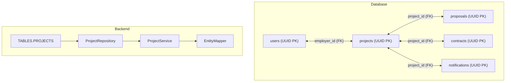
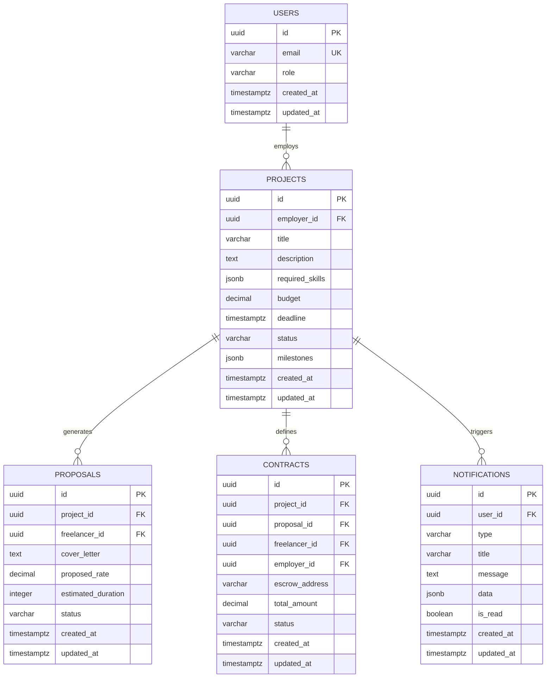
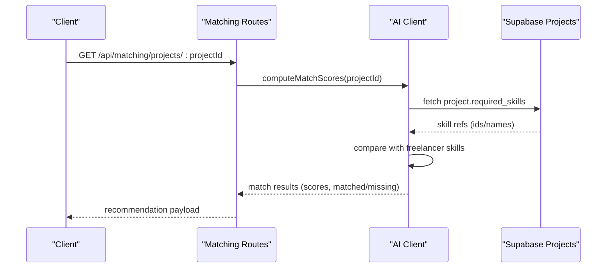
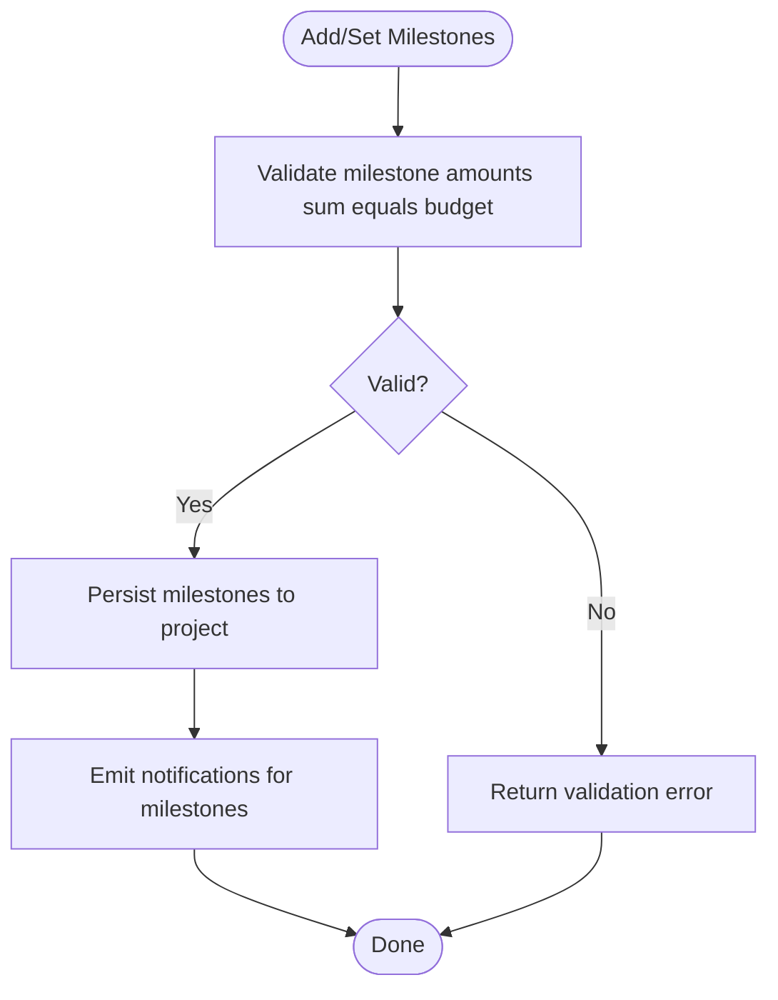
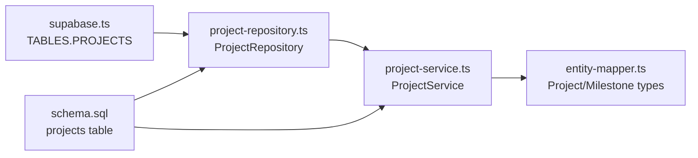

# Projects Table

<cite>
**Referenced Files in This Document**
- [schema.sql](file://supabase/schema.sql)
- [supabase.ts](file://src/config/supabase.ts)
- [project-repository.ts](file://src/repositories/project-repository.ts)
- [project-service.ts](file://src/services/project-service.ts)
- [entity-mapper.ts](file://src/utils/entity-mapper.ts)
- [project.ts](file://src/models/project.ts)
- [ARCHITECTURE.md](file://docs/ARCHITECTURE.md)
- [README.md](file://README.md)
</cite>

## Table of Contents
1. [Introduction](#introduction)
2. [Project Structure](#project-structure)
3. [Core Components](#core-components)
4. [Architecture Overview](#architecture-overview)
5. [Detailed Component Analysis](#detailed-component-analysis)
6. [Dependency Analysis](#dependency-analysis)
7. [Performance Considerations](#performance-considerations)
8. [Troubleshooting Guide](#troubleshooting-guide)
9. [Conclusion](#conclusion)

## Introduction
This document provides comprehensive data model documentation for the projects table in the FreelanceXchain Supabase PostgreSQL database. The projects table is the central entity representing freelance work opportunities. It captures essential metadata such as employer identity, title, description, required skills, budget, deadline, and lifecycle status. It also stores structured milestone definitions and audit timestamps. The table integrates with related entities (proposals, contracts, notifications) and supports AI-driven recommendations and milestone-based payment workflows.

## Project Structure
The projects table is defined in the Supabase schema and is referenced throughout the backend via a centralized table name constant. Repositories and services encapsulate data access and business logic, while entity mappers convert between database entities and API-facing models.

**Diagram sources**
- [schema.sql](file://supabase/schema.sql#L65-L78)
- [supabase.ts](file://src/config/supabase.ts#L6-L21)
- [project-repository.ts](file://src/repositories/project-repository.ts#L30-L33)
- [project-service.ts](file://src/services/project-service.ts#L1-L20)
- [entity-mapper.ts](file://src/utils/entity-mapper.ts#L198-L250)

**Section sources**
- [schema.sql](file://supabase/schema.sql#L65-L78)
- [supabase.ts](file://src/config/supabase.ts#L6-L21)
- [project-repository.ts](file://src/repositories/project-repository.ts#L30-L33)
- [project-service.ts](file://src/services/project-service.ts#L1-L20)
- [entity-mapper.ts](file://src/utils/entity-mapper.ts#L198-L250)

## Core Components
- Primary key: id (UUID, auto-generated)
- Foreign key: employer_id references users.id (CASCADE delete)
- Title: not null (VARCHAR)
- Description: text
- Required skills: JSONB array of skill references
- Budget: decimal (monetary)
- Deadline: timestamptz
- Status: enum-like string with CHECK constraint (draft, open, in_progress, completed, cancelled)
- Milestones: JSONB array of milestone definitions
- Audit timestamps: created_at, updated_at (timestamptz)

Purpose and scope:
- Central entity for freelance job postings
- Stores project requirements, budget, and timeline
- Enables discovery and matching via required_skills
- Drives milestone-based payment workflows and contract creation

**Section sources**
- [schema.sql](file://supabase/schema.sql#L65-L78)
- [project-repository.ts](file://src/repositories/project-repository.ts#L16-L28)
- [entity-mapper.ts](file://src/utils/entity-mapper.ts#L198-L250)

## Architecture Overview
The projects table participates in a broader ecosystem of entities. The following diagram shows how projects relate to users, proposals, contracts, and notifications.

**Diagram sources**
- [schema.sql](file://supabase/schema.sql#L7-L17)
- [schema.sql](file://supabase/schema.sql#L65-L78)
- [schema.sql](file://supabase/schema.sql#L80-L92)
- [schema.sql](file://supabase/schema.sql#L94-L106)
- [schema.sql](file://supabase/schema.sql#L122-L133)
- [ARCHITECTURE.md](file://docs/ARCHITECTURE.md#L142-L179)

**Section sources**
- [schema.sql](file://supabase/schema.sql#L7-L17)
- [schema.sql](file://supabase/schema.sql#L65-L78)
- [schema.sql](file://supabase/schema.sql#L80-L92)
- [schema.sql](file://supabase/schema.sql#L94-L106)
- [schema.sql](file://supabase/schema.sql#L122-L133)
- [ARCHITECTURE.md](file://docs/ARCHITECTURE.md#L142-L179)

## Detailed Component Analysis

### Projects Table Definition and Constraints
- id: UUID primary key with default generator
- employer_id: UUID foreign key to users.id with cascade delete
- title: not null
- description: text
- required_skills: JSONB array with default empty array
- budget: decimal with default 0
- deadline: timestamptz
- status: default draft with CHECK constraint limiting values to draft, open, in_progress, completed, cancelled
- milestones: JSONB array with default empty array
- created_at, updated_at: timestamptz defaults

Indexes:
- idx_projects_employer_id on projects(employer_id)
- idx_projects_status on projects(status)

Row Level Security:
- Policy enabling public read access only for projects with status = 'open'

**Section sources**
- [schema.sql](file://supabase/schema.sql#L65-L78)
- [schema.sql](file://supabase/schema.sql#L202-L208)
- [schema.sql](file://supabase/schema.sql#L241-L245)

### TABLES.PROJECTS Constant
The backend references the projects table via a centralized constant to ensure consistency across repositories and services.

- TABLES.PROJECTS resolves to the literal string "projects"
- Used by ProjectRepository to target the projects table

**Section sources**
- [supabase.ts](file://src/config/supabase.ts#L6-L21)
- [project-repository.ts](file://src/repositories/project-repository.ts#L30-L33)

### Data Model Types and Mapping
- ProjectEntity mirrors the database schema for repository operations
- Project (mapped type) exposes camelCase fields and typed required_skills and milestones
- ProjectSkillReference and Milestone types define the structure of JSONB arrays

**Section sources**
- [project-repository.ts](file://src/repositories/project-repository.ts#L16-L28)
- [entity-mapper.ts](file://src/utils/entity-mapper.ts#L198-L250)

### Relationships with Proposals, Contracts, and Notifications
- Proposals: linked via project_id; used to gate edits and deletions when accepted proposals exist
- Contracts: linked via project_id; milestone-based payments originate from project milestones
- Notifications: linked via project_id; used to inform stakeholders about lifecycle events

**Section sources**
- [schema.sql](file://supabase/schema.sql#L80-L92)
- [schema.sql](file://supabase/schema.sql#L94-L106)
- [schema.sql](file://supabase/schema.sql#L122-L133)
- [project-service.ts](file://src/services/project-service.ts#L132-L151)
- [project-service.ts](file://src/services/project-service.ts#L365-L388)

### AI-Powered Recommendations Using required_skills
- required_skills drives AI matching by providing explicit skill requirements
- The AI client compares project requirements against freelancer skills to compute match scores
- Keyword-based extraction and skill gap analysis can supplement or fallback when explicit skills are absent

**Diagram sources**
- [project-service.ts](file://src/services/project-service.ts#L85-L119)
- [entity-mapper.ts](file://src/utils/entity-mapper.ts#L112-L129)
- [schema.sql](file://supabase/schema.sql#L65-L78)

**Section sources**
- [project-service.ts](file://src/services/project-service.ts#L85-L119)
- [entity-mapper.ts](file://src/utils/entity-mapper.ts#L112-L129)
- [schema.sql](file://supabase/schema.sql#L65-L78)

### Milestones and Payment Releases
- Milestones define deliverables, due dates, and amounts
- Budget validation ensures milestone totals equal project budget
- Milestone statuses drive contract and payment workflows

**Diagram sources**
- [project-service.ts](file://src/services/project-service.ts#L202-L251)
- [project-service.ts](file://src/services/project-service.ts#L253-L300)
- [schema.sql](file://supabase/schema.sql#L65-L78)

**Section sources**
- [project-service.ts](file://src/services/project-service.ts#L202-L251)
- [project-service.ts](file://src/services/project-service.ts#L253-L300)
- [schema.sql](file://supabase/schema.sql#L65-L78)

### Query Patterns and Indexes
- getProjectsByEmployer: filters by employer_id and sorts by created_at desc
- getAllOpenProjects: filters by status = 'open'
- getProjectsByStatus: filters by status
- getProjectsBySkills: fetches open projects and filters in-memory by required_skills
- getProjectsByBudgetRange: filters by status = 'open' and budget range
- searchProjects: filters by status = 'open' and full-text-like ILIKE on title/description

Indexes:
- idx_projects_employer_id improves employer-scoped queries
- idx_projects_status improves filtering by status

**Section sources**
- [project-repository.ts](file://src/repositories/project-repository.ts#L55-L74)
- [project-repository.ts](file://src/repositories/project-repository.ts#L76-L95)
- [project-repository.ts](file://src/repositories/project-repository.ts#L97-L116)
- [project-repository.ts](file://src/repositories/project-repository.ts#L118-L142)
- [project-repository.ts](file://src/repositories/project-repository.ts#L144-L165)
- [project-repository.ts](file://src/repositories/project-repository.ts#L167-L187)
- [schema.sql](file://supabase/schema.sql#L202-L208)

### RLS Policy for Public Read Access
- Policy allows SELECT for projects where status = 'open'
- Service role policies grant full access for backend operations

**Section sources**
- [schema.sql](file://supabase/schema.sql#L241-L245)
- [schema.sql](file://supabase/schema.sql#L246-L261)

## Dependency Analysis
- ProjectRepository depends on TABLES.PROJECTS for table targeting
- ProjectService orchestrates business rules around project lifecycle, milestone budget validation, and skill validation
- EntityMapper converts between database entities and API-facing models
- The projects table references users and is referenced by proposals, contracts, and notifications

**Diagram sources**
- [supabase.ts](file://src/config/supabase.ts#L6-L21)
- [project-repository.ts](file://src/repositories/project-repository.ts#L30-L33)
- [project-service.ts](file://src/services/project-service.ts#L1-L20)
- [entity-mapper.ts](file://src/utils/entity-mapper.ts#L198-L250)
- [schema.sql](file://supabase/schema.sql#L65-L78)

**Section sources**
- [supabase.ts](file://src/config/supabase.ts#L6-L21)
- [project-repository.ts](file://src/repositories/project-repository.ts#L30-L33)
- [project-service.ts](file://src/services/project-service.ts#L1-L20)
- [entity-mapper.ts](file://src/utils/entity-mapper.ts#L198-L250)
- [schema.sql](file://supabase/schema.sql#L65-L78)

## Performance Considerations
- Use idx_projects_employer_id for employer-scoped queries
- Use idx_projects_status for status-filtered queries
- For skill-based filtering, fetch open projects and filter in-memory to leverage required_skills structure
- Prefer status = 'open' filters for public search and discovery
- Avoid scanning large datasets without filters; leverage pagination via QueryOptions

[No sources needed since this section provides general guidance]

## Troubleshooting Guide
Common issues and resolutions:
- Validation errors when adding milestones:
  - Ensure milestone amounts sum to the project budget
  - Verify milestone entries include required fields (title, description, amount, dueDate)
- Skill validation failures:
  - Confirm skill IDs exist and are active
- Locked project edits/deletes:
  - Cannot update/delete projects with accepted proposals; withdraw acceptance or cancel the proposal first
- Public read access:
  - Only projects with status = 'open' are publicly readable; adjust status accordingly

**Section sources**
- [project-service.ts](file://src/services/project-service.ts#L47-L56)
- [project-service.ts](file://src/services/project-service.ts#L202-L251)
- [project-service.ts](file://src/services/project-service.ts#L253-L300)
- [project-service.ts](file://src/services/project-service.ts#L132-L151)
- [project-service.ts](file://src/services/project-service.ts#L365-L388)
- [schema.sql](file://supabase/schema.sql#L241-L245)

## Conclusion
The projects table is the cornerstone of the FreelanceXchain marketplace. It defines the opportunity, requirements, and financial framework for freelance work. Its design enables efficient discovery, AI-driven matching, and secure milestone-based payments. Proper indexing, RLS policies, and service-layer validations ensure performance, security, and data integrity across the system.

[No sources needed since this section summarizes without analyzing specific files]