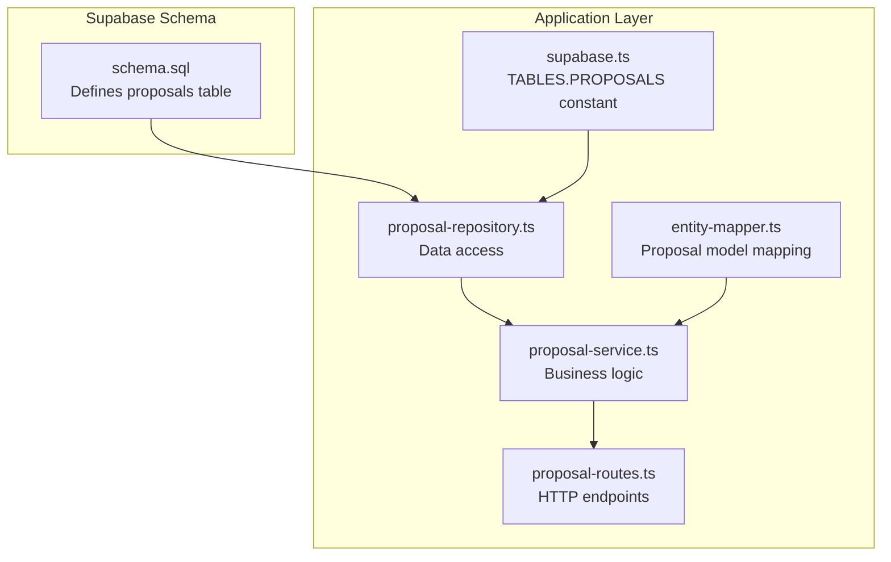
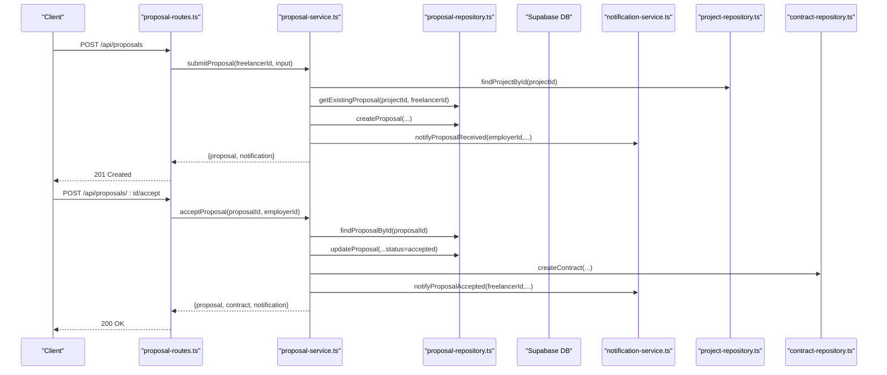
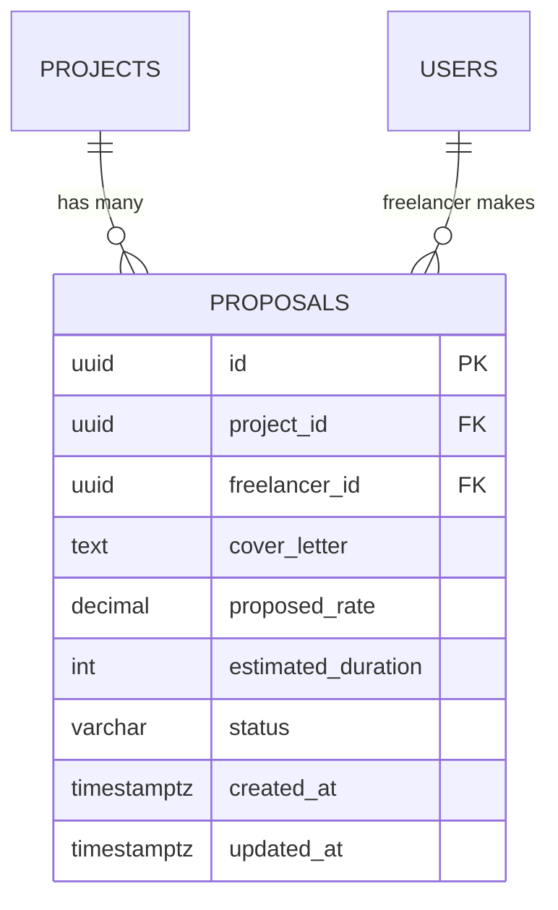
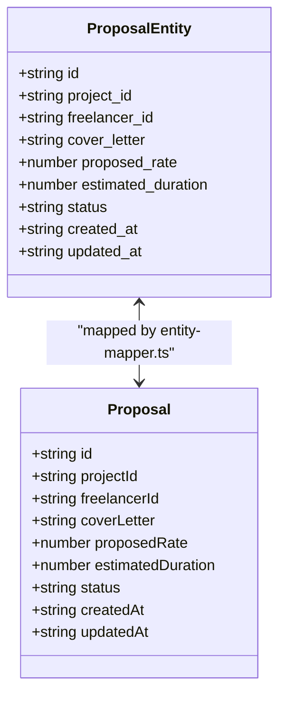
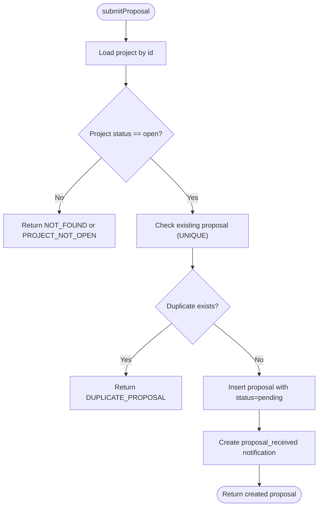
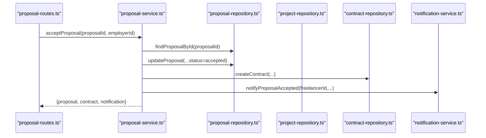
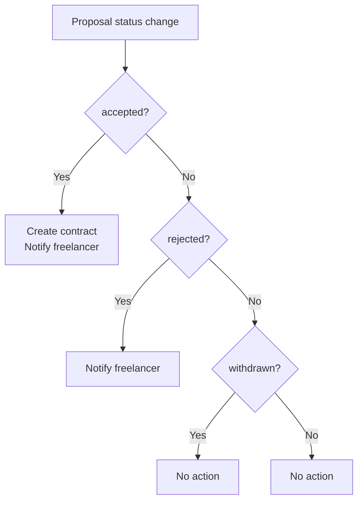
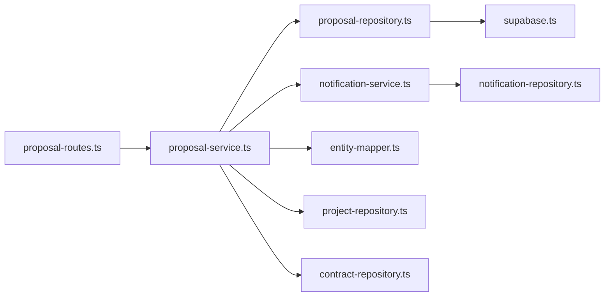

# Proposals Table

<cite>
**Referenced Files in This Document**
- [schema.sql](file://supabase/schema.sql)
- [supabase.ts](file://src/config/supabase.ts)
- [proposal-repository.ts](file://src/repositories/proposal-repository.ts)
- [proposal-service.ts](file://src/services/proposal-service.ts)
- [proposal-routes.ts](file://src/routes/proposal-routes.ts)
- [entity-mapper.ts](file://src/utils/entity-mapper.ts)
- [notification-service.ts](file://src/services/notification-service.ts)
- [notification-repository.ts](file://src/repositories/notification-repository.ts)
</cite>

## Table of Contents
1. [Introduction](#introduction)
2. [Project Structure](#project-structure)
3. [Core Components](#core-components)
4. [Architecture Overview](#architecture-overview)
5. [Detailed Component Analysis](#detailed-component-analysis)
6. [Dependency Analysis](#dependency-analysis)
7. [Performance Considerations](#performance-considerations)
8. [Troubleshooting Guide](#troubleshooting-guide)
9. [Conclusion](#conclusion)

## Introduction
This document provides comprehensive data model documentation for the proposals table in the FreelanceXchain Supabase PostgreSQL database. It explains each column, the table’s role as the bidding mechanism for freelancers to express interest in projects, and how proposal status changes drive downstream workflows such as notifications and contract creation. It also references the TABLES.PROPOSALS constant, indexes for performance, and RLS policies that govern visibility.

## Project Structure
The proposals table is defined in the Supabase schema and is consumed by the application through typed repositories, services, and routes. The TABLES.PROPOSALS constant centralizes table naming across the codebase.

**Diagram sources**
- [schema.sql](file://supabase/schema.sql#L80-L92)
- [supabase.ts](file://src/config/supabase.ts#L6-L21)
- [proposal-repository.ts](file://src/repositories/proposal-repository.ts#L18-L21)
- [proposal-service.ts](file://src/services/proposal-service.ts#L1-L20)
- [proposal-routes.ts](file://src/routes/proposal-routes.ts#L1-L20)
- [entity-mapper.ts](file://src/utils/entity-mapper.ts#L252-L279)

**Section sources**
- [schema.sql](file://supabase/schema.sql#L80-L92)
- [supabase.ts](file://src/config/supabase.ts#L6-L21)

## Core Components
- Table definition and constraints
  - id: UUID primary key with default generated by the database
  - project_id: UUID foreign key referencing projects(id) with cascade delete
  - freelancer_id: UUID foreign key referencing users(id) with cascade delete
  - cover_letter: text
  - proposed_rate: numeric with two decimal places
  - estimated_duration: integer representing days
  - status: varchar with a CHECK constraint limiting values to pending, accepted, rejected, withdrawn
  - UNIQUE(project_id, freelancer_id) prevents duplicate proposals per project per freelancer
  - created_at and updated_at timestamps with default NOW()

- Indexes for performance
  - idx_proposals_project_id on proposals(project_id)
  - idx_proposals_freelancer_id on proposals(freelancer_id)

- RLS policies
  - RLS enabled on proposals
  - Service role policy grants full access for backend operations

- Application-side constants and usage
  - TABLES.PROPOSALS constant used by repositories to target the proposals table

**Section sources**
- [schema.sql](file://supabase/schema.sql#L80-L92)
- [schema.sql](file://supabase/schema.sql#L202-L224)
- [schema.sql](file://supabase/schema.sql#L225-L261)
- [supabase.ts](file://src/config/supabase.ts#L6-L21)
- [proposal-repository.ts](file://src/repositories/proposal-repository.ts#L18-L21)

## Architecture Overview
The proposals table underpins the bidding workflow. Freelancers submit proposals, employers review and decide, and accepted proposals initiate contract creation and blockchain agreement signing. Notifications are generated for both parties upon submission and status changes.

**Diagram sources**
- [proposal-routes.ts](file://src/routes/proposal-routes.ts#L97-L153)
- [proposal-service.ts](file://src/services/proposal-service.ts#L64-L126)
- [proposal-service.ts](file://src/services/proposal-service.ts#L174-L296)
- [proposal-repository.ts](file://src/repositories/proposal-repository.ts#L23-L40)
- [notification-service.ts](file://src/services/notification-service.ts#L164-L209)
- [entity-mapper.ts](file://src/utils/entity-mapper.ts#L252-L279)

## Detailed Component Analysis

### Data Model Definition
- Purpose: The proposals table records bids from freelancers for specific projects. It captures the freelancer’s offer (rate and duration), a cover letter, and the current status of the bid.
- Constraints:
  - Status is constrained to pending, accepted, rejected, withdrawn
  - UNIQUE(project_id, freelancer_id) ensures a freelancer can only submit one proposal per project
- Foreign keys:
  - project_id links to projects
  - freelancer_id links to users (via the freelancer profile relationship)

**Diagram sources**
- [schema.sql](file://supabase/schema.sql#L80-L92)

**Section sources**
- [schema.sql](file://supabase/schema.sql#L80-L92)

### Application Model Mapping
- The Proposal entity in the application mirrors the database schema with camelCase fields for API consumption.
- The entity mapper converts between database snake_case and application camelCase.

**Diagram sources**
- [proposal-repository.ts](file://src/repositories/proposal-repository.ts#L6-L16)
- [entity-mapper.ts](file://src/utils/entity-mapper.ts#L252-L279)

**Section sources**
- [proposal-repository.ts](file://src/repositories/proposal-repository.ts#L6-L16)
- [entity-mapper.ts](file://src/utils/entity-mapper.ts#L252-L279)

### Repository and Service Integration
- Repository
  - Uses TABLES.PROPOSALS to target the proposals table
  - Provides CRUD and query helpers for proposals
  - Enforces uniqueness via getExistingProposal and UNIQUE constraint
- Service
  - Orchestrates proposal lifecycle: submit, accept, reject, withdraw
  - Generates notifications for relevant parties
  - Creates contracts and updates project status on acceptance

**Diagram sources**
- [proposal-service.ts](file://src/services/proposal-service.ts#L64-L126)
- [proposal-repository.ts](file://src/repositories/proposal-repository.ts#L95-L109)

**Section sources**
- [proposal-repository.ts](file://src/repositories/proposal-repository.ts#L18-L21)
- [proposal-service.ts](file://src/services/proposal-service.ts#L64-L126)

### Contract Creation Workflow Triggered by Status Change
- Accepting a proposal triggers:
  - Update proposal status to accepted
  - Create a contract record linking the project, proposal, and parties
  - Attempt to create and sign a blockchain agreement
  - Update project status to in_progress
  - Send a proposal_accepted notification to the freelancer

**Diagram sources**
- [proposal-routes.ts](file://src/routes/proposal-routes.ts#L293-L326)
- [proposal-service.ts](file://src/services/proposal-service.ts#L174-L296)
- [notification-service.ts](file://src/services/notification-service.ts#L180-L194)

**Section sources**
- [proposal-service.ts](file://src/services/proposal-service.ts#L174-L296)
- [proposal-routes.ts](file://src/routes/proposal-routes.ts#L293-L326)

### Notifications and RLS Policies
- Notifications
  - On submit: proposal_received notification sent to the project employer
  - On accept: proposal_accepted notification sent to the freelancer
  - On reject: proposal_rejected notification sent to the freelancer
- RLS
  - proposals table has RLS enabled
  - Service role policy grants full access for backend operations

**Diagram sources**
- [proposal-service.ts](file://src/services/proposal-service.ts#L299-L371)
- [proposal-service.ts](file://src/services/proposal-service.ts#L372-L414)
- [notification-service.ts](file://src/services/notification-service.ts#L164-L209)
- [schema.sql](file://supabase/schema.sql#L225-L261)

**Section sources**
- [proposal-service.ts](file://src/services/proposal-service.ts#L299-L371)
- [proposal-service.ts](file://src/services/proposal-service.ts#L372-L414)
- [notification-service.ts](file://src/services/notification-service.ts#L164-L209)
- [schema.sql](file://supabase/schema.sql#L225-L261)

## Dependency Analysis
- Internal dependencies
  - proposal-repository depends on TABLES.PROPOSALS
  - proposal-service depends on proposal-repository, project-repository, contract-repository, notification-service, and entity-mapper
  - proposal-routes depend on proposal-service and auth middleware
  - notification-service depends on notification-repository

**Diagram sources**
- [proposal-routes.ts](file://src/routes/proposal-routes.ts#L1-L20)
- [proposal-service.ts](file://src/services/proposal-service.ts#L1-L20)
- [proposal-repository.ts](file://src/repositories/proposal-repository.ts#L18-L21)
- [supabase.ts](file://src/config/supabase.ts#L6-L21)
- [entity-mapper.ts](file://src/utils/entity-mapper.ts#L252-L279)
- [notification-service.ts](file://src/services/notification-service.ts#L1-L20)
- [notification-repository.ts](file://src/repositories/notification-repository.ts#L1-L20)

**Section sources**
- [proposal-routes.ts](file://src/routes/proposal-routes.ts#L1-L20)
- [proposal-service.ts](file://src/services/proposal-service.ts#L1-L20)
- [proposal-repository.ts](file://src/repositories/proposal-repository.ts#L18-L21)
- [supabase.ts](file://src/config/supabase.ts#L6-L21)
- [entity-mapper.ts](file://src/utils/entity-mapper.ts#L252-L279)
- [notification-service.ts](file://src/services/notification-service.ts#L1-L20)
- [notification-repository.ts](file://src/repositories/notification-repository.ts#L1-L20)

## Performance Considerations
- Indexes
  - idx_proposals_project_id accelerates fetching proposals by project
  - idx_proposals_freelancer_id accelerates fetching proposals by freelancer
- Query patterns
  - getProposalsByProject orders by created_at descending and paginates
  - getProposalsByFreelancer orders by created_at descending
- Unique constraint
  - UNIQUE(project_id, freelancer_id) prevents duplicates and supports fast duplicate checks

**Section sources**
- [schema.sql](file://supabase/schema.sql#L202-L224)
- [proposal-repository.ts](file://src/repositories/proposal-repository.ts#L39-L70)
- [proposal-repository.ts](file://src/repositories/proposal-repository.ts#L95-L109)

## Troubleshooting Guide
- Duplicate proposal error
  - Cause: UNIQUE(project_id, freelancer_id) violation
  - Symptom: submitProposal returns DUPLICATE_PROPOSAL
  - Resolution: Ensure the freelancer has not already submitted a proposal for the project
- Proposal not found
  - Cause: Invalid proposalId or missing record
  - Symptom: getProposalById or accept/reject/withdraw returns NOT_FOUND
  - Resolution: Verify proposalId and that the proposal exists
- Invalid status transitions
  - Cause: Attempting to accept/reject/withdraw a non-pending proposal
  - Symptom: INVALID_STATUS error
  - Resolution: Only pending proposals can be accepted/rejected/withdrawn
- Unauthorized actions
  - Cause: Non-employer attempting to accept/reject, or non-freelancer withdrawing
  - Symptom: UNAUTHORIZED error
  - Resolution: Ensure correct role and ownership
- Notification delivery
  - Cause: Notifications not visible to the intended user
  - Symptom: Missing notifications
  - Resolution: Confirm RLS policies and user_id filtering

**Section sources**
- [proposal-service.ts](file://src/services/proposal-service.ts#L64-L126)
- [proposal-service.ts](file://src/services/proposal-service.ts#L174-L296)
- [proposal-service.ts](file://src/services/proposal-service.ts#L299-L371)
- [proposal-service.ts](file://src/services/proposal-service.ts#L372-L414)
- [proposal-routes.ts](file://src/routes/proposal-routes.ts#L97-L153)
- [proposal-routes.ts](file://src/routes/proposal-routes.ts#L293-L326)
- [proposal-routes.ts](file://src/routes/proposal-routes.ts#L330-L390)
- [proposal-routes.ts](file://src/routes/proposal-routes.ts#L393-L455)

## Conclusion
The proposals table is central to the FreelanceXchain bidding and contract creation workflow. Its design enforces business rules (status constraints, uniqueness), supports efficient queries via indexes, and integrates tightly with services that handle notifications and contract generation. The TABLES.PROPOSALS constant and RLS policies ensure consistent access patterns and security across the application.