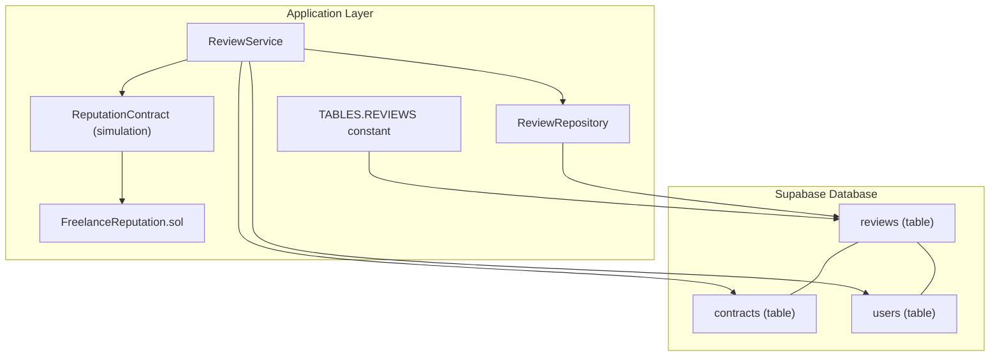
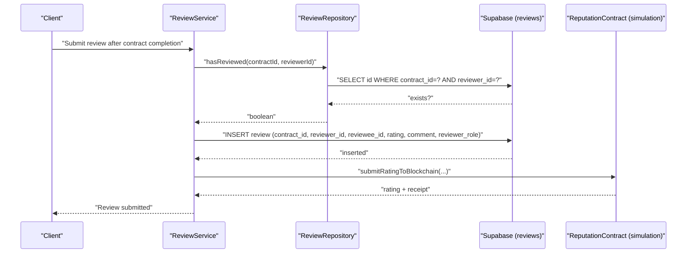
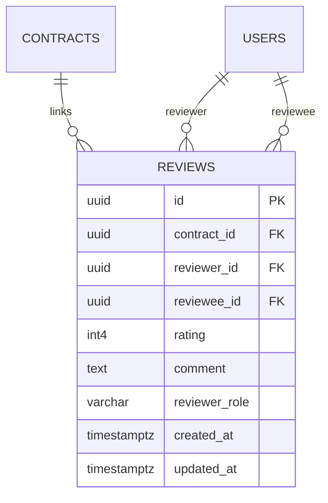
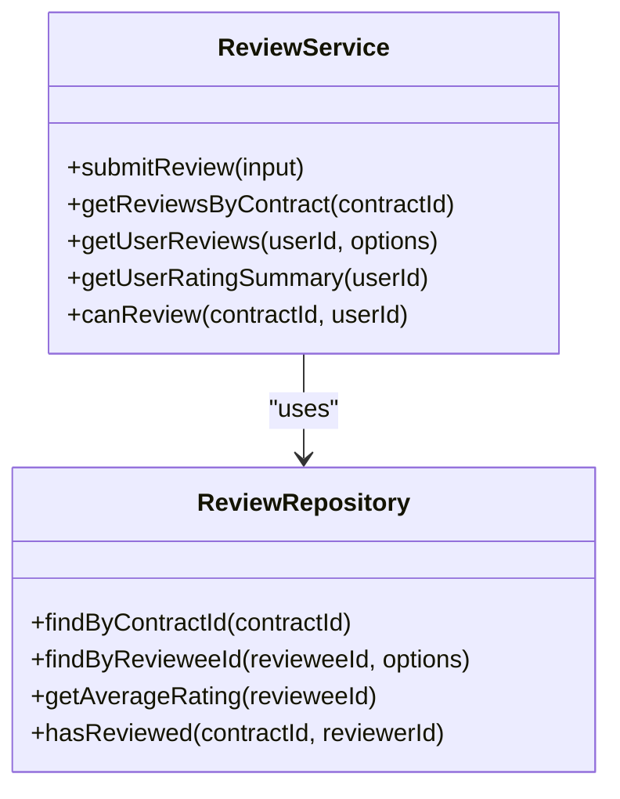
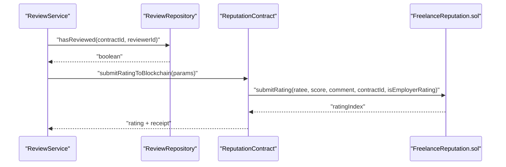
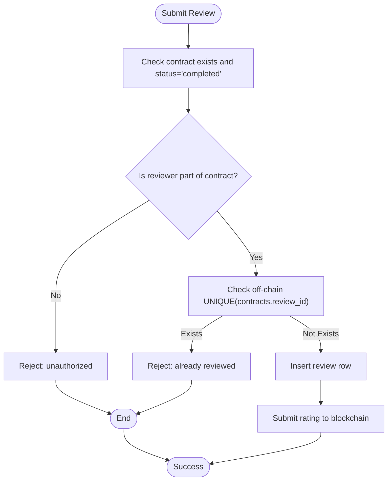
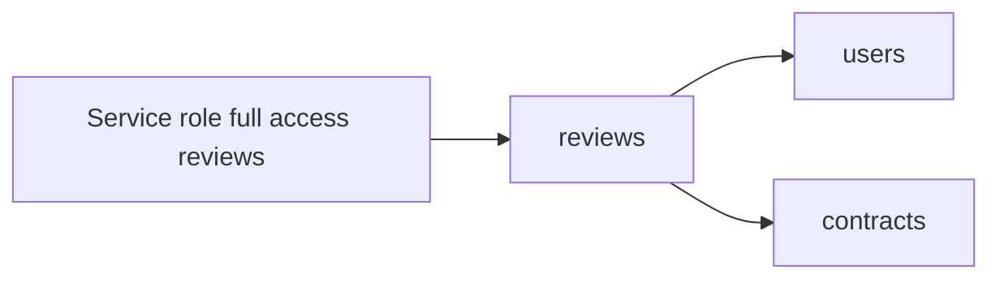
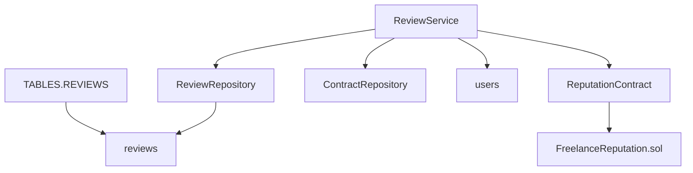

# Reviews Table

<cite>
**Referenced Files in This Document**
- [schema.sql](file://supabase/schema.sql)
- [supabase.ts](file://src/config/supabase.ts)
- [review-repository.ts](file://src/repositories/review-repository.ts)
- [review-service.ts](file://src/services/review-service.ts)
- [reputation-contract.ts](file://src/services/reputation-contract.ts)
- [FreelanceReputation.sol](file://contracts/FreelanceReputation.sol)
- [contract-repository.ts](file://src/repositories/contract-repository.ts)
- [entity-mapper.ts](file://src/utils/entity-mapper.ts)
</cite>

## Table of Contents
1. [Introduction](#introduction)
2. [Project Structure](#project-structure)
3. [Core Components](#core-components)
4. [Architecture Overview](#architecture-overview)
5. [Detailed Component Analysis](#detailed-component-analysis)
6. [Dependency Analysis](#dependency-analysis)
7. [Performance Considerations](#performance-considerations)
8. [Troubleshooting Guide](#troubleshooting-guide)
9. [Conclusion](#conclusion)

## Introduction
This document provides comprehensive data model documentation for the reviews table in the FreelanceXchain Supabase PostgreSQL database. It explains the structure, constraints, and relationships of the reviews table, and clarifies its role in the platform’s off-chain reputation data store. It also describes how the off-chain reviews integrate with the on-chain reputation system implemented in the FreelanceReputation.sol smart contract, including how submissions occur post-completion, how visibility is controlled via Row Level Security (RLS), and how indexes and unique constraints support performance and data integrity.

## Project Structure
The reviews table is defined in the Supabase schema and is referenced by the application through a centralized table constant. The off-chain repository and service layer provide CRUD operations and business logic around reviews, while the on-chain reputation system stores immutable records for scoring and transparency.

**Diagram sources**
- [schema.sql](file://supabase/schema.sql#L161-L173)
- [supabase.ts](file://src/config/supabase.ts#L6-L21)
- [review-repository.ts](file://src/repositories/review-repository.ts#L1-L20)
- [review-service.ts](file://src/services/review-service.ts#L1-L20)
- [reputation-contract.ts](file://src/services/reputation-contract.ts#L1-L40)
- [FreelanceReputation.sol](file://contracts/FreelanceReputation.sol#L1-L40)

**Section sources**
- [schema.sql](file://supabase/schema.sql#L161-L173)
- [supabase.ts](file://src/config/supabase.ts#L6-L21)

## Core Components
- Reviews table definition and constraints
- Indexes for performance
- RLS policies for visibility
- Off-chain repository/service for reviews
- On-chain reputation system integration

**Section sources**
- [schema.sql](file://supabase/schema.sql#L161-L173)
- [schema.sql](file://supabase/schema.sql#L202-L224)
- [schema.sql](file://supabase/schema.sql#L225-L261)
- [review-repository.ts](file://src/repositories/review-repository.ts#L1-L20)
- [review-service.ts](file://src/services/review-service.ts#L1-L20)
- [reputation-contract.ts](file://src/services/reputation-contract.ts#L1-L40)
- [FreelanceReputation.sol](file://contracts/FreelanceReputation.sol#L1-L40)

## Architecture Overview
The off-chain reviews table stores transient, mutable feedback entries linked to contracts and users. These entries are used to build user profiles and inform on-chain reputation submissions. The on-chain system ensures immutability and transparency of reputation records.

**Diagram sources**
- [review-service.ts](file://src/services/review-service.ts#L20-L65)
- [review-repository.ts](file://src/repositories/review-repository.ts#L69-L80)
- [reputation-contract.ts](file://src/services/reputation-contract.ts#L91-L149)

## Detailed Component Analysis

### Reviews Table Data Model
- Purpose: Off-chain data store for transient feedback entries associated with contracts and users.
- Columns:
  - id: UUID primary key
  - contract_id: UUID foreign key to contracts
  - reviewer_id: UUID foreign key to users
  - reviewee_id: UUID foreign key to users
  - rating: integer with CHECK constraint 1–5
  - comment: text (nullable)
  - reviewer_role: enum 'freelancer' or 'employer'
  - created_at: timestamptz (audit)
  - updated_at: timestamptz (audit)
- Unique constraint: Prevents duplicate reviews per contract and reviewer pair.
- Indexes: contract_id, reviewee_id.

**Diagram sources**
- [schema.sql](file://supabase/schema.sql#L161-L173)

**Section sources**
- [schema.sql](file://supabase/schema.sql#L161-L173)

### Off-chain Repository and Service
- Repository:
  - findByContractId: fetch reviews for a contract ordered by newest first.
  - findByRevieweeId: paginated fetch of reviews received by a user.
  - getAverageRating: computes average and count for a user.
  - hasReviewed: checks uniqueness constraint.
- Service:
  - submitReview: validates rating, contract status, participant roles, and uniqueness; determines reviewee and role; inserts review; notifies reviewee.
  - getReviewsByContract, getUserReviews, getUserRatingSummary, canReview.

**Diagram sources**
- [review-repository.ts](file://src/repositories/review-repository.ts#L1-L84)
- [review-service.ts](file://src/services/review-service.ts#L1-L107)

**Section sources**
- [review-repository.ts](file://src/repositories/review-repository.ts#L1-L84)
- [review-service.ts](file://src/services/review-service.ts#L1-L107)

### On-chain Reputation Integration
- Off-chain reviews are used to drive on-chain submissions via a simulated blockchain interface.
- The on-chain contract (FreelanceReputation.sol) stores immutable ratings with:
  - Struct fields for rater, ratee, score (1–5), comment, contractId, timestamp, and isEmployerRating.
  - Mapping to prevent duplicate ratings per contract.
  - Aggregates for totalScore and ratingCount.
- The off-chain service serializes and submits ratings to the blockchain, returning a transaction receipt.

**Diagram sources**
- [review-service.ts](file://src/services/review-service.ts#L20-L65)
- [reputation-contract.ts](file://src/services/reputation-contract.ts#L91-L149)
- [FreelanceReputation.sol](file://contracts/FreelanceReputation.sol#L64-L106)

**Section sources**
- [reputation-contract.ts](file://src/services/reputation-contract.ts#L1-L40)
- [FreelanceReputation.sol](file://contracts/FreelanceReputation.sol#L1-L40)

### Unique Constraint and Duplicate Prevention
- Off-chain: UNIQUE(contract_id, reviewer_id) prevents duplicate reviews per contract and reviewer.
- On-chain: Mapping keyed by rater+ratee+contractId prevents duplicate submissions.

**Diagram sources**
- [review-service.ts](file://src/services/review-service.ts#L20-L65)
- [schema.sql](file://supabase/schema.sql#L161-L173)
- [FreelanceReputation.sol](file://contracts/FreelanceReputation.sol#L76-L82)

**Section sources**
- [review-service.ts](file://src/services/review-service.ts#L20-L65)
- [schema.sql](file://supabase/schema.sql#L161-L173)
- [FreelanceReputation.sol](file://contracts/FreelanceReputation.sol#L76-L82)

### RLS Policies and Visibility
- All tables enable Row Level Security.
- Reviews table has RLS enabled and a service-role policy granting full access for backend operations.
- Visibility of reviews is governed by application-level logic and user permissions enforced by the API and repository/service layers.

**Diagram sources**
- [schema.sql](file://supabase/schema.sql#L225-L261)

**Section sources**
- [schema.sql](file://supabase/schema.sql#L225-L261)

### Audit Timestamps and Data Flow
- created_at and updated_at are managed by the database defaults and updated by triggers or application logic.
- The repository/service layer returns these timestamps to clients for display and sorting.

**Section sources**
- [schema.sql](file://supabase/schema.sql#L161-L173)
- [review-repository.ts](file://src/repositories/review-repository.ts#L1-L20)

## Dependency Analysis
- Reviews table depends on contracts and users via foreign keys.
- Application code references TABLES.REVIEWS for consistent table naming.
- ReviewService depends on ContractRepository to validate contract state and participants.
- Off-chain repository/service integrates with on-chain reputation interface.

**Diagram sources**
- [supabase.ts](file://src/config/supabase.ts#L6-L21)
- [review-repository.ts](file://src/repositories/review-repository.ts#L1-L20)
- [review-service.ts](file://src/services/review-service.ts#L1-L20)
- [contract-repository.ts](file://src/repositories/contract-repository.ts#L1-L20)
- [reputation-contract.ts](file://src/services/reputation-contract.ts#L1-L40)
- [FreelanceReputation.sol](file://contracts/FreelanceReputation.sol#L1-L40)

**Section sources**
- [supabase.ts](file://src/config/supabase.ts#L6-L21)
- [review-repository.ts](file://src/repositories/review-repository.ts#L1-L20)
- [review-service.ts](file://src/services/review-service.ts#L1-L20)
- [contract-repository.ts](file://src/repositories/contract-repository.ts#L1-L20)
- [reputation-contract.ts](file://src/services/reputation-contract.ts#L1-L40)
- [FreelanceReputation.sol](file://contracts/FreelanceReputation.sol#L1-L40)

## Performance Considerations
- Indexes:
  - idx_reviews_contract_id: speeds up fetching reviews by contract.
  - idx_reviews_reviewee_id: speeds up fetching received reviews for user profiles.
- Pagination:
  - Repository supports pagination for user reviews to avoid large result sets.
- Average rating computation:
  - Repository aggregates ratings client-side; consider caching or materialized views for high-volume scenarios.

**Section sources**
- [schema.sql](file://supabase/schema.sql#L202-L224)
- [review-repository.ts](file://src/repositories/review-repository.ts#L32-L51)

## Troubleshooting Guide
- Validation errors:
  - Rating out of range (1–5) or invalid contract state/status.
- Authorization issues:
  - Non-participant attempting to submit review.
- Duplicate review attempts:
  - Off-chain UNIQUE constraint and on-chain mapping prevent duplicates.
- Database connectivity:
  - Ensure Supabase client initialization succeeds and TABLES constants are present.

**Section sources**
- [review-service.ts](file://src/services/review-service.ts#L20-L65)
- [schema.sql](file://supabase/schema.sql#L161-L173)
- [FreelanceReputation.sol](file://contracts/FreelanceReputation.sol#L76-L82)
- [supabase.ts](file://src/config/supabase.ts#L1-L21)

## Conclusion
The reviews table serves as the off-chain foundation for the platform’s reputation system. It captures transient feedback with strong constraints and indexes to ensure data integrity and performance. Together with the on-chain FreelanceReputation.sol contract, it enables transparent, immutable reputation records that reflect real-world interactions. Off-chain operations manage submission workflows, visibility, and user profile displays, while on-chain logic guarantees immutability and trust.