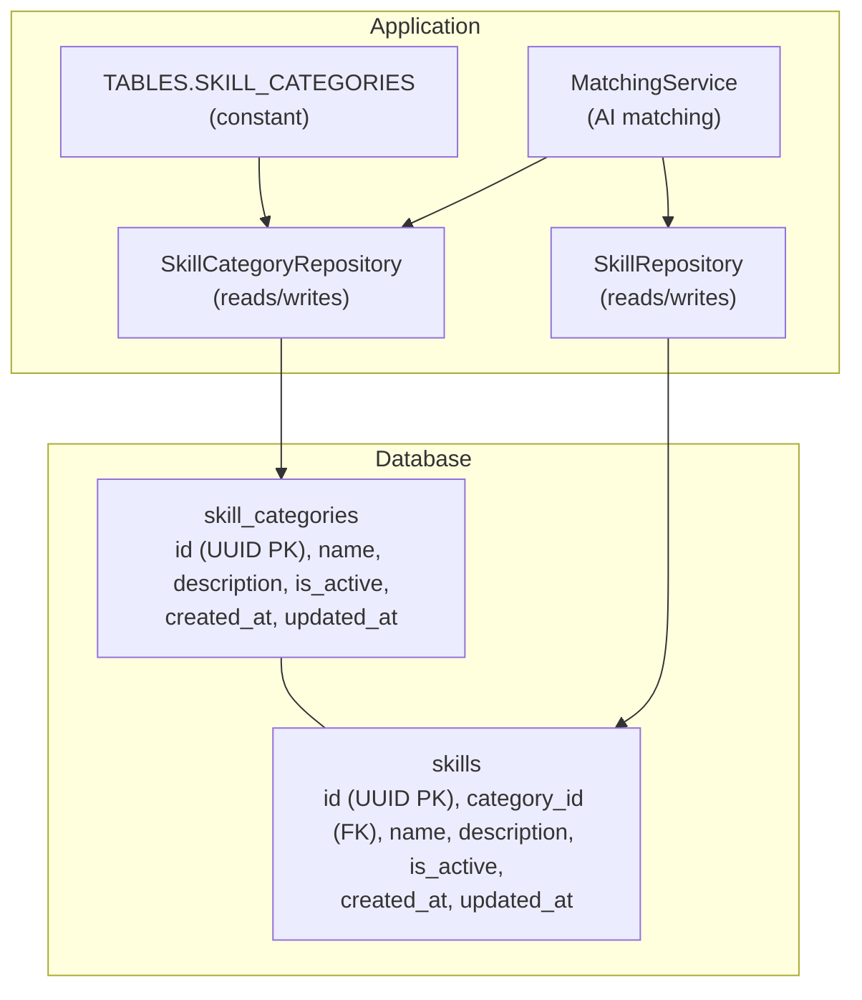
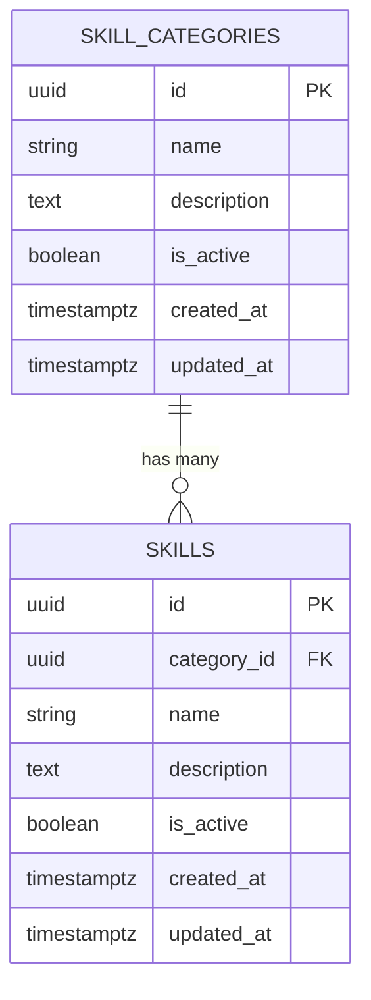
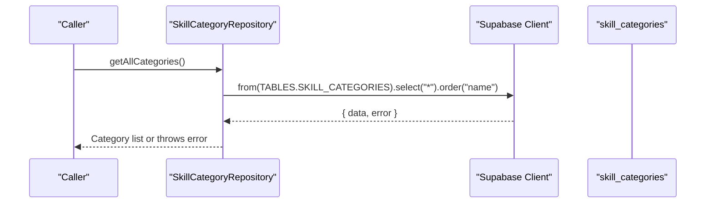
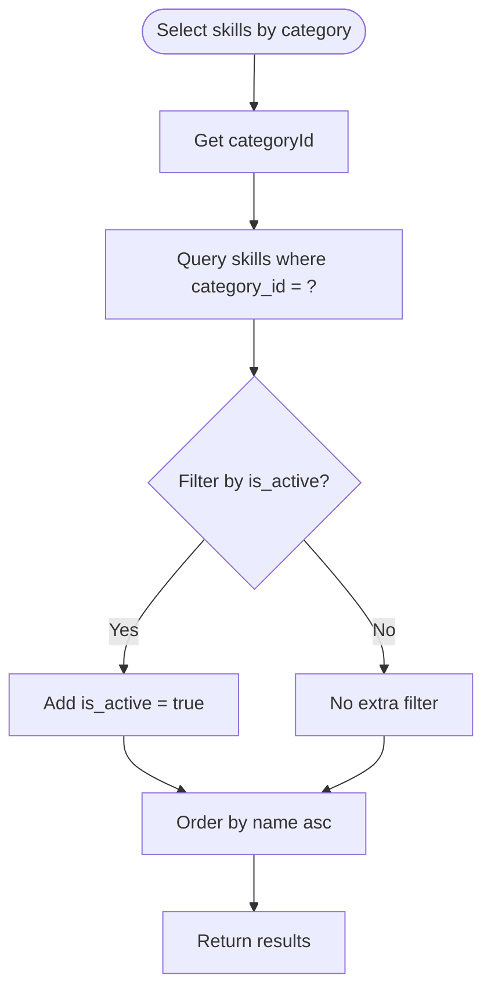
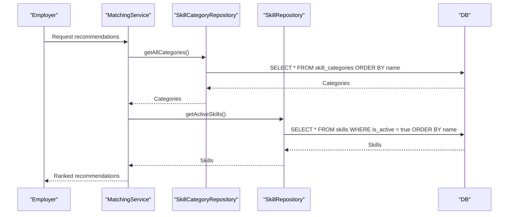
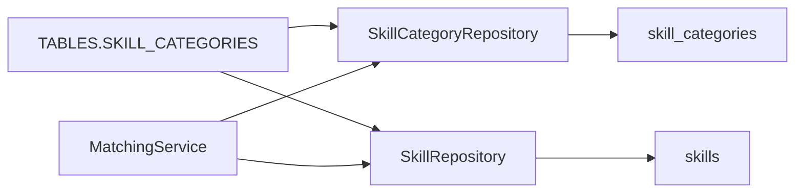

# Skill Categories Table

<cite>
**Referenced Files in This Document**
- [schema.sql](file://supabase/schema.sql)
- [seed-skills.sql](file://supabase/seed-skills.sql)
- [supabase.ts](file://src/config/supabase.ts)
- [skill-category-repository.ts](file://src/repositories/skill-category-repository.ts)
- [skill-repository.ts](file://src/repositories/skill-repository.ts)
- [matching-service.ts](file://src/services/matching-service.ts)
</cite>

## Table of Contents
1. [Introduction](#introduction)
2. [Project Structure](#project-structure)
3. [Core Components](#core-components)
4. [Architecture Overview](#architecture-overview)
5. [Detailed Component Analysis](#detailed-component-analysis)
6. [Dependency Analysis](#dependency-analysis)
7. [Performance Considerations](#performance-considerations)
8. [Troubleshooting Guide](#troubleshooting-guide)
9. [Conclusion](#conclusion)

## Introduction
This document provides comprehensive data model documentation for the skill_categories table in the FreelanceXchain Supabase PostgreSQL database. It explains the table’s structure, purpose as a hierarchical classification system for skills, and its one-to-many relationship with the skills table. It also covers programmatic access via the TABLES.SKILL_CATEGORIES constant, indexing strategy, and Row Level Security (RLS) policy enabling public read access. Finally, it demonstrates how skill categories support organized browsing and filtering within the AI-powered matching system.

## Project Structure
The skill_categories table is part of the core schema and is closely integrated with related repositories and services:
- Database schema defines the table and its constraints.
- Seed script initializes predefined categories and skills.
- Application code accesses the table through a typed repository and the TABLES constant.
- Matching service uses categories and skills to power AI-driven recommendations.

**Diagram sources**
- [schema.sql](file://supabase/schema.sql#L19-L38)
- [seed-skills.sql](file://supabase/seed-skills.sql#L1-L20)
- [supabase.ts](file://src/config/supabase.ts#L6-L21)
- [skill-category-repository.ts](file://src/repositories/skill-category-repository.ts#L1-L74)
- [skill-repository.ts](file://src/repositories/skill-repository.ts#L1-L127)
- [matching-service.ts](file://src/services/matching-service.ts#L1-L120)

**Section sources**
- [schema.sql](file://supabase/schema.sql#L19-L38)
- [seed-skills.sql](file://supabase/seed-skills.sql#L1-L20)
- [supabase.ts](file://src/config/supabase.ts#L6-L21)

## Core Components
- skill_categories table
  - Purpose: Hierarchical classification system for skills.
  - Columns:
    - id: UUID primary key with generated default.
    - name: Non-null text label for the category.
    - description: Optional text describing the category.
    - is_active: Boolean flag controlling visibility and inclusion in public views.
    - created_at, updated_at: Audit timestamps managed by defaults.
- skills table
  - Purpose: Stores individual skills linked to a category.
  - Foreign key: category_id references skill_categories(id) with cascade delete.
- Programmatic access
  - TABLES.SKILL_CATEGORIES constant provides a centralized table name reference.
  - SkillCategoryRepository offers CRUD operations and filtered queries.

**Section sources**
- [schema.sql](file://supabase/schema.sql#L19-L38)
- [supabase.ts](file://src/config/supabase.ts#L6-L21)
- [skill-category-repository.ts](file://src/repositories/skill-category-repository.ts#L1-L74)

## Architecture Overview
The skill taxonomy is a foundational data model enabling:
- Organized browsing and filtering of skills by category.
- Efficient joins between categories and skills for reporting and matching.
- Public read access via RLS for discovery and transparency.

**Diagram sources**
- [schema.sql](file://supabase/schema.sql#L19-L38)

## Detailed Component Analysis

### skill_categories table definition and constraints
- Primary key: id UUID with generated default.
- Not-null constraint: name.
- Flags: is_active defaults to true.
- Audit fields: created_at and updated_at defaults to current timestamp.
- Relationship: skills.category_id references skill_categories.id with ON DELETE CASCADE.

These constraints ensure consistent categorization, discoverability, and referential integrity.

**Section sources**
- [schema.sql](file://supabase/schema.sql#L19-L38)

### Programmatic access via TABLES.SKILL_CATEGORIES
- The TABLES constant exposes SKILL_CATEGORIES as a string literal, enabling:
  - Centralized table naming across repositories and services.
  - Type-safe usage in Supabase client calls.
- SkillCategoryRepository constructs its base class with TABLES.SKILL_CATEGORIES, ensuring consistent table targeting.

**Diagram sources**
- [supabase.ts](file://src/config/supabase.ts#L6-L21)
- [skill-category-repository.ts](file://src/repositories/skill-category-repository.ts#L34-L43)

**Section sources**
- [supabase.ts](file://src/config/supabase.ts#L6-L21)
- [skill-category-repository.ts](file://src/repositories/skill-category-repository.ts#L1-L20)
- [skill-category-repository.ts](file://src/repositories/skill-category-repository.ts#L34-L43)

### One-to-many relationship with skills
- skill_categories.id is the parent; skills.category_id is the child foreign key.
- Cascade delete ensures removing a category also removes its skills.
- Filtering by category_id enables:
  - Listing all skills in a category.
  - Restricting to active skills only.
  - Building hierarchical taxonomy views.

**Diagram sources**
- [schema.sql](file://supabase/schema.sql#L29-L38)
- [skill-repository.ts](file://src/repositories/skill-repository.ts#L71-L94)

**Section sources**
- [schema.sql](file://supabase/schema.sql#L29-L38)
- [skill-repository.ts](file://src/repositories/skill-repository.ts#L71-L94)

### Indexing strategy
- The schema creates an index on skills(category_id) to optimize category-based queries.
- No dedicated index is needed for skill_categories because:
  - The table is small and frequently accessed via public read policy.
  - The primary access patterns involve listing categories or filtering by is_active, which are lightweight operations.
  - Adding an index would increase write overhead without significant read benefit.

**Section sources**
- [schema.sql](file://supabase/schema.sql#L202-L224)
- [schema.sql](file://supabase/schema.sql#L242-L243)

### Row Level Security (RLS) policy
- skill_categories has a public read policy that allows SELECT for everyone.
- Service role policies grant full access for backend operations.
- This enables:
  - Transparent browsing of categories for anonymous users.
  - Controlled administrative updates via service role.

**Section sources**
- [schema.sql](file://supabase/schema.sql#L242-L243)
- [schema.sql](file://supabase/schema.sql#L247-L257)

### Example use cases in AI-powered matching
- Organized browsing and filtering:
  - Employers can browse categories to select relevant skills for project requirements.
  - Freelancers can filter by category to refine their profiles and discover opportunities.
- Matching pipeline:
  - MatchingService retrieves active skills and project requirements to compute match scores.
  - SkillCategoryRepository and SkillRepository provide category and skill data used by the matching engine.

**Diagram sources**
- [matching-service.ts](file://src/services/matching-service.ts#L1-L120)
- [skill-category-repository.ts](file://src/repositories/skill-category-repository.ts#L34-L43)
- [skill-repository.ts](file://src/repositories/skill-repository.ts#L48-L69)

**Section sources**
- [matching-service.ts](file://src/services/matching-service.ts#L1-L120)
- [skill-category-repository.ts](file://src/repositories/skill-category-repository.ts#L34-L43)
- [skill-repository.ts](file://src/repositories/skill-repository.ts#L48-L69)

## Dependency Analysis
- skill_categories depends on:
  - Supabase client configured via TABLES constant.
  - SkillCategoryRepository for CRUD operations.
- skills depends on:
  - skill_categories.id via category_id foreign key.
  - SkillRepository for category-scoped queries.
- MatchingService depends on:
  - SkillCategoryRepository for category metadata.
  - SkillRepository for skill taxonomy and active skill lists.

**Diagram sources**
- [supabase.ts](file://src/config/supabase.ts#L6-L21)
- [skill-category-repository.ts](file://src/repositories/skill-category-repository.ts#L1-L20)
- [skill-repository.ts](file://src/repositories/skill-repository.ts#L1-L27)
- [matching-service.ts](file://src/services/matching-service.ts#L1-L120)

**Section sources**
- [supabase.ts](file://src/config/supabase.ts#L6-L21)
- [skill-category-repository.ts](file://src/repositories/skill-category-repository.ts#L1-L20)
- [skill-repository.ts](file://src/repositories/skill-repository.ts#L1-L27)
- [matching-service.ts](file://src/services/matching-service.ts#L1-L120)

## Performance Considerations
- Indexing:
  - skills(category_id) is indexed to accelerate category-based queries.
  - No separate index on skill_categories is required due to small size and low cardinality.
- RLS overhead:
  - Public read policy adds minimal overhead while enabling transparent access.
- Query patterns:
  - Prefer filtering by is_active to reduce noise in matching and browsing.
  - Use ordered queries by name for consistent UI rendering.

[No sources needed since this section provides general guidance]

## Troubleshooting Guide
- Public read access issues:
  - If clients cannot read categories, verify the public SELECT policy is enabled.
- Repository errors:
  - SkillCategoryRepository and SkillRepository throw descriptive errors on query failures; inspect error codes and messages to diagnose issues.
- Data seeding:
  - Confirm seed script inserted categories and skills; verify counts and names.

**Section sources**
- [schema.sql](file://supabase/schema.sql#L242-L243)
- [skill-category-repository.ts](file://src/repositories/skill-category-repository.ts#L41-L43)
- [skill-repository.ts](file://src/repositories/skill-repository.ts#L55-L57)
- [seed-skills.sql](file://supabase/seed-skills.sql#L1-L20)

## Conclusion
The skill_categories table serves as the backbone of the skill taxonomy, enabling structured browsing, filtering, and AI-driven matching. Its design emphasizes simplicity, strong constraints, and efficient access patterns. With public read RLS and targeted indexing, it balances transparency and performance. Programmatic access through TABLES.SKILL_CATEGORIES and SkillCategoryRepository ensures consistent, maintainable usage across the application.