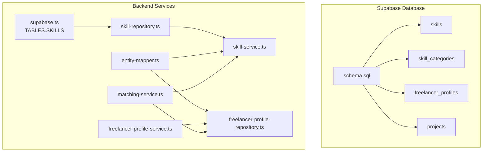
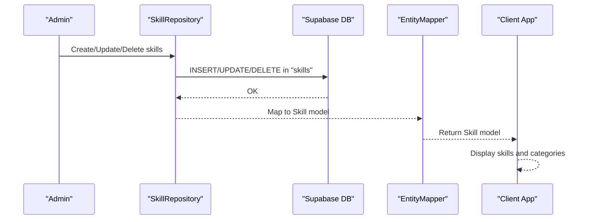
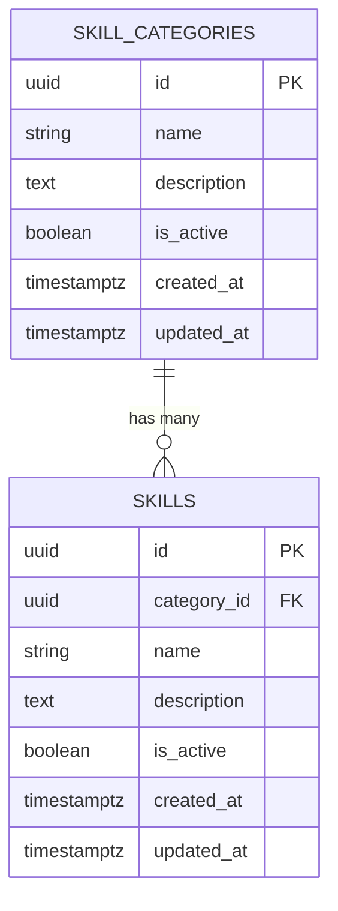
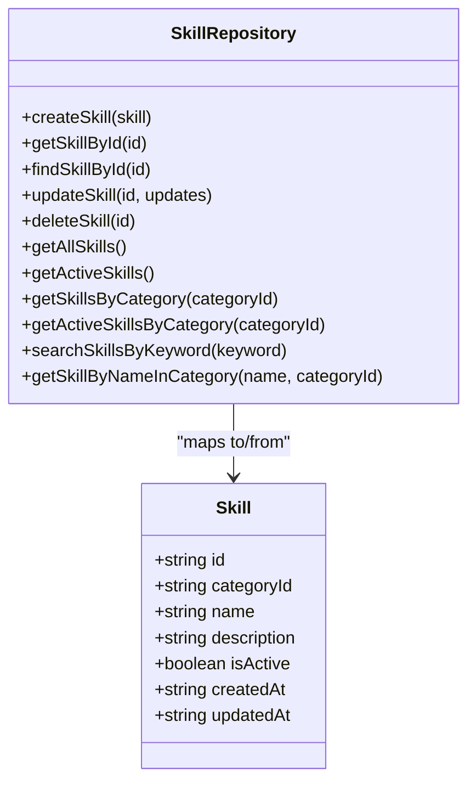
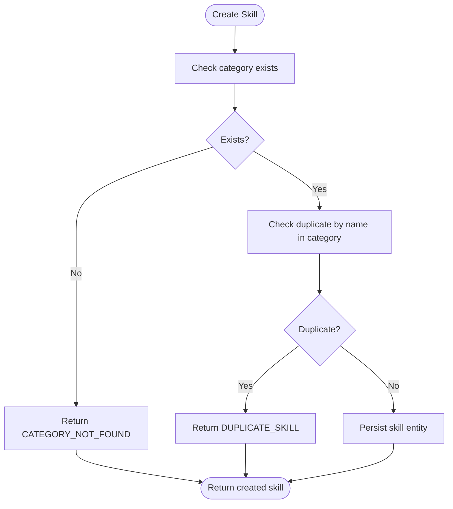
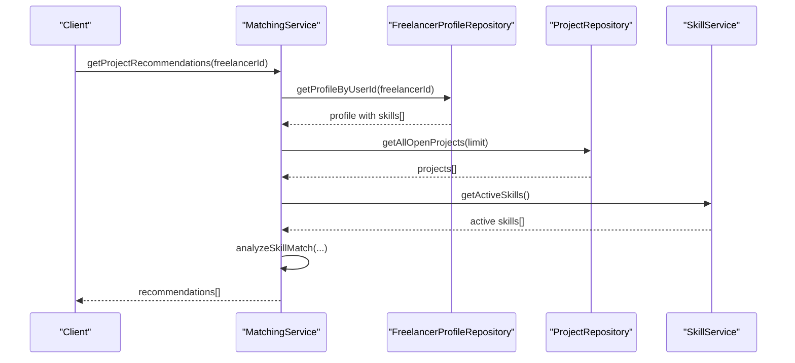
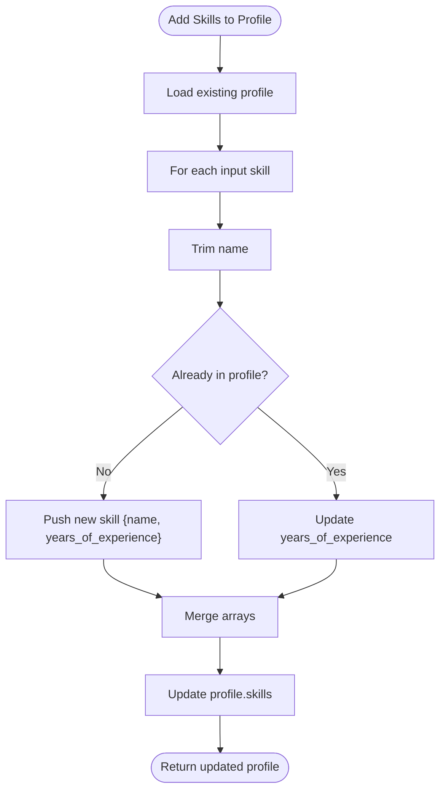
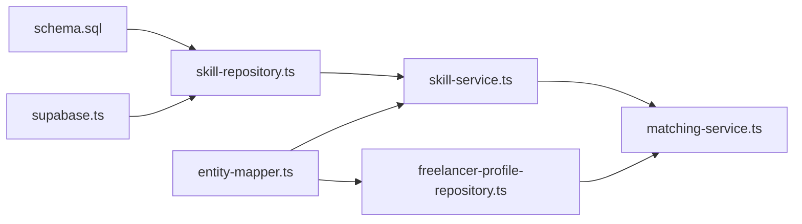

# Skills Table

<cite>
**Referenced Files in This Document**
- [schema.sql](file://supabase/schema.sql)
- [seed-skills.sql](file://supabase/seed-skills.sql)
- [supabase.ts](file://src/config/supabase.ts)
- [skill-repository.ts](file://src/repositories/skill-repository.ts)
- [skill-service.ts](file://src/services/skill-service.ts)
- [entity-mapper.ts](file://src/utils/entity-mapper.ts)
- [freelancer-profile-repository.ts](file://src/repositories/freelancer-profile-repository.ts)
- [freelancer-profile-service.ts](file://src/services/freelancer-profile-service.ts)
- [matching-service.ts](file://src/services/matching-service.ts)
</cite>

## Table of Contents
1. [Introduction](#introduction)
2. [Project Structure](#project-structure)
3. [Core Components](#core-components)
4. [Architecture Overview](#architecture-overview)
5. [Detailed Component Analysis](#detailed-component-analysis)
6. [Dependency Analysis](#dependency-analysis)
7. [Performance Considerations](#performance-considerations)
8. [Troubleshooting Guide](#troubleshooting-guide)
9. [Conclusion](#conclusion)

## Introduction
This document provides comprehensive data model documentation for the skills table in the FreelanceXchain Supabase PostgreSQL database. It explains the table’s schema, relationships, and behavior, and demonstrates how it underpins the platform’s AI-powered matching system. The skills table serves as the atomic unit of expertise tracking for freelancers, enabling precise skill-based recommendations and search. It is referenced by the TABLES.SKILLS constant, supported by the idx_skills_category_id index, and governed by Row Level Security (RLS) policies that permit public read access to support discovery and search.

## Project Structure
The skills table is defined in the Supabase schema and is used across the backend services and repositories. The following diagram shows how the skills table integrates with related tables and services.

**Diagram sources**
- [schema.sql](file://supabase/schema.sql#L29-L38)
- [supabase.ts](file://src/config/supabase.ts#L6-L21)
- [skill-repository.ts](file://src/repositories/skill-repository.ts#L1-L26)
- [skill-service.ts](file://src/services/skill-service.ts#L1-L25)
- [entity-mapper.ts](file://src/utils/entity-mapper.ts#L47-L88)
- [freelancer-profile-repository.ts](file://src/repositories/freelancer-profile-repository.ts#L1-L19)
- [freelancer-profile-service.ts](file://src/services/freelancer-profile-service.ts#L139-L189)
- [matching-service.ts](file://src/services/matching-service.ts#L1-L30)

**Section sources**
- [schema.sql](file://supabase/schema.sql#L29-L38)
- [supabase.ts](file://src/config/supabase.ts#L6-L21)

## Core Components
- skills table: Stores atomic skill definitions with foreign key to skill_categories, plus metadata and audit timestamps.
- skill_categories table: Hierarchical grouping of skills.
- freelancer_profiles.skills: JSONB array storing freelancers’ skills as simplified references (name and years of experience).
- projects.required_skills: JSONB array capturing project-required skills (supports both taxonomy-aware and free-text entries).
- TABLES.SKILLS constant: Centralized table name reference used by repositories.
- idx_skills_category_id index: Optimizes category-based queries.
- RLS policies: Allow public read access on skills and skill_categories to enable discovery and search.

**Section sources**
- [schema.sql](file://supabase/schema.sql#L29-L38)
- [schema.sql](file://supabase/schema.sql#L20-L27)
- [schema.sql](file://supabase/schema.sql#L41-L51)
- [schema.sql](file://supabase/schema.sql#L66-L78)
- [supabase.ts](file://src/config/supabase.ts#L6-L21)
- [schema.sql](file://supabase/schema.sql#L216-L216)
- [schema.sql](file://supabase/schema.sql#L242-L243)

## Architecture Overview
The skills table participates in two complementary workflows:
- Discovery and taxonomy maintenance: Administrators manage categories and skills; clients read them for selection and search.
- AI-powered matching: The matching service consumes active skills to compute match scores between freelancers and projects.

**Diagram sources**
- [skill-repository.ts](file://src/repositories/skill-repository.ts#L28-L46)
- [skill-service.ts](file://src/services/skill-service.ts#L104-L131)
- [entity-mapper.ts](file://src/utils/entity-mapper.ts#L78-L88)
- [schema.sql](file://supabase/schema.sql#L29-L38)

## Detailed Component Analysis

### Skills Table Schema
- id: UUID primary key, auto-generated.
- category_id: UUID foreign key referencing skill_categories(id), cascading delete ensures referential integrity.
- name: Non-null VARCHAR for the skill label.
- description: Optional TEXT for additional details.
- is_active: Boolean flag to mark skills as deprecated or inactive.
- created_at, updated_at: TIMESTAMPTZ audit timestamps.

These fields collectively define the atomic unit of expertise, enabling precise categorization and filtering.

**Section sources**
- [schema.sql](file://supabase/schema.sql#L29-L38)

### Relationship to Skill Categories
- skill_categories provides hierarchical grouping for skills.
- The skills table references skill_categories via category_id, establishing a parent-child relationship.

**Diagram sources**
- [schema.sql](file://supabase/schema.sql#L20-L27)
- [schema.sql](file://supabase/schema.sql#L29-L38)

**Section sources**
- [schema.sql](file://supabase/schema.sql#L20-L27)
- [schema.sql](file://supabase/schema.sql#L29-L38)

### Skill Model and Repository
- Skill model: camelCase representation of the entity with isActive and categoryId.
- SkillRepository: encapsulates CRUD and query operations against TABLES.SKILLS, ordering by name and filtering by is_active where applicable.

**Diagram sources**
- [entity-mapper.ts](file://src/utils/entity-mapper.ts#L57-L88)
- [skill-repository.ts](file://src/repositories/skill-repository.ts#L13-L21)
- [skill-repository.ts](file://src/repositories/skill-repository.ts#L28-L123)

**Section sources**
- [entity-mapper.ts](file://src/utils/entity-mapper.ts#L57-L88)
- [skill-repository.ts](file://src/repositories/skill-repository.ts#L28-L123)

### Skill Management Service
- SkillService orchestrates creation, updates, deprecation, and retrieval of skills while enforcing uniqueness within categories and validating category existence.

**Diagram sources**
- [skill-service.ts](file://src/services/skill-service.ts#L104-L131)
- [skill-repository.ts](file://src/repositories/skill-repository.ts#L109-L123)

**Section sources**
- [skill-service.ts](file://src/services/skill-service.ts#L104-L131)
- [skill-service.ts](file://src/services/skill-service.ts#L133-L190)

### Skill-Based Recommendations and Matching
- Active skills are used to power AI-driven matching between freelancers and projects.
- MatchingService converts freelancer profiles’ JSONB skills and project required skills into a unified SkillInfo structure for scoring.

**Diagram sources**
- [matching-service.ts](file://src/services/matching-service.ts#L77-L141)
- [matching-service.ts](file://src/services/matching-service.ts#L223-L269)
- [freelancer-profile-repository.ts](file://src/repositories/freelancer-profile-repository.ts#L29-L31)
- [skill-service.ts](file://src/services/skill-service.ts#L211-L219)

**Section sources**
- [matching-service.ts](file://src/services/matching-service.ts#L77-L141)
- [matching-service.ts](file://src/services/matching-service.ts#L223-L269)

### Freelancer Profiles: JSONB Skills Arrays
- freelancer_profiles.skills is a JSONB array of simplified skill references containing name and years_of_experience.
- The service adds or updates skills by name (case-insensitive) and persists them back to the profile.

**Diagram sources**
- [freelancer-profile-service.ts](file://src/services/freelancer-profile-service.ts#L139-L189)
- [freelancer-profile-repository.ts](file://src/repositories/freelancer-profile-repository.ts#L9-L14)

**Section sources**
- [freelancer-profile-service.ts](file://src/services/freelancer-profile-service.ts#L139-L189)
- [freelancer-profile-repository.ts](file://src/repositories/freelancer-profile-repository.ts#L9-L14)

### Projects: Required Skills JSONB
- projects.required_skills is a JSONB array that can store either taxonomy-aware entries (with skill_id and category_id) or free-text entries (skill_name).
- MatchingService converts these into SkillInfo for scoring.

**Section sources**
- [schema.sql](file://supabase/schema.sql#L66-L78)
- [entity-mapper.ts](file://src/utils/entity-mapper.ts#L112-L128)
- [matching-service.ts](file://src/services/matching-service.ts#L44-L71)

### TABLES.SKILLS Constant and Index
- TABLES.SKILLS centralizes the table name used by repositories.
- idx_skills_category_id optimizes queries filtering by category_id.

**Section sources**
- [supabase.ts](file://src/config/supabase.ts#L6-L21)
- [schema.sql](file://supabase/schema.sql#L216-L216)

### RLS Policy for Public Read Access
- RLS policies enable public SELECT on skills and skill_categories, which is essential for search and discovery without requiring authentication.
- Service role policies grant full access for backend operations.

**Section sources**
- [schema.sql](file://supabase/schema.sql#L242-L243)
- [schema.sql](file://supabase/schema.sql#L246-L261)

## Dependency Analysis
The skills table underpins several layers:
- Data definition: schema.sql defines the table and indexes.
- Access layer: skill-repository.ts uses TABLES.SKILLS to query and mutate skills.
- Domain layer: skill-service.ts enforces business rules and uniqueness.
- Presentation layer: entity-mapper.ts maps to Skill model for API responses.
- Matching layer: matching-service.ts consumes active skills to compute recommendations.

**Diagram sources**
- [schema.sql](file://supabase/schema.sql#L29-L38)
- [supabase.ts](file://src/config/supabase.ts#L6-L21)
- [skill-repository.ts](file://src/repositories/skill-repository.ts#L23-L26)
- [skill-service.ts](file://src/services/skill-service.ts#L104-L131)
- [entity-mapper.ts](file://src/utils/entity-mapper.ts#L78-L88)
- [matching-service.ts](file://src/services/matching-service.ts#L223-L269)
- [freelancer-profile-repository.ts](file://src/repositories/freelancer-profile-repository.ts#L1-L19)

**Section sources**
- [schema.sql](file://supabase/schema.sql#L29-L38)
- [supabase.ts](file://src/config/supabase.ts#L6-L21)
- [skill-repository.ts](file://src/repositories/skill-repository.ts#L23-L26)
- [skill-service.ts](file://src/services/skill-service.ts#L104-L131)
- [entity-mapper.ts](file://src/utils/entity-mapper.ts#L78-L88)
- [matching-service.ts](file://src/services/matching-service.ts#L223-L269)
- [freelancer-profile-repository.ts](file://src/repositories/freelancer-profile-repository.ts#L1-L19)

## Performance Considerations
- Use idx_skills_category_id for category-based queries to avoid full scans.
- Prefer is_active filters to reduce result sets during discovery and matching.
- Leverage TABLES.SKILLS for centralized table naming to prevent typos and improve maintainability.
- For large-scale matching, cache active skills and invalidate on updates.

[No sources needed since this section provides general guidance]

## Troubleshooting Guide
- Duplicate skill in category: Creation fails if a skill with the same name already exists in the given category. Use getSkillByNameInCategory to detect duplicates before insert.
- Category not found: Creating a skill requires a valid category_id; ensure category exists prior to insertion.
- Public read disabled: If search results are empty, verify RLS policies allow SELECT on skills and skill_categories.
- JSONB skill mismatch: Ensure freelancer_profiles.skills and projects.required_skills conform to expected structures (name/year pairs vs. id/category pairs).

**Section sources**
- [skill-service.ts](file://src/services/skill-service.ts#L104-L131)
- [skill-service.ts](file://src/services/skill-service.ts#L133-L190)
- [schema.sql](file://supabase/schema.sql#L242-L243)
- [entity-mapper.ts](file://src/utils/entity-mapper.ts#L90-L111)
- [entity-mapper.ts](file://src/utils/entity-mapper.ts#L112-L128)

## Conclusion
The skills table is the foundational element for expertise modeling in FreelanceXchain. Its schema, relationships, and RLS policies enable robust discovery and matching. The TABLES.SKILLS constant and idx_skills_category_id index streamline development and query performance. Together with JSONB arrays in freelancer_profiles and projects, the skills table powers precise, AI-enhanced recommendations that connect freelancers and employers efficiently.