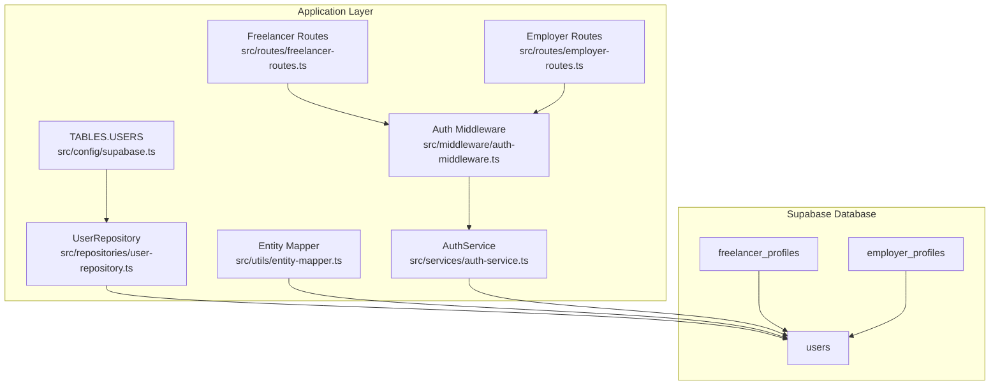
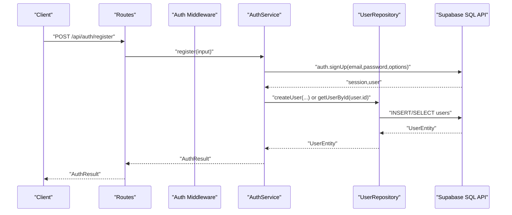
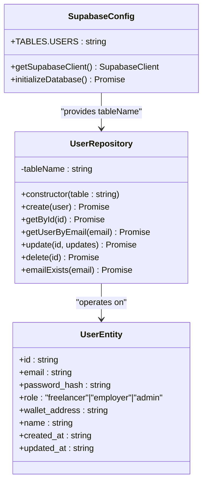
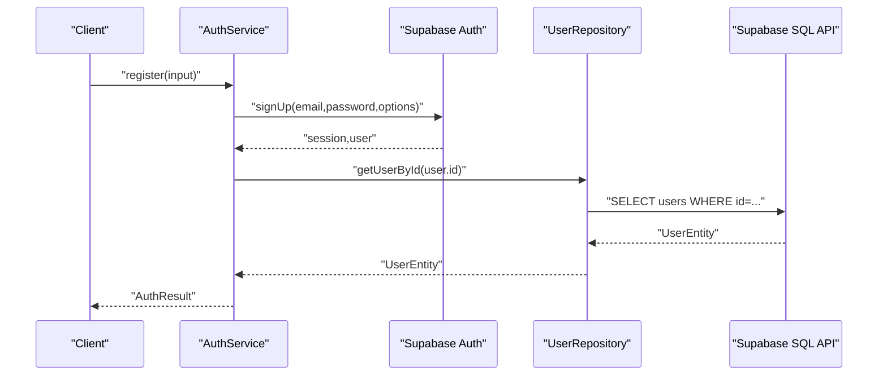
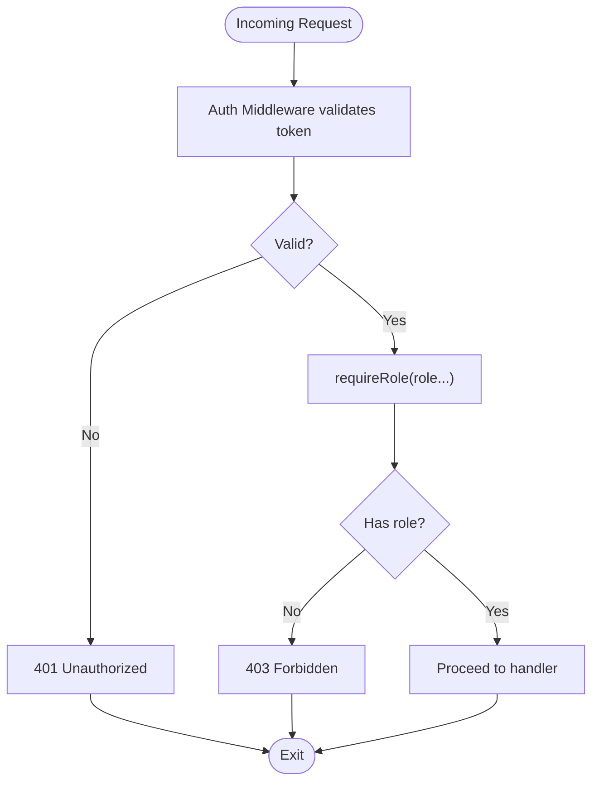
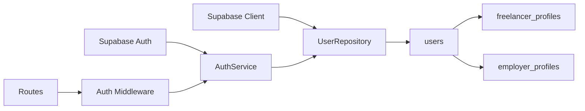

# Users Table

<cite>
**Referenced Files in This Document**
- [schema.sql](file://supabase/schema.sql)
- [supabase.ts](file://src/config/supabase.ts)
- [user-repository.ts](file://src/repositories/user-repository.ts)
- [entity-mapper.ts](file://src/utils/entity-mapper.ts)
- [auth-service.ts](file://src/services/auth-service.ts)
- [auth-middleware.ts](file://src/middleware/auth-middleware.ts)
- [freelancer-routes.ts](file://src/routes/freelancer-routes.ts)
- [employer-routes.ts](file://src/routes/employer-routes.ts)
</cite>

## Table of Contents
1. [Introduction](#introduction)
2. [Project Structure](#project-structure)
3. [Core Components](#core-components)
4. [Architecture Overview](#architecture-overview)
5. [Detailed Component Analysis](#detailed-component-analysis)
6. [Dependency Analysis](#dependency-analysis)
7. [Performance Considerations](#performance-considerations)
8. [Troubleshooting Guide](#troubleshooting-guide)
9. [Conclusion](#conclusion)

## Introduction
This document provides comprehensive data model documentation for the users table in the FreelanceXchain Supabase PostgreSQL database. It explains the schema, purpose, relationships with role-specific profiles, programmatic access patterns, and security considerations including password hashing and Row Level Security (RLS) policies. The users table serves as the central identity store for all platform users, with role-based access control enforced at both the database and application layers.

## Project Structure
The users table is defined in the Supabase schema and is accessed programmatically through the application’s configuration, repository, and service layers. Role-specific profile tables (freelancer_profiles and employer_profiles) reference users via foreign keys, enabling role-scoped data storage while maintaining a unified identity model.



**Diagram sources**
- [schema.sql](file://supabase/schema.sql#L7-L17)
- [supabase.ts](file://src/config/supabase.ts#L6-L21)
- [user-repository.ts](file://src/repositories/user-repository.ts#L1-L18)
- [entity-mapper.ts](file://src/utils/entity-mapper.ts#L13-L45)
- [auth-service.ts](file://src/services/auth-service.ts#L80-L155)
- [auth-middleware.ts](file://src/middleware/auth-middleware.ts#L25-L100)
- [freelancer-routes.ts](file://src/routes/freelancer-routes.ts#L170-L175)
- [employer-routes.ts](file://src/routes/employer-routes.ts#L84-L90)

**Section sources**
- [schema.sql](file://supabase/schema.sql#L7-L17)
- [supabase.ts](file://src/config/supabase.ts#L6-L21)

## Core Components
- users table: Central identity store with UUID primary key, unique email, password hash, role enumeration, optional wallet address and name, and audit timestamps.
- Role-specific profiles: freelancer_profiles and employer_profiles link to users via unique foreign keys, enabling role-scoped attributes.
- Programmatic access: TABLES.USERS constant defines the table name; UserRepository encapsulates CRUD operations; AuthService integrates with Supabase Auth; AuthMiddleware enforces role-based access control.

**Section sources**
- [schema.sql](file://supabase/schema.sql#L7-L17)
- [schema.sql](file://supabase/schema.sql#L40-L62)
- [supabase.ts](file://src/config/supabase.ts#L6-L21)
- [user-repository.ts](file://src/repositories/user-repository.ts#L1-L18)
- [auth-service.ts](file://src/services/auth-service.ts#L80-L155)
- [auth-middleware.ts](file://src/middleware/auth-middleware.ts#L72-L100)

## Architecture Overview
The users table underpins identity and access control across the platform. Supabase Auth manages authentication and user creation, while the application reads/writes user records through Supabase SQL API. RLS is enabled on all tables, and a service-role policy grants full access for backend operations. Application-level middleware validates tokens and enforces role-based route protection.



**Diagram sources**
- [auth-service.ts](file://src/services/auth-service.ts#L80-L155)
- [user-repository.ts](file://src/repositories/user-repository.ts#L1-L18)
- [supabase.ts](file://src/config/supabase.ts#L6-L21)

## Detailed Component Analysis

### Users Table Schema
- id: UUID primary key with default generated by uuid_generate_v4().
- email: Unique, not null.
- password_hash: Not null; stores hashed credentials managed by Supabase Auth.
- role: Enumerated type constrained to 'freelancer', 'employer', or 'admin'.
- wallet_address: Optional, defaults to empty string.
- name: Optional, defaults to empty string.
- created_at, updated_at: Timestamps with timezone, defaulting to current time.

These constraints and defaults define a robust identity model with clear separation of concerns between authentication (Supabase Auth) and application-level user metadata (wallet_address, name).

**Section sources**
- [schema.sql](file://supabase/schema.sql#L7-L17)

### Relationship with Role-Specific Profiles
- freelancer_profiles.user_id: Unique foreign key referencing users.id with cascade delete.
- employer_profiles.user_id: Unique foreign key referencing users.id with cascade delete.
- This design ensures each user has at most one role-specific profile and enables efficient joins for role-scoped views.

```mermaid
erDiagram
USERS {
uuid id PK
string email UK
string password_hash
string role
string wallet_address
string name
timestamptz created_at
timestamptz updated_at
}
FREELANCER_PROFILES {
uuid id PK
uuid user_id UK FK
text bio
decimal hourly_rate
jsonb skills
jsonb experience
string availability
timestamptz created_at
timestamptz updated_at
}
EMPLOYER_PROFILES {
uuid id PK
uuid user_id UK FK
string company_name
text description
string industry
timestamptz created_at
timestamptz updated_at
}
USERS ||--o{ FREELANCER_PROFILES : "has profile"
USERS ||--o{ EMPLOYER_PROFILES : "has profile"
```

**Diagram sources**
- [schema.sql](file://supabase/schema.sql#L7-L17)
- [schema.sql](file://supabase/schema.sql#L40-L62)

**Section sources**
- [schema.sql](file://supabase/schema.sql#L40-L62)

### Programmatic Access via TABLES.USERS
- TABLES.USERS is defined as a constant and used by repositories to target the users table.
- UserRepository extends a base repository and constructs queries against TABLES.USERS.
- The application initializes the Supabase client and verifies connectivity to TABLES.USERS.



**Diagram sources**
- [supabase.ts](file://src/config/supabase.ts#L6-L21)
- [user-repository.ts](file://src/repositories/user-repository.ts#L1-L18)
- [user-repository.ts](file://src/repositories/user-repository.ts#L28-L41)

**Section sources**
- [supabase.ts](file://src/config/supabase.ts#L6-L21)
- [user-repository.ts](file://src/repositories/user-repository.ts#L1-L18)
- [user-repository.ts](file://src/repositories/user-repository.ts#L28-L41)

### Entity Mapping and Transformation
- The entity mapper converts between database entities (snake_case) and API models (camelCase), preserving passwordHash and walletAddress fields for application use.
- This mapping ensures consistent serialization/deserialization across repositories and services.

**Section sources**
- [entity-mapper.ts](file://src/utils/entity-mapper.ts#L13-L45)

### Authentication and Registration Flow
- Supabase Auth creates users and sends confirmation emails; the application waits briefly for triggers to populate public.users, then falls back to manual creation if needed.
- Registration passes role, wallet_address, and name to Supabase Auth options; the application retrieves the created user from public.users and returns an AuthResult.



**Diagram sources**
- [auth-service.ts](file://src/services/auth-service.ts#L80-L155)
- [user-repository.ts](file://src/repositories/user-repository.ts#L1-L18)

**Section sources**
- [auth-service.ts](file://src/services/auth-service.ts#L80-L155)
- [user-repository.ts](file://src/repositories/user-repository.ts#L1-L18)

### Role-Based Access Control
- Application-level enforcement uses requireRole middleware to restrict routes to specific roles (e.g., freelancer or employer).
- Routes for freelancers and employers demonstrate requireRole('freelancer') and requireRole('employer') respectively.



**Diagram sources**
- [auth-middleware.ts](file://src/middleware/auth-middleware.ts#L25-L100)
- [freelancer-routes.ts](file://src/routes/freelancer-routes.ts#L170-L175)
- [employer-routes.ts](file://src/routes/employer-routes.ts#L84-L90)

**Section sources**
- [auth-middleware.ts](file://src/middleware/auth-middleware.ts#L72-L100)
- [freelancer-routes.ts](file://src/routes/freelancer-routes.ts#L170-L175)
- [employer-routes.ts](file://src/routes/employer-routes.ts#L84-L90)

### Security Considerations
- Password hashing: The users table stores password_hash; Supabase Auth manages hashing and verification during sign-up and sign-in flows.
- Row Level Security (RLS): RLS is enabled on all tables, including users. Service-role policies grant full access for backend operations, while public read policies exist for specific tables (e.g., skill categories, skills, open projects).
- Token validation: The application validates access tokens via Supabase Auth and enriches requests with user identity and role for downstream authorization checks.

**Section sources**
- [schema.sql](file://supabase/schema.sql#L225-L261)
- [auth-service.ts](file://src/services/auth-service.ts#L230-L259)

## Dependency Analysis
- users depends on Supabase Auth for identity lifecycle and on the application’s Supabase client for database operations.
- freelancer_profiles and employer_profiles depend on users via foreign keys, enabling role-scoped profile management.
- Application middleware depends on AuthService for token validation and on Supabase Auth for user retrieval.



**Diagram sources**
- [auth-service.ts](file://src/services/auth-service.ts#L156-L201)
- [user-repository.ts](file://src/repositories/user-repository.ts#L1-L18)
- [schema.sql](file://supabase/schema.sql#L7-L17)
- [schema.sql](file://supabase/schema.sql#L40-L62)
- [auth-middleware.ts](file://src/middleware/auth-middleware.ts#L25-L100)

**Section sources**
- [auth-service.ts](file://src/services/auth-service.ts#L156-L201)
- [user-repository.ts](file://src/repositories/user-repository.ts#L1-L18)
- [schema.sql](file://supabase/schema.sql#L7-L17)
- [schema.sql](file://supabase/schema.sql#L40-L62)
- [auth-middleware.ts](file://src/middleware/auth-middleware.ts#L25-L100)

## Performance Considerations
- Indexes: An index on users.email improves lookup performance for authentication and duplicate detection.
- RLS overhead: Enabling RLS adds minimal overhead compared to the benefits of fine-grained row-level controls.
- Token validation caching: Consider caching validated user roles in middleware for short-lived requests to reduce repeated token validation calls.

**Section sources**
- [schema.sql](file://supabase/schema.sql#L202-L204)

## Troubleshooting Guide
- Duplicate email registration: The application checks for existing emails before registering new users and returns a specific error code if a duplicate is detected.
- Invalid or expired tokens: Token validation returns explicit error codes for invalid/expired tokens; routes should handle these codes and respond with appropriate HTTP status.
- Missing authorization header: Requests without a Bearer token receive a 401 response with a standardized error code.
- Insufficient permissions: Requests with valid tokens but incorrect roles receive a 403 response with a standardized error code.

**Section sources**
- [auth-service.ts](file://src/services/auth-service.ts#L80-L105)
- [auth-middleware.ts](file://src/middleware/auth-middleware.ts#L25-L100)

## Conclusion
The users table is the foundation of identity and access control in FreelanceXchain. Its schema enforces strong constraints on identity fields, while role-specific profiles enable scalable, role-scoped data management. Programmatic access is centralized through TABLES.USERS and UserRepository, with Supabase Auth handling credential management. Application-level middleware and route guards enforce role-based access control, and RLS policies provide database-level safeguards. Together, these components deliver a secure, extensible identity model aligned with platform roles.