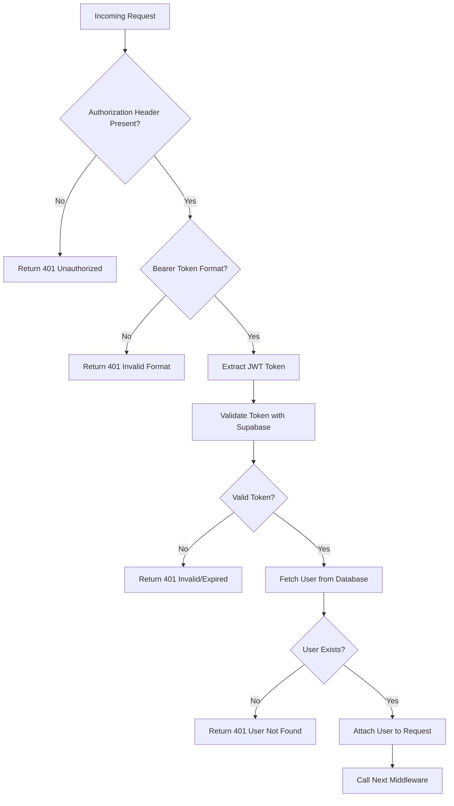
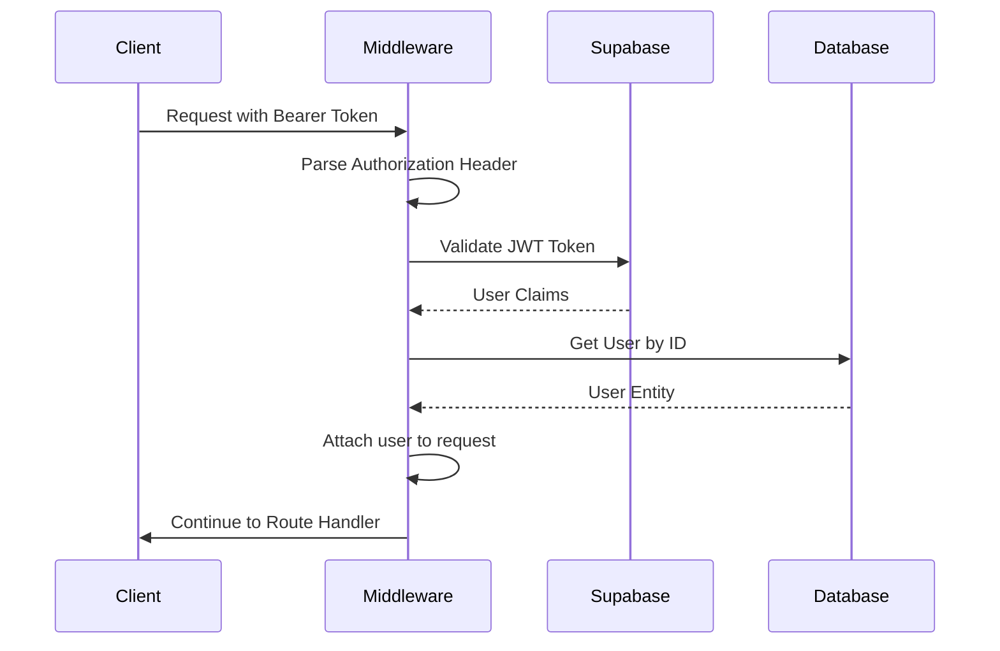
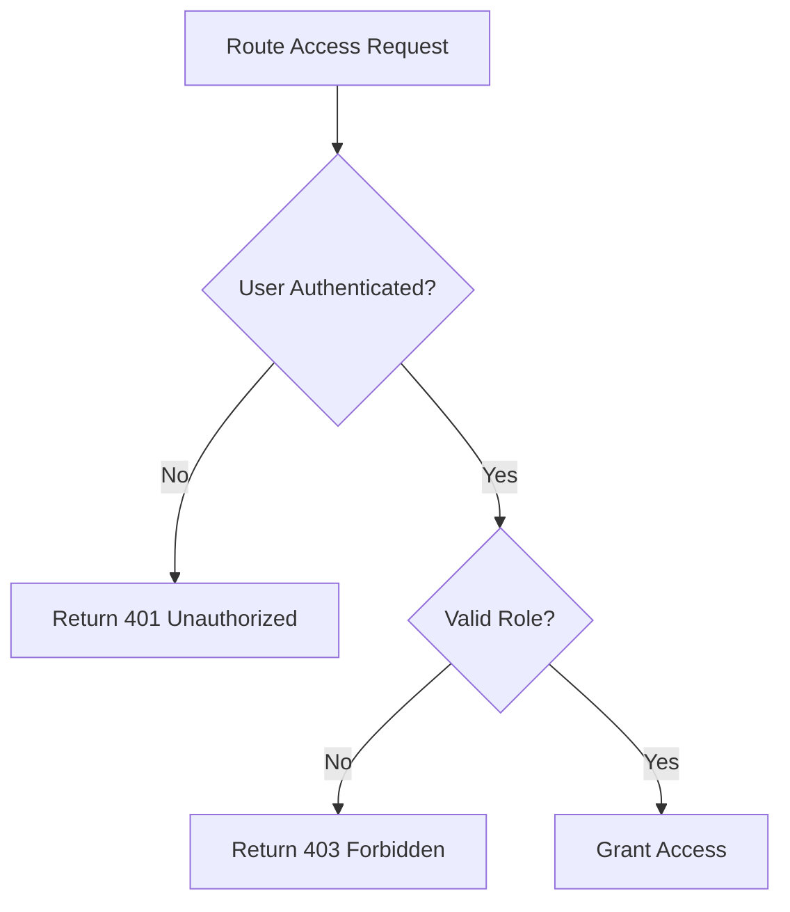
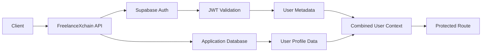

# Authentication Middleware

<cite>
**Referenced Files in This Document**   
- [auth-middleware.ts](file://src/middleware/auth-middleware.ts)
- [auth-service.ts](file://src/services/auth-service.ts)
- [auth-routes.ts](file://src/routes/auth-routes.ts)
- [user.ts](file://src/models/user.ts)
- [auth-types.ts](file://src/services/auth-types.ts)
- [supabase.ts](file://src/config/supabase.ts)
- [freelancer-routes.ts](file://src/routes/freelancer-routes.ts)
- [employer-routes.ts](file://src/routes/employer-routes.ts)
- [kyc-routes.ts](file://src/routes/kyc-routes.ts)
- [project-routes.ts](file://src/routes/project-routes.ts)
- [proposal-routes.ts](file://src/routes/proposal-routes.ts)
</cite>

## Table of Contents
1. [Introduction](#introduction)
2. [Authentication Middleware Architecture](#authentication-middleware-architecture)
3. [Token Validation and User Identity Extraction](#token-validation-and-user-identity-extraction)
4. [Role-Based Access Control (RBAC) Implementation](#role-based-access-control-rbac-implementation)
5. [Error Handling and Security](#error-handling-and-security)
6. [Integration with Supabase Authentication](#integration-with-supabase-authentication)
7. [Route Protection Patterns](#route-protection-patterns)
8. [Token Refresh Mechanisms](#token-refresh-mechanisms)
9. [CORS Compatibility and Security Headers](#cors-compatibility-and-security-headers)
10. [Performance Considerations](#performance-considerations)
11. [Security Best Practices](#security-best-practices)

## Introduction

The authentication middleware in FreelanceXchain provides a comprehensive security layer that handles JWT token validation, user identity extraction, and role-based access control for the platform's API endpoints. Built on top of Supabase authentication, this middleware intercepts incoming requests to verify user credentials, extract user information from validated tokens, and enforce permission policies based on user roles (freelancer, employer, admin). The system supports both traditional email/password authentication and OAuth providers (Google, GitHub, Azure, LinkedIn) while maintaining a consistent security model across all routes.

**Section sources**
- [auth-middleware.ts](file://src/middleware/auth-middleware.ts#L1-L101)
- [auth-service.ts](file://src/services/auth-service.ts#L1-L473)

## Authentication Middleware Architecture

The authentication middleware follows a layered architecture that separates concerns between token validation, user identity management, and access control enforcement. The core components work together to provide a secure authentication flow:



**Diagram sources**
- [auth-middleware.ts](file://src/middleware/auth-middleware.ts#L25-L70)
- [auth-service.ts](file://src/services/auth-service.ts#L233-L259)

## Token Validation and User Identity Extraction

The authentication middleware intercepts incoming requests and validates JWT tokens using Supabase's authentication service. The process begins with extracting the token from the Authorization header, which must follow the Bearer scheme format. The middleware parses the header, validates its structure, and extracts the token for verification.

Once the token is extracted, it is validated against Supabase's authentication system using the `validateToken` function from the auth service. Upon successful validation, the middleware retrieves the user's identity information including user ID, email, and role from the database. This information is then attached to the Express request object, making it available to downstream route handlers.



**Diagram sources**
- [auth-middleware.ts](file://src/middleware/auth-middleware.ts#L25-L69)
- [auth-service.ts](file://src/services/auth-service.ts#L233-L259)

**Section sources**
- [auth-middleware.ts](file://src/middleware/auth-middleware.ts#L25-L69)
- [auth-service.ts](file://src/services/auth-service.ts#L233-L259)

## Role-Based Access Control (RBAC) Implementation

FreelanceXchain implements a robust role-based access control system that enforces permissions based on user roles (freelancer, employer, admin). The middleware provides a `requireRole` higher-order function that creates route-specific guards to restrict access to authorized users only.

When a protected route is accessed, the middleware first verifies that the user is authenticated (has a valid token and user object attached to the request). Then, it checks whether the user's role is included in the list of allowed roles for that route. If the user lacks the required permissions, the middleware returns a 403 Forbidden response with appropriate error details.



**Diagram sources**
- [auth-middleware.ts](file://src/middleware/auth-middleware.ts#L72-L99)

**Section sources**
- [auth-middleware.ts](file://src/middleware/auth-middleware.ts#L72-L99)
- [freelancer-routes.ts](file://src/routes/freelancer-routes.ts#L169-L472)
- [employer-routes.ts](file://src/routes/employer-routes.ts#L83-L247)
- [kyc-routes.ts](file://src/routes/kyc-routes.ts#L779-L874)

## Error Handling and Security

The authentication middleware implements comprehensive error handling for various authentication failure scenarios. When token validation fails, the middleware returns standardized error responses with appropriate HTTP status codes and descriptive error codes that help clients understand the nature of the failure.

The system distinguishes between different types of authentication errors:
- Missing token (401 with AUTH_MISSING_TOKEN)
- Invalid token format (401 with AUTH_INVALID_FORMAT)
- Expired tokens (401 with AUTH_TOKEN_EXPIRED)
- Invalid tokens (401 with AUTH_INVALID_TOKEN)
- Insufficient permissions (403 with AUTH_FORBIDDEN)

Each error response includes a timestamp and request ID for debugging purposes, while avoiding the disclosure of sensitive information that could be exploited by attackers.

**Section sources**
- [auth-middleware.ts](file://src/middleware/auth-middleware.ts#L28-L66)
- [error-handler.ts](file://src/middleware/error-handler.ts#L40-L83)

## Integration with Supabase Authentication

The authentication middleware integrates seamlessly with Supabase Authentication to leverage its robust identity management capabilities. The system uses Supabase as the authoritative identity provider while maintaining a separate user management system in the application database for platform-specific user attributes.

The integration works as follows:
1. Token validation is performed using Supabase's `getUser` method
2. User metadata (role, wallet address) is stored in Supabase user profiles
3. Application-specific user data is stored in the application database
4. The middleware combines information from both sources to create a complete user context

This hybrid approach allows FreelanceXchain to benefit from Supabase's secure authentication infrastructure while maintaining flexibility in user data management.



**Diagram sources**
- [auth-service.ts](file://src/services/auth-service.ts#L233-L259)
- [supabase.ts](file://src/config/supabase.ts#L25-L33)

**Section sources**
- [auth-service.ts](file://src/services/auth-service.ts#L233-L259)
- [supabase.ts](file://src/config/supabase.ts#L25-L33)

## Route Protection Patterns

FreelanceXchain implements consistent route protection patterns across the API using the authentication middleware. Protected routes follow a standard pattern of applying the `authMiddleware` followed by one or more `requireRole` guards.

For example, routes that require employer access apply both the authentication middleware and the employer role requirement:
```typescript
router.post('/projects', authMiddleware, requireRole('employer'), async (req, res) => { ... })
```

Similarly, admin-only routes combine authentication with admin role requirements:
```typescript
router.get('/admin/pending', authMiddleware, requireRole('admin'), async (_req, res) => { ... })
```

This pattern ensures that all protected routes follow the same security principles and makes it easy to understand the access requirements for each endpoint.

**Section sources**
- [freelancer-routes.ts](file://src/routes/freelancer-routes.ts#L169-L472)
- [employer-routes.ts](file://src/routes/employer-routes.ts#L83-L247)
- [project-routes.ts](file://src/routes/project-routes.ts#L270-L627)
- [proposal-routes.ts](file://src/routes/proposal-routes.ts#L96-L424)

## Token Refresh Mechanisms

The authentication system includes support for token refresh mechanisms to maintain user sessions without requiring frequent re-authentication. When access tokens expire, clients can use refresh tokens to obtain new access tokens without requiring users to log in again.

The refresh process follows these steps:
1. Client sends refresh token to /api/auth/refresh endpoint
2. Server validates the refresh token with Supabase
3. New access and refresh tokens are issued
4. User information is retrieved and included in the response

This mechanism improves user experience by reducing login friction while maintaining security through short-lived access tokens and revocable refresh tokens.

**Section sources**
- [auth-service.ts](file://src/services/auth-service.ts#L206-L228)
- [auth-routes.ts](file://src/routes/auth-routes.ts#L352-L385)

## CORS Compatibility and Security Headers

The authentication middleware operates within a secure CORS configuration that protects against cross-site request forgery attacks while allowing legitimate cross-origin requests from authorized domains. The system implements strict CORS policies that validate origin headers against a whitelist of allowed domains.

Additionally, the middleware integrates with security headers middleware that enforces HTTPS in production, prevents clickjacking, and mitigates various web vulnerabilities through appropriate HTTP headers. These security measures work in conjunction with the authentication system to provide comprehensive protection for the application.

**Section sources**
- [security-middleware.ts](file://src/middleware/security-middleware.ts#L88-L106)
- [app.ts](file://src/app.ts#L27-L53)

## Performance Considerations

The authentication middleware is designed with performance in mind, minimizing database queries and external API calls during the authentication process. The system leverages Supabase's efficient token validation to avoid expensive cryptographic operations in the application layer.

While the current implementation does not include token caching, the architecture allows for potential caching strategies to further improve performance under high load. The separation of token validation (handled by Supabase) from user data retrieval (handled by the application) enables optimization opportunities without compromising security.

**Section sources**
- [auth-middleware.ts](file://src/middleware/auth-middleware.ts#L25-L70)
- [auth-service.ts](file://src/services/auth-service.ts#L233-L259)

## Security Best Practices

The authentication middleware follows industry-standard security best practices to protect user accounts and sensitive data:

1. **Token Security**: Uses short-lived access tokens with refresh token rotation
2. **Input Validation**: Validates token format and structure before processing
3. **Error Handling**: Provides generic error messages to avoid information leakage
4. **HTTPS Enforcement**: Requires HTTPS in production environments
5. **CORS Protection**: Restricts cross-origin requests to authorized domains
6. **Rate Limiting**: Protects authentication endpoints from brute force attacks
7. **Request Tracing**: Includes request IDs for audit and debugging purposes

These practices ensure that the authentication system maintains a high security posture while providing a reliable user experience.

**Section sources**
- [auth-middleware.ts](file://src/middleware/auth-middleware.ts#L1-L101)
- [security-middleware.ts](file://src/middleware/security-middleware.ts#L1-L124)
- [auth-routes.ts](file://src/routes/auth-routes.ts#L160-L800)