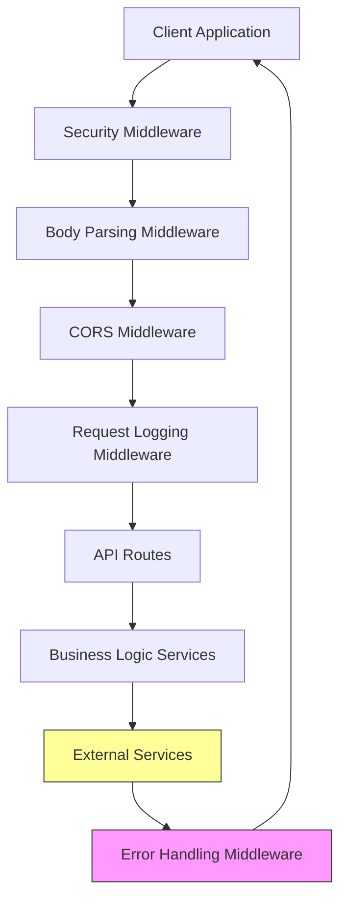
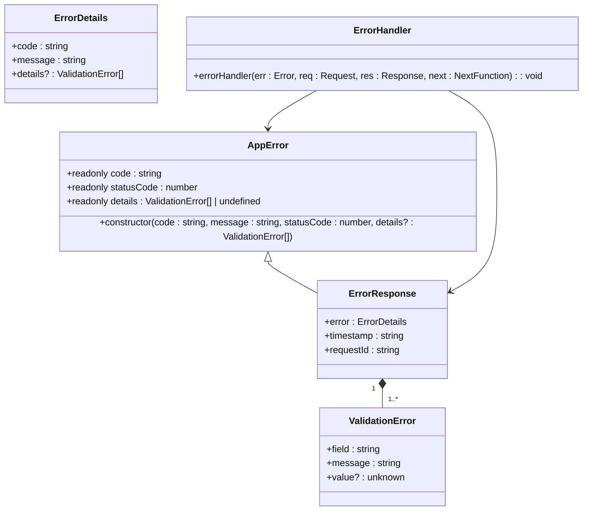
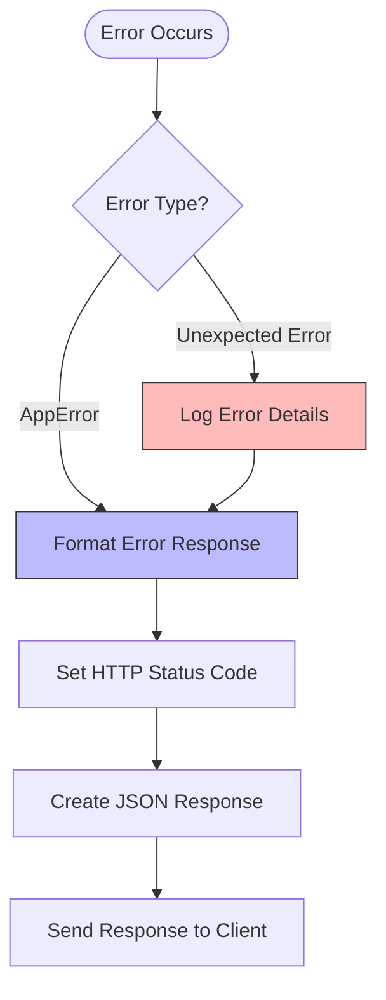
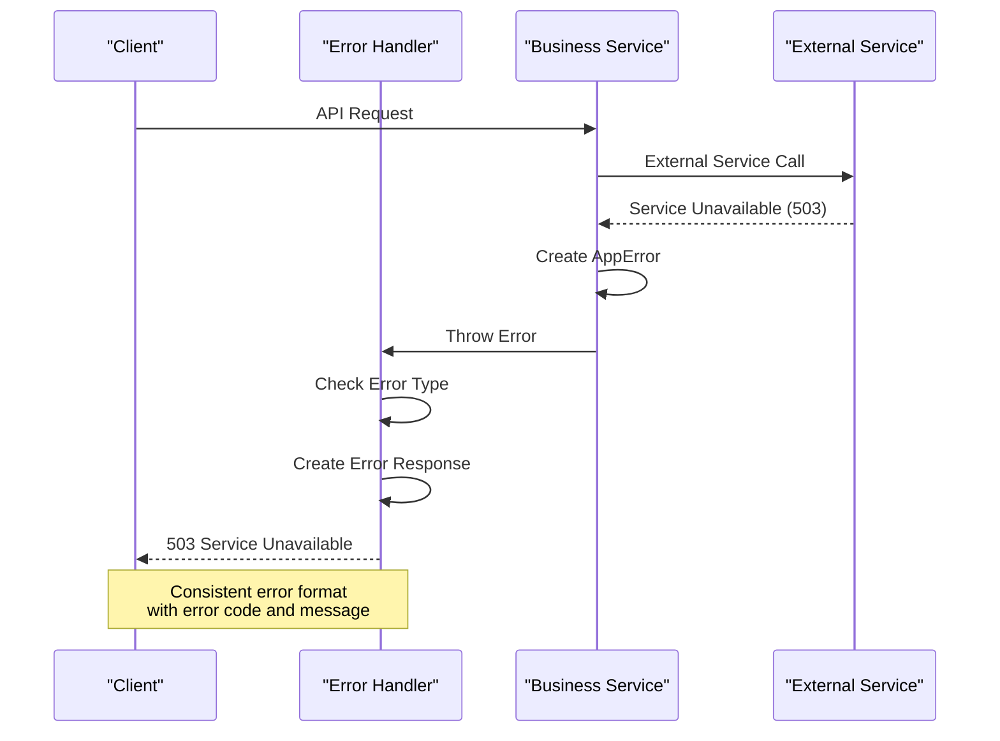
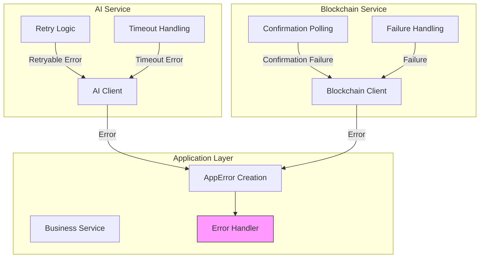
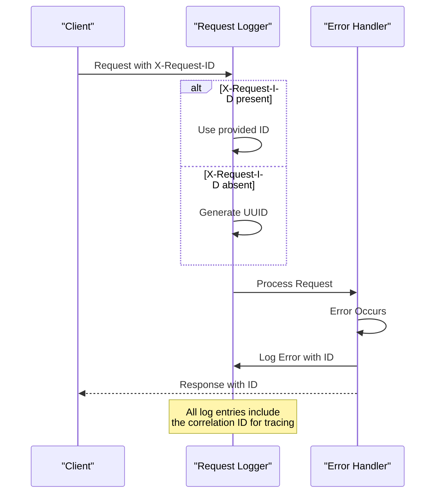
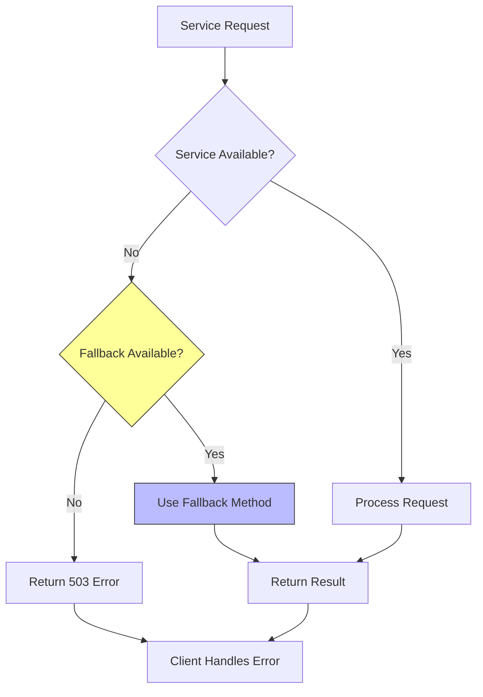
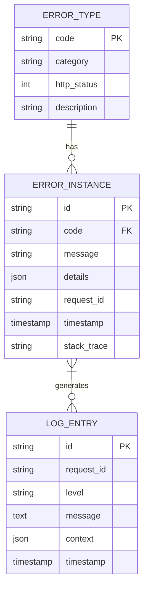

# Error Handling Middleware

<cite>
**Referenced Files in This Document**   
- [error-handler.ts](file://src/middleware/error-handler.ts)
- [app.ts](file://src/app.ts)
- [validation-middleware.ts](file://src/middleware/validation-middleware.ts)
- [blockchain-client.ts](file://src/services/blockchain-client.ts)
- [ai-client.ts](file://src/services/ai-client.ts)
- [escrow-contract.ts](file://src/services/escrow-contract.ts)
- [auth-routes.ts](file://src/routes/auth-routes.ts)
- [project-routes.ts](file://src/routes/project-routes.ts)
- [swagger.ts](file://src/config/swagger.ts)
</cite>

## Table of Contents
1. [Introduction](#introduction)
2. [Architecture Overview](#architecture-overview)
3. [Core Components](#core-components)
4. [Error Classification and Custom Error Classes](#error-classification-and-custom-error-classes)
5. [Handling Different Error Types](#handling-different-error-types)
6. [Integration with Distributed Components](#integration-with-distributed-components)
7. [Logging and Request Tracing](#logging-and-request-tracing)
8. [Graceful Degradation Strategies](#graceful-degradation-strategies)
9. [Best Practices](#best-practices)
10. [Conclusion](#conclusion)

## Introduction

The centralized error handling middleware in FreelanceXchain serves as the final safety net in the Express.js application stack, capturing unhandled exceptions and operational errors from upstream components. This middleware ensures consistent error responses across the API surface, preventing sensitive stack trace information from being exposed to clients, particularly in production environments. The implementation follows a comprehensive strategy for error standardization, incorporating consistent JSON response formats, appropriate HTTP status codes, and descriptive error messages that aid both developers and end users in understanding and resolving issues.

The middleware is strategically positioned as the last middleware in the Express.js stack, ensuring that all errors—whether thrown intentionally through custom error classes or occurring unexpectedly in the application flow—are caught and processed uniformly. This approach eliminates the need for repetitive error handling logic throughout the codebase, promoting cleaner, more maintainable code while ensuring a consistent user experience regardless of where an error originates in the system.

**Section sources**
- [app.ts](file://src/app.ts#L82-L84)
- [error-handler.ts](file://src/middleware/error-handler.ts#L85-L119)

## Architecture Overview

The error handling architecture in FreelanceXchain follows a layered approach, with the centralized error handler serving as the final component in the request processing pipeline. The middleware stack is carefully ordered to ensure proper error capture and processing, with security middleware, request parsing, CORS handling, and logging middleware preceding the error handler. This ordering ensures that even if errors occur during request preprocessing, they are still captured by the centralized handler.

**Diagram sources**
- [app.ts](file://src/app.ts#L15-L84)
- [error-handler.ts](file://src/middleware/error-handler.ts#L85-L119)

**Section sources**
- [app.ts](file://src/app.ts#L15-L84)
- [error-handler.ts](file://src/middleware/error-handler.ts#L85-L119)

## Core Components

The error handling system comprises several core components that work together to provide comprehensive error management. At the heart of the system is the `AppError` class, which extends the native JavaScript Error class to include additional properties such as error codes, HTTP status codes, and validation details. This custom error class enables consistent error representation across the application, making it easier to handle different types of errors appropriately.

The `errorHandler` function serves as the middleware that processes all errors caught by Express.js. It distinguishes between expected `AppError` instances and unexpected errors, handling each appropriately. For `AppError` instances, it returns a structured JSON response with the error code, message, and any additional details. For unexpected errors, it logs the full error details for debugging purposes while returning a generic internal error response to the client to prevent information leakage.

The system also includes a comprehensive set of error factory functions that create commonly used error types, such as authentication errors, validation errors, and resource not found errors. These factory functions promote consistency in error creation and reduce the likelihood of typos or inconsistencies in error codes and messages.

**Diagram sources**
- [error-handler.ts](file://src/middleware/error-handler.ts#L20-L38)
- [error-handler.ts](file://src/middleware/error-handler.ts#L10-L18)

**Section sources**
- [error-handler.ts](file://src/middleware/error-handler.ts#L1-L119)

## Error Classification and Custom Error Classes

FreelanceXchain employs a systematic approach to error classification through the use of custom error classes and error factory functions. The `AppError` class serves as the foundation for all application-specific errors, providing a consistent structure that includes an error code, HTTP status code, descriptive message, and optional details for validation errors. This approach enables precise error identification and appropriate client-side handling based on the error type.

The error factory functions in the `errors` object provide a convenient way to create commonly occurring errors with predefined codes and messages. These include authentication errors such as `invalidCredentials` and `tokenExpired`, validation errors like `validationError` and `invalidRating`, and business logic errors such as `duplicateEmail` and `projectLocked`. Each error type is assigned an appropriate HTTP status code that reflects the nature of the error, following RESTful conventions.

The error classification system also supports error-specific details through the `ValidationError` type, which includes the field name, error message, and optionally the invalid value. This is particularly useful for validation errors, where clients need to know exactly which fields failed validation and why. The structured error details enable rich error reporting in client applications, improving the user experience by providing specific guidance on how to correct input errors.

**Diagram sources**
- [error-handler.ts](file://src/middleware/error-handler.ts#L41-L83)
- [error-handler.ts](file://src/middleware/error-handler.ts#L93-L104)

**Section sources**
- [error-handler.ts](file://src/middleware/error-handler.ts#L20-L83)

## Handling Different Error Types

The error handling middleware in FreelanceXchain is designed to handle a wide range of error types that may occur in a complex distributed system. For validation errors, the middleware leverages the `validationError` factory function, which accepts an array of `ValidationError` objects containing details about which fields failed validation and why. This allows for comprehensive error reporting that helps clients correct their input.

Database-related errors are handled through specific error codes such as `DUPLICATE_EMAIL` and `NOT_FOUND`, which are triggered when unique constraint violations or record lookups fail. These errors are mapped to appropriate HTTP status codes (409 for conflicts and 404 for not found) and include descriptive messages that explain the nature of the error without exposing sensitive database details.

Blockchain interaction failures are represented by the `BLOCKCHAIN_ERROR` code, which is used when operations involving the blockchain client fail. This could include transaction submission failures, confirmation timeouts, or connectivity issues with the blockchain network. These errors are typically mapped to HTTP 503 (Service Unavailable) status codes, indicating a temporary failure that may be resolved by retrying the operation.

Service unavailability errors, particularly for the AI service, are handled through the `GEMINI_UNAVAILABLE` error code. This error is used when the AI service is temporarily unavailable, either due to network issues, rate limiting, or service outages. The system implements retry logic with exponential backoff for AI service calls, but when these retries are exhausted, the error is propagated through the middleware with a 503 status code.

**Diagram sources**
- [error-handler.ts](file://src/middleware/error-handler.ts#L78-L82)
- [ai-client.ts](file://src/services/ai-client.ts#L104-L110)
- [blockchain-client.ts](file://src/services/blockchain-client.ts#L289-L292)

**Section sources**
- [error-handler.ts](file://src/middleware/error-handler.ts#L78-L83)
- [ai-client.ts](file://src/services/ai-client.ts#L104-L164)
- [blockchain-client.ts](file://src/services/blockchain-client.ts#L289-L292)

## Integration with Distributed Components

The error handling middleware is tightly integrated with the distributed components of FreelanceXchain, including the blockchain client and AI services. The blockchain client implements its own error handling that translates low-level blockchain errors into application-level errors that can be properly processed by the middleware. For example, when a transaction fails to confirm within the expected timeframe, the blockchain client throws an error that is caught and converted into a `BLOCKCHAIN_ERROR` AppError.

Similarly, the AI client implements comprehensive error handling for interactions with the AI service. It handles various failure modes including network errors, timeout errors, and HTTP errors from the AI API. The client implements retry logic with exponential backoff for transient errors, but when retries are exhausted or for non-retryable errors, it returns an AIError object that is converted into an appropriate AppError by the calling service.

The escrow contract service demonstrates how business logic components integrate with the error handling system. When operations fail due to business rules (such as attempting to release a milestone that has already been released), the service throws descriptive errors that are caught by the middleware. These errors are then converted into appropriate HTTP responses with the correct status codes and error codes.

This integration ensures that errors from distributed components are not only handled gracefully but also provide meaningful information to clients. The consistent error format allows client applications to implement uniform error handling logic regardless of which component generated the error, simplifying client-side development and improving the overall user experience.

**Diagram sources**
- [ai-client.ts](file://src/services/ai-client.ts#L99-L164)
- [blockchain-client.ts](file://src/services/blockchain-client.ts#L184-L239)
- [escrow-contract.ts](file://src/services/escrow-contract.ts#L96-L102)

**Section sources**
- [ai-client.ts](file://src/services/ai-client.ts#L99-L164)
- [blockchain-client.ts](file://src/services/blockchain-client.ts#L184-L239)
- [escrow-contract.ts](file://src/services/escrow-contract.ts#L96-L102)

## Logging and Request Tracing

The error handling system in FreelanceXchain incorporates comprehensive logging and request tracing capabilities to support debugging and monitoring. Each request is assigned a unique correlation ID, either provided by the client via the `X-Request-ID` header or generated by the server if not present. This correlation ID is included in all error responses and log entries, enabling end-to-end tracing of requests across the system.

The request logging middleware captures detailed information about each request and response, including the HTTP method, path, query parameters, status code, duration, and the correlation ID. This information is logged in JSON format, making it easy to parse and analyze with log management tools. When errors occur, the error handler logs the full error details, including the stack trace for unexpected errors, while ensuring that this sensitive information is not exposed in the response to clients.

The logging system is designed to provide sufficient information for debugging without compromising security. In production environments, stack traces and other sensitive details are never included in error responses, but are captured in server logs for authorized personnel to review. This approach balances the need for effective debugging with the imperative to protect sensitive system information.

The correlation ID system enables efficient troubleshooting by allowing developers and support staff to quickly locate all log entries related to a specific request. This is particularly valuable in a distributed system where a single user action may involve multiple services and database operations. By searching logs for a specific correlation ID, teams can reconstruct the complete flow of a request and identify the root cause of issues more efficiently.

**Diagram sources**
- [request-logger.ts](file://src/middleware/request-logger.ts#L9-L13)
- [error-handler.ts](file://src/middleware/error-handler.ts#L91-L92)
- [error-handler.ts](file://src/middleware/error-handler.ts#L100-L101)

**Section sources**
- [request-logger.ts](file://src/middleware/request-logger.ts#L1-L41)
- [error-handler.ts](file://src/middleware/error-handler.ts#L91-L119)

## Graceful Degradation Strategies

FreelanceXchain implements several graceful degradation strategies to maintain system availability and usability even when individual components fail. For the AI service, the system provides a keyword-based fallback for skill matching and extraction when the AI service is unavailable. This ensures that core functionality remains available, albeit with reduced accuracy, rather than completely failing when the AI service is down.

The blockchain interaction layer implements retry logic and confirmation polling to handle temporary network issues and blockchain confirmation delays. When a transaction submission fails due to a network error, the system automatically retries the operation with exponential backoff. For transaction confirmation, the system polls the blockchain at regular intervals, allowing for eventual consistency even if immediate confirmation is not possible.

The error handling middleware itself contributes to graceful degradation by ensuring that partial failures do not cascade into complete system failures. When an error occurs in one part of the system, the middleware ensures that it is contained and properly reported, preventing it from affecting other requests or bringing down the entire application. This isolation of failures is critical for maintaining system reliability in a production environment.

The system also implements rate limiting with appropriate error responses, preventing abusive clients from overwhelming the system. When rate limits are exceeded, clients receive a 429 Too Many Requests response with a Retry-After header, allowing them to adjust their request patterns rather than being completely blocked from accessing the service.

**Diagram sources**
- [ai-client.ts](file://src/services/ai-client.ts#L222-L247)
- [ai-client.ts](file://src/services/ai-client.ts#L324-L358)
- [rate-limiter.ts](file://src/middleware/rate-limiter.ts#L44-L54)

**Section sources**
- [ai-client.ts](file://src/services/ai-client.ts#L222-L358)
- [rate-limiter.ts](file://src/middleware/rate-limiter.ts#L44-L54)

## Best Practices

The error handling implementation in FreelanceXchain follows several best practices for building reliable and maintainable systems. One key practice is the use of descriptive error codes rather than generic messages, allowing clients to programmatically handle different error types appropriately. These error codes follow a consistent naming convention that indicates the error category and specific error type, making them easy to understand and process.

Another best practice is the separation of error creation from error handling. Services and business logic components create descriptive errors with appropriate codes and messages, while the centralized middleware handles the presentation of these errors to clients. This separation of concerns ensures that error handling logic is not scattered throughout the codebase, making the system easier to maintain and modify.

The system also follows the principle of failing fast and failing loudly during development, while providing graceful degradation in production. During development, detailed error information including stack traces is available to help developers quickly identify and fix issues. In production, this detailed information is hidden from clients to prevent information leakage, while still being captured in server logs for debugging purposes.

Security is a key consideration in the error handling design, with careful attention paid to preventing information leakage. Error messages are crafted to be helpful without revealing sensitive system details, and the system avoids exposing stack traces or internal implementation details to clients. This approach helps protect against potential security vulnerabilities that could be exploited through error message analysis.

**Diagram sources**
- [error-handler.ts](file://src/middleware/error-handler.ts#L41-L83)
- [error-handler.ts](file://src/middleware/error-handler.ts#L108-L109)
- [request-logger.ts](file://src/middleware/request-logger.ts#L16-L23)

**Section sources**
- [error-handler.ts](file://src/middleware/error-handler.ts#L41-L83)
- [request-logger.ts](file://src/middleware/request-logger.ts#L16-L23)

## Conclusion

The centralized error handling middleware in FreelanceXchain provides a robust and comprehensive solution for managing errors in a complex distributed system. By serving as the final middleware in the Express.js stack, it ensures that all errors are caught and processed consistently, regardless of their origin in the application. The use of custom error classes, error factory functions, and standardized response formats enables precise error reporting and consistent client experiences.

The middleware's integration with distributed components such as the blockchain client and AI services demonstrates how error handling can be extended across system boundaries while maintaining consistency. The implementation of graceful degradation strategies, comprehensive logging, and request tracing further enhances the system's reliability and maintainability.

By following best practices in error classification, security, and separation of concerns, the error handling system in FreelanceXchain provides a solid foundation for building reliable applications that can gracefully handle the inevitable failures that occur in complex systems. This approach not only improves the user experience by providing meaningful error information but also simplifies debugging and monitoring, ultimately contributing to the overall stability and success of the platform.