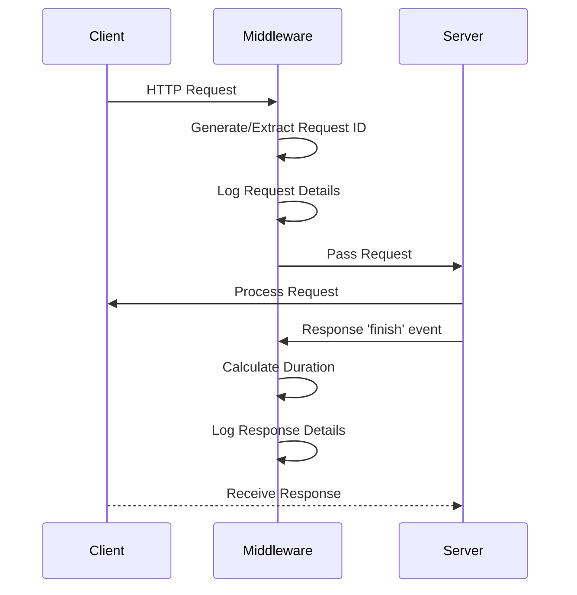
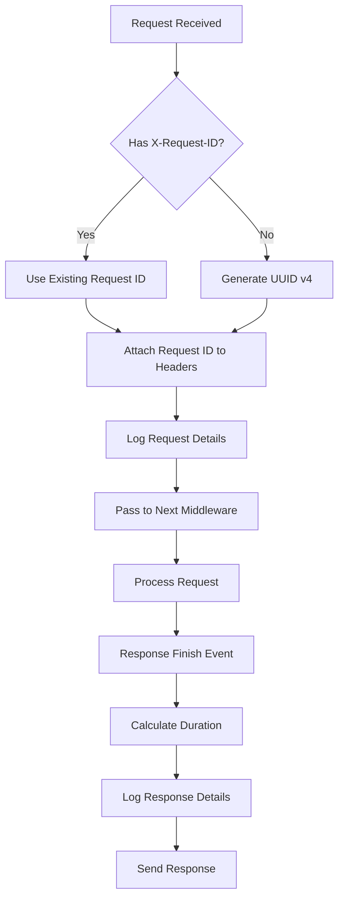
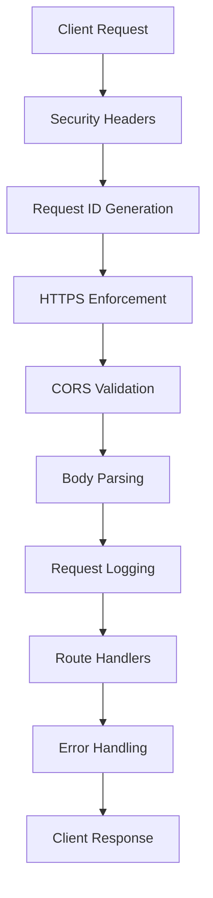
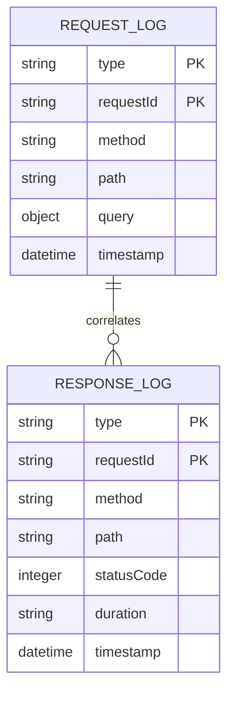

# Request Logging Middleware

<cite>
**Referenced Files in This Document**   
- [request-logger.ts](file://src/middleware/request-logger.ts)
- [app.ts](file://src/app.ts)
- [security-middleware.ts](file://src/middleware/security-middleware.ts)
- [error-handler.ts](file://src/middleware/error-handler.ts)
- [env.ts](file://src/config/env.ts)
</cite>

## Table of Contents
1. [Introduction](#introduction)
2. [Implementation Overview](#implementation-overview)
3. [Core Functionality](#core-functionality)
4. [Integration with Application Flow](#integration-with-application-flow)
5. [Structured Logging Format](#structured-logging-format)
6. [Performance Considerations](#performance-considerations)
7. [Security and Data Protection](#security-and-data-protection)
8. [Use Cases](#use-cases)
9. [Configuration and Extensibility](#configuration-and-extensibility)
10. [Conclusion](#conclusion)

## Introduction

The request logging middleware in FreelanceXchain serves as a critical component for generating comprehensive audit trails of all HTTP interactions within the application. This documentation details the implementation, functionality, and integration of this middleware, which captures essential information about incoming requests and outgoing responses. The middleware plays a vital role in observability, debugging, security auditing, and performance monitoring for the decentralized freelance marketplace platform.

**Section sources**
- [request-logger.ts](file://src/middleware/request-logger.ts)
- [app.ts](file://src/app.ts)

## Implementation Overview

The request logging middleware is implemented as a standard Express.js middleware function that intercepts HTTP requests and responses to capture relevant data. It operates by first capturing request details at the beginning of the request lifecycle and then listening for the 'finish' event on the response object to log response details once the response has been sent to the client.

The middleware generates a unique request ID for each incoming request, either by using an existing X-Request-ID header if present or by creating a new UUID. This request ID is attached to the request headers and used to correlate request and response logs, enabling end-to-end tracing of individual HTTP transactions.

**Diagram sources**
- [request-logger.ts](file://src/middleware/request-logger.ts)
- [app.ts](file://src/app.ts)

**Section sources**
- [request-logger.ts](file://src/middleware/request-logger.ts)
- [app.ts](file://src/app.ts)

## Core Functionality

The request logging middleware captures a comprehensive set of information for both incoming requests and outgoing responses. For requests, it logs the HTTP method, path, query parameters, and timestamp. For responses, it records the status code, response duration, and correlates the response with the original request using the shared request ID.

The implementation uses the `res.on('finish')` event listener to ensure response logging occurs after the response has been fully sent to the client. This approach allows the middleware to accurately measure the total processing time for each request by calculating the difference between the response finish time and the original request start time.

**Diagram sources**
- [request-logger.ts](file://src/middleware/request-logger.ts)

**Section sources**
- [request-logger.ts](file://src/middleware/request-logger.ts)

## Integration with Application Flow

The request logging middleware is integrated into the application's middleware chain in a specific order to ensure proper functionality. It is positioned after security middleware (such as helmet headers, request ID generation, and HTTPS enforcement) but before route handlers and error handling middleware.

This strategic placement ensures that the logging middleware can capture the fully processed request after security checks have been applied, while still being early enough in the chain to log all requests regardless of their eventual outcome. The middleware is imported through a barrel file and applied to the Express application instance using the `app.use()` method.

**Diagram sources**
- [app.ts](file://src/app.ts)
- [security-middleware.ts](file://src/middleware/security-middleware.ts)

**Section sources**
- [app.ts](file://src/app.ts)
- [security-middleware.ts](file://src/middleware/security-middleware.ts)

## Structured Logging Format

The request logging middleware implements structured logging by outputting JSON-formatted log entries. This approach facilitates easy parsing, analysis, and integration with external monitoring and logging services. Each log entry includes a type field to distinguish between request and response logs, along with a shared request ID to correlate related entries.

The structured format includes essential fields such as timestamp (in ISO 8601 format), HTTP method, request path, query parameters, response status code, and processing duration. This standardized format enables automated log processing, aggregation, and visualization in monitoring tools, making it easier to identify patterns, troubleshoot issues, and analyze system performance.

**Diagram sources**
- [request-logger.ts](file://src/middleware/request-logger.ts)

**Section sources**
- [request-logger.ts](file://src/middleware/request-logger.ts)

## Performance Considerations

The request logging middleware is designed with performance in mind, implementing several strategies to minimize its impact on request processing time. The logging operations are synchronous but lightweight, using `console.log()` with JSON serialization, which is generally fast for the volume of data being logged.

The middleware avoids blocking the request-response cycle by using non-blocking operations and leveraging the event-driven nature of Node.js. The response logging is deferred until the 'finish' event, ensuring that it does not interfere with the primary request processing. For production environments with high traffic, the implementation could be extended to support asynchronous logging to external services without impacting response times.

The current implementation does not include log rotation or size limiting, which should be addressed in production deployments through external log management solutions or by extending the middleware to write to files with rotation capabilities.

**Section sources**
- [request-logger.ts](file://src/middleware/request-logger.ts)

## Security and Data Protection

The request logging middleware incorporates security considerations to protect sensitive information. While the current implementation logs query parameters, it does not specifically filter out sensitive data such as authentication tokens, which represents a potential security concern that should be addressed.

The middleware works in conjunction with the security middleware that generates and manages request IDs, ensuring consistent tracing across the application. The use of UUID v4 for request IDs provides sufficient entropy to prevent prediction attacks and ensures uniqueness across requests.

To enhance security, future improvements could include filtering mechanisms to exclude sensitive headers (such as Authorization) from logs, implementing log redaction for specific patterns, and providing configuration options to control the level of detail logged for different environments.

**Section sources**
- [request-logger.ts](file://src/middleware/request-logger.ts)
- [security-middleware.ts](file://src/middleware/security-middleware.ts)

## Use Cases

The request logging middleware supports several critical use cases for the FreelanceXchain platform. For troubleshooting, the correlated request-response logs with unique IDs enable developers to trace the complete lifecycle of specific transactions, making it easier to diagnose issues and understand system behavior.

For security auditing, the logs provide a comprehensive record of all API interactions, including timestamps, endpoints accessed, and response statuses. This audit trail is essential for detecting suspicious activity, investigating security incidents, and demonstrating compliance with regulatory requirements.

For performance monitoring, the response duration metrics allow teams to identify slow endpoints, track performance trends over time, and optimize critical paths in the application. The structured format enables aggregation and visualization of performance data across different endpoints and request types.

**Section sources**
- [request-logger.ts](file://src/middleware/request-logger.ts)
- [app.ts](file://src/app.ts)

## Configuration and Extensibility

While the current implementation provides basic logging functionality, it has opportunities for configuration and extensibility. The middleware could be enhanced to support different log levels (such as error, warn, info, debug) based on environment or configuration, allowing for more granular control over logging verbosity.

Future extensions could include support for multiple output destinations, such as writing logs to files, sending them to external monitoring services (like Datadog, New Relic, or AWS CloudWatch), or integrating with centralized logging solutions. The middleware could also be configured to filter or redact sensitive data based on configurable patterns.

The implementation could be made more flexible by accepting configuration options for log format, fields to include/exclude, and sampling rates for high-traffic environments. This would allow operators to balance the need for comprehensive logging with performance and storage considerations.

**Section sources**
- [request-logger.ts](file://src/middleware/request-logger.ts)
- [env.ts](file://src/config/env.ts)

## Conclusion

The request logging middleware in FreelanceXchain provides essential functionality for generating audit trails and enhancing system observability. By capturing structured logs of HTTP requests and responses with correlated request IDs, it enables effective troubleshooting, security auditing, and performance monitoring.

While the current implementation is functional and well-integrated into the application's middleware chain, there are opportunities to enhance its capabilities, particularly in the areas of security (filtering sensitive data), performance (asynchronous logging), and configurability (log levels, output destinations). These improvements would make the middleware more robust and suitable for production environments with stringent security and performance requirements.

The middleware serves as a foundation for comprehensive observability in the FreelanceXchain platform, and with appropriate enhancements, it can evolve into a more sophisticated logging solution that meets the needs of a production-grade decentralized marketplace.