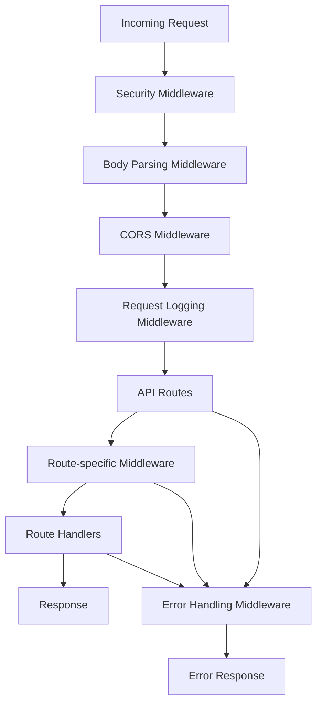
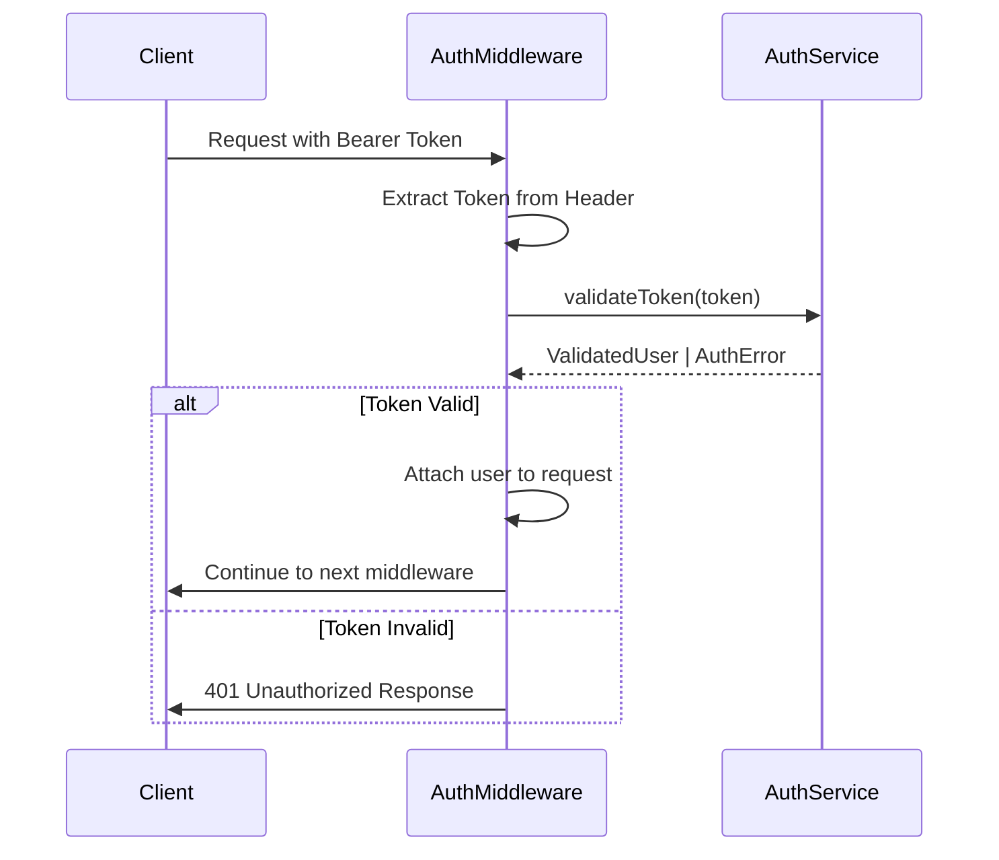
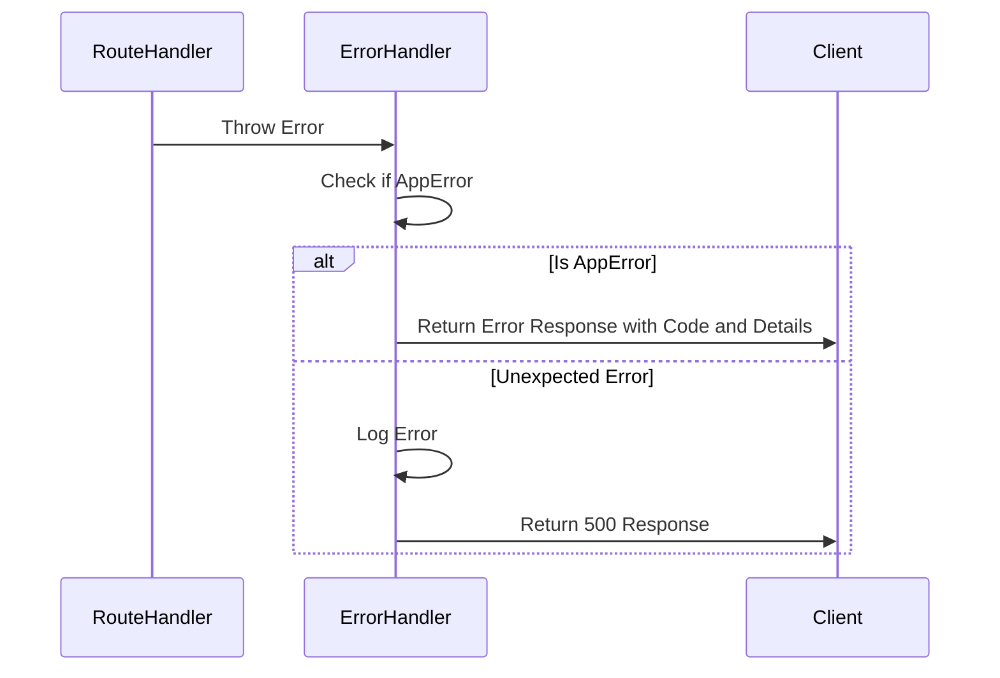
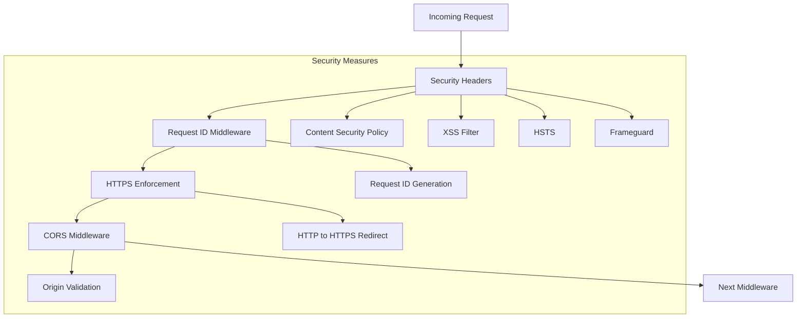

# Middleware & Interceptors

<cite>
**Referenced Files in This Document**   
- [auth-middleware.ts](file://src/middleware/auth-middleware.ts)
- [validation-middleware.ts](file://src/middleware/validation-middleware.ts)
- [error-handler.ts](file://src/middleware/error-handler.ts)
- [request-logger.ts](file://src/middleware/request-logger.ts)
- [security-middleware.ts](file://src/middleware/security-middleware.ts)
- [rate-limiter.ts](file://src/middleware/rate-limiter.ts)
- [index.ts](file://src/middleware/index.ts)
- [app.ts](file://src/app.ts)
- [auth-routes.ts](file://src/routes/auth-routes.ts)
- [project-routes.ts](file://src/routes/project-routes.ts)
- [freelancer-routes.ts](file://src/routes/freelancer-routes.ts)
</cite>

## Table of Contents
1. [Introduction](#introduction)
2. [Middleware Execution Order](#middleware-execution-order)
3. [Authentication Middleware](#authentication-middleware)
4. [Validation Middleware](#validation-middleware)
5. [Error Handling Middleware](#error-handling-middleware)
6. [Request Logger Middleware](#request-logger-middleware)
7. [Security Middleware](#security-middleware)
8. [Rate Limiter Middleware](#rate-limiter-middleware)
9. [Custom Middleware Creation](#custom-middleware-creation)
10. [Performance Implications](#performance-implications)
11. [Best Practices](#best-practices)

## Introduction
The middleware layer in FreelanceXchain's Express.js application forms a critical component of the request processing pipeline, providing essential functionality for security, validation, error handling, and observability. This document details the role and implementation of each middleware component, their execution order, and how they contribute to the overall reliability and security of the platform. The middleware architecture follows a layered approach, with security and logging middleware applied globally, while authentication, validation, and rate limiting are applied at both global and route-specific levels.

**Section sources**
- [app.ts](file://src/app.ts#L1-L87)
- [index.ts](file://src/middleware/index.ts#L1-L54)

## Middleware Execution Order
The middleware execution order in FreelanceXchain follows a specific sequence to ensure proper request processing and error handling. The order is established in the `app.ts` file, where middleware is applied to the Express application in a deliberate sequence:

1. **Security middleware** - Applied first to ensure all requests are subject to security headers, request ID generation, and HTTPS enforcement
2. **Body parsing middleware** - Processes incoming request bodies before any other middleware needs to access them
3. **CORS middleware** - Handles cross-origin resource sharing policies
4. **Request logging middleware** - Logs incoming requests before processing begins
5. **API routes** - Route-specific middleware and handlers
6. **Error handling middleware** - Applied last to catch and process any errors from previous middleware or route handlers

This execution order ensures that security measures are in place before any processing occurs, request logging captures all incoming requests, and error handling can catch exceptions from any part of the request processing pipeline.



**Diagram sources**
- [app.ts](file://src/app.ts#L18-L83)

**Section sources**
- [app.ts](file://src/app.ts#L18-L83)

## Authentication Middleware
The authentication middleware in FreelanceXchain provides JWT verification and role-based access control for protected routes. The middleware consists of two main components: `authMiddleware` for JWT token validation and `requireRole` for role-based access control.

The `authMiddleware` function validates JWT tokens from the Authorization header, checking for proper format and verifying the token's validity through the authentication service. If the token is valid, the user's information is attached to the request object for use by subsequent middleware and route handlers. If the token is invalid or missing, appropriate error responses are returned with standardized error codes.

The `requireRole` function implements role-based access control by checking if the authenticated user has the required role for a specific route. It can be configured to require one or more roles, providing flexible access control for different user types (freelancer, employer, admin).



**Diagram sources**
- [auth-middleware.ts](file://src/middleware/auth-middleware.ts#L25-L101)

**Section sources**
- [auth-middleware.ts](file://src/middleware/auth-middleware.ts#L25-L101)
- [auth-routes.ts](file://src/routes/auth-routes.ts#L160-L161)

## Validation Middleware
The validation middleware in FreelanceXchain provides comprehensive request schema checking using a custom JSON schema-based validation system. Unlike external libraries like Joi or Zod, the application implements its own validation framework that supports validation of request body, parameters, and query strings against predefined schemas.

The middleware exports a `validate` function that takes a `RequestSchema` object defining the expected structure of the request data. The schema can specify validation rules for strings (min/max length, patterns, formats), numbers (min/max values), arrays (min/max items), and objects (required properties). The validation system also handles type coercion for query parameters, converting string values to appropriate types (numbers, booleans, arrays) based on the schema definition.

The middleware exports numerous predefined schemas for different API endpoints, covering authentication, profile management, project creation, proposal submission, and other functionality. These schemas are organized by feature area and can be imported and used directly in route definitions.

```mermaid
flowchart TD
A[Incoming Request] --> B[Validation Middleware]
B --> C{Validate Body?}
C --> |Yes| D[Validate Body Against Schema]
C --> |No| E{Validate Params?}
D --> E
E --> |Yes| F[Validate Params Against Schema]
E --> |No| G{Validate Query?}
F --> G
G --> |Yes| H[Convert Query Types]
H --> I[Validate Query Against Schema]
G --> |No| J[All Valid?]
I --> J
J --> |Yes| K[Call next() Middleware]
J --> |No| L[Return 400 Response]
```

**Diagram sources**
- [validation-middleware.ts](file://src/middleware/validation-middleware.ts#L322-L361)

**Section sources**
- [validation-middleware.ts](file://src/middleware/validation-middleware.ts#L322-L815)
- [index.ts](file://src/middleware/index.ts#L8-L52)

## Error Handling Middleware
The error handling middleware provides centralized exception processing for the entire application. It catches errors thrown by route handlers and other middleware, standardizing the error response format across the API.

The middleware uses a custom `AppError` class that extends the built-in Error class, adding properties for error code, HTTP status code, and validation details. This allows for consistent error handling and response formatting. The middleware also includes a collection of factory functions for common error types, making it easy to create standardized errors throughout the application.

When an error occurs, the middleware checks if it's an instance of `AppError`. If so, it returns a response with the appropriate status code and error details. For unexpected errors, it logs the error and returns a generic 500 Internal Server Error response to prevent exposing implementation details to clients.



**Diagram sources**
- [error-handler.ts](file://src/middleware/error-handler.ts#L85-L119)

**Section sources**
- [error-handler.ts](file://src/middleware/error-handler.ts#L20-L119)
- [app.ts](file://src/app.ts#L82-L83)

## Request Logger Middleware
The request logger middleware generates audit trails for all incoming requests and outgoing responses. It creates structured JSON logs that include request and response details, enabling monitoring, debugging, and security auditing.

The middleware attaches a unique request ID to each request, either using an existing ID from the `X-Request-ID` header or generating a new UUID. This ID is included in both request and response logs, allowing for easy correlation of related log entries. The request log includes the HTTP method, path, query parameters, and timestamp, while the response log includes the status code, duration, and timestamp.

The logging is implemented using Node.js console output with JSON.stringify, creating structured logs that can be easily parsed by log aggregation systems. The middleware uses the `res.on('finish')` event to ensure response logging occurs after the response has been sent to the client.

**Section sources**
- [request-logger.ts](file://src/middleware/request-logger.ts#L4-L40)
- [app.ts](file://src/app.ts#L56-L57)

## Security Middleware
The security middleware implements multiple layers of protection to enhance the application's security posture. It consists of several components that work together to protect against common web vulnerabilities.

The middleware uses Helmet.js to set various HTTP security headers, including Content Security Policy (CSP), XSS filter, HSTS, and others. The CSP is configured to allow content only from trusted sources, preventing XSS attacks. The middleware also includes request ID generation, HTTPS enforcement in production, and CORS configuration with restricted origins.

The security middleware is applied first in the middleware chain to ensure all requests are subject to these security measures before any processing occurs. The CORS configuration includes origin validation with support for wildcard subdomains and development-time warnings for unknown origins.



**Diagram sources**
- [security-middleware.ts](file://src/middleware/security-middleware.ts#L18-L86)

**Section sources**
- [security-middleware.ts](file://src/middleware/security-middleware.ts#L1-L124)
- [app.ts](file://src/app.ts#L19-L21)

## Rate Limiter Middleware
The rate limiter middleware prevents abuse of the API by limiting the number of requests a client can make within a specified time window. It implements a memory-based rate limiting system using a Map to store request counts and reset times for each client.

The middleware provides three preset rate limiters:
- `authRateLimiter`: Limits authentication attempts to 10 per 15 minutes
- `apiRateLimiter`: Limits API requests to 100 per minute
- `sensitiveRateLimiter`: Limits sensitive operations to 5 per hour

The rate limiter identifies clients using the IP address from the `X-Forwarded-For` header (for requests behind proxies) or the direct IP address. When a client exceeds the rate limit, the middleware returns a 429 Too Many Requests response with a Retry-After header indicating when the client can try again.

The rate limiter is applied to authentication routes to prevent brute force attacks and can be applied to other sensitive endpoints as needed.

```mermaid
flowchart TD
A[Incoming Request] --> B[Rate Limiter]
B --> C{Client Exceeds Limit?}
C --> |No| D[Increment Request Count]
D --> E[Call next() Middleware]
C --> |Yes| F[Set Retry-After Header]
F --> G[Return 429 Response]
```

**Diagram sources**
- [rate-limiter.ts](file://src/middleware/rate-limiter.ts#L27-L60)

**Section sources**
- [rate-limiter.ts](file://src/middleware/rate-limiter.ts#L1-L81)
- [auth-routes.ts](file://src/routes/auth-routes.ts#L18-L19)

## Custom Middleware Creation
Creating custom middleware in FreelanceXchain follows the standard Express.js middleware pattern. Middleware functions take three parameters: request, response, and next, and can perform any processing before calling next() to continue the middleware chain.

To create custom middleware, developers should:
1. Define a function that accepts Request, Response, and NextFunction parameters
2. Perform the desired processing (validation, logging, transformation, etc.)
3. Call next() to continue the chain, or send a response to terminate it
4. Export the middleware function for use in routes

Custom middleware can be route-specific or added to the global middleware chain in app.ts. The middleware system is designed to be extensible, allowing new middleware to be added without modifying existing code.

**Section sources**
- [app.ts](file://src/app.ts#L15-L87)
- [index.ts](file://src/middleware/index.ts#L1-L54)

## Performance Implications
The middleware chaining in FreelanceXchain has several performance implications that should be considered:

1. **Execution Overhead**: Each middleware function adds processing time to the request-response cycle. The current implementation has minimal overhead as most middleware performs simple operations.

2. **Memory Usage**: The rate limiter stores request counts in memory, which could become significant under high load. For production deployments with high traffic, consider using Redis for distributed rate limiting.

3. **Error Propagation**: The centralized error handling middleware ensures consistent error responses but adds a small overhead for error checking.

4. **Security vs. Performance**: Security middleware like Helmet adds HTTP headers that increase response size slightly but provide significant security benefits.

5. **Validation Performance**: The custom validation system is efficient for typical use cases but could be optimized with schema compilation for frequently accessed endpoints.

The middleware order is optimized to minimize unnecessary processing - security and logging occur early, while more expensive operations like authentication and validation occur only when necessary.

**Section sources**
- [app.ts](file://src/app.ts#L18-L83)
- [rate-limiter.ts](file://src/middleware/rate-limiter.ts#L3-L5)

## Best Practices
The middleware implementation in FreelanceXchain follows several best practices for Express.js applications:

1. **Standardized Error Handling**: Use the centralized error handling middleware for all errors to ensure consistent response formats.

2. **Security First**: Apply security middleware at the beginning of the middleware chain to protect all routes.

3. **Reusable Validation Schemas**: Define validation schemas in the validation middleware and reuse them across routes to maintain consistency.

4. **Proper Error Propagation**: Always call next() with errors rather than sending responses directly from middleware unless terminating the request.

5. **Request ID Tracking**: Use the request ID for correlating logs and debugging issues across distributed systems.

6. **Rate Limiting Sensitive Endpoints**: Apply rate limiting to authentication and other sensitive endpoints to prevent abuse.

7. **Minimal Middleware**: Only use necessary middleware for each route to reduce processing overhead.

8. **Clear Separation of Concerns**: Each middleware should have a single responsibility (authentication, validation, logging, etc.).

9. **Consistent Response Formats**: Use standardized response formats for success and error cases across the API.

10. **Development vs. Production**: Configure middleware appropriately for different environments (e.g., CORS warnings in development, strict enforcement in production).

**Section sources**
- [app.ts](file://src/app.ts#L1-L87)
- [error-handler.ts](file://src/middleware/error-handler.ts#L20-L38)
- [security-middleware.ts](file://src/middleware/security-middleware.ts#L1-L124)