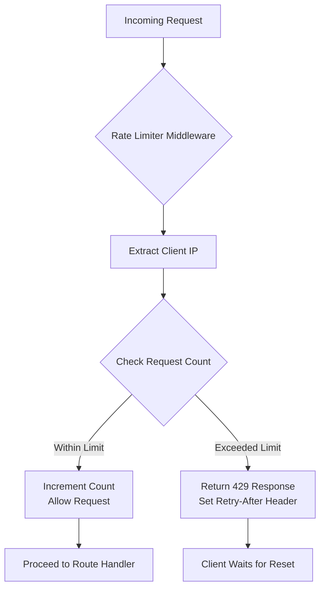
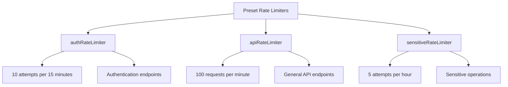
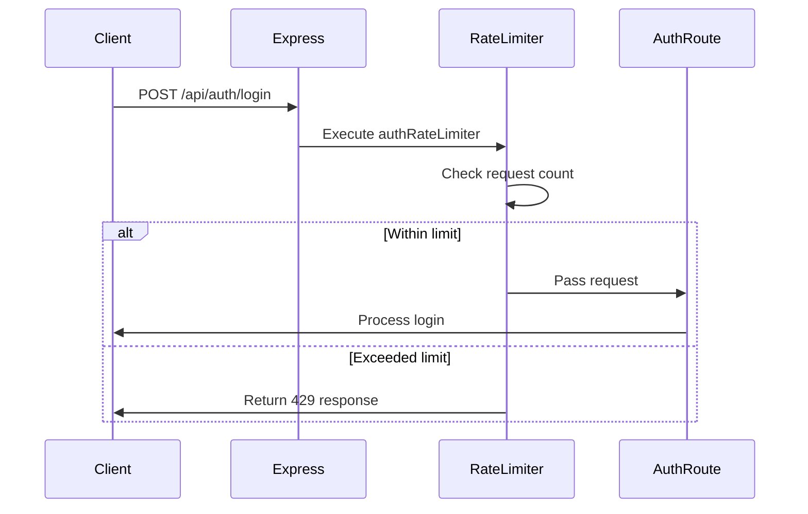
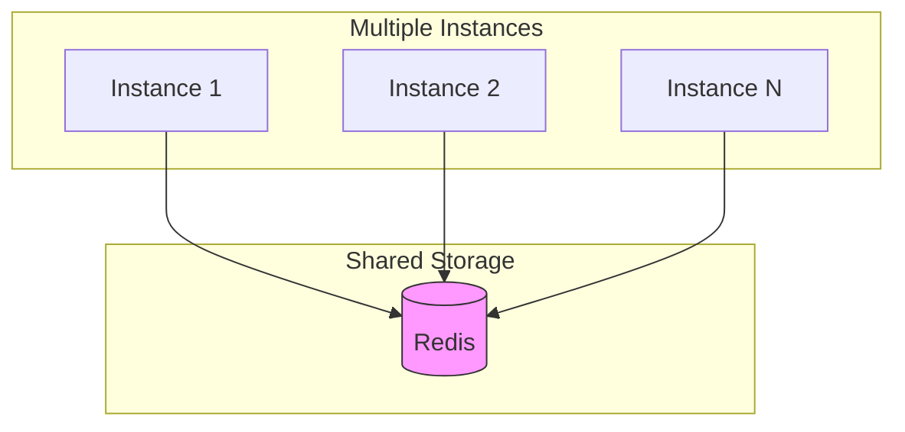

# Rate Limiting Middleware

<cite>
**Referenced Files in This Document**   
- [rate-limiter.ts](file://src/middleware/rate-limiter.ts)
- [auth-routes.ts](file://src/routes/auth-routes.ts)
- [app.ts](file://src/app.ts)
- [error-handler.ts](file://src/middleware/error-handler.ts)
- [security-middleware.ts](file://src/middleware/security-middleware.ts)
</cite>

## Table of Contents
1. [Introduction](#introduction)
2. [Implementation Overview](#implementation-overview)
3. [Core Components](#core-components)
4. [Configuration and Usage](#configuration-and-usage)
5. [Integration with Express.js](#integration-with-expressjs)
6. [Response Handling](#response-handling)
7. [Distributed Deployment Considerations](#distributed-deployment-considerations)
8. [Monitoring and Anomaly Detection](#monitoring-and-anomaly-detection)
9. [Best Practices](#best-practices)
10. [Conclusion](#conclusion)

## Introduction
The rate limiting middleware in FreelanceXchain is designed to protect the application from abuse and denial-of-service attacks by controlling the number of requests a client can make within a specified time window. This document details the implementation, configuration, and best practices for using rate limiting to secure various endpoints in the application.

**Section sources**
- [rate-limiter.ts](file://src/middleware/rate-limiter.ts#L1-L80)

## Implementation Overview
The rate limiting middleware is implemented as a custom solution using in-memory storage to track request counts. It leverages Express.js middleware patterns to intercept and evaluate incoming requests before they reach the application's business logic. The implementation supports configurable thresholds for different endpoints and uses IP-based identification to track client requests.



**Diagram sources**
- [rate-limiter.ts](file://src/middleware/rate-limiter.ts#L27-L60)

**Section sources**
- [rate-limiter.ts](file://src/middleware/rate-limiter.ts#L1-L80)

## Core Components
The rate limiting system consists of several key components that work together to enforce request limits. These include the rate limiter factory function, storage mechanism, client identification logic, and preset configurations for different use cases.

### Rate Limiter Factory
The core of the implementation is the `rateLimiter` factory function that creates middleware instances with specific configurations. This function accepts a name and configuration object to define the rate limiting behavior.

**Section sources**
- [rate-limiter.ts](file://src/middleware/rate-limiter.ts#L27-L60)

### Storage Mechanism
The implementation uses an in-memory Map-based storage system to track request counts. The storage is organized by rate limiter name, with each name having its own Map that stores client keys and their request counts with reset times.

```mermaid
classDiagram
class RateLimitStore {
+Map<string, { count : number, resetTime : number }> store
}
class RateLimiter {
+string name
+RateLimitConfig config
+function rateLimiter(name, config)
+function getStore(name)
+function getClientKey(req)
}
class RateLimitConfig {
+number windowMs
+number maxRequests
+string message
}
RateLimiter --> RateLimitStore : "uses"
RateLimiter --> RateLimitConfig : "configures"
```

**Diagram sources**
- [rate-limiter.ts](file://src/middleware/rate-limiter.ts#L3-L18)

**Section sources**
- [rate-limiter.ts](file://src/middleware/rate-limiter.ts#L3-L18)

### Client Identification
The middleware identifies clients using IP addresses, with special handling for requests that pass through proxies. It checks the X-Forwarded-For header to obtain the original client IP when the application is behind a reverse proxy.

**Section sources**
- [rate-limiter.ts](file://src/middleware/rate-limiter.ts#L20-L24)

## Configuration and Usage
The rate limiting middleware provides preset configurations for different security requirements. These presets are exported as ready-to-use middleware functions that can be applied to specific routes.

### Preset Configurations
FreelanceXchain includes three preset rate limiters with different thresholds for various use cases:



**Diagram sources**
- [rate-limiter.ts](file://src/middleware/rate-limiter.ts#L63-L80)

**Section sources**
- [rate-limiter.ts](file://src/middleware/rate-limiter.ts#L63-L80)

### Configuration Parameters
Each rate limiter configuration includes the following parameters:

| Parameter | Description | Example Value |
|---------|-----------|-------------|
| windowMs | Time window in milliseconds | 900000 (15 minutes) |
| maxRequests | Maximum number of requests allowed | 10 |
| message | Custom error message | "Too many authentication attempts" |

## Integration with Express.js
The rate limiting middleware is integrated into the Express.js application through route-level middleware application. It is specifically applied to authentication endpoints to prevent brute-force attacks.

### Route Integration
The middleware is imported and applied to specific routes in the authentication routes file. This targeted approach ensures that rate limiting is applied where it's most needed.



**Diagram sources**
- [auth-routes.ts](file://src/routes/auth-routes.ts#L159-L160)
- [rate-limiter.ts](file://src/middleware/rate-limiter.ts#L27-L60)

**Section sources**
- [auth-routes.ts](file://src/routes/auth-routes.ts#L159-L160)

### Middleware Chain
The rate limiter is part of a larger middleware chain that includes security headers, request ID generation, and CORS handling. It is positioned early in the chain to prevent unnecessary processing of rate-limited requests.

**Section sources**
- [app.ts](file://src/app.ts#L15-L87)

## Response Handling
When a client exceeds the rate limit, the middleware returns a standardized response with appropriate HTTP status codes and headers to inform the client of the situation.

### HTTP 429 Response
The middleware returns HTTP 429 (Too Many Requests) status code when the rate limit is exceeded. This standard status code is widely recognized by clients and intermediary systems.

**Section sources**
- [rate-limiter.ts](file://src/middleware/rate-limiter.ts#L46-L54)

### Retry-After Header
The response includes a Retry-After header that indicates how many seconds the client should wait before making another request. This helps clients implement exponential backoff strategies.

**Section sources**
- [rate-limiter.ts](file://src/middleware/rate-limiter.ts#L44-L45)

### Response Structure
The JSON response body includes detailed information about the rate limit violation:

```json
{
  "error": {
    "code": "RATE_LIMIT_EXCEEDED",
    "message": "Too many requests, please try again later"
  },
  "retryAfter": 300,
  "timestamp": "2023-11-20T10:00:00.000Z",
  "requestId": "abc123"
}
```

**Section sources**
- [rate-limiter.ts](file://src/middleware/rate-limiter.ts#L46-L54)

## Distributed Deployment Considerations
While the current implementation uses in-memory storage, distributed deployments would require a shared storage solution to maintain consistent rate limiting across multiple instances.

### Current Limitations
The in-memory storage approach works well for single-instance deployments but has limitations in distributed environments where requests may be handled by different instances.

**Section sources**
- [rate-limiter.ts](file://src/middleware/rate-limiter.ts#L5-L6)

### Redis Integration Opportunity
For distributed deployments, the implementation could be extended to use Redis as a shared storage backend. This would ensure consistent rate limiting across all instances in a cluster.



**Diagram sources**
- [rate-limiter.ts](file://src/middleware/rate-limiter.ts#L3-L6)

## Monitoring and Anomaly Detection
The rate limiting system contributes to overall application security by helping to identify and mitigate potential abuse patterns.

### Request Pattern Analysis
By monitoring rate limit violations, administrators can identify potential attack patterns or abusive clients that may require further investigation.

**Section sources**
- [rate-limiter.ts](file://src/middleware/rate-limiter.ts#L35-L56)

### Logging Integration
The rate limiter works in conjunction with the request logging middleware to provide comprehensive visibility into client behavior and potential abuse attempts.

**Section sources**
- [request-logger.ts](file://src/middleware/request-logger.ts#L1-L40)
- [rate-limiter.ts](file://src/middleware/rate-limiter.ts#L27-L60)

## Best Practices
The implementation follows several best practices for effective rate limiting and security.

### Endpoint-Specific Limits
Different endpoints have different rate limiting requirements. Authentication routes have stricter limits than general API endpoints to prevent brute-force attacks.

**Section sources**
- [rate-limiter.ts](file://src/middleware/rate-limiter.ts#L63-L80)

### Protection of Authentication Routes
Authentication routes are specifically protected with rate limiting to prevent credential stuffing and brute-force attacks on user accounts.

**Section sources**
- [auth-routes.ts](file://src/routes/auth-routes.ts#L159-L160)

### Clear Error Messaging
The rate limiter provides clear, informative error messages that help legitimate clients understand why their requests were rejected and when they can try again.

**Section sources**
- [rate-limiter.ts](file://src/middleware/rate-limiter.ts#L48-L50)

### Request ID Correlation
Each rate limit response includes a request ID that can be used to correlate logs and troubleshoot issues, improving observability and debugging capabilities.

**Section sources**
- [rate-limiter.ts](file://src/middleware/rate-limiter.ts#L53-L54)

## Conclusion
The rate limiting middleware in FreelanceXchain provides an effective defense against abuse and denial-of-service attacks. By implementing configurable rate limits on critical endpoints, particularly authentication routes, the system protects against brute-force attacks and ensures fair usage of API resources. While the current in-memory implementation is suitable for single-instance deployments, the architecture could be extended to support distributed environments through shared storage solutions like Redis. The middleware's integration with standard HTTP practices, including proper status codes and headers, ensures compatibility with clients and intermediary systems.