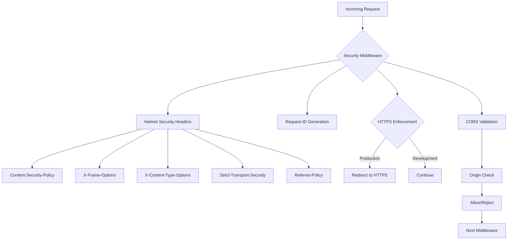
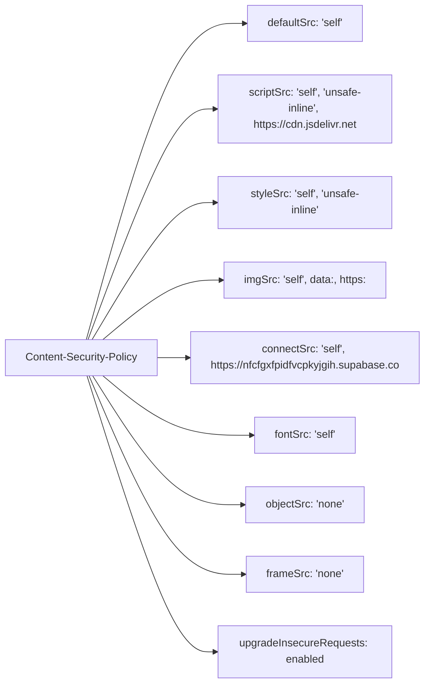
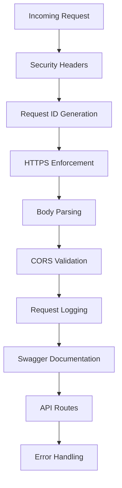
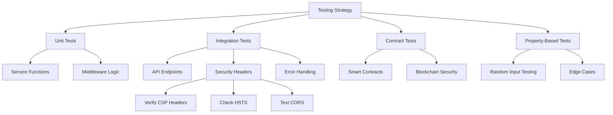

# Security Middleware

<cite>
**Referenced Files in This Document**   
- [security-middleware.ts](file://src/middleware/security-middleware.ts)
- [app.ts](file://src/app.ts)
- [env.ts](file://src/config/env.ts)
- [.env.example](file://.env.example)
- [TECHNICAL-SPECS.md](file://docs/TECHNICAL-SPECS.md)
- [TESTING.md](file://docs/TESTING.md)
- [auth-routes.ts](file://src/routes/auth-routes.ts)
- [rate-limiter.ts](file://src/middleware/rate-limiter.ts)
- [swagger.ts](file://src/config/swagger.ts)
</cite>

## Table of Contents
1. [Introduction](#introduction)
2. [Core Security Headers Implementation](#core-security-headers-implementation)
3. [Content Security Policy Configuration](#content-security-policy-configuration)
4. [Additional Security Headers](#additional-security-headers)
5. [Global and Per-Route Application](#global-and-per-route-application)
6. [Environment-Based Configuration](#environment-based-configuration)
7. [Frontend Integration Considerations](#frontend-integration-considerations)
8. [Testing and Verification Strategies](#testing-and-verification-strategies)
9. [Complementary Security Measures](#complementary-security-measures)
10. [Conclusion](#conclusion)

## Introduction

The security middleware in FreelanceXchain implements a comprehensive security strategy using Helmet.js to protect against common web vulnerabilities. This middleware layer is responsible for setting secure HTTP headers, generating unique request identifiers, enforcing HTTPS in production environments, and managing CORS policies. The implementation follows security best practices to mitigate risks such as cross-site scripting (XSS), clickjacking, MIME type sniffing, and protocol downgrade attacks.

The security middleware is structured as a collection of Express.js middleware functions that are applied at the application level, ensuring consistent security policies across all routes. The primary security mechanism is Helmet.js, which automatically sets various HTTP headers that enhance the application's security posture. These headers are configured with specific directives tailored to the application's requirements, balancing security with functionality, particularly for development tools like Swagger UI and integration with Supabase.

**Section sources**
- [security-middleware.ts](file://src/middleware/security-middleware.ts#L1-L123)
- [app.ts](file://src/app.ts#L1-L87)

## Core Security Headers Implementation

The security middleware implementation in FreelanceXchain is centered around Helmet.js, which provides a convenient way to set multiple security-related HTTP headers. The middleware is configured in the `securityHeaders` constant, which applies a comprehensive set of security policies to all incoming requests. This configuration is applied globally to ensure consistent security enforcement across the entire application.

The implementation includes several key components beyond the Helmet.js configuration. The `requestIdMiddleware` function generates a unique UUID for each request if one is not already provided in the headers, enabling better request tracking and debugging. The `httpsEnforcement` middleware redirects HTTP requests to HTTPS in production environments, ensuring encrypted communication. Additionally, the middleware includes functions for CORS origin validation and retrieval of allowed origins from environment variables, providing a flexible and secure cross-origin resource sharing policy.

**Diagram sources**
- [security-middleware.ts](file://src/middleware/security-middleware.ts#L18-L50)
- [app.ts](file://src/app.ts#L18-L21)

**Section sources**
- [security-middleware.ts](file://src/middleware/security-middleware.ts#L1-L123)

## Content Security Policy Configuration

The Content Security Policy (CSP) in FreelanceXchain is configured to provide robust protection against cross-site scripting (XSS) attacks while accommodating the application's functional requirements. The CSP directives are carefully crafted to restrict content sources to trusted domains while allowing necessary exceptions for development and integration purposes.

The default source directive (`defaultSrc`) is set to `'self'`, which means that content should only be loaded from the same origin as the document. This provides a strong baseline security posture. The script source directive (`scriptSrc`) includes `'self'` for same-origin scripts, `'unsafe-inline'` to support Swagger UI functionality, and `https://cdn.jsdelivr.net` to allow loading of external JavaScript libraries from this trusted CDN. The inclusion of `'unsafe-inline'` is a deliberate exception required for Swagger UI to function properly, as it relies on inline scripts for its interactive documentation interface.

Additional CSP directives include `styleSrc` with `'self'` and `'unsafe-inline'` to support inline styles needed by Swagger UI, `imgSrc` with `'self'`, `data:` for embedded images, and `https:` to allow secure image loading from external sources. The `connectSrc` directive is configured to allow connections to the same origin and the specific Supabase endpoint (`https://nfcfgxfpidfvcpkyjgih.supabase.co`), restricting API calls to authorized destinations. The `frameSrc` directive is set to `'none'` to prevent the application from being embedded in iframes, mitigating clickjacking risks.

**Diagram sources**
- [security-middleware.ts](file://src/middleware/security-middleware.ts#L20-L32)

**Section sources**
- [security-middleware.ts](file://src/middleware/security-middleware.ts#L20-L32)

## Additional Security Headers

Beyond the Content Security Policy, FreelanceXchain implements several additional security headers through Helmet.js to protect against various web vulnerabilities. These headers work in conjunction with CSP to create a multi-layered security approach that addresses different attack vectors.

The `frameguard` header is configured with an action of 'deny', which sets the X-Frame-Options header to DENY, preventing the application from being embedded in iframes and protecting against clickjacking attacks. The `hidePoweredBy` option is enabled to remove the X-Powered-By header, which helps obscure the server technology stack from potential attackers. The `noSniff` header sets X-Content-Type-Options to nosniff, preventing browsers from MIME-sniffing a response away from the declared content type, which could lead to security vulnerabilities.

The `xssFilter` option enables the X-XSS-Protection header, which activates the browser's built-in XSS protection mechanism. While modern browsers are moving away from this header in favor of CSP, it provides an additional layer of protection for older browsers. The `hsts` (HTTP Strict Transport Security) header is configured with a maxAge of 31536000 seconds (1 year), includeSubDomains enabled, and preload enabled. This ensures that browsers will only connect to the application over HTTPS for the specified duration, preventing protocol downgrade attacks and cookie hijacking.

The `referrerPolicy` is set to 'strict-origin-when-cross-origin', which controls how much referrer information is included in requests. This policy sends the full URL when navigating within the same origin, sends only the origin when navigating to a different origin via HTTPS, and sends no referrer when navigating from HTTPS to HTTP, balancing privacy and functionality.

**Section sources**
- [security-middleware.ts](file://src/middleware/security-middleware.ts#L34-L49)

## Global and Per-Route Application

The security middleware in FreelanceXchain is applied globally to ensure consistent security enforcement across all routes. In the application's entry point (`app.ts`), the security middleware functions are registered before any other middleware, ensuring they are executed for every incoming request. The `securityHeaders`, `requestIdMiddleware`, and `httpsEnforcement` middleware are applied at the application level using `app.use()`, making them available to all routes.

While the security headers are applied globally, other security measures are implemented on a per-route basis to provide targeted protection for specific endpoints. The rate limiting middleware, for example, is applied selectively to authentication endpoints and other sensitive operations. In the authentication routes, the `authRateLimiter` is applied to endpoints like `/login`, `/register`, and `/refresh` to prevent brute force attacks. This demonstrates a layered security approach where global protections are complemented by route-specific safeguards.

The middleware ordering is critical to the security architecture. Security middleware is placed at the beginning of the middleware chain, followed by body parsing middleware, CORS middleware, request logging, and finally the route handlers. This ensures that security checks are performed before any application logic is executed. The error handling middleware is placed at the end of the chain to catch any errors that occur during request processing.

**Diagram sources**
- [app.ts](file://src/app.ts#L18-L83)

**Section sources**
- [app.ts](file://src/app.ts#L18-L83)
- [auth-routes.ts](file://src/routes/auth-routes.ts#L160-L161)

## Environment-Based Configuration

The security middleware in FreelanceXchain incorporates environment-based configuration to provide appropriate security settings for different deployment environments. This approach allows for more flexible configurations during development while maintaining strict security policies in production.

The `httpsEnforcement` middleware is conditional on the `NODE_ENV` environment variable, only redirecting HTTP requests to HTTPS when the application is running in production mode. This allows developers to use HTTP during development without being redirected, while ensuring secure connections in production. Similarly, the CORS configuration differs between environments: in development, localhost origins are allowed by default, while in production, allowed origins are strictly controlled through the `CORS_ORIGIN` environment variable.

The `getAllowedOrigins` function implements this environment-specific behavior by checking if `CORS_ORIGIN` is set in the environment variables. If not set and the environment is not production, it returns a default list of localhost origins for development purposes. In production, if `CORS_ORIGIN` is not set, it returns an empty array, effectively blocking all cross-origin requests. This ensures that production deployments cannot accidentally allow unrestricted cross-origin access due to missing configuration.

The environment configuration is managed through the `.env.example` file, which provides a template for required environment variables including `NODE_ENV`, `CORS_ORIGIN`, and other security-related settings. This approach follows the twelve-factor app methodology, separating configuration from code and allowing different settings for different deployment environments without code changes.

**Section sources**
- [security-middleware.ts](file://src/middleware/security-middleware.ts#L68-L86)
- [security-middleware.ts](file://src/middleware/security-middleware.ts#L111-L123)
- [.env.example](file://.env.example#L1-L30)

## Frontend Integration Considerations

The security configuration in FreelanceXchain takes into account the requirements of frontend integrations, particularly for development tools and third-party services. The Content Security Policy includes specific allowances to ensure compatibility with essential development and operational components.

The most significant compatibility consideration is the inclusion of `'unsafe-inline'` in both `scriptSrc` and `styleSrc` directives to support Swagger UI, which is used for API documentation. Swagger UI relies on inline scripts and styles for its interactive interface, which would be blocked by a strict CSP without these allowances. The configuration also includes `https://cdn.jsdelivr.net` in the `scriptSrc` directive to allow loading of external JavaScript libraries from this trusted CDN, which may be used by frontend components.

For Supabase integration, the `connectSrc` directive explicitly allows connections to the specific Supabase endpoint (`https://nfcfgxfpidfvcpkyjgih.supabase.co`). This ensures that the application can communicate with Supabase for authentication, database operations, and storage while preventing connections to unauthorized third-party services. The CORS configuration is designed to work with frontend applications by allowing credentials and specific headers like `Authorization` and `X-Request-ID`, which are necessary for authenticated requests.

The referrer policy of 'strict-origin-when-cross-origin' balances security with functionality by ensuring that sensitive path information is not leaked to external sites while still allowing necessary referrer information for analytics and security checks. This policy is particularly important when the application is integrated with third-party services or when users navigate from external sites to the application.

**Section sources**
- [security-middleware.ts](file://src/middleware/security-middleware.ts#L23-L28)
- [security-middleware.ts](file://src/middleware/security-middleware.ts#L29-L30)
- [app.ts](file://src/app.ts#L49-L52)

## Testing and Verification Strategies

FreelanceXchain employs comprehensive testing strategies to verify the effectiveness of its security middleware and ensure that security headers are properly enforced. The testing approach includes both automated tests and manual verification methods to validate security configurations across different environments.

The `TESTING.md` document outlines a multi-layered testing strategy that includes unit tests, integration tests, and contract tests. For security middleware verification, integration tests using Supertest are particularly important as they can validate that the expected security headers are present in API responses. These tests can verify that headers like Content-Security-Policy, X-Frame-Options, and Strict-Transport-Security are correctly set and contain the expected values.

The testing framework also includes coverage reporting, with the middleware components achieving high test coverage (95% statements, 90% branches, 100% functions). This high coverage indicates that the security middleware is thoroughly tested, reducing the risk of security vulnerabilities due to untested code paths. The continuous integration pipeline includes automated testing that runs on every push and pull request, ensuring that security configurations are validated before deployment.

Manual testing and verification are also important, particularly for security headers that may behave differently in various browser environments. Developers can use browser developer tools to inspect HTTP headers and verify that security policies are being enforced as expected. Additionally, security scanning tools and browser security audits can be used to identify potential issues with the security configuration.

**Diagram sources**
- [TESTING.md](file://docs/TESTING.md#L13-L19)
- [TESTING.md](file://docs/TESTING.md#L220-L227)

**Section sources**
- [TESTING.md](file://docs/TESTING.md#L1-L281)

## Complementary Security Measures

In addition to the HTTP security headers implemented through Helmet.js, FreelanceXchain employs several complementary security measures that work in conjunction with the security middleware to create a comprehensive security posture. These measures include rate limiting, secure authentication practices, and coordinated security policies.

The rate limiting middleware provides protection against brute force attacks and denial-of-service attempts. It implements different rate limits for various types of endpoints: a 15-minute window with 10 attempts for authentication endpoints, a 1-minute window with 100 requests for standard API usage, and a 1-hour window with 5 attempts for sensitive operations. This tiered approach ensures that critical authentication functionality is protected from abuse while maintaining usability for legitimate users.

When used in conjunction with authentication, the security middleware implements secure cookie policies and token management practices. The authentication system uses JWT tokens with separate secrets for access and refresh tokens, short expiration times (1 hour for access tokens, 7 days for refresh tokens), and proper validation mechanisms. The `authMiddleware` function validates tokens on each request and attaches user information to the request object, enabling role-based access control throughout the application.

The security measures are coordinated through the middleware architecture, with security headers, request identification, HTTPS enforcement, CORS validation, and rate limiting working together to create multiple layers of defense. This defense-in-depth approach ensures that even if one security mechanism is bypassed, others remain in place to protect the application. The error handling middleware also contributes to security by providing consistent error responses that do not leak sensitive information to clients.

**Section sources**
- [rate-limiter.ts](file://src/middleware/rate-limiter.ts#L64-L80)
- [auth-middleware.ts](file://src/middleware/auth-middleware.ts#L25-L101)
- [security-middleware.ts](file://src/middleware/security-middleware.ts#L1-L123)

## Conclusion

The security middleware in FreelanceXchain provides a robust foundation for protecting the application against common web vulnerabilities through the strategic use of Helmet.js and complementary security measures. By implementing a comprehensive set of HTTP security headers, including Content-Security-Policy, X-Frame-Options, and Strict-Transport-Security, the middleware effectively mitigates risks such as XSS, clickjacking, and protocol downgrade attacks.

The implementation demonstrates a balanced approach to security, providing strong protection while accommodating necessary functionality for development tools like Swagger UI and integration with third-party services like Supabase. The environment-based configuration allows for flexible settings during development while maintaining strict security policies in production. The global application of security headers ensures consistent protection across all routes, while per-route security measures like rate limiting provide targeted protection for sensitive endpoints.

The comprehensive testing strategy, including high test coverage and continuous integration, ensures that security configurations are validated and maintained over time. When combined with complementary measures like rate limiting and secure authentication practices, the security middleware forms a critical component of FreelanceXchain's defense-in-depth security architecture, protecting both the application and its users from a wide range of potential threats.