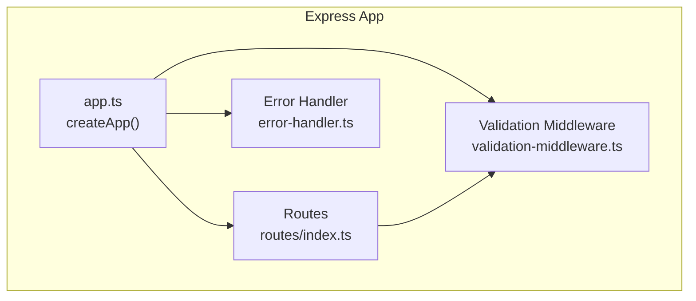
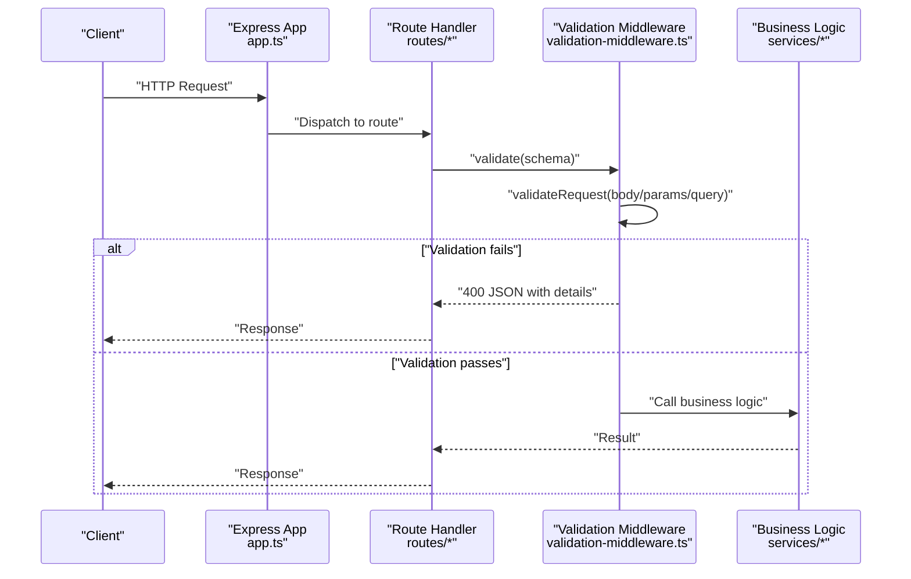
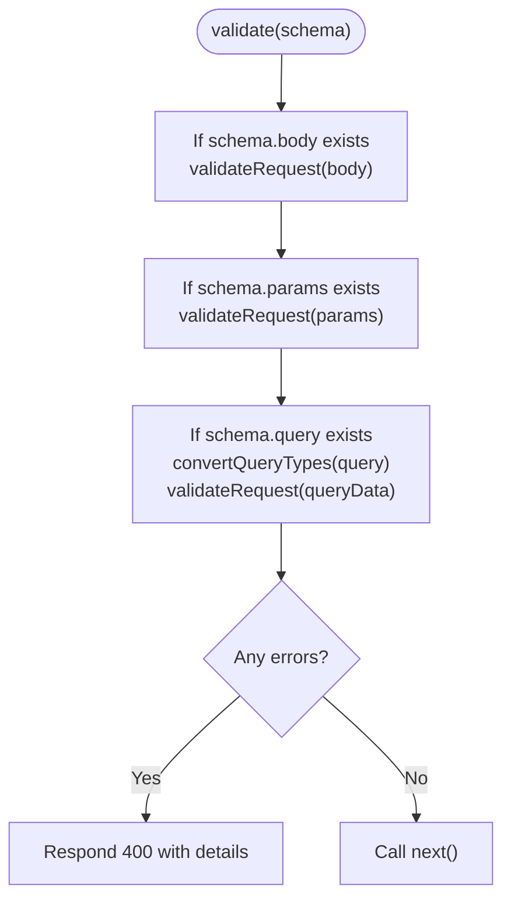
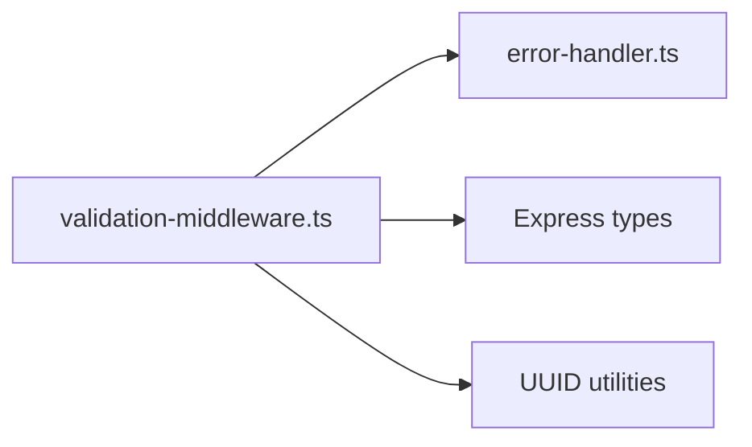

# Validation Middleware

<cite>
**Referenced Files in This Document**
- [validation-middleware.ts](file://src/middleware/validation-middleware.ts)
- [index.ts](file://src/middleware/index.ts)
- [error-handler.ts](file://src/middleware/error-handler.ts)
- [app.ts](file://src/app.ts)
- [auth-routes.ts](file://src/routes/auth-routes.ts)
- [project-routes.ts](file://src/routes/project-routes.ts)
- [proposal-routes.ts](file://src/routes/proposal-routes.ts)
- [freelancer-routes.ts](file://src/routes/freelancer-routes.ts)
</cite>

## Table of Contents
1. [Introduction](#introduction)
2. [Project Structure](#project-structure)
3. [Core Components](#core-components)
4. [Architecture Overview](#architecture-overview)
5. [Detailed Component Analysis](#detailed-component-analysis)
6. [Dependency Analysis](#dependency-analysis)
7. [Performance Considerations](#performance-considerations)
8. [Troubleshooting Guide](#troubleshooting-guide)
9. [Conclusion](#conclusion)
10. [Appendices](#appendices)

## Introduction
This document explains the validation middleware used in FreelanceXchain to enforce strict, schema-driven validation of incoming HTTP requests. It covers how the middleware validates request bodies, URL parameters, and query parameters against JSON-like schemas, aggregates and formats validation errors, and integrates seamlessly with Express.js. It also provides practical examples from the codebase for user registration, project creation, and proposal submission, along with guidance on extending the middleware for custom rules and handling edge cases.

## Project Structure
The validation middleware is implemented as a standalone module and exported via a barrel file. It is integrated into the Express application pipeline and used by route handlers to validate inputs before business logic executes.

**Diagram sources**
- [app.ts](file://src/app.ts#L1-L87)
- [index.ts](file://src/routes/index.ts#L1-L91)
- [validation-middleware.ts](file://src/middleware/validation-middleware.ts#L1-L814)
- [error-handler.ts](file://src/middleware/error-handler.ts#L1-L119)

**Section sources**
- [app.ts](file://src/app.ts#L1-L87)
- [index.ts](file://src/routes/index.ts#L1-L91)

## Core Components
- Request validation engine: A JSON-schema-like validator that checks types, formats, enums, lengths, numeric bounds, arrays, and nested objects.
- Request schema types: Structured definitions for body, params, and query segments.
- Validation middleware factory: A function that produces Express middleware to validate the request according to a given schema.
- UUID validation helpers: Utility functions and middleware to validate UUID parameters.
- Predefined request schemas: Reusable schemas for common endpoints (auth, profiles, projects, proposals, etc.).

Key responsibilities:
- Enforce data integrity before business logic runs.
- Aggregate all validation errors and return a unified HTTP 400 response with structured details.
- Support optional fields, nested objects, arrays, and typed query parameters.

**Section sources**
- [validation-middleware.ts](file://src/middleware/validation-middleware.ts#L1-L814)
- [index.ts](file://src/middleware/index.ts#L1-L54)

## Architecture Overview
The validation middleware sits in the Express pipeline and is invoked by route handlers. It validates the request payload and returns a standardized error response when validation fails.

**Diagram sources**
- [app.ts](file://src/app.ts#L1-L87)
- [validation-middleware.ts](file://src/middleware/validation-middleware.ts#L319-L362)
- [auth-routes.ts](file://src/routes/auth-routes.ts#L160-L235)
- [project-routes.ts](file://src/routes/project-routes.ts#L271-L332)
- [proposal-routes.ts](file://src/routes/proposal-routes.ts#L97-L153)

## Detailed Component Analysis

### Validation Engine and Types
The engine defines a compact schema model and a recursive validator that enforces:
- Type matching (including integer promotion).
- String constraints (min/max length, regex pattern, formats like email/date/uuid/uri).
- Numeric constraints (minimum/maximum).
- Enum constraints.
- Array constraints (min/max items, recursive item validation).
- Nested object constraints (required properties, recursive property validation).

It also converts query string values to appropriate types (numbers, booleans, arrays) before validation.

**Diagram sources**
- [validation-middleware.ts](file://src/middleware/validation-middleware.ts#L319-L362)
- [validation-middleware.ts](file://src/middleware/validation-middleware.ts#L364-L394)

**Section sources**
- [validation-middleware.ts](file://src/middleware/validation-middleware.ts#L1-L219)
- [validation-middleware.ts](file://src/middleware/validation-middleware.ts#L222-L277)
- [validation-middleware.ts](file://src/middleware/validation-middleware.ts#L279-L318)
- [validation-middleware.ts](file://src/middleware/validation-middleware.ts#L319-L362)
- [validation-middleware.ts](file://src/middleware/validation-middleware.ts#L364-L394)

### Error Aggregation and Formatting
All validation errors are collected into a flat array with fields indicating the offending path and message. On failure, the middleware responds with HTTP 400 and a standardized error envelope containing:
- A code.
- A human-readable message.
- An array of validation errors.
- Timestamp and request ID for observability.

This structure aligns with the shared error handler’s response shape.

**Section sources**
- [validation-middleware.ts](file://src/middleware/validation-middleware.ts#L347-L358)
- [error-handler.ts](file://src/middleware/error-handler.ts#L1-L18)

### Express Integration
The middleware is exported via the middleware barrel and used by routes. It is placed before route handlers so that invalid requests are rejected early.

- Exported via the middleware barrel for convenient imports.
- Used in routes to validate request bodies, params, and query parameters.

**Section sources**
- [index.ts](file://src/middleware/index.ts#L1-L54)
- [auth-routes.ts](file://src/routes/auth-routes.ts#L160-L235)
- [project-routes.ts](file://src/routes/project-routes.ts#L199-L215)
- [proposal-routes.ts](file://src/routes/proposal-routes.ts#L188-L204)
- [freelancer-routes.ts](file://src/routes/freelancer-routes.ts#L106-L125)

### UUID Validation Helpers
Two utilities support UUID enforcement:
- A reusable schema for validating a single UUID parameter.
- A middleware that checks one or more named parameters for UUID validity and returns a 400 response with details if invalid.

These are commonly used for ID-based endpoints.

**Section sources**
- [validation-middleware.ts](file://src/middleware/validation-middleware.ts#L757-L814)
- [project-routes.ts](file://src/routes/project-routes.ts#L199-L215)
- [proposal-routes.ts](file://src/routes/proposal-routes.ts#L188-L204)
- [freelancer-routes.ts](file://src/routes/freelancer-routes.ts#L106-L125)

### Concrete Examples from the Codebase

#### User Registration
- Schema: Defines required fields and formats for email, password, role, and optional wallet address.
- Example usage: The route validates inputs and returns a 400 response with aggregated errors when validation fails.

References:
- [registerSchema](file://src/middleware/validation-middleware.ts#L401-L414)
- [auth-routes.ts](file://src/routes/auth-routes.ts#L160-L235)

**Section sources**
- [validation-middleware.ts](file://src/middleware/validation-middleware.ts#L401-L414)
- [auth-routes.ts](file://src/routes/auth-routes.ts#L160-L235)

#### Project Creation
- Schema: Validates title, description, requiredSkills array entries, budget, and deadline.
- Example usage: The route validates inputs and returns a 400 response with aggregated errors when validation fails.

References:
- [createProjectSchema](file://src/middleware/validation-middleware.ts#L520-L542)
- [project-routes.ts](file://src/routes/project-routes.ts#L271-L332)

**Section sources**
- [validation-middleware.ts](file://src/middleware/validation-middleware.ts#L520-L542)
- [project-routes.ts](file://src/routes/project-routes.ts#L271-L332)

#### Proposal Submission
- Schema: Validates projectId, coverLetter, proposedRate, and estimatedDuration.
- Example usage: The route validates inputs and returns a 400 response with aggregated errors when validation fails.

References:
- [submitProposalSchema](file://src/middleware/validation-middleware.ts#L591-L604)
- [proposal-routes.ts](file://src/routes/proposal-routes.ts#L97-L153)

**Section sources**
- [validation-middleware.ts](file://src/middleware/validation-middleware.ts#L591-L604)
- [proposal-routes.ts](file://src/routes/proposal-routes.ts#L97-L153)

### Extensibility and Custom Rules
The middleware is designed to be extensible:
- Add new formats by extending the format validation function.
- Add new constraints by adding new branches in the property validator.
- Introduce custom validators by composing the existing engine with additional checks in route handlers.

Guidance:
- Keep custom rules close to the route where they apply.
- Prefer reusing the shared error envelope for consistency.

**Section sources**
- [validation-middleware.ts](file://src/middleware/validation-middleware.ts#L241-L277)
- [validation-middleware.ts](file://src/middleware/validation-middleware.ts#L71-L164)

## Dependency Analysis
The validation middleware depends on:
- Express types for request/response handling.
- A shared error type definition for consistent error responses.
- Optional UUID utilities for parameter validation.

**Diagram sources**
- [validation-middleware.ts](file://src/middleware/validation-middleware.ts#L1-L12)
- [error-handler.ts](file://src/middleware/error-handler.ts#L1-L18)

**Section sources**
- [validation-middleware.ts](file://src/middleware/validation-middleware.ts#L1-L12)
- [error-handler.ts](file://src/middleware/error-handler.ts#L1-L18)

## Performance Considerations
- Synchronous validation: The validator performs synchronous checks and returns immediately. This is efficient for typical request sizes and keeps latency predictable.
- Query conversion cost: Converting query strings to typed values is linear in the number of query keys and negligible overhead.
- Error aggregation: Collecting all errors avoids partial failures and reduces round-trips to clients.
- Recommendations:
  - Keep schemas concise and targeted to reduce traversal cost.
  - Avoid overly deep nesting in schemas to minimize recursion depth.
  - Use enums and formats judiciously to balance correctness and performance.

[No sources needed since this section provides general guidance]

## Troubleshooting Guide
Common issues and resolutions:
- Unexpected 400 responses: Inspect the error details array to identify the failing field and message.
- UUID parameter errors: Ensure the parameter is a valid UUID; the middleware returns a 400 with details.
- Query parameter type mismatches: Confirm the query values match the expected types; the middleware converts strings to numbers, booleans, and arrays.

Where to look:
- Validation middleware error response shape and details.
- UUID validation middleware for parameter-level UUID checks.
- Route handlers that bypass the schema-based validator and perform manual checks.

**Section sources**
- [validation-middleware.ts](file://src/middleware/validation-middleware.ts#L347-L358)
- [validation-middleware.ts](file://src/middleware/validation-middleware.ts#L798-L813)
- [auth-routes.ts](file://src/routes/auth-routes.ts#L160-L235)
- [project-routes.ts](file://src/routes/project-routes.ts#L271-L332)
- [proposal-routes.ts](file://src/routes/proposal-routes.ts#L97-L153)

## Conclusion
The validation middleware provides robust, schema-driven input validation across request bodies, URL parameters, and query parameters. It aggregates errors, returns consistent responses, and integrates cleanly with Express. The predefined schemas cover common use cases, while the underlying engine supports extension for custom rules. Together with the error handler, it ensures data integrity and improves developer experience by surfacing actionable validation feedback.

[No sources needed since this section summarizes without analyzing specific files]

## Appendices

### How to Define Reusable Validation Schemas
- Define a RequestSchema with body, params, and/or query segments.
- Use required arrays to mark mandatory fields.
- Leverage formats (email, date, date-time, uri, uuid) and enums for strong typing.
- For nested structures, define properties and requiredProperties.
- For arrays, specify minItems and items schemas.

Examples in the codebase:
- [registerSchema](file://src/middleware/validation-middleware.ts#L401-L414)
- [createProjectSchema](file://src/middleware/validation-middleware.ts#L520-L542)
- [submitProposalSchema](file://src/middleware/validation-middleware.ts#L591-L604)

**Section sources**
- [validation-middleware.ts](file://src/middleware/validation-middleware.ts#L401-L414)
- [validation-middleware.ts](file://src/middleware/validation-middleware.ts#L520-L542)
- [validation-middleware.ts](file://src/middleware/validation-middleware.ts#L591-L604)

### Handling Edge Cases
- Optional fields: Omitted optional fields are skipped by the validator unless explicitly required.
- Nested objects: requiredProperties ensures presence of specific keys.
- Arrays: minItems and items enable element-wise validation.
- Query parameters: Automatic conversion to numbers, booleans, and arrays simplifies validation.

**Section sources**
- [validation-middleware.ts](file://src/middleware/validation-middleware.ts#L282-L318)
- [validation-middleware.ts](file://src/middleware/validation-middleware.ts#L364-L394)